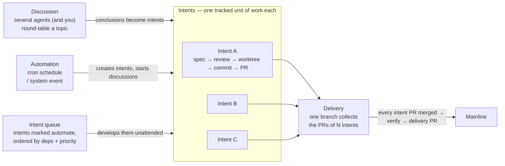

# c3 — Code Creative Center

An **AI workbench** that centrally manages and drives the work of multiple AI coding agents — Claude Code, Codex, and more — from one browser UI.

```
┌────────────┐       /ws        ┌──────────────────────────┐
│  Browser   │ ───────────────► │  Hono server (this app)  │
│  (Vue3)    │ ◄─── ws ───────  │   ↓ canUseTool callback  │
│            │                  │   ↓                      │
│ Allow/Deny │                  │  claude-agent-sdk        │
│  dialog    │                  │  codex-sdk               │
└────────────┘                  └──────────────────────────┘
                                          │ spawns
                                          ▼
                             `claude/codex` CLI binary
```

## Core workflow



- **Discussions are where intents come from.** Round-table a topic with several
  agents, then turn the conclusion into one or more intents — or write an intent
  directly if you already know what you want.
- **An intent is one tracked unit of work**: spec → read-only review → human
  approval → code in its own Git worktree → commit → PR.
- **A delivery is the integration unit.** Many intents point at one delivery; their
  PRs land on its branch, and once all of them are merged and you have verified the
  result, one delivery PR takes the batch to the mainline.
- **Automations and the intent queue drive the loop.** Automations fire on a cron or
  a system event to create intents and start discussions; the queue picks up every
  intent marked `automate` and develops them in dependency order, backing off and
  parking on failure.

## Features

- **Browser-mediated permission gateway** — approve/deny every sensitive tool use in the browser, not the terminal; optional multi-agent consensus voting.
- **Multi-vendor agents** — managed Claude Code / Codex CLIs under `~/.c3/vendor`, with per-role routing and a fallback chain.
- **Intents** — turn a prompt into a tracked intent with a dependency graph, its own sessions, and branch / commit / PR state.
- **Spec-driven development** — write spec → read-only review → human approval before any code; editing a spec invalidates its verdict.
- **Intent queue** — mark intents `automate` and a deterministic scheduler runs them in dependency order, backing off and parking on failure.
- **Worktree isolation** — each intent develops in its own Git worktree, so parallel work never fights over one checkout.
- **Multi-agent discussions** — several agents (and you) round-table a topic, then turn the conclusion into an intent.
- **Automations** — run agent work on a cron or on system events, chained, each in its own session.
- **Sandboxed runs** — opt-in process-level isolation via [arapuca](https://github.com/sergio-correia/arapuca): kernel MAC, deny-by-default paths, no containers.
- **Code browsing** — read-only branches, commits, diffs and Git status in the browser, with an embedded session to ask about the code.
- **Chat robots** — `@` an agent in a Feishu group (or DM) and get an answer back from an unattended c3 turn; only the final answer ever leaves c3.
- **Workcenter** — cross-workspace dashboard plus a notification inbox for answering permission prompts in one place.
- **Optional account auth** — username/password accounts with an admin gate (off by default; loopback-only otherwise).
- **External MCP access** — let your _own_ agents (an independent Claude Code / Codex session, a CI job) read this c3 over MCP with a long-lived API key, scoped to the workspaces you grant.
- **Single self-contained binary** — one native executable per platform. New releases download in the background; the header offers "restart to update", and `c3 upgrade` + `c3 restart` do the same from a terminal.
- **Desktop app** — download the installer from GitHub Releases, double-click, tray-resident. No terminal, no browser.

See [`doc/features.md`](doc/features.md) for the full feature tree.

<p align="center">
  
  
</p>
<p align="center">
  
  
</p>

## Usage

### CLI single binary

#### Homebrew

```bash
brew install sequencestream/tap/c3   # install
brew upgrade sequencestream/tap/c3   # update to the latest release
```

#### Download

Release binaries are published on **GitHub Releases**.

```bash
shasum -a 256 -c c3-cli-v0.18.0-macos-arm64.tar.gz.sha256
# c3-cli-v0.18.0-macos-arm64.tar.gz: OK
# or check every artifact at once:
shasum -a 256 -c SHA256SUMS
```

#### Run

```bash
./c3 --port 3000 --daemon
# open http://localhost:3000
```

c3 listens on **`127.0.0.1` only** unless you say otherwise. To accept LAN or
remote connections, choose the interface explicitly:

```bash
./c3 --port 3000 --host 0.0.0.0 --daemon
```

#### OS service (`c3 install` / `c3 uninstall`)

```bash
c3 install # registers c3 as a **per-user** OS service (no root/admin required) that runs
c3 start # under the platform's service manager. The current `--port`/`--host`/`--settings`
c3 uninstall # removes the current platform's registration and is idempotent. It **only**
```

### External MCP access

Point an agent c3 did not start — an independent Claude Code / Codex session, a
CI job, a monitoring script — at this deployment over MCP. The endpoint carries no
credential: the key rides `Authorization: Bearer`, the workspace rides
`X-C3-Workspace`.

```bash
export C3_MCP_KEY='c3k_…'   # from the one-time reveal; keep it out of the command line

# Claude Code
claude mcp add --transport http c3 "http://<host>:3000/mcp" \
  --header "Authorization: Bearer $C3_MCP_KEY" \
  --header "X-C3-Workspace: <workspace-name>"
```

```toml
# Codex CLI — ~/.codex/config.toml
[mcp_servers.c3]
url = "http://<host>:3000/mcp"
bearer_token_env_var = "C3_MCP_KEY"
env_http_headers = { "X-C3-Workspace" = "C3_MCP_WORKSPACE" }
```

```jsonc
// Cursor — ~/.cursor/mcp.json
{
  "mcpServers": {
    "c3": {
      "url": "http://<host>:3000/mcp",
      "headers": {
        "Authorization": "Bearer ${C3_MCP_KEY}",
        "X-C3-Workspace": "<workspace-name>",
      },
    },
  },
}
```

1. **Generate a key** in _Workspace Settings → External MCP access_. That page
   administers the key; it does not grant the workspace it lives on. Which
   workspaces the key reaches is decided by its owner's administrator-managed
   scope. The plaintext is shown **once** — it is stored only as a salted `scrypt`
   hash and can never be recovered, only replaced.
2. **Open the listener** with `--host` (above) if the client is on another machine.
   A non-loopback bind with no configured administrator makes `/mcp` answer 503
   until you configure one.
3. **Pick the workspace per session.** One key can serve every workspace its owner
   is allowed into; `X-C3-Workspace` chooses which one at initialization. Switching
   means starting a new session, not a new key.
4. **Grant write tools explicitly if needed.** A new key can only read:
   `find_intents`, `view_intent`, `find_discussions`, `view_discussion`,
   `publish_event`, plus `list_workspaces` / `whoami`, which report the key's own
   reach so a client never has to probe for it. Anything that changes c3 state
   (`save_intents`, `submit_spec_review`, `start_session_for_intent`, …) must be
   ticked in the key's tool scope, behind a risk confirmation — it really does
   change c3 state. A write may target another workspace in the key's reach with
   an optional `workspaceName` argument; every attempt is authorized again for
   that call and recorded in c3's write-audit trail.
5. **Revoke when done.** Revoking a key in Workspace Settings takes effect on its
   very next request and closes any MCP session it already had open.

> **Security.** Plain HTTP exposes the bearer token to anyone on the network. c3
> does not ship or require TLS: put it behind your own HTTPS reverse proxy before
> exposing it beyond the local machine, and suppress sensitive headers in its logs.
> c3 itself never logs the `Authorization` value.
>
> `X-C3-Workspace` is a c3 HTTP extension, not an MCP protocol field — MCP's
> Streamable HTTP transport defines protocol headers such as `Mcp-Session-Id` and
> leaves tenant selection to the application. Clients that cannot send arbitrary
> headers cannot use this endpoint, and there is no fallback. Claude.ai custom
> connectors need an OAuth-capable server, which c3 is not, so they are not
> supported by this static-key endpoint.

### Connect a Feishu bot

Bring c3's agents into a Feishu group: `@` the bot with a question, c3 runs one
unattended turn in the bot's own directory, and only the final answer goes back
to the chat — tool calls, intermediate reasoning, and file contents never leave
c3. Manage it in **Workcenter → Chat robots** (the "New robot" action is
admin-only).

1. **Create the app.**
   - **One-click (Feishu China region only).** Pick platform Feishu, click
     _Create Feishu app_, and scan the QR with an admin account (official Device
     Authorization). c3 registers a bot-only app with the minimum scope —
     `im:message:send_as_bot`, `im:message.group_at_msg:readonly`,
     `im:message.p2p_msg:readonly`, `application:bot.basic_info:read`, event
     `im.message.receive_v1` — and switches it to long-connection automatically.
     If that last step can't complete, you land in `manual_setup_required` with
     the credentials already filled in; finish step 2 by hand.
   - **Manual.** Create a bot app yourself at open.feishu.cn/app, grant the four
     scopes and the event above, then paste its App ID / App Secret into the form.
2. **Long connection, not a webhook.** In the app's _Event & Callback_ settings,
   set the subscription method to **long connection** and add the
   `im.message.receive_v1` event — the one-click path does this for you; a
   manually created app needs it checked by hand, or the bot connects but never
   receives messages.
3. **Pick vendor, agent, and tools.** Choose which vendor/agent runs the turn and
   tick its tool allowlist. A new robot defaults to read-only; write/exec tools
   need an explicit admin tick, one at a time.
4. **Enable it.** A new robot is created disabled. Enabling asks an admin to
   confirm the outbound reach (which chats/DMs it may answer in) once, on the
   record — skip that and the server refuses to enable it.
5. **Bind your IM identity.** Each sender links their Feishu account to their c3
   account once, from _Personal settings → IM identity_, before the bot will
   answer them; an unbound sender only gets a fixed instruction to bind.
6. **Talk to it.** Group chats require `@mention` by default; DMs are closed by
   default (`disabled` — switch to `allowlist` or `open` if you want them).

## Documentation

- **Handbook:** [English](handbook/README.md#english) |
  [简体中文](handbook/README.md#简体中文) — getting started guides for c3,
  discussions, multi-agent consensus, intents, SDD, and automation engineering.
- **[Development guide](develop.md)** — build from source, single binary, release
  pipeline, end-to-end tests, WebSocket protocol, and how permission interception works.
- **[`doc/`](doc/)** — architecture spec, ADRs, domain specs, and flows (the source of
  truth kept in sync with the code).

## License

[Apache-2.0](LICENSE).
