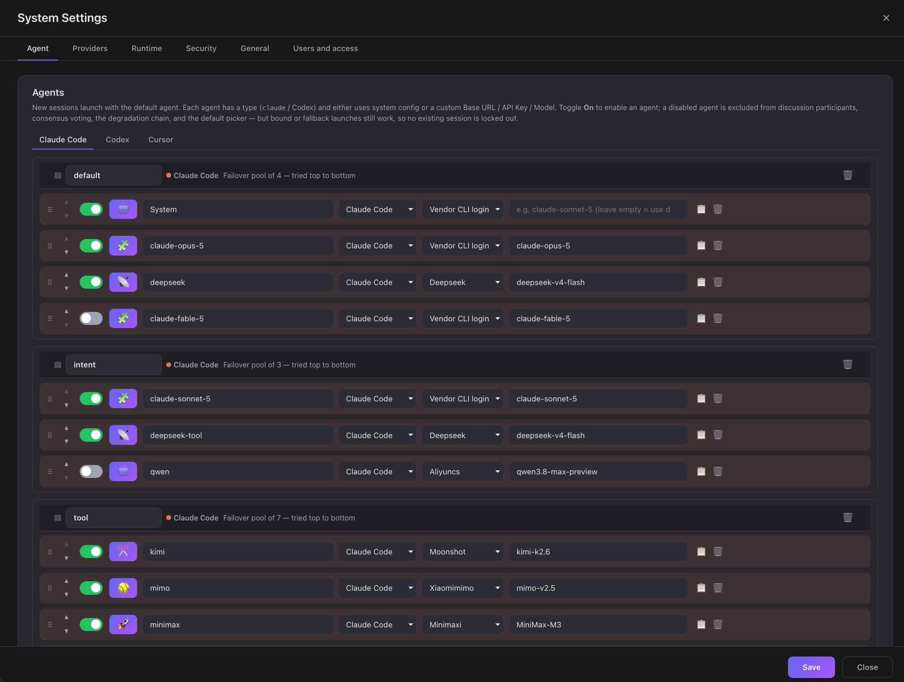
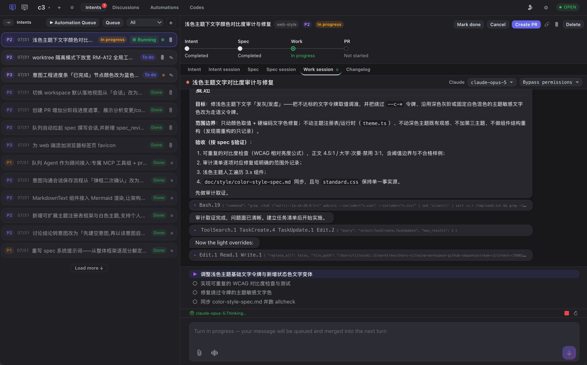
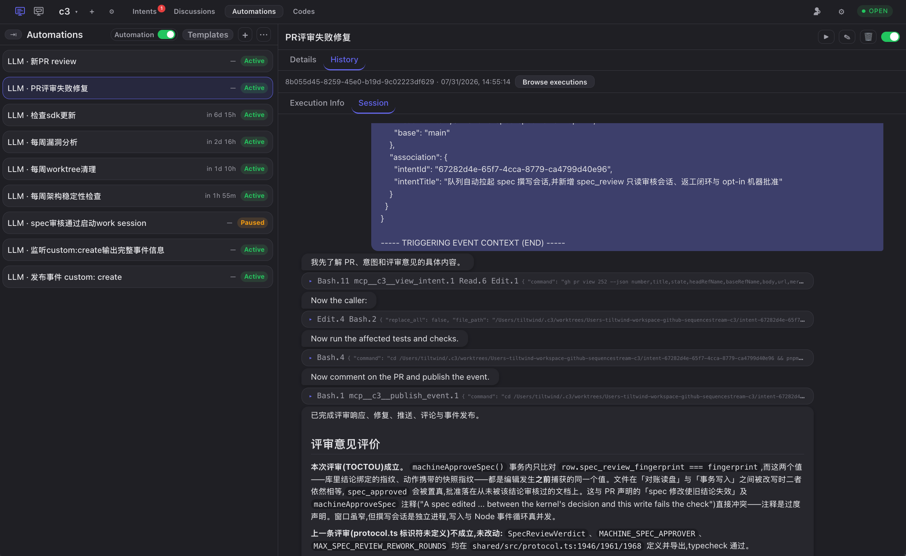
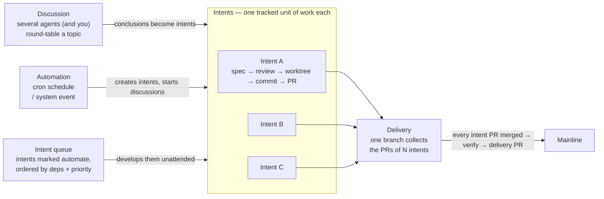

# c3 — Code Creative Center

An **AI workbench** that centrally manages and drives the work of multiple AI coding agents — Claude Code, Codex, and more — from one browser UI.

```
┌────────────┐       /ws        ┌──────────────────────────┐
│  Browser   │ ───────────────► │  Hono server (this app)  │
│  (Vue3)    │ ◄─── ws ───────  │   ↓ canUseTool callback  │
│            │                  │   ↓                      │
│ Allow/Deny │                  │  claude-agent-sdk        │
│  dialog    │                  │  codex-sdk               │
└────────────┘                  └──────────────────────────┘
                                          │ spawns
                                          ▼
                             `claude/codex` CLI binary
```

<p align="center">
  
  
</p>
<p align="center">
  
  
</p>

## Core workflow



- **Discussions are where intents come from.** Round-table a topic with several
  agents, then turn the conclusion into one or more intents — or write an intent
  directly if you already know what you want.
- **An intent is one tracked unit of work**: spec → read-only review → human
  approval → code in its own Git worktree → commit → PR.
- **A delivery is the integration unit.** Many intents point at one delivery; their
  PRs land on its branch, and once all of them are merged and you have verified the
  result, one delivery PR takes the batch to the mainline.
- **Automations and the intent queue drive the loop.** Automations fire on a cron or
  a system event to create intents and start discussions; the queue picks up every
  intent marked `automate` and develops them in dependency order, backing off and
  parking on failure.

## Features

- **Browser-mediated permission gateway** — approve/deny every sensitive tool use in the browser, not the terminal; optional multi-agent consensus voting.
- **Multi-vendor agents** — managed Claude Code / Codex CLIs under `~/.c3/vendor`, with per-role routing and a fallback chain.
- **Intents** — turn a prompt into a tracked intent with a dependency graph, its own sessions, and branch / commit / PR state.
- **Spec-driven development** — write spec → read-only review → human approval before any code; editing a spec invalidates its verdict.
- **Intent queue** — mark intents `automate` and a deterministic scheduler runs them in dependency order, backing off and parking on failure.
- **Worktree isolation** — each intent develops in its own Git worktree, so parallel work never fights over one checkout.
- **Multi-agent discussions** — several agents (and you) round-table a topic, then turn the conclusion into an intent.
- **Automations** — run agent work on a cron or on system events, chained, each in its own session.
- **Sandboxed runs** — opt-in process-level isolation via [arapuca](https://github.com/sergio-correia/arapuca): kernel MAC, deny-by-default paths, no containers.
- **Code browsing** — read-only branches, commits, diffs and Git status in the browser, with an embedded session to ask about the code.
- **Workcenter** — cross-workspace dashboard plus a notification inbox for answering permission prompts in one place.
- **Optional account auth** — username/password accounts with an admin gate (off by default; loopback-only otherwise).
- **External MCP access** — let your _own_ agents (an independent Claude Code / Codex session, a CI job) read this c3 over MCP with a long-lived API key, scoped to the workspaces you grant.
- **Single self-contained binary** — one native executable per platform. New releases download in the background; the header offers "restart to update", and `c3 upgrade` + `c3 restart` do the same from a terminal.
- **Desktop app** — download the installer from GitHub Releases, double-click, tray-resident. No terminal, no browser.

See [`doc/features.md`](doc/features.md) for the full feature tree.

## Usage

c3 ships in **two flavours from the same release** — pick one:

|          | **Desktop app (UI)**                         | **CLI single binary**                  |
| -------- | -------------------------------------------- | -------------------------------------- |
| Start it | install, then double-click                   | `./c3 --daemon`, then open a browser   |
| Window   | native WebView, tray-resident                | your browser                           |
| Best for | anyone who would rather not touch a terminal | servers, remote boxes, scripted setups |

Both drive the same backend and **share the same `~/.c3`** — settings, credentials,
workspaces, database and sessions. You can install both and switch freely; just don't
run them at the same time against the same data directory.

### Desktop app

Download the installer for your platform from
[**GitHub Releases**](https://github.com/sequencestream/c3/releases/latest)
(`.dmg` for macOS, `.msi` for Windows, `.deb` / `.AppImage` for Linux), install it and
double-click. Everything else — backend, port, window — is handled for you.

### CLI single binary

#### Homebrew

```bash
brew install sequencestream/tap/c3   # install
brew upgrade sequencestream/tap/c3   # update to the latest release
```

#### Download

Release binaries are published on **GitHub Releases**.

```bash
shasum -a 256 -c c3-v0.9.6-macos-arm64.sha256
# c3-v0.9.6-macos-arm64: OK
# or check every artifact at once:
shasum -a 256 -c SHA256SUMS
```

#### Run

```bash
./c3 --port 3000 --daemon
# open http://localhost:3000
```

c3 listens on **`127.0.0.1` only** unless you say otherwise. To accept LAN or
remote connections, choose the interface explicitly:

```bash
./c3 --port 3000 --host 0.0.0.0 --daemon
```

#### OS service (`c3 install` / `c3 uninstall`)

```bash
c3 install # registers c3 as a **per-user** OS service (no root/admin required) that runs
c3 start # under the platform's service manager. The current `--port`/`--host`/`--settings`
c3 uninstall # removes the current platform's registration and is idempotent. It **only**
```

### External MCP access

Point an agent c3 did not start — an independent Claude Code / Codex session, a
CI job, a monitoring script — at this deployment over MCP:

```bash
claude mcp add --transport http c3 "http://<host>:3000/mcp/<KEY>"
```

1. **Generate a key** in _Workspace Settings → External MCP access_. It is bound to
   that one workspace. The plaintext key is shown **once**, together with the full
   `/mcp/<KEY>` address and a ready-made command — copy it there and then; it is
   stored only as a salted `scrypt` hash and can never be recovered, only replaced.
2. **Open the listener** with `--host` (above) if the client is on another machine.
3. **Grant write tools explicitly if needed.** A new key can only read:
   `find_intents`, `view_intent`, `find_discussions`, `view_discussion`, plus
   `publish_event`. Anything that changes c3 state (`save_intents`,
   `submit_spec_review`, `start_session_for_intent`, …) must be ticked in the key's
   tool scope, behind a risk confirmation — it really does change c3 state.
4. **Revoke when done.** Revoking a key in Workspace Settings takes effect on its
   very next request and closes any MCP session it already had open.

> **Security.** The key IS the address and rides the URL path, so it can end up in
> proxy and access logs, and plain HTTP exposes it to anyone on the network. c3
> does not ship or require TLS: put it behind your own HTTPS reverse proxy before
> exposing it beyond the local machine, and avoid logging full request paths.

## Documentation

- **Handbook:** [English](handbook/README.md#english) |
  [简体中文](handbook/README.md#简体中文) — getting started guides for c3,
  discussions, multi-agent consensus, intents, SDD, and automation engineering.
- **[Development guide](develop.md)** — build from source, single binary, release
  pipeline, end-to-end tests, WebSocket protocol, and how permission interception works.
- **[`doc/`](doc/)** — architecture spec, ADRs, domain specs, and flows (the source of
  truth kept in sync with the code).

## License

[Apache-2.0](LICENSE).
