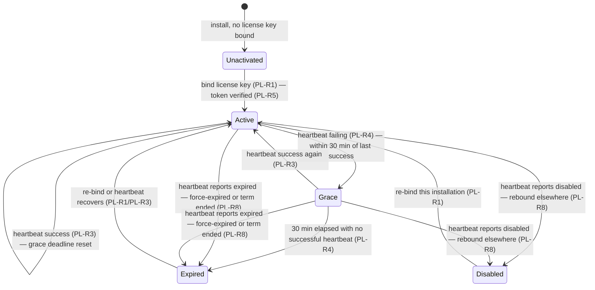

# product-license — Domain Spec

## Overview

product-license 域决定一个 c3 安装是否**具备商用授权**来创建
新工作,并向用户呈现该状态。权威的授权记录存放在独立的
**license-server(LS)** 中;c3 是**执行方**。绑定是**浏览器中转**的:c3
生成一个稳定的 `installId` 和一个每轮次的 `requestId`,打开浏览器跳转至 LS web,
用户在此登录(GitHub)并**选择自己的某个许可绑定**到该安装;随后 c3
通过携带相同 `(installId, requestId)` 轮询 **checkbind** 来收集绑定结果
(alive token + 签名的授权令牌),并周期性地携带 `installId` + alive token
发送**心跳**。在心跳之间以及经历短暂故障期间,c3 信任一个 **LS 签名的
授权令牌**,该令牌被**离线**验证(Ed25519),受限于距最近一次成功心跳的
**30 分钟离线宽限期**。

该域与 [auth](../../core/auth/auth-overview.md) 不同:auth 决定*谁*可以驱动
智能体(本地访问控制),product-license 决定*产品是否已付费*
(服务端权威的授权状态)。见 [ADR-0026](../../../architecture/adr/0026-product-licensing-separate-license-server.md)。

**范围:** 账户登录 + 默认免费许可发放(LS)、许可密钥绑定、心跳 + 离线降级、
离线令牌验证、新会话阻断、徽标/菜单呈现、续费支付 +
无退款流程(LS),以及管理员许可操作(LS)。
**边界:** 它不认证连接,不阻断单次工具调用,也从不打断正在进行的
运行或已有会话。

## Core entities

| Entity                                    | Description                                                                                                  | Key attributes                                                         |
| ----------------------------------------- | ------------------------------------------------------------------------------------------------------------ | ---------------------------------------------------------------------- |
| License                                   | 权威的、LS 持有的记录,表明某安装已获授权,带有一个期限与一个状态                                              | 许可身份、所有者、套餐、期限(有效期窗口)、状态(active/expired)         |
| License key                               | 用于标识一个许可的**随机、唯一、可共享的句柄**;用户在浏览器中**选择**它进行绑定。不是承载凭据;心跳时不携带   | 不透明值,每个许可唯一,仅在绑定时被引用                                 |
| Live binding                              | 一个许可与当前唯一使用它的安装之间的**独占**链接(一个安装也至多映射到一个许可)                               | 安装标识符(`installId`)、有效性令牌(alive token)、最近一次成功心跳时间 |
| Alive token                               | 绑定时生成、每次心跳携带的**每绑定承载凭据**;会轮换                                                          | 不透明的承载值(LS 只存储其哈希;绑定时向 c3 明文返回一次)               |
| Entitlement                               | c3 侧派生出的答案,回答"该安装现在能否创建新工作?"                                                            | 状态(见 § States)、最近一次成功心跳时间、宽限期截止时间                |
| Entitlement token                         | LS 签名的、可离线验证的授权断言,c3 会缓存并在心跳之间检查                                                    | 主体/安装绑定关系、有效期窗口、签名(Ed25519)                           |
| Plan                                      | LS 持有的公开目录中一个可购买的许可期限(对每个用户相同)                                                      | 稳定 id、名称、时长、价格(最小货币单位)+ 币种                          |
| Order                                     | LS 持有的购买记录,用于延长一个许可的期限与状态                                                               | 用户、套餐、其延长的许可、支付引用(微信支付)、无退款协议接受           |
| Plan tier                                 | license/token/status 携带的商用档位:`free` / `paid` / `enterprise`                                           | 免费限制、付费无限制、企业版语义边界                                   |
| Service agreement (incl. no-refund terms) | 《软件使用授权与服务协议(含无退款条款)》;其接受状态记录在支付前的订单上。无退款只是其中一条条款,而非整份协议 | 已接受标志、接受时间、协议版本                                         |

LS 拥有 Plan、License、License key、活跃绑定(alive token / installation /
alive time)以及 Order。c3 只持有派生出的 Entitlement 及缓存的
Entitlement token(以及分别作为句柄和心跳凭据使用的许可密钥与
alive token —— 二者都不能作为长期的授权证明)。

> **Note — sign-in & default license.** GitHub 登录**仅**用于登录/注册
> 账户,**不展示任何协议**(协议出现在续费/支付时,PL-R9)。首次
> 登录时 LS 创建账户并**自动发放一个默认许可**(PL-R14),用户随后
> 在浏览器中**选择**它来绑定——无需复制/粘贴许可密钥。续费流程会将
> 协议接受状态记录在订单上。

## Business rules

| ID     | Rule                                                                                                                                                                                                                                                                                                                                                                                                                                                                                                                                                                                                                                                                                                                                                                    |
| ------ | ----------------------------------------------------------------------------------------------------------------------------------------------------------------------------------------------------------------------------------------------------------------------------------------------------------------------------------------------------------------------------------------------------------------------------------------------------------------------------------------------------------------------------------------------------------------------------------------------------------------------------------------------------------------------------------------------------------------------------------------------------------------------- |
| PL-R1  | **激活是浏览器中转的,会将所选许可绑定到一个安装。** c3 生成一个稳定的 `installId`(≤128 字符)与一个每轮次的 `requestId`(32 字符),打开浏览器跳转至 LS,由登录的用户**选择自己的某个许可**进行绑定。LS 独占地记录该绑定(一个安装对应一个许可,一个许可对应一个安装——重新绑定会顶替之前的绑定)。浏览器 `bind` 响应只携带 `{status, termEnd}`;**alive token**(明文,仅一次)与签名的**授权令牌**通过 **S2S 经由 checkbind** 交付给 c3 server(从不经由浏览器)。授权令牌携带已签名的套餐档位。不为 `active` 的许可(状态为 `expired` 或期限已过)会被拒绝。                                                                                                                                                                                                                          |
| PL-R2  | **许可密钥是句柄,不是心跳凭据。** 心跳使用 **alive token**(每绑定承载凭据)进行认证,从不单独使用许可密钥。许可密钥可以被分享/展示;它从不证明授权,也无法单独完成一次心跳。                                                                                                                                                                                                                                                                                                                                                                                                                                                                                                                                                                                                |
| PL-R3  | **心跳确认并刷新。** c3 server 周期性地**仅**携带 installId 与 alive token(不带许可密钥)进行心跳。当 alive token 与该安装的活跃绑定匹配、且许可处于 active 且在期限内时,LS 会刷新最近成功时间,返回刷新后的签名授权令牌 + 期限截止时间,并指定下一次间隔。                                                                                                                                                                                                                                                                                                                                                                                                                                                                                                                |
| PL-R4  | **离线故障是降级,不是阻断。** 若心跳因非确定性的连通性原因(网络中断、LS 不可达、瞬时服务端错误、格式错误/未知响应)而失败,c3 会继续信任仍在有效期内的已签名令牌。连续失败超过 10 次后,生效套餐会被降级为 `free`,但授权仍可用。之后一次成功心跳会清零计数器并恢复已签名的档位。令牌窗口过期以及 LS 明确返回的 `expired`/`disabled` 判定仍然会阻断。                                                                                                                                                                                                                                                                                                                                                                                                                       |
| PL-R5  | **离线验证是信任的权威来源。** c3 只有在针对**内置的 LS 公钥**验证了授权令牌的 **Ed25519 签名**、并确认令牌处于其有效期窗口内之后,才会信任 `active`。缺失、格式错误、已过期或无法验证的令牌都被视为**未授权**(默认拒绝)。网络本身从不被信任来给出"active"的答案——只有有效签名才被信任。                                                                                                                                                                                                                                                                                                                                                                                                                                                                                 |
| PL-R6  | **阻断只影响新会话创建。** 当授权不为 `active` 时,c3 **拒绝创建新会话**。已有会话(包括空闲会话)仍可完全正常使用,**正在进行的运行从不被打断**(与 ADR-0006 一致:运行与连接解耦并得以存续)。阻断只停止*新*工作,从不影响*当前*工作。                                                                                                                                                                                                                                                                                                                                                                                                                                                                                                                                        |
| PL-R7  | **状态始终对用户可见。** 当前授权状态以**许可徽标**和**许可菜单**的形式向用户呈现,菜单提供激活、状态详情、购买/续费链接,以及(在未激活/已过期/已禁用时的)引导。当处于已授权状态(`Active`/`Grace`)且已知期限截止时间时,徽标还会展示**有效期/到期日期**(期限截止时间),让用户看到所购服务的运行时长;未知的期限截止时间(0)不渲染任何日期。在有效期日期旁,菜单提供一个**手动刷新**操作:它触发**一次立即心跳**,使控制台侧的续费立刻显示,而无需等待下一次计划心跳——刷新后的状态会被推送回来,日期随之更新。刷新是 **fail-soft** 的(网络/LS 错误从不阻断、也从不影响已缓存的期限);失败会在操作旁以内联、可读的错误呈现。限流仅在客户端进行(请求进行中禁用,加上一个最小冷却时间以防止快速点击)。徽标本身从不阻塞界面——阻断是在新会话创建时强制执行的(PL-R6),而非通过隐藏界面实现。 |
| PL-R8  | **顶替与过期通过心跳传播。** 若某次心跳的 alive token 与任何活跃绑定都不匹配(它已被重新绑定而轮换掉)或其 installId 未持有该绑定,则返回 `disabled`——该许可已被移到另一安装,因此该安装被阻断,且**无法通过离线来恢复**。当许可不再是 `active`(管理员将其强制到期,状态为 `expired`)或期限已结束时,心跳返回 `expired`。二者都无法被"等出来",因为*成功*的心跳会报告这个判定。                                                                                                                                                                                                                                                                                                                                                                                                 |
| PL-R9  | **无退款协议接受是必需的。** **服务协议(含无退款条款)**的接受状态在支付前记录**在订单上**。支付通过**微信支付**收取;支付成功的订单会续费或升级关联许可的期限、状态与档位。                                                                                                                                                                                                                                                                                                                                                                                                                                                                                                                                                                                              |
| PL-R10 | **不支持退款(MVP)。** 该产品是**虚拟/数字商品**;服务协议声明**不支持退款**。MVP 阶段**没有退款流程**——没有自动化或自助的退款路径。(拒付/滥用由管理员在带外通过**强制到期**许可来处理,PL-R8/PL-R11。)                                                                                                                                                                                                                                                                                                                                                                                                                                                                                                                                                                    |
| PL-R11 | **管理员操作在权威侧进行。** 通过 LS 后台的 **GitHub OAuth** 认证的许可管理员可以**发放**、**强制到期**(将状态设为 `expired`)以及**查看**许可、绑定与订单。管理员操作会改变权威记录;其效果只通过后续心跳传达给 c3(PL-R8)。c3 没有许可管理界面。                                                                                                                                                                                                                                                                                                                                                                                                                                                                                                                         |
| PL-R12 | **密钥按引用存储;c3 中只发布公钥。** c3 二进制只内嵌 LS 的**公开**验证密钥。签名密钥、OAuth 客户端密钥与支付凭据只存在于 LS 中(从不出现在 c3 二进制、授权缓存或任何 c3 配置中)。与 auth 域的密钥按引用存储原则(AUTH-R4)相呼应。                                                                                                                                                                                                                                                                                                                                                                                                                                                                                                                                         |
| PL-R13 | **绑定/心跳是幂等且 fail-soft 的,不影响当前工作。** 一次绑定或心跳失败绝不会导致 c3 崩溃,也绝不会打断正在运行的工作。绑定可以重试;瞬时心跳失败会在阈值之后降级套餐,而不是打断正在进行的工作。                                                                                                                                                                                                                                                                                                                                                                                                                                                                                                                                                                           |
| PL-R14 | **每个账户都有一个默认免费许可。** 首次 GitHub 登录时,LS 自动发放一个长期有效的 `tier='free'` 许可(全新的唯一密钥),因此账户始终有一个可供选择绑定的许可——无需手动创建,无需粘贴密钥,也不需要支付。                                                                                                                                                                                                                                                                                                                                                                                                                                                                                                                                                                       |
| PL-R15 | **订单有 15 分钟的支付窗口,并会被对账。** 一笔续费订单携带一个唯一的业务 `order_no`(`C3+YYYYMMDDHHmmssSSS+random4`),用作微信的 `out_trade_no`。它可支付 **15 分钟**(微信订单的 `time_expire`);一个 **20 分钟**周期的 LS 对账任务会针对每笔待处理订单查询微信并结算——SUCCESS→已支付(延长该许可),CLOSED→`expired`,否则保持待处理直至窗口过期。窗口过期的待处理订单会变为 `expired` 且永远不会延长许可,即便之后收到延迟的支付成功回调(幂等,PL-R9)。                                                                                                                                                                                                                                                                                                                        |
| PL-R16 | **续费上限为提前一年。** 若目标许可的期限截止时间已超过**当前时间起 12 个月**,结账会拒绝创建订单,因此有效期不能被无限叠加到很远的未来。                                                                                                                                                                                                                                                                                                                                                                                                                                                                                                                                                                                                                                 |

## States & transitions

c3 侧的 **Entitlement** 恰好处于以下状态之一:

- **Unactivated** —— 尚未绑定任何许可密钥,或授权缓存缺失/无法验证。
  新会话创建被**阻断**(PL-R6)。
- **Active** —— 一个在其窗口内、签名已验证的有效授权令牌,且最近一次
  成功心跳在宽限期窗口内。允许创建新会话。
- **Grace** —— 心跳当前正在失败,但最近一次成功尚不足 30 分钟。仍被
  视为 `active` 用于阻断判定(允许创建新会话)——该状态的存在是为了
  为信任划定边界。
- **Expired** —— 宽限期窗口已过而无成功心跳,或心跳报告了 `expired`,
  因为许可不再是 `active`(管理员将其强制到期)或期限已结束。
  新会话创建被阻断;恢复方式是重新绑定或一次能恢复的心跳(PL-R1/PL-R3)。
- **Disabled** —— 一次成功的心跳报告了 `disabled`,因为该许可已被
  重新绑定到另一安装(PL-R8)。新会话创建被阻断;恢复需要将该许可
  重新绑定到该安装。

就阻断而言,`Active` 与 `Grace` 允许创建新会话;`Unactivated`、`Expired`
与 `Disabled` 阻断新会话。在**任何**状态下,已有会话与正在进行的运行
都不受影响(PL-R6)。

### State derivation priority — cached verdict over token re-verification

派生状态由授权缓存按严格的优先级顺序计算,以保证一个仍在有效期内的
缓存令牌永远无法复活出一个心跳判定:

1. **终态心跳判定是权威的。** 一个缓存的 `Disabled` 或 `Expired`——由某次
   心跳依据 LS 的权威判定(PL-R8)或宽限期窗口耗尽(PL-R4)写入——会被
   原样返回,且**永远不会**被重新验证回 `Active`。缓存令牌的有效期窗口在
   这里无关紧要:管理员的强制到期或一次顶替不能因为离线、令牌期限尚未
   到期而被"等出来"。从这些状态恢复需要重新绑定(PL-R1)或一次能恢复的
   心跳(PL-R3),二者都会重写缓存状态。
2. **`Grace` 仅在其窗口内才算已授权。** 一个缓存的 `Grace` 在距最近一次
   成功心跳的 30 分钟离线窗口未过期时保持已授权;窗口过期后,即便下一次
   心跳尚未写入该转换(例如重启后第一次心跳落地之前),派生结果也会
   报告 `Expired`。
3. **Offline baseline(无心跳判定)。** 只有当缓存状态为 `Active`/`Unactivated`
   时,派生才会回退到离线令牌验证(PL-R5):缺失/无法验证的令牌 ⇒
   `Unactivated`,已验证但超出窗口的令牌 ⇒ `Expired`,已验证且在窗口内
   的令牌 ⇒ `Active`。这正是让一个过期的陈旧 `Active` 缓存在跨重启的
   期限失效后被降级的机制,且从不会将一个终态判定升级。

## Gating enforcement boundary

PL-R6 将新会话创建定义为阻断点,但运行时存在多个会话创建入口。该意图
在**唯一的用户驱动控制台入口**处强制执行该阻断,并明确将自动化/意图内部
的入口排除在外(它们的阻断是一个独立的、此处未做出的决策)。

| Entry point                                                            | Kind      | Gated?       | Rationale                                                                                     |
| ---------------------------------------------------------------------- | --------- | ------------ | --------------------------------------------------------------------------------------------- |
| `create_session`(works)—— 用户打开一个新的控制台聊天                   | `session` | **Yes**      | 用户驱动的新工作创建;这是强制执行点。拒绝时不写任何待处理行,不铸造任何运行时,不切换任何视图。 |
| `open_intent_chat` / `refine_intent` / `discussion_to_intent`(intents) | `intent`  | No(排除在外) | 意图工具的**沟通**会话;意图工作流自身的阻断策略在此刻意未做决定。                             |
| `start_intent_dev` dev session(intents)                                | `session` | No(排除在外) | 从意图自动启动的开发会话;一个自动化的、非用户发起的入口。                                     |
| automation / discussion run sessions(intent automation)                | `session` | No(排除在外) | 计划/自动化的运行;非用户发起。                                                                |
| `dev-turn` 程序化 turn(wiring)                                         | `session` | No(排除在外) | 内部程序化启动。                                                                              |

**Refusal contract(`create_session`)。** 当 `currentLicenseStatus().entitled`
为 false 时(`Unactivated`/`Expired`/`Disabled`),处理程序会发送一个结构化的
`license.notEntitled` 错误,其 `reason` 携带授权**状态**(以便 web 本地化
原因说明并指向续费入口——许可徽标),并**在任何副作用之前**返回:不写
`session_metadata` 待处理行,不 `ensureRuntime`,不 `removeViewer`/切换视图。
处于已授权状态(`Active`/`Grace`)时创建照常进行。正确性依赖于上述状态
派生优先级:一个终态心跳判定永远不会被重新验证回已授权,因此一个被
强制到期/顶替的许可无法通过离线来绕过该阻断。

## No-refund policy

该产品作为**虚拟/数字商品**出售。**服务协议(含无退款条款)**的接受状态
在支付前记录在订单上(PL-R9);协议声明该产品不支持退款。MVP 刻意
不提供**退款流程**(PL-R10)——这是一个非目标,而非遗漏。争议、拒付与
滥用由管理员在带外通过**强制到期**该许可来处理(PL-R11),该操作通过
心跳以 `expired` 传播给 c3(PL-R8)。

## Renewal payment(微信支付 Native)

续费支付通过**微信支付 Native**收取——一种扫码支付的二维码,适合
PC web 用户的场景(PL-R9)。一笔 `pending` 订单驱动一次**统一下单**,
生成一个二维码;用户用微信扫码,微信将结果**异步**上报给 LS 的
支付回调。

- **验证是安全边界。** LS 只有在针对微信平台证书**验证其签名**并用
  商户 APIv3 密钥**解密**之后,才会信任一个支付结果。一个无法验证或
  解密的结果——伪造或篡改的"支付成功"——会被**拒绝**,且**不推进
  任何订单**(PL-R12)。这与授权令牌的规范(PL-R5)相呼应:信任
  来自密码学检查,而不是来自"请求到达了"这一事实。
- **支付成功的订单会延长许可。** 一次验证通过的成功会将订单从
  `pending → paid` 转换,在订单上记录微信交易引用,并**延长关联许可的
  期限截止时间与状态**:`term_end = GREATEST(term_end, now) + duration_months`
  (从两者中较晚的一个开始推算——保留剩余的有效期或从当前时间重新开始),
  `status = 'active'`(若已过期则重新激活);任何其他交易状态都将订单
  标记为 `failed`。
- **幂等。** 微信会重发回调直到收到确认,因此应用该回调是**幂等**的——
  重发的成功不会重复延长许可。
- **凭据仅存在于 LS 中。** 商户密钥、APIv3 密钥与证书只存在于 LS 中;
  它们从不被持久化在订单上、从不在响应中返回、也从不写入日志(PL-R12)。
  唯一保留的支付相关信息是订单上的**交易引用**。

MVP **仅支持 Native**(不支持 JSAPI/H5/小程序),**没有对账**,**没有
退款**(PL-R10)。契约形态(端点、请求头、确认应答信封)记录在
[license-server API 契约](../../../shared/api-conventions/license-server-api.md)中。

## Admin operations(license-server)

管理员通过 GitHub OAuth 在 LS 后台认证(PL-R11),可以:

- **发放**一个许可(例如用于人工或赠送销售)。
- **强制到期**一个许可——将其状态设为 `expired`(拒付、滥用或等同退款的处理)。
- **查看**许可、绑定与订单。

管理员的变更只改变权威的 LS 记录;c3 在下一次心跳时观察到该效果。
c3 不暴露**任何**许可管理界面。

## Security invariants

- **信任来自签名,而非网络(PL-R5)。** 无法通过篡改流量注入伪造的
  "active"——c3 会针对内置公钥离线验证 Ed25519 签名。
- **验证失败时默认拒绝(PL-R5)。** 一个无法验证/已过期/缺失的令牌 ⇒
  未授权。这与"从不杀死正在进行的工作"相平衡:其后果只是阻断**新**
  会话(PL-R6),从不打断正在运行的会话。
- **许可密钥是句柄,不是凭据(PL-R2)。** 许可密钥标识一个许可,可以
  被分享/展示;只有每绑定的 alive token 能认证一次心跳。
- **独占绑定,轮换的凭据(PL-R8)。** 一个许可一次只绑定一个安装;
  alive token 在每次(重新)绑定时轮换,LS 只存储其哈希。被顶替的安装
  会在其下一次心跳中被报告为 `disabled`,且无法通过离线"等出"宽限期。
- **c3 中只有公钥(PL-R12)。** 没有任何签名密钥、OAuth 密钥或支付
  凭据会出现在 c3 二进制中或存在于其配置/缓存中。

## User scenarios

- **登录 + 激活:** 给定一个未激活的安装,当 c3 打开浏览器且用户
  用 GitHub 登录 LS(不展示协议)时,LS 创建账户并自动发放一个默认
  许可(PL-R14);用户在浏览器中**选择**该许可绑定该安装(PL-R1);
  c3 server 通过 checkbind 收集 alive token + 签名令牌,验证该令牌
  (PL-R5),进入 `Active`,徽标显示已授权。
- **常规心跳:** 给定一个已激活的安装,当一次心跳成功时,那么
  宽限期截止时间重置,刷新后的令牌被缓存(PL-R3)。
- **短暂故障:** 给定 LS 短暂不可达,当心跳失败持续不足 30 分钟时,
  那么 c3 保持在 `Grace`,新会话仍然被允许(PL-R4);恢复后回到 `Active`。
- **持续失效:** 给定心跳失败超过 30 分钟,当宽限期窗口过期时,
  那么授权变为 `Expired`,**新会话创建被阻断**,而已有会话继续
  正常工作(PL-R4/PL-R6)。
- **顶替:** 给定同一许可密钥被绑定到第二个安装,当该安装的下一次
  心跳报告 `disabled` 时,那么它失效为阻断状态,且无法通过离线恢复
  (PL-R8);已有的正在进行的运行仍会完成(PL-R6)。
- **强制到期:** 给定管理员强制该许可到期(状态 `expired`),当下一次
  心跳报告 `expired` 时,那么 c3 失效为阻断状态;已有的正在进行的
  运行仍会完成(PL-R8/PL-R6)。

### Anti-scenarios(必须永远不会发生)

- 当授权为 `Unactivated`、`Expired` 或 `Disabled` 时,新会话
  必须**永远不会**被创建(PL-R6)。
- 阻断必须**永远不会**打断正在进行的运行,或使已有会话不可用(PL-R6)。
- c3 必须**永远不会**信任一个 Ed25519 签名无法针对内置公钥验证的
  授权令牌所给出的 `active`(PL-R5)。
- 许可密钥单独必须**永远不会**被接受为心跳凭据;只有每绑定的
  alive token 能认证一次心跳(PL-R2)。
- 签名密钥、OAuth 客户端密钥或支付凭据必须**永远不会**出现在 c3
  二进制中或存在于其配置/缓存中(PL-R12)。
- 用户必须**永远不会**在未记录接受服务协议(含无退款条款)的情况下
  进入支付(续费/升级)(PL-R9)。
- 一个验证不通过(签名错误)或解密不通过(APIv3 密钥错误)的支付回调
  必须**永远不会**将订单标记为已支付或延长许可——伪造的"支付成功"
  不能被信任(PL-R12)。

## Non-goals

- **没有退款流程(MVP)** —— 虚拟商品;由服务协议(含无退款条款)规定(PL-R10)。
- **没有多租户/组织账户** —— 授权绑定到一个安装,而非一个组织。
- **c3 中没有许可管理界面** —— 管理员操作只存在于 LS(PL-R11)。
- **不是一种认证提供方** —— product-license 从不作为一个 `AuthProvider`
  分支表达,也从不并入 auth 运行时(ADR-0026)。
- **没有按工具计费的授权** —— 授权阻断的是新会话创建,而非单个能力。

## Domain events / interactions

- **web-console** —— 渲染许可**徽标**与**菜单**、激活入口(打开 LS
  浏览器流程以登录并选择许可)、状态详情,以及购买/续费链接;通过
  c3 WebSocket 接收授权状态呈现([shared protocol](../../../shared/api-conventions/websocket-protocol.md))。
- **session-registry** —— 在**新会话创建**时通过 `create_session` 处理程序
  (works feature)被查询:一个被阻断的授权会在写入任何待处理行/运行时
  之前拒绝创建(PL-R6,见 § Gating enforcement boundary)。注册表的已有
  会话与运行生命周期在其他方面不受影响;意图内部与自动化的会话创建
  路径不在该阻断的范围内。
- **license-server(external)** —— 权威的授权记录;c3 通过
  [license-server API 契约](../../../shared/api-conventions/license-server-api.md)调用它以
  进行 checkbind 与心跳(并打开 LS 浏览器流程以进行登录 + 选择许可);LS
  web 承载账户登录、默认许可发放、续费支付 + 无退款流程,以及管理员后台。
- **auth domain** —— **独立**。product-license 既不读取也不写入 auth
  状态;阻断与当前生效的认证提供方无关(ADR-0026)。

## Data dictionary

- **Entitled / Gated** —— "已授权" = 授权允许新会话创建(`Active`/`Grace`);
  "被阻断" = 新会话创建被拒绝(`Unactivated`/`Expired`/`Disabled`)。
- **Offline grace** —— 最近一次成功心跳之后的 30 分钟窗口,期间即便
  心跳持续失败,c3 也将授权视为有效(PL-R4)。
- **Activation / binding** —— 在浏览器中选择一个许可来绑定一个安装
  (c3 通过 `checkbind` 收集结果),产出第一个签名的授权令牌 + alive
  token(PL-R1)。
- **License key** —— 在 c3 ↔ LS API 上标识一个许可的随机、唯一、可
  共享的句柄;不是承载凭据(PL-R2)。
- **Alive token** —— 每绑定的承载凭据,在每次(重新)绑定时轮换,每次
  心跳都携带;LS 只存储其哈希(PL-R3/PL-R8)。
- **Entitlement cache** —— 磁盘上的小型存储,保存缓存的授权令牌、
  许可密钥与 alive token;以 **0600** 权限写入,以保护该承载凭据
  不被同一台机器上的其他用户获取。
- **free tier** —— 登录时发放的默认长期有效许可档位。它不是一个可
  购买的目录套餐,并在运行时受限:5 个工作区、1 个活跃 worktree、
  2 个非组织者的讨论参与者、2 个已启用的自动化,且无法启用 sandbox。
- 见 [glossary](../../../glossary.md) 了解 license-server、Entitlement、
  Entitlement token、License key、Alive token、License badge、Session
  gating 与 Service agreement(incl. no-refund terms)。
