```mermaid
stateDiagram-v2
    [*] --> Idle: runtime created (create/select)
    Idle --> Running: user_prompt
    Running --> AwaitingPermission: permission_request
    AwaitingPermission --> Running: decision resolved
    Running --> Idle: turn_end (complete/error) or stop_run
    AwaitingPermission --> Idle: stop_run
    Running --> Reconnecting: socket disconnect, gate clear (AS-R18/R19)
    Reconnecting --> Running: single auto-resume (resume: runId, backoff elapsed)
    Reconnecting --> Idle: stop_run during backoff
    Running --> Idle: socket disconnect refused/exhausted ⇒ turn_end error (AS-R18)
    Running --> Team: team tool used (team_upgraded)
    Team --> Team: turn_end (lead turn done; process stays alive) / user_prompt (push)
    Team --> Running: user_prompt resumes a lead turn
    Team --> AwaitingPermission: permission_request
    Team --> Idle: stop_run (only)
    Idle --> [*]: delete_session / remove_workspace
```

# agent-session — 领域规格

## Overview

一个 agent session 把用户 prompt 转变为一次 Claude Agent SDK `query()` 运行,流式传输该运行的
活动,通过 [permission-gateway](../permission-gateway/permission-gateway-spec.md) 门控敏感工具,
并让用户通过权限模式和中断来引导这次运行。

一次运行**并不**绑定于启动它的浏览器连接。每个会话都有一个
进程范围的 **Session Runtime** 拥有其运行;连接只是对某个
会话的一个**视图**(它当前观察的是哪个)。切换视图或关闭 socket 从不会停止
运行——它会在后台继续进行,而一个返回的视图会回放已发生的一切
(ADR 0006)。不同的会话**并发**运行,没有固定上限;单个会话是
**串行的**(一次一个 turn)——但持久化的 **agent team** 会话除外,其中 lead
进程在各 turn 之间保持存活,用户可以向其中继续推入更多 turn(AS-R13/R14)。

每次运行都以**流式输入模式**(一个受控的 async-iterable prompt)驱动 SDK,
而非一次性字符串。一个普通会话在 `result` 上通过关闭流来结束每个 turn 的
底层进程(因此下一个 turn 会恢复一个全新的进程——即一次性行为);一个
team 会话则保持流打开,使 lead 进程比该 turn 存活得更久(ADR 0008)。

运行的上下文——工作目录(`cwd`)、起始权限模式、以及 `resume`
session id——来自 runtime,由
[session-registry](../session-registry/session-registry-spec.md) 播种。

**范围:** 运行生命周期(开始、流式传输、结束、停止)、后台执行与回放缓冲、
权限模式策略、会话连续性(`resume`)、持久化 agent-team 会话、实时
状态、以及把 SDK 消息忠实映射为线事件。**边界:** 不决定个别权限
(gateway)、不管理工作区/会话注册表(session-registry)、不渲染 UI
(web-console)。

## Core entities

| Entity          | Description                                                                                   |
| --------------- | --------------------------------------------------------------------------------------------- |
| Session Runtime | 进程范围内某个会话执行的所有者:其运行、用于回放的 `baseline + buffer`、当前 viewers、以及状态 |
| Agent Run       | 由一个用户 prompt 驱动的一次 `query()` 调用                                                   |
| Run Handle      | 对进行中运行的实时控制:设置权限模式,以及把下一个用户 turn 推入实时 team 会话                  |
| Connection View | 一个 WebSocket 连接对其当前观察会话的订阅(分发实时事件;加入时回放)                            |

见 [agent-session-models.md](agent-session-models.md)。

## Business rules

| ID     | Rule                                                                                                                                                                                                                                                                                                                                                                                                                                                                                                                                                                                                                                                                                                                                                                                                                                                                                                                                                                                                                                                                                                                                                                                                      |
| ------ | --------------------------------------------------------------------------------------------------------------------------------------------------------------------------------------------------------------------------------------------------------------------------------------------------------------------------------------------------------------------------------------------------------------------------------------------------------------------------------------------------------------------------------------------------------------------------------------------------------------------------------------------------------------------------------------------------------------------------------------------------------------------------------------------------------------------------------------------------------------------------------------------------------------------------------------------------------------------------------------------------------------------------------------------------------------------------------------------------------------------------------------------------------------------------------------------------------- |
| AS-R1  | 一个 `user_prompt` 会针对所观察会话的 runtime 启动一次新的 Agent Run,带上该会话的 `cwd`、权限模式,以及(对既有会话而言)`resume` id。该 prompt 会作为 `user_text` 回显到流中,以便每个 viewer(以及切回后的回放)都能看到它。**该回显只携带可见的 turn 内容**——用户自己的输入加上提供给模型的业务上下文(intent body、spec body、依赖说明、spec-path 说明)。任何为受 preset 约束的会话注入的**内部系统指令**(intent analyst 角色、spec-authoring 契约、work-session instruct)是通过其系统上下文送达模型的,而非通过此回显,因此它从不作为可见聊天消息渲染,也不会读起来像是用户输入的(见 intent-management 内部/可见边界,RM-R25)。一个 slash-command development skill 是唯一必须随模型的用户 turn 展开的内部载体;它仍然被排除在 `user_text` 回显之外。                                                                                                                                                                                                                                                                                                                                                                                                                                                            |
| AS-R2  | 一个会话是**串行的**:每个会话最多一个 Agent Run 在进行中。若某会话的 turn 已在进行中,针对该会话的 `user_prompt` 会以 `error` 被拒绝且不启动任何东西。不同会话**并发**运行,没有固定上限。                                                                                                                                                                                                                                                                                                                                                                                                                                                                                                                                                                                                                                                                                                                                                                                                                                                                                                                                                                                                                  |
| AS-R3  | 权限模式是**按会话**的(由 runtime 拥有,镜像到 session-registry)。运行以该会话的模式启动;`set_mode` 只改变所观察会话的模式。                                                                                                                                                                                                                                                                                                                                                                                                                                                                                                                                                                                                                                                                                                                                                                                                                                                                                                                                                                                                                                                                               |
| AS-R10 | 一次运行会报告其 SDK session id(来自 `init` 消息),使 pending 会话绑定到一个真实 id,后续 prompt 通过 `resume` 继续它。绑定会**重新键入** runtime(buffer、viewers、run 随之移动);一个恢复的运行保持同一个 id。在同一时刻,session→agent 事实被冻结到运行该会话的 agent 上,把其**vendor** 固定住直到该会话结束(agent-config AC-R16, ADR-0015)——这里之所以相关,是因为一个会话的转录只存在于该 vendor 自己的原生存储中,所以 vendor 之后永远不能改变。                                                                                                                                                                                                                                                                                                                                                                                                                                                                                                                                                                                                                                                                                                                                                           |
| AS-R4  | 若所观察会话有一个进行中的运行,`set_mode` 会立即应用于它;否则会在该会话的下一次运行时生效。变更以 `mode_changed` 确认。                                                                                                                                                                                                                                                                                                                                                                                                                                                                                                                                                                                                                                                                                                                                                                                                                                                                                                                                                                                                                                                                                   |
| AS-R5  | 模式决定哪些工具调用是敏感的,从而抵达 gateway。`bypassPermissions` 授权所有工具自动执行;`acceptEdits` 自动接受 edit 类工具;`default`/`auto`/`plan` 按 SDK 分类器把敏感调用路由给 gateway。                                                                                                                                                                                                                                                                                                                                                                                                                                                                                                                                                                                                                                                                                                                                                                                                                                                                                                                                                                                                                |
| AS-R6  | 一次运行只能被 `stop_run`(所观察会话)、`delete_session` 或 `remove_workspace` 停止——从不因切换视图或关闭 socket 而停止。停止会中断底层的 `query()`;一个已完成或尚未开始流式传输的运行会被无害地中断。                                                                                                                                                                                                                                                                                                                                                                                                                                                                                                                                                                                                                                                                                                                                                                                                                                                                                                                                                                                                     |
| AS-R7  | 一次运行以恰好一个终止性结果结束:`turn_end` 带 `reason: 'complete'`(SDK 产生了一个 result,或运行被停止)或 `reason: 'error'`(一个异常)。`turn_end` 从不意味着会话结束——它仍为下一个 prompt 保持存活。                                                                                                                                                                                                                                                                                                                                                                                                                                                                                                                                                                                                                                                                                                                                                                                                                                                                                                                                                                                                      |
| AS-R8  | 关闭连接只会取消订阅其视图;运行会**在其 runtime 中于后台继续**。重新连接并选择该会话会回放完整记录并恢复实时投递。                                                                                                                                                                                                                                                                                                                                                                                                                                                                                                                                                                                                                                                                                                                                                                                                                                                                                                                                                                                                                                                                                        |
| AS-R9  | 只有模型的文本 block、tool-use block 和 tool-result block 会被映射到线协议;其他 SDK 消息种类被忽略。                                                                                                                                                                                                                                                                                                                                                                                                                                                                                                                                                                                                                                                                                                                                                                                                                                                                                                                                                                                                                                                                                                      |
| AS-R11 | 每个实时事件都记录在 runtime 中:追加到其 `buffer` 并通过 `emit` 分发给当前的 viewers。一个加入某会话的视图会先回放 `baseline`(runtime 创建时的磁盘快照)再回放 `buffer`,因此完整记录被重建,且没有重复。                                                                                                                                                                                                                                                                                                                                                                                                                                                                                                                                                                                                                                                                                                                                                                                                                                                                                                                                                                                                    |
| AS-R12 | 每个 runtime 都有一个状态——`idle`、`running`、`awaiting_permission`、`team` 或 `reconnecting`。任何变更都会向**所有**连接广播 `session_status`,以便后台化的会话能显示其状态。                                                                                                                                                                                                                                                                                                                                                                                                                                                                                                                                                                                                                                                                                                                                                                                                                                                                                                                                                                                                                             |
| AS-R13 | 每次运行都以**流式输入模式**驱动 SDK:该 prompt 是一个用用户第一个 turn 播种的受控 async-iterable,而不是一次性字符串。这使 SDK 控制通道保持存活(以便 `set_mode`/stop 真正抵达运行),并让一个 turn 的进程能比单次 `result` 存活更久(ADR 0008)。                                                                                                                                                                                                                                                                                                                                                                                                                                                                                                                                                                                                                                                                                                                                                                                                                                                                                                                                                              |
| AS-R14 | 一次运行在运行时被识别为持久化的 **agent team**:当第一个**team 工具**被使用时,runtime 被标记为 `team` 一次,并发出 `team_upgraded`。team 工具是 `TeamCreate`、`SendMessage`,或一个后台 `Agent`(`run_in_background === true`);前台 `Agent` **不是**(它在该 turn 内完成)。检测发生在该 turn 的 `result` 之前。                                                                                                                                                                                                                                                                                                                                                                                                                                                                                                                                                                                                                                                                                                                                                                                                                                                                                               |
| AS-R15 | 在 `result` 上,运行发出 `turn_end { reason: 'complete' }`。一个**非 team**运行随后关闭其输入流——底层进程退出,下一个 prompt 恢复一个全新进程(一次性行为)。一个 **team** 运行保持其输入打开:lead 进程在各 turn 之间保持存活以协调队友,因此运行仍处于进行中(状态为 `team`,而非 `idle`)。                                                                                                                                                                                                                                                                                                                                                                                                                                                                                                                                                                                                                                                                                                                                                                                                                                                                                                                     |
| AS-R16 | 一个 team 会话**只有**在用户明确停止它时(`stop_run` / `delete_session` / `remove_workspace`)才会结束:中止会关闭输入流,这是关闭一个 team 流的唯一方式(它从不自动关闭)。没有自动的 team 拆除检测——"team lead 已完成" 被等同于用户明确停止。                                                                                                                                                                                                                                                                                                                                                                                                                                                                                                                                                                                                                                                                                                                                                                                                                                                                                                                                                                 |
| AS-R17 | 当一个会话处于 `team` 状态时,一个 `user_prompt` 既**不**被拒绝,也**不**启动第二个运行;它会作为 `user_text` 回显,并作为下一个用户 turn 推入实时的 lead 会话(不 `resume`,不新建进程)。即使 lead 正在 turn 中途,用户也可以发送——SDK 会把它排队。(对非 team 会话,AS-R2 仍然成立。)                                                                                                                                                                                                                                                                                                                                                                                                                                                                                                                                                                                                                                                                                                                                                                                                                                                                                                                            |
| AS-R18 | 一个**普通**用户会话的 turn 若以 `socket connection was closed unexpectedly` 失败(一个窄的分类器,与降级链分类器**分离**——一次 socket disconnect 从不进入降级候选集合),会在一个 3–5 秒的有界退避之后,把**同一个**运行自动 `resume` **一次**,`resume` 到同一个运行 id,以保留完整上下文(从不新建会话)。该重试**被限定为每个 turn 一次**;在退避期间状态保持在 `reconnecting`。若 resume 成功,该 turn 的 `turn_end` 会携带 `reconnect_attempted: true`(以及 `retry_count`)。若自动 resume 被拒绝(AS-R19)、被禁用(自动 resume 设置关闭)、没有真实 session id、该会话是 team/intent,或单次重试已被用掉,该 turn 以 `turn_end { reason: 'error' }` 结束(携带原始错误和门控结论)并结算到 `idle`——用户手动继续(一个普通的 `user_prompt` 会恢复同一会话)。从不静默挂起(AVAIL-1/AVAIL-7)。                                                                                                                                                                                                                                                                                                                                                                                                                             |
| AS-R20 | **Keepalive 环境注入**(socket-disconnect 的*预防*层——方案 E 的第一道防线,与 AS-R18/R19 的恢复层配对)。每个由某次运行派生的 Claude Code 子进程都会得到一组固定的传输韧性环境变量——`CLAUDE_CODE_REMOTE_SEND_KEEPALIVES=true`、`BUN_CONFIG_HTTP_IDLE_TIMEOUT`、`BUN_CONFIG_HTTP_RETRY_COUNT`——用以从源头降低 `socket connection was closed unexpectedly` 的*发生率*。它们以**最低优先级**注入:用户(shell 环境)或活跃 agent(其 env 覆盖)显式设置的同名值总是优先(用户优先)。它们即使对系统 agent(没有覆盖)也适用。与自动 resume 解耦——它独立发布,只改变子进程 env,从不改变 resume/gate 逻辑。                                                                                                                                                                                                                                                                                                                                                                                                                                                                                                                                                                                                                 |
| AS-R19 | **工具副作用门控**(自动 resume 的守卫):从 SDK 消息流中,c3 通过配对 `tool_use`↔`tool_result` 来推断 turn 中途的状态。若在断线时刻,一个**side-effect-class** 的 `tool_use` 仍处于打开状态(尚无 `tool_result`),则 `side_effect_pending` 为 true,自动 resume 被**拒绝**(一次写入可能已半途应用)。该分类是**保守的**:只有 `Read/Grep/Glob/LS/NotebookRead/WebFetch/WebSearch/TaskCreate/TaskList/TaskUpdate/TaskGet/AskUserQuestion` 是无副作用的;**其他所有**——`Write/Edit/MultiEdit/NotebookEdit/Bash` 以及任何未知/MCP 工具——都算作 side-effect 工具。这个偏向是刻意的:宁可错过一次自动 resume(回落到手动继续),也不要在一次可能的写入之后错误地自动 resume。                                                                                                                                                                                                                                                                                                                                                                                                                                                                                                                                                |
| AS-R22 | **降级链是同厂商的**(2026-06-06-006)。fallback 链只保留与该会话当前 agent(attempt 0)**相同厂商**的链上 agent;不同厂商的条目会被**跳过**,从不被启动。跨厂商降级无法携带上下文(一个 Claude 会话不能 `resume` 到 Codex——SDK 会报错),否则运行循环会在 Claude CLI 下启动错误的厂商。同厂商降级不受影响(`sonnet → haiku` 的 fallback 会打开一个全新的同厂商会话;降级从不 resume,无论如何——每次尝试都是一个全新的 SDK 会话)。被跳过的条目会被记录,并在链耗尽时通过 `all_agents_failed` 呈现,使控制台能如实说明跨厂商候选无法(也未曾)被尝试。**已推迟:** 通过一条**重放种子路径**在厂商间携带上下文——用规范转录作为 prompt 播种一个新的目标厂商会话,UI 标记该上下文为不连续的——已经规格化,但尚未构建(SDK 层面的 resume 屏障使无缝交接不可能;等真正的需求出现再构建)。                                                                                                                                                                                                                                                                                                                                                                                                                                             |
| AS-R23 | **手动同厂商 agent 切换**(2026-06-07-001)。当当前 agent 无法工作(token 耗尽 / 被限流 / 宿主二进制抖动)时,用户可以通过标题栏切换器把会话重新指向另一个**同厂商** agent(`set_session_agent` 改写 session→agent 事实),而不丢失上下文。这是 AS-R22 的手动版本:它从**相同**的同厂商规则中解析候选(该规则由降级链和共识投票者共享),因此切换器只提供同厂商、宿主二进制存在、已启用的对等 agent——跨厂商变更会被拒绝(`session_agent_changed` 报告失败,事实不变;vendor 被冻结,AC-R17)。该切换只改写事实;它**不**重新启动——会话的下一个 `user_prompt` 会用新 agent 通过不变的启动路径恢复同一次运行(一个真实 id ⇒ `resume` 到同一个运行 id,AS-R1)。审计跟随最后一个有效的 agent(被改写的事实)。候选集合 + 一个当前不可用标记会搭载在 selection reply 的 agent-switch 数据中(仅在存在真实、非 comm 会话且有可行动内容可提供时才出现)。                                                                                                                                                                                                                                                                                                                                                                                |
| AS-R25 | **降级链在内核事件总线上被事件化**(2026-06-08, ADR-0018)。在三个节点,launcher 会在内核事件总线上发布一个 **bypass** 事件,_在_——而不是替代——既有控制流和线帧*之外*:一个 **agent-error** 事件(单个 agent 失败;在可降级错误的收集点发布,携带会话/工作区/agent 身份、错误,以及一个可降级标记)、一个 **agent-fallback** 事件(前进到链上下一个 agent;在 fallback 步骤发布,携带 from/to agent id 和名称),以及一个 **agent-all-failed** 事件(链耗尽;与线上的 `all_agents_failed` 一起发布,携带失败列表 + 任何被跳过的跨厂商条目)。这使得除了硬编码的"切到下一个 agent" 之外的动作(触发一次自动化、通知讨论引擎、审计)能够以订阅方式挂在 agent 失败上,在注册时配置,无需改动 launcher。降级链**零行为变化**:线上的 `agent_failed`(仍只在一次全新的 fallback 前进时发出)/`all_agents_failed` 帧、resume-决策状态机,以及候选集合构建器都未被触及(它们的契约测试保持绿色)。订阅者的抛出被总线隔离(同步、每处理器 try/catch——ADR-0018),因此它们永远不会抵达运行循环。可降级标记目前始终为 true(只有可降级错误路径被事件化;一次不可降级的基础设施抛出仍走既有的 catch 路径,尚未被事件化——该标记为此扩展保留)。发布调用点是薄薄的一行代码,建立在纯 payload 构建器之上,像 resume 决策 / 候选集合构建器一样有单元测试覆盖。 |

## States & transitions

### Session Runtime status(进程范围,按会话)

切换视图和关闭连接**不会**改变 runtime 状态——运行会在后台继续
运行(AS-R8)。状态变更会广播 `session_status`(AS-R12)。`Team`
状态使 lead 进程在各 turn 之间保持存活;它只有在用户明确
停止时才回到 `Idle`(AS-R15/R16)。

### Connection View

```mermaid
stateDiagram-v2
    [*] --> None: connection open
    None --> Viewing: create_session / select_session (subscribe; replay baseline+buffer)
    Viewing --> Viewing: select other (unsubscribe old, subscribe new)
    Viewing --> [*]: connection close (unsubscribe only; run survives)
```

### Agent Run

```mermaid
stateDiagram-v2
    [*] --> Streaming: query() created (streaming-input prompt)
    Streaming --> Streaming: assistant_text / tool_use / tool_result / permission_request
    Streaming --> Streaming: result while team (input stays open; awaits next turn)
    Streaming --> Complete: SDK result message (non-team ⇒ input closed)
    Streaming --> Errored: exception (and not stopped)
    Streaming --> Stopped: stop_run / delete / workspace removal (input closed + interrupt)
    Complete --> [*]
    Errored --> [*]
    Stopped --> [*]
```

对一个 team 运行来说,一个 `result` 结束该*turn*(发出 `turn_end`)但不结束该*运行*——输入
流保持打开,lead 进程持续运行直到被停止(AS-R15/R16)。

## Permission modes

| Mode                | Meaning for tool gating                                                         |
| ------------------- | ------------------------------------------------------------------------------- |
| `default`           | SDK 只对敏感工具调用 gateway;只读工具自动允许。                                 |
| `auto`              | 类似 default,但更偏向于在 SDK 认为安全时自动推进。                              |
| `plan`              | 计划模式;agent 提出方案而不执行变更。                                           |
| `acceptEdits`       | edit 类工具自动接受;其他敏感工具仍被门控。                                      |
| `bypassPermissions` | 所有工具自动执行;不咨询 gateway。需要用户明确选择(constitution C-SEC-2/SEC-7)。 |

具体分类由 SDK 拥有;c3 选择模式并将其呈现出来。

> **Vendor 维度(ADR-0011)。** 上述五种模式是 Claude 的权限模式,
> 也是今天的 wire/UI 表面。在其下面,一个厂商中立的适配层引入了一个中立的
> **agent driver**,gateway 变为一个中立的**审批桥接**,历史记录变为一个中立的**会话
> 存储**,五路模式被简化为一个中立的网格(action mode plan/build × 一个 tool gate),
> 每个 adapter 都把它转换出来。逐厂商的分歧(Codex 没有逐工具审批;只有 Claude
> 会 fork/流式传输)存在于一个被探测出来的**能力账本**中,而不在这份规格的模式表里。Codex 被
> 路由通过中立 driver,而 Claude 路径保持逐字节不变:当会话的 vendor 是非 Claude 时,启动会分叉
> 到 driver 路由,从头到尾练习中立 driver / 审批
> 桥接 / 会话存储接口。driver 路由会解析该会话 agent 的启动
> 覆盖(model / base URL / API key / env 覆盖 + 仅 codex 才有的策略),并把它们编入
> driver start。对于普通的 Codex 工作运行,该启动层会推导出所属工作区的
> 集中化 specs 根目录,并将其作为唯一的额外可写目录传入。Codex adapter 把它
> 映射为 `--add-dir`,而所有其他工作目录之外的路径都留在 Codex 可写
> 根目录之外。对于 Codex **spec** 运行,driver 会额外把 cwd 本身移动到集中化 specs
> 根目录,并强制 `workspace-write` + `approval_policy=never`;因为 Codex 总是把 cwd 当作一个
> 可写根且没有只读 cwd 原语,这就是那道硬边界,使项目
> 源码和账本 DB 留在可写根目录之外,同时仍允许 `spec.md` 的写入。若那道 cwd /
> specs-root 边界无法建立,启动会失败关闭,而不是回落到一个
> 项目可写的 cwd。driver 路由刻意是*最小*路由——没有降级链、
> socket 自动 resume、共识或 intent profile(那些是 Claude 特有的)。Codex 没有逐工具
> 审批(008),因此其审批桥接从不触发;agent 启动时的沙箱模式/审批
> 策略就是门控。没有厂商 SDK 类型跨入中立表面或共享协议
> (ADR-0009);每个 SDK 只活在它自己的厂商 adapter 内部。

> **宿主二进制门控(ADR-0012)。** 在能力问题之前,一个厂商的**宿主 CLI 必须
> 在 PATH 上**——agent 作为该子进程运行,无法被打包进 c3 的单一二进制中。
> 解析该厂商的启动器二进制是第一道能力门控:adapter 注册表只有在其二进制能被解析时
> 才会构造该厂商的 adapter,因此一个缺失的 CLI 意味着该 agent 类型只是
> 不可用(去安装它;这是一个产品约定,以指引呈现,而非一个运行错误)。
> Claude 二进制发现(`$CLAUDE_PATH`,否则 PATH 查找)是该门控在 Claude 上的实例。

> **本地 MCP 服务器监督者。** 一个其 MCP 能力需要一个长期存活本地服务器的厂商会得到
> 一个 SDK 未提供的监督者——SDK 在 spawn 之后就放弃了它(静默崩溃,无
> 健康检查,无重启)。该监督者:(1)拥有 spawn;(2)把服务器放入它
> **自己的进程组**,以便拆除时能收割整棵进程树,并有退出/中断/终止的
> 兜底 ⇒ 无孤儿,无端口泄漏;(3)对服务器**健康轮询**并以有界退避**自动重启**。一个
> 纯客户端厂商(无 spawn/健康检查/重启/kill)绕过宿主二进制门控。**惰性启动 +
> 一等公民状态(2026-06-07-003, AS-R24)**:启动时的开机现在是 best-effort 的(adapter
> 无条件被构建,以便服务器能在首次需要时启动);一个 ensure-running 步骤会在监督者内部
> 惰性地(重新)启动,若失败会降级为一个临时不可用状态,并在后台
> **自我修复**,而不是把该厂商标记为永久死亡——一个宕机的服务器是
> 诚实降级,而非致命的。监督者 + adapter 在组合根处构建一次,并
> 注入到启动路径中。

> **规范信封 + c3 会话命名空间(ADR-0013)。** 厂商中立的消息信封
> (vendor、session id、可选 turn id、role、blocks、timestamp、可选 pre-approved 标记、可选
> vendor-extra)被提升到线协议(不含 SDK):线协议只增加一个 `vendor` 维度,从不
> 增加逐厂商的 schema。Block 以**id-upsert** 方式追加,以(session id, block id)为键,
> 因此一个厂商的原地消息更新事件(例如 Codex 的 item-updated)都会折叠为"原地修订,而不是
> 堆叠";一个工具的返回会折入 tool-use block 的 result 中(没有独立的 `tool_result` block——
> 011 D3)。**审批/权限*请求*事件停留在这个模型之外**——它们走审批桥接
> 流,以便信封永远不会变成一个上帝类型。唯一的例外是顶层的**pre-approved
> 审计标记**(2026-06-06-003):一个 c3 从未决定过的厂商规则引擎自动允许,会被打上戳
> 记到信封上(在累加器中是粘性的)以供审计轨迹使用——一个标记,而非一个决策通道。
> 会话通过一个**不透明的、无厂商信息的 session id** 寻址(vendor 加上
>
> - vendor 原生 session id 的一个确定性摘要);一个厂商 id 永远不会进入 URL 或存储键。一个**只读的**
>   惰性归一化访问器包装了逐厂商的会话存储——每个厂商的原生存储保持为
>   事实来源,从不被双写(不透明 id → 原生引用 索引是一个可重建的运行时
>   缓存)。实时线帧和 web URL/存储尚未接入这个模型(已推迟)。

## Domain events(wire)

发出 `mode_changed`、`user_text`、`assistant_text`、`tool_use`、`tool_result`、`turn_end`、
`team_upgraded`(一次性,在检测到 team 时——AS-R14)以及 `session_status`(运行状态
广播)。消费 `user_prompt`、`set_mode`、`stop_run`、`ping`。代表 gateway 转发 `permission_request`。向 session-registry 报告运行的 SDK session id
(session-registry 会发出 `session_started`)。工作区/会话事件(`ready`、
`workspaces`、`sessions`、`session_selected`)属于
[session-registry](../session-registry/session-registry-spec.md)。形状见
[共享协议](../../../shared/api-conventions/websocket-protocol.md)。

## User scenarios

- **并发会话:** 给定会话 A 上有一个运行进行中,当用户选择会话 B
  并提交一个 prompt 时,那么两个运行都会并发执行;两者都不会被停止。
- **切走再切回:** 给定会话 A 正在运行,当用户查看 B 然后回到 A 时,
  那么 A 自开始以来的完整活动(prompt、输出、任何待处理权限)会被回放,
  实时投递恢复。
- **停止(反例场景):** 选择另一个会话或关闭 socket **绝不能**停止
  一次运行(AS-R6/AS-R8);只有 `stop_run`/`delete_session`/`remove_workspace` 可以。
- **会话内串行(反例场景):** 若某会话的 turn 正在进行中,第二个
  `user_prompt` **绝不能**为该会话启动第二个并发运行(AS-R2)。
- **Team 形成:** 给定一次运行使用了一个 team 工具(创建一个 team、发送一条队友消息,或
  生成一个后台 `Agent`),当该 turn 的 `result` 到达时,那么该会话被标记为
  `team`,`team_upgraded` 被广播,lead 进程保持存活而不是退出。
- **Team 下一个 turn:** 给定一个 `team` 会话,当用户提交另一个 prompt 时,那么它被
  回显并推入实时的 lead 会话(不新建进程,不 `resume`);lead 在
  同一上下文中继续。
- **Team 只在停止时结束(反例场景):** 一个 `team` 会话**绝不能**在
  lead 的 `turn_end` 上掉到 `idle`;它只在明确的 `stop_run` / `delete_session` / `remove_workspace`
  时结束(AS-R16)。
- **Socket 断线,安全状态:** 给定一个普通会话的 turn 在模型正在产生文本时(没有打开的写
  `tool_use`)掉了 socket,当门控清晰时,那么 c3 会短暂退避(状态 `reconnecting`)
  并自动 `resume` 同一次运行一次;该 turn 以 `reconnect_attempted: true` 完成,
  完整上下文完好无损(AS-R18)。
- **Socket 断线,危险状态(反例场景):** 给定一个 turn 在一个
  `Edit`/`Write`/`Bash` `tool_use` 仍未关闭时掉了 socket,c3 **绝不能**自动 resume;它会以
  `turn_end { reason: 'error', side_effect_pending: true }` 结束该
  turn,结算到 `idle`,让用户手动继续——这会恢复同一会话(AS-R18/R19)。
- **有界重连(反例场景):** 一个 turn **绝不能**自动 resume 超过**一次**,而
  一次被拒绝/耗尽的断线**绝不能**静默挂起——它总是会发出一个终止性的
  `turn_end`(AVAIL-1/AVAIL-7)。

## Interactions

- **permission-gateway** — 从运行的 `canUseTool` 中被调用;在
  解析之前阻塞运行。一个待处理的请求在切走时仍然存活(决策以 `requestId` 为键)。
- **Claude Agent SDK** — `query()` 提供该运行,由一个流式输入 prompt
  驱动(AS-R13);`setPermissionMode` 和 `interrupt` 引导它(仅在流式输入
  模式下生效)。关闭输入流会结束 query。
- **Claude Code agent teams** — SDK 的一个特性,其 team 工具(`TeamCreate` / `SendMessage` /
  背景 `Agent`)会把一个会话升级为一个持久化的 team(AS-R14)。
- **claude CLI** — 由 SDK 作为 agent 进程生成;从 `$CLAUDE_PATH`
  或 PATH 中解析。

## Data dictionary

- **In-flight run** — 一个带有实时 Run Handle 的 Streaming Agent Run。
- **settingSources: ['user', 'project']** — 继承用户/项目设置的选项
  (hook、allow/deny 规则、Skills、`CLAUDE.md`);c3 是其上层的 gateway(ADR 0005)。
