# agent-session — Domain Spec

## Overview

An agent session turns a user prompt into a Claude Agent SDK `query()` run, streams the run's
activity, gates sensitive tools through the [permission-gateway](../permission-gateway/permission-gateway-spec.md),
and lets the user steer the run via permission mode and interruption.

A run is **not** bound to the browser connection that started it. Each session has a
process-wide **Session Runtime** that owns its run; a connection is only a **view** onto a
session (which one it currently watches). Switching the view or closing the socket never stops
a run — it keeps going in the background, and a returning view replays everything that happened
(ADR 0006). Different sessions run **concurrently** with no fixed cap; a single session is
**serial** (one turn at a time) — except a persistent **agent team** session, where the lead
process stays alive between turns and the user may push further turns into it (AS-R13/R14).

Every run drives the SDK in **streaming-input mode** (a controlled async-iterable prompt)
rather than a one-shot string. A normal session ends each turn's underlying process by closing
the stream on `result` (so the next turn resumes a fresh process — the one-shot behaviour); a
team session keeps the stream open so the lead process outlives the turn (ADR 0008).

The run's context — working directory (`cwd`), starting permission mode, and the `resume`
session id — comes from the runtime, seeded by the
[session-registry](../session-registry/session-registry-spec.md).

**Scope:** run lifecycle (start, stream, end, stop), background execution & replay buffering,
permission-mode policy, session continuity (`resume`), persistent agent-team sessions, live
status, and faithful mapping of SDK messages to wire events. **Boundary:** it does not decide individual permissions (gateway),
does not manage the workspace/session registry (session-registry), and does not render UI
(web-console).

## Core entities

| Entity          | Description                                                                                                         |
| --------------- | ------------------------------------------------------------------------------------------------------------------- |
| Session Runtime | Process-wide owner of one session's execution: its run, `baseline + buffer` for replay, current viewers, and status |
| Agent Run       | One `query()` invocation driven by one user prompt                                                                  |
| Run Handle      | Live controls over an in-flight run: set permission mode, and push the next user turn into a live team session      |
| Connection View | One WebSocket connection's subscription to the session it currently watches (delivers live events; replays on join) |

See [agent-session-models.md](agent-session-models.md).

## Business rules

| ID     | Rule                                                                                                                                                                                                                                                                                                                                                                                                                                                                                                                                                                                                                                                                                                                                                                                                                                                                                                                                                                                                                                                                                                                                                                                                                                                                                                                                                                                                                                                                                                                                                                                                                                                                                                                                                            |
| ------ | --------------------------------------------------------------------------------------------------------------------------------------------------------------------------------------------------------------------------------------------------------------------------------------------------------------------------------------------------------------------------------------------------------------------------------------------------------------------------------------------------------------------------------------------------------------------------------------------------------------------------------------------------------------------------------------------------------------------------------------------------------------------------------------------------------------------------------------------------------------------------------------------------------------------------------------------------------------------------------------------------------------------------------------------------------------------------------------------------------------------------------------------------------------------------------------------------------------------------------------------------------------------------------------------------------------------------------------------------------------------------------------------------------------------------------------------------------------------------------------------------------------------------------------------------------------------------------------------------------------------------------------------------------------------------------------------------------------------------------------------------------------- |
| AS-R1  | A `user_prompt` starts a new Agent Run against the viewed session's runtime, with that session's `cwd`, permission mode, and (for an existing session) `resume` id. The prompt is echoed into the stream as `user_text` so every viewer (and switch-back replay) shows it. **The echo carries the VISIBLE turn content only** — the user's own input plus the business context provided to the model (intent body, spec body, dependency note, spec-path note). Any **internal system instruction** injected for a preset-constrained session (the intent analyst role, the spec-authoring contract, the work-session instruct) reaches the model through its system context, NOT this echo, so it never renders as a visible chat message nor reads as if the user typed it (see the intent-management internal/visible boundary, RM-R25). A slash-command development skill is the one internal carrier that must ride the model's user turn to expand; it is still kept out of the `user_text` echo.                                                                                                                                                                                                                                                                                                                                                                                                                                                                                                                                                                                                                                                                                                                                                         |
| AS-R2  | A session is **serial**: at most one Agent Run is in flight per session. A `user_prompt` for a session whose turn is already in flight is rejected with `error` and starts nothing. Different sessions run **concurrently** with no fixed cap.                                                                                                                                                                                                                                                                                                                                                                                                                                                                                                                                                                                                                                                                                                                                                                                                                                                                                                                                                                                                                                                                                                                                                                                                                                                                                                                                                                                                                                                                                                                  |
| AS-R3  | Permission mode is **per session** (owned by the runtime, mirrored to session-registry). A run starts in the session's mode; `set_mode` changes only the viewed session's mode.                                                                                                                                                                                                                                                                                                                                                                                                                                                                                                                                                                                                                                                                                                                                                                                                                                                                                                                                                                                                                                                                                                                                                                                                                                                                                                                                                                                                                                                                                                                                                                                 |
| AS-R10 | A run reports its SDK session id (from the `init` message) so a pending session binds to a real id and subsequent prompts `resume` it. Binding **re-keys** the runtime (buffer, viewers, run move with it); a resumed run keeps the same id. At the same instant the session→agent fact is frozen onto the agent that ran, pinning its **vendor** for the session's life (agent-config AC-R16, ADR-0015) — relevant here because a session's transcript lives only in that vendor's native store, so the vendor can never change afterward.                                                                                                                                                                                                                                                                                                                                                                                                                                                                                                                                                                                                                                                                                                                                                                                                                                                                                                                                                                                                                                                                                                                                                                                                                     |
| AS-R4  | A `set_mode` applies to the viewed session's in-flight run immediately if one exists; otherwise it takes effect on that session's next run. The change is confirmed with `mode_changed`.                                                                                                                                                                                                                                                                                                                                                                                                                                                                                                                                                                                                                                                                                                                                                                                                                                                                                                                                                                                                                                                                                                                                                                                                                                                                                                                                                                                                                                                                                                                                                                        |
| AS-R5  | The mode determines which tool calls are sensitive and thus reach the gateway. `bypassPermissions` authorizes auto-execution of all tools; `acceptEdits` auto-accepts edit-class tools; `default`/`auto`/`plan` route sensitive calls to the gateway per the SDK classifier.                                                                                                                                                                                                                                                                                                                                                                                                                                                                                                                                                                                                                                                                                                                                                                                                                                                                                                                                                                                                                                                                                                                                                                                                                                                                                                                                                                                                                                                                                    |
| AS-R6  | A run is stopped only by `stop_run` (the viewed session), `delete_session`, or `remove_workspace` — never by switching the view or closing the socket. Stopping interrupts the underlying `query()`; a run already finished or not yet streaming is interrupted harmlessly.                                                                                                                                                                                                                                                                                                                                                                                                                                                                                                                                                                                                                                                                                                                                                                                                                                                                                                                                                                                                                                                                                                                                                                                                                                                                                                                                                                                                                                                                                     |
| AS-R7  | A run ends with exactly one terminal outcome: `turn_end` with `reason: 'complete'` (the SDK produced a result, or the run was stopped) or `reason: 'error'` (an exception). `turn_end` never means the session ended — it stays alive for the next prompt.                                                                                                                                                                                                                                                                                                                                                                                                                                                                                                                                                                                                                                                                                                                                                                                                                                                                                                                                                                                                                                                                                                                                                                                                                                                                                                                                                                                                                                                                                                      |
| AS-R8  | Closing the connection only unsubscribes its view; the run **continues in the background** in its runtime. Reconnecting and selecting the session replays the full record and resumes live delivery.                                                                                                                                                                                                                                                                                                                                                                                                                                                                                                                                                                                                                                                                                                                                                                                                                                                                                                                                                                                                                                                                                                                                                                                                                                                                                                                                                                                                                                                                                                                                                            |
| AS-R9  | Only the model's text blocks, tool-use blocks, and tool-result blocks are mapped to the wire; other SDK message kinds are ignored.                                                                                                                                                                                                                                                                                                                                                                                                                                                                                                                                                                                                                                                                                                                                                                                                                                                                                                                                                                                                                                                                                                                                                                                                                                                                                                                                                                                                                                                                                                                                                                                                                              |
| AS-R11 | Every live event is recorded in the runtime: appended to its `buffer` and fanned out to current viewers via `emit`. A view joining a session replays `baseline` (on-disk snapshot at runtime creation) then `buffer`, so the full record is reconstructed with no duplication.                                                                                                                                                                                                                                                                                                                                                                                                                                                                                                                                                                                                                                                                                                                                                                                                                                                                                                                                                                                                                                                                                                                                                                                                                                                                                                                                                                                                                                                                                  |
| AS-R12 | Each runtime has a status — `idle`, `running`, `awaiting_permission`, `team`, or `reconnecting`. Any change broadcasts `session_status` to **all** connections so backgrounded sessions surface their state.                                                                                                                                                                                                                                                                                                                                                                                                                                                                                                                                                                                                                                                                                                                                                                                                                                                                                                                                                                                                                                                                                                                                                                                                                                                                                                                                                                                                                                                                                                                                                    |
| AS-R13 | Every run drives the SDK in **streaming-input mode**: the prompt is a controlled async-iterable seeded with the user's first turn, not a one-shot string. This keeps the SDK control channel live (so `set_mode`/stop genuinely reach the run) and lets a turn's process outlive a single `result` (ADR 0008).                                                                                                                                                                                                                                                                                                                                                                                                                                                                                                                                                                                                                                                                                                                                                                                                                                                                                                                                                                                                                                                                                                                                                                                                                                                                                                                                                                                                                                                  |
| AS-R14 | A run is recognized as a persistent **agent team** at runtime: when the first **team tool** is used, the runtime is marked `team` once and `team_upgraded` is emitted. A team tool is `TeamCreate`, `SendMessage`, or a background `Agent` (`run_in_background === true`); a foreground `Agent` is **not** (it finishes within the turn). Detection happens before that turn's `result`.                                                                                                                                                                                                                                                                                                                                                                                                                                                                                                                                                                                                                                                                                                                                                                                                                                                                                                                                                                                                                                                                                                                                                                                                                                                                                                                                                                        |
| AS-R15 | On `result`, the run emits `turn_end { reason: 'complete' }`. A **non-team** run then closes its input stream — the underlying process exits and the next prompt resumes a fresh one (the one-shot behaviour). A **team** run keeps its input open: the lead process stays alive between turns to coordinate teammates, so the run remains in flight (status `team`, not `idle`).                                                                                                                                                                                                                                                                                                                                                                                                                                                                                                                                                                                                                                                                                                                                                                                                                                                                                                                                                                                                                                                                                                                                                                                                                                                                                                                                                                               |
| AS-R16 | A team session ends **only** when the user explicitly stops it (`stop_run` / `delete_session` / `remove_workspace`): aborting closes the input stream, which is the sole way a team's stream is closed (it never auto-closes). There is no automatic team-teardown detection — "team lead is done" is equated with explicit user stop.                                                                                                                                                                                                                                                                                                                                                                                                                                                                                                                                                                                                                                                                                                                                                                                                                                                                                                                                                                                                                                                                                                                                                                                                                                                                                                                                                                                                                          |
| AS-R17 | While a session is `team`, a `user_prompt` is **not** rejected and does **not** start a second run; it is echoed as `user_text` and pushed as the next user turn into the live lead session (no `resume`, no new process). The user may send even while the lead is mid-turn — the SDK queues it. (For non-team sessions AS-R2 still holds.)                                                                                                                                                                                                                                                                                                                                                                                                                                                                                                                                                                                                                                                                                                                                                                                                                                                                                                                                                                                                                                                                                                                                                                                                                                                                                                                                                                                                                    |
| AS-R18 | A **normal** user session whose turn fails with `socket connection was closed unexpectedly` (a narrow classifier, **separate** from the degradation-chain classifier — a socket disconnect never enters the degradation candidate set) auto-`resume`s the **same** run **once**, after a bounded 3–5s backoff, with `resume` to the same run id so the full context is preserved (never a fresh session). The retry is **bounded to one per turn**; during the backoff the status holds at `reconnecting`. If the resume succeeds, the turn's `turn_end` carries `reconnect_attempted: true` (and `retry_count`). If auto-resume is refused (AS-R19), disabled (the auto-resume setting off), there is no real session id, the session is a team/intent, or the single retry is already spent, the turn ends with `turn_end { reason: 'error' }` (carrying the original error and the gate verdict) and settles to `idle` — the user continues manually (a normal `user_prompt` resumes the same session). Never silently hangs (AVAIL-1/AVAIL-7).                                                                                                                                                                                                                                                                                                                                                                                                                                                                                                                                                                                                                                                                                                              |
| AS-R20 | **Keepalive env injection** (the socket-disconnect _prevention_ layer — scheme E's first line of defence, paired with the AS-R18/R19 recovery layer). Every Claude Code child a run spawns receives a fixed set of transport-resilience env vars — `CLAUDE_CODE_REMOTE_SEND_KEEPALIVES=true`, `BUN_CONFIG_HTTP_IDLE_TIMEOUT`, `BUN_CONFIG_HTTP_RETRY_COUNT` — to lower the _rate_ of `socket connection was closed unexpectedly` at the source. They are injected with **lowest priority**: a same-named value the user (the shell environment) or the active agent (its env overrides) set explicitly always wins (user priority). They apply even to the system agent (which has no overrides). Decoupled from auto-resume — it ships independently and changes only the child env, never the resume/gate logic.                                                                                                                                                                                                                                                                                                                                                                                                                                                                                                                                                                                                                                                                                                                                                                                                                                                                                                                                              |
| AS-R19 | **Tool side-effect gate** (the auto-resume guard): from the SDK message stream, c3 infers mid-turn state by pairing `tool_use`↔`tool_result`. If, at disconnect time, a **side-effect-class** `tool_use` is still open (no `tool_result` yet), `side_effect_pending` is true and auto-resume is **refused** (a write may have half-applied). The classification is **conservative**: only `Read/Grep/Glob/LS/NotebookRead/WebFetch/WebSearch/TaskCreate/TaskList/TaskUpdate/TaskGet/AskUserQuestion` are side-effect-free; **everything else** — `Write/Edit/MultiEdit/NotebookEdit/Bash` and any unknown / MCP tool — counts as a side-effect tool. The bias is deliberate: rather miss an auto-resume (fall back to manual continue) than wrongly auto-resume after a possible write.                                                                                                                                                                                                                                                                                                                                                                                                                                                                                                                                                                                                                                                                                                                                                                                                                                                                                                                                                                         |
| AS-R22 | **The degradation chain is vendor-homogeneous** (2026-06-06-006). The fallback chain keeps only chain agents of the **same vendor** as the session's current agent (attempt 0); a different-vendor entry is **skipped**, never launched. Cross-vendor degradation cannot carry context — a Claude session cannot `resume` into Codex (the SDK errors), and the run loop would otherwise launch the wrong vendor under the Claude CLI. Same-vendor degradation is unaffected (a `sonnet → haiku` fallback opens a fresh same-vendor session; degradation never resumes regardless — each attempt is a fresh SDK session). Skipped entries are recorded and surfaced on chain exhaustion via `all_agents_failed` so the console states honestly that the cross-vendor candidates could not be (and were not) tried. **Deferred:** carrying context across vendors via a **replay-seed path** — open a new target-vendor session seeded with the canonical transcript as a prompt, UI marking the context as discontinuous — is spec'd, not built (the SDK-level resume barrier makes seamless hand-off impossible; build it when a real need appears).                                                                                                                                                                                                                                                                                                                                                                                                                                                                                                                                                                                                            |
| AS-R23 | **Manual same-vendor agent switch** (2026-06-07-001). When the current agent can't work (token exhausted / rate-limited / host-binary blip), the user re-targets the session to another **same-vendor** agent via the title-bar switcher (`set_session_agent` rewrites the session→agent fact) without losing context. This is AS-R22's manual twin: it resolves candidates from the **same** vendor-homogeneous rule (shared by the degradation chain and consensus voters), so the switcher offers only same-vendor, host-binary-present, enabled peers — a cross-vendor change is rejected (`session_agent_changed` reports failure, fact untouched; vendor is frozen, AC-R17). The switch only rewrites the fact; it does **not** relaunch — the session's next `user_prompt` resumes the same run with the new agent via the unchanged launch path (a real id ⇒ `resume` to the same run id, AS-R1). Audit follows the last valid agent (the rewritten fact). The candidate set + a current-unavailable flag ride the selection reply's agent-switch data (present only for a real, non-comm session with something actionable to offer).                                                                                                                                                                                                                                                                                                                                                                                                                                                                                                                                                                                                                  |
| AS-R25 | **The degradation chain is event-化 on the kernel bus** (2026-06-08, ADR-0018). At three nodes the launcher publishes a **bypass** event on the kernel event bus, _in addition to_ — never in place of — the existing control flow and wire frames: an **agent-error** event (a single agent failed; published at the degradable-error collection point, carrying session/workspace/agent identity, the error, and a degradable flag), an **agent-fallback** event (advanced to the next chain agent; published at the fallback step, carrying the from/to agent ids and names), and an **agent-all-failed** event (chain exhausted; published alongside the wire `all_agents_failed`, carrying the failure list + any cross-vendor-skipped entries). This lets actions **beyond** the hardcoded "switch to the next agent" (trigger a schedule, notify the discussion engine, audit) hang off agent failure via subscription, configured at registration time with no launcher change. **Zero behavior change** to the degradation chain: the wire `agent_failed` (still emitted only on a fresh fallback advance) / `all_agents_failed` frames, the resume-decision state machine, and the candidate-set builder are untouched (their contract tests stay green). Subscriber throws are isolated by the bus (synchronous, per-handler try/catch — ADR-0018) so they never reach the run loop. The degradable flag is currently always true (only the degradable-error path is eventized; a non-degradable infra throw keeps the existing catch path and is not yet eventized — the flag is reserved for that extension). The publish call sites are thin one-liners over pure payload builders, unit-tested like the resume decision / candidate-set builder. |

## States & transitions

### Session Runtime status (process-wide, per session)

```mermaid
stateDiagram-v2
    [*] --> Idle: runtime created (create/select)
    Idle --> Running: user_prompt
    Running --> AwaitingPermission: permission_request
    AwaitingPermission --> Running: decision resolved
    Running --> Idle: turn_end (complete/error) or stop_run
    AwaitingPermission --> Idle: stop_run
    Running --> Reconnecting: socket disconnect, gate clear (AS-R18/R19)
    Reconnecting --> Running: single auto-resume (resume: runId, backoff elapsed)
    Reconnecting --> Idle: stop_run during backoff
    Running --> Idle: socket disconnect refused/exhausted ⇒ turn_end error (AS-R18)
    Running --> Team: team tool used (team_upgraded)
    Team --> Team: turn_end (lead turn done; process stays alive) / user_prompt (push)
    Team --> Running: user_prompt resumes a lead turn
    Team --> AwaitingPermission: permission_request
    Team --> Idle: stop_run (only)
    Idle --> [*]: delete_session / remove_workspace
```

Switching the view and closing the connection do **not** change runtime status — the run runs
on in the background (AS-R8). Status changes broadcast `session_status` (AS-R12). The `Team`
state holds the lead process alive between turns; it returns to `Idle` only on explicit user
stop (AS-R15/R16).

### Connection View

```mermaid
stateDiagram-v2
    [*] --> None: connection open
    None --> Viewing: create_session / select_session (subscribe; replay baseline+buffer)
    Viewing --> Viewing: select other (unsubscribe old, subscribe new)
    Viewing --> [*]: connection close (unsubscribe only; run survives)
```

### Agent Run

```mermaid
stateDiagram-v2
    [*] --> Streaming: query() created (streaming-input prompt)
    Streaming --> Streaming: assistant_text / tool_use / tool_result / permission_request
    Streaming --> Streaming: result while team (input stays open; awaits next turn)
    Streaming --> Complete: SDK result message (non-team ⇒ input closed)
    Streaming --> Errored: exception (and not stopped)
    Streaming --> Stopped: stop_run / delete / workspace removal (input closed + interrupt)
    Complete --> [*]
    Errored --> [*]
    Stopped --> [*]
```

For a team run, a `result` ends the _turn_ (emitting `turn_end`) but not the _run_ — the input
stream stays open and the lead process keeps running until stopped (AS-R15/R16).

## Permission modes

| Mode                | Meaning for tool gating                                                                                        |
| ------------------- | -------------------------------------------------------------------------------------------------------------- |
| `default`           | SDK invokes the gateway only for sensitive tools; read-only auto-allowed.                                      |
| `auto`              | Like default, biased toward auto-progress where the SDK deems safe.                                            |
| `plan`              | Planning mode; the agent proposes without executing changes.                                                   |
| `acceptEdits`       | Edit-class tools auto-accepted; other sensitive tools still gated.                                             |
| `bypassPermissions` | All tools auto-executed; gateway not consulted. Requires explicit user selection (constitution C-SEC-2/SEC-7). |

The exact classification is owned by the SDK; c3 selects the mode and surfaces it.

> **Vendor dimension (ADR-0011).** The five modes above are Claude's permission modes,
> the wire/UI surface today. Underneath, a vendor-neutral adapter layer introduces a neutral
> **agent driver**, the gateway becomes a neutral **approval bridge**, history a neutral **session
> store**, and the five-way mode is reduced to a neutral grid (action mode plan/build × a tool gate)
> each adapter translates into. Per-vendor divergence (Codex has no per-tool approval; only Claude
> forks/streams) lives in a probed **capability ledger**, not this spec's mode table. Codex is routed
> through the neutral driver while the Claude path stays byte-for-byte unchanged: the launch forks to
> the driver route when the session's vendor is non-Claude, exercising the neutral driver / approval
> bridge / session store interfaces end-to-end. The driver route resolves the session agent's launch
> overrides (model / base URL / API key / env overrides + the codex-only policy) and threads them into
> the driver start. For a Codex development run, that launch layer also derives the owning
> workspace's centralized specs root and passes it as the sole extra writable directory; the
> Codex adapter maps it to `--add-dir`, while all other paths outside the working directory stay
> outside Codex's writable roots. The driver route is deliberately the _minimal_ route — no degradation chain,
> socket auto-resume, consensus, or intent profile (those are Claude-shaped). Codex has no per-tool
> approval (008), so its approval bridge never fires; the agent's launch-time sandbox mode / approval
> policy is the gate. No vendor SDK type crosses into the neutral surface or the shared protocol
> (ADR-0009); each SDK lives only inside its own vendor adapter.

> **Host-binary gate (ADR-0012).** Before capabilities matter at all, a vendor's **host CLI must be
> on PATH** — the agent runs as that subprocess and can't be packed into c3's single binary.
> Resolving the vendor's launcher binary is the first capability gate: the adapter registry constructs
> a vendor's adapter only when its binary resolves, so a missing CLI means that agent type is simply
> unavailable (install it; this is a product convention, surfaced with guidance, not a run error).
> The Claude binary discovery (`$CLAUDE_PATH`, else PATH lookup) is the Claude instance of this gate.

> **Local MCP-server supervisor.** A vendor whose MCP capability needs a long-lived local server gets
> a supervisor that the SDK does not provide — the SDK abandons it after spawn (silent crash, no
> health, no restart). The supervisor: (1) owns the spawn; (2) puts the server in its **own process
> group** so teardown reaps the whole process tree, with an exit/interrupt/terminate backstop ⇒ no
> orphan, no port leak; (3) **health-polls** the server and **auto-restarts** with bounded backoff. A
> client-only vendor (no spawn/health/restart/kill) bypasses the host-binary gate. **Lazy start +
> first-class status (2026-06-07-003, AS-R24):** the boot start is now best-effort (the adapter is
> built unconditionally so the server can come up on first demand); an ensure-running step lazily
> (re)starts within the supervisor, which degrades to a temporarily-unavailable status and
> **self-heals** in the background rather than marking the vendor permanently dead — a down server is
> honest-degraded, never fatal. The supervisor + adapter are built once at the composition root and
> injected into the launch path.

> **Canonical envelope + c3 session namespace (ADR-0013).** The vendor-neutral message envelope
> (vendor, session id, optional turn id, role, blocks, timestamp, optional pre-approved flag, optional
> vendor-extra) is promoted to the wire (SDK-free): the wire gains only a `vendor` dimension, never a
> per-vendor schema. Blocks are append-with-**id-upsert** keyed by (session id, block id), so a vendor's
> in-place message-update events (e.g. Codex's item-updated) all collapse to "revise in place, don't
> stack"; a tool's return folds into the tool-use block's result (no standalone `tool_result` block —
> 011 D3). **Approval/permission _request_ events stay OFF this model** — they ride the approval-bridge
> stream so the envelope never becomes a god type. The lone exception is the top-level **pre-approved
> audit flag** (2026-06-06-003): a vendor rule-engine auto-allow c3 never decided is stamped onto the
> envelope (sticky in the accumulator) for the audit trail — a marker, not a decision channel.
> Sessions are addressed by an **opaque, vendor-free session id** (a deterministic digest of the vendor
>
> - the vendor's native session id); a vendor id never enters a URL or storage key. A **read-only**
>   lazy-normalizing accessor wraps the per-vendor session stores — each vendor's native store stays the
>   source of truth and is never double-written (the opaque-id → native-ref index is a rebuildable runtime
>   cache). The live wire frames and web URL/storage are not yet rewired onto this (deferred).

## Domain events (wire)

Emits `mode_changed`, `user_text`, `assistant_text`, `tool_use`, `tool_result`, `turn_end`,
`team_upgraded` (one-shot, on team detection — AS-R14), and `session_status` (run-status
broadcast). Consumes `user_prompt`, `set_mode`, `stop_run`, `ping`. Forwards `permission_request` on behalf of the gateway. Reports the run's SDK session id
to session-registry (which emits `session_started`). Workspace/session events (`ready`,
`workspaces`, `sessions`, `session_selected`) belong to
[session-registry](../session-registry/session-registry-spec.md). Shapes in the
[shared protocol](../../../shared/api-conventions/websocket-protocol.md).

## User scenarios

- **Concurrent sessions:** Given a run in flight on session A, When the user selects session B
  and submits a prompt, Then both runs execute concurrently; neither is stopped.
- **Switch away & back:** Given session A is running, When the user views B then returns to A,
  Then A's full activity since it began (prompt, output, any pending permission) is replayed and
  live delivery resumes.
- **Stop (anti-scenario):** Selecting another session or closing the socket must **never** stop
  a run (AS-R6/AS-R8); only `stop_run`/`delete_session`/`remove_workspace` may.
- **Serial within a session (anti-scenario):** A second `user_prompt` for a session whose turn
  is in flight must **never** start a second concurrent run for that session (AS-R2).
- **Team forms:** Given a run uses a team tool (creates a team, sends a teammate message, or
  spawns a background `Agent`), When that turn's `result` arrives, Then the session is marked
  `team`, `team_upgraded` is broadcast, and the lead process stays alive instead of exiting.
- **Team next turn:** Given a `team` session, When the user submits another prompt, Then it is
  echoed and pushed into the live lead session (no new process, no `resume`); the lead continues
  in the same context.
- **Team only ends on stop (anti-scenario):** A `team` session must **never** drop to `idle` on
  a lead `turn_end`; it ends only on explicit `stop_run` / `delete_session` / `remove_workspace`
  (AS-R16).
- **Socket disconnect, safe state:** Given a normal session whose turn dropped the socket while
  the model was producing text (no open write `tool_use`), When the gate is clear, Then c3 backs
  off briefly (status `reconnecting`) and auto-`resume`s the same run once; the turn completes
  with `reconnect_attempted: true` and the full context is intact (AS-R18).
- **Socket disconnect, danger state (anti-scenario):** Given a turn dropped the socket while an
  `Edit`/`Write`/`Bash` `tool_use` was still unclosed, c3 must **never** auto-resume; it ends the
  turn with `turn_end { reason: 'error', side_effect_pending: true }`, settles to `idle`, and lets
  the user continue manually — which resumes the same session (AS-R18/R19).
- **Bounded reconnect (anti-scenario):** A turn must **never** auto-resume more than **once**, and
  a refused/exhausted disconnect must **never** hang silently — it always emits a terminal
  `turn_end` (AVAIL-1/AVAIL-7).

## Interactions

- **permission-gateway** — invoked from the run's `canUseTool`; blocks the run until
  resolved. A pending request survives switching away (decisions are keyed by `requestId`).
- **Claude Agent SDK** — `query()` provides the run, driven by a streaming-input prompt
  (AS-R13); `setPermissionMode` and `interrupt` steer it (effective only in streaming-input
  mode). Closing the input stream ends the query.
- **Claude Code agent teams** — the SDK feature whose team tools (`TeamCreate` / `SendMessage` /
  background `Agent`) upgrade a session to a persistent team (AS-R14).
- **claude CLI** — spawned by the SDK as the agent process; resolved from `$CLAUDE_PATH`
  or PATH.

## Data dictionary

- **In-flight run** — a Streaming Agent Run with a live Run Handle.
- **settingSources: ['user', 'project']** — the option that inherits user/project settings
  (hooks, allow/deny rules, Skills, `CLAUDE.md`); c3 is the gateway on top (ADR 0005).
