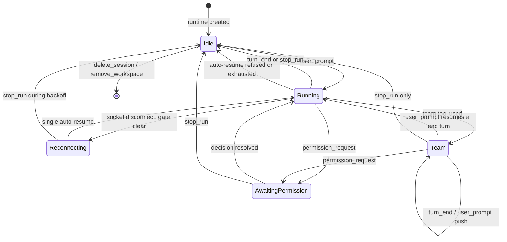
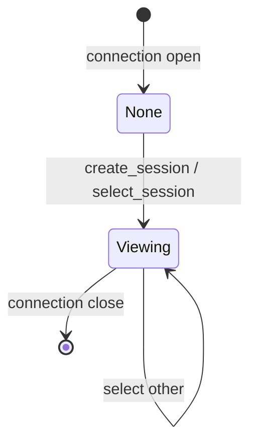
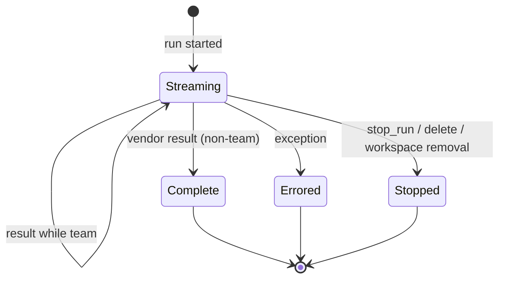

# agent-session — 领域规格

## Overview

一个 agent session 把用户 prompt 变成一次由 vendor adapter 驱动的智能体运行:流式给出活动,按该 vendor 的能力把敏感工具交给 [permission-gateway](../permission-gateway/permission-gateway-spec.md),并用权限模式与运行控制引导这次运行。

运行不绑定启动它的浏览器连接。每个会话有一个进程范围的 **Session Runtime**;连接只是当前观察哪个会话的**视图**。切换视图或关闭 socket 不会停止运行,返回的视图回放已发生的一切([ADR 0006](../../../architecture/adr/0006-decouple-runs-from-connections.md))。不同会话并发、无固定上限;单个会话串行(一次一个 turn)——持久化的 **agent team** 除外,其 lead 在 turn 之间保持存活,用户可继续推入 turn。

运行的工作目录、起始权限模式与 resume id 由 runtime 持有,由 [session-registry](../session-registry/session-registry-spec.md) 播种。

**范围:** 运行生命周期、后台执行与回放、权限模式契约、会话连续性、agent-team、实时状态、把厂商消息译为线事件的规则。**边界:** 不决定个别权限(gateway)、不管理工作区/会话目录(session-registry)、不渲染 UI(web-console)。

实体见 [agent-session-models.md](agent-session-models.md)。

## Business rules

- **AS-R1**: `user_prompt` 针对所观察会话的 runtime 启动一次 Agent Run,带上该会话的工作目录、权限模式,以及对既有会话的 resume id。prompt 作为 `user_text` 回显,供所有 viewer 与回放看见。回显只含可见 turn 内容(用户输入与交给模型的业务上下文);内部系统指令走系统上下文,不进回显。slash-command 开发技能是唯一必须随模型用户 turn 展开的内部载体,同样排除在回显之外。
- **AS-R2**: 会话串行:每个会话最多一个进行中的 Agent Run。turn 进行中时,针对该会话的 `user_prompt` 以 `error` 拒绝且不启动任何东西。不同会话并发,无固定上限。
- **AS-R3**: 权限模式按会话(runtime 拥有,镜像到 session-registry)。运行以该会话的模式启动;`set_mode` 只改变所观察会话的模式。
- **AS-R4**: `set_mode` 更新该会话记住的模式,并以 `mode_changed` 确认。若厂商支持运行中途改模式且有在途运行,立即应用到该 run;否则下次运行才生效。
- **AS-R5**: 模式(经目录落到网格)决定哪些工具调用敏感从而抵达 gateway。全自动执行授权所有工具;自动接受编辑只覆盖 edit 类;其余按该厂商分类器把敏感调用交给 gateway。不具备逐工具审批的厂商把门控落在启动策略上,回合内不再询问。
- **AS-R6**: 运行只能被 `stop_run`(所观察会话)、`delete_session` 或 `remove_workspace` 停止,从不因切换视图或关闭 socket 而停止。已结束或尚未开始流式传输的运行,中止是无害的。
- **AS-R7**: 一次运行以恰好一个终止性 `turn_end` 结束:`reason: 'complete'`(厂商给出结果,或运行被停止)或 `reason: 'error'`。`turn_end` 不结束会话。
- **AS-R8**: 关闭连接只取消该视图的订阅;运行在 runtime 中于后台继续。重连并选择该会话则回放完整记录并恢复实时投递。以稳定 `c3SessionId` 选择时,必须解析到厂商原生 runtime 再回放并挂接 viewer,`session_selected` 仍携带原 `c3SessionId`;不得用公开 id 另建一个与在跑 runtime 分离的冷会话。
- **AS-R9**: 只有模型文本、tool-use 与 tool-result 映射到线协议;其余厂商消息种类忽略。整 turn 只有思考、没有任何可见文本或工具时,在 `turn_end` 之前发一条 `notice`,以免看起来像卡住。
- **AS-R10**: 运行报告厂商 session id,使 pending 会话绑定到真实 id,后续 prompt 经 resume 继续。绑定重新键入 runtime(buffer、viewers、run 随之移动);恢复的运行保持同一 id。绑定同时冻结 session→agent 的 **vendor**(agent-config AC-R16,[ADR 0015](../../../architecture/adr/0015-session-agent-binding-vendor-ownership.md)):转录只存在于该厂商原生存储,vendor 之后不能改。
- **AS-R11**: 每个实时事件追加到 runtime 的 buffer,并分发给当前 viewers。加入的视图先回放 baseline(创建时的磁盘快照)再回放 buffer,完整且不重复。
- **AS-R12**: runtime 状态为 `idle`、`running`、`awaiting_permission`、`team` 或 `reconnecting`。任何变更向所有连接广播 `session_status`。
- **AS-R13**: 需要运行中途控制(改模式、中止)或让进程比单次结果活得更久的运行,以**流式输入**驱动,而不是一次性字符串([ADR 0008](../../../architecture/adr/0008-streaming-input-for-agent-teams.md))。
- **AS-R14**: 当第一个 **team 工具**被使用时,runtime 标记为 `team` 一次,并发出 `team_upgraded`。team 工具是 `TeamCreate`、`SendMessage`,或后台 `Agent`;前台 `Agent` 不是。检测发生在该 turn 的结果之前。
- **AS-R15**: 结果到达时发出 `turn_end { reason: 'complete' }`。非 team 运行随后结束其输入,底层进程退出,下一 prompt 恢复全新进程。team 运行保持输入打开,lead 在 turn 之间存活,状态保持 `team` 而非 `idle`。
- **AS-R16**: team 会话只在用户明确停止(`stop_run` / `delete_session` / `remove_workspace`)时结束。没有自动拆除;「lead 已完成」等同于用户停止。
- **AS-R17**: 会话处于 `team` 时,`user_prompt` 不被拒绝也不启动第二个运行:回显为 `user_text`,并作为下一用户 turn 推入存活的 lead(不 resume、不新建进程)。非 team 会话仍遵守 AS-R2。
- **AS-R18**: 普通用户会话的 turn 若因传输层断开失败,且与降级链分类分离(一次断线从不进入降级候选),则在有界退避后对**同一个**运行自动 resume **一次**,以保留上下文。退避期间状态为 `reconnecting`。成功则该 `turn_end` 携带 `reconnect_attempted`。被拒绝(AS-R19)、被设置关闭、没有真实 session id、会话是 team/intent、或该 turn 已用过一次时,以 `turn_end { reason: 'error' }` 结束并回到 `idle`,由用户手动继续。从不静默挂起。
- **AS-R19**: 自动 resume 的守卫是工具副作用:断线时若仍有未闭合的 side-effect 类 `tool_use`,则 `side_effect_pending` 为真,自动 resume 拒绝。分类保守——明确的只读/检索/问答视为无副作用;写入、执行、未知与 MCP 一律视为有副作用。宁可错过自动 resume,也不在可能的写入之后自动续跑。
- **AS-R20**: Claude 子进程获得一组最低优先级的传输 keepalive 默认值,以降低断线发生率;用户或 agent 显式环境覆盖优先。这与自动 resume 解耦,不改变 resume/门控逻辑。
- **AS-R21**: 只有具备流式推入能力的厂商才能成为 agent-team lead;目前只有 Claude。非 Claude 会话不会被标为 `team`。
- **AS-R22**: 降级链只保留与当前 agent **相同厂商**的条目;跨厂商条目跳过、从不启动。同厂商降级每次尝试都是全新会话,从不 resume。被跳过的条目在链耗尽时经 `all_agents_failed` 呈现。
- **AS-R23**: 用户可以把会话改绑到另一个**同厂商** agent(`set_session_agent`),不丢上下文。候选与降级链、共识投票者共用同一条同厂商规则;跨厂商拒绝,事实不变。切换只改绑定,不立即重跑——下一 `user_prompt` 用新 agent resume 同一次运行。
- **AS-R25**: 降级链在内核事件总线上发布 `agent-error` / `agent-fallback` / `agent-all-failed`,供其他域订阅,不取代线上的 `agent_failed` / `all_agents_failed` 与运行循环([ADR 0018](../../../architecture/adr/0018-event-bus-kernel-layer.md))。

## States

### Session Runtime(进程范围,按会话)

```mermaid
stateDiagram-v2
    [*] --> Idle: runtime created
    Idle --> Running: user_prompt
    Running --> AwaitingPermission: permission_request
    AwaitingPermission --> Running: decision resolved
    Running --> Idle: turn_end or stop_run
    AwaitingPermission --> Idle: stop_run
    Running --> Reconnecting: socket disconnect, gate clear
    Reconnecting --> Running: single auto-resume
    Reconnecting --> Idle: stop_run during backoff
    Running --> Idle: auto-resume refused or exhausted
    Running --> Team: team tool used
    Team --> Team: turn_end / user_prompt push
    Team --> Running: user_prompt resumes a lead turn
    Team --> AwaitingPermission: permission_request
    Team --> Idle: stop_run only
    Idle --> [*]: delete_session / remove_workspace
```

切换视图和关闭连接不改变 runtime 状态。

### Connection View

```mermaid
stateDiagram-v2
    [*] --> None: connection open
    None --> Viewing: create_session / select_session
    Viewing --> Viewing: select other
    Viewing --> [*]: connection close
```

### Agent Run

```mermaid
stateDiagram-v2
    [*] --> Streaming: run started
    Streaming --> Streaming: assistant_text / tool_use / tool_result / permission_request
    Streaming --> Streaming: result while team
    Streaming --> Complete: vendor result (non-team)
    Streaming --> Errored: exception
    Streaming --> Stopped: stop_run / delete / workspace removal
    Complete --> [*]
    Errored --> [*]
    Stopped --> [*]
```

## Permission modes

线/UI 携带厂商原生模式 token,经该厂商的模式目录解释为中立网格 `ActionMode(plan | build) × ToolGate`([ADR 0011](../../../architecture/adr/0011-vendor-neutral-agent-abstraction.md))。Claude 的 `default` / `auto` / `plan` / `acceptEdits` / `bypassPermissions` 是该厂商自己的目录,不是所有厂商的公共枚举。

- 升级到更宽松的门控(含全自动执行)只能通过一次明确、可观察的 UI 操作。
- Codex 与 Cursor 没有逐工具审批;门控是启动时的沙箱与审批策略。Codex 的无沙箱必须有用户显式授权,缺标记则降为工作区可写;`build × never-ask` 不等于无沙箱。
- Codex 规格运行必须把可写根限制在集中化 specs 目录;边界建不成则启动失败,不回落到项目可写目录。
- Codex 沙箱读不到宿主密钥链:启动时若环境尚未提供 GitHub 令牌,则注入宿主 `gh` 令牌,已有则不覆盖。

具体哪些工具算敏感,由该厂商运行时拥有;c3 选择模式并呈现门控。

## 厂商中立映射规则

- 适配器把厂商消息译为规范信封;线协议只增加 `vendor` 维度,不增加按厂商的 schema([ADR 0013](../../../architecture/adr/0013-canonical-envelope-on-wire-c3-session-namespace.md))。
- 块以(会话, 块 id)为键原地修订,而不是堆叠;工具返回折入对应 tool-use。
- 审批请求不进入信封,走 permission-gateway。厂商规则引擎自动允许的调用只打 pre-approved 审计标记,不构成第二条决策通道。
- 会话对外以不透明 `c3SessionId` 寻址;原生存储仍是转录事实来源,c3 不双写。

## 宿主 CLI

厂商宿主 CLI 必须可解析,否则该 agent 类型不可用,以明确错误呈现,不默默挂起([ADR 0012](../../../architecture/adr/0012-host-binary-probe-first-capability-gate.md))。Cursor 由厂商安装器分发,不由 c3 托管([ADR 0040](../../../architecture/adr/0040-cursor-as-host-cli-vendor.md));其相对 Claude/Codex 的能力边界见 [Cursor](features/agent-session-cursor.md)。Codex 一轮结束后回收本轮子进程树;续跑遇残留写锁时,仅在能证明占用者是本轮残留才自动回收并重试一次。见 [Codex 适配边界](../../../architecture/codex-sdk-guide.md)。

## Domain events

发出 `mode_changed`、`user_text`、`assistant_text`、`tool_use`、`tool_result`、`turn_end`、`team_upgraded`、`session_status`;消费 `user_prompt`、`set_mode`、`stop_run`、`set_session_agent`、`ping`。代表 gateway 转发 `permission_request`。向 session-registry 报告运行的厂商 session id。工作区/会话目录事件属于 session-registry。形状见[共享协议](../../../shared/api-conventions/websocket-protocol.md)。

## Interactions

- **permission-gateway** — 敏感工具在此阻塞;待决请求以 `requestId` 为键,切走视图仍可回答。
- **session-registry** — 提供工作目录、每会话模式与 resume id;接收 pending→真实 id 绑定。
- **vendor adapter** — driver / 审批桥 / 会话存储;SDK 类型不跨出适配器。
- **agent-config** — 解析启动覆盖(模型、端点、环境)与同厂商候选。
