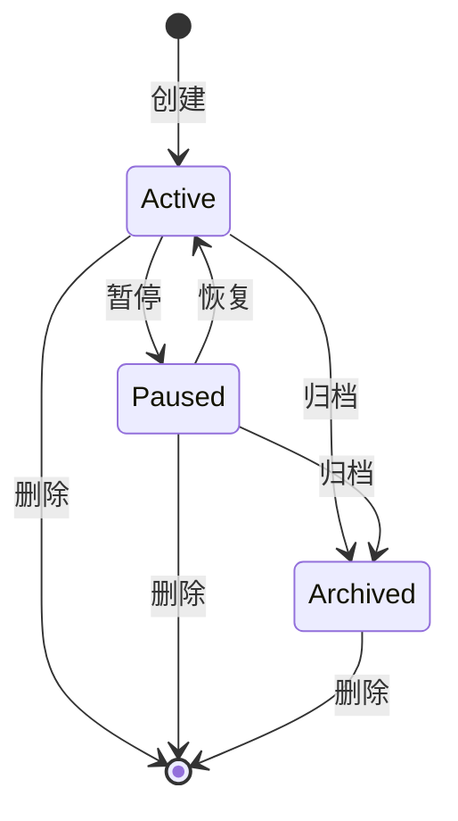
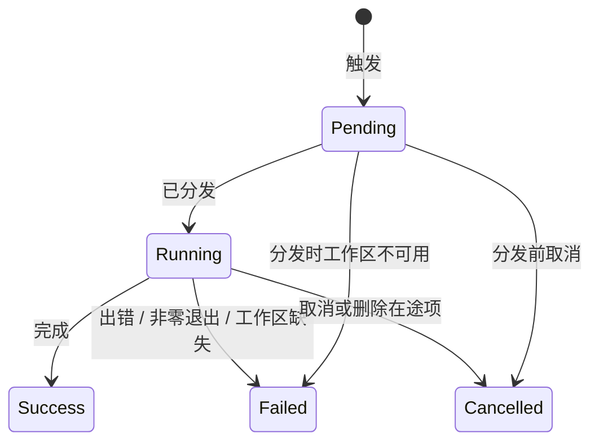

# Domain: automations

- **Group:** core
- **One-line:** 工作区范围的任务执行:按计划或事件跑命令与 LLM 工作,留下执行记录与专用会话。
- **Owner:** maintainer
- **Status:** active
- **Depends on:** [session-registry](session-registry.md)(工作区身份、自动化会话投影);[agent-session](agent-session.md)(LLM 运行与命令进程);[workspace-setting](../settings/workspace-setting.md)(总闸);[agent-config](../settings/agent-config.md)(默认与专用智能体)。
- **Depended on by:** [web-console](web-console.md)(列表、表单、记录、回放与工作台总闸);[intent-management](intent-management.md)(评审 / 修复执行面);[im-robot](im-robot.md)(共用工具网格);[discussion](discussion.md)(可被订阅,亦可被工具驱动)。
- **exposes-api:** true — WebSocket `/ws`。消息形状在[共享协议](../../shared/api-conventions/websocket-protocol.md)中定义。
- **ADRs:** [0018](../../architecture/adr/0018-event-bus-kernel-layer.md) 进程内事件总线

本域拥有**工作区自动化**(cron / 事件的命令与 LLM 任务、执行记录、工作区总闸)。意图**开发队列**(挂起、规格阶段、PR 接力)由 [intent-management](intent-management.md) 拥有,此处只提供执行面,不复制该域的 RM-A 规则。

## Overview

automations 按工作区登记任务,在计划时刻或匹配到系统事件时执行,并把每次运行记入执行记录。任务是无头命令或发给智能体的 LLM 提示。执行使用该工作区上下文,像一次来自该工作区的用户运行,但权限按该条自动化冻结的策略无人值守裁定。

意图开发队列、规格阶段与 PR 评审 / 修复接力不在本域;它们复用执行面,规则见 [intent-management](intent-management.md)。

**范围:** 自动化登记与生命周期、cron / 事件 / 链式触发、执行记录、专用会话、执行身份与厂商、工具白名单、网络开关、工作区总闸。
**边界:** 不驱动运行循环([agent-session](agent-session.md)),不把敏感工具待决推给浏览器([permission-gateway](permission-gateway.md)),不拥有工作区目录([session-registry](session-registry.md)),不渲染 UI([web-console](web-console.md)),不拥有意图账本或开发队列。

## Business rules

### 登记与生命周期

- **SCH-R1**: 创建必须引用已登记工作区。工作区取消登记则其自动化归档(日志保留),不再评估。
- **SCH-R2**: 任务为 `command`(无头命令)或 `llm`(智能体提示)。
- **SCH-R5**: 仅 `active` 被自动评估。`paused` 跳过自动触发,仍可立即运行且不改状态。`archived` 不评估、不分发、不可回退。
- **SCH-R6**: `create_automation` / `update_automation` / `delete_automation` 即时落库并广播。归档与删除经控制台二次确认。运行时敏感工具不经浏览器审批。
- **SCH-R8**: 执行使用所属工作区上下文。工作区已不在目录中则该次失败。
- **SCH-R11**: 可见性跟随所属工作区;改自动化需要对该工作区的编辑权限。
- **SCH-R14**: 归档与删除是终态。归档只能删除。删除级联清除执行记录。
- **SCH-R19**: 创建时服务端生成标题;编辑可设粘性标题,清空则重新派生。
- **SCH-R28**: 工作区总闸默认开。关闭只挡住此后自动派发,不改单条状态、不取消在途、不影响立即运行。读取失败按开处理。被挡的计划不补跑、不记错过。

### 触发

- **SCH-R3a**: cron 按系统 IANA 时区解释,非 UTC。改时区移动下次实际触发。计划可限定每日时段。
- **SCH-R7**: 同一自动化同时至多一次在途执行。在途时自动触发不并发。
- **SCH-R7a**: cron 逾期过久不补跑,记一次失败并重算下次,自动化保持 `active`;不因错过而失效。
- **SCH-R17**: 触发器为 `cron` 或 `event`,互斥。事件须声明合法类型,不能保存为「匹配全部类型」。事件项不参与计划评估。
- **SCH-R18**: 事件按工作区、类型、可选 status、可选 metadata 过滤。运行生命周期可再限 `sessionKind`;空限表示不限。可选 `automation` 种类,使一条自动化的完成触发另一条。无环检测与链深上限。单条过滤失败不影响同事件其他候选。
- **SCH-R22**: `pr:operation` 走通用过滤:status 为结果,操作落在 metadata;事件不携带 `sessionKind`。
- **SCH-R25**: 自动化可带自由标注。仅本域自己的运行生命周期事件带上该标注,供链式过滤。过滤器精确匹配,空则不过滤。
- **SCH-R29**: 仅事件 + `llm` 可将触发事件作为当次提示的附加数据;不写回定义、不进记录。

### 执行身份、工具与会话

- **SCH-R4**: 执行身份是绑定的厂商、智能体与权限模式,每次执行使用同一份。新建用默认智能体。Claude、Codex、Cursor 均可执行;缺失、禁用或不匹配则该次失败,不换厂商。
- **SCH-R9**: 无人值守:敏感工具按冻结白名单与模式在服务端允许或拒绝,不向浏览器发 `permission_request`。
- **SCH-R12**: `command` 在工作区目录跑无头进程;非零退出为失败。
- **SCH-R13**: `llm` 在工作区上下文开专用智能体会话,提示为第一回合;绑定真实会话后写入执行记录。
- **SCH-R16**: `llm` 执行可回放转录;`command` 无会话。无会话或不可读则空回放,不报错。
- **SCH-R21**: 可设墙钟上限;超时该次失败。
- **SCH-R23**: 本域不执行 PR 操作。模型或服务端在事实发生后可发布事件;发布本身无破坏性、无确认门。字符串先去秘密再离开;工作区身份以当次运行为准,模型不能伪造。
- **SCH-R27**: `llm` 在途时专用会话呈 `running`,运行中可看实况,结束后可回放。`command` 不占会话。
- **SCH-R30**: `llm` 拿到真实会话时同时写下 `automation` 种类的目录投影与会话事实,不写成普通工作会话。
- **SCH-R31**: 列表绿点与自动化条目角标共用同一条可展示在途判定:仅 `llm`、执行记录为 running、已绑定真实会话。`command` 在途不点亮条目角标。会话页自动化分类走在途执行会话。工作区运行中总数与工作台总览共用同一活动集合(非空闲 runtime 与在途自动化执行会话并集),不走本条判定。

工作台意图 / 交付 / 讨论等工具须显式勾选才挂载;空白名单不授予它们。可写沙箱下可打开网络,默认关闭;网络开关不是工具条目。

### 执行记录

- **SCH-R10**: 执行记录一旦开始只向前:`pending` → `running` → `success` | `failed` | `cancelled`。从未开始的 pending 记为失败。

### 内部一次性项

- **SCH-R20**: 智能体配额恢复可创建系统一次性计划项,到期启用后删除该行;同一智能体存续期间不重复创建。

## States

### 自动化

总闸叠在单条状态之上:关闭时该工作区一切自动触发在派发前短路;立即运行仍服从 SCH-R5。

### 执行记录

失败对人可见;取消不是错误。

## Domain events

消费 `create_automation`、`update_automation`、`delete_automation`、`list_automations`、`get_automation_detail`、`get_execution_transcript`、`automation_run_now`、`get_tool_manifest`。发出 `automations`、`automation_detail`、`execution_transcript`、`automation_execution_logs`、`tool_manifest`。形状见[共享协议](../../shared/api-conventions/websocket-protocol.md)。

进程内订阅运行生命周期、PR 操作、意图与讨论生命周期等通用事件([ADR 0018](../../architecture/adr/0018-event-bus-kernel-layer.md));这些不是 WebSocket 帧。

## 数据模型

### Automation

一条限定在单个已登记工作区的任务:命令或 LLM 提示,加上触发器、执行身份与工具策略。身份是稳定 id;作用域是创建后不可变的工作区。

不变量:

- 任务为 `command` | `llm`。状态为 `active` | `paused` | `archived`。
- 触发为 `cron` | `event`,互斥;事件项不参与计划评估。
- 执行身份是绑定的厂商与智能体,加上该厂商的权限模式与冻结的工具白名单 / 拒绝名单。网络开关随白名单存放,但不是工具。
- 自由标注无预设键,供链式过滤;只有本域自己的运行生命周期事件带上它。
- 标题创建时派生;用户设过的标题不被自动命名覆盖。
- 零或多条 Execution。工作区取消登记则归档,不删除。

### Trigger

自动化如何被唤醒。`cron` 按系统时区解释计划,可限定每日时段。`event` 订阅一类系统事件,按工作区、类型、可选 status 与 metadata 过滤;运行生命周期还可限会话种类。

不变量:

- 事件必须声明类型,不能「匹配全部类型」。
- 订阅 `sessionKind=automation` 的运行结束,即可链式触发另一条;无环检测。
- 同一自动化同时至多一次在途;在途时自动触发不并发。
- 工作区总闸关闭时自动触发在派发前短路,不排队。

### Execution

一次运行的审计记录:起止、结果,以及 `llm` 时的专用会话。一旦开始只向前:`pending` → `running` → `success` | `failed` | `cancelled`。

不变量:

- `command` 无智能体会话,不暴露转录。
- `llm` 绑定真实会话后写入记录,并投影为 `automation` 种类会话;运行中可看实况,结束后可回放。无会话或不可读则空回放。
- 父自动化删除时级联清除。
- 立即运行也走同一条执行路径,不改变自动化状态。

## 协作

**agent-session.** `llm` 开专用会话并提交提示;`command` 在工作区派生命令。运行生命周期由运行路径发布,本域订阅以驱动事件触发。`llm` 登记为 Session Runtime 后进入活动状态注册表，与普通会话共用同一份当前活动事实。

**session-registry.** 工作区必须已登记;取消登记归档自动化。`llm` 执行声明种类为 `automation` 的投影行。意图接力声明自己的种类,不进「自动化」列([session-registry](session-registry.md) SR-R16)。

**permission-gateway.** 不把待决推给浏览器。冻结的工具策略在服务端允许或拒绝。

**intent-management.** 开发队列与评审 / 修复复用本域执行面,不登记为自动化条目。队列以事件标脏唤醒对账,规则在该域(RM-A15);本域触发分发与之分离。

**事件总线.** 订阅运行生命周期、PR 操作、意图与讨论生命周期等通用事件;匹配后与 cron 走同一条执行路径。约定见 [ADR 0018](../../architecture/adr/0018-event-bus-kernel-layer.md)。

**web-console.** 渲染列表、表单、执行记录与回放。立即运行与总闸是窗口,闸门仍以服务端为准。

## 关键取舍

**进程内调度.** 计划评估与执行都在服务端进程内,无外部任务队列。单实例;重启后遗留的在途记录记失败,失败对人可见。

**失败可见,不回退厂商.** 找不到可执行文件或智能体则该次失败,不改跑另一家。

**工具与网络默认关闭.** 工作台 MCP 与网络须显式 opt-in;空白名单不挂载 c3 能力。

**无环检测.** 链式触发靠订阅对方运行结束;用户自行避免互触。串行执行只限制单条自动化。

## 非功能

存储不可用则不启动调度。错误必须对人可见。
