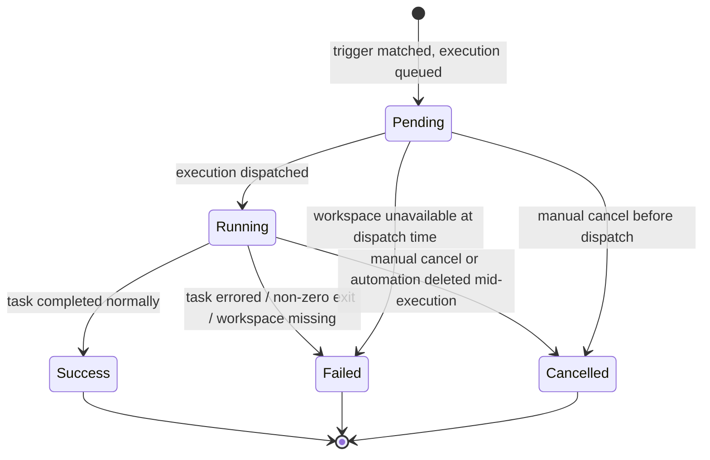

# automations — Domain Spec

## Overview

The automations domain adds **task execution** to c3. A **Automation** holds a task definition
(a shell command or LLM prompt) plus a trigger, workspace binding, and execution identity. When its
trigger condition is met — a wall-clock/cron match, a subscribed **run lifecycle event**
(`run:started` / `run:settled`, 2026-06-08), or a **`pr:operation` event** (model-published or
server-side, 2026-06-20) — the scheduler engine spawns an execution in the workspace's context
and records the outcome in an **ExecutionLog**.

**PR operation events have two publish sources.** The model performs PR operations with its own
tools (a `gh` CLI, a GitHub MCP, etc.) and afterwards calls a c3-provided MCP tool,
`publish_pr_event`, to publish ONE vendor-neutral PR operation event. Additionally, c3's
server-side PR creation paths (dev-cleanup / automation / manual create_pr) publish a
`create`/`success` event after successfully creating a PR on the model's behalf. The automations
domain only defines the event contract, the publish channel, and the subscription/trigger —
see § PR operation events.

Automations are **workspace-scoped**: every automation belongs to exactly one workspace (the directory
registered in session-registry). This means a automation runs with that workspace's `cwd`, environment,
project settings, sessions, and agent configuration — just like a user-initiated run from that workspace.

The user views automations and logs in the web-console and manages them through a confirmation queue
("pending changes" before effects take hold).

**Scope:** automation CRUD, timing/state management, execution dispatch, log recording, write confirmation queue.
**Boundary:** it does not run the agent (`agent-session`), does not decide per-call permissions
(`permission-gateway`), and does not render UI (`web-console`).

## Core entities

| Entity       | Description                                                                                  | Key attributes                                                                                                                             |
| ------------ | -------------------------------------------------------------------------------------------- | ------------------------------------------------------------------------------------------------------------------------------------------ |
| Automation   | A task: command or LLM prompt, fired by cron, a run lifecycle event, or a PR operation event | `id`, `workspaceId`, `taskType`, `vendor`, `state`, `triggerType`, `cronExpression` / (`eventTopic`, `eventReasonFilter`, `eventPrFilter`) |
| ExecutionLog | The record of a single execution of a automation                                             | `id`, `automationId`, `status`, `startedAt`, `output`                                                                                      |

See [automations-models.md](automations-models.md) for full attributes.

## Business rules

| ID      | Rule                                                                                                                                                                                                                                                                                                                                                                                                                                                                                                                                                                                                                                                                                                                                                                                                                                                                                                                                                                                                                                                                                                 |
| ------- | ---------------------------------------------------------------------------------------------------------------------------------------------------------------------------------------------------------------------------------------------------------------------------------------------------------------------------------------------------------------------------------------------------------------------------------------------------------------------------------------------------------------------------------------------------------------------------------------------------------------------------------------------------------------------------------------------------------------------------------------------------------------------------------------------------------------------------------------------------------------------------------------------------------------------------------------------------------------------------------------------------------------------------------------------------------------------------------------------------- |
| SCH-R1  | A automation **must** reference a workspace that exists in the session-registry at creation time. Deleting the workspace causes all its automations to be **archived** (not deleted — logs are preserved); archived automations are no longer evaluated by the scheduler.                                                                                                                                                                                                                                                                                                                                                                                                                                                                                                                                                                                                                                                                                                                                                                                                                            |
| SCH-R2  | A automation's task is one of exactly two types: `command` (a shell command string) or `llm_prompt` (a prompt text sent to an agent session). The type is immutable after creation.                                                                                                                                                                                                                                                                                                                                                                                                                                                                                                                                                                                                                                                                                                                                                                                                                                                                                                                  |
| SCH-R3  | Timing is either **one-shot** (a concrete `triggerAt` timestamp) or **recurring** (a `cronExpression`). Exactly one timing field is set; a automation with both or neither is rejected at creation. (Recurring automations are **not implemented in v1**; see v1-exclusion list.)                                                                                                                                                                                                                                                                                                                                                                                                                                                                                                                                                                                                                                                                                                                                                                                                                    |
| SCH-R3a | A recurring automation's `cronExpression` is interpreted in the **system-wide IANA time zone** (`SystemSettings.timezone`, defaulting to the server's local zone), **not** UTC: `0 11 * * *` means 11:00 in that zone. The computed `next_run_at` remains an absolute instant and is daylight-saving-aware. Changing the system time zone shifts the actual trigger moment of existing automations (recomputed on their next create/update/run). See [automations-design.md](automations-design.md) § automations table → Time zone.                                                                                                                                                                                                                                                                                                                                                                                                                                                                                                                                                                 |
| SCH-R4  | A automation's **execution identity** is one of `read-only`, `sandboxed`, or `full-access` (see § Execution Identity). It is mutable and applies to every execution of the automation.                                                                                                                                                                                                                                                                                                                                                                                                                                                                                                                                                                                                                                                                                                                                                                                                                                                                                                               |
| SCH-R5  | A automation in `active` state is evaluated by the scheduler. A automation in `paused` state exists but is **not** evaluated — its trigger is skipped until resumed. Manual run-now is the exception: both `active` and `paused` automations may be dispatched once without changing `status` or `nextRunAt`; `archived` automations remain ineligible. A automation in `archived` state is frozen for record-keeping; it is not evaluated and its state cannot revert to `paused` or `active`.                                                                                                                                                                                                                                                                                                                                                                                                                                                                                                                                                                                                      |
| SCH-R6  | Writing a automation (create / update fields / change state) produces a **pending change** visible in the web-console. The change takes effect only after explicit user confirmation from the queue. The queue blocks until the user accepts or rejects — there is no auto-approve. (Exception: `archive` and `delete` are immediate on confirmation — they are not deferrable.)                                                                                                                                                                                                                                                                                                                                                                                                                                                                                                                                                                                                                                                                                                                     |
| SCH-R7  | A automation execution is **serial per automation**: at most one execution can be in-flight for a given automation at any time. If a recurring automation's next trigger fires while the previous execution is still running, the new trigger is skipped (not queued).                                                                                                                                                                                                                                                                                                                                                                                                                                                                                                                                                                                                                                                                                                                                                                                                                               |
| SCH-R7a | A cron automation whose `nextRunAt` is more than five minutes overdue is not replayed. The scheduler records a failed execution with `missed_trigger_window`, recomputes `nextRunAt` from the current time, and leaves the automation `active`; an overdue trigger must not automatically invalidate a automation. Internal agent-quota recovery automations retain their separate late-recovery behavior (SCH-R20).                                                                                                                                                                                                                                                                                                                                                                                                                                                                                                                                                                                                                                                                                 |
| SCH-R8  | An execution runs in the automation's workspace context (`cwd`, project settings, sessions, etc.). If the workspace has been removed between automation creation and execution time, the execution fails immediately with `workspace_removed`.                                                                                                                                                                                                                                                                                                                                                                                                                                                                                                                                                                                                                                                                                                                                                                                                                                                       |
| SCH-R9  | An execution's agent run uses the execution identity to determine permission sensitivity. `read-only` forces `plan`/`bypassPermissions`-equivalent mode; `full-access` uses the session's current mode; `sandboxed` applies a restricted tool allowlist (see § Execution Identity).                                                                                                                                                                                                                                                                                                                                                                                                                                                                                                                                                                                                                                                                                                                                                                                                                  |
| SCH-R10 | Execution logs are **append-only** once `startedAt` is set. An execution status transitions forward: `pending` → `running` → `success` \| `failed` \| `cancelled`. A `pending` execution that never starts (e.g. workspace unavailable at trigger time) is set to `failed` with a descriptive `errorMessage`.                                                                                                                                                                                                                                                                                                                                                                                                                                                                                                                                                                                                                                                                                                                                                                                        |
| SCH-R11 | Automations and their logs are subject to the same **visibility rules** as the workspace they belong to. Only users with `Owner` or `Editor` access to the workspace may modify automations; `Viewer` access grants read-only listing. See [permission-gateway](../permission-gateway/permission-gateway-spec.md) for the access model.                                                                                                                                                                                                                                                                                                                                                                                                                                                                                                                                                                                                                                                                                                                                                              |
| SCH-R12 | A `command`-type automation's execution spawns a **headless shell process** in the workspace directory. No permission prompts are shown — the command is run with the workspace's project-level `allow`/`deny` rules and the automation's `executionIdentity` mode. If the command yields a non-zero exit code, the log records `failed`.                                                                                                                                                                                                                                                                                                                                                                                                                                                                                                                                                                                                                                                                                                                                                            |
| SCH-R13 | An `llm_prompt`-type automation's execution starts an agent session (via `agent-session`) with the workspace context. The prompt is submitted as the first user turn. The run streams `assistant_text` and `tool_use`/`tool_result` into the log. The execution's agent `sessionId` is captured from the first SDK event and persisted on the execution log immediately (so the transcript stays reachable even if the run later times out or fails). Permission prompts during the run are auto-resolved according to the execution identity (see § Execution Identity). The run's terminal status (`complete` / `error`) maps to `success` / `failed` in the log.                                                                                                                                                                                                                                                                                                                                                                                                                                  |
| SCH-R14 | `archive` and `delete` are final. An archived automation can only be deleted; it cannot transition back to `paused` or `active`. Deleting a automation also deletes its **execution logs** (cascade). This is a hard delete — logs are permanently removed.                                                                                                                                                                                                                                                                                                                                                                                                                                                                                                                                                                                                                                                                                                                                                                                                                                          |
| SCH-R15 | The write confirmation queue is **per-user** (per WebSocket connection), not per-workspace. Unconfirmed changes are visible only to the user who created them and remain editable (can be replaced or discarded) until confirmed. Confirming commits all pending changes for that user atomically — there is no partial confirm at the automation level (SCH-R6 exception: archive/delete).                                                                                                                                                                                                                                                                                                                                                                                                                                                                                                                                                                                                                                                                                                          |
| SCH-R16 | Each `llm_prompt`-type execution's agent session transcript is viewable on demand from its history row (read-only replay of `assistant_text` / `tool_use` / `tool_result`). `command`-type executions have no agent session and expose no transcript entry. The transcript is loaded from the recorded `sessionId` via `agent-session`; a sessionless or since-deleted session yields an empty replay, never an error.                                                                                                                                                                                                                                                                                                                                                                                                                                                                                                                                                                                                                                                                               |
| SCH-R17 | A automation's **trigger** is one of `cron` (time-based; the default, and the only mode for legacy rows migrated before this field existed) or `event`. An `event` trigger declares an `eventTopic` — a kernel run-lifecycle event (`run:started` / `run:settled`, 2026-06-08) **or** the `pr:operation` event (model-published or server-side, 2026-06-20) — and fires its execution when a matching event is published on the kernel event bus (ADR-0018) — reusing the **same** dispatch path, three-tier MCP security, and write-approval queue as a cron run. Event automations carry no `cronExpression` / `nextRunAt` and are **never** evaluated by the tick loop. Creating/updating an `event` automation without an `eventTopic` is rejected (`automation.invalidEventTrigger`).                                                                                                                                                                                                                                                                                                           |
| SCH-R18 | A **run-lifecycle** `event` trigger (`run:started` / `run:settled`) fires only when **all** hold: the event's `sessionKind` is `work` (internal intent comm / discussion / scheduler runs never fire user automations); the event's `workspacePath` equals the automation's workspace; and, for `run:settled`, the terminal `reason` (`complete` / `error` / `aborted`) is in the automation's optional `eventReasonFilter` (empty/null = any reason). Event-storm throttling reuses SCH-R7 serial execution: an event arriving while the automation already has an in-flight execution is **skipped**, not queued.                                                                                                                                                                                                                                                                                                                                                                                                                                                                                  |
| SCH-R22 | A **`pr:operation`** `event` trigger fires only when **all** hold: the event's `workspacePath` equals the automation's workspace; the event's `operation` (`create` / `review` / `merge` / `close` / `comment`) is in the automation's optional `eventPrFilter.operations` (empty/null = any operation); and the event's `result` (`success` / `failure` / `error`) is in `eventPrFilter.results` (empty/null = any result). The `error` result represents execution failures (CI pipeline timeout, tool exception) as distinct from review failures. The SessionKind whitelist (SCH-R18) does **not** apply — a PR event carries no sessionKind; it is published either by the model from within a work session or by the server-side PR creation paths. Throttling reuses SCH-R7 (an in-flight execution skips the new event).                                                                                                                                                                                                                                                                     |
| SCH-R23 | The **`publish_pr_event` MCP tool** is provided by c3 to **every** work session (new and resumed), on both the Claude and Codex vendor paths. It accepts a vendor-neutral PR operation event (operation, result, optional `pr` / `repo` / `ref` / `association`, optional `errorSummary`) and, after Zod validation, publishes it on the kernel event bus. It is **not** gated by a human confirmation (publishing an event has no destructive side effect; the gated, side-effecting step is the automation it may trigger). Missing/illegal `operation` or `result` is rejected with an error result and publishes nothing. All string fields are **safely normalized** before the event leaves c3 — tokens, command-line raw output, and absolute paths are stripped — so no secret reaches a listener. The event's `workspacePath` / `sessionId` come from the per-run binding, so the model cannot forge another workspace. Additionally, c3's server-side PR creation paths (dev-cleanup / automation / manual create_pr) publish a `create`/`success` event after successfully creating a PR. |
| SCH-R19 | The display `name` is **auto-generated on create** (client name stripped, SCH naming). On **update** the client may supply a manual title via `config.name`: a non-empty value is stored as a **sticky user-set name** (`config.nameSource='user'`) that auto-naming never overrides — it survives later body edits (an update with no `name` key keeps the existing name and its provenance). An empty `name` on update **reverts** to a freshly auto-derived name (clears the user marker). Create never accepts a client name (manual titles are edit-only).                                                                                                                                                                                                                                                                                                                                                                                                                                                                                                                                      |
| SCH-R20 | **Internal one-shot agent recovery automations** (2026-06-15-002). The agent-config quota recovery flow may create a system-owned automation row whose config marks it an agent-quota-recovery action, names the disabled agent, and records the absolute reset instant. It reuses the cron / next-run tick engine but is one-shot: when due, the dispatcher re-enables that agent, then the scheduler **deletes the automation row** (cascading its execution logs) so it cannot fire again and leaves no paused zombie behind — a subsequent quota error simply creates a fresh recovery row (2026-06-17-001). These rows are not user-authored command automations and do not run shell commands.                                                                                                                                                                                                                                                                                                                                                                                                 |
| SCH-R21 | A automation may set `maxWallClockMs`, its maximum total execution duration in milliseconds. A missing value uses the existing task-type default (30 seconds for command; 60 seconds for LLM). Values must be whole milliseconds from 1 second through 24 hours. A timeout marks the execution failed; command retries share this one total deadline.                                                                                                                                                                                                                                                                                                                                                                                                                                                                                                                                                                                                                                                                                                                                                |
| SCH-R24 | While a running `llm_prompt`-type execution is selected on the execution-history page and that page is the active, visible view, its detail (status / duration) and session transcript refresh automatically on a periodic client poll — new session content and status changes appear without a manual refresh or re-entry. The poll reuses the existing read-only detail and transcript reads (no server or protocol change). When the execution reaches a terminal state the poll stops, after one final transcript fetch so the complete final content is shown. The poll never runs for non-running or `command`-type executions, when the history page is not active, or while the document is hidden (it resumes on becoming visible again if the run is still live).                                                                                                                                                                                                                                                                                                                         |

## States & transitions

### Automation lifecycle

```mermaid
stateDiagram-v2
    [*] --> Active: created + confirmed
    Active --> Paused: pause (confirmed via queue)
    Paused --> Active: resume (confirmed via queue)
    Active --> Archived: archive (immediate; final)
    Paused --> Archived: archive (immediate; final)
    Active --> [*]: delete (immediate; cascade logs)
    Paused --> [*]: delete
    Archived --> [*]: delete (only)
```

Only `active` automations are evaluated by the scheduler engine. `paused` automations are preserved but
skipped. Manual run-now is the exception: it may dispatch an `active` or `paused` automation once,
without changing its status or `nextRunAt`; `archived` automations remain ineligible. `archived`
automations are frozen records; they are never evaluated and never return to an active state.

### ExecutionLog lifecycle

An execution log is **append-only** once `startedAt` is set and follows the forward-only status
chain from `pending` to a terminal state.

### History display (read path)

The web-console uses a three-column layout for the automations view:

- **Left column** — the automation list: an accordion list with inline configuration summary (type,
  cron, next/upcoming runs, MCP mode, tool allow/deny lists, config JSON, timestamps). Selecting a
  automation here focuses the middle column on that automation's execution history.
- **Middle column** — the execution-history list: execution log rows for the currently selected
  automation, each showing **status** badge, **started** time, **duration**, and **exit code**.
  Clicking a row selects that execution and focuses the right column on its details.
- **Right column** — the execution detail: a tabbed detail panel for the selected execution. Three
  tabs are available conditionally:
  - **Execution Info** (all types): status, started/finished times, duration, exit code, raw output,
    and error text.
  - **Session** (only `llm`-type automations): a read-only replay of the execution's agent session,
    rendered through the same chat-message rendering used by the sessions page — markdown rendering,
    tool-call batch folding, and message grouping are all shared.
  - **Command Log** (only `command`-type automations): the shell output in a full-width terminal-like
    view.

The client requests a automation's detail; the server replies with the automation plus its logs, ordered
**most-recently-started first**.

A automation with no logs shows an empty state in the middle column. On entry to the history view, a
automation with logs automatically selects its most-recently-started execution; a automation without logs
shows the existing empty state. The automatic selection never overrides an execution the user has
already selected. The history re-fetches for the currently
selected automation whenever a `automations` broadcast arrives (e.g. after an execution completes), so
finished runs appear without a manual refresh. Switching the selected automation clears the second-level
execution selection.

The History-tab action bar shows the currently selected execution's identifier and start time directly
before the execution-browser action. This is a read-only selection summary and changes immediately
when the user selects another execution; it is absent when no execution is selected.

While a **running** `llm_prompt`-type execution is the selected one and the history page is the
active, visible view (SCH-R22), the console additionally polls that execution on a fixed short
interval — re-reading its detail (so the row's status / duration stay current) and its session
transcript (so newly produced content appears) — without any manual refresh or re-entry. This is a
client-only poll over the existing read-only reads; the server pushes no live stream for automation
runs. The poll stops as soon as the execution reaches a terminal state, after one final transcript
read so the complete result lands. It never runs for non-running executions, `command`-type
executions, when the history page is not the active view, or while the document is hidden — becoming
visible again resumes it if the run is still live.

### Session transcript (read path, SCH-R16)

For `llm`-type automations, the right column's **Session** tab renders a read-only replay of the
execution's agent session through the same chat-message rendering used by the sessions page, providing
markdown rendering, tool-call batch folding, and message grouping. The view is purely historical: no
permission responses, no streaming, no continue interaction. `command`-type automations do not show the
Session tab (no agent session is produced).

When the user switches to the Session tab, the client auto-fetches the transcript if not yet cached
via `get_execution_transcript`. The server resolves the execution log's recorded session id, replays
the stored transcript via agent-session, and replies with `execution_transcript` carrying the
execution id, session id, and a flattened list of transcript items (assistant / user / tool-use /
tool-result / notice), identical to the live chat replay. A `command`-type or sessionless execution
returns a null session id and an empty item list; an unknown execution id returns an error. For a
finished execution the transcript is fetched once and cached client-side per execution; for a
**running** selected execution it is re-fetched by the live-refresh poll (SCH-R22) so in-progress
content keeps growing, with a final fetch on completion. Each reply overwrites the cached entry for
that execution, so the running re-fetches never flip the view back to its loading state.

The mapping from transcript items to chat messages is handled by a pure presentation step, analogous
to the one for discussions — converting one transcript item to a chat message, and a whole transcript
to a chat-message list; the latter is also unit-tested.

## Task types

| Type         | Config                              | Execution model                                                                                                                                           |
| ------------ | ----------------------------------- | --------------------------------------------------------------------------------------------------------------------------------------------------------- |
| `command`    | Shell command string                | Spawn a headless OS process in the workspace directory. Stdout + stderr are captured into the output. Exit code 0 ⇒ `success`; non-zero/error ⇒ `failed`. |
| `llm_prompt` | Prompt text + optional session mode | Submit the text as the first user turn to a fresh agent session in the workspace. Run streams are captured. Session ends after the turn.                  |
|              |                                     |                                                                                                                                                           |

Both types share the common scheduling, permission, and logging infrastructure. Differences are in
the execution driver only.

## Triggers

A automation fires from one of two trigger types (SCH-R17, SCH-R18):

| Trigger                    | Fires on                                                                                             | Re-arm                                              |
| -------------------------- | ---------------------------------------------------------------------------------------------------- | --------------------------------------------------- |
| `cron`                     | A wall-clock match of `cronExpression` in the system time zone (SCH-R3a), via the 10 s tick loop.    | Tick loop recomputes `nextRunAt` after each run.    |
| `event` run-lifecycle      | A subscribed run lifecycle event on the kernel event bus (ADR-0018): `run:started` or `run:settled`. | Waits for the next matching event — no `nextRunAt`. |
| `event` `pr:operation`     | A PR operation event on the kernel event bus — model-published or server-side (SCH-R22, SCH-R23).    | Waits for the next matching event — no `nextRunAt`. |
| `event` `intent:lifecycle` | An in-process intent lifecycle boundary: `created`, `dev_started`, `done`, `failed`, or `cancelled`. | Waits for the next matching event — no `nextRunAt`. |

Internal agent recovery rows use the cron trigger storage plus a concrete `nextRunAt` equal to the
parsed reset instant. After firing they delete themselves, so they behave as one-shot automations
without a new scheduler or a new table column.

### Run lifecycle events (publish points)

The run path publishes these **kernel-bus** events (consumed here; they are not wire frames):

- `run:started` — published once per run launch, before the vendor fork, so it covers both the
  claude and the driver path. Payload: session id, workspace path, sessionKind, runKind.
- `run:settled` — published at the terminal-state backstop of every run (claude path and driver
  path) and on a vendor-unavailable early return. Payload: session id, workspace path, terminal
  reason, sessionKind, runKind — where the reason ∈ `complete | error | aborted` (user stop ⇒ `aborted`; clean
  finish ⇒ `complete`; a throw / chain exhaustion / single-attempt failure ⇒ `error`).

The business scenario is the **SessionKind** (`work | intent | discussion | automation | consensus | tool | spec`;
see glossary + ADR-0018), the source of truth in the shared protocol; it was split out of the old
7-value `RunKind` on 2026-06-26 (`'session' → 'work'`). Alongside it the run carries a **RunKind**
execution form (`interactive | background | headless | internal`). Only `work` runs fire event
automations (SCH-R18; migrated verbatim from the old `session` guard — semantics unchanged). Note
`automation` is a _trigger source_, not a run type: an event-triggered automation reacts to a `work`
run; `automation` only tags the scheduler's own socket-less run, which never re-triggers a automation. A
`run:started` always has a matching `run:settled`.

### Filtering & throttling

On each event the scheduler selects active `event` automations whose `eventTopic` matches, then keeps
only those passing the topic's filters — run-lifecycle: SCH-R18 (sessionKind → workspace → reason);
`pr:operation`: SCH-R22 (workspace → operation → result). Each survivor dispatches through the normal
dispatch-and-track → execute path. SCH-R7 in-flight serialisation doubles as event-storm throttling:
a second event for a automation already running is skipped.

### PR operation events (`pr:operation`, SCH-R22 / SCH-R23)

c3 does **not** create, review, merge, close, or comment on a pull request. The model performs the
operation with its own tools and afterwards publishes a single vendor-neutral PR operation event via
the c3-provided MCP tool `publish_pr_event` (fully-qualified `mcp__c3__publish_pr_event`). The tool
is available to **every** work session (new and resumed) on both vendor paths, with no per-session
opt-out — the model gains the publish capability, nothing more. A automation **opts in** to this event
source by choosing the `pr:operation` topic; choosing it is the explicit subscription, and a automation
that does not is never triggered by PR events.

**Event contract (vendor-neutral):**

| Field          | Meaning                                                                                               |
| -------------- | ----------------------------------------------------------------------------------------------------- |
| `operation`    | `create` / `review` / `merge` / `close` / `comment` (required).                                       |
| `result`       | `success` / `failure` / `error` (required). `error` 表示执行异常(CI 超时/工具出错),区别于评审不通过。 |
| `pr`           | Optional PR identity: `number` / `id` / `url` / `title` / `state`.                                    |
| `repo`         | Optional repo context: `provider` (default `github`, e.g. `gitlab`) / `host` / `owner` / `name`.      |
| `ref`          | Optional branch context: `head` / `base`.                                                             |
| `association`  | Optional link back to a c3 work item: `intentId` + `intentTitle` (意图名称,自解释)。                  |
| `errorSummary` | Optional, only meaningful on `failure` or `error`; safely normalized server-side (no secrets).        |

**Boundaries:**

- **No PR execution / no provider in c3.** The domain adds no GitHub/GitLab provider, no command
  wrapper for `gh` / PR creation, and no separate PR-operation automation mechanism. The contract is
  deliberately provider-neutral to leave room for GitLab and others.
- **No confirmation gate on publish.** Publishing the event is non-destructive and auto-allowed; the
  side-effecting, gated step is the automation the event may trigger (governed by the automation's
  execution identity and the three-tier MCP security model).
- **No delivery guarantee.** Publishing depends on the model explicitly calling the tool; c3 does not
  detect PR state or back-fill an event. No event ⇒ no trigger, by design.
- **Safety.** Illegal/missing `operation`/`result` is rejected and publishes nothing; every string
  field is normalized to strip tokens, raw CLI output, and absolute paths before the event is
  published (SCH-R23).

## Workspace binding

Every automation has a mandatory `workspaceId` that references a workspace in session-registry. This
binding is **immutable after creation** — a automation cannot be moved to another workspace.

When a workspace is removed from session-registry:

- All its automations are **automatically archived** (SCH-R1).
- In-flight executions are cancelled (`cancelled` in the log).
- The archived automations remain visible in the web-console with `workspace_removed` annotation.

## Permissions

Automations reuse the existing workspace-level permission model (`Owner` / `Editor` / `Viewer`):

| Capability                 | Owner | Editor | Viewer |
| -------------------------- | ----- | ------ | ------ |
| List automations & logs    | ✓     | ✓      | ✓      |
| Create automation          | ✓     | ✓      | —      |
| Edit automation fields     | ✓     | ✓      | —      |
| Pause / Resume             | ✓     | ✓      | —      |
| Archive / Delete           | ✓     | —      | —      |
| Confirm write queue        | ✓     | —      | —      |
| Manual trigger (run now)   | ✓     | ✓      | —      |
| Cancel in-flight execution | ✓     | ✓      | —      |

The permission model is enforced at **write time** (user action in the web-console). The automation's
execution at trigger time runs with the automation's own `executionIdentity` — not the creating user's.

## Execution identity model

Each automation carries an **execution identity** that determines how its runs behave with respect to
permissions and tool access. This is separate from the creating user's identity — it is the
automation's own persona at runtime.

| Identity      | Permission mode at runtime         | Tool access                                            | Use case                                         |
| ------------- | ---------------------------------- | ------------------------------------------------------ | ------------------------------------------------ |
| `read-only`   | `plan`-equivalent (no write tools) | Read-only tools only. Any write tool attempt → denied. | Monitor health checks, read data.                |
| `sandboxed`   | Restricted allowlist               | A curated subset of safe tools (see below).            | Routine maintenance, non-destructive operations. |
| `full-access` | Uses the workspace session's mode  | All tools permitted by the workspace session's mode.   | Automated deployment, data manipulation.         |

### Sandboxed tool allowlist (v1 baseline)

| Tool category       | Allowed? |
| ------------------- | -------- |
| Bash (read-only)    | ✓        |
| Read / Glob / Grep  | ✓        |
| Write / Edit        | —        |
| Agent / Agent tool  | —        |
| WebFetch            | ✓        |
| WebSearch           | ✓        |
| Bash (write/mutate) | —        |

The allowlist is a v1 baseline and may be extended by system configuration in future iterations.

### Auto-resolution of permission prompts

During an `llm_prompt` execution, the agent may issue permission requests. The execution identity
determines auto-resolution:

| Identity      | Permission prompt handling                                                                    |
| ------------- | --------------------------------------------------------------------------------------------- |
| `read-only`   | Any sensitive tool → denied immediately; no user prompt is displayed.                         |
| `sandboxed`   | Only tools on the allowlist are auto-allowed; tools not on the allowlist are denied silently. |
| `full-access` | All tools are auto-allowed (no permission gate for automation executions).                    |

On the wire, no `permission_request` reaches the web-console for automation-initiated runs — they are
resolved entirely server-side.

## Write confirmation queue

All automation mutations (create, edit field, change state except archive/delete) follow a two-phase
flow:

1. **Phase 1 (propose):** The user's change is captured as a **pending change** and shown in the
   web-console's write queue panel. It is not yet persisted or scheduled.
2. **Phase 2 (confirm):** The user reviews all pending changes and clicks "Confirm". Changes are
   committed in a single atomic batch. Until confirmed, the user may discard individual items or
   the entire queue.

Rationale: Automations control autonomous execution. An accidental save should not immediately cause
a destructive run at 3 AM. The confirmation queue gives the user a deliberate review step.

**Per-user isolation** (SCH-R15): Each WebSocket connection has its own queue. If the user refreshes
or reconnects, the queue is lost — the changes must be re-proposed. This is intentional: the queue
is ephemeral, not persisted, to avoid stale pending changes surviving across sessions.

**Exception:** `archive` and `delete` bypass the queue — they take effect immediately on user action
(but still require user confirmation in a single-prompt dialog, not a multi-item queue). These are
destructive and the user expects instant effect.

## v1 exclusion list

The following capabilities are explicitly **out of scope** for the v1 automations implementation:

| Feature                          | Rationale                                                                                                               |
| -------------------------------- | ----------------------------------------------------------------------------------------------------------------------- |
| Recurring automations (cron)     | Adds state-machine complexity (next-tick calculation, cron-parsing library, missed-tick catch-up). One-shot only in v1. |
| Automation chains / dependencies | "Run automation B after automation A succeeds" requires directed-acyclic-graph tracking and circular-detection.         |
| Shared automation templates      | Cross-workspace or org-level automation templates require a template store and namespace.                               |
| Automation groups / tags         | Organizational metadata (tags, folders, groups) adds query/index overhead with no v1 user need.                         |
| Calendars / visual timeline      | A Gantt or calendar view of scheduled events is pure UI scope; deferred to web-console backlog.                         |
| Email / webhook notifications    | External notification channels are out of domain for c3 v1. Exceptions are surfaced in the UI.                          |
| Automation import / export       | Bulk migrate automations between instances. Requires schema versioning.                                                 |
| Execution retry policy           | Configurable retry on failure (count, backoff) adds state and queue complexity.                                         |
| Parallel executions              | Multiple concurrent runs of the same automation (SCH-R7 parallelism relaxation).                                        |

## Vendor tool manifest

Each vendor adapter exposes a capability that returns the vendor's **static tool manifest** — a list
of entries, each a tool name plus a write/non-write classification. The result is a pre-judged
classification (not a runtime MCP server probe), following the same convention as the automation
executor's tool-freezing step.

- **Claude**: returns the SDK built-in tools (`Read`, `Grep`, `Glob`, `LS`, `WebFetch`, `WebSearch`,
  `TaskCreate`, `TaskList`, `TaskUpdate`, `TaskGet`, `Write`, `Edit`, `NotebookEdit`, `Agent`, `Bash`)
  plus the workspace MCP server namespace prefixes (`mcp__<server>__`). MCP namespaces are classified
  as write (conservative).

The tool manifest is fetched by the web via `get_automation_tool_manifest { vendor, workspacePath }` and
returned as `automation_tool_manifest { vendor, tools }`. The frontend uses this to render the tool
selection UI in the automation form.

The c3-provided MCP capabilities also appear as explicit Claude automation allowlist choices. They are
never mounted merely because a automation is an LLM task or has an empty allowlist: selecting at least
one such capability is the precondition for mounting the workspace-bound c3 MCP service. Templates
may preselect the entries they require. The in-process c3 capabilities exposed to a automation are:
`mcp__c3__find_intents` / `mcp__c3__view_intent` (read-only), `mcp__c3__save_intent_pr_info` and
`mcp__c3__publish_pr_event` (bounded PR reconciliation), and `mcp__c3__save_intent_directly` (write).

`save_intent_directly` is a **automation-only** tool: it lands a batch of NEW intents directly as
`draft`, **bypassing** the `save_intents` confirmation gate. A automation has no browser decision queue,
so instead of gating the save it relies on the `draft` lifecycle — the human confirms later by
reviewing/activating the draft in the intent list. It is **create-only** (never updates an existing
intent; de-duplication is the caller's job via `find_intents`) and is registered **only** on the
automation c3 MCP server, never on the interactive intent MCP server — so the gate-bypassing write is
pinned to unattended automation executions. The confirmation-gated `mcp__c3__save_intents` is
deliberately **not** offered to automations.

## Vendor routing (execution)

When an `llm_prompt` automation fires, it runs through the explicitly selected enabled Agent. The
Automation retains its vendor as the stable tool-manifest, policy, and adapter-routing scope; the
selected Agent must belong to that vendor. A missing, disabled, or vendor-mismatched Agent fails
the execution and never falls back to another Agent or vendor. Each vendor runs through its own
adapter path.

## Domain events (wire)

Consumed by the automations domain:

| Event                          | Payload                     | Description                                              |
| ------------------------------ | --------------------------- | -------------------------------------------------------- |
| `automation_create`            | AutomationFields            | Propose a new automation (→ pending change)              |
| `automation_update`            | `{ id, fields }`            | Propose edits to an existing automation                  |
| `automation_pause`             | `{ id }`                    | Propose pause (SCH-R5)                                   |
| `automation_resume`            | `{ id }`                    | Propose resume (SCH-R5)                                  |
| `automation_archive`           | `{ id }`                    | Archive immediately (SCH-R14)                            |
| `automation_delete`            | `{ id }`                    | Delete immediately (cascade logs)                        |
| `automation_confirm_queue`     | `—`                         | Atomically confirm all pending changes                   |
| `automation_discard_queue`     | `—`                         | Discard all pending changes                              |
| `automation_run_now`           | `{ id }`                    | Manual trigger: execute outside normal automation timing |
| `automation_cancel_execution`  | `{ executionId }`           | Cancel an in-flight execution                            |
| `get_automation_tool_manifest` | `{ vendor, workspacePath }` | Fetch a vendor's static tool manifest                    |

In addition to the wire events above, the domain subscribes — in the composition root — to **kernel
event-bus** lifecycle events (`run:started` / `run:settled`, ADR-0018) and the `pr:operation` event
to drive event-triggered automations (SCH-R17 / SCH-R18 / SCH-R22; see § Triggers). These are
in-process bus events, not WebSocket frames. The `pr:operation` event has two publish sources:
the `publish_pr_event` MCP tool (SCH-R23) and the server-side PR creation paths (dev-cleanup /
automation / manual create_pr) which publish `create`/`success` events after successfully creating
a PR.

Emitted by the automations domain:

| Event                         | Payload              | Description                               |
| ----------------------------- | -------------------- | ----------------------------------------- |
| `automation_created`          | AutomationFull       | Automation persisted and active           |
| `automation_updated`          | AutomationFull       | Automation fields changed                 |
| `automation_paused`           | `{ id }`             | State → `paused`                          |
| `automation_resumed`          | `{ id }`             | State → `active`                          |
| `automation_archived`         | `{ id }`             | State → `archived`                        |
| `automation_deleted`          | `{ id }`             | Automation removed + logs cascaded        |
| `automation_pending_changes`  | `PendingChange[]`    | Current pending changes (on connect sync) |
| `automation_queue_confirmed`  | `—`                  | Pending changes applied                   |
| `automation_queue_discarded`  | `—`                  | Pending changes discarded                 |
| `automation_execution_log`    | ExecutionLog         | New or updated execution log entry        |
| `automation_execution_stream` | ExecutionStreamEvent | Live streaming event during execution     |
| `automation_tool_manifest`    | `{ vendor, tools }`  | Reply to `get_automation_tool_manifest`   |

Wire shapes are defined in the [shared protocol](../../../shared/api-conventions/websocket-protocol.md).

## User scenarios

- **Create a one-shot command:** Given a workspace, When the user fills the automation form
  (task type `command`/`llm` plus its body, automation timing via the Advanced segmented builder —
  frequency / interval / time / days — and execution identity) and confirms the queue, Then a
  automation is created in `active` state and evaluated by the scheduler. The display `name` is
  generated server-side from the task content (command / prompt) on create — the form collects
  neither a name nor a description. The generated title follows the **Display language** (`uiLang`)
  so it stays consistent with the console; any LLM failure falls back to a deterministic name
  derived from the task content (always non-empty). There is no `description` field; any present in
  legacy rows is ignored.
- **Rename a automation (edit):** Given an existing automation, When the user opens the **edit** dialog,
  Then a Title input is shown prefilled with the current display name. Saving a non-empty title
  persists it as a sticky manual name (auto-naming never overrides it again); clearing the title
  reverts to a freshly auto-derived name (SCH-R19). The **create** dialog has no Title field —
  new automations are always auto-named.
- **Run now:** Given an existing `active` or `paused` automation, When the user clicks "Run Now",
  Then an execution is immediately dispatched (bypassing the scheduler tick), a new `running`
  execution log appears, and a paused automation remains paused with its `nextRunAt` unchanged.
  Archived automations cannot be run now.
- **Pause and resume:** Given an active automation, When the user pauses it (via queue), Then it is
  no longer evaluated. Resuming returns it to evaluation. In the web-console automation list, each row
  carries an **enable/disable switch** (on = `active`, off = `paused`; an `error`-state row reads as
  off) that maps to this pause/resume transition — toggling it issues an `update_automation` with the
  target `status`. `archived` is not part of the switch's range (it is terminal, SCH-R14).
- **Archive a automation:** Given a automation, When the user archives it, Then it is frozen,
  its logs preserved, and it cannot be un-archived.
- **Write queue safety (anti-scenario):** Changing a automation's trigger time or command must
  **never** take effect before the user explicitly confirms the queue (SCH-R6).
- **Workspace deletion (anti-scenario):** Removing the workspace must **never** delete automations
  silently — they are archived, not deleted, preserving their logs (SCH-R1).
- **Concurrent execution (anti-scenario):** A second trigger for the same automation while its first
  run is in-flight must **never** start a second concurrent execution for that automation (SCH-R7).

## Interactions

- **session-registry** — provides workspace existence validation (`workspaceId`) and workspace
  removal notification (triggering archiving).
- **agent-session** — executes `llm_prompt` automations (submits prompt to a session runtime) and
  `command` automations (spawns shell process in workspace context). Also **publishes** the run
  lifecycle events (`run:started` / `run:settled`) that event-triggered automations subscribe to
  (SCH-R17, via the kernel event bus / ADR-0018).
- **permission-gateway** — not consulted for automation executions; the execution identity logic is
  a server-side override that may route through the gateway API for `read-only` enforcement but
  never blocks on a human decision.
- **web-console** — renders the automation list, automation detail/log view, write queue panel,
  create/edit forms, and live execution stream.
- **SQLite** — automations and execution logs are persisted in the existing project-level SQLite
  database.

## Invariants

## Built-in templates

The automation list may offer registered built-in templates. Selecting a template creates an enabled
automation through the same creation contract as a manually authored automation, without a second
confirmation; the created automation remains fully editable and deletable.

**PR status poller** (`pr-status-poller`) polls reviewing GitHub PRs every ten minutes. Its Claude
execution identity is explicitly allowed to use the bounded intent lookup/PR-reconciliation/event-publication
capabilities and the shell for `gh`. It reconciles only reviewing intents, marks merged work done,
records closed PRs without completing the work item, and emits a provider-neutral PR event only when a
status changes.

**Weekly architecture stability review** (`weekly-arch-review`) runs Claude every Friday at 18:00
(cron `0 18 * * 5`, `mode: bypassPermissions`). It reviews only the **last 7 days** of git activity
(incremental, never a full audit) and files high-value architecture improvement points as **draft**
intents for human review — it never changes code. The prompt embeds the full scoring logic:

- **Scoring admission** — a candidate is high-value only when it hits **≥2 strong signals**:
  violates an established architectural constraint (constitution / architecture / adr boundary, e.g.
  cross-layer call, bypassing the single protocol source, bypassing the vendor-neutral abstraction);
  high leverage / broad blast radius; architecture debt actively worsening (trend); high-churn hotspot.
  Bonus signals (concentrated risk, low-cost high-ROI, blocks upcoming evolution) only refine priority.
- **Exclusions** — pure style/naming/formatting, one-off scripts / test fixtures / soon-removed code,
  and subjective preference / speculative over-engineering are filed as nothing.
- **De-dup + caps** — it calls `find_intents` to skip anything an existing intent already covers, files
  at most **3** intents per run (prefer fewer), defaults to **P2/P3**, and produces intents only.

Its toolAllowlist is `Read` / `Grep` / `Glob` / `Bash` (read the constraint docs + run git) plus
`mcp__c3__find_intents` / `mcp__c3__view_intent` / `mcp__c3__save_intent_directly`. It uses
`save_intent_directly` (not the confirmation-gated `save_intents`) precisely because an unattended
automation has no confirmation popup — the human confirmation门 is the `draft` review in the intent list.

**Weekly vulnerability analysis** (`weekly-vuln-analysis`) runs Claude every Monday at 09:00
(cron `0 9 * * 1`, `mode: bypassPermissions`; the Monday slot is offset from the Friday arch review so
the two periodic reviews never compete for the same execution slot). It is **isomorphic** to the
architecture review — same `CreateAutomationInput` contract, same one-click create / editable / pausable /
deletable lifecycle, same draft-intent output — differing only in focus, cron slot and prompt. It
analyzes only the **last 7 days** of git activity (incremental, never a whole-repository historical
security audit) and files confirmed security findings as **draft** intents for human review and fixing —
it never changes code, never commits, never opens a PR. The prompt:

- **Scope** — looks only at code introduced/changed this week via `git log --since="7 days ago"` and the
  matching diffs; reads the readable project/security docs as ground truth for the system's trust boundaries.
- **Vulnerability classes** — injection (SQL/command/path/deserialization), authentication/authorization
  bypass and privilege escalation, secret/credential leakage, sandbox escape / scope-of-authority
  violation, and same-class defects newly introduced this week. General code quality, style, naming and
  architecture/design suggestions are explicitly **not** vulnerabilities (those belong to lint/format and
  the architecture review).
- **De-dup + caps + false-positive control** — it calls `find_intents` to skip anything an existing
  intent already covers, files at most **3** intents per run (prefer fewer), and — because model analysis
  can be wrong — lands every finding as a **draft** for human confirmation rather than pushing it into
  development.

Its toolAllowlist matches the architecture review: `Read` / `Grep` / `Glob` / `Bash` plus
`mcp__c3__find_intents` / `mcp__c3__view_intent` / `mcp__c3__save_intent_directly`. As with the arch
review, it uses `save_intent_directly` (not the confirmation-gated `save_intents`) because an unattended
automation has no confirmation popup — the human confirmation门 is the `draft` review in the intent list.

**清除过期worktree** (`weekly-worktree-cleanup`) 每周日 03:00 运行 Claude
(cron `0 3 * * 0`, `mode: bypassPermissions`), 用于清理 c3 托管的过期 worktree。模板只扫描
`<c3-home>/worktrees/<projectDirName>/intent-*/` 下的托管目录,不会触碰用户自己创建或位于其他路径的
worktree。

该模板的 prompt 内置完整安全门:

- **过期判断** — 以最近一次提交时间和 `git status --porcelain` 报告的脏文件/未跟踪文件 mtime 的最大值作为
  lastChange;无法得到可靠时间信号时跳过。只有 `now - lastChange > 7 days` 的 worktree 才进入删除流程。
- **脏目录保护** — 任何未提交、已暂存或未跟踪改动都会跳过,并在执行日志中写明原因。
- **意图状态门** — 从 `intent-<uuid>` 目录名解析意图 ID 并调用 `mcp__c3__view_intent`;存在的意图必须是
  `done` 或 `cancelled` 才允许删除。若意图记录已不存在,该目录仍可作为 orphan c3 托管 worktree 在其他安全门通过后删除。
  其他查询失败按安全失败跳过。
- **分支清理门** — 删除 worktree 后,只删除以 `intent/` 开头且与该 worktree 明确关联的本地分支;`main`、`master`、
  `develop`、detached HEAD、用户分支和任何非 `intent/` 前缀分支都跳过。本地分支删除使用 `git branch -d`。
- **远端分支清理** — 只有本地分支已删除且 `origin` 上存在完全同名远端 ref 时,才执行
  `git push origin --delete <branch>`。找不到远端 ref、权限/网络失败或分支不明确时只记录结果并继续。

执行日志必须明确列出每个删除和跳过的 worktree,包含路径、意图 ID(可解析时)、分支名(可读取时)、跳过原因和本地/远端分支清理结果。
模板的 toolAllowlist 为 `Read` / `Grep` / `Glob` / `Bash` 加
`mcp__c3__find_intents` / `mcp__c3__view_intent`;它不授予创建或保存意图的工具。

- **Workspace-scoped uniqueness:** A automation is uniquely identified by `(workspaceId, id)`.
  Deleting the workspace archives the automations, never orphans them.
- **Single active status:** A automation is in exactly one of `active`, `paused`, or `archived`.
  `archived` is terminal (no transition back).
- **Execution serialization:** A automation's executions are strictly serial (SCH-R7).
- **No silent execution:** A automation in `paused` or `archived` state never executes (SCH-R5).
- **Confirm before effect:** Mutations (except archive/delete) never take effect without explicit
  user confirmation (SCH-R6).
- **Event/cron exclusivity:** An `event` automation has no `cronExpression` / `nextRunAt` and is never
  evaluated by the tick loop; a `cron` automation has no `eventTopic` and never fires from the bus
  (SCH-R17).
- **c3 never executes PR operations:** The domain only publishes and reacts to PR operation events;
  it contains no code path that creates, reviews, merges, closes, or comments on a pull request, and
  no GitHub/GitLab provider or PR-command wrapper (SCH-R23, § PR operation events).
- **No secret in a PR event:** Every string field of a published `pr:operation` event is normalized
  to remove tokens, raw CLI output, and absolute paths (SCH-R23).
