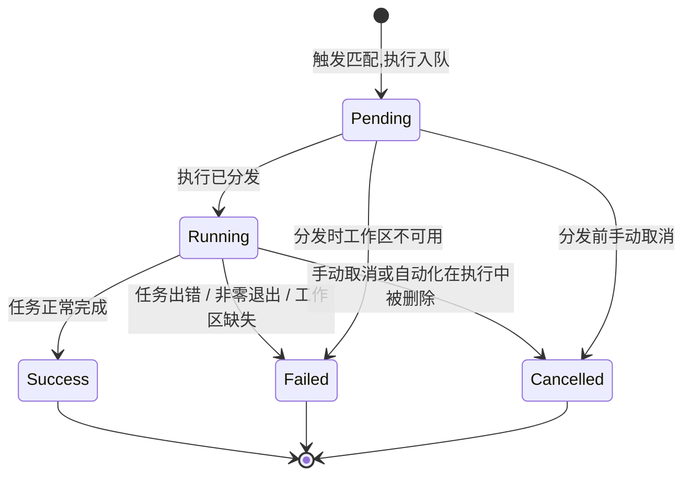

# automations — 领域规格

## 概览

automations 领域为 c3 增加了**任务执行**能力。一个**自动化(Automation)**持有一份任务定义
(shell 命令或 LLM prompt),外加触发器、工作区绑定与执行身份。当其
触发条件满足时——一次挂钟时间/cron 匹配、一个订阅的**运行生命周期事件**
(`run:started` / `run:settled`,2026-06-08),或一个 **`pr:operation` 事件**(模型发布或
服务端发布,2026-06-20)——调度引擎会在该工作区的上下文中生成一次执行,
并把结果记录到一条 **ExecutionLog** 中。

**PR 操作事件有两个发布来源。** 模型用自己的工具(`gh` CLI、GitHub MCP 等)执行 PR 操作,
之后调用 c3 提供的 MCP 工具 `publish_event`,发布一个厂商中立的 PR 操作事件。此外,c3 的
服务端 PR 创建路径(dev-cleanup / automation / 手动 create_pr)在代表模型成功创建 PR 后,
也会发布一个 `create`/`success` 事件。automations 领域只定义事件契约、发布渠道以及
订阅/触发方式——见 § PR 操作事件。

自动化是**工作区范围的**:每个自动化恰好属于一个工作区(在 session-registry 中登记的目录)。
这意味着自动化运行时使用该工作区的 `cwd`、环境变量、项目设置、会话与智能体配置——
就像来自该工作区的一次用户发起的运行一样。

用户在 web-console 中查看自动化及其日志,并通过确认队列
(生效前的「待处理变更」)来管理它们。

**范围:** 自动化的增删改查、时序/状态管理、执行分发、日志记录、写入确认队列。
**边界:** 它不运行智能体(`agent-session`),不决定单次调用的权限
(`permission-gateway`),也不渲染 UI(`web-console`)。

## 核心实体

| 实体         | 说明                                                                   | 关键属性                                                                                                                                                                                                |
| ------------ | ---------------------------------------------------------------------- | ------------------------------------------------------------------------------------------------------------------------------------------------------------------------------------------------------- |
| Automation   | 一项任务:命令或 LLM prompt,由 cron、运行生命周期事件或 PR 操作事件触发 | `id`, `workspaceId`, `taskType`, `vendor`, `state`, `triggerType`, `metadata`, `cronExpression` / (`eventTopic`, `eventReasonFilter`, `eventPrFilter`, `eventSessionKindFilter`, `eventMetadataFilter`) |
| ExecutionLog | 单次自动化执行的记录                                                   | `id`, `automationId`, `status`, `startedAt`, `output`                                                                                                                                                   |

完整属性见 [automations-models.md](automations-models.md)。

## 业务规则

| ID      | 规则                                                                                                                                                                                                                                                                                                                                                                                                                                                                                                                                                                                                                                                                                                                                                                                                                                                                                                                                                                                                                                                                                                                                                                                                                                   |
| ------- | -------------------------------------------------------------------------------------------------------------------------------------------------------------------------------------------------------------------------------------------------------------------------------------------------------------------------------------------------------------------------------------------------------------------------------------------------------------------------------------------------------------------------------------------------------------------------------------------------------------------------------------------------------------------------------------------------------------------------------------------------------------------------------------------------------------------------------------------------------------------------------------------------------------------------------------------------------------------------------------------------------------------------------------------------------------------------------------------------------------------------------------------------------------------------------------------------------------------------------------- | --------------------------------------------------------------------------------------------------------------------------------------------------------------------------------------------------------------------------------------------------------------------------------------------------------------------------------------------- |
| SCH-R1  | 自动化在创建时**必须**引用一个已存在于 session-registry 中的工作区。删除该工作区会导致其所有自动化被**归档**(而非删除——日志会被保留);已归档的自动化不再被调度器评估。                                                                                                                                                                                                                                                                                                                                                                                                                                                                                                                                                                                                                                                                                                                                                                                                                                                                                                                                                                                                                                                                  |
| SCH-R2  | 自动化的任务恰好是两种类型之一:`command`(一个 shell 命令字符串)或 `llm_prompt`(发送给智能体会话的 prompt 文本)。类型在创建后不可变。                                                                                                                                                                                                                                                                                                                                                                                                                                                                                                                                                                                                                                                                                                                                                                                                                                                                                                                                                                                                                                                                                                   |
| SCH-R3  | 时序要么是**一次性**(一个具体的 `triggerAt` 时间戳),要么是**周期性**(一个 `cronExpression`)。恰好设置其中一个时序字段;两者都设置或都未设置的自动化会在创建时被拒绝。(周期性自动化**在 v1 中未实现**;见 v1 排除清单。)                                                                                                                                                                                                                                                                                                                                                                                                                                                                                                                                                                                                                                                                                                                                                                                                                                                                                                                                                                                                                  |
| SCH-R3a | 周期性自动化的 `cronExpression` 按**系统级 IANA 时区**(`SystemSettings.timezone`,默认使用服务器本地时区)解释,**而非** UTC:`0 11 * * *` 表示该时区的 11:00。计算出的 `next_run_at` 仍是一个绝对时刻,并感知夏令时。更改系统时区会移动现有自动化的实际触发时刻(在其下一次创建/更新/运行时重新计算)。见 [automations-design.md](automations-design.md) § automations table → Time zone。                                                                                                                                                                                                                                                                                                                                                                                                                                                                                                                                                                                                                                                                                                                                                                                                                                                   |
| SCH-R4  | 自动化的**执行身份**是 `read-only`、`sandboxed` 或 `full-access` 之一(见 § 执行身份模型)。它是可变的,并适用于该自动化的每一次执行。                                                                                                                                                                                                                                                                                                                                                                                                                                                                                                                                                                                                                                                                                                                                                                                                                                                                                                                                                                                                                                                                                                    |
| SCH-R5  | 处于 `active` 状态的自动化会被调度器评估。处于 `paused` 状态的自动化仍然存在但**不会**被评估——其触发会被跳过,直到恢复。手动「立即运行」是例外:`active` 和 `paused` 的自动化均可被分发执行一次,且不改变 `status` 或 `nextRunAt`;`archived` 的自动化始终不可分发。处于 `archived` 状态的自动化被冻结用于留档;它不会被评估,其状态也不能回退到 `paused` 或 `active`。                                                                                                                                                                                                                                                                                                                                                                                                                                                                                                                                                                                                                                                                                                                                                                                                                                                                      |
| SCH-R6  | 写入一个自动化(创建 / 更新字段 / 变更状态)会在 web-console 中产生一条可见的**待处理变更**。该变更只有在用户从队列中显式确认后才会生效。队列会阻塞,直到用户接受或拒绝——没有自动批准。(例外:`archive` 与 `delete` 在确认后立即生效——它们不可延迟。)                                                                                                                                                                                                                                                                                                                                                                                                                                                                                                                                                                                                                                                                                                                                                                                                                                                                                                                                                                                      |
| SCH-R7  | 一个自动化的执行是**逐个串行的**:同一时刻同一自动化最多只能有一次执行在进行中。如果一个周期性自动化的下一次触发在前一次执行仍在运行时到来,新的触发会被跳过(而不是排队)。                                                                                                                                                                                                                                                                                                                                                                                                                                                                                                                                                                                                                                                                                                                                                                                                                                                                                                                                                                                                                                                               |
| SCH-R7a | 一个 cron 自动化如果其 `nextRunAt` 逾期超过五分钟,则不会被补跑。调度器会记录一次带有 `missed_trigger_window` 的失败执行,基于当前时间重新计算 `nextRunAt`,并使该自动化保持 `active`;逾期触发不得自动使自动化失效。内部的智能体配额恢复自动化保留其独立的迟到恢复行为(SCH-R20)。                                                                                                                                                                                                                                                                                                                                                                                                                                                                                                                                                                                                                                                                                                                                                                                                                                                                                                                                                         |
| SCH-R28 | **工作区级自动化总闸**(`WorkspaceSetting.automationEnabled`,2026-07-13)。每个工作区有一个持久化的自动化总开关,缺省为**开启**——规范化只把显式布尔 `false` 视为关闭,缺省 / 非布尔 / 旧的非法值一律归一为 `true`,因此现有工作区升级后行为不变(无需数据库迁移,值进入既有 workspace 配置 JSON)。关闭时,tick 循环与事件分发器都**在派发前短路**该工作区的一切自动触发(cron 与全部 `event` 主题):cron 到期项在进入宽限窗口判断(SCH-R7a)与 `dispatchAndTrack` 之前被丢弃,并以当前 tick 时间按其 cron 表达式重算 `nextRunAt`——**不**补跑、**不**记 `missed_trigger_window`、**不**产生任何执行日志(用户主动静音不是系统错过);事件在检查后整次直接返回,被抑制的事件**不排队**,重开后只处理新到达事件。总闸**只**阻止此后新产生的自动派发:它**不**改写任何单条自动化的 `active` / `paused` 状态,**不**取消已在途执行,也**不**影响手动「立即运行」(SCH-R5 的 run-now 仍可执行 `active` 与 `paused` 的自动化)。设置读取失败或缺失时按开启处理,避免瞬时配置故障静默关闭既有自动化。                                                                                                                                                                                                                                                                  |
| SCH-R8  | 一次执行运行在该自动化的工作区上下文中(`cwd`、项目设置、会话等)。如果工作区在自动化创建与执行之间已被移除,该次执行会立即以 `workspace_removed` 失败。                                                                                                                                                                                                                                                                                                                                                                                                                                                                                                                                                                                                                                                                                                                                                                                                                                                                                                                                                                                                                                                                                  |
| SCH-R9  | 一次执行的智能体运行使用执行身份来决定权限敏感度。`read-only` 强制使用等价于 `plan`/`bypassPermissions` 的模式;`full-access` 使用会话当前的模式;`sandboxed` 应用一个受限的工具允许列表(见 § 执行身份模型)。                                                                                                                                                                                                                                                                                                                                                                                                                                                                                                                                                                                                                                                                                                                                                                                                                                                                                                                                                                                                                            |
| SCH-R10 | 执行日志一旦设置了 `startedAt` 就是**只追加**的。执行状态只能向前迁移:`pending` → `running` → `success` \| `failed` \| `cancelled`。一个从未开始的 `pending` 执行(例如触发时工作区不可用)会被置为 `failed`,并附带描述性的 `errorMessage`。                                                                                                                                                                                                                                                                                                                                                                                                                                                                                                                                                                                                                                                                                                                                                                                                                                                                                                                                                                                             |
| SCH-R11 | 自动化及其日志遵循与其所属工作区相同的**可见性规则**。只有对该工作区拥有 `Owner` 或 `Editor` 权限的用户才能修改自动化;`Viewer` 权限只能只读查看列表。访问模型见 [permission-gateway](../permission-gateway/permission-gateway-spec.md)。                                                                                                                                                                                                                                                                                                                                                                                                                                                                                                                                                                                                                                                                                                                                                                                                                                                                                                                                                                                               |
| SCH-R12 | 一个 `command` 类型自动化的执行会在工作区目录中生成一个**无头 shell 进程**。不会显示任何权限提示——该命令以工作区的项目级 `allow`/`deny` 规则以及该自动化的 `executionIdentity` 模式运行。如果命令返回非零退出码,日志会记录为 `failed`。                                                                                                                                                                                                                                                                                                                                                                                                                                                                                                                                                                                                                                                                                                                                                                                                                                                                                                                                                                                                |
| SCH-R13 | 一个 `llm_prompt` 类型自动化的执行会以工作区上下文启动一个智能体会话(通过 `agent-session`)。该 prompt 作为第一个用户回合提交。运行过程中的 `assistant_text` 与 `tool_use`/`tool_result` 会被记录进日志。执行的智能体 `sessionId` 从第一个 SDK 事件中捕获,并立即持久化到执行日志上(这样即使运行之后超时或失败,transcript 仍然可达)。运行期间的权限提示会根据执行身份自动解决(见 § 执行身份模型)。运行的终止状态(`complete` / `error`)会映射为日志中的 `success` / `failed`。                                                                                                                                                                                                                                                                                                                                                                                                                                                                                                                                                                                                                                                                                                                                                            |
| SCH-R14 | `archive` 与 `delete` 是终态操作。一个已归档的自动化只能被删除;它不能变回 `paused` 或 `active`。删除一个自动化也会级联删除其**执行日志**。这是一次硬删除——日志被永久移除。                                                                                                                                                                                                                                                                                                                                                                                                                                                                                                                                                                                                                                                                                                                                                                                                                                                                                                                                                                                                                                                             |
| SCH-R15 | 写入确认队列是**按用户**(按 WebSocket 连接)划分的,而不是按工作区划分的。未确认的变更只对创建它们的用户可见,并且在确认之前保持可编辑(可被替换或丢弃)。确认操作会原子性地提交该用户的全部待处理变更——在自动化层面没有部分确认(SCH-R6 的例外:archive/delete)。                                                                                                                                                                                                                                                                                                                                                                                                                                                                                                                                                                                                                                                                                                                                                                                                                                                                                                                                                                            |
| SCH-R16 | 每个 `llm_prompt` 类型执行的智能体会话 transcript 都可以从其历史记录行按需查看(对 `assistant_text` / `tool_use` / `tool_result` 的只读回放)。`command` 类型的执行没有智能体会话,也不暴露任何 transcript 条目。transcript 通过记录下来的 `sessionId` 经由 `agent-session` 加载;一个无会话或已被删除的会话会产生一个空回放,而不是错误。                                                                                                                                                                                                                                                                                                                                                                                                                                                                                                                                                                                                                                                                                                                                                                                                                                                                                                  |
| SCH-R17 | 自动化的**触发器**是 `cron`(基于时间;默认方式,也是该字段引入之前迁移的旧行的唯一模式)或 `event` 之一。`event` 触发器声明一个 `eventTopic`——一个内核运行生命周期事件(`run:started` / `run:settled`,2026-06-08)**或** `pr:operation` 事件(模型发布或服务端发布,2026-06-20)——并在内核事件总线(ADR-0018)上发布匹配事件时触发其执行——复用与 cron 运行**相同**的分发路径、三层 MCP 安全模型与写入审批队列。事件类自动化不携带 `cronExpression` / `nextRunAt`,并且**永远不会**被 tick 循环评估。创建/更新一个没有 `eventTopic` 的 `event` 自动化会被拒绝(`automation.invalidEventTrigger`)。                                                                                                                                                                                                                                                                                                                                                                                                                                                                                                                                                                                                                                                  |
| SCH-R18 | 一个**运行生命周期**类的 `event` 触发器(`run:started` / `run:settled`)只在**全部**条件成立时触发:事件的 `sessionKind` 属于该自动化的 **`eventSessionKindFilter`**——一个显式的、手动选择的、**非空**的 `SessionKind` 值集合(2026-07-04,取代了此前硬编码的 `['work']` 白名单);事件的 `workspacePath` 等于该自动化的工作区;对于 `run:settled`,其终止 `reason`(`complete` / `error` / `aborted`)属于可选的 `eventReasonFilter`(空/null = 任意原因);并且事件的 `metadata` 满足可选的 `eventMetadataFilter`(见 SCH-R25)。创建/更新一个 `eventSessionKindFilter` 缺失或为空的运行生命周期事件自动化会被拒绝(`automation.missingSessionKindFilter`)——前端不预选任何默认值,服务端无论客户端如何都强制执行该规则。旧的运行生命周期行迁移为一个显式的 `['work']` 过滤器,精确保留其此前的行为(它们**不会**被放宽到 `automation` / `discussion` / `intent` 来源)。由于 `sessionKind='automation'` 现在可以被选中,一个自动化的完成**可以**触发另一个——这是流水线链的探测器。事件风暴节流复用 SCH-R7 的串行执行:当自动化已经有一次执行在进行中时,到来的事件会被**跳过**,而不是排队。**没有**环检测或链深度限制(见 § v1 排除清单):SCH-R7 的单自动化串行门只能防止一个自动化自身的并发堆叠,不能防止全局的 A↔B 循环。                                    |
| SCH-R25 | **自动化 metadata + metadata 条件过滤器**(2026-07-04)。每个自动化都携带一个自由形式的 **`metadata`** map(`Record<string,string>`,无预设 key,无 schema——只做长度/字符集卫生检查:去除首尾空白、丢弃空 key/value、上限 32 项、key ≤64 / value ≤256 字符)。只有调度器**自身**为该自动化发布的 `run:started` / `run:settled` 会把其 `metadata` 印到事件负载上;其他一切发布点(手动 work 运行、intent 交接、discussion)都让负载的可选 `metadata` 保持 `undefined`,因此现有运行不会被隐式打标签。一个运行生命周期事件触发器可以声明一个 **`eventMetadataFilter`** = `{ conditions: {key,value}[]; combinator: 'AND'                                                                                                                                                                                                                                                                                                                                                                                                                                                                                                                                                                                                                            | 'OR' }`:`null`/空条件匹配任意事件;`AND`要求**每一个**条件都精确等于事件的`metadata[key]`,`OR` 要求**至少一个**匹配(精确字符串相等——不做大小写折叠、正则或子串匹配)。一个没有 metadata 的事件永远不满足非空过滤器。`metadata`/`eventMetadataFilter`只适用于运行生命周期触发器;cron /`pr:operation`/`intent:lifecycle`行将它们存为`{}`/`null`。 |
| SCH-R22 | 一个 **`pr:operation`** 的 `event` 触发器只在**全部**条件成立时触发:事件的 `workspacePath` 等于该自动化的工作区;事件的 `operation`(`create` / `review` / `merge` / `close` / `comment` / `update`)属于该自动化可选的 `eventPrFilter.operations`(空/null = 任意操作);且事件的 `result`(`success` / `failure` / `error`)属于 `eventPrFilter.results`(空/null = 任意结果)。`error` 结果代表执行异常(CI 流水线超时、工具异常),区别于评审未通过。SessionKind 白名单(SCH-R18)**不**适用——一个 PR 事件不携带 sessionKind;它要么由模型在一个 work 会话内发布,要么由服务端 PR 创建路径发布。节流复用 SCH-R7(一次在途执行会跳过新事件)。                                                                                                                                                                                                                                                                                                                                                                                                                                                                                                                                                                                                         |
| SCH-R23 | **`publish_event` MCP 工具**(单一通用工具)由 c3 提供给**每一个** work 会话(新建的与恢复的),在 Claude 与 Codex 两条厂商路径上都可用。它接受一个厂商中立的通用事件 `GenericEvent`(`type` 必填且须为已注册类型 + 可选的 `status` / `description` / `metadata` / `data`);PR 操作事件用 `type='pr:operation'`、`status`=result、`metadata.operation`=operation、`data` 承载 `{ pr, repo, ref, association }`、`description`=errorSummary。事件先经通用契约校验,再由该 `type` 注册的归一化器归一化,成功后以 `GenericEventEnvelope` 发布到内核事件总线的单一 `'event'` topic。它**不**受人工确认门控(发布一个事件没有破坏性副作用;有门控的、有副作用的步骤是它可能触发的自动化)。未注册的 `type`、非法结构或归一化器拒绝(含缺失/非法的 operation/result)都会以错误结果被拒绝,且不发布任何内容。所有字符串字段在事件离开 c3 之前都会被**安全归一化**——token、命令行原始输出与绝对路径都会被剥离——因此任何监听者都不会收到秘密信息。信封的 `workspacePath` / `sessionId` 来自单次运行的绑定(事件 `metadata`/`data` 内的同名键无法覆盖),因此模型无法伪造另一个工作区。此外,c3 的服务端 PR 创建路径(dev-cleanup / automation / 手动 create_pr)会在代表模型成功创建一个 PR 后构造一个 `type='pr:operation'` 的 `create`/`success` 事件走同一条链。 |
| SCH-R19 | 展示用的 `name` 在**创建时自动生成**(客户端名称被剥离,SCH 命名法)。在**更新**时客户端可以通过 `config.name` 提供一个手动标题:一个非空值会被存储为一个**粘性的用户设置名称**(`config.nameSource='user'`),自动命名永远不会覆盖它——它在之后的正文编辑中保留(一次没有 `name` key 的更新会保留现有名称及其来源标记)。更新时的空 `name` 会**恢复**为一个重新自动派生的名称(清除用户标记)。创建操作永远不接受客户端提供的名称(手动标题只能在编辑时设置)。                                                                                                                                                                                                                                                                                                                                                                                                                                                                                                                                                                                                                                                                                                                                                                                     |
| SCH-R20 | **内部一次性智能体恢复自动化**(2026-06-15-002)。智能体配置配额恢复流程可能会创建一行系统拥有的自动化,其 config 标记它是一个智能体配额恢复动作,记录被禁用的智能体名称,以及绝对的重置时刻。它复用 cron / 下次运行 tick 引擎,但是一次性的:到期时,分发器重新启用该智能体,然后调度器**删除该自动化行**(级联其执行日志),使其不能再次触发,也不留下暂停的僵尸行——后续的配额错误会直接创建一个新的恢复行(2026-06-17-001)。这些行不是用户编写的命令自动化,也不运行 shell 命令。                                                                                                                                                                                                                                                                                                                                                                                                                                                                                                                                                                                                                                                                                                                                                                  |
| SCH-R21 | 一个自动化可以设置 `maxWallClockMs`,即其最大总执行时长(毫秒)。缺失该值时使用现有任务类型默认值(command 为 30 秒;LLM 为 60 秒)。取值必须是从 1 秒到 24 小时之间的整数毫秒。超时会将该次执行标记为失败;命令重试共享这一个总期限。                                                                                                                                                                                                                                                                                                                                                                                                                                                                                                                                                                                                                                                                                                                                                                                                                                                                                                                                                                                                        |
| SCH-R24 | 当一个正在运行的 `llm_prompt` 类型执行在执行历史页面被选中,且该页面是当前活跃、可见的视图时,其详情(状态/时长)与会话 transcript 会在客户端周期性轮询中自动刷新——新的会话内容与状态变化无需手动刷新或重新进入即可出现。轮询复用现有的只读详情与 transcript 读取(没有服务端或协议变更)。当执行到达终止状态时轮询停止,停止前会先做最后一次 transcript 抓取,以展示完整的最终内容。该轮询永远不会针对非运行中或 `command` 类型的执行运行,也不会在历史页面非活跃或文档隐藏时运行(如果运行仍然存活,页面重新可见时会恢复轮询)。                                                                                                                                                                                                                                                                                                                                                                                                                                                                                                                                                                                                                                                                                                                 |
| SCH-R27 | 当一个 `llm_prompt` 类型执行在途时,其真实的智能体 `sessionId` 会在共享的 `session_status` 快照中显示为 `running`,使得 works 页面的「automation」会话标签页能渲染出与其他会话标签页相同的运行中圆点。分发器运行在内核运行总线之外(它自己的三层 MCP 安全路径),因此它只注册一个**轻量级的运行状态标记**——没有 `SessionRuntime`、没有中止句柄、没有权限等待、没有存活对账、没有 team 语义。注册发生在 `sessionId` 被绑定到 `session_metadata` 投影的同一阶段(Claude:携带 `session_id` 的第一条 SDK 消息;Codex:`run.sessionId()`);该标记会在**每一条**终止路径上(成功、schema 校验失败、超时、抛出错误,或绑定后异常)幂等地清除。`listStatuses()` 会把这个标记与内核 `runtimes` 注册表合并,在共享同一个 `sessionId` 时以内核状态为准。`command` 类型的执行不会产生智能体会话,也永远不显示圆点。该标记是进程本地的:重启会丢弃它,客户端会从下一次快照重新收敛到 idle。                                                                                                                                                                                                                                                                                                                                                                         |

## 状态与迁移

### 自动化生命周期

```mermaid
stateDiagram-v2
    [*] --> Active: 创建 + 已确认
    Active --> Paused: 暂停(通过队列确认)
    Paused --> Active: 恢复(通过队列确认)
    Active --> Archived: 归档(立即;终态)
    Paused --> Archived: 归档(立即;终态)
    Active --> [*]: 删除(立即;级联日志)
    Paused --> [*]: 删除
    Archived --> [*]: 删除(仅此路径)
```

只有 `active` 的自动化会被调度引擎评估。`paused` 的自动化会被保留但
跳过。手动「立即运行」是例外:它可以分发一个 `active` 或 `paused` 的自动化一次,
而不改变其 status 或 `nextRunAt`;`archived` 的自动化始终不可分发。`archived`
的自动化是冻结记录;它们永远不会被评估,也永远不会返回到激活状态。

在单条自动化的状态之上,还有一个**工作区级总闸**(`WorkspaceSetting.automationEnabled`,
SCH-R28):关闭时,该工作区下所有 cron 与 `event` 自动触发都在派发前被短路(cron 到期项
重算 `nextRunAt` 且不记为错过),而单条自动化的 `active` / `paused` 状态与手动「立即运行」
均不受影响。它是一个可临时整体静音、重开后各自状态照旧的全局开关。

### ExecutionLog 生命周期

一条执行日志一旦设置了 `startedAt` 就是**只追加**的,并遵循从 `pending`
到某个终止状态的只能前进的状态链。

### 历史展示(读路径)

web-console 对自动化视图使用三栏布局:

- **左栏** —— 自动化列表:一个带有内联配置摘要(类型、
  cron、下次/即将到来的运行、MCP 模式、工具允许/拒绝列表、config JSON、时间戳)的手风琴列表。在此处选中一个
  自动化会让中间栏聚焦到该自动化的执行历史。
- **中间栏** —— 执行历史列表:当前选中自动化的执行日志行,
  每行显示**状态**徽标、**开始**时间、**时长**与**退出码**。
  点击某一行会选中该次执行,并让右栏聚焦到其详情。
- **右栏** —— 执行详情:选中执行的一个带标签页的详情面板。有条件地提供三个
  标签页:
  - **Execution Info**(所有类型):状态、开始/结束时间、时长、退出码、原始输出、
    以及错误文本。
  - **Session**(仅 `llm` 类型自动化):该次执行智能体会话的只读回放,
    通过与 sessions 页面相同的聊天消息渲染呈现——markdown 渲染、
    工具调用批次折叠与消息分组均共用同一套实现。
  - **Command Log**(仅 `command` 类型自动化):以全宽、类似终端的
    视图展示 shell 输出。

客户端请求某个自动化的详情;服务端回复该自动化及其日志,按
**最近开始的排在最前**排序。

一个没有日志的自动化在中间栏显示空状态。进入历史视图时,一个
有日志的自动化会自动选中其最近开始的执行;一个没有日志的自动化
显示既有的空状态。自动选中永远不会覆盖用户已经选中的执行。历史记录会在
每当收到一次 `automations` 广播时(例如某次执行完成后)为当前
选中的自动化重新拉取,因此已完成的运行无需手动刷新即可出现。切换选中的自动化会清除第二级的
执行选中状态。

历史标签页的操作栏会在执行浏览器操作之前,直接显示当前选中执行的标识符与开始时间。
这是一个只读的选中摘要,会在用户选择另一次执行时立即变化;
未选中任何执行时它不显示。

当一个**运行中**的 `llm_prompt` 类型执行是当前选中项,且历史页面是
当前活跃、可见的视图时(SCH-R22),控制台会额外以固定的短
间隔轮询该执行——重新读取其详情(使该行的状态/时长保持最新)以及其会话
transcript(使新产生的内容出现)——无需任何手动刷新或重新进入。这是一个
仅客户端的、基于现有只读读取的轮询;服务端不会为自动化运行推送任何实时流。
一旦执行到达终止状态,轮询就会停止,停止前会先做最后一次 transcript
读取,以落地完整结果。它永远不会针对非运行中的执行、`command` 类型
执行、历史页面非活跃视图,或文档隐藏的情况运行——重新变为
可见会在运行仍然存活时恢复轮询。

### 会话 transcript(读路径,SCH-R16)

对于 `llm` 类型自动化,右栏的 **Session** 标签页会通过与 sessions 页面相同的聊天消息渲染,渲染该次
执行智能体会话的只读回放,提供
markdown 渲染、工具调用批次折叠与消息分组。该视图是纯历史性的:没有
权限响应、没有流式传输、没有继续交互。`command` 类型自动化不显示
Session 标签页(因为不会产生智能体会话)。

当用户切换到 Session 标签页时,如果尚未缓存,客户端会通过
`get_execution_transcript` 自动拉取 transcript。服务端解析该执行日志记录的会话 id,
经由 agent-session 回放存储的 transcript,并以 `execution_transcript` 回复,携带
执行 id、会话 id,以及一个展平的 transcript 条目列表(assistant / user / tool-use /
tool-result / notice),与实时聊天回放完全一致。一个 `command` 类型或无会话的执行会
返回一个 null 会话 id 与一个空的条目列表;一个未知的执行 id 会返回一个错误。对于一次
已完成的执行,transcript 只拉取一次,并按执行在客户端缓存;对于一次
**运行中**的选中执行,它会被实时刷新轮询(SCH-R22)重新拉取,以使进行中的
内容持续增长,并在完成时做最后一次拉取。每次回复都会覆盖该执行的缓存条目,
因此运行中的重新拉取永远不会把视图翻回到其加载状态。

从 transcript 条目到聊天消息的映射由一个纯展示层步骤处理,类似
discussions 所用的那个——把一个 transcript 条目转换为一条聊天消息,把一整个 transcript 转换
为一个聊天消息列表;后者也有单元测试覆盖。

## 任务类型

| 类型         | 配置                         | 执行模型                                                                                                          |
| ------------ | ---------------------------- | ----------------------------------------------------------------------------------------------------------------- |
| `command`    | Shell 命令字符串             | 在工作区目录中生成一个无头 OS 进程。stdout + stderr 会被捕获进输出中。退出码 0 ⇒ `success`;非零/出错 ⇒ `failed`。 |
| `llm_prompt` | Prompt 文本 + 可选的会话模式 | 将文本作为第一个用户回合提交给工作区中一个全新的智能体会话。运行流会被捕获。该回合结束后会话结束。                |
|              |                              |                                                                                                                   |

两种类型共享通用的调度、权限与日志基础设施。差异只在执行驱动器上。

## 触发器

自动化从两种触发器类型之一触发(SCH-R17、SCH-R18):

| 触发器                     | 触发条件                                                                                     | 重新装填                                    |
| -------------------------- | -------------------------------------------------------------------------------------------- | ------------------------------------------- |
| `cron`                     | 在系统时区(SCH-R3a)中,通过 10 秒 tick 循环对 `cronExpression` 做一次挂钟时间匹配。           | tick 循环在每次运行后重新计算 `nextRunAt`。 |
| `event` run-lifecycle      | 内核事件总线(ADR-0018)上一个被订阅的运行生命周期事件:`run:started` 或 `run:settled`。        | 等待下一个匹配事件——没有 `nextRunAt`。      |
| `event` `pr:operation`     | 内核事件总线上的一个 PR 操作事件——模型发布或服务端发布(SCH-R22、SCH-R23)。                   | 等待下一个匹配事件——没有 `nextRunAt`。      |
| `event` `intent:lifecycle` | 进程内的一个 intent 生命周期边界:`created`、`dev_started`、`done`、`failed` 或 `cancelled`。 | 等待下一个匹配事件——没有 `nextRunAt`。      |

内部智能体恢复行复用 cron 触发器的存储方式,外加一个等于解析出的重置时刻的具体
`nextRunAt`。触发后它们会自我删除,因此它们表现为一次性自动化,而无需新增
调度器或新增表列。

### 运行生命周期事件(发布点)

运行路径会发布以下**内核总线**事件(在此被消费;它们不是 wire frame):

- `run:started` —— 每次运行启动时发布一次,发生在厂商分叉之前,因此同时覆盖
  claude 路径与 driver 路径。负载:session id、工作区路径、sessionKind、runKind,以及一个
  可选的 `metadata` map(只有调度器自身的自动化运行会为其打标;见 SCH-R25)。
- `run:settled` —— 在每次运行的终止状态兜底处发布(claude 路径与 driver
  路径),以及在厂商不可用的提前返回时发布。负载:session id、工作区路径、终止
  reason、sessionKind、runKind、可选的 `metadata`——其中 reason ∈ `complete | error | aborted`(用户停止 ⇒ `aborted`;干净
  结束 ⇒ `complete`;抛出异常 / 链耗尽 / 单次尝试失败 ⇒ `error`)。

业务场景是 **SessionKind**(`work | intent | discussion | automation | consensus | tool | spec`;
见 glossary + ADR-0018),它是共享协议中的唯一真源;它在 2026-06-26 从旧的
7 值 `RunKind` 中拆分出来(`'session' → 'work'`)。与之并存,运行还携带一个 **RunKind**
执行形式(`interactive | background | headless | internal`)。哪些 sessionKind 会触发某个给定的
事件自动化,现在由自动化自己的 **`eventSessionKindFilter`**(SCH-R18,2026-07-04)决定,而不是
一个全局白名单——因此 `automation` 可以被选中,一个自动化的完成可以触发
另一个(流水线链)。`automation` 仍然只标记调度器自身的无 socket 运行;一个由
自动化*触发*的目标运行仍然是 `work`。一个 `run:started` 总是有一个匹配的 `run:settled`。

**discussion** 编排运行就是这样一个发布者:`startDiscussionRun` 会发出携带
`sessionKind='discussion'` 的 `run:started` 与 `run:settled`,其终止 reason 把
「discussion 已开始 / 已失败 / 已结束」映射为 `complete` / `error` / `aborted`。一个在
`eventSessionKindFilter` 中选中 `discussion` 的运行生命周期 `event` 触发器自动化(可选地
再过滤 `reason`)已经覆盖了「一个 discussion 开始了 / 出错了 / 结束了」——因此 discussion 的 c3
MCP 工具刻意**不**新增一个单独的 discussion 生命周期事件主题;对错误后悬空状态
(`reason='error'`,随后 `in_progress` 且没有存活运行)的可观测性,搭在这些既有事件加上
discussion 列表刷新之上,而恢复手段是 `continue_discussion` 工具。

### 过滤与节流

每次事件到来时,调度器会选出 `eventTopic` 匹配的、处于激活状态的 `event` 自动化,然后
只保留通过该主题过滤器的那些——运行生命周期:SCH-R18(工作区 → `eventSessionKindFilter`
→ reason → `eventMetadataFilter`);`pr:operation`:SCH-R22(工作区 → operation → result)。
每个自动化的匹配判定由一个**单一的纯求值函数**(`evaluateAutomationTriggerMatch`)完成,返回
`{ matched, breakdown }`,使匹配语义与分发管道相隔离。每个存活下来的都会经由常规的 dispatch-and-track
→ execute 路径分发。SCH-R7 的在途串行化同时充当事件风暴节流:已经在运行的
自动化收到的第二个事件会被跳过。

### PR 操作事件(`pr:operation`,SCH-R22 / SCH-R23)

c3 **不会**创建、评审、合并、关闭或评论一个 pull request。模型用自己的工具执行该
操作,之后通过 c3 提供的 MCP 工具 `publish_event`(全限定名 `mcp__c3__publish_event`)发布
一个厂商中立的 PR 操作事件。该工具对两条厂商路径上的**每一个** work 会话(新建的与恢复的)都可用,没有按会话的
退出选项——模型只是获得了发布能力,仅此而已。一个自动化通过选择 `pr:operation` 主题
来**opt-in** 这个事件源;选中它就是显式的订阅,不选它的自动化永远不会被 PR 事件触发。这里的
`update` 操作(已有 PR 被打回后修改重提/重开)是一个普通的可过滤操作;**独立地**,一个
`update`/`success` 事件也会被 intent 域消费,用于把一个被拒绝/失败/关闭的 intent 的 `prStatus`
重置回 `reviewing`——那个消费者与自动化分发是分离的(见 intent-management 规格),因此一个没有
自动化的工作区仍然会得到状态复位。

**事件契约(厂商中立):**

| 字段           | 含义                                                                                                                                 |
| -------------- | ------------------------------------------------------------------------------------------------------------------------------------ |
| `operation`    | `create` / `review` / `merge` / `close` / `comment` / `update` (必填)。`update` = 已有 PR 被模型修改后重新提交/重新打开(非新建 PR)。 |
| `result`       | `success` / `failure` / `error` (必填)。`error` 表示执行异常(CI 超时/工具出错),区别于评审不通过。                                    |
| `pr`           | 可选的 PR 身份:`number` / `id` / `url` / `title` / `state`。                                                                         |
| `repo`         | 可选的仓库上下文:`provider`(默认 `github`,例如 `gitlab`)/ `host` / `owner` / `name`。                                                |
| `ref`          | 可选的分支上下文:`head` / `base`。                                                                                                   |
| `association`  | 可选的、回指某个 c3 工作项的链接:`intentId` + `intentTitle`(意图名称,自解释)。                                                       |
| `errorSummary` | 可选,只在 `failure` 或 `error` 时有意义;在服务端安全归一化(不含秘密信息)。                                                           |

**边界:**

- **c3 中没有 PR 执行 / 没有 provider。** 该领域不新增任何 GitHub/GitLab provider,不为
  `gh` / PR 创建提供任何命令包装,也没有独立的 PR 操作自动化机制。该契约刻意保持
  provider 中立,为 GitLab 等其他平台留出空间。
- **发布没有确认门。** 发布事件本身没有破坏性,是自动允许的;有副作用、
  受门控的步骤是该事件可能触发的自动化(受该自动化的执行身份与三层 MCP 安全模型管辖)。
- **没有送达保证。** 发布依赖于模型显式调用该工具;c3 不会
  探测 PR 状态,也不会补发事件。没有事件 ⇒ 没有触发,这是设计使然。
- **安全性。** 非法/缺失的 `operation`/`result` 会被拒绝,且不发布任何内容;每个字符串
  字段都会被归一化,以剥离 token、原始 CLI 输出与绝对路径,然后事件才会被
  发布(SCH-R23)。

## 工作区绑定

每个自动化都有一个必填的 `workspaceId`,引用 session-registry 中的一个工作区。这个
绑定在**创建后不可变**——一个自动化不能被移动到另一个工作区。

当一个工作区从 session-registry 中被移除时:

- 它的所有自动化都会被**自动归档**(SCH-R1)。
- 在途执行会被取消(日志中记为 `cancelled`)。
- 已归档的自动化仍会在 web-console 中可见,并带有 `workspace_removed` 标注。

## 权限

自动化复用既有的工作区级权限模型(`Owner` / `Editor` / `Viewer`):

| 能力               | Owner | Editor | Viewer |
| ------------------ | ----- | ------ | ------ |
| 列出自动化及日志   | ✓     | ✓      | ✓      |
| 创建自动化         | ✓     | ✓      | —      |
| 编辑自动化字段     | ✓     | ✓      | —      |
| 暂停 / 恢复        | ✓     | ✓      | —      |
| 归档 / 删除        | ✓     | —      | —      |
| 确认写入队列       | ✓     | —      | —      |
| 手动触发(立即运行) | ✓     | ✓      | —      |
| 取消在途执行       | ✓     | ✓      | —      |

权限模型在**写入时**(用户在 web-console 中的操作)强制执行。自动化在
触发时刻的执行使用该自动化自己的 `executionIdentity`——而不是创建者的身份。

## 执行身份模型

每个自动化都携带一个**执行身份**,决定其运行在权限与工具访问方面的行为方式。这与
创建者的身份是分离的——它是自动化自身在运行时的人格。

| 身份          | 运行时权限模式          | 工具访问                             | 使用场景                 |
| ------------- | ----------------------- | ------------------------------------ | ------------------------ |
| `read-only`   | 等价于 `plan`(无写工具) | 仅只读工具。任何写工具尝试 → 拒绝。  | 监控健康检查、读取数据。 |
| `sandboxed`   | 受限允许列表            | 一组经过筛选的安全工具子集(见下文)。 | 例行维护、非破坏性操作。 |
| `full-access` | 使用工作区会话的模式    | 工作区会话模式所允许的所有工具。     | 自动化部署、数据操作。   |

### 沙盒工具允许列表(v1 基线)

| 工具类别           | 是否允许? |
| ------------------ | --------- |
| Bash(只读)         | ✓         |
| Read / Glob / Grep | ✓         |
| Write / Edit       | —         |
| Agent / Agent 工具 | —         |
| WebFetch           | ✓         |
| WebSearch          | ✓         |
| Bash(写/变更)      | —         |

该允许列表是 v1 基线,未来迭代中可能通过系统配置扩展。

### 权限提示的自动解决

在一次 `llm_prompt` 执行期间,智能体可能会发出权限请求。执行身份
决定自动解决的方式:

| 身份          | 权限提示处理方式                                                |
| ------------- | --------------------------------------------------------------- |
| `read-only`   | 任何敏感工具 → 立即拒绝;不显示任何用户提示。                    |
| `sandboxed`   | 只有允许列表上的工具被自动允许;不在允许列表上的工具被静默拒绝。 |
| `full-access` | 所有工具都被自动允许(自动化执行没有权限门)。                    |

在传输层面,自动化发起的运行不会有任何 `permission_request` 到达 web-console——它们
完全在服务端被解决。

## 写入确认队列

所有自动化写操作(创建、编辑字段、变更状态,archive/delete 除外)遵循一个两阶段
流程:

1. **阶段 1(提议):** 用户的变更被捕获为一条**待处理变更**,并显示在
   web-console 的写入队列面板中。此时尚未持久化或纳入调度。
2. **阶段 2(确认):** 用户审阅所有待处理变更并点击「确认」。变更会作为一个
   原子批次一并提交。在确认之前,用户可以丢弃单个条目或
   整个队列。

理由:自动化控制着自主执行。一次误操作的保存不应该在凌晨 3 点立即引发一次
破坏性运行。确认队列给用户一个审慎审阅的步骤。

**按用户隔离**(SCH-R15):每个 WebSocket 连接都有自己的队列。如果用户刷新页面
或重新连接,队列会丢失——变更必须重新提议。这是刻意为之:队列
是短暂的、不持久化的,以避免过期的待处理变更跨会话残留。

**例外:** `archive` 与 `delete` 绕过队列——它们在用户操作后立即生效
(但仍需要用户在一个单条提示对话框中确认,而不是一个多条目队列)。这些操作是
破坏性的,用户期望它们立即生效。

## v1 排除清单

以下能力被明确列为 v1 自动化实现的**范围之外**:

| 特性                | 理由                                                                                                                                                                                                                                                                                                                                                                                |
| ------------------- | ----------------------------------------------------------------------------------------------------------------------------------------------------------------------------------------------------------------------------------------------------------------------------------------------------------------------------------------------------------------------------------- |
| 周期性自动化(cron)  | 增加状态机复杂度(下次 tick 计算、cron 解析库、错过的 tick 追赶)。v1 中只支持一次性。                                                                                                                                                                                                                                                                                                |
| 环检测 / 链深度限制 | 截至 2026-07-04,一个自动化的完成**可以**触发另一个(SCH-R18 允许选择 `sessionKind='automation'`,SCH-R25 的 metadata 让链可以自我标识),因此 `A→B` 流水线现在是可搭建的。仍然在范围之外的是对这些链的**安全性分析**:没有 DAG 追踪、没有环形检测、没有链深度或事件风暴上限。用户必须自行避免设计出 `A↔B` 互相触发的循环;唯一的兜底手段是 SCH-R7 的单自动化串行执行,它无法证明全局无环。 |
| 共享自动化模板      | 跨工作区或组织级的自动化模板需要一个模板存储与命名空间。                                                                                                                                                                                                                                                                                                                            |
| 自动化分组 / 标签   | 组织性元数据(标签、文件夹、分组)会增加查询/索引开销,而 v1 用户没有此需求。                                                                                                                                                                                                                                                                                                          |
| 日历 / 可视化时间线 | 计划事件的甘特图或日历视图纯属 UI 范围;推迟到 web-console 待办清单。                                                                                                                                                                                                                                                                                                                |
| 邮件 / webhook 通知 | 外部通知渠道不在 c3 v1 的领域范围内。例外情况会在 UI 中呈现。                                                                                                                                                                                                                                                                                                                       |
| 执行重试策略        | 失败后的可配置重试(次数、退避)会增加状态与队列的复杂度。                                                                                                                                                                                                                                                                                                                            |
| 并行执行            | 同一个自动化的多次并发运行(SCH-R7 并行限制的放宽)。                                                                                                                                                                                                                                                                                                                                 |

## Vendor 工具清单

每个 vendor adapter 都暴露一个返回该 vendor **静态工具清单**的能力——一个条目
列表,每个条目是一个工具名加上一个写/非写分类。这个结果是预先判定好的
分类(不是运行时 MCP 服务探测),遵循与自动化执行器的工具冻结步骤相同的约定。

- **Claude**:返回 SDK 内置工具(`Read`、`Grep`、`Glob`、`LS`、`WebFetch`、`WebSearch`、
  `TaskCreate`、`TaskList`、`TaskUpdate`、`TaskGet`、`Write`、`Edit`、`NotebookEdit`、`Agent`、`Bash`)
  加上工作区 MCP 服务器的命名空间前缀(`mcp__<server>__`)。MCP 命名空间被分类
  为写(保守起见)。

该工具清单由前端通过 `get_automation_tool_manifest { vendor, workspacePath }` 获取,并以
`automation_tool_manifest { vendor, tools }` 返回。前端用它在自动化表单中渲染工具
选择 UI。

c3 提供的 MCP 能力也作为显式的 Claude 自动化允许列表选项出现。它们
永远不会仅仅因为一个自动化是 LLM 任务或有一个空的允许列表就被挂载:选中至少
一个这样的能力,是挂载工作区绑定的 c3 MCP 服务的前提条件。模板
可以预选它们所需要的条目。暴露给自动化的进程内 c3 能力是:
`mcp__c3__find_intents` / `mcp__c3__view_intent`(只读)、`mcp__c3__save_intent_pr_info` 与
`mcp__c3__publish_event`(有边界的 PR 对账)、`mcp__c3__save_intent_directly`(写),
以及四个 **discussion** 工具 `mcp__c3__find_discussions` / `mcp__c3__view_discussion`
(只读)与 `mcp__c3__start_discussion` / `mcp__c3__continue_discussion`(写)。

`save_intent_directly` 是一个**仅限自动化**的工具:它直接把一批 NEW 状态的 intent 落地为
`draft`,**绕过** `save_intents` 的确认门。自动化没有浏览器决策队列,
所以它不是对保存操作设门,而是依赖 `draft` 生命周期——人类之后通过
在 intent 列表中审阅/激活该 draft 来确认。它是**仅创建**的(永远不会更新一个已有的
intent;去重是调用者通过 `find_intents` 自己的职责),并且**只**注册在
自动化的 c3 MCP 服务器上,永远不会注册在交互式的 intent MCP 服务器上——因此这个
绕过门控的写操作被钉死在无人值守的自动化执行上。有确认门控的 `mcp__c3__save_intents`
刻意**不**提供给自动化。

### 网络访问伪条目(`network-access`,仅 codex)

`network-access` 是一个存放在 `toolAllowlist` 内的**保留伪条目**——它是一个能力开关,而不是
一个工具。它为 codex 的 `workspace-write` 沙盒切换原始网络访问(codex 默认拒绝网络,
这与文件系统写权限是正交的),使得像 `gh` / `curl` 这样的 shell 命令能够触达
网络。行为如下:

- **不是一个工具。** 执行器会在 `freezeTools()` 计算真实工具允许列表之前把它剥离,因此
  它永远不会进入被冻结的集合、读/写分类,或权限网格。一个只包含 `network-access` 的
  允许列表因此等价于一个**空的**真实允许列表(「无限制」的语义依然成立);选中它永远不会增加或移除
  任何读/写工具。
- **仅限 Codex `workspace-write`。** 分发器只有在**同时**满足该伪条目被选中**且**解析出的
  `sandboxMode` 是 `workspace-write` 时,才会把 `networkAccess: true` 传给 codex driver
  (→ `ThreadOptions.networkAccessEnabled` / `sandbox_workspace_write.network_access=true`)。一个
  `read-only` 沙盒无条件拒绝网络,而 claude vendor 没有 seatbelt 网络
  开关——即使历史记录或一次 vendor 切换让该值残留,它也会**静默忽略**该值。
- **安全默认值:关闭。** 新建的自动化不会选中它;它不属于「全选工具」的一部分,也
  永远不会因为一次全量工具选择或一次 vendor 切换而被隐式启用,因此网络边界只会
  在显式 opt-in 时才放宽。它是需要发起网络调用的自动化所需的——尤其是运行 `gh` 的 PR
  评审/合并流程。它**不会**启用 codex 内置的 `web_search`。
- **持久化。** 复用 `toolAllowlist: string[]`;没有协议 schema 变更,也没有数据库迁移。
  没有该条目的旧记录保持现有的网络拒绝行为。

### Discussion 工具(自动化 LLM 执行)

这四个 discussion 工具让一个自动化的 LLM 能够在自己的工作区中感知、启动并恢复
discussion。它们**只**注册在自动化的 c3 MCP 服务器上(永远不会注册在交互式 work
/ intent / discussion-organizer 会话上),每一个都绑定到该自动化的 `workspacePath`;工具
参数永远不接受工作区覆盖,并且每一个 id 类型的工具都会针对该绑定重新检查该 discussion 的
工作区根目录(discussion store 的 `getDiscussion(id)` 是一次全局 id 读取)。

- `find_discussions`(读)—— 列出工作区的 discussion,附带一个可选的状态过滤器,
  返回精简字段(id / title / type / status / agendaIndex / agendaCount / hasConclusion /
  updatedAt),永远不返回完整消息体。
- `view_discussion`(读)—— 返回一个自己拥有的 discussion 的详情及其按 seq 排序的消息;
  未找到或跨工作区会被拒绝(`isError`)。
- `start_discussion`(写)—— 通过共享编排器启动一个已存在的 `draft` discussion(不新建
  discussion,没有 research 阶段)。除非目标是没有存活运行的 `draft`,否则会被拒绝;
  跨工作区 / 非 draft / 已有存活运行都会返回 `isError`。
- `continue_discussion`(写)—— 有两种语义,都要求先**没有存活运行**:对一个
  `completed` 的 discussion,它会追加一个非空的 `human` 后续发言,把状态从 `completed` 翻转到 `in_progress`,
  广播,并开始新的一轮(与 WebSocket 的 `continue_discussion` 镜像对应);对一个
  **没有存活运行**的 `in_progress` discussion(错误后 / 重启后的悬空组合),
  它会**恢复**——它**不会**追加消息,也不会重置 agenda/conclusion/agent-session 状态,
  只是在最新记录上重新调用编排器,使其从持久化的
  transcript / stage / agenda / 每个智能体的 `last_seq` 处恢复。`draft`、`cancelled`、一个已有存活运行,或一个
  后续发言为空的 `completed` discussion,都会返回 `isError`。

恢复不引入**任何**新的 `DiscussionStatus`,也**没有**迁移:可恢复的场景就是可推导出的
`in_progress` + `!hasDiscussionRun` 组合。`start_discussion` / `continue_discussion`
被分类为**写**(它们驱动一次编排运行),并且仍然受自动化的模式、
允许/拒绝列表与权限处理器管辖;`find_discussions` / `view_discussion` 是读。选中
这四者中的任意一个,就足以挂载工作区绑定的 c3 MCP 服务。

## Vendor 路由(执行)

当一个 `llm_prompt` 自动化触发时,它通过显式选中的启用 Agent 运行。
Automation 保留其 vendor 作为稳定的工具清单、策略与适配器路由范围;
被选中的 Agent 必须属于该 vendor。一个缺失、被禁用或 vendor 不匹配的 Agent 会使
该次执行失败,并且永远不会回退到另一个 Agent 或 vendor。每个 vendor 都经由自己的
adapter 路径运行。

### 每个 vendor 的 c3 MCP 传输方式

自动化的 c3 工具集(intent 查询 / PR 对账写 / `save_intent_directly` /
`publish_event` / 四个 discussion 工具)在两条 vendor 路径上是**相同的**——一个
无 framing 的工具列表,其处理函数绑定到该次执行的 `workspacePath` + `executionId`——但
传输方式因 vendor 而异:

- **Claude** 把它加载为一个**进程内 SDK MCP 服务器**(`createSdkMcpServer`),挂载在
  `query()` 调用的 `mcpServers` 上。
- **Codex** 无法加载进程内 MCP(`inProcessMcp: false`),因此它通过一个
  **回环流式 HTTP MCP 路由**(`/internal/automation-mcp/v1`)消费**相同的**工具,这是
  intent / pr-event 路由的 codex 孪生版本。分发器为**一次**执行 `bind()` 该路由——铸造
  一个携带在 URL query 中的不透明的按执行 token——并把生成的 `c3` HTTP 描述符
  (带有**完整**的 enabledTools 列表,因为 codex 会把每个启用的工具标记为 required/approved)交给
  `driver.start({ mcpServers })`。该路由自身只监听本地回环并再加一层回环保护;
  一个未知或已被驱逐的 token 返回 404,一个非回环的对端返回 403。该 token 会在**每一条**
  终止路径上(成功、driver 抛出异常、消息迭代抛出异常、超时)被销毁,因此
  执行结束后工具无法再被调用;下一次执行会铸造一个全新的 token、服务器与闭包。

挂载在各 vendor 之间是**opt-in 且一致的**:c3 工具只在
自动化显式选中至少一个 `mcp__c3__*` 能力时才会附加(空的允许列表不授予
任何能力);c3 提供的服务器会刻意替换掉一个用户配置的、名为 `c3` 的工作区 MCP 服务器。
读/写授权规则不因传输方式而改变——HTTP 路由只是让工具对 codex **可见**的
接口;模式 / 允许列表 / 拒绝列表 / 权限处理器的判定仍然决定它们的实际效果。因此一个 codex 自动化现在

## 领域事件(wire)

被 automations 领域消费:

| 事件                           | 负载                        | 说明                              |
| ------------------------------ | --------------------------- | --------------------------------- |
| `automation_create`            | AutomationFields            | 提议一个新自动化(→ 待处理变更)    |
| `automation_update`            | `{ id, fields }`            | 提议对一个已有自动化的编辑        |
| `automation_pause`             | `{ id }`                    | 提议暂停(SCH-R5)                  |
| `automation_resume`            | `{ id }`                    | 提议恢复(SCH-R5)                  |
| `automation_archive`           | `{ id }`                    | 立即归档(SCH-R14)                 |
| `automation_delete`            | `{ id }`                    | 立即删除(级联日志)                |
| `automation_confirm_queue`     | `—`                         | 原子性地确认所有待处理变更        |
| `automation_discard_queue`     | `—`                         | 丢弃所有待处理变更                |
| `automation_run_now`           | `{ id }`                    | 手动触发:在常规自动化时序之外执行 |
| `automation_cancel_execution`  | `{ executionId }`           | 取消一次在途执行                  |
| `get_automation_tool_manifest` | `{ vendor, workspacePath }` | 获取一个 vendor 的静态工具清单    |

除了上述 wire 事件之外,该领域还在组合根中订阅了**内核
事件总线**的生命周期事件(`run:started` / `run:settled`,ADR-0018)以及 `pr:operation` 事件,
以驱动事件触发的自动化(SCH-R17 / SCH-R18 / SCH-R22;见 § 触发器)。这些是
进程内的总线事件,而不是 WebSocket frame。`pr:operation` 事件有两个发布来源:
`publish_event` MCP 工具(SCH-R23),以及服务端 PR 创建路径(dev-cleanup /
automation / 手动 create_pr),后者在成功创建
一个 PR 后发布 `create`/`success` 事件。

由 automations 领域发出:

| 事件                          | 负载                 | 说明                                     |
| ----------------------------- | -------------------- | ---------------------------------------- |
| `automation_created`          | AutomationFull       | 自动化已持久化并激活                     |
| `automation_updated`          | AutomationFull       | 自动化字段已变更                         |
| `automation_paused`           | `{ id }`             | 状态 → `paused`                          |
| `automation_resumed`          | `{ id }`             | 状态 → `active`                          |
| `automation_archived`         | `{ id }`             | 状态 → `archived`                        |
| `automation_deleted`          | `{ id }`             | 自动化已移除 + 日志已级联                |
| `automation_pending_changes`  | `PendingChange[]`    | 当前的待处理变更(连接时同步)             |
| `automation_queue_confirmed`  | `—`                  | 待处理变更已应用                         |
| `automation_queue_discarded`  | `—`                  | 待处理变更已丢弃                         |
| `automation_execution_log`    | ExecutionLog         | 新的或已更新的执行日志条目               |
| `automation_execution_stream` | ExecutionStreamEvent | 执行期间的实时流式事件                   |
| `automation_tool_manifest`    | `{ vendor, tools }`  | 对 `get_automation_tool_manifest` 的回复 |

Wire 结构定义在[共享协议](../../../shared/api-conventions/websocket-protocol.md)中。

## 用户场景

- **创建一个一次性命令:** 给定一个工作区,当用户填写自动化表单
  (任务类型 `command`/`llm` 及其正文,通过 Advanced 分段构建器设置的自动化时序——
  频率 / 间隔 / 时间 / 星期——以及执行身份)并确认队列后,则一个
  自动化以 `active` 状态被创建,并被调度器评估。展示用的 `name` 在创建时
  由服务端根据任务内容(命令 / prompt)生成——表单既不收集
  名称也不收集描述。生成的标题遵循**显示语言**(`uiLang`),
  以便与控制台保持一致;任何 LLM 失败都会回退到一个从任务内容派生出的
  确定性名称(始终非空)。没有 `description` 字段;遗留行中存在的该字段会被忽略。
- **重命名一个自动化(编辑):** 给定一个已存在的自动化,当用户打开**编辑**对话框时,
  则一个 Title 输入框会显示,并预填当前的展示名称。保存一个非空标题会
  将其持久化为一个粘性的手动名称(自动命名此后永远不会覆盖它);清空标题会
  恢复为一个重新自动派生的名称(SCH-R19)。**创建**对话框没有 Title 字段——
  新建的自动化始终是自动命名的。
- **立即运行:** 给定一个已存在的 `active` 或 `paused` 自动化,当用户点击「立即运行」时,
  则一次执行会被立即分发(绕过调度器 tick),一条新的 `running`
  执行日志出现,而一个已暂停的自动化仍保持暂停,其 `nextRunAt` 不变。
  已归档的自动化不能被立即运行。
- **暂停与恢复:** 给定一个激活的自动化,当用户暂停它(通过队列)时,则它
  不再被评估。恢复会使它回到被评估的状态。在 web-console 的自动化列表中,每一行
  都带有一个**启用/禁用开关**(开 = `active`,关 = `paused`;一个处于 `error` 状态的行显示为
  关),它映射到这个暂停/恢复迁移——切换它会发出一个带目标 `status` 的
  `update_automation`。`archived` 不在该开关的取值范围内(它是终态,SCH-R14)。
- **归档一个自动化:** 给定一个自动化,当用户归档它时,则它被冻结,
  其日志被保留,并且不能被反归档。
- **写入队列安全性(反场景):** 更改一个自动化的触发时间或命令
  **永远不能**在用户显式确认队列之前生效(SCH-R6)。
- **工作区删除(反场景):** 移除工作区**永远不能**静默删除自动化——
  它们会被归档,而不是删除,从而保留其日志(SCH-R1)。
- **并发执行(反场景):** 当同一个自动化的第一次运行仍在途时,针对它的第二次触发
  **永远不能**为该自动化启动第二次并发执行(SCH-R7)。

## 导入 / 导出(JSON)

自动化配置支持以 JSON 文件在工作区之间迁移、备份与分享。**纯前端优先**:导出复用
已加载的自动化列表,导入复用既有的单条 `create_automation` 通路——不新增批量接口、
持久化表或执行历史迁移。

**文件契约(version 1)**:固定信封 `{ version: 1, exportedAt: <ISO 8601>, automations: [...] }`。
`version` 首个契约,当前实现只接受严格等于数字 `1`,不猜测或升级其他版本。`automations`
中的每一项是导出时**整对象复制**的 `Automation`(不使用字段白名单,以免协议新增配置
字段后静默丢失);实例态字段(`id` / `workspaceId` / `status` / `nextRunAt` / 时间戳 /
执行历史)一并写出以保真,但导入时不被采用。

**导出**:弹窗列出当前工作区全部自动化,默认全选、可增减勾选,空列表给出提示;确认
后把选中项序列化并触发浏览器下载。下载文件名使用清洗后的工作区末级名称与 UTC 时间,
例如 `c3-automations-<workspace>-20260712T052745Z.json`;空列表或零选中不创建下载文件。

**导入**:先完整读取并解析文件,再做文件级校验(根为普通对象、`version === 1`、
`automations` 为数组且成员均为普通对象)。JSON 语法、版本或容器结构任一不合法时只显示
i18n 错误,不打开确认态、不发送任何写消息;合法空数组进入空态提示。通过校验后弹窗列
出文件内自动化清单,默认全选、可增减。

**容错映射**:对每个候选项独立构造 `CreateAutomationInput`,逐字段映射,错误 / 未知 /
缺失字段按字段回退默认值(基础默认 `type='command'`、`config={ command: '' }`、
`vendor='claude'`、`mode='read-only'`、`triggerType='cron'`、`cronExpression='*/30 * * * *'`),
不因单字段异常整体失败。触发器字段按最终 `triggerType` 与 `eventTopic` 归一化:cron 清空
全部事件字段,event 清空 cron;run-lifecycle 缺失有效 `eventSessionKindFilter` 时回退
`['work']`,其余可选过滤器回退 `null`;`event` 触发缺少合法 `eventTopic` 时降级为 cron 默认,
避免发送必被服务端拒绝的请求。有效 `llm` 项的无效 / 缺失 `agentId` 改用当前设置中同 vendor
的已启用默认 agent;若不存在兼容 agent,该项在确认前标为不可导入并说明原因。实例态字段
始终被忽略并由新建逻辑重新赋值。

**原子 paused 落库**:为消除“先 active 创建、再暂停”被 cron tick 或事件总线抢先触发的
竞态,`CreateAutomationInput` 向后兼容扩展了两个可选字段——仅允许 `paused` 的 `initialStatus`
与可选的 `initialName`。服务端在同一次 INSERT 中写入 `paused`,并在提供合法 `initialName`
时将其作为 sticky 用户名(`config.nameSource === 'user'`)保留导出标题、跳过自动命名;两字段
缺省时仍按现状写入 `active` 并自动命名。服务端拒绝除 `paused` 外的显式初始状态。导入器始终
传 `paused`;普通创建与模板路径不传这两个字段。确认后仅对勾选且可导入项逐条发送创建消息,
`workspaceId` 强制取当前工作区;允许同名和重复导入,不做查重。没有批量事务接口,合法文件
可能产生部分成功,不承诺原子回滚——已成功项不回滚,结果明确可见且不自动重发。

## 交互

- **session-registry** —— 提供工作区存在性校验(`workspaceId`)与工作区
  移除通知(触发归档)。
- **agent-session** —— 执行 `llm_prompt` 自动化(把 prompt 提交给一个会话运行时)与
  `command` 自动化(在工作区上下文中生成 shell 进程)。同时**发布**
  事件触发的自动化所订阅的运行生命周期事件(`run:started` / `run:settled`)
  (SCH-R17,通过内核事件总线 / ADR-0018)。
- **permission-gateway** —— 自动化执行不咨询它;执行身份逻辑是
  一个服务端覆盖,可能会为 `read-only` 的强制执行而经过网关 API,但
  永远不会阻塞在一个人工决策上。
- **web-console** —— 渲染自动化列表、自动化详情/日志视图、写入队列面板、
  创建/编辑表单,以及实时执行流。
- **SQLite** —— 自动化与执行日志被持久化在既有的项目级 SQLite
  数据库中。

## 不变式

## 内置模板

自动化列表可以提供已注册的内置模板。选择一个模板会通过与手动创建的自动化
相同的创建契约创建一个已启用的自动化,无需二次
确认;创建出来的自动化仍然完全可编辑、可删除。

**PR 状态轮询器**(`pr-status-poller`)每十分钟轮询处于评审中的 GitHub PR。它的 Claude
执行身份被显式允许使用有边界的 intent 查询/PR 对账/事件发布
能力,以及用于 `gh` 的 shell。它只对账处于评审中的 intent,把已合并的工作标记为完成,
记录已关闭的 PR 而不完成该工作项,并且只在状态发生变化时才发出一个 provider 中立的 PR 事件。

**每周架构稳定性评审**(`weekly-arch-review`)在每周五 18:00 运行 Claude
(cron `0 18 * * 5`,`mode: bypassPermissions`)。它只评审 git 活动的**最近 7 天**
(增量式,永远不是一次全量审计),并把高价值的架构改进点归档为**draft**
intent 供人工审阅——它永远不修改代码。该 prompt 内嵌了完整的评分逻辑:

- **评分准入** —— 一个候选项只有在命中**≥2 个强信号**时才算高价值:
  违反了一个既定的架构约束(constitution / architecture / adr 边界,例如
  跨层调用、绕过单一协议来源、绕过 vendor 中立抽象);
  高杠杆 / 影响面广;架构债务正在加剧(趋势);高变动热点。
  加分信号(风险集中、低成本高回报、阻塞即将到来的演进)只用于细化优先级。
- **排除项** —— 纯风格/命名/格式化、一次性脚本 / 测试夹具 / 即将移除的代码,
  以及主观偏好 / 臆测性的过度设计,都不归档为任何内容。
- **去重 + 上限** —— 它调用 `find_intents` 跳过任何已有 intent 已覆盖的内容,每次运行
  最多归档 **3** 条 intent(倾向于更少),默认为 **P2/P3**,并且只产出 intent。

它的 toolAllowlist 是 `Read` / `Grep` / `Glob` / `Bash`(读取约束文档 + 运行 git)加上
`mcp__c3__find_intents` / `mcp__c3__view_intent` / `mcp__c3__save_intent_directly`。它使用
`save_intent_directly`(而不是有确认门控的 `save_intents`),正是因为一个无人值守的
自动化没有确认弹窗——人工确认门就是 intent 列表中的 `draft` 审阅。

**每周漏洞分析**(`weekly-vuln-analysis`)在每周一 09:00 运行 Claude
(cron `0 9 * * 1`,`mode: bypassPermissions`;周一时段与周五的架构评审错开,使得
这两个周期性评审永远不会争抢同一个执行时段)。它与
架构评审**同构**——相同的 `CreateAutomationInput` 契约,相同的一键创建 / 可编辑 / 可暂停 /
可删除生命周期,相同的 draft-intent 输出——差异只在关注点、cron 时段与 prompt 上。它
只分析 git 活动的**最近 7 天**(增量式,永远不是一次整仓库的历史性
安全审计),并把已确认的安全发现归档为**draft** intent 供人工审阅与修复——
它永远不修改代码、不提交、不开 PR。该 prompt:

- **范围** —— 只通过 `git log --since="7 days ago"` 及匹配的 diff 查看本周新引入/变更的代码;
  读取可读的项目/安全文档,作为系统信任边界的事实依据。
- **漏洞类别** —— 注入(SQL/命令/路径/反序列化)、身份认证/授权
  绕过与提权、秘密/凭证泄露、沙盒逃逸 / 越权,
  以及本周新引入的同类缺陷。一般性的代码质量、风格、命名与
  架构/设计建议明确**不是**漏洞(那些属于 lint/format 与
  架构评审的范畴)。
- **去重 + 上限 + 假阳性控制** —— 它调用 `find_intents` 跳过任何已有
  intent 已覆盖的内容,每次运行最多归档 **3** 条 intent(倾向于更少),并且——因为模型分析
  可能出错——把每一条发现都落地为一个**draft**,供人工确认,而不是直接推进到
  开发中。

它的 toolAllowlist 与架构评审一致:`Read` / `Grep` / `Glob` / `Bash` 加上
`mcp__c3__find_intents` / `mcp__c3__view_intent` / `mcp__c3__save_intent_directly`。与架构
评审一样,它使用 `save_intent_directly`(而不是有确认门控的 `save_intents`),因为一个无人值守的
自动化没有确认弹窗——人工确认门就是 intent 列表中的 `draft` 审阅。

**清除过期worktree**(`weekly-worktree-cleanup`)每周日 03:00 运行 Claude
(cron `0 3 * * 0`, `mode: bypassPermissions`), 用于清理 c3 托管的过期 worktree。模板只扫描
`<c3-home>/worktrees/<projectDirName>/intent-*/` 下的托管目录,不会触碰用户自己创建或位于其他路径的
worktree。

该模板的 prompt 内置完整安全门:

- **过期判断** — 以最近一次提交时间和 `git status --porcelain` 报告的脏文件/未跟踪文件 mtime 的最大值作为
  lastChange;无法得到可靠时间信号时跳过。只有 `now - lastChange > 7 days` 的 worktree 才进入删除流程。
- **脏目录保护** — 任何未提交、已暂存或未跟踪改动都会跳过,并在执行日志中写明原因。
- **意图状态门** — 从 `intent-<uuid>` 目录名解析意图 ID 并调用 `mcp__c3__view_intent`;存在的意图必须是
  `done` 或 `cancelled` 才允许删除。若意图记录已不存在,该目录仍可作为 orphan c3 托管 worktree 在其他安全门通过后删除。
  其他查询失败按安全失败跳过。
- **分支清理门** — 删除 worktree 后,只删除以 `intent/` 开头且与该 worktree 明确关联的本地分支;`main`、`master`、
  `develop`、detached HEAD、用户分支和任何非 `intent/` 前缀分支都跳过。本地分支删除使用 `git branch -d`。
- **远端分支清理** — 只有本地分支已删除且 `origin` 上存在完全同名远端 ref 时,才执行
  `git push origin --delete <branch>`。找不到远端 ref、权限/网络失败或分支不明确时只记录结果并继续。

执行日志必须明确列出每个删除和跳过的 worktree,包含路径、意图 ID(可解析时)、分支名(可读取时)、跳过原因和本地/远端分支清理结果。
模板的 toolAllowlist 为 `Read` / `Grep` / `Glob` / `Bash` 加
`mcp__c3__find_intents` / `mcp__c3__view_intent`;它不授予创建或保存意图的工具。

- **工作区范围的唯一性:** 一个自动化由 `(workspaceId, id)` 唯一标识。
  删除工作区会归档自动化,永远不会使其成为孤儿。
- **单一激活状态:** 一个自动化恰好处于 `active`、`paused` 或 `archived` 三者之一。
  `archived` 是终态(不能迁移回去)。
- **执行串行化:** 一个自动化的执行是严格串行的(SCH-R7)。
- **无静默执行:** 处于 `paused` 或 `archived` 状态的自动化永远不执行(SCH-R5)。
- **生效前需确认:** 变更(archive/delete 除外)在没有用户显式确认之前
  永远不会生效(SCH-R6)。
- **事件/cron 互斥:** 一个 `event` 自动化没有 `cronExpression` / `nextRunAt`,并且永远不会
  被 tick 循环评估;一个 `cron` 自动化没有 `eventTopic`,并且永远不会从总线上
  触发(SCH-R17)。
- **c3 永远不执行 PR 操作:** 该领域只发布和响应 PR 操作事件;
  它不包含任何创建、评审、合并、关闭或评论一个 pull request 的代码路径,也
  没有 GitHub/GitLab provider 或 PR 命令包装(SCH-R23,§ PR 操作事件)。
- **PR 事件中不含秘密信息:** 一个已发布的 `pr:operation` 事件的每个字符串字段都会被归一化,
  以移除 token、原始 CLI 输出与绝对路径(SCH-R23)。
