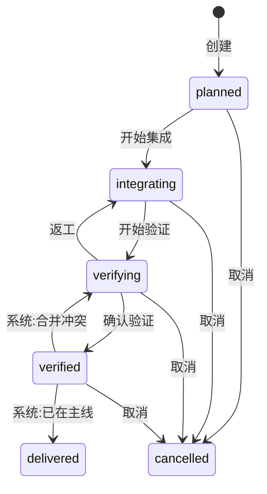

# Domain: delivery

- **Group:** core
- **One-line:** 一批意图共同集成并进入主线:本地账本、交付分支,以及一条由人在托管平台合并的交付 PR。
- **Owner:** maintainer
- **Status:** active
- **Depends on:** [intent-management](intent-management.md)(意图 PR 事实、基准快照、写入窗口与完成派生);[session-registry](session-registry.md)(工作区身份)。
- **Depended on by:** [web-console](web-console.md)(交付页与角标);[intent-management](intent-management.md)(关联边与 PR 落点);[automations](automations.md)(可订阅生命周期,亦可只读查询)。
- **exposes-api:** true — WebSocket `/ws`。消息形状在[共享协议](../../shared/api-conventions/websocket-protocol.md)中定义。
- **ADRs:** [0036](../../architecture/adr/0036-delivery-as-integration-unit.md) 交付作为集成单元、[0039](../../architecture/adr/0039-delivery-merge-via-delivery-pr.md) 合入主线走交付 PR、[0038](../../architecture/adr/0038-dependency-gate-base-reachability.md) 依赖闸门读 `delivered`、[0034](../../architecture/adr/0034-intent-pr-fact-base-and-readpoints.md) / [0035](../../architecture/adr/0035-intent-pr-table-split-and-migration-markers.md) 意图 PR 事实源

本域拥有交付账本、关联边与交付 PR。意图条目、PR 目标解析与工作树基线由 [intent-management](intent-management.md) 拥有;本域写边、提供写入窗口,不复制 RM-R44 / RM-R41 / RM-R48。

## Overview

delivery 把「一批意图共同集成并进入主线」建成 Git 生命周期单元:本地账本、受控状态机、一条交付分支,以及一条由人在托管平台合并的交付 PR。创建交付与初始化分支分步;合入主线从不代合。

**范围:** 账本与六态、写入窗口、工作树基线、同步主线、守卫与进度、分支初始化、意图关联与独立交付、PR 落点、交付页角标、交付 PR 与合并结果、操作日志、`current-branch` 降级、合并目标提示、生命周期事件与只读查询。
**边界:** 不做 Epic / 里程碑,不代合主线,不后台轮询托管,不自动关闭旧交付 PR,不删远端分支,不支持多仓,不改投已有意图 PR,不拥有意图账本或运行循环,不渲染 UI。

## Business rules

### 账本与状态

- **DR-R1**: 状态只接受六态闭集 `planned` | `integrating` | `verifying` | `verified` | `delivered` | `cancelled`。
- **DR-R2**: 建交付时快照工作区当前主线为 `baseBranch`;之后改配置不回写。
- **DR-R3**: `branchReady` 初为假。创建与编辑不探测、不触远端;仅显式初始化成功或幂等绑定置真,终态手动清理置假。
- **DR-R4**: 活动交付的工作区与分支名唯一;终态不占位,空名不参与冲突。
- **DR-R5**: 「集成就熟 N/M」按关联意图及其对本交付已合并 PR 实时聚合,不落库;`0/0` 不能过集成守卫。
- **DR-R6**: 创建、编辑、取消、转移原子落定。分支初始化在远端动作成功之后才写账本。
- **DR-R8**: 交付读写、关联、推进与交付 PR 走工作区成员权限,不另设管理员门槛;无永久删除。
- **DR-R10**: `verified → delivered` 与 `verified → verifying` 仅系统可写。
- **DR-R41**: 终态不提供取消与推进;有分支时只留清理本地引用。元数据仍可改。

### 守卫与进度

守卫顺序:分支就绪 → 至少一个关联意图且其对本交付的 PR 均已合入 → 人工确认验证 → 合并成功。页面只消费服务端给出的可达目标与缺口,不能放宽。写入时按当前事实重算。

- **DR-R16**: 分支未就绪时不得 `planned → integrating`(及后续需就绪的人工推进),也不得向该交付建意图 PR。

### 写入窗口、会话与工作树

- **DR-R26**: `planned` / `integrating` 允许关联意图开新写入会话;`verifying` 起一律禁止。多关联取最严。手动与队列共用,见 [RM-R41](intent-management.md)。
- **DR-R27**: 工作树以意图基准分支为根;基准与漂移见 [RM-R44](intent-management.md) / [RM-R42](intent-management.md)。已有工作树不自动重建、不暗中合并。

### 分支初始化

- **DR-R12**: 多仓工作区拒绝建交付与初始化分支。
- **DR-R13**: 初始化基线只取远端主线 tip,不取本地引用。
- **DR-R14**: 新建时远端已有同名分支:与期望起点一致则绑定,否则冲突且不覆盖。
- **DR-R15**: 绑定要求远端存在且未被其他活动交付占用;落后主线只警告。
- **DR-R17**: 终态不自动删分支;二次确认后只删本地引用,远端不动。

### 同步主线

- **DR-R28**: 仅 `integrating`、仅人触发,把主线合入交付分支并推送。冲突中止、不推送、不代解。无定时回灌。主线未领先时为空操作成功。
- **DR-R29**: 「主线领先」由本地 tracking 计算,打开详情不为此触网;无法解析则不展示。

### 意图关联

- **DR-R18**: 关联是独立边,不由 PR 推断。一对(交付, 意图)至多一条;一意图多交付数据层允许。不改投已有 PR。首次关联到已就绪交付时写意图基准,见 [RM-R44](intent-management.md)。
- **DR-R19**: 对本交付已合并的 PR 禁止解除;托管读不到同样拒绝。合并后的完成派生见 [RM-R48](intent-management.md)。
- **DR-R20**: 解除未合并须先关闭该 PR;已关闭视为成功。关闭失败则边与 PR 行都不动。
- **DR-R21**: 意图提交相对交付分支分叉时关联仍成功,只附警告;检测失败不报警。
- **DR-R22**: 永久删除意图同事务清边,远端 PR 不动;取消交付不删边。
- **DR-R23**: 关联列表的 PR 是该意图对本交付的状态,不是全局聚合。
- **DR-R25**: 建意图 PR 的目标必须已有关联边。

意图侧与交付页均可关联;服务端是唯一门禁。多关联时交互不给出再建或再解的路径。意图侧可一键建专属交付、关联并初始化分支;任一步失败停在该步,已完成部分保留。仅工作树模式提供该入口。

### PR 落点

- **DR-R24**: 已关联则打向意图基准(单关联即交付分支)。目标解析见 [RM-R32](intent-management.md);队列与会话收尾见该域 [RM-A5](intent-management.md) / [RM-R26](intent-management.md)。目标不可用不另选主线。交付是可选聚合,不强制先建。

### 交付页

- **DR-R9**: 角标只计需人处理:人工可解缺口、可执行推进或返工、或可执行的交付 PR 动作。纯等待、终态、`current-branch` 下隐藏的 Git 动作不计;取消本身不计。

### 交付 PR

- **DR-R30**: 合入主线走「交付分支 → `baseBranch`」的交付 PR,人在托管平台合并。c3 不代合、不自动关旧 PR、不删远端。须工作树模式、`verified`、分支就绪、相对主线有差异;无差异见 DR-R43。
- **DR-R31**: 创建前先查托管上同一方向的开放 PR;命中则复用,问不出则中止。
- **DR-R35**: 同一开放 PR 就地刷新;关闭后重建才新行,页面只看最新行。远端遗留旧 PR 由人处置。
- **DR-R42**: 「交付分支领先」与 DR-R29 同一口径。未达创建条件时只陈述缺口,不另开入口、不自动建、不轮询。

### 合并结果

- **DR-R32**: 合并冲突 → 系统回退 `verifying`;CI 或审批不足 → 状态不动、标「合并受阻」;查询失败 → 不改状态。已关闭则同步行,并按 DR-R43 看代码是否已在主线。
- **DR-R33**: `delivered` 当交付 PR 已合并,或产出已在主线(DR-R43)。同事务写状态与日志。不改关联意图状态;随后重算跨交付依赖闸门([ADR 0038](../../architecture/adr/0038-dependency-gate-base-reachability.md))。事件或重算失败不回滚。
- **DR-R34**: 托管已合、本地未确认时显示等待;进页同步一次,可手动再同步,无后台轮询。同步到已合并即落 `delivered`。
- **DR-R43**: 相对主线无差异且分支曾承载已合并产出 → 落 `delivered`;从未承载产出 → 拒绝建空 PR。
- **DR-R44**: 自动落定时尽力补已合并 PR 身份,查不到不阻断。已关闭的 PR 行保持 `closed`,不改写成 `merged`。
- **DR-R45**: 系统自主落到 `delivered` 时回包说明理由。

### 操作日志

- **DR-R46**: 落定写入同事务记一行;未落定不写。日志不参与守卫,不替代状态。不记浏览、失败尝试、分支初始化 / 清理与同步主线。

### current-branch 降级

- **DR-R11**: 仍可创建、查看、编辑、取消、关联并看进度。不提供分支初始化、交付 PR 与合并动作,服务端亦拒。

### 合并目标提示

- **DR-R7**: 工作区首次建交付时一次性提示:`pr:merge` 可能指向交付分支。取消记录仍算已有,不重复提示。
- **DR-R40**: `pr:merge` 可选区分 `mainline` / `delivery-branch`;闭集外的值丢弃。区分由订阅方检查;前置告知见 DR-R7。

### 事件与只读查询

- **DR-R36**: 生命周期事件:`delivery:created`、`delivery:status_changed`(每次状态写)、`delivery:branch_ready`、`delivery:pr_created`(创建或复用开放 PR;同步不发)、`delivery:delivered`、`delivery:cancelled`。不持久化事件史。
- **DR-R37**: 进入 `delivered` / `cancelled` 时 `status_changed` 与终态事件同发、不去重。
- **DR-R38**: 发布在状态提交之后;失败不回滚状态,不阻断广播与闸门重算。
- **DR-R39**: 自动化与外部各暴露只读 `find_deliveries` / `view_delivery`,默认不勾选;无交付写工具。

## States

人工边:`planned → integrating`(须分支就绪)、`integrating → verifying`(须就绪且至少一个关联意图、其对本交付 PR 均已合并)、`verifying → verified`(另须当次显式确认)、`verifying → integrating`(返工,无数据守卫)、非终态 → `cancelled`(不清理关联或远端)。系统边见 DR-R10。图外转移拒绝。

## Domain events

消费 `list_deliveries`、`create_delivery`、`get_delivery_detail`、`update_delivery`、`cancel_delivery`、`transition_delivery`、`init_delivery_branch`、`sync_delivery_mainline`、`cleanup_delivery_branch`、`link_intent_to_delivery`、`unlink_intent_from_delivery`、`create_delivery_pr`、`sync_delivery_pr`、`list_delivery_logs`。发出 `deliveries`、`create_delivery_result`、`delivery_detail`、`delivery_transition_failed`、`delivery_branch_init_progress`、`delivery_branch_init_result`、`delivery_sync_mainline_progress`、`delivery_sync_mainline_result`、`delivery_logs_list`。形状见[共享协议](../../shared/api-conventions/websocket-protocol.md)。

`delivery:*` 走进程内总线,不是 WebSocket 帧。关联与解除不另发总线事件。`pr:merge` 仍是自动化对意图 PR 的操作事实,不表达交付上主线。

## 数据模型

### Delivery

一批意图的 Git 生命周期单元,按工作区隔离。身份是稳定 id;作用域是不可变的工作区名称。

不变量:

- 状态为 `planned` | `integrating` | `verifying` | `verified` | `delivered` | `cancelled`。终态无出边。没有「已完成」态——那等于关联 PR 已合入交付分支,只以实时 N/M 呈现。
- `baseBranch` 是建交付时对工作区主线的快照,之后不追随配置。
- `branchReady` 只由显式初始化(含幂等绑定)置真,终态手动清理置假。活动交付占用的分支名唯一。
- 「集成就熟 N/M」每次读取派生,不落库;无关联为 `0/0`,但不能过集成守卫。
- 零或多条关联边;零或多条交付 PR 行,页面只看最新一行;零或多条操作日志。

服务端给出可达目标与缺口;页面只消费,不复制状态规则。

### Association

意图与交付之间的独立边,不是 PR 事实的副产品。关联回答「属于哪个交付」;意图 PR 回答「对该交付开了哪条 PR」。刚关联时可以还没有 PR。

不变量:

- 一对(交付, 意图)至多一条;同一意图对多个交付各一条,数据层允许,交互层不开放。
- 建边不改投已有 PR。首次关联到已就绪交付时写意图基准,见 [RM-R44](intent-management.md)。新增意图时选交付即关联,见 [RM-R45](intent-management.md)。
- 对本交付已合并则禁止解除;未合并须先关 PR,已关闭视为成功;关失败则边与 PR 行都不动。
- 永久删除意图同事务清边,远端 PR 不动;取消交付不删边。
- 详情列出的是该意图**对本交付**的 PR,不是全局聚合。
- 关联时若意图离开主线的分叉点不是交付分支头的祖先,仍成功,只警告 diff 会膨胀;给不出依据则不报警。

### Delivery PR

「交付分支 → 主线」的变更请求,与意图 PR(意图 → 交付分支)分实体。后者喂 N/M、随解除删行;前者两者皆不。

不变量:

- 状态为 `reviewing` | `merged` | `closed`。开放但未合时,冲突与「CI / 审批受阻」分开:前者要改代码并回退验证,后者状态不动。
- 同一方向同时至多一条开放 PR;落账按托管身份就地刷新,关闭后重建才新行。
- 合并是否发生以托管为准;本域账本记录,不把关闭行改写成 `merged`。

### DeliveryLog

只增不改的操作轨迹,与落定写入同事务各一行。按动作语义分类(创建、编辑、推进、确认验证、取消、已交付、合并冲突、关联、解除、开出交付 PR),不是按状态列是否变动。不参与守卫,不替代业务状态。

## 协作

**intent-management.** 关联边由本域写入;该域读取以解析基准、PR 目标与依赖闸门。建 PR 与开发共用该域基准快照,本域不另推一条推导。写入窗口与完成派生见 [RM-R41](intent-management.md) / [RM-R48](intent-management.md);基准写入时机见 [RM-R44](intent-management.md)。`delivered` 后触发跨交付闸门重算,判据在该域([ADR 0038](../../architecture/adr/0038-dependency-gate-base-reachability.md))。

**session-registry.** 工作区名称是账本键;路径只用于 Git 与托管。

**agent-session.** 本域不启动运行。写入窗口由开新会话的路径求值;已在跑的挂接不受限。

**web-console.** 渲染列表、详情、角标与动作。可达目标与缺口是窗口;状态机仍以服务端为准。`current-branch` 下隐藏的 Git 动作前后端一致拒绝。独立交付复用既有创建、关联与初始化,无专属协议;失败不回滚已完成步。

## 关键取舍

**从不代合主线。** 合入走交付 PR,人在托管平台点合并;同步主线也只由人触发。后台静默改写共享分支且失败无人看,正是要防的。决策见 [ADR 0039](../../architecture/adr/0039-delivery-merge-via-delivery-pr.md)。

**台账记录托管事实,不伪造来源。** 开放 PR 先问托管再落账;问不出不等于没有。已关闭的行不改写成 `merged`。交付状态以本域账本为准,合并是否发生以托管为准。

**关联不改投已有 PR。** 建边只建立归属;改一条开着的 PR 的目标不该由一次关联代劳。

**交付是 Git 集成单元,不是里程碑。** 不承载目标、度量或审批。决策见 [ADR 0036](../../architecture/adr/0036-delivery-as-integration-unit.md)。

## 非功能

账本不可用则交付入口降级,工作台其余部分仍可启动。错误必须对人可见。不后台轮询托管。
