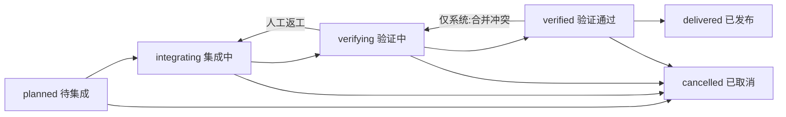

# delivery — 领域规格

## 概览

交付域把「一批意图共同集成并最终进入主线」建模为 Git 生命周期单元,提供本地台账、受控状态机与一级页面。本阶段**只做本地数据动作**:不创建/绑定/探测交付分支、不关联/解除意图、不创建/改 base/关闭/合并任何 PR——对应动作由后续交付阶段实现,本阶段只提供数据与契约接缝,也**不改变任何现有建 PR 行为**。

- **范围:** deliveries 台账 CRUD + 取消、六态状态机与守卫、按工作区计算的「需要用户处理」角标、交付一级页面(列表 + 详情两 Tab + 分段选择器 + 常驻缺口)、`pr:merge` 一次性知情告知。
- **边界:** 不做 Epic / 里程碑语义(目标、度量、审批)、不建交付分支/意图关联/PR 改投/合并、不增加冗余就绪计数列、不做甘特/时间轴/统计卡/独立提交时间线/重复 PR 卡片/自定义字段/多维筛选。

## 核心实体

| 实体                   | 说明                                  |
| ---------------------- | ------------------------------------- |
| Delivery               | 交付台账(见 models)                   |
| DeliveryIntegration    | 实时「集成就熟 N/M」聚合(不持久化)    |
| DeliveryGuardReason    | 守卫缺口原因 + 跳转目标               |
| DeliveryTransitionPlan | 服务端计算的可达性 + 缺口(页面只消费) |

## 状态与转移

所有状态写入统一经领域纯函数 `canTransitionDelivery`;客户端只展示服务端给出的可达性与缺口,不能自行放宽规则。边与守卫按顺序求值,失败不产生部分状态写入:

| 边                        | 角色 | 守卫                                                                                            |
| ------------------------- | ---- | ----------------------------------------------------------------------------------------------- |
| `planned → integrating`   | 人工 | 分支已就绪                                                                                      |
| `integrating → verifying` | 人工 | 分支已就绪 + 至少一个关联意图且其面向本交付的 PR 均为 merged(缺失 PR 与非 merged PR 都计入缺口) |
| `verifying → verified`    | 人工 | 前述守卫 + 本次动作显式人工确认验证通过                                                         |
| `verifying → integrating` | 人工 | 无数据守卫(返工)                                                                                |
| `verified → delivered`    | 系统 | 交付合并已成功                                                                                  |
| `verified → verifying`    | 系统 | 原因 = merge_conflict                                                                           |
| 任意非终态 → `cancelled`  | 人工 | 无数据守卫(取消不清理关联事实或远端资源)                                                        |

- 不在图中的边返回 `delivery.invalidStatusTransition`;边合法但角色/原因/守卫事实不满足返回 `delivery.transitionGuardFailed`,携带 `delivery.guard.*` 原因列表与可跳转目标。
- 守卫顺序:分支就绪 → 有关联意图且其 PR 均已合入交付分支 → 人工验证确认 → 合并成功。
- 服务端提交时必须**重新计算**守卫(客户端显示的守卫可能因 PR 同步或并发操作变旧),拒绝过期操作并返回最新缺口。

## 业务规则

| ID     | 规则                                                                                                                                                                                                                     |
| ------ | ------------------------------------------------------------------------------------------------------------------------------------------------------------------------------------------------------------------------ |
| DR-R1  | `deliveries.status` 只接受六态闭集,数据库 CHECK 与共享协议同一闭集;越界值在数据库层拒绝                                                                                                                                  |
| DR-R2  | `base_branch` 在建交付时快照工作区当前有效 `defaultMainBranch`(解析规则所得值,不可写空串);之后修改配置不回写历史交付                                                                                                     |
| DR-R3  | `branch_ready` 初始为假;本阶段创建/编辑均不触发分支探测或远端操作                                                                                                                                                        |
| DR-R4  | 活动态 `(workspace_path, branch_name)` 唯一;`delivered`/`cancelled` 不占位,允许复用历史分支名;空分支名不参与冲突                                                                                                         |
| DR-R5  | 「集成就熟 N/M」实时由关联意图数 M 与其中面向本交付 PR 已 merged 数 N 聚合,不持久化计数;无关联显示 `0/0` 但不能据此通过集成守卫                                                                                          |
| DR-R6  | 创建、编辑、取消、转移均为本地事务:任一步失败整体回滚,不留下半创建交付                                                                                                                                                   |
| DR-R7  | 首次在某工作区创建交付时,同一创建事务内判定「该工作区是否已有交付记录」;只有第一个响应携带 `pr:merge` 一次性告知标记(取消记录仍保留 → 重启/换客户端/再次创建均不重复提示)                                                |
| DR-R8  | 交付 CRUD、取消、关联与状态推进采用既有工作区成员权限,不设管理员门槛;不提供永久删除入口                                                                                                                                  |
| DR-R9  | 角标只统计「需要用户处理」的交付:存在尚未满足的人工可解决缺口,或当前存在可执行的人工推进/返工动作时计 1;纯系统等待、终态以及 `current-branch` 模式中被隐藏的 Git 动作不计数;取消动作本身不使交付进入角标                 |
| DR-R10 | `verified → delivered`、`verified → verifying` 为系统专属边,人工写入被拒(transitionGuardFailed,角色缺口)                                                                                                                 |
| DR-R11 | `current-branch` 模式下交付仍可创建、查看、编辑、取消并查看聚合进度;不得因该模式禁用关联(后续接入后亦然);详情动作区不渲染分支初始化/交付 PR/合并动作并给说明文案,隐藏动作不能通过前端入口触发,但纯数据状态与读取契约一致 |

## 用户场景

- **US-1(创建交付):** 用户在交付页点「新建交付」,填标题/描述/起止日期;服务端在同一数据动作内快照 `defaultMainBranch` 为 `base_branch`,落 `planned` 态。(DR-R1/DR-R2/DR-R6)
- **US-2(首次告知):** 工作区首个交付创建成功时,响应携带 `pr:merge` 告知标记,客户端提示一次「pr:merge 现在可能指向交付分支,请检查自动化订阅」;之后刷新/重启/取消后再建/并发双建均不重复,不同工作区各自提示一次。(DR-R7)
- **US-3(推进被守卫拦住):** `planned` 下点「集成中」被拒(分支未就绪),目标置灰,状态区下方常驻显示缺口与跳转入口,状态保持 `planned`。(DR-R5/DR-R9)
- **US-4(确认验证):** 交付在 `verifying` 时点「验证通过」弹确认框,显式确认后才写 `verifying → verified`;页面浏览或派生事实不能自动推进。(DR-R10 守卫第三级)
- **US-5(current-branch 聚合):** 在 `current-branch` 模式,交付可创建/查看/编辑/取消/看 N/M;分支/PR/合并动作不渲染并显示「当前模式只提供聚合视图」说明。(DR-R11)

## 领域事件(线协议)

- 消费(新增):`list_deliveries` / `create_delivery` / `get_delivery_detail` / `update_delivery` / `cancel_delivery` / `transition_delivery`
- 发出(新增):`deliveries`(含 `needsActionCount`)/ `create_delivery_result`(含 `prMergeNotice`)/ `delivery_detail`(含 `transitionPlan`)/ `delivery_transition_failed`(含结构化缺口)
- 错误码:见 `@ccc/shared` 的 `UI_ERROR_CODES.delivery.*`;守卫缺口走 `delivery.guard.*` locale 叶子。

## 数据字典

见 [delivery-models.md](delivery-models.md) 与 `database/deliveries/deliveries.sql`。
