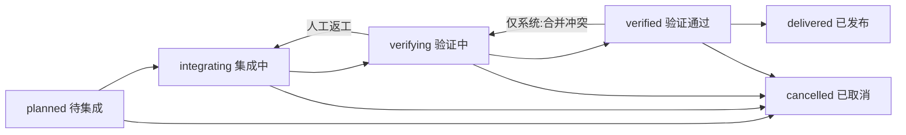

# delivery — 领域规格

## 概览

交付域把「一批意图共同集成并最终进入主线」建模为 Git 生命周期单元,提供本地台账、受控状态机、一级页面,以及一条真实存在的**交付分支**承接所有关联意图的 PR。「创建交付」与「初始化分支」是两个独立动作:前者是纯本地数据动作(不触网、失败可重建),后者是可重试的显式 Git 动作(fetch 基线 → 建分支/绑定已有 → 写 `branch_ready`)。分支就绪后成为状态机、意图关联与建 PR 的共同闸门;终态后分支不自动删除,仅提供需二次确认的手动清理。多仓工作区(根非 repo 且有子仓)全程拒绝,因为单列 `branch_name` 无法表达多仓中「部分仓已推送、部分仓未推送」的状态。

- **范围:** deliveries 台账 CRUD + 取消、六态状态机与守卫、按工作区计算的「需要用户处理」角标、交付一级页面(列表 + 详情两 Tab + 分段选择器 + 常驻缺口)、`pr:merge` 一次性知情告知、交付分支生命周期(create/bind 初始化 + 孤儿分支防御 + 多仓拒绝 + 终态手动清理)、意图↔交付关联/解除(merged 禁解 + 解除时关闭未合并 PR + 关联时 diff 膨胀提示)。
- **边界:** 不做 Epic / 里程碑语义(目标、度量、审批)、不自动删除远端分支、不支持多仓交付、不做 PR 改投(关联只建立边,不改已有 PR 的 base)与交付分支合并、不增加冗余就绪计数列、不做甘特/时间轴/统计卡/独立提交时间线/重复 PR 卡片/自定义字段/多维筛选。

## 核心实体

| 实体                   | 说明                                  |
| ---------------------- | ------------------------------------- |
| Delivery               | 交付台账(见 models)                   |
| DeliveryIntegration    | 实时「集成就熟 N/M」聚合(不持久化)    |
| DeliveryGuardReason    | 守卫缺口原因 + 跳转目标               |
| DeliveryTransitionPlan | 服务端计算的可达性 + 缺口(页面只消费) |
| IntentDelivery         | 意图↔交付关联边(见 models)            |
| AssociatedIntent       | 交付详情的关联意图行(见 models)       |

## 状态与转移

所有状态写入统一经领域纯函数 `canTransitionDelivery`;客户端只展示服务端给出的可达性与缺口,不能自行放宽规则。边与守卫按顺序求值,失败不产生部分状态写入:

| 边                        | 角色 | 守卫                                                                                            |
| ------------------------- | ---- | ----------------------------------------------------------------------------------------------- |
| `planned → integrating`   | 人工 | 分支已就绪                                                                                      |
| `integrating → verifying` | 人工 | 分支已就绪 + 至少一个关联意图且其面向本交付的 PR 均为 merged(缺失 PR 与非 merged PR 都计入缺口) |
| `verifying → verified`    | 人工 | 前述守卫 + 本次动作显式人工确认验证通过                                                         |
| `verifying → integrating` | 人工 | 无数据守卫(返工)                                                                                |
| `verified → delivered`    | 系统 | 交付合并已成功                                                                                  |
| `verified → verifying`    | 系统 | 原因 = merge_conflict                                                                           |
| 任意非终态 → `cancelled`  | 人工 | 无数据守卫(取消不清理关联事实或远端资源)                                                        |

- 不在图中的边返回 `delivery.invalidStatusTransition`;边合法但角色/原因/守卫事实不满足返回 `delivery.transitionGuardFailed`,携带 `delivery.guard.*` 原因列表与可跳转目标。
- 守卫顺序:分支就绪 → 有关联意图且其 PR 均已合入交付分支 → 人工验证确认 → 合并成功。
- 服务端提交时必须**重新计算**守卫(客户端显示的守卫可能因 PR 同步或并发操作变旧),拒绝过期操作并返回最新缺口。

## 业务规则

| ID     | 规则                                                                                                                                                                                                                                                                                             |
| ------ | ------------------------------------------------------------------------------------------------------------------------------------------------------------------------------------------------------------------------------------------------------------------------------------------------ |
| DR-R1  | `deliveries.status` 只接受六态闭集,数据库 CHECK 与共享协议同一闭集;越界值在数据库层拒绝                                                                                                                                                                                                          |
| DR-R2  | `base_branch` 在建交付时快照工作区当前有效 `defaultMainBranch`(解析规则所得值,不可写空串);之后修改配置不回写历史交付                                                                                                                                                                             |
| DR-R3  | `branch_ready` 初始为假;创建/编辑均不触发分支探测或远端操作。它只由显式的 `init_delivery_branch`(成功或幂等绑定后)置为真,由 `cleanup_delivery_branch`(终态手动清理)置回假                                                                                                                        |
| DR-R4  | 活动态 `(workspace_path, branch_name)` 唯一;`delivered`/`cancelled` 不占位,允许复用历史分支名;空分支名不参与冲突                                                                                                                                                                                 |
| DR-R5  | 「集成就熟 N/M」实时由关联意图数 M 与其中面向本交付 PR 已 merged 数 N 聚合,不持久化计数;无关联显示 `0/0` 但不能据此通过集成守卫                                                                                                                                                                  |
| DR-R6  | 创建、编辑、取消、转移均为本地事务:任一步失败整体回滚,不留下半创建交付;分支初始化的 DB 写入发生在 git 动作成功之后,「push 成功但 DB 写失败」由下一次重试的孤儿分支防御幂等恢复                                                                                                                   |
| DR-R7  | 首次在某工作区创建交付时,同一创建事务内判定「该工作区是否已有交付记录」;只有第一个响应携带 `pr:merge` 一次性告知标记(取消记录仍保留 → 重启/换客户端/再次创建均不重复提示)                                                                                                                        |
| DR-R8  | 交付 CRUD、取消、关联与状态推进采用既有工作区成员权限,不设管理员门槛;不提供永久删除入口                                                                                                                                                                                                          |
| DR-R9  | 角标只统计「需要用户处理」的交付:存在尚未满足的人工可解决缺口,或当前存在可执行的人工推进/返工动作时计 1;纯系统等待、终态以及 `current-branch` 模式中被隐藏的 Git 动作不计数;取消动作本身不使交付进入角标                                                                                         |
| DR-R10 | `verified → delivered`、`verified → verifying` 为系统专属边,人工写入被拒(transitionGuardFailed,角色缺口)                                                                                                                                                                                         |
| DR-R11 | `current-branch` 模式下交付仍可创建、查看、编辑、取消并查看聚合进度;不得因该模式禁用关联;详情动作区不渲染分支初始化/交付 PR/合并动作并给说明文案,隐藏动作不能通过前端入口触发,但纯数据状态与读取契约一致                                                                                         |
| DR-R12 | 多仓工作区(根目录本身不是 git repo 且 `discoverSubRepos` 返回至少一个子仓;根非 repo 但只有单个子仓也按多仓处理)在建交付与初始化分支两处均拒绝,报 `delivery.multiRepoUnsupported`;创建交付的多仓判定为纯本地目录遍历,不触网                                                                       |
| DR-R13 | 分支初始化基线只取远端:先 `fetch origin <base_branch>`,再以 `origin/<base_branch>` HEAD 作为期望起点建分支;不取本地 ref(本地过期会让交付起点落后于团队主线)                                                                                                                                      |
| DR-R14 | 孤儿分支防御:`create` 模式下若远端已存在同名分支,比较其 HEAD 与期望起点——匹配视为上次「push 成功但 DB 写失败」的孤儿,幂等绑定(不重新 push);不匹配报 `delivery.branchConflict`,**绝不覆盖**远端分支                                                                                               |
| DR-R15 | `bind` 模式绑定远端已有分支:远端必须已存在(否则 `delivery.branchNotFound`);该分支被其他活动交付占用时拒绝(`delivery.branchConflict`,自身重试不算占用);不校验分支是否落后主线,落后仅发 `delivery.branchBehindMain` 警告                                                                           |
| DR-R16 | `branch_ready=false` 时,`planned → integrating`(以及 `integrating → verifying`、`verifying → verified`)被 `delivery.guard.branchNotReady` 守卫拦截;面向该交付的意图 PR 创建同样被拒并返回可读原因                                                                                                |
| DR-R17 | 交付进入 `delivered`/`cancelled` 后分支不自动删除;手动清理入口需二次确认(ConfirmDialog danger),确认后仅删除本地分支引用(若存在),不删除远端分支;清理仅限终态交付(`delivery.cleanupForbidden` 拒非终态)                                                                                            |
| DR-R18 | 意图↔交付关联是一条独立的边,不由 PR 事实推断;一对(交付, 意图)至多一条,同一意图对多个交付各一条是允许的。关联只建立边,不改投任何已有 PR                                                                                                                                                           |
| DR-R19 | 该意图对本交付的 PR 已 merged 时**禁止解除关联**:先看本地状态,本地非 merged 时再向 forge 查实时状态,任一为 merged 即拒(`delivery.unlinkMergedPrDenied`)并把本地状态同步为 merged。forge 状态读不到时同样拒(`delivery.unlinkPrStatusCheckFailed`)——无法确认「不是 merged」即按「可能 merged」处理 |
| DR-R20 | 解除未合并关联时先关闭该 PR,**PR 已是关闭态视为成功**;关闭成功后删除该 `intent_prs` 行再删边。关闭失败整个解除被阻塞(`delivery.unlinkClosePrFailed`),关联边与 PR 行都不动                                                                                                                        |
| DR-R21 | 关联时若意图提交基于主线而非交付分支(判据见 models 的分叉点检测),关联**仍然成功**并附带 diff 膨胀警告;检测失败一律不报警                                                                                                                                                                         |
| DR-R22 | 永久删除意图时同事务清除其关联边,远端 PR 不动;取消交付**不删**关联边,终态交付的关联意图仍可查                                                                                                                                                                                                    |
| DR-R23 | 交付详情关联意图列表的 PR 列是「该意图**对本交付**的 PR 状态」,不是意图的全局 PR 聚合                                                                                                                                                                                                            |
| DR-R24 | 关联了交付的意图,其 PR 的 base 是**该交付的分支**,未关联的仍提工作区主线;建 PR 的目标解析、幂等键 `(intent_id, delivery_id)` 与全部拒绝码见 intent-management 的 RM-R32。交付是可选聚合层,不强制先建交付                                                                                         |
| DR-R25 | 建 PR 的目标交付必须**已被该意图关联**:服务端拒绝把 PR 行落到 `intent_deliveries` 没有边的交付下,`intent_prs.delivery_id` 与关联边因此不会脱节。人工入口与顾问 MCP 入口共用同一条解析,交互层不开放多交付的建 PR 入口(数据层允许一意图多交付)                                                     |

## 用户场景

- **US-1(创建交付):** 用户在交付页点「新建交付」,填标题/描述/起止日期;服务端在同一数据动作内快照 `defaultMainBranch` 为 `base_branch`,落 `planned` 态。(DR-R1/DR-R2/DR-R6)
- **US-2(首次告知):** 工作区首个交付创建成功时,响应携带 `pr:merge` 告知标记,客户端提示一次「pr:merge 现在可能指向交付分支,请检查自动化订阅」;之后刷新/重启/取消后再建/并发双建均不重复,不同工作区各自提示一次。(DR-R7)
- **US-3(初始化分支):** 交付详情页展示分支初始化区(输入框默认 `delivery/<short-id>-<slug>`,可改),选择「新建」或「绑定已有」后点「初始化分支」;进度帧按 `fetching → creating → pushing`(或单个 `binding`)推进,成功刷新详情并广播列表。(DR-R13/DR-R14)
- **US-4(绑定已有分支):** 企业已有 `release/*` 时选「绑定已有」;远端不存在该分支 → `delivery.branchNotFound`;被其他活动交付占用 → `delivery.branchConflict`;落后主线仅警告 `delivery.branchBehindMain`,不拒绝。(DR-R15)
- **US-5(推进被守卫拦住):** `planned` 下点「集成中」被拒(分支未就绪),目标置灰,状态区下方常驻显示缺口与跳转入口(跳转到本页分支初始化区),状态保持 `planned`。(DR-R5/DR-R16)
- **US-6(确认验证):** 交付在 `verifying` 时点「验证通过」弹确认框,显式确认后才写 `verifying → verified`;页面浏览或派生事实不能自动推进。(DR-R10 守卫第三级)
- **US-7(终态清理):** 交付 `delivered`/`cancelled` 后详情页出现「清理分支」入口,点击弹 danger 确认框;确认后仅删本地分支引用(远端保留),结果 toast 反馈。(DR-R17)
- **US-8(current-branch 聚合):** 在 `current-branch` 模式,交付可创建/查看/编辑/取消/看 N/M;分支/PR/合并动作不渲染并显示「当前模式只提供聚合视图」说明。(DR-R11)
- **US-9(多仓拒绝):** 多仓工作区(根非 repo 且有子仓)建交付与初始化分支均被拒,报 `delivery.multiRepoUnsupported`。(DR-R12)
- **US-10(关联意图):** 用户在交付详情「关联意图」tab 点「关联意图」,从「尚未归属任何交付」的意图中选一个;关联后两侧互见——交付详情列出该意图(含它对本交付的 PR 状态与 head 分支),意图详情的元信息在「分支+commit」之后、「PR」之前显示「关联交付」。(DR-R18/DR-R23)
- **US-11(关联提示 diff 膨胀):** 意图先在主线上开发、之后才关联交付时,关联成功并提示「本意图提交基于主线,提向交付分支的 PR 会包含主线与交付分支的差异」,用户据此决定是否 rebase。(DR-R21)
- **US-12(解除关联):** 未合并行的行尾有「解除关联」,danger 二次确认后解除,其提向本交付的 PR 一并关闭;PR 已 merged 的行不提供该入口,强行发起也被服务端拒绝并给出原因。(DR-R19/DR-R20)
- **US-13(PR 提向交付分支):** 已关联交付的意图点「创建 PR」,PR 的 base 是该交付的分支,PR 行落在该交付分组下并计入 N/M;交付分支未就绪时被拒并给出可读原因;意图关联多个交付时不渲染建 PR 入口。(DR-R16/DR-R24/DR-R25)

## 领域事件(线协议)

- 消费:`list_deliveries` / `create_delivery` / `get_delivery_detail` / `update_delivery` / `cancel_delivery` / `transition_delivery` / `init_delivery_branch` / `cleanup_delivery_branch` / `link_intent_to_delivery` / `unlink_intent_from_delivery`
- 发出:`deliveries`(含 `needsActionCount`)/ `create_delivery_result`(含 `prMergeNotice`)/ `delivery_detail`(含 `transitionPlan`、`associatedIntents`,以及关联时可能出现的 `linkWarning`)/ `delivery_transition_failed`(含结构化缺口)/ `delivery_branch_init_progress`(阶段)/ `delivery_branch_init_result`(含可选 `warning` 落后提示)。关联/解除不发 `delivery:intent_linked/unlinked` 事件
- 错误码:见 `@ccc/shared` 的 `UI_ERROR_CODES.delivery.*`(含 `delivery.multiRepoUnsupported` / `delivery.branchNotFound` / `delivery.initFailed` / `delivery.cleanupForbidden` / `delivery.intentAlreadyLinked` / `delivery.unlinkMergedPrDenied` / `delivery.unlinkClosePrFailed` / `delivery.unlinkPrStatusCheckFailed` / 建 PR 目标解析的 `delivery.prCreateDeliveryUnknown` / `delivery.prCreateNotLinked` / `delivery.prCreateAmbiguous`);守卫缺口走 `delivery.guard.*` locale 叶子。

## 数据字典

见 [delivery-models.md](delivery-models.md) 与 `database/deliveries/`(`deliveries.sql`、`intent_deliveries.sql`)。
