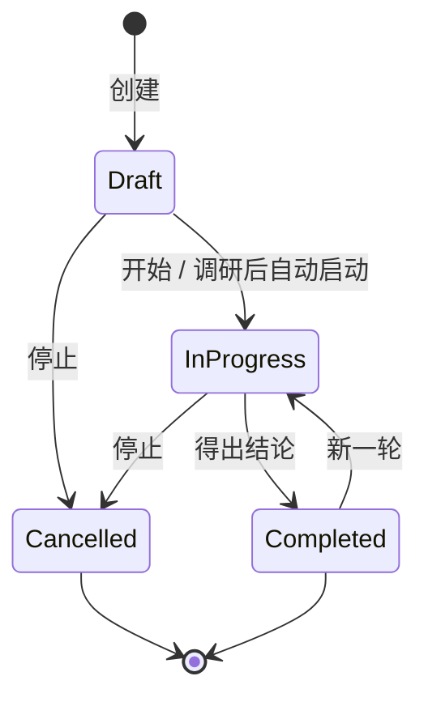

# Domain: discussion

- **Group:** core
- **One-line:** 工作区范围的圆桌:组织者编排多智能体与人讨论,结论可转为意图。
- **Owner:** maintainer
- **Status:** active
- **Depends on:** [agent-session](agent-session.md)(编排与研究会话运行);[session-registry](session-registry.md)(工作区身份、讨论会话投影);[permission-gateway](permission-gateway.md)(研究会话只读闸);[intent-management](intent-management.md)(转意图共用创建原语);[agent-config](../settings/agent-config.md)(组织者缺省);[workspace-setting](../settings/workspace-setting.md)(每阶段轮次上限)。
- **Depended on by:** [web-console](web-console.md)(列表、圆桌与控制);[automations](automations.md)(可订阅生命周期,亦可经工具查找、查看、开始与继续);[im-robot](im-robot.md)(共用开始/继续工具);[external-mcp](external-mcp.md)(可授权同一组工具)。
- **exposes-api:** true — WebSocket `/ws`。消息形状在[共享协议](../../shared/api-conventions/websocket-protocol.md)中定义。
- **ADRs:** [0007](../../architecture/adr/0007-read-only-intent-agent.md) 与意图共用本地账本、[0018](../../architecture/adr/0018-event-bus-kernel-layer.md) 进程内事件总线

本域拥有讨论账本、组织者编排与人在回路控制。意图条目由 [intent-management](intent-management.md) 拥有;转意图只触发 [RM-R45](intent-management.md),不复制创建规则。

## Overview

discussion 按工作区登记一场目标导向的圆桌:组织者编排已选智能体轮流发言,人可随时介入,结论可转为意图。

创建后先跑只读研究会话,陈述现状、不给方案;成功则自动开编排,失败则停在 `draft` 等手动开始。编排沿 `discuss → summarize → confirm → conclude` 走到结论。圆桌不跑共识、不升级为智能体团队。

**范围:** 讨论账本、组织者轮流、人在回路、参与者定向、研究会话、转意图入口、自动化/外部工具、编排生命周期事件。
**边界:** 不驱动运行循环([agent-session](agent-session.md)),不裁定权限([permission-gateway](permission-gateway.md)),不拥有工作区目录([session-registry](session-registry.md)),不拥有意图账本,不渲染 UI([web-console](web-console.md))。

## Business rules

### 讨论账本

- 一条讨论只属于一个已登记工作区。没有跨项目聚合。
- 类型取自目录:`brainstorm` / `decision` / `review` / `planning` / `retro`;各类型走同一条工作流。
- 用户上下文与调研结果分存;调研永不覆盖用户原文。组织者优先读调研结果,否则读上下文。
- 圆桌转录以本域消息账本为事实来源。厂商会话只服务恢复,不替代账本。
- 账本不可用时讨论入口降级,普通会话仍可用。

### 参与者定向

- 名单在创建时选定,生命周期内固定。组织者始终在场:未勾选也并入,可提名自己,单智能体时独自发言。
- 空名单视为未设置,回退到当时已启用的智能体池。
- 组织者只从该集合(含自己)提名。参与者可跨厂商;厂商标签由智能体配置派生,不写进消息。

### 多智能体轮流

- 每一轮由组织者决定下一步:请一人说、在 `discuss` 中同时请若干人说、分解或推进子话题、进入下一阶段,或收束为结论。
- `discuss` 可并行发问;其后阶段保持串行。阶段只前进,不回退。
- 每阶段轮次上限读工作区设置([AC-R9](../settings/agent-config.md));另有总轮次硬顶,卡住则写出兜底结论。
- 同一讨论同时至多一次编排运行。编排轮次不挂载可写工具。

### 人类参与

- `pause_discussion` / `resume_discussion` 在轮次边界挂起或唤醒引擎,不中止、不改持久化状态。暂停只存在于运行时。进行中的一轮仍可能落下一条消息。
- `discussion_speak` 追加一条 `human` 消息,组织者下一轮看见它。
- `cancel_discussion` 只接受 `draft` / `in_progress`:先拆掉该讨论上一切存活运行(编排与调研),再落 `cancelled`。`cancelled` 与 `completed` 同为终态,没有恢复入口;想继续则新建。
- 停止只有控制台这一条路径,无自动化取消工具,无列表批量取消。
- WebSocket `continue_discussion` 只接受已有结论的 `completed`:追加人类问题,翻回 `in_progress`,在完整既往转录上开新一轮并覆盖结论。
- WebSocket `start_discussion` 接受 `draft`,以及无存活运行的 `in_progress`(悬挂恢复,不追加消息、不重置议程或结论)。终态拒绝。进程重启后悬挂的 `in_progress` 不会自动拉起。

### 研究会话

- 会前研究是正式会话,种类为 `discussion`,可回放与追问。追问与停止走普通 `user_prompt` / `stop_run`,不另开讨论专用链路。
- 每一轮(含追问)保持只读:可读项目材料与网络,不可写、不可执行、不可派生子智能体。只读闸缺失则失败,绝不降成可写运行。
- 成功一轮的调研产出整体替换已存结果;空或失败的一轮保留原值。失败或中止不把半成品写成结果,也不自动开编排。
- 调研不是正式编排,不发 `discussion:start` / `discussion:end`。成功且仍为无运行的 `draft` 时自动开编排;人已开始或取消则跳过。

### 讨论转意图

- 仅 `completed` 且结论非空可转。创建原语与闸门见 [RM-R45](intent-management.md),本域不另写一套。

### 讨论工具

自动化须显式勾选才挂载;外部 MCP 与机器人按各自授权暴露同一组工具。

- `find_discussions` / `view_discussion`:只读本工作区账本。
- `start_discussion`:只启动无存活运行的 `draft`;可选业务标注在启动前整体替换,非法则不写库、不启动。Web 启动与继续不改标注。
- `continue_discussion`:对 `completed` 开新一轮(须有人类问题);对无存活运行的 `in_progress` 做悬挂恢复。拒绝 `draft` / `cancelled` 与已有存活运行。

### 生命周期事件

- 每一次正式编排在唯一启动边界发 `discussion:start`,在唯一收尾路径发 `discussion:end`(原因 `complete` / `error` / `aborted`)。恢复与新一轮各算一次尝试,各发一对。
- 事件携带讨论身份、标题、类型与当时已持久化的业务标注,供自动化按上下文订阅(见 [automations SCH-R18](automations.md)、[事件机制](../../architecture/event-mechanism.md))。
- 与该运行的 `run:started` / `run:settled` 并存,不合并。调研阶段不发这对事件。

## States

运行态 `running` / `paused` / `ended` 叠在账本状态之上,只存在于运行时:磁盘上暂停中的讨论仍是 `in_progress`。列表推送携带活跃运行快照,供重连对齐;派发中的「正在回复」只在运行时,不做列表快照。

## Domain events

消费 `list_discussions`、`create_discussion`、`open_discussion`、`start_discussion`、`pause_discussion`、`resume_discussion`、`cancel_discussion`、`discussion_speak`、`continue_discussion`。发出 `discussions`、`discussion_detail`、`discussion_message`、`discussion_run_status`、`discussion_dispatch_status`、`research_message`、`research_run_status`。形状见[共享协议](../../shared/api-conventions/websocket-protocol.md)。

`discussion:start` / `discussion:end` 走进程内总线,不是 WebSocket 帧。

## 数据模型

### Discussion

一场限定在单个工作区的目标导向圆桌:类型、目标、背景、参与者、议程与结论。身份是稳定 id;作用域是不可变的工作区名称。

不变量:

- 状态为 `draft` | `in_progress` | `completed` | `cancelled`。进入 `completed` 打完成时间; `cancelled` 不打。`cancelled` 与 `completed` 都是终态,只有后者可开新一轮。
- 类型来自目录 `brainstorm` / `decision` / `review` / `planning` / `retro`。
- 用户上下文与调研结果分存;调研只替换自己那一份。
- 议程是组织者从目标分解出的有序子话题,只在 `discuss` 有意义;无议程时行为与未分解相同。
- 业务标注是调用方扁平键值,仅工具启动编排时整体替换;缺省为空。随 `discussion:start` / `discussion:end` 发出,描述的是一次编排尝试,不是唯一状态跃迁。
- 零或多条 Message;至多一个指定组织者;零或多个 Participant。研究会话若已绑定,以讨论为所有者投影,不属于任何参与者。

### Message

圆桌内一条已落账的发言,按讨论内单调递增序号排列。发言者身份为 `organizer` | `agent` | `human`。

不变量:

- 序号在同一讨论内唯一,讨论之间相互独立。追加即更新讨论的最近变更时间。
- `agent` 才带智能体 id;组织者与人类轮次不带厂商标签。
- 派发中的「正在回复」与调研过程流不是消息行,不进账本。

### Participant

创建时勾选、编排时提名的智能体。组织者是其中的主持角色,始终在场。

不变量:

- 集合在创建时固定;空集合表示未设置,回退到已启用池。
- 组织者即使未勾选也并入。提名不得越出该集合。
- 每个参与者可有一条当前厂商会话,供后续轮次恢复;关闭讨论即丢掉映射。研究会话不占用参与者槽。

## 协作

**agent-session.** 编排把组织者与参与者的每一轮交给运行时做一次性回复;研究会话是种类为 `discussion` 的正式运行,追问走普通 prompt。运行活在进程里;本域登记存活编排、暂停闸与中止,并观察结束。

**session-registry.** 工作区名称是账本键。参与者/组织者会话与研究会话都投影为 `discussion` 且归属该讨论;选中行跳回圆桌。转录事实仍是本域消息账本,厂商原生存储只服务恢复。

**permission-gateway.** 研究会话按只读闸启动,权限模式钉在 `default`。编排轮次不走可写工具面。圆桌路径没有共识投票。

**intent-management.** 转意图只调用该域创建原语([RM-R45](intent-management.md));沟通与拆条仍在意图域。账本与意图台账是同一份本地库上的兄弟,互不依赖对方模块。

**automations.** 编排生命周期进入事件总线,供事件触发过滤。讨论工具与本域 Web 入口共用开始/继续语义,取消不对外挂载。

**web-console.** 渲染列表、创建表单、圆桌与研究会话。厂商标签、运行徽标与按钮显隐是窗口;状态与闸门仍以服务端为准。

## 关键取舍

**人在回路压过无人值守。** 暂停不拆运行,插话插入账本后由组织者下一轮消化,停止才是终态。代价是悬挂的 `in_progress` 不会在重启后自动拉起,恢复必须显式。

**组织者始终在场。** 圆桌不可没有主持;单智能体时组织者独白,而不是变成空转。名单创建后不改,避免编排中途换人。

**停止即放弃。** `cancelled` 不可续,避免在已拆掉的运行上假装还能接着辩。要接着辩就开新讨论。

**研究只陈述现状。** 禁止选项与结论,以免圆桌被提前锚定。研究会话可追问但仍只读;组织者非 Claude 时研究落到 Claude,追问才接得上同一条只读会话,不伪装成组织者本人在研究。

**生命周期只在编排边界发一次。** Web、工具开始与继续共用同一编排边界发事件,不按入口各发一套。调研不是编排。

## 非功能

账本不可用则讨论能力按入口降级,工作台其余部分仍可启动。错误必须对人可见;派发失败呈现在圆桌尾部,该轮继续,不静默吞掉。
