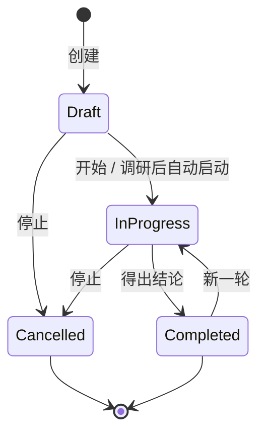

# discussion — 领域规格

## Overview

discussion 按工作区登记一场目标导向的圆桌:组织者编排已选智能体轮流发言,人可随时介入,结论可转为意图。

创建后先跑只读研究会话,陈述现状、不给方案;成功则自动开编排,失败则停在 `draft` 等手动开始。编排沿 `discuss → summarize → confirm → conclude` 走到结论。圆桌不跑共识、不升级为智能体团队。

**范围:** 讨论账本、组织者轮流、人在回路、参与者定向、研究会话、转意图入口、自动化/外部工具、编排生命周期事件。
**边界:** 不驱动运行循环([agent-session](../agent-session/agent-session-spec.md)),不裁定权限([permission-gateway](../permission-gateway/permission-gateway-spec.md)),不拥有工作区目录([session-registry](../session-registry/session-registry-spec.md)),不拥有意图账本,不渲染 UI([web-console](../web-console/web-console-spec.md))。

实体见 [discussion-models.md](discussion-models.md)。能力索引见 [features.md](../../../features.md) 的 discussion 节。

## Business rules

### 讨论账本

- 一条讨论只属于一个已登记工作区。没有跨项目聚合。
- 类型取自目录:`brainstorm` / `decision` / `review` / `planning` / `retro`;各类型走同一条工作流。
- 用户上下文与调研结果分存;调研永不覆盖用户原文。组织者优先读调研结果,否则读上下文。
- 圆桌转录以本域消息账本为事实来源。厂商会话只服务恢复,不替代账本。
- 账本不可用时讨论入口降级,普通会话仍可用。

### 参与者定向

- 名单在创建时选定,生命周期内固定。组织者始终在场:未勾选也并入,可提名自己,单智能体时独自发言。
- 空名单视为未设置,回退到当时已启用的智能体池。
- 组织者只从该集合(含自己)提名。参与者可跨厂商;厂商标签由智能体配置派生,不写进消息。

### 多智能体轮流

- 每一轮由组织者决定下一步:请一人说、在 `discuss` 中同时请若干人说、分解或推进子话题、进入下一阶段,或收束为结论。
- `discuss` 可并行发问;其后阶段保持串行。阶段只前进,不回退。
- 每阶段轮次上限读工作区设置([AC-R9](../../settings/agent-config/agent-config-spec.md));另有总轮次硬顶,卡住则写出兜底结论。
- 同一讨论同时至多一次编排运行。编排轮次不挂载可写工具。

### 人类参与

- `pause_discussion` / `resume_discussion` 在轮次边界挂起或唤醒引擎,不中止、不改持久化状态。暂停只存在于运行时。进行中的一轮仍可能落下一条消息。
- `discussion_speak` 追加一条 `human` 消息,组织者下一轮看见它。
- `cancel_discussion` 只接受 `draft` / `in_progress`:先拆掉该讨论上一切存活运行(编排与调研),再落 `cancelled`。`cancelled` 与 `completed` 同为终态,没有恢复入口;想继续则新建。
- 停止只有控制台这一条路径,无自动化取消工具,无列表批量取消。
- WebSocket `continue_discussion` 只接受已有结论的 `completed`:追加人类问题,翻回 `in_progress`,在完整既往转录上开新一轮并覆盖结论。
- WebSocket `start_discussion` 接受 `draft`,以及无存活运行的 `in_progress`(悬挂恢复,不追加消息、不重置议程或结论)。终态拒绝。进程重启后悬挂的 `in_progress` 不会自动拉起。

### 研究会话

- 会前研究是正式会话,种类为 `discussion`,可回放与追问。追问与停止走普通 `user_prompt` / `stop_run`,不另开讨论专用链路。
- 每一轮(含追问)保持只读:可读项目材料与网络,不可写、不可执行、不可派生子智能体。只读闸缺失则失败,绝不降成可写运行。
- 成功一轮的调研产出整体替换已存结果;空或失败的一轮保留原值。失败或中止不把半成品写成结果,也不自动开编排。
- 调研不是正式编排,不发 `discussion:start` / `discussion:end`。成功且仍为无运行的 `draft` 时自动开编排;人已开始或取消则跳过。

### 讨论转意图

- 仅 `completed` 且结论非空可转。创建原语与闸门见 [RM-R45](../intent-management/intent-management-spec.md),本域不另写一套。

### 讨论工具

自动化须显式勾选才挂载;外部 MCP 与机器人按各自授权暴露同一组工具。

- `find_discussions` / `view_discussion`:只读本工作区账本。
- `start_discussion`:只启动无存活运行的 `draft`;可选业务标注在启动前整体替换,非法则不写库、不启动。Web 启动与继续不改标注。
- `continue_discussion`:对 `completed` 开新一轮(须有人类问题);对无存活运行的 `in_progress` 做悬挂恢复。拒绝 `draft` / `cancelled` 与已有存活运行。

### 生命周期事件

- 每一次正式编排在唯一启动边界发 `discussion:start`,在唯一收尾路径发 `discussion:end`(原因 `complete` / `error` / `aborted`)。恢复与新一轮各算一次尝试,各发一对。
- 事件携带讨论身份、标题、类型与当时已持久化的业务标注,供自动化按上下文订阅(见 [automations SCH-R18](../automations/automations-spec.md)、[事件机制](../../../architecture/event-mechanism.md))。
- 与该运行的 `run:started` / `run:settled` 并存,不合并。调研阶段不发这对事件。

## States

运行态 `running` / `paused` / `ended` 叠在账本状态之上,只存在于运行时:磁盘上暂停中的讨论仍是 `in_progress`。列表推送携带活跃运行快照,供重连对齐;派发中的「正在回复」只在运行时,不做列表快照。

## Domain events

消费 `list_discussions`、`create_discussion`、`open_discussion`、`start_discussion`、`pause_discussion`、`resume_discussion`、`cancel_discussion`、`discussion_speak`、`continue_discussion`。发出 `discussions`、`discussion_detail`、`discussion_message`、`discussion_run_status`、`discussion_dispatch_status`、`research_message`、`research_run_status`。形状见[共享协议](../../../shared/api-conventions/websocket-protocol.md)。

`discussion:start` / `discussion:end` 走进程内总线,不是 WebSocket 帧。

## Interactions

- **agent-session** — 组织者、参与者与研究会话的运行;本域决定何时启动、暂停、恢复或拆卸。
- **session-registry** — 工作区必须已登记;编排与研究会话投影为 `discussion` 种类,打开则跳回本讨论,不写成可编辑工作会话。
- **permission-gateway** — 研究会话走只读闸;编排轮次不把可写工具交给圆桌。
- **intent-management** — 已有结论的讨论转为意图,规则在该域。
- **automations** — 订阅编排生命周期;勾选后可查找、查看、开始与继续。
- **web-console** — 列表、创建、圆桌、暂停/发言/停止与转意图入口。遮罩与按钮是窗口,闸门以服务端为准。
- **workspace-setting / agent-config** — 组织者缺省与每阶段轮次上限。
