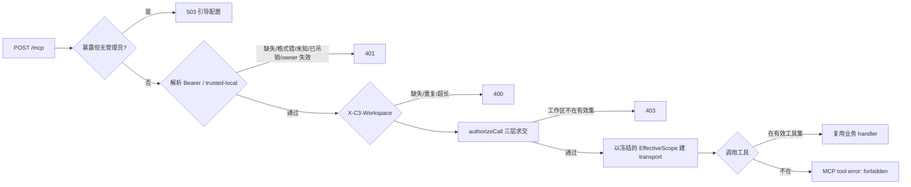
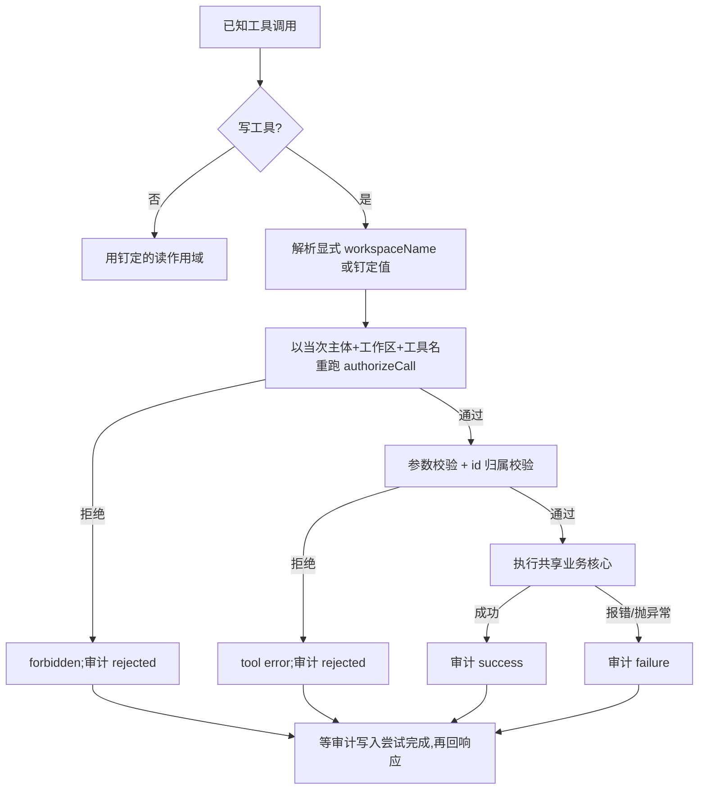

# external-mcp 外部 MCP 接入

`external-mcp` 域是 c3 对**自己没有拉起的 agent** 开放的唯一入口:独立的 Claude Code / Codex / Cursor 会话、CI 任务、监控脚本、局域网内的其它进程,凭长期 API key 通过 Streamable HTTP MCP 访问本部署的意图台账与讨论、投递事件,并在管理员授权下写回意图、提交审核结论、拉起会话。

## 与内部路由的关系:并列,不是放宽

|            | 内部 `/internal/*-mcp/v1`(6 条)            | 外部 `POST /mcp`                                    |
| ---------- | ------------------------------------------ | --------------------------------------------------- |
| 来源       | 必须回环(在 c3 自身 bind 之上的纵深防御)   | 不做 loopback 判断(trusted-local 模式除外)          |
| 身份       | c3 自己铸的一次性 per-run token            | 长期 API key,走 `Authorization: Bearer`             |
| 作用域来源 | run 闭包(workspace + runId + abort signal) | 三层求交:key 范围 × owner 管理员配置范围 × 工具授权 |
| 工作区     | run 闭包给定                               | `X-C3-Workspace` 在 initialize 时选定               |
| 工具       | 各路由自己的全集(含写工具)                 | 该 key 勾选的子集 ∩ 可外部授权目录(默认五个只读)    |

内部六条路由的任何语义**都不受本域影响**,它们的信任模型比账号求交更严格(ADR-0044 记为刻意排除)。

## 请求与授权链

地址不含凭据。端点恒为裸 `POST /mcp`,凭据走 `Authorization: Bearer c3k_…`,工作区走 `X-C3-Workspace`。

每次请求执行同一条链,顺序是安全属性的一部分:

### 三层求交

`authorizeCall(auth, workspaceName, toolName)` 是**唯一**卡口,返回冻结的 `EffectiveScope`
(keyId、ownerSubject、secretVersion、policyEpoch、workspaceName、注册表解析出的 workspacePath、有效工具集)。
handler 只接受这个对象,永远拿不到调用方给的路径。**目录不闭包任何 scope**:scope 是 handler 的入参,
因此一份目录服务全部 key、全部会话与全部工作区,不存在「建会话时的工作区」被闭包带进后续调用的可能。

- `effectiveWorkspaces = key 自身范围 ∩ owner 管理员配置范围`。本版 key 自身范围恒为全部已注册工作区,故 owner 的 [工作区范围配置](../auth/auth-overview.md#工作区范围-user_workspace_scopes) 是限制集。
- `effectiveTools = key.tools ∩ 可外部授权工具目录`。目录外的名字与空工具集都授予零。
- `tools/list` 与调用检查出自同一次求解,发现面与执行面不可能不一致。

**默认拒绝是结构性的**:缺范围记录、无法解释的 mode、注册表已无的工作区名、名册不认识的 owner —— 每一种都产出空集,没有任何分支把「缺失」读成「全部」。

### 凭据

- **唯一来源是 `Authorization: Bearer`。** query 参数、`X-API-Key`、任何其它自定义凭据头**都不被解析**。key 缺失、格式错、未知、哈希不符、已吊销、owner 已不被本部署承认,一律 401 且**正文完全相同** —— 调用方连「key 是否合法」都学不到。
- **「无凭据」只指请求上根本没有 `Authorization` 头。** 头存在但值为空或全空白(反代剥掉凭据后常见,Fetch 规范把两者都规范化为空串)算**已出示凭据**,按格式错处理 → 401,不进免凭据路径。
- **凭据校验先于工作区解析**,未认证方无法探测工作区名。拒绝响应与日志**从不回显 key 或 `Authorization` 的值**。
- **`/mcp/<任何东西>` 一律 404**,包括旧的 `/mcp/<api-key>` 与 `/mcp/v1`。它们不是兼容路由。

### 工作区选择

`X-C3-Workspace` 在 initialize 时必需,并就此钉死该会话。空、重复(重复头按 Fetch 规范逗号合并,而工作区名不含逗号)、超长一律 400;未知与越权返回同一个 403。后续请求带同一个值是正常的 —— 客户端的静态头会出现在每个请求上;带**不同**的值是 re-scope 尝试,403 且不动会话。

**写工具可逐次指定目标工作区**:每个写工具都带可选入参 `workspaceName`,省略即用钉定的头工作区。
它只改变**这一次调用**的目标,不改变会话作用域;取值必须落在 `list_workspaces` 返回的有效集内,
否则在 handler 运行前被拒。读工具**不接受**该入参(含 `publish_event`),传了按参数非法拒绝。
保持工具名稳定是刻意取舍:按工作区拆工具名会产生 N×M 的名称爆炸,并把授权判定从一个卡口散开。

该头是 **c3 自定义 HTTP 头,不是 MCP 协议字段**。Streamable HTTP 传输规范定义的是 `Mcp-Session-Id` 一类协议级头与基于 OAuth 的 `Authorization` 扩展,租户/工作区选择属应用层。已验证支持任意自定义头的客户端:Claude Code(`--header`)、Cursor(`headers`)、Codex CLI(`http_headers` / `env_http_headers`)。**不支持配置任意头的客户端用不了本端点**,且不提供 query/path/body/工具入参兜底。

### 会话钉定

会话一经 initialize 即钉在 `(keyId, secretVersion, workspaceName, policyEpoch)` 四元组上,每个请求重新认证后比对:

- 未知会话 404;**换一把 key 用同一个会话 id 同答 404** —— 不泄露该 id 属于谁,也不让一把 key 毁掉另一把的 transport。
- secretVersion 或 policyEpoch 变化:先清场该 transport,再 404,客户端重新 initialize。
- 顺序恒为**先持久化后清连接**:策略/密钥写入与 epoch bump 同事务提交后才清理活动连接;清理失败由逐请求的四元组比对兜底,绝不恢复旧权限。

`auth.policyEpoch` 是 `system_configs` 里的单调递增全局值,由工作区 ACL、账号名册、工作区注册表与每 key 工具授权的变更在同一事务内推进,因而一次策略编辑会断开全部外部会话 —— 换取一条可审计的新鲜度边界。

### 无认证部署与暴露未配置

- `auth.provider.kind='none'`(即没有管理员关卡)且 peer 为回环时,**统一端点默认拥有全部权限**:合成主体 `local`,keyId `local`、secretVersion `0`,`EffectiveScope` 恒为全部已注册工作区与全部可授权工具,无需 key。但**已出示的凭据必须校验通过** —— 一个打错的 bearer 绝不降级为全权;非回环 peer 无凭据一律 401。
- 绑定**非回环地址且未配置管理员**时,`/mcp` 整面返回 503 + 引导文案(配置管理员,或改回回环绑定),回环请求也一样,不建立任何会话。

### HTTP 状态与协议内错误分层

401/403/404/400/503 用于建立或维持 transport 之前的拒绝;**协议内越权**(已认证、工作区已授权,但调用了不在有效工具集里的工具)返回稳定的 MCP tool error `forbidden`,不执行 handler,也不伪装成 HTTP 成功业务结果。

## 可外部授权工具目录

服务端维护一份**显式的「可外部授权能力目录」**,而不是从内部 MCP 工具全集做排除。每项含稳定工具名、读/写分级、描述、参数 schema 与复用的业务 handler。新增内部工具不会自动外泄;新增可授权工具必须明确进入目录并声明分级,编译期断言把「构建出的工具名集合」钉死等于共享协议声明的读/写名表。

分级按**真实效果**:`read` 不修改意图台账、讨论、spec 或会话生命周期;`write` 会。`publish_event` 属 `read`——它投递事实,envelope 的 workspace 与来源由 key 绑定生成,调用方不能伪造来源;订阅自动化可能因该事件异步执行,这是它本来的可观察语义。

- **read**: `find_intents` `view_intent` `find_discussions` `view_discussion` `publish_event` `list_workspaces` `whoami`(新 key 默认勾选)、`find_deliveries` `view_delivery`(可授权,但**默认不勾选**)
- **write**: `save_intents` `save_intent_directly` `submit_spec_review` `start_session_for_intent` `start_discussion` `continue_discussion`(默认**不勾选**)

`list_workspaces` 返回当前有效范围内的工作区**名称**(注册表顺序,永不含磁盘路径);`whoami` 回显
keyId、归属账号、本会话工作区、可访问工作区名单与该 key 实际可调用的工具名,不返回任何密钥、哈希、
认证头或路径。两者的答案都出自 `authorizeCall` 所用的同一批解析器,不从入参、也不从 key 归档所在的
工作区重建。它们进默认集:一把看不到自己权限边界的 key 只能靠试错探测,而试错正是要消除的行为。
`tools/list` 仍是会话可调用工具的发现面;MCP `listChanged` 通知只是体验优化,不构成授权或新鲜度边界。

**目录与默认集是两份名表,刻意解耦**:「可被管理员勾选」与「新 key 自动获得」是两个不同的问题。
`EXTERNAL_MCP_READ_TOOLS` 只作分级来源,`EXTERNAL_MCP_DEFAULT_TOOLS` 才是创建 key 时服务端强制
写入的初值,后者是前者的真子集。两个交付只读工具进目录而不进默认集——新 key 不应在无人决定的情况下
获得读取一个工作区交付计划的能力。另有一条编译期断言钉死:默认集只能取读级工具,一个写工具永远不会
因为疏漏落进新 key 的初值。交付侧**没有任何写工具**进目录:状态写必须过交付状态机与全部守卫。

**PR 状态回填不在目录中**:一个意图可能同时持有多条 PR(每个交付一条),仅凭 `intentId` 无法确定
要回填哪一条,这类工具因此无法安全外部授权。key 的 scope 里出现目录外的名字一律按目录外处理——调用
返回稳定的 forbidden,与「越权拒绝」语义一致。

**默认工具集合**是创建 key 时的服务端强制值,客户端伪造的默认值被忽略。**编辑只接受目录内工具名**:未知、重复的名称使整次更新失败,不做部分保存。**空工具范围表示该 key 什么也调不到,绝不是通配。**

工具**行为**复用与内部完全相同的 `run*` 核心,所以外部调用方观察到的规则与内部一致;外部授权不绕过意图状态约束、spec 审核约束或会话启动失败处理。差别只有 binding 与授权源:

- `save_intents` 交互式由会话内的用户文本确认把关;外部无人值守调用没有对话方,**管理员勾选该工具即替代确认门**——此例外只跳过确认,不放宽业务校验。每项可选 `status: 'todo'` 与 `automate`,状态白名单、`automate=true` 的 todo 约束及整批事务性与内部调用完全相同;工具描述同时给出五维正文软指引。
- `save_intent_directly` 保持 create-only `draft + automate=false`,schema 不含 `status`/`automate`;需要激活时,调用方须另获 `save_intents` 授权后按 id upsert。
- `submit_spec_review` 内部审核由启动时刻捕获的 spec 指纹做防过期比对;外部调用没有启动时刻,结论绑定**调用当时**的 spec 实时内容(比内部弱,因为 c3 无法知道外部进程何时开始阅读),其余规则(意图必须存在、spec 可读、重复提交不重复计数)不变。
- `start_session_for_intent` 复用同一会话启动器,含状态校验、SDD 审批、依赖阻塞与 Git 分支策略;启动真实拉起 agent 并消耗资源。

明确**不注册**:其余任何当前或未来的内部写工具、资源/提示面。

## 调用时校验:id 归属与逐次授权

工具调用的顺序本身是安全属性:

**id 是行的地址,不是工作区的地址**,因此带 id 的写必须先全库取回该记录、再用注册表的规范等价比对
它不可变的 `workspaceName` 与本次已授权的工作区。校验发生在任何落库、广播、事件发布与会话拉起之前:

- `save_intents`:每一条 upsert 目标 id 与每一个会被持久化的 `dependsOn` 引用都要校验(批内
  `dependsOnIndexes` 引用的是本批兄弟,不在此列)。批仍是原子的,一处不符即整批拒绝。
- `save_intent_directly`:create-only 没有 upsert 目标,但它落库的 `dependsOn` 边与上面同类,
  同样逐个校验——否则同一条跨工作区依赖边换个工具名就能写进来。
- `submit_spec_review`:读 spec、记结论之前校验 `intentId`。
- `start_session_for_intent`:评估启动闸门、创建/恢复会话之前校验 `intentId`。
- `start_discussion` / `continue_discussion`:写 metadata、追加消息、改状态、广播或起 run 之前
  校验 `discussionId`。两者都在进 handler 之前拦,归属不符因而一律记为 `rejected`。

服务端**绝不**把操作静默改到 id 真实归属的工作区,也不去那边重试。**错误语义统一**:范围内找不到该
id 返回既有的「未找到(本项目)」文案;显式指定了有效范围外的工作区,返回与「工具未授权」**逐字相同**的
`forbidden: tool "<name>" is not authorized for this key`。两者都不泄露该 id 或该工作区在别处是否存在。

## 来源(provenance)由服务端派生

外部调用方不能声明 c3 的来源:

- `publish_event` 的 envelope 取校验后的工作区,`sessionId` 恒为 `external-mcp:<keyId>@<工作区名>`。
  工作区名进来源 id,是为了让一把跨工作区使用的范围型 key 发出的事件仍可归因到具体工作区。
- 事件体里出现的任何 workspace / session / source 字段只作为普通数据被归一化,**不被复制进** envelope。
- `save_intents` 在校验与落库前剥掉调用方传入的 `intentSessionId`:外部调用没有 c3 自己的交互会话,
  能诚实做的只有不写这条回链。

## 写调用审计

每一次**已知写工具**的调用尝试落一行 `external_mcp_write_audits`:审计 id、时间、非秘密 `keyId`、
归属账号、做出授权判定的工作区名、稳定工具名与 `result`。三态按「停在哪一步」划分:`rejected` 未进
业务 handler(授权、参数校验或 id 归属校验拒绝),`failure` 进了 handler 但报错/抛异常,`success` 正常完成。
未授权、参数非法、越权工作区、id 归属不符**一律照记**——否则探测行为恰好是唯一不留痕的行为。
未知工具名不算写工具,不在本契约内。

行内**不含**入参、工具输出、bearer、密钥材料、哈希与认证头。派发器先定出业务结果,再**等待**恰好一次
审计写入,然后才回响应。审计写入不进业务事务:落库失败保持原有成功/错误结果不变、不重试该工具调用,
但必须发出一条只含非秘密元数据的脱敏运维错误——静默丢失审计正是事后归因唯一依赖的东西。
表结构见 [database/tables.md](../../../../database/tables.md) 的 external-mcp 模块。

## Key 生命周期与监听地址

长期 key 的存储、哈希、归属与版本、生成/校验/吊销,以及 `--host` 显式监听,属系统设置域:见 [system-setting](../../settings/system-setting/system-setting-spec.md#外部-mcp-api-key-存储-mcp_api_keys)。**生命周期管理在工作区设置**:见 [workspace-setting](../../settings/workspace-setting/workspace-setting-spec.md#外部-mcp-接入非配置独立即时指令)。

要点回顾:明文只在生成响应里出现一次;磁盘上只有加盐 `scrypt` 哈希;每把 key 有不可变的归属账号与正整数密钥版本;吊销既让下一次请求失败,也关闭已建立的活动 transport。

## 安全边界与本期取舍

- **API key 是该路由唯一的访问凭据**,且只从 `Authorization: Bearer` 读取。Web 登录会话、内部 per-run token 都不能替代它。
- **地址不含凭据**。端点对每把 key、每个工作区都是同一个,因此不会有 key 随 URL 进入代理访问日志、shell 历史或工单正文。c3 不记录 `Authorization` 的值。
- **写权限会真实修改 c3 状态**:`save_intents` 可持久化正文、把草稿/取消态激活为 todo 并设置自动执行资格,`submit_spec_review` 可提交审核结论,`start_session_for_intent` 可拉起 agent。这是安全边界的有意放宽:key 默认只读,写接口须显式勾选,key 可吊销,且每次写调用尝试都留下一条可归因的审计行。创建与编辑界面必须在写工具区持续展示该风险,保存含写权限的范围前有明确确认。
- **不内建也不强制 HTTPS**。明文 HTTP 下同网络的人可嗅探到 bearer。远程暴露应通过用户自管的 TLS 反向代理,并抑制日志中的敏感头。这是已知并接受的部署侧风险。
- **`X-C3-Workspace` 依赖客户端的自定义头能力**。遇到不支持配置任意头的客户端时本端点不可用,且不做 fallback —— 这是已知限制。
- **claude.ai 自定义连接器不受支持**:它要求服务端提供 OAuth 授权流程,而 c3 的静态 bearer key 不是 OAuth access token,c3 也不是 OAuth 授权服务器。
- **不提供 `/mcp.md` 发现端点**(明确放弃),也不提供 per-call 写操作二次确认。**不改变 `--host` 默认回环及显式开放监听的规则。**
- **已知缺口:无速率限制,读操作不入审计。** 统一端点既是单一故障域也是 DoS 面,一次凭据泄漏后的**读取**枚举既不受速率约束、也不会在审计里留痕。两者都是已知缺口,不是被隐含的保护。
- **不提供审计查询界面**:审计只保证可靠落库,读取靠运维查询。
- 拒绝响应与成功调用**均不输出 key**。

## 接入信息展示

key 的生命周期由**持有者自助**完成:个人化设置的「外部 MCP key」区块承担新建、列示、重置密钥与吊销,并在一次性揭示区给出可复制的明文 key、端点地址与一行式命令(见 [personalized-setting](../../settings/personalized-setting/personalized-setting-spec.md))。一行式命令以环境变量间接引用 key,不把明文再拼进一条会进 shell 历史的命令。明文只在新建或重置成功的那一次回包里出现,关闭揭示区后不可恢复;不提供「再看一次」或找回入口,身为管理员也读不出别人的明文。

自助 key 是**账号级凭据**,不归档在任何工作区。谁能到达哪些工作区由管理员在系统设置的「用户与访问」页维护(见 [system-setting](../../settings/system-setting/system-setting-spec.md#用户与访问));工作区设置的「访问」页签则只读展示求交后的结果(见 [workspace-setting](../../settings/workspace-setting/workspace-setting-spec.md))。三处读的是同一个 subject 感知解析器,故不会互相漂移。
