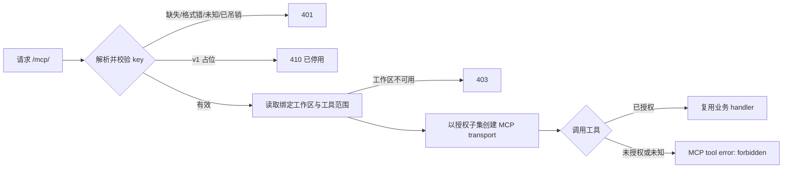

# external-mcp 外部 MCP 接入

`external-mcp` 域是 c3 对**自己没有拉起的 agent** 开放的唯一入口:独立的 Claude Code / Codex / Cursor 会话、CI 任务、监控脚本、局域网内的其它进程,凭长期 API key 通过 Streamable HTTP MCP 访问本部署的意图台账与讨论、投递事件,并在管理员授权下写回意图、提交审核结论、拉起会话。

在此之前 c3 是数据孤岛:六条 MCP 路由全部挂在 `/internal/*-mcp/v1`,每条都有 loopback guard 与一次性 per-run token,binding 来自 c3 拉起的 run 闭包(workspace + runId)。外部工具链只能靠人工搬数据进出。

## 与内部路由的关系:并列,不是放宽

|            | 内部 `/internal/*-mcp/v1`(6 条)            | 外部 `/mcp/<api-key>`                        |
| ---------- | ------------------------------------------ | -------------------------------------------- |
| 来源       | 必须回环(在 c3 自身 bind 之上的纵深防御)   | 不做 loopback 判断                           |
| 身份       | c3 自己铸的一次性 per-run token            | 长期 API key,且 key **就是路径段**           |
| 作用域来源 | run 闭包(workspace + runId + abort signal) | key 绑定的**单一工作区** + 该 key 的工具范围 |
| 工具       | 各路由自己的全集(含写工具)                 | 该 key 勾选的子集(默认五个只读)              |

内部六条路由的任何语义**都不受本域影响**。外部路由是独立模块,不复用 per-run token 机制——那套语义绑定 run,而外部 agent 没有 run。

## 请求与授权链

地址即凭据:`/mcp/<api-key>`,key 从 URL 的**单个路径段**解析并做 URL 解码与格式校验。接入方一行配置:

```sh
claude mcp add --transport http c3 "http://<host>:3000/mcp/<KEY>"
```

每次请求执行同一条链,顺序是安全属性的一部分:



- **凭据先于一切。** key 缺失、格式错、未知、哈希不符、已吊销一律 401,且**正文完全相同** —— 未认证的调用方连「key 是否合法」都学不到。key 从单个路径段提取,**拒绝空段、额外路径段与任何不能规范解析为一个 key 的值**;拒绝响应与日志**不回显 key 或完整 URL**。
- **`/mcp/v1?token=…&workspace=…` 已停用**。旧 query 入口返回明确的停用响应(410),不做兼容鉴权——两套工作区与授权来源并存正是本变更要消除的漂移。README 与域文档只给新地址。
- **会话一经 initialize 即钉死**在当时的 key id 与工具范围上。同一 `mcp-session-id` 换 key ⇒ 403;改范围或吊销 key 时服务端关闭该 key 的全部活动 transport,故下一次调用不能沿用旧权限,客户端重连后取得新 `tools/list`。更新持久状态先于清理连接:清理个别连接失败不得恢复旧权限。
- **HTTP 状态与协议内错误分层。** 401/403/404 用于建立/维持 transport 前的身份与作用域拒绝;**协议内越权**(已认证但调用未勾选工具)返回稳定的 MCP tool error `forbidden`,不执行 handler,也不伪装成 HTTP 成功业务结果。

## 可外部授权工具目录

服务端维护一份**显式的「可外部授权能力目录」**,而不是从内部 MCP 工具全集做排除。每项含稳定工具名、读/写分级、描述、参数 schema 与复用的业务 handler。新增内部工具不会自动外泄;新增可授权工具必须明确进入目录并声明分级,编译期断言把「构建出的工具名集合」钉死等于共享协议声明的读/写名表。

分级按**真实效果**:`read` 不修改意图台账、讨论、spec 或会话生命周期;`write` 会。`publish_event` 属 `read`——它投递事实,envelope 的 workspace 与来源由 key 绑定生成,调用方不能伪造来源;订阅自动化可能因该事件异步执行,这是它本来的可观察语义。

| 分级  | 工具                                                                                                                                                           |
| ----- | -------------------------------------------------------------------------------------------------------------------------------------------------------------- |
| read  | `find_intents` `view_intent` `find_discussions` `view_discussion` `publish_event`(新 key 默认勾选)、`find_deliveries` `view_delivery`(可授权,但**默认不勾选**) |
| write | `save_intents` `save_intent_directly` `submit_spec_review` `start_session_for_intent` `start_discussion` `continue_discussion`(默认**不勾选**)                 |

**目录与默认集是两份名表,刻意解耦**:「可被管理员勾选」与「新 key 自动获得」是两个不同的问题。
`EXTERNAL_MCP_READ_TOOLS` 只作分级来源,`EXTERNAL_MCP_DEFAULT_TOOLS` 才是创建 key 时服务端强制
写入的初值,后者是前者的真子集。两个交付只读工具进目录而不进默认集——新 key 不应在无人决定的情况下
获得读取一个工作区交付计划的能力。另有一条编译期断言钉死:默认集只能取读级工具,一个写工具永远不会
因为疏漏落进新 key 的初值。交付侧**没有任何写工具**进目录:状态写必须过交付状态机与全部守卫。

`save_intent_pr_info` 已**废弃并移出目录**,不再可授权:一个意图可能同时持有多条 PR(每个交付一条),
仅凭 `intentId` 无法确定要回填哪一条。存量 key 的 scope 里若仍留着这个名字,按目录外处理——调用返回
稳定的 forbidden,与既有「越权拒绝」语义一致。

**默认工具集合**是创建 key 时的服务端强制值,客户端伪造的默认值被忽略。**编辑只接受目录内工具名**:未知、重复的名称使整次更新失败,不做部分保存。**空工具范围表示该 key 什么也调不到,绝不是通配。**

工具**行为**复用与内部完全相同的 `run*` 核心,所以外部调用方观察到的规则与内部一致;外部授权不绕过意图状态约束、spec 审核约束或会话启动失败处理。差别只有 binding 与授权源:

- `save_intents` 交互式由会话内的用户文本确认把关;外部无人值守调用没有对话方,**管理员勾选该工具即替代确认门**——此例外只跳过确认,不放宽业务校验,其余走同一落库原子校验。
- `submit_spec_review` 内部审核由启动时刻捕获的 spec 指纹做防过期比对;外部调用没有启动时刻,结论绑定**调用当时**的 spec 实时内容(比内部弱,因为 c3 无法知道外部进程何时开始阅读),其余规则(意图必须存在、spec 可读、重复提交不重复计数)不变。
- `start_session_for_intent` 复用同一会话启动器,含状态校验、SDD 审批、依赖阻塞与 Git 分支策略;启动真实拉起 agent 并消耗资源。

明确**不注册**:其余任何当前或未来的内部写工具、资源/提示面。

## Key 生命周期与监听地址

长期 key 的存储、哈希、生成/校验/吊销,以及 `--host` 显式监听,属系统设置域:见 [system-setting](../../settings/system-setting/system-setting-spec.md#外部-mcp-api-key-存储-mcpapikeys)。**生命周期管理在工作区设置**:见 [workspace-setting](../../settings/workspace-setting/workspace-setting-spec.md#外部-mcp-接入非配置独立即时指令)。

要点回顾:明文只在生成响应里出现一次;磁盘上只有加盐 `scrypt` 哈希;每把 key 绑定单一工作区;吊销既让下一次请求失败,也关闭已建立的活动 transport。

## 安全边界与本期取舍

- **API key 是该路由唯一的访问凭据**。Web 登录会话、内部 per-run token 都不能替代它。
- **key 本身即地址、走 URL 路径**,便于按 key 分发地址、消除 `workspace` 参数,但更容易进入代理访问日志——**c3 不记录完整请求 URL**,用户侧反代日志需自行处理。
- **写权限会真实修改 c3 状态**:`save_intents` 可持久化意图,`submit_spec_review` 可提交审核结论,`start_session_for_intent` 可拉起 agent。这是安全边界的有意放宽:key 默认只读,写接口须显式勾选,key 可吊销。创建与编辑界面必须在写工具区持续展示该风险,保存含写权限的范围前有明确确认。
- **本期不内建也不强制 HTTPS**。明文 HTTP 下同网络的人可嗅探到 key。远程暴露应通过用户自管的 TLS 反向代理,并避免记录完整路径。这是已知并接受的风险。
- **不提供 `/mcp.md` 发现端点**(明确放弃),也不提供跨工作区 key、通配工作区、独立调用审计流、速率限制或 per-call 写操作二次确认。**不改变 `--host` 默认回环及显式开放监听的规则。**
- 拒绝响应与成功调用**均不输出 key**。

## 接入信息展示

工作区设置页的「外部 MCP 接入」页签承担 key 的生成、列示、工具范围编辑与吊销,并在一次性揭示区给出可复制的 `/mcp/<key>` 地址与一行式命令(见 workspace-setting 域文档)。明文 key 只在生成成功的那一次回包里出现,关闭揭示区后不可恢复。
