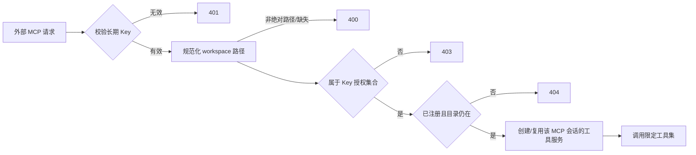

# external-mcp 外部 MCP 接入

`external-mcp` 域是 c3 对**自己没有拉起的 agent** 开放的唯一入口:独立的 Claude Code / Codex / Cursor 会话、CI 任务、监控脚本、局域网内的其它进程,凭长期 API key 通过 Streamable HTTP MCP 读取本部署的意图台账与讨论,并投递事件。

在此之前 c3 是数据孤岛:六条 MCP 路由全部挂在 `/internal/*-mcp/v1`,每条都有 loopback guard 与一次性 per-run token,binding 来自 c3 拉起的 run 闭包(workspace + runId)。外部工具链只能靠人工搬数据进出。

## 与内部路由的关系:并列,不是放宽

|            | 内部 `/internal/*-mcp/v1`(6 条)            | 外部 `/mcp/v1`                                  |
| ---------- | ------------------------------------------ | ----------------------------------------------- |
| 来源       | 必须回环(在 c3 自身 bind 之上的纵深防御)   | 不做 loopback 判断                              |
| 身份       | c3 自己铸的一次性 per-run token            | 长期 API key                                    |
| 作用域来源 | run 闭包(workspace + runId + abort signal) | **每次请求**从 `?workspace=` + key 授权集合重建 |
| 工具       | 各路由自己的全集(含写工具)                 | 五个只读工具的显式 allowlist                    |

本期**不改动**内部六条路由的任何语义。外部路由是新增的、独立的模块,不复用 per-run token 机制——那套语义绑定 run,而外部 agent 没有 run。

## 请求与授权链

固定挂载于 `/mcp/v1`,注册在 SPA catch-all 之前。接入方一行配置:

```sh
claude mcp add --transport http c3 "http://<host>:3000/mcp/v1?token=<KEY>&workspace=<PATH>"
```

每次请求执行同一条链,顺序是安全属性的一部分:



- **凭据先于参数**。token 缺失/格式错/未知/哈希不符/已吊销一律 401,且**正文完全相同** —— 未认证的调用方连「参数是否合法」都学不到,更无法据此探测某个 key id 是否存在过。
- **403 先于 404**。否则状态码本身就成了枚举宿主上有哪些 workspace 的接口。
- **路径规范化只用于判等**。`resolve` 掉 `.`/`..`、折叠尾部分隔符、存在时跟随符号链接,使同一目录的不同写法无法绕过授权集合;但交给 feature 层的是**注册表里的那个写法**——意图与讨论存储按 `resolve(workspacePath)` 分区,若把 realpath 结果传下去,软链注册的工作区会查出空结果。
- **会话作用域一经 initialize 即钉死**在当时的 key id 与 workspace 上。同一 `mcp-session-id` 换个 token 或换个 `workspace` 参数 ⇒ 403,而不是静默改作用域。

MCP 协议或工具参数错误沿用现有 MCP transport / tool error 语义。

## 对外工具能力

只注册五个工具,**显式 allowlist**(而非从内部工具全集里过滤 denylist):

| 工具               | 作用                                              |
| ------------------ | ------------------------------------------------- |
| `find_intents`     | 查询已授权 workspace 的意图台账                   |
| `view_intent`      | 按 id 查看单条意图                                |
| `find_discussions` | 查询该 workspace 的讨论                           |
| `view_discussion`  | 查看单条讨论及消息                                |
| `publish_event`    | 向 event bus 投递经统一校验、脱敏与截断的通用事件 |

方向很重要:新增一个内部工具**不会**因为遗漏而外泄——它必须被显式写进这份清单才可达。代码里有一处编译期断言把「构建出的工具名集合」钉死等于「声明的 allowlist」,两边不一致直接 typecheck 失败。

工具**行为**复用与内部完全相同的 `run*` 核心,所以外部调用方观察到的规则与内部调用方一致;不同的只有 binding。

`publish_event` 是有意保留的唯一有限副作用:它只投递事件事实,不能直接改台账状态或拉起 agent。envelope 的 workspace 取自**授权后**的作用域,`sessionId` 固定为稳定的外部来源标识 `external-mcp:<key-id>` —— 调用方可以描述事件,但无法决定它进哪个 workspace、也无法伪造来源。现有订阅自动化可能因该事件异步执行,这是它本来的可观察语义,发 key 的管理员必须知悉。投递失败以 MCP tool error 返回,不产生事件。

明确**不注册**:`save_intents`、`save_intent_directly`、`save_intent_pr_info`、讨论创建/继续、`start_session_for_intent`、`spec_review`,以及任何当前或未来的写工具。

## Key 生命周期与监听地址

长期 key 的存储、哈希、生成/校验/改授权/吊销,以及 `--host` 显式监听,属系统设置域:见 [system-setting](../../settings/system-setting/system-setting-spec.md#外部-mcp-api-key-mcpapikeys)。

要点回顾:明文只在生成响应里出现一次;磁盘上只有加盐 `scrypt` 哈希;吊销既让下一次请求失败,也关闭已建立的活动 transport。

## 安全边界与本期取舍

- **API key 是该路由唯一的访问凭据**。Web 登录会话、内部 per-run token 都不能替代它。
- **key 放在查询参数**是为兼容一行式 MCP 客户端配置。代价是它更容易进入代理/访问日志——服务端日志不打印 token,也不打印任何可能带 token 的完整 MCP URL,但用户侧的反代日志需自行处理。
- **本期不内建也不强制 HTTPS**。明文 HTTP 下同网络的人可嗅探到 key。远程暴露应通过用户自管的 TLS 反向代理,并避免记录完整查询串。这是已知并接受的风险。
- **不提供 `/mcp.md` 发现端点**(明确放弃,后续单独排期),也不承诺其它 MCP 客户端的专用配置格式;标准 Streamable HTTP 可按 URL 接入。
- **不提供速率限制**。管理员应把暴露范围控制在可信网络或反向代理之后。
- 拒绝响应与成功调用**均不输出 token**。

## 接入信息展示

工作区设置页有一个只读的「外部 MCP 接入」页签,用系统级 `baseUrl` + 固定路由 + 当前工作区路径拼出可复制的 URL 与一行式命令,并列出已授权本工作区的 key 供辨认。

- 常态下 URL 里是 `<KEY>` 占位符。用户可临时粘贴自己保管的明文以生成可直接复制的值:**该输入只存在于当前组件的内存中**,不上传、不写入浏览器存储,离开页面即消失。
- `baseUrl` 未配置时明说「未配置」并给出跳转,**不猜浏览器 Host** 当作永久配置。
- 没有覆盖本工作区的 key 时,给出前往系统设置生成的入口。

该页签不拥有任何工作区配置字段:它永远不会脏,也不会出现在任何保存载荷里。
