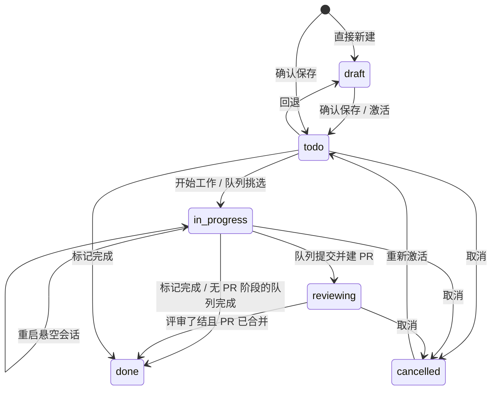

# Domain: intent-management

- **Group:** core
- **One-line:** 项目范围的意图账本:只读沟通智能体把想法拆成可验证条目,驱动规格、开发、PR 与可选的自动化队列。
- **Owner:** maintainer
- **Status:** active
- **Depends on:** [agent-session](agent-session.md)(沟通 / 规格 / 工作运行);[permission-gateway](permission-gateway.md)(意图网关与规格写界);[session-registry](session-registry.md)(工作区身份、隐藏沟通与规格会话)。
- **Depended on by:** [web-console](web-console.md)(意图视图与队列页);[delivery](delivery.md)(关联与 PR 落点);[automations](automations.md)(评审 / 修复执行面);[discussion](discussion.md)(结论转意图)。
- **exposes-api:** true — WebSocket `/ws`。消息形状在[共享协议](../../shared/api-conventions/websocket-protocol.md)中定义。
- **ADRs:** [0007](../../architecture/adr/0007-read-only-intent-agent.md) 只读沟通智能体、[0034](../../architecture/adr/0034-intent-pr-fact-base-and-readpoints.md) PR 账本为事实源

## Overview

intent-management 是项目范围、跨会话的意图账本:把「想做什么」写成可验证条目,经只读沟通智能体精炼,再驱动规格、开发、PR 与可选的自动化队列。

工作区身份是不可变名称;路径只用于 Git 与智能体工作目录。沟通智能体只读,不得编辑、执行、派生子智能体或跑斜杠命令([ADR 0007](../../architecture/adr/0007-read-only-intent-agent.md))。PR 事实在意图 PR 账本里,单一写入路径;托管状态同步进账本,不从 URL 猜测。意图完成由账本聚合加上评审了结派生,不以托管平台页面为准([ADR 0034](../../architecture/adr/0034-intent-pr-fact-base-and-readpoints.md))。

**范围:** 账本生命周期、规格闸门、工作会话挂接 / 续跑 / 新开、PR 与交付追踪、依赖闸门、评审 / 修复快照、自动化队列。
**边界:** 不驱动运行循环([agent-session](agent-session.md)),不裁定权限([permission-gateway](permission-gateway.md)),不拥有工作区目录([session-registry](session-registry.md)),不拥有交付边([delivery](delivery.md))。

## Business rules

### 账本与沟通

- **RM-R1**: 一条意图只属于一个工作区。没有跨项目聚合视图。
- **RM-R10**: 账本与隐藏集以工作区名称为键;文件系统操作才解析为路径。
- **RM-R12**: 账本不可用时意图入口返回 `error`,普通会话列表不过滤隐藏集,工作台仍能启动。
- **RM-R2**: 沟通智能体只读。可读项目材料与本项目账本,可经 `AskUserQuestion` 澄清;工具层禁止写入、执行、子智能体与斜杠命令。
- **RM-R3**: 沟通会话强制 `default` 权限模式,不响应 `set_mode`。保存的授权是对话确认,不依赖权限模式。
- **RM-R4**: 每工作区一组沟通会话,至多一个默认打开指针;沟通会话与规格会话永不进入普通会话列表。可列出、重命名、删除;删掉默认会话则提升最近剩余的一条。
- **RM-R5**: `save_intents` 是确认后的唯一批量写入。调用即落库,不弹权限窗;校验失败整批零写入。
- **RM-R6**: 新保存的意图以 `todo` 起步。直接新建可落 `draft`。
- **RM-R20**: `save_intents` 是原子 upsert:有 id 则更新本项目既有条目,无 id 则新建。`in_progress` / `done` 不可改;显式激活只允许回到 `todo`;`automate=true` 只给队列候选资格,不启动队列、不跳过闸门。标题或正文实际变化时撤销规格批准。
- **RM-R17**: 同一批次可声明对同批条目的先后;越界、自引用或成环则整批拒绝。
- **RM-R15**: 代码及其测试、配套文档是同一条意图,不得拆成「更新测试 / 文档」工单。
- **RM-R7**: 细化启动全新沟通会话,以该意图为种子,不改状态;定稿必须原地更新原 id。
- **RM-R19**: 沟通智能体可只读检索本项目账本(`find_intents` / `view_intent`),不得跨项目。
- **RM-R14**: 每条意图带推断出的模块名;空白即未识别。仅供展示。
- **RM-R30**: `draft` / `todo` 可直接改正文;进行中及之后锁定。后写者获胜,不改其余字段。
- **RM-R45**: 新增是一次请求:登记、基准与首轮沟通会话一起落定。选交付即关联。内容为空只登记不起会话。启动失败保留意图,回收会话。讨论转意图共用同一创建原语,须已有结论。
- **RM-R24**: 上下文腐化时重置沟通或规格会话:新会话以用户输入拼接当前内容为种子,替换回链;旧会话可回看。从未写过规格则拒绝重置规格会话。

### 影响范围与规格

- **RM-R49**: 影响范围 `L1`–`L5` 与优先级正交。创建时由沟通智能体判定;`in_progress` / `reviewing` / `done` 锁定。未定级与无法解释的值都读作未定级,不折到中间档。
- **RM-R51**: `L1`/`L2` 强制规格先行且禁止机器批准;`L4`/`L5` 在未显式覆盖时默认 `fast`;`L3` 与未定级跟随工作区。队列、人工入口与界面读同一套映射。
- **RM-R43**: `specMode` 只改规格与开发的先后。`null` 继承工作区;显式值覆盖。仅规范与开发均未起步前可改。`fast` 只绕开「必须先批准规格」这一道,其余闸门不放宽;超阈值的工作回合把模式切回 `sdd` 并反向补规格。
- **RM-R21**: 开发前在集中式、不入 Git 的规格根下生成可审文档。播种为 `raw`;内容真实变化才进 `pending`。撰写会话只写规格目录,可只读查本项目账本,不能保存意图。规格用领域语言写能力与契约,不写源码路径。
- **RM-R22**: `specStatus`(`raw` / `pending` / `approved`)是按钮与闸门的唯一事实源。批准是单人确认,从文档界面发出,不自动开始开发。`fast` 且 `raw` 时主按钮是开始工作,不邀请先写规格。
- **RM-R23**: 有效模式要求规格时,未批准不得启动或续跑开发;高影响还要求批准人是人工。从未写过规格且已有工作会话时,人工续跑或重启不因「未批准」被拦;队列与高影响仍要求批准。已批准规格是工作会话的真相来源,出现分歧须反向同步。
- **RM-R33**: 撤销批准显式、可审计;已在跑的开发不强制终止,下一次续跑重新过闸。
- **RM-R34**: 规格审核是独立只读会话,结论经结构化提交并绑定当前内容指纹;改写使旧结论失效。可回放,正文里的判断不算数。
- **RM-R37**: `open_spec_review_session` 是唯一恢复入口。对审核会话的人工续跑一律拒绝。
- **RM-R31**: 开发未起步且无在写规格会话时,人可直接改规格正文;改写撤销批准。
- **RM-R25**: 系统指令走系统上下文,永不渲染为可见聊天;用户输入与意图 / 规格路径提示保持可见。
- **RM-R35**: 队列在 SDD 下自治推进撰写 → 审核 → 有限返工。触顶则挂起交人;机器批准是工作区显式 opt-in,且仍受 RM-R51 约束。规格阶段不占开发并发名额。

### 开发、基准与失败

- **RM-R8**: `todo`,或 `in_progress` 且工作会话已悬空时,可开始工作。启动后台普通会话,置 `in_progress` 并记下回链。同一意图同时只启动一次。共享检出下启动前快进拉取;分叉则拒绝,不自动合并。
- **RM-R9**: 开发运行结束不改变意图状态。自动 `done` 只有三条:队列判定完成并提交推送(RM-A5)、进入视图时调和已死会话(RM-R18)、评审了结且 PR 聚合已合并(RM-R48)。
- **RM-R18**: 进入意图视图时调和 `in_progress`:工作会话仍存活则为运行中;进程已死且判定完成则标 `done`;否则标悬空。判定不可用不得据此改状态。
- **RM-R13**: 回链打开最近工作会话;会话已不存在则提示可重启,不崩溃。
- **RM-R54**: 回合用尽可重启:同一目录上开新工作会话并在绑定成功后改回链。旧会话保留可回看。重启不是交付,跳过收尾建 PR 与反向补规格。
- **RM-R44**: 基准分支是落库快照,回答「建在哪条分支上」。只在创建、首次关联就绪交付、该交付变就绪、失去最后关联时写入,之后不追随推进或改名。PR 目标与 worktree 基线读同一个值。
- **RM-R46**: 沟通、规格撰写、规格审核与开发共用该意图的同一个工作目录;写文档的根仍是规格目录。未归属意图的沟通会话留在项目路径。
- **RM-R42**: 新建工作目录以基准分支远端 tip 为根。已有目录基线不符只提示,不拦启动,不自动重建或暗中合并。
- **RM-R41**: 交付上下文跟会话走,不跟意图走。多关联必须显式选定。验证中或终态的交付不再开新的写入会话;已在跑的挂接不受限。
- **RM-R26**: 手动工作会话结束时提交并推送,不改意图状态;仅当意图已是 `done` / `reviewing` 才建 PR。队列拥有的运行自行收尾,两条路径互斥。
- **RM-R39**: Git / 托管创建失败给出原因指引与显式重试;不代为改仓库或凭据,证据不足则不猜。

### PR、依赖与危险动作

- **RM-R32**: 人手动建 PR,与顾问入口共用同一套目标解析。准入看工作目录模式、分支、目标可用、该目标无活跃 PR、相对基准有改动,与意图状态无关。成功写入账本 PR 行,不改意图状态。
- **RM-R32a**: 创建失败且目标尚无活跃 PR 时,可把已有 PR 关联进账本;硬性判据是工作目录当前提交与托管平台 head 一致。
- **RM-R28**: 对仍在 `reviewing` 的 PR 行做一次性托管同步,把终态写入账本;每次同步后求值完成派生。不从链接推断状态,不代合。
- **RM-R29**: 模型发布的 PR 更新成功事件,把已关闭或失败的对应行重新标为 `reviewing`。必须能唯一定位到那一行;`merged` 永不复位。
- **RM-R48**: `in_progress` / `reviewing` 在评审了结且 PR 聚合为 `merged` 时自动标 `done`。合并视为评审了结,会把尚未 `approved` 的结论补为 `approved`。`todo` 与需人处置的状态不走这条路径。
- **RM-R40**: 依赖闸门的判据是「前序产出是否已在我的基线上」,不是「前序 PR 合了没有」。手动可一次性放行(只跳过依赖这一道,每次启动重评);队列不提供放行。
- **RM-R11**: 未满足依赖在列表上警示;真正放行与否以 RM-R40 为准。
- 取消与永久删除收在溢出菜单并二次确认。取消一条持有活跃 PR 的意图须先关掉那些 PR,任一失败则状态不动。删除清本地台账、会话与工作目录,远端 PR 与集中式规格文件不动。

### 评审修复与工作笔记

- **RM-R52**: 意图级保留评审 / 修复结论与轮次,与规格审核、托管状态、生命周期各自独立。队列首次评审仅 `L5` 可跳过;人显式发起不受此限。`pending` 表示等待结论,是否仍在跑由在途投影派生。
- **RM-R53**: 人在标题栏发起评审 / 修复,与队列共用执行内核。人工路径不签发合并凭据、不记失败阶梯、不占队列并发、不看队列开关。`current-branch` 下无此入口。
- **RM-R50**: WorkNote 只增不改,供后续智能体阅读;追加失败必须报错,不得伪装成无历史。
- **RM-R36**: 被不可自动解决的事实挡住时,投影一条「下一步」深链:凭据 / 额度、待决权限、规格触顶或待批准、依赖、静默超时。只导航,不代答、不放行。
- **RM-R38**: 队列运行中超过三十分钟无进展且无已知等待时提示静默;只检测与指引,不自动修复。

### 自动化队列

- **RM-A1**: 只有勾选 `automate` 的意图是候选。
- **RM-A2**: 每工作区至多一个队列。启停与暂停持久化,进程重启后按用户意愿恢复,不静默变闲置。
- **RM-A3**: 按优先级再按最早创建挑选。闸门产出结构化原因,不静默跳过。`fast` 与手动共用同一条规格例外;高影响仍须人工批准。
- **RM-A4**: 回合结束后由无工具判定器给出 `done` / `in_progress` / `stuck`(stuck 优先)。空 diff 本身不是未完成;判定器故障不得伪装成需要人介入。
- **RM-A5**: 判定 `done` 后提交并推送。无 PR 阶段的模式标 `done`;worktree 进入 `reviewing` 再等 RM-R48。建 PR 与手动入口共用目标解析,目标不可用绝不另选主线。
- **RM-A6**: 一次失败只隔离到该意图(退避,连续三次挂起);队列继续处理无依赖关系的其他候选。被挂起者仍挡住下游。
- **RM-A7**: 仍有可恢复、退避、挂起或被闸门挡住的候选时,队列不得呈现为完成。
- **RM-A8**: `in_progress` 判定续跑同一会话直到上限;超限是该意图的失败,不是整队停止。续跑不回答人工决策点。
- **RM-A9**: 权限提示与手动会话对等:运行保持存活,由人作答。等待超过三十分钟只挂起并待办,不代答(C-SEC-3)。
- **RM-A10**: 工作会话仍在跑则挂接观察,不新开第二个。
- **RM-A11**: 未回答的澄清问题不得被自动续跑碾过;挂起交人,队列继续。
- **RM-A12**: 共享检出有效并发为 1;独立工作目录下受工作区并发上限约束。上限只约束队列自动派发,不拒人工启动,不取消在途。
- **RM-A13**: 提交被预提交钩子拒绝时允许一次智能体自愈;仍失败则记该意图失败。
- **RM-A14**: 多数表决开启时,检查点投票可覆盖 `stuck` 并自动继续;从不代答底层澄清问题。
- **RM-A15**: 事件只标脏唤醒对账,重复合并,处理期间到达的不得丢弃。
- **RM-A17**: 失败阶梯类挂起在依赖满足后自动解除;权限超时、规格触顶、需人决策不自动解除。挂起不是 `done`。
- **RM-A18**: 每轮取舍可查询。写入失败不得放宽闸门。
- **RM-A19**: 队列页展示阻塞原因,可暂停、跳过、解除挂起、覆盖结论。跳过不得标 `done`、不得暗中满足依赖;覆盖结论不能绕过硬闸门。并发挡住时给出队列位次。
- **RM-A20**: 内核自己产生的事件不得再次触发同一决策链;对账快照不可读则本轮不派发。
- **RM-A21**: 已有工作会话则挂接或续跑,否则新开。发起新回合就是一次新准入;挂接不发新回合,因而不是新准入。
- **RM-A22**: 决策点可唤起顾问:查询、停 run、建 PR、催人。不得批准规格,不得把意图标 `done`。顾问能做的动作必须有等价人工入口。
- **RM-A23**: 挂起跃迁只记本机结构化观测,不参与调度,不外传。
- **RM-A24**: 建 PR 后队列按同一套闸门与并发驱动评审 / 修复闭环。仅 `L5` 可跳过首次评审;已有结论后影响范围改判不再左右接力。`current-branch` 不接力。本节只约束队列;人可经 RM-R53 发起同一阶段。
- **RM-A25**: 正常闭环至多三轮修复、四次评审。轮次只由成功认领的修复增加。触顶挂起交人,普通解除不赠新预算。
- **RM-A26**: 评审只读结论,修复可改代码;结论只由工具调用产生,会话退出不算通过。无可用执行身份是失败,不能读作「不需要评审」。
- **RM-A27**: 只有队列自己评审并通过的 PR 才可由工作台落地;其余 `approved` 一律是人的合并。失败交回人,不重试。

## States

`reviewing` 只由队列在 worktree 建 PR 后写入。取消关闭全部活跃 PR,任一失败则状态不动。

## Domain events

消费 `list_intents`、`create_intent`、`open_intent_session`、`new_intent_session`、`refine_intent`、`discussion_to_intent`、`list_intent_sessions`、`rename_intent_session`、`delete_intent_session`、`delete_intent`、`start_development`、`restart_work_session`、`update_intent_content`、`update_spec_content`、`update_intent_status`、`set_intent_automate`、`set_intent_spec_mode`、`set_intent_impact_level`、`start_intent_relay`、`write_spec`、`approve_spec`、`create_pr`、`link_intent_pr`、`sync_intent_pr_status`、`start_workflow`、`stop_workflow`、`queue_control`、`get_queue_detail`。发出 `intents`、`intent_sessions`、`workflow_status`、`queue_detail`。聊天复用 `user_prompt` 与活动流。形状见[共享协议](../../shared/api-conventions/websocket-protocol.md)。

意图创建、进入开发、到达 `done`、失败或取消时各发一次进程内生命周期事件:尽力而为、不持久、不重放。自动化可消费,不得据此改账本或再发生命周期事件。

## 数据模型

### Intent

一条限定在单个工作区的台账条目:标题、正文、优先级 `P0`–`P3`、影响范围 `L1`–`L5`(可空)、状态、依赖、规格与开发回链。身份是稳定 id;作用域是不可变的工作区名称。

不变量:

- 优先级回答何时做,影响范围回答做错了波及多远,互不替代。
- 状态为 `draft` | `todo` | `in_progress` | `reviewing` | `done` | `cancelled`。`reviewing` 表示代码已提交、PR 未了结;进入 `done` 打完成时间,离开则清空。
- `specMode` 为 `sdd` | `fast` | 空(继承工作区);有效模式再受影响范围联动。规范或开发起步后不可改。
- 基准分支是落库快照,创建与关联边沿写入后不追随后续推进。
- PR 评审 / 修复结论是意图级最新快照,与规格审核、托管平台状态、生命周期各自独立。`fixed` 不等于评审通过。

零或多条依赖、PR 行、WorkNote;至多一条当前沟通会话与一条当前规格会话;可关联零或多个交付。

### Intent Dependency

同一工作区内的有向边。闸门看前序产出是否已在本意图基线上,不是看前序 PR 是否合并。批内新建可声明对同批条目的先后;已持久化的图不做环检测。

### Intent PR

一条 PR/MR,是一等事实而非意图上的几个字段。身份为托管平台 + 仓库 + 编号,全库唯一;一条已归属的 PR 不能写到另一意图上。

状态:`reviewing` | `rejected` | `failed` | `merged` | `closed`。托管状态同步进账本,不从 URL 猜测。写入只有一条路径。需要「这个意图的 PR 怎么样了」时用聚合态:未了结优先于终态,有合并优先于纯关闭。

完成不由托管平台页面推导:评审了结(免评审或结论为 `approved`,合并本身视为了结)且聚合为 `merged` 时,进行中或评审中的意图标 `done`。决策见 [ADR 0034](../../architecture/adr/0034-intent-pr-fact-base-and-readpoints.md)、[ADR 0035](../../architecture/adr/0035-intent-pr-table-split-and-migration-markers.md)。

### WorkNote

只增不改的工作笔记,供后续智能体阅读前序上下文。种类为 `work` | `review` | `fix`。不决定意图、PR 或评审的当前状态。物理删除意图时一并清除;取消意图保留历史。

### Communication Session

用于细化意图的隐藏智能体会话。每个工作区一组,全部不进普通会话列表;其中一个标记为默认打开。规格撰写 / 审核会话同样隐藏,只能从意图视图进入。

尚未归属任何意图的沟通会话留在项目目录;一旦归属,沟通、规格撰写、规格审核与开发共用该意图的同一工作目录,读写根仍按种类分离。

### Automation Queue

按工作区可选启用的调度。候选资格是每条意图上的 `automate` 标志。控制状态(`running` / `paused` / `idle`)持久化;单意图只持久化失败、退避与挂起,其余每轮从账本与存活运行重推。

### 派生投影

发送时从已有事实派生、不落库:`actionDescriptor`(被挡住时的下一步,只导航)、失败指引(已失败的 Git / 托管动作 + 显式重试)、评审 / 修复是否仍在途(含尚未绑定的占位)、是否有会话在跑(沟通 / 规格 / 规格审核 / 开发 / PR 评审 / PR 修复任一真实存活进程,不含占位)。派生不改状态或闸门。

## 协作

**agent-session.** 沟通会话以 `intent` 种类运行;规格撰写为 `spec`,规格审核为 `spec_review`;开发、PR 评审与修复走普通工作运行。挂接 / 续跑 / 新开会话共用同一套启动,本域决定何时 attach、resume 还是 fresh。运行活在进程里;本域只记录回链并观察结束。

**permission-gateway.** 沟通网关默认拒绝写入类工具,放行账本只读查询与对话确认后的 `save_intents`;澄清问答走答案注入,不走共识。规格撰写的写界限于集中式规格目录;规格审核无写权。开发会话用系统默认权限模式,待决跟 run 走。

**session-registry.** 工作区名称是账本键;路径只用于 Git 与智能体工作目录。沟通会话与规格会话进入隐藏集,不进普通工作列。评审 / 修复投影为工作会话并归属该意图,不进「自动化」。

**delivery.** 关联边由交付域写入;本域读取关联以解析基准、PR 目标与依赖闸门。建 PR 与开发共用同一份基准快照,不另推一条推导。

**automations.** 队列复用其执行、权限与厂商启动面跑评审 / 修复,但不登记为自动化条目。事件只标脏唤醒对账,与自动化触发的合并脏集同一条规则。

**web-console.** 渲染列表、详情、沟通聊天、规格文档、队列页与夺回控件。遮罩、按钮显隐与深链是窗口;闸门与账本仍以服务端为准。

## 关键取舍

**沟通智能体只读。** 工具层锁定,保存的授权是对话里的文字确认,网关不再弹窗。代价是服务端没有独立于模型行为的第二道拦截([ADR 0007](../../architecture/adr/0007-read-only-intent-agent.md))。

**SDD 时规格是真相。** 已批准规格驱动开发;改写或正文变更使批准失效。`fast` 只改「先写代码还是先写规格」的时序,不放宽依赖、并发或人工决策闸门。

**完成认账本,不认托管平台 URL。** PR 事实落在意图 PR 账本,单一写入路径;托管状态同步进账本,不从链接猜测。意图完成由账本聚合加上评审了结派生([ADR 0034](../../architecture/adr/0034-intent-pr-fact-base-and-readpoints.md)、[ADR 0035](../../architecture/adr/0035-intent-pr-table-split-and-migration-markers.md))。

**队列与人共用执行内核,结算不同。** 评审 / 修复的认领与运行只有一份;队列记失败阶梯且可通过自己的评审签发合并凭据,人工发起不记失败、不签发凭据,合并仍是人的事。

**依赖看产出是否已在我的基线上。** 不是「前序 PR 合了没有」([ADR 0038](../../architecture/adr/0038-dependency-gate-base-reachability.md))。队列始终挡住;手动可一次性放行,每次启动重新求值。工作目录基线不符只提示,不自动重建([ADR 0041](../../architecture/adr/0041-worktree-baseline-drift-as-notice.md))。

## 非功能

账本不可用时意图能力按入口降级,普通会话仍可用。队列控制状态可恢复;对账快照读不到则本轮不派发。错误必须对人可见。
