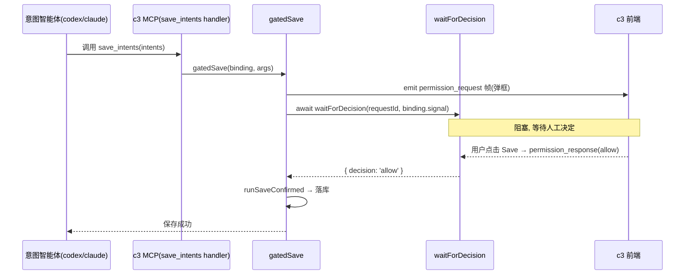
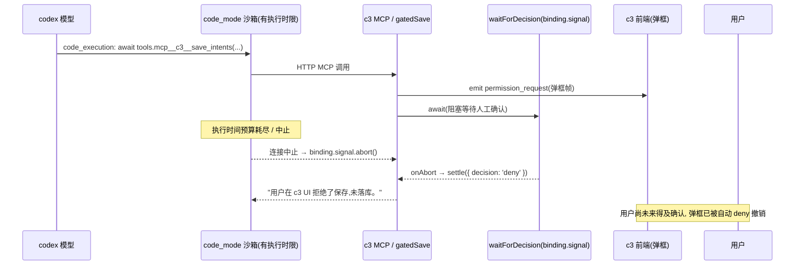

# 问题分析: codex 意图智能体 save_intents 确认框失效

> 本文档记录一次问题排查: 当 codex 作为意图沟通智能体时, `save_intents` 的人工确认框
> 无法正常弹出/确认, 导致意图始终无法落库。聚焦根因与证据, 修复已实施(下发侧关闭 code
> execution / web search), 见 §6。

- **状态:** 已修复(下发侧显式关闭 `js_repl` + web search, 已通过驱动单测 + codex
  0.142.4 CLI 兼容冒烟; 端到端 UI「点 Save → 落库」回归待在真实 c3 部署由人工确认)
- **首次观察:** 2026-07-11
- **修复:** 2026-07-12(`server/src/kernel/agent/adapters/codex/driver.ts`)
- **影响面:** 仅 codex 厂商的意图沟通会话(claude 不受影响); 波及所有依赖
  `gatedSave` 式**长阻塞人工确认**的 codex MCP 工具, 目前唯一命中的是 `save_intents`
- **关联:** [design](intent-management-design.md) 的保存确认门 · [spec](intent-management-spec.md) RM-R5 ·
  [ADR 0007](../../../architecture/adr/0007-read-only-intent-agent.md)

## 1. 现象

用户用 codex 智能体在意图视图里对话, 智能体列出待保存的意图并请求确认, 但**确认框弹不出来
让用户点 Save**, 保存流程无法完成。切换到 claude 智能体时一切正常。

## 2. 预期机制(正常链路)

`save_intents` 的确认**由保存处理器 `gatedSave` 自身发起**(RM-R5), 而非依赖厂商的
`canUseTool`。claude(进程内 SDK MCP)与 codex(loopback HTTP MCP)共享这一个门:

关键代码:

- 门逻辑: `server/src/features/intents/save-gate.ts` `gatedSave()` —— 先 `emit`
  `permission_request` 帧, 再 `await waitForDecision`, 仅在 `allow` 时落库。
- 决定等待: `server/src/features/permissions/index.ts` `waitForDecision()` —— 正常由前端
  `permission_response` 唤醒; **`signal` 一旦 `abort` 或超时, 立即 `settle({ decision: 'deny' })`**。
- codex 侧工具暴露: `server/src/transport/intent-mcp/index.ts`(loopback HTTP MCP) +
  `server/src/kernel/agent/adapters/codex/driver.ts` `mcpServersToCodexConfig()`。

这条链路在服务端与前端对两个厂商**完全对称**, 前端弹框渲染仅按 `toolName ===
'mcp__c3__save_intents'` 判定(`web/src/components/PermissionPrompt/PermissionPrompt.vue`),
**不区分厂商**。因此弹框应在 `emit` 那一刻就出现。

## 3. 排查过程

### 3.1 后端 / 前端链路对称且正确

逐环节确认: codex 意图会话确实分派到 driver 路径并携带 `intentProfile` +
`bindDriverMcp` + `onPermissionRequest`(`run-lifecycle.ts` → `run-via-driver.ts`);
codex 侧 `c3` HTTP MCP server 注册了 `save_intents`; 前端渲染 vendor 无关。**没有发现
不对称的缺陷**, 说明问题不在这条已知链路的接线上。

### 3.2 路由确认: DIRECT / 官方后端

从本地 codex 会话日志(`~/.codex/sessions/`)的 `session_meta` 确认失败会话的路由:

| 字段             | 值        | 含义                                          |
| ---------------- | --------- | --------------------------------------------- |
| `model_provider` | `openai`  | 官方 Responses 后端(非 relay 自定义 provider) |
| `originator`     | `c3`      | c3 覆盖了 originator                          |
| `source`         | `exec`    | `codex exec`, `store:false` 全量重放历史      |
| `cli_version`    | `0.142.5` | codex 0.142                                   |

即 DIRECT 路径, 而非 relay(`wireApi: 'chat'`)路径。

### 3.3 证伪假设 A: namespace 400

排查早期怀疑的是一个已被 `server/src/transport/codex-relay/namespace-repro.test.ts`
记录的问题: codex 的 `function_call` 携带 `namespace` 字段, 官方后端在 `store:false`
全量重放时严格校验会返回 `400 Unknown parameter: 'input[N].namespace'`, 从而在"历史里
出现工具调用后的下一轮"崩溃。日志佐证 codex 确实给 c3 的 MCP 工具打上了
`namespace: "mcp__c3"`(本地日志中出现 500+ 次)。

**但该假设被日志证伪:** 本地 40+ 个含 `mcp__c3` 的 codex 会话 —— 包括多轮 resume
的、最近到近期的 —— **全部正常 `task_complete`, 无一因 namespace 400 崩溃**。codex
0.142.5 + 官方后端能正常多轮重放带 `namespace: "mcp__c3"` 的历史。namespace 400
**不是本问题的根因**。

### 3.4 决定性证据: save_intents 走 code_mode

对比同一个失败会话里两类工具的调用方式:

| 工具           | codex 的调用方式                                                      | 日志事件                                      | 结果                                      |
| -------------- | --------------------------------------------------------------------- | --------------------------------------------- | ----------------------------------------- |
| `find_intents` | 标准 MCP tool call                                                    | `mcp_tool_call_end`                           | ~10ms 秒回 ✅                             |
| `save_intents` | **`code_mode`**: JS 沙箱里 `await tools.mcp__c3__save_intents({...})` | `custom_tool_call` (`call: "code_execution"`) | 返回"用户在 c3 UI 拒绝了保存,未落库。" ❌ |

`save_intents` 的返回文本 `用户在 c3 UI 拒绝了保存,未落库。` 正是 `save-gate.ts` 里
`decision !== 'allow'` 分支的返回值, 且 `custom_tool_call_output` 的 `success: true` —— 说明
code_mode 沙箱**确实拿到了 gatedSave 的返回**, 而这个返回是 `deny`。同一会话内两次
save 尝试都以"拒绝"告终, 会话最终 `task_complete`(智能体放弃保存)。

## 4. 根因

codex 0.142 的 **code execution / code_mode** 机制把 MCP 工具调用包装成一个受限 JS 沙箱里的
`await tools.<tool>(...)` 代码执行(`custom_tool_call` / `code_execution`), 而不是像
`find_intents` 那样发出标准 MCP tool call。

**该机制的实际配置开关是 `[features] js_repl`**(而非泛称的 "code_mode"): 本地
`~/.codex/config.toml` 里即有 `[features]` 段 + `js_repl = false` 为证 —— `js_repl` 就是把工具
暴露成 JS 沙箱 `tools.xxx()` 的 code execution 环境。注意 `js_repl` 一旦可用, **模型是否
用它是模型的选择**: 同一失败会话里 `find_intents` 走标准 MCP call、只有 `save_intents` 走
code_mode, 印证了这一点。因此根治点是**关闭 `js_repl`**, 让模型无 code_mode 可选、只能走
标准 tool call。

`save_intents` 的 `gatedSave` 是一个**需要人类在 UI 上花时间点击确认的长阻塞调用**。
code_mode 的 code_execution 沙箱有执行时间预算, **撑不到用户看到并点击弹框**:

因果链:

1. codex 通过 code_mode 在 JS 沙箱里 `await tools.mcp__c3__save_intents(...)`。
2. 调用打到 c3 → `gatedSave`: 弹框帧 `emit` 了, `waitForDecision(requestId,
binding.signal)` 阻塞。
3. code_mode 沙箱的执行时限先于人工确认到达 → codex 中止该 code_execution → 对应
   c3 侧运行 cycle 的 `binding.signal` 被 `abort`。
4. `waitForDecision` 的 `onAbort` 触发 → `settle({ decision: 'deny' })`。
5. `gatedSave` 收到非 `allow` → 返回"用户拒绝"文本, 不落库。

**用户侧体验**即"弹框弹不出来 / 来不及确认就没了": 确认框在 code_mode 沙箱的短暂窗口内
出现又被自动拒绝撤销, 从未变成一个可稳定操作的弹框。这与 claude 路径的差别在于 claude
不经过 code_mode 沙箱, 其确认门可以从容长阻塞直到人工决定。

## 5. 已排除的假设

- **namespace 400(见 3.3):** 已被日志证伪 —— 当前 codex 0.142.5 + 官方后端多轮重放带
  `mcp__c3` namespace 的历史均成功。
- **链路接线缺失 / 厂商不对称(见 3.1):** 后端与前端对两个厂商对称正确, 弹框渲染 vendor 无关。

## 6. 修复方案(已实施)

为 c3 的 codex **意图会话**运行**关闭 code execution(`js_repl`)与 web search**, 使所有
`mcp__c3` 工具都走**标准 MCP tool call 路径**(如 `find_intents` 一样, 无 code_execution 沙箱
时限), 这样 `gatedSave` 才能真正长阻塞、等到用户从容点击确认。

- **接线位置:** `server/src/kernel/agent/adapters/codex/driver.ts` `CodexDriver.start()`
  组装 `codexOptions.config`(`mcp_servers` 合并之后)与 `threadOptions`(`web_search` 下发)处。
- **意图会话识别:** 不凭"存在 `mcpServers.c3`"判断(会误纳只有 find/view 的 spec profile
  或只有 `publish_event` 的 work profile), 而是依据某 MCP server 的 `enabledTools` 是否
  含 `save_intents`(意图 profile 独有的写能力)。见 `mcpServersEnableSaveIntents()`; 其
  `?? INTENT_MCP_TOOL_NAMES` 回退与 `mcpServersToCodexConfig()` 一致, 使省略 `enabledTools`
  的旧式意图绑定仍被识别。
- **三管齐下下发**(理由见下方兼容性说明):
  - `features.js_repl=false` —— 根治开关(主力), 关闭 code execution 沙箱。合并进
    `codexOptions.config`, 扁平化为 `--config features.js_repl=false`。
  - `tools.web_search=false` —— codex 新版 `[tools]` 表格式。合并进 `codexOptions.config`,
    扁平化为 `--config tools.web_search=false`。
  - `web_search="disabled"` —— codex 旧版顶层键。意图会话把 `threadOptions.webSearchEnabled`
    置为 `false`(覆盖 `run-via-driver` 对所有交互会话统一下发的 `webSearch: true`), 由
    `codexExecArgs` 产出 `--config web_search="disabled"`, 且最终 argv 不再出现
    `web_search="live"`。
- **仅意图会话受影响:** work / spec / discussion 等非意图 codex 会话不获得这些关闭项,
  web search 行为保持原样; 驱动单测覆盖新建/resume、DIRECT/RELAY、正/负向各路径。
- **版本兼容(已实测, codex 0.142.4):** `-c key=value` 对**未知 config 键宽容忽略**(退出码 0,
  无报错)。冒烟命令: `codex exec -c features.js_repl=false -c tools.web_search=false -c
web_search="disabled" --skip-git-repo-check --sandbox read-only 'say hi'` —— 正常启动并
  `task_complete`(见 §7)。因此**新旧格式可同时下发, 各版本各取所需、互不干扰**, 低版本
  遇到高版本才有的键会静默忽略, 不会崩。
- **附带收益:** 意图运行不再启用 code execution, 也就不再由 code_mode 给 MCP 工具调用打上
  `namespace: "mcp__c3"` —— `namespace-repro.test.ts` 记录的潜在 400 隐患的**源头随之消失**
  (该测试本身按 spec 保留, 继续守护 RELAY 协议校验/转换契约, 未被改写成 save gate 测试)。
- **对 c3 的只读顾问用法无副作用:** c3 从不使用 codex 的 code execution / multi-agent 能力(ADR 0011)。

## 7. 验证结论与残留

已坐实 / 已排除:

- **CLI 兼容(已实测 codex 0.142.4):** 三项配置键 `features.js_repl=false`、
  `tools.web_search=false`、`web_search="disabled"` 同时下发时, `codex exec` 正常启动并
  完成(退出码 0), 未因任一新键报错。**低版本遇未知键宽容忽略这一前提成立。**
- **全局 `js_repl=false` 未被继承 → 已从下发侧根治:** 无论 c3 的 `codex exec` 启动路径是否
  继承用户级 `~/.codex/config.toml`, 现每次意图运行都**显式**携带运行级 `-c features.js_repl=false`,
  不再依赖全局 config 是否生效。这把"未继承"这一开放项从根因侧移除(下发侧强制关闭)。
- **驱动单测(已通过):** 最终 config/argv 同含三项关闭键、不含 `web_search="live"`、
  `mcp_servers` 与 provider 配置不丢失; work/spec/无-MCP 运行不获关闭项且 web-search 行为
  不变; 旧式默认 `enabled_tools` 推导仍识别意图 profile。

未能在本机坐实(如实记录, 不以推断代替结果):

- **`web_search="live"` 是否连带拉起 `js_repl`:** 本机为 ChatGPT 桌面认证 + Codex.app 运行时
  (`auth_mode="Chatgpt"`), 会**无条件**注入 `node_repl` / `codex_apps` 两个 MCP server(桌面
  端 BrowserUse / ComputerUse 运行时), 与 `js_repl` 配置开关无关; `RUST_LOG` 里
  `feedback_tags` 的 `features=[...]` 是编译期能力枚举(切换 `-c features.js_repl=true/false`
  三次输出完全相同), 不反映运行态。故本机**无法纯净复现 c3 服务端 headless `codex exec` 的
  code_mode 场景**, `web_search`↔`js_repl` 的耦合关系**未能 100% 坐实**。但修复采用三管齐下,
  无论该耦合是否成立**均已独立覆盖**(js_repl 与 web search 各自关闭), 因此该开放项不再影响
  修复正确性。
- **端到端 UI 回归:** "列出意图 → 用户点 Save → 落库"需在真实 c3 部署 + 浏览器中由人工点击
  确认, 属人在环节, 本环境无法执行。待在真实部署确认 `save_intents` 回到标准
  `mcp_tool_call_end` 路径、日志无对应 `custom_tool_call` / `code_execution`、确认框稳定可操作。
- **沙箱执行时限数值 / 前端弹框时序:** 精确数值与浏览器渲染时序仍待观测, 但不影响本修复
  (关闭 code_mode 后该短时限窗口整体消失)。

## 8. 附: 意图智能体是否需要 web_search

修复方向(§6)建议对意图会话关闭 web_search。此处论证该决策 —— **意图智能体不需要
web_search**, 关闭它没有能力损失。

**从设计定位看 —— 允许, 但非核心。** 意图智能体("Intent Analyst")的提示词
(`server/src/features/intents/prompt.ts`)把 web search 列为一项**只读上下文工具**("You may
only read project material (read-only tools: Read / Grep / Glob / web search, etc.) to
understand context")。但它的核心职责是: **与用户对话澄清 Why / What / Trade-offs, 读本项目
材料(Read / Grep / Glob)理解代码上下文, 查意图台账(`find_intents` / `view_intent`)复用与去重**,
再把模糊想法拆解为独立、可验证、合适粒度的意图条目。它**不写代码、不做技术实现**, 因此对
"检索外部网页/最新技术资料"没有硬需求 —— 拆解意图靠的是对话与项目内上下文, 不是外部搜索。

**从实证看 —— 零使用。** 统计本地 codex 会话日志(`~/.codex/sessions/`)中所有意图相关会话
(含 `find_intents` / `save_intents`)共 **63 个**, 其中 web_search 工具的**实际调用次数为 0**。
意图智能体在真实使用中从未真正动用过 web 搜索。

**从代价看 —— 有害。** `web_search="live"` 可能连带拉起 codex 的 `js_repl` code execution
环境(该耦合关系本机未能坐实, 见 §7), 而后者正是本问题的根因 —— 它让模型可用 code_mode 调用
`save_intents`, 从而使确认门失效。即便该连带关系最终不成立, 对一个从不使用 web_search 的角色
保留该工具也只是无谓地扩大了工具面。

**结论:** 对意图(沟通)会话**关闭 web_search** 是正确取舍 —— 符合其"只读拆解 + 对话澄清"
的职责边界, 消除(或至少缩小)触发 code_mode 的风险面, 且实证显示零能力损失。工作会话
(`work` 种类)是否保留 web_search 是另一个问题, 不在本文范围。
