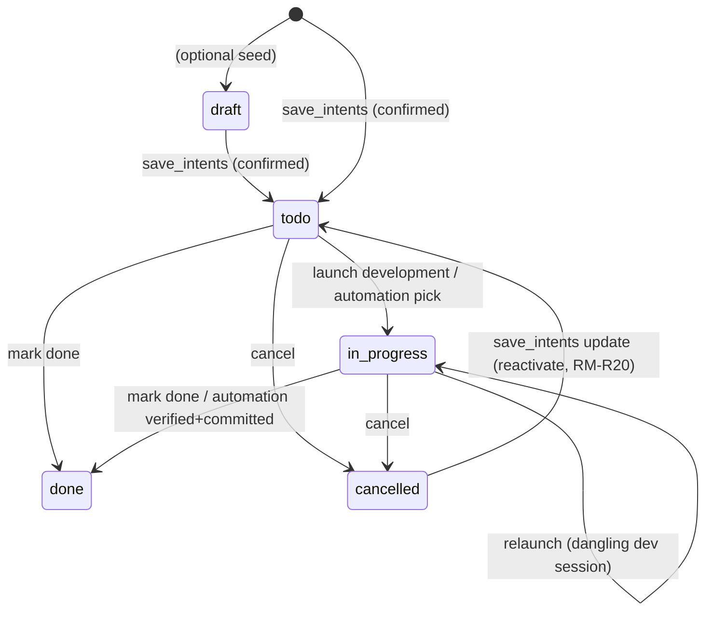

# intent-management — Domain Spec

## Overview

intent-management gives c3 a **project-scoped, cross-session intent ledger**. Where
the rest of c3 operates at the session level (prompt, gate, stream), this domain captures _what
the user wants to build_ against a project, helps refine it, and drives it into development.

It has three moving parts:

1. **The ledger** — intents persisted in a local SQLite database (`~/.c3/c3.db`), keyed by
   the project's resolved absolute workspace path, each with a priority, status, content, and
   optional intra-project dependencies.
2. **A read-only intent-communication agent** — a long-lived hidden session per project
   that reads project material, converses with the user, and proposes discrete, verifiable
   intent items. It can **never** edit, write, run commands, spawn sub-agents, or invoke
   slash commands (ADR 0007).
3. **Launch development** — turning a `todo` intent into a background normal session that
   runs the configurable development skill (`devSkill` in system settings; empty by default ⇒ no prefix),
   with a back-link to that development session.
4. **Automation orchestrator** — an opt-in, per-project background loop that develops
   `automate`-flagged intents one at a time (by priority then dependency order), verifies
   true completion from the dev session's last message + the working-tree diff, commits & pushes,
   then advances — stopping with a recorded reason on any abnormal end (RM-A1–RM-A9).

**Scope:** the intent ledger and its CRUD; the read-only communication agent and its
`save_intents` confirmation; refine (restart communication on one item); launch development
(background, configurable development skill from system settings, empty by default); development back-link; the `draft→todo→in_progress→done/cancelled`
status machine; dependency recording and unmet-dependency warnings; hiding communication sessions
from the normal list; the per-intent automation flag and the automation orchestrator
(completion judging, commit/push, sequencing).

**Boundary:** it does **not** define the agent run loop (agent-session) or the permission flow
(permission-gateway) — it reuses both. It owns no permission state. **Manual** launch development
never auto-completes a intent (the development run finishing does not change status; the user
marks `done`, RM-R9). The **automation orchestrator** is the single, explicit, user-opt-in
exception: it marks a intent `done` only after an independent completion judge confirms it and
the change is committed & pushed (RM-A5).

## Lifecycle events

An intent publishes one process-local lifecycle event when it is created, first enters development,
reaches `done`, terminates abnormally, or is cancelled. The event carries only workspace, stable
intent identity, title, module, phase, and resulting status. It is best-effort, non-persistent, and
never replayed. An abnormal automation termination publishes `failed` even when the ledger remains
`in_progress`; this reports the development boundary without changing intent state. A schedule may
consume an event but never modifies an intent or recursively emits another lifecycle event.

## Core entities

| Entity                  | Description                                                                                                                                          |
| ----------------------- | ---------------------------------------------------------------------------------------------------------------------------------------------------- |
| Intent                  | A ledger item: `title`, `content`, `priority` (P0–P3), `module` (模块名称), `status`, `dependsOn[]`, `lastDevSessionId`, scoped to a `workspacePath` |
| Intent Dependency       | A directed `intent → depends-on` edge within one project (display + warning only; no topological enforcement in v1)                                  |
| Communication Session   | The per-project hidden agent session used to refine intents; a real SDK session kept out of the normal list (the hidden set)                         |
| Automation Orchestrator | A per-project background loop (one at a time) that develops `automate` intents, judges completion, commits/pushes, and sequences (RM-A1–RM-A9)       |

See [intent-management-models.md](intent-management-models.md).

## Concepts

- **Project key (path-key).** Every intent and communication-session row is keyed by the
  **resolved absolute workspace path** — identical to the session-registry workspace key, the
  runtime `workspacePath`, and the SDK `cwd`. All inbound `workspacePath` is `resolve()`d before
  any read or write so the ledger, hidden-set filtering, and `cwd` always agree (RM-R10).
- **Hidden set.** The set of session ids excluded from the normal session list for a project:
  all communication-session ids and all intent **spec-session** ids. The normal session list
  (`list_sessions`) is filtered to exclude them, so all communication sessions — current and
  historical — and every intent's spec session stay out of the sidebar (RM-R4). Both are
  non-user-work sessions reachable only from the intent view (communication sessions via the
  intent chat, the spec session via the intent's spec tab), never from the sidebar.
- **Spec dependency context.** Before creating or resetting a spec session, worktree mode requires
  each known dependency to be available on the workspace mainline. A dependency that is not done,
  or that is done but still resides on a non-main branch without a merged PR, blocks the action;
  merged PRs, branchless historical work, mainline branches, and missing historical records pass.
  Current-branch mode skips this check. After a pass, the workspace branch is refreshed on a
  best-effort basis before the session begins; a failed refresh is recorded but does not block
  authoring. The corresponding controls remain disabled while the rule is unmet.
- **Session collection.** Each project holds multiple communication sessions (not just one).
  One session per project is marked `isCurrent` as the default-open pointer when entering the
  intent view without a specific `sessionId`. Sessions can be explicitly switched to via the
  extended `open_intent_chat { sessionId }` message or listed via `list_intent_sessions`.
- **Intent priority / 需求级别.** One of `P0`, `P1`, `P2`, `P3` (P0 highest).
- **Module / 模块名称.** A free-text label naming the intent's owning module, inferred by
  the communication agent from the item's title/content (e.g. 认证、会话、需求管理). Optional at
  proposal time and `''` when unidentified or for historical rows; lays the data groundwork for
  later module-based organization/filtering/display (RM-R14).
- **Automation flag (`automate`).** A per-intent, user-toggled boolean (`false` by default).
  Only `automate` intents are candidates for the automation orchestrator (RM-A1).
- **Automation orchestrator.** A per-project, in-memory background loop. **Eligibility:** a
  intent is eligible when `automate` AND `status ∈ {todo, in_progress}` AND every known
  `dependsOn` item is `done`. It develops the highest-priority (P0→P3, then oldest) eligible item,
  first **attaching** to its `lastDevSessionId` when that session is already running a turn (a run
  outlives its turn — don't double-run / preempt; RM-A10), else **resuming** it when the session
  still exists on disk (continuing the half-built context), and otherwise starting a **fresh**
  development session (configurable skill, empty by default ⇒ no prefix) — a `todo` item or a dangling session, the same dangling rule as manual launch
  (RM-R8). **Completion judge:** because the dev skill is often
  checkpoint-driven, a turn ending does not mean "done" — a fresh, tool-less judge decides
  **primarily from the dev session's last assistant message** (what it accomplished), with the
  multi-repo `git diff`/`git log` evidence as **supporting evidence, not a `done` precondition**, and returns
  `done` / `in_progress` / `stuck`, deciding **stuck → done → in_progress** with no bias toward
  continuing; empty evidence never by itself means "未完成" (RM-A4). **Continuation:** `in_progress` resumes the same session with continue up to a cap
  (clearing checkpoints); the cap prevents an infinite loop (RM-A8). **Permission parity:** a
  permission prompt during a dev turn (including a non-unanimous `AskUserQuestion`) behaves **exactly
  like a manual session** — the run is **not** aborted; it stays alive (`awaiting_permission`), the
  prompt is surfaced to the browser, and a watching human answers it there, after which the turn
  continues; the status shows an "awaiting authorization" hint meanwhile (RM-A9). **Human-decision
  guard:** the orchestrator still keeps an independent `pendingQuestion` guard so a turn that
  **settled** (was torn down) carrying an unanswered `AskUserQuestion` in its buffer is **never**
  auto-continue-ed — it stops the intent with a recorded reason (RM-A11). **Checkpoint consensus
  override:** when the majority toggle is ON, a `stuck`
  verdict or pending-question guard may instead trigger a multi-agent vote on whether to pass the
  checkpoint (RM-A14) — a majority `continue` overrides the stop and the orchestrator auto-continues,
  broadcasting the consensus result on the automation status.

## Business rules

| ID     | Rule                                                                                                                                                                                                                                                                                                                                                                                                                                                                                                                                                                                                                                                                                                                                                                                                                                                                                                                                                                                                                                                                                                                                                                                                                                                                                                                                                                                                                                                                                                                                                                                                                                                                                                                                                                                                                                                                                                                                                                                                                                                                                                                                                                                                                                                                                                                                                                                                                                                                                                                                                                                                                                                                                                                                                                                                                                                                                                                                                                                                                                                                                                                                                   |
| ------ | ------------------------------------------------------------------------------------------------------------------------------------------------------------------------------------------------------------------------------------------------------------------------------------------------------------------------------------------------------------------------------------------------------------------------------------------------------------------------------------------------------------------------------------------------------------------------------------------------------------------------------------------------------------------------------------------------------------------------------------------------------------------------------------------------------------------------------------------------------------------------------------------------------------------------------------------------------------------------------------------------------------------------------------------------------------------------------------------------------------------------------------------------------------------------------------------------------------------------------------------------------------------------------------------------------------------------------------------------------------------------------------------------------------------------------------------------------------------------------------------------------------------------------------------------------------------------------------------------------------------------------------------------------------------------------------------------------------------------------------------------------------------------------------------------------------------------------------------------------------------------------------------------------------------------------------------------------------------------------------------------------------------------------------------------------------------------------------------------------------------------------------------------------------------------------------------------------------------------------------------------------------------------------------------------------------------------------------------------------------------------------------------------------------------------------------------------------------------------------------------------------------------------------------------------------------------------------------------------------------------------------------------------------------------------------------------------------------------------------------------------------------------------------------------------------------------------------------------------------------------------------------------------------------------------------------------------------------------------------------------------------------------------------------------------------------------------------------------------------------------------------------------------------ |
| RM-R1  | A intent belongs to exactly one project, keyed by the resolved absolute workspace path. Lists are per single project; there is no cross-project aggregate view.                                                                                                                                                                                                                                                                                                                                                                                                                                                                                                                                                                                                                                                                                                                                                                                                                                                                                                                                                                                                                                                                                                                                                                                                                                                                                                                                                                                                                                                                                                                                                                                                                                                                                                                                                                                                                                                                                                                                                                                                                                                                                                                                                                                                                                                                                                                                                                                                                                                                                                                                                                                                                                                                                                                                                                                                                                                                                                                                                                                        |
| RM-R2  | The communication agent is **read-only**. It may use read-class tools (Read/Grep/Glob/WebFetch/WebSearch, auto-allowed) and may use `AskUserQuestion` (a clarifying-only tool — allowed, routed via user-answer injection, no consensus) but **never** edits, writes, runs commands, spawns sub-agents, or runs slash commands. This is enforced at the tool layer, not by prompt alone (ADR 0007).                                                                                                                                                                                                                                                                                                                                                                                                                                                                                                                                                                                                                                                                                                                                                                                                                                                                                                                                                                                                                                                                                                                                                                                                                                                                                                                                                                                                                                                                                                                                                                                                                                                                                                                                                                                                                                                                                                                                                                                                                                                                                                                                                                                                                                                                                                                                                                                                                                                                                                                                                                                                                                                                                                                                                    |
| RM-R3  | The communication session runs in **forced `default` permission mode**, regardless of the system default mode. It does not honor `set_mode`, and the intent view renders no mode selector. This is an **auxiliary** constraint, not the silent-save defence on its own: a vendor allow-rule can pre-approve `save_intents` and skip the permission gate even under `default` mode, so the save confirmation is enforced inside the save handler (RM-R5), immune to every pre-approval vector.                                                                                                                                                                                                                                                                                                                                                                                                                                                                                                                                                                                                                                                                                                                                                                                                                                                                                                                                                                                                                                                                                                                                                                                                                                                                                                                                                                                                                                                                                                                                                                                                                                                                                                                                                                                                                                                                                                                                                                                                                                                                                                                                                                                                                                                                                                                                                                                                                                                                                                                                                                                                                                                          |
| RM-R4  | Each project has at most one **`isCurrent`** (default-open) communication session. **All** communication sessions (current and historical) **and every intent's spec session** are in the hidden set and **never** appear in the normal session list — both are non-user-work sessions reachable only from the intent view, not the sidebar. Entering the intent view without a `sessionId` re-loads the project's `isCurrent` session (history + live stream). Entering with a specific `sessionId` opens that session and also sets it as the new `isCurrent`. Sessions can be listed via `list_intent_sessions`, renamed via `rename_intent_session`, and physically deleted via `delete_intent_session` (row + runtime removal; deleting the `isCurrent` session promotes the most recent remaining session to `isCurrent`). The hidden-set membership of all sessions is unchanged — the hidden-set queries still return every row. An intent's spec session is hidden only from the list; it stays openable from the intent's spec tab and unaffected in creation, run, and state.                                                                                                                                                                                                                                                                                                                                                                                                                                                                                                                                                                                                                                                                                                                                                                                                                                                                                                                                                                                                                                                                                                                                                                                                                                                                                                                                                                                                                                                                                                                                                                                                                                                                                                                                                                                                                                                                                                                                                                                                                                                               |
| RM-R5  | A intent is written to the ledger only through `save_intents`, which surfaces a human confirmation. The confirmation is raised **by the save handler itself** (it emits the `permission_request` wire frame for `mcp__c3__save_intents`, blocks on the decision, and persists only on allow) — **not** solely by `canUseTool` — so a vendor pre-approval that skips `canUseTool` (an allow-rule or non-`default` mode) still prompts. Both vendors (claude in-process MCP, codex HTTP MCP) share this one handler-owned gate; the intent gate allows `save_intents` straight through to the handler and MUST NOT prompt for it (double-prompting is a regression). Allow → the handler writes; Deny / cancel / abort → nothing is written and the agent is told it was rejected.                                                                                                                                                                                                                                                                                                                                                                                                                                                                                                                                                                                                                                                                                                                                                                                                                                                                                                                                                                                                                                                                                                                                                                                                                                                                                                                                                                                                                                                                                                                                                                                                                                                                                                                                                                                                                                                                                                                                                                                                                                                                                                                                                                                                                                                                                                                                                                       |
| RM-R6  | Newly saved intents start in status `todo`, scoped to the current project path.                                                                                                                                                                                                                                                                                                                                                                                                                                                                                                                                                                                                                                                                                                                                                                                                                                                                                                                                                                                                                                                                                                                                                                                                                                                                                                                                                                                                                                                                                                                                                                                                                                                                                                                                                                                                                                                                                                                                                                                                                                                                                                                                                                                                                                                                                                                                                                                                                                                                                                                                                                                                                                                                                                                                                                                                                                                                                                                                                                                                                                                                        |
| RM-R7  | **Refine** restarts the communication session for one intent: a fresh communication session is started and seeded with a first message carrying the intent's id, title, and content. It does not change the intent's status.                                                                                                                                                                                                                                                                                                                                                                                                                                                                                                                                                                                                                                                                                                                                                                                                                                                                                                                                                                                                                                                                                                                                                                                                                                                                                                                                                                                                                                                                                                                                                                                                                                                                                                                                                                                                                                                                                                                                                                                                                                                                                                                                                                                                                                                                                                                                                                                                                                                                                                                                                                                                                                                                                                                                                                                                                                                                                                                           |
| RM-R8  | **Launch development** is allowed when the intent is `todo`, or `in_progress` with a dangling (deleted) `lastDevSessionId`. Manual `start_development` first synchronously claims the intent id in an in-memory single-process launch set; while claimed, another manual start for the same intent returns a dev-start-in-flight error and does not create a worktree or launch a run. The claim is released when the dev session is successfully linked (`lastDevSessionId` + `in_progress`), and on every startup failure / pre-launch rejection path so retries are not permanently blocked. It starts a **background normal session** running the configurable development skill (`devSkill`; empty by default ⇒ none) with the intent content — the development skill is delivered per RM-R25 (a slash-command `devSkill` rides the non-echoed user turn) — sets status `in_progress`, and records `lastDevSessionId`. **Git branch mode (2026-06-10):** the workspace's `gitBranchMode` setting decides where the dev agent runs — in `worktree` mode the server creates (or idempotently reuses) an isolated git worktree under the c3 home worktrees area, keyed by project and intent id, branched from the `defaultMainBranch` setting (falling back to the project's current HEAD when unset), and the dev session's working directory is that worktree path; in `current-branch` mode (the default, and the fallback for any absent/unknown value) **no** worktree is created and the agent develops in place on the project checkout's current branch (working directory = the project path). **Pull latest before launch (2026-06-20):** a work session must build on up-to-date code, including worktrees. In `worktree` mode the server `git fetch`es the base branch from the repo's remote (`origin`, else the first remote) and roots the new worktree at the just-fetched remote tip (`<remote>/<base>`, created with `git worktree add --no-track` so the intent branch never adopts the base branch as upstream); when there is no remote or the fetch fails (offline / branch missing) it falls back to the local base branch — a fetch never merges, so it can never block. In `current-branch` mode the server fast-forwards the current branch (`git pull --ff-only`) before developing. The failure policy is **区分对待**: no remote / no upstream / network error ⇒ best-effort **skip** (a local-only or offline workspace still starts); a branch that has **diverged** from its upstream (non-fast-forward) ⇒ **hard stop** — the server never auto-merges or auto-rebases the user's branch, so it refuses to launch and returns a pull-failed error (manual `start_development` also releases the in-flight claim; the automation orchestrator surfaces it as an automation failure), telling the user to reconcile first. The development session is a normal session and appears in the sidebar — stamped with the bind time so it sorts to the **top**, and (for the connection-less automation orchestrator) fanned out to every connection on bind/settle so it live-appears without a manual refresh (SR-R13). |
| RM-R9  | The development run finishing does **not** change intent status (no auto-complete). The user marks `done` or `cancelled` manually from the list. **Exception:** on entering the intent view (`open_intent_chat`), the server reconciles every `in_progress` intent; a dev session whose process is dead AND whose last 3 assistant messages the completion judge confirms as `done` is **automatically** marked `done` — even for manually-launched runs (RM-R18). This reconcile auto-`done` is the only auto-`done` path outside the automation orchestrator (RM-A5).                                                                                                                                                                                                                                                                                                                                                                                                                                                                                                                                                                                                                                                                                                                                                                                                                                                                                                                                                                                                                                                                                                                                                                                                                                                                                                                                                                                                                                                                                                                                                                                                                                                                                                                                                                                                                                                                                                                                                                                                                                                                                                                                                                                                                                                                                                                                                                                                                                                                                                                                                                                |
| RM-R10 | Every inbound `workspacePath` is `resolve()`d before any ledger read/write or hidden-set filtering, matching the workspace key / runtime `workspacePath` / SDK `cwd`.                                                                                                                                                                                                                                                                                                                                                                                                                                                                                                                                                                                                                                                                                                                                                                                                                                                                                                                                                                                                                                                                                                                                                                                                                                                                                                                                                                                                                                                                                                                                                                                                                                                                                                                                                                                                                                                                                                                                                                                                                                                                                                                                                                                                                                                                                                                                                                                                                                                                                                                                                                                                                                                                                                                                                                                                                                                                                                                                                                                  |
| RM-R11 | Launching development with one or more **unmet dependencies** (a `dependsOn` item not `done`) is **warned** but not blocked — the user may proceed.                                                                                                                                                                                                                                                                                                                                                                                                                                                                                                                                                                                                                                                                                                                                                                                                                                                                                                                                                                                                                                                                                                                                                                                                                                                                                                                                                                                                                                                                                                                                                                                                                                                                                                                                                                                                                                                                                                                                                                                                                                                                                                                                                                                                                                                                                                                                                                                                                                                                                                                                                                                                                                                                                                                                                                                                                                                                                                                                                                                                    |
| RM-R12 | If the ledger (SQLite) is unavailable, intent features degrade per entry point (intent messages return `error`; the normal list is **not** filtered) and c3 still boots and serves normal sessions.                                                                                                                                                                                                                                                                                                                                                                                                                                                                                                                                                                                                                                                                                                                                                                                                                                                                                                                                                                                                                                                                                                                                                                                                                                                                                                                                                                                                                                                                                                                                                                                                                                                                                                                                                                                                                                                                                                                                                                                                                                                                                                                                                                                                                                                                                                                                                                                                                                                                                                                                                                                                                                                                                                                                                                                                                                                                                                                                                    |
| RM-R13 | The development back-link opens the `lastDevSessionId` session (reusing `select_session`). If that session no longer exists, the user gets a friendly prompt (with restart/cancel options), not a crash.                                                                                                                                                                                                                                                                                                                                                                                                                                                                                                                                                                                                                                                                                                                                                                                                                                                                                                                                                                                                                                                                                                                                                                                                                                                                                                                                                                                                                                                                                                                                                                                                                                                                                                                                                                                                                                                                                                                                                                                                                                                                                                                                                                                                                                                                                                                                                                                                                                                                                                                                                                                                                                                                                                                                                                                                                                                                                                                                               |
| RM-R14 | Each intent carries a `module` (模块名称). The communication agent **infers** it from the item's title/content (scheme a; future-extensible to the project's module structure) and passes it per item to `save_intents`; a missing/blank `module` persists as `''` (the agent is never blocked on it). The ledger column is `TEXT NOT NULL DEFAULT ''`; old dbs migrate via an idempotent `ALTER TABLE … ADD COLUMN` (schema v1→v2) with historical rows defaulting to `''` (no backfill). All read paths return `module`. The data groundwork is consumed by RM-R16 (list display); module-based filtering remains out of scope.                                                                                                                                                                                                                                                                                                                                                                                                                                                                                                                                                                                                                                                                                                                                                                                                                                                                                                                                                                                                                                                                                                                                                                                                                                                                                                                                                                                                                                                                                                                                                                                                                                                                                                                                                                                                                                                                                                                                                                                                                                                                                                                                                                                                                                                                                                                                                                                                                                                                                                                      |
| RM-R16 | The intent list shows each item's `module` as a neutral pill tag rendered between the date prefix and the title. A blank `module` (`''`) renders nothing — no placeholder, no layout break; the tag does not shrink and has a max-width with ellipsis so a long module name never squeezes the title. Display-only; it does not affect ordering or filtering.                                                                                                                                                                                                                                                                                                                                                                                                                                                                                                                                                                                                                                                                                                                                                                                                                                                                                                                                                                                                                                                                                                                                                                                                                                                                                                                                                                                                                                                                                                                                                                                                                                                                                                                                                                                                                                                                                                                                                                                                                                                                                                                                                                                                                                                                                                                                                                                                                                                                                                                                                                                                                                                                                                                                                                                          |
| RM-R15 | **Code + tests + companion docs are one intent (a single goal is never split).** When one goal touches code and its tests and/or its companion docs (spec / README / comments), the communication agent folds the test- and doc-sync work into the **same** intent's content + acceptance points — it must **not** emit a separate「更新测试」or「文档更新」intent. Code, its tests, and its docs are one change, kept on one ticket so no half is scheduled apart or dropped (which would drift tests/docs out of sync with code). Enforced by prompt guidance only (no tool-layer check).                                                                                                                                                                                                                                                                                                                                                                                                                                                                                                                                                                                                                                                                                                                                                                                                                                                                                                                                                                                                                                                                                                                                                                                                                                                                                                                                                                                                                                                                                                                                                                                                                                                                                                                                                                                                                                                                                                                                                                                                                                                                                                                                                                                                                                                                                                                                                                                                                                                                                                                                                            |
| RM-R17 | **A `save_intents` batch can declare dependencies on its own siblings.** Each proposed item carries, besides `dependsOn` (ids of **already-existing** intents), an optional `dependsOnIndexes` (0-based indexes into the **same batch's** items). Sibling ids don't exist at proposal time, so先后关系 within a batch can only be named by index. The save path mints every row's id **up front**, then resolves each index to the sibling's real id and writes it — merged & de-duplicated with `dependsOn` — into the dependency edges, all in one transaction. **Validation (atomic reject):** an out-of-range index, a self reference, or a cycle among the batch's intra-batch edges fails **before any write**, so the whole batch is rejected and the save returns an error result (nothing half-written); existing-id `dependsOn` behaviour is unchanged (cross-batch cycles are impossible — brand-new rows have ids nothing else references yet). **Stable secondary order:** a batch's rows are stamped with a creation time offset by index, so same-priority, dependency-free items keep a deterministic submission-order rank in the orchestrator's oldest-first tiebreak (RM-A3) instead of an arbitrary one. The communication agent is prompted to **actively fill `dependsOnIndexes`** whenever a batch has先后关系 (prompt guidance; the validation is the tool-layer guard).                                                                                                                                                                                                                                                                                                                                                                                                                                                                                                                                                                                                                                                                                                                                                                                                                                                                                                                                                                                                                                                                                                                                                                                                                                                                                                                                                                                                                                                                                                                                                                                                                                                                                                                                                       |

| RM-R19 | **The communication agent has two read-only ledger query tools.** Besides `save_intents`, the `c3` in-process MCP server exposes `find_intents` (search THIS project's intents by `keyword` — fuzzy `LIKE` over title/content, wildcards escaped — and/or `module`/`status`; returns a slim list of `id`/`title`/`module`/`priority`/`status`/`dependsOn`) and `view_intent` (one intent's full detail by `id`; an unknown or other-project id returns a friendly not-found, not an error). Both are **read-only** and **project-bound in the tool closure** (the agent can never read another project's ledger — `view_intent` fetches one intent by id then guards that it belongs to the bound project). The intent gate **auto-allows** both (no confirmation), unlike `save_intents` which still prompts; both stay resident in the turn-1 prompt so the agent need not search for them back. The prompt directs the agent to **search the ledger before** breaking down new items or setting `dependsOn`, to reuse related items, avoid duplicates, and reference the correct existing id. (ADR 0007.) |
| RM-R18 | **Intent reconcile on entry (`open_intent_chat`).** Every time a client enters the intent view, the server reconciles that project's `in_progress` intents -- checking each `lastDevSessionId` against the process table and, when the process is dead (server restart, crash, normal exit), loading the session's last 3 assistant messages and running the completion judge. **Liveness check:** a still-running dev session yields derived `runStatus = 'running'` (tracking). **Judge `done`:** auto-completes: commits & pushes (`feat: <title>`) and marks the intent `done` -- works for BOTH manually-launched and automation-started intents. This is the explicit, documented exception to RM-R9's no-auto-complete rule for process death. **Judge `in_progress` / `stuck`:** leaves the intent `in_progress` and sets `runStatus = 'dangling'`. **No `lastDevSessionId`:** also `dangling`. The reconcile result is reflected in the `intents` message payload (each intent carries its `runStatus`). An intents-refresh push follows when any intent was auto-completed, so other connections see the update. |
| RM-R20 | **`save_intents` is an upsert — a proposed item with an `id` updates that existing intent in place instead of inserting.** The whole batch is processed in **one transaction** with all validation **before any write** (atomic reject — nothing half-written, mirroring RM-R17): (a) the `id` must resolve to an intent in **this project** (a non-existent or cross-project id rejects the whole batch with an error result); (b) the target must be **modifiable by status** — `draft`/`todo` keep their status, `cancelled` is **reactivated to `todo`** (`completedAt` stays null), and `in_progress`/`done` are **immutable** (the batch is rejected with a clear「正在开发 / 已完成,不可修改」message); (c) on update, `title`/`content`/`priority` are written, `module` is updated only when supplied (else the prior value is kept), and the dependency set is replaced only when `dependsOn` or `dependsOnIndexes` is supplied (omitting both keeps the existing deps). Items **without** an `id` insert as `todo` per RM-R6. A single batch may **mix** updates and inserts; `dependsOnIndexes` (RM-R17) resolves against the full batch, so a sibling referenced by index may itself be an update target. **Refine串通 (RM-R7):** `refine_intent` seeds the communication session with the original intent's id and the prompt instructs the agent to fill that `id` on save so the refined intent updates its original entry rather than creating a duplicate (and to tell the user it cannot be modified if the original is already `in_progress`/`done`). The deprecated `save_requirements` alias shares the same schema/handler and inherits the upsert behaviour. |
| RM-R24 | **Reset intent / spec session — start a fresh, content-seeded session to escape a context-rotted one.** After an intent (or its spec) changed, the conversation in the linked refine / spec-authoring session may be stale. The intent detail exposes this as **我要修改** instead of a tab-local Reset: the header action resets the intent/refine session, and the spec document tab action resets the spec-authoring session. Both open the same controlled input dialog (ConfirmDialog-style, **not** `window.confirm`; confirm disabled until non-empty) → confirm starts a **brand-new** session seeded with the user's typed input **concatenated** with the relevant current content, and **replaces** the corresponding linked session id. The intent/spec session tabs themselves do **not** render a Reset button. **`reset_intent_session`** mirrors `refine_intent` (RM-R7): a fresh `'intent'` runtime whose first prompt prepends the user input ahead of the intent's current title + content, registering the pending→intent link so `run:bound` replaces `intent_session_id` with the real id on first bind. **`reset_spec_session`** mirrors `write_spec` (RM-R21) but **reuses the existing spec directory / path** (no scaffolding): it launches a fresh **write-confined** `'spec'` session (carrying the same two read-only ledger query tools as the first spec session, RM-R27) seeded with the user input + a pointer to the current `spec_path` (**only the path** — the agent reads the spec file itself; the prompt no longer inlines the spec body), replies `session_selected` so the spec-session tab switches to the new session, and registers the pending→intent link so `run:bound` replaces `spec_session_id` on first bind. `reset_spec_session` is **rejected** when no spec was ever written (`specPath` empty). Claude uses the spec permission gate for write confinement; Codex uses the driver sandbox boundary from RM-R21, so a Codex spec agent is not rejected when that boundary can be established. The server no longer pre-reads the spec, so its readability is not a launch precondition — a missing/unreadable spec becomes a normal file error the agent faces when it reads the path. Reset is **not** a delete: the prior session stays queryable under Works (Run center) but is no longer the intent's linked session. No batch reset. Dialog copy goes through i18n. |
| RM-R23 | **SDD-aware launch — server-forced approval gate + spec injection + work-session instruct.** When the workspace's SDD master switch (`sddEnabled`) is on, `start_development` enforces the approval checkpoint **on the server**, not merely by hiding the client button (RM-R22): launching an intent whose spec is **not yet approved** (`specApproved` false) is **rejected** with a spec-not-approved error and **no** run is started (the in-flight claim is released so retries are not blocked). When SDD is on and the gate passes, the dev session's first turn is shaped so it works the spec-driven way, split across the delivery channels of RM-R25: (a) the **VISIBLE turn** carries the intent `title` + `content` + the `依赖需求` note and, when a spec path exists, a **spec-path note** pointing the agent at the intent's approved `spec.md` (the **absolute** path in the centralized spec root, since it lives outside the workspace) as the single source of truth (Spec is Truth; reverse-sync on divergence) — the spec-path note is business context, so it stays visible; (b) when **no `devSkill`** is configured, the **SDD work-session instruct** — a fixed (non-i18n) instruction installing the spec-driven, checkpoint-governed working contract (Spec is Truth, Restate First, Checkpoint Before Execute, Done by Evidence, Reverse Sync, Ask via Tool, plus explicit pause-and-hand-back conditions) — is delivered as the model's **system context**, NOT the visible turn, so it never renders as a visible chat message; (c) a configured **`devSkill`** is a slash command and **takes precedence** over the instruct (the two never stack) — it rides the model's **user turn** (the only place a slash command expands) but is kept **out of the visible echo**. When SDD is **off**, the visible turn is byte-for-byte the historic shape (`title` + `content` + the `依赖需求` note); a `devSkill`, when set, still rides the non-echoed user turn — no gate, no spec note, no instruct. |
| RM-R22 | **Approve spec — the human approval checkpoint, and the SDD-aware four-state intent action button.** The intent detail's primary action button renders one of four states, decided per `todo` intent from the workspace's SDD master switch (`sddEnabled`) plus the intent's `specPath` / `specApproved`: (1) **SDD off** ⇒ `Start Dev`; (2) **SDD on and `specPath` empty** ⇒ `Write Spec` (RM-R21); (3) **`specPath` set and `specApproved` false** ⇒ `Approve Spec`, but this header action only opens the spec document tab and reads the spec; (4) **`specPath` set and `specApproved` true** ⇒ `Start Dev`. The workspace's `sddEnabled` rides every intent-list broadcast so the button can resolve its state without a separate settings fetch. The actual `approve_spec` call is only reachable from the spec document tab's **Approve** action, so the user approves from the document surface rather than the global header. The existing 10-second post-`Write Spec` anti-misapproval gate also applies to that spec-tab Approve action, not to the header shortcut. `approve_spec` is the human approval checkpoint that gates entry into development — the reason SDD exists: it sets `spec_approved=true` and records the **approving user** (the current login subject) in `spec_approve_user`, then re-broadcasts the list. Approval is **single-person confirmation** — no multi-sign and no un-approve in this phase (un-approve may follow later). `approve_spec` requires an authored spec: approving an intent whose `specPath` is empty is **rejected** (a defensive server guard — the UI never offers the spec-tab Approve before a spec exists). Approving does **not** itself launch development; it only clears the checkpoint so the button advances to `Start Dev`. All button copy goes through i18n. |
| RM-R21 | **Write spec — the quality-gate output step turns an intent into a constrained, reviewable spec document.** `write_spec` scaffolds a dated spec directory under the **fixed, centralized spec root** — `<c3 home>/doc/<project-path-segment>` (isolated per project, deterministically derived from the **owning workspace path** so all of the project's worktrees share one spec set; **not** user-configurable, and **not** committed to Git): `<spec-root>/yyyy/mm/dd/yyyy-mm-dd-<NNN>-<slug>/spec.md`, where `<slug>` is the intent's `shortEnTitle` slugged (lowercased, non-alphanumerics collapsed to a single hyphen, trimmed; falling back to the intent id prefix when the title is empty or non-ASCII) and `<NNN>` is a 3-digit per-day sequence (the highest existing number under that day root plus one, `001` when none). The server **seeds** `spec.md` with only `intent_id`, `title`, and `created` frontmatter, a title, and the intent reference — no document-level `status` and no fixed section skeleton — and **backfills the intent's spec path immediately** (the stored `spec_path` is the **absolute** centralized location), so the spec exists even if the authoring run fails. The spec-authoring system instruction also forbids adding a frontmatter or document-header `status` label: approval is a system gate and never writes document status back, so such a label would be stale. The spec is written in the console display language for its **first reader, the user**; the development agent is the second reader. It leads with the observable change, its boundaries, the decisions requiring confidence, and verification; a reviewer can approve or reject it without reading the codebase. Its structure is proportional to actual impact: a focused single-surface change with no contract, persisted-data, migration, security, or cross-domain effect has only a 2–4 sentence change summary, behavior and boundaries, and concrete verification (normally 8–20 lines); a normal change adds only relevant approach, affected capabilities/contracts, and boundaries; a contract/data/migration/security/cross-domain or otherwise high-risk change also records decisions/trade-offs, compatibility/migration, and failure handling. It never repeats the intent's Why/What/Non-goals/acceptance except to turn an acceptance item into an observable verification condition, and it never creates an empty heading. Specs describe capabilities and contracts in domain language, not source paths, symbols, or per-file edits. An implementation handoff is optional and follows verification only when needed; it gives technical boundaries and sequencing without code identifiers. It then launches a **spec-authoring session** on the configured spec agent (`specAgentId`; empty ⇒ follow the default agent) whose responsibility is **only to write the spec, not to change code**: the session is **write-confined to the spec directory** — write-class tools targeting any other path are denied (even though the spec directory itself sits **outside** the project tree), the rest of the project is read-only — and shell / sub-agent / slash-command tools are blocked. The spec-authoring contract — Spec-is-Truth, the five-dimension Spec Self-Check (complete / consistent / verifiable / scoped / traceable), the write-confinement, and ask-via-tool on ambiguity — is delivered as the spec agent's **system context**, NOT restated in the visible launch turn (RM-R25); the visible turn carries only the business context (which intent + its body, and the deliverable file to write). When the session binds, its id is linked back onto the intent as its **spec session**. Write confinement is vendor-specific but enforced before the model can act: Claude uses the path-level permission-gateway mechanism with `rt.specDir`, while Codex uses the driver sandbox boundary — cwd is moved to the centralized specs root, `workspace-write` + `approval_policy=never` are forced, and the specs root is passed via `--add-dir`, leaving the project tree, ledger DB, and other non-specs-root paths outside writable roots. If the Codex boundary cannot be established, launch fails closed instead of falling back to a project-writable cwd. The permission scoping reuses the schedule pre-configuration philosophy (allow/deny declared up front) but is enforced by the vendor execution boundary, not merely tool-name prompt text. |
| RM-R25 | **Internal system instruction vs visible session content — the boundary, applied uniformly across the intent / spec / work sessions and across every vendor.** A turn's text divides into two kinds. **Internal system instruction** (constrains how the model acts — its role, capability/permission boundary, and working method): the communication agent's read-only analyst role; the spec-authoring contract (Spec-is-Truth, the five-dimension self-check, write-confinement, ask-via-tool); the work session's development skill and the SDD work-session instruct. **Visible business context / user input** (what a user recognises as subject data or their own words): every message the user submits, the intent body (title + content), the dependency note, the spec-path note (the work-session and `reset_spec_session` prompts both point the agent at the spec's path; neither inlines the spec body), and the text a user types when resetting a session. The rule: internal system instructions reach the model through its **system context** and are **never** rendered as a visible chat message — not as `user_text`, not as any other visible block, in the live stream, the history baseline, or reconnect replay — covering the launch turn and every later turn; visible business context / user input keeps its existing visibility and order, its text unchanged. The one carrier exception is a slash-command development skill: a slash command only expands when it leads the model's user turn, so it cannot live in the system context — it rides the user turn (its execution semantics preserved) yet is still kept out of the client echo, so the client never sees it. The capability/permission boundaries do **not** depend on this visibility: the read-only lock (ADR 0007) and the spec write-confinement (RM-R21) are enforced at the tool / path layer regardless of whether any instruction is shown. This change affects only newly produced sessions and turns; existing history is not migrated, rewritten, or hidden. |
| RM-R27 | **The spec-authoring session has the two read-only ledger query tools — and ONLY those, read-only, project-bound, no save, on both Claude and Codex spec agents.** The `write_spec` / `reset_spec_session` session (RM-R21 / RM-R24) carries the SAME `find_intents` / `view_intent` tools the communication agent has (RM-R19): `find_intents` searches THIS project's intents (keyword / module / status → slim list) and `view_intent` reads one intent's full detail by id (an unknown or other-project id returns a friendly not-found, not an error). They let the spec author **ground or clarify the spec against existing intents** in the same project. The boundary: (a) **read-only** — the spec session is **never** given `save_intents`, so it cannot create or change any intent; (b) **project-bound in the tool closure** — it can never read another project's ledger (`view_intent` guards that the fetched intent belongs to the bound project); (c) **defence-in-depth** — the spec session's `c3` MCP server registers exactly these two tools (main line), AND the spec permission gate's read-pass set is an **explicit** read-only union (read built-ins ∪ the two query tools), so `save_intents` falls to **deny-by-default** even if it were ever mis-registered or vendor-preapproved (unlike the intent gate, which lets save through to its own handler-owned confirmation); (d) **vendor transport split** — Claude receives the in-process SDK MCP server, while Codex receives the loopback HTTP MCP server with `enabled_tools` derived from the same two-tool set; neither transport registers `save_intents`. Both tools stay resident in the turn-1 prompt (no ToolSearch round-trip first). Because both `write_spec` and `reset_spec_session` provision the spec session through the **same** launch path (one spec-profile factory), a **reset** spec session gets the identical two tools — the capability survives reset. (ADR 0007.) |
| RM-R26 | **Manual dev session-end Git/PR cleanup — close the Git/PR loop when a manually-started development session settles, without touching the status machine.** An intent carries five Git/PR tracking fields: `branchName`, `latestCommitHash`, `prId`, `prUrl` (the clickable PR/MR link), and `prStatus` (`reviewing`/`rejected`/`failed`/`merged`). When a development session **started manually** (`start_development`, not the automation orchestrator) settles — for **any** reason: normal completion, error, or user termination — the server runs a session-end cleanup. **Source split:** a session is treated as automation-owned only while the project's orchestrator is actively driving that very intent (it then commits/pushes itself, RM-A5); every other settled intent-linked session is a manual one and is cleaned up here — the two are mutually exclusive. The cleanup never runs mid-session, only after settle, and never changes intent status (no auto-`done`; RM-R9 stands — `reviewing` is a PR-status field, independent of the intent's own `todo`/`in_progress`/`done`). **Branch-mode dispatch:** in `worktree` mode the cleanup always runs against the intent's worktree; in `current-branch` mode it runs **only when the current branch differs from the workspace's `defaultMainBranch`** — on the main branch the cleanup is a **normal success skip** (no commit/push/PR/MR, no PR fields written, **no** failure message). **Happy path (changes present):** commit (`feat: <title>`) → push the branch → create a PR/MR through the forge-aware change-request capability. Explicit workspace `forge` values `github` and `gitlab` override repository-origin detection; `auto` (or no setting) retains detection. GitHub uses `gh`; GitLab uses `glab`. The cleanup then writes back `branchName`, the pushed `latestCommitHash`, `prId`, `prUrl`, and `prStatus = reviewing`. **Idempotent re-cleanup:** an intent that already has a PR/MR is not re-created — the cleanup commits/pushes and refreshes `latestCommitHash` but leaves the PR fields untouched. **Explicit failure (never fake success):** when the cleanup should run but cannot complete — **no committable changes** (treated as a failure, not a silent skip), commit/push failure (auth, rejected, network, conflict), the selected forge CLI **unavailable or not logged in**, or PR/MR creation failing — it **fails explicitly** and pushes a **workbench wait-user-involve todo** (source `intent`, carrying a localized message via a UI error code) asking the user to act. On failure it **never** sets `prStatus = reviewing` and **never** writes a wrong/placeholder `prId`/`prUrl`; steps that genuinely succeeded are honestly recorded (e.g. commit+push succeeded but PR/MR creation failed ⇒ `latestCommitHash` is written, PR fields stay empty). A prior cleanup todo for the same intent is cleared before re-attempting (self-healing on re-run). The cleanup does **not** auto-merge the PR/MR, resolve conflicts, configure credentials, or retry — those stay with the user. No new `commit_hash` field duplicating `latestCommitHash` is introduced. |

### Automation orchestrator

| ID     | Rule                                                                                                                                                                                                                                                                                                                                                                                                                                                                                                                                                                                                                                                                                                                                                                                                                                                                                                                                                                                                                                                                                                                                                                                                                                                                                                                                                                                                                                                                                                                                                                                                                                                                                                                                            |
| ------ | ----------------------------------------------------------------------------------------------------------------------------------------------------------------------------------------------------------------------------------------------------------------------------------------------------------------------------------------------------------------------------------------------------------------------------------------------------------------------------------------------------------------------------------------------------------------------------------------------------------------------------------------------------------------------------------------------------------------------------------------------------------------------------------------------------------------------------------------------------------------------------------------------------------------------------------------------------------------------------------------------------------------------------------------------------------------------------------------------------------------------------------------------------------------------------------------------------------------------------------------------------------------------------------------------------------------------------------------------------------------------------------------------------------------------------------------------------------------------------------------------------------------------------------------------------------------------------------------------------------------------------------------------------------------------------------------------------------------------------------------------- |
| RM-A1  | Each intent carries an `automate` flag (`INTEGER NOT NULL DEFAULT 0`; schema v3→v4 idempotent `ALTER TABLE … ADD COLUMN`, historic rows default to `0`). It is user-toggled (a per-row checkbox) and gates orchestrator eligibility — nothing else reads it.                                                                                                                                                                                                                                                                                                                                                                                                                                                                                                                                                                                                                                                                                                                                                                                                                                                                                                                                                                                                                                                                                                                                                                                                                                                                                                                                                                                                                                                                                    |
| RM-A2  | At most **one** orchestrator runs per project. `start_automation` while one is `running` is a no-op (returns the live status). The orchestrator is in-memory; it does **not** survive a server restart (state resets to `idle`).                                                                                                                                                                                                                                                                                                                                                                                                                                                                                                                                                                                                                                                                                                                                                                                                                                                                                                                                                                                                                                                                                                                                                                                                                                                                                                                                                                                                                                                                                                                |
| RM-A3  | The orchestrator develops eligible intents **one at a time**, ordered **priority (P0→P3) then oldest-first**. Eligible = `automate` AND `status ∈ {todo, in_progress}` AND every known `dependsOn` item is `done`; when the workspace SDD switch (`sddEnabled`) is on, eligible also requires `spec_approved=true`, so queued intents without an authored/approved spec are not picked or started by automation. SDD off keeps the historic behavior and does not require a spec. An unknown dependency id (cross-project/deleted) does not block. For the picked intent, the starting action is decided in this precedence: (1) if its `lastDevSessionId` is **already running a turn** in the background, **attach** and track it (RM-A10) — never launch a second turn; else (2) an `in_progress` intent whose `lastDevSessionId` **still exists on disk** is **resumed** (its half-built dev-skill context is continued by resuming that session, first prompt continue); else (3) a `todo` item or a **dangling** one (empty/deleted `lastDevSessionId`) starts a **fresh** dev session — the same dangling rule as manual `start_development` (RM-R8).                                                                                                                                                                                                                                                                                                                                                                                                                                                                                                                                                                                    |
| RM-A4  | After a dev turn ends normally, an independent, **tool-less** completion judge reads the intent + the dev session's last assistant message + **code-change evidence** (`git diff HEAD --stat` for uncommitted work AND `git log --oneline` for recent commits, both **multi-repo aware** — see §Interactions/git) and returns `done` / `in_progress` / `stuck`, **deciding in the order stuck → done → in_progress**. Completion is judged **primarily from the agent's report** (what it accomplished); change evidence is **supporting corroboration, not a precondition** — committing/pushing is c3's own job **after** a `done` verdict (RM-A5), so an absent diff/log must not, by itself, veto completion. **Empty evidence is never a stuck signal** (the agent may self-commit leaving a clean tree, the change may live in a sub-repo, or c3 will commit it later). The judge **first** checks for a human-intervention signal (`stuck`, see RM-A11), **then** completion (`done` — a concrete, self-consistent completion report is enough even with empty evidence; present evidence strengthens it), and **only otherwise** falls back to `in_progress`. There is **no bias toward `done`/`in_progress`**: `in_progress` is the residue after `stuck` and `done` are ruled out, not a default-to-continue. The turn ending alone is **never** taken as completion (the dev skill is often checkpoint-driven).                                                                                                                                                                                                                                                                                                                      |
| RM-A5  | On `done`: the orchestrator commits any uncommitted changes (`feat: <title>`, skipped when the tree is already clean because the agent committed) and **always pushes** (so agent-made local commits reach the remote), then creates a PR/MR through the forge-aware change-request capability before marking the intent `done` and advancing. Explicit workspace `forge` values `github` and `gitlab` override repository-origin detection; `auto` (or no setting) retains detection. GitHub uses `gh`; GitLab uses `glab`; the resulting identifier and link are recorded in the existing PR/MR tracking fields. This is the orchestrator's auto-`done` path (one of two auto-`done` paths; the entry reconcile RM-R18 is the other). A commit blocked by a **pre-commit lint hook** is first **self-healed** by a single dev-agent fix (RM-A13); any **other** commit/push failure (or a lint failure that survives the agent fix) is a hard stop (RM-A6).                                                                                                                                                                                                                                                                                                                                                                                                                                                                                                                                                                                                                                                                                                                                                                                   |
| RM-A6  | The orchestrator **stops** (state `error`, reason recorded) on any abnormal end: the dev turn errored; the judge returned `stuck`; the continuation cap was exceeded (RM-A8); a torn-down turn carried an unanswered `AskUserQuestion` (RM-A11); a **non-lint** commit/push failure occurred; or a pre-commit lint failure survived the single dev-agent self-heal attempt (RM-A13). The reason is surfaced next to the automation button. A **live** permission prompt is **not** an abnormal end — it waits for a watching human like a manual session (RM-A9).                                                                                                                                                                                                                                                                                                                                                                                                                                                                                                                                                                                                                                                                                                                                                                                                                                                                                                                                                                                                                                                                                                                                                                               |
| RM-A7  | When no eligible intent remains, the orchestrator finishes with state `done` (success). `stop_automation` aborts the current dev run and returns the orchestrator to `idle` (no error recorded).                                                                                                                                                                                                                                                                                                                                                                                                                                                                                                                                                                                                                                                                                                                                                                                                                                                                                                                                                                                                                                                                                                                                                                                                                                                                                                                                                                                                                                                                                                                                                |
| RM-A8  | A `in_progress` judge verdict resumes the **same** dev session with continue (to clear dev-skill checkpoints), up to a fixed cap per intent; exceeding the cap is an abnormal stop (RM-A6). The continue is only ever sent for a **pure checkpoint** — never to answer a human-decision point (RM-A11 takes precedence and stops first).                                                                                                                                                                                                                                                                                                                                                                                                                                                                                                                                                                                                                                                                                                                                                                                                                                                                                                                                                                                                                                                                                                                                                                                                                                                                                                                                                                                                        |
| RM-A11 | **A real human-decision point must never be steamrolled by an automatic continue.** `stuck` (RM-A4) explicitly covers every signal that the turn needs a human: the agent asked the user a question / presented options / sought a preference, direction, scope, or trade-off (**including any `AskUserQuestion`**); it is waiting on a permission/authorization no one can grant; it is blocked for lack of context only a human can supply; it errored / gave up / repeatedly failed; or it claims completion while the report **itself** is untrustworthy — self-contradictory, vague hand-waving, or plainly spinning — **and** no change evidence backs it (empty evidence **alone** is **not** a stuck signal — a credible, concrete completion report with no diff is `done`, not stuck; RM-A4). On top of the judge, the orchestrator runs an **independent guard**: a turn that ended on an **unanswered `AskUserQuestion`** (an `AskUserQuestion` tool-use in the runtime buffer with no matching tool-result) is flagged as a pending question. A **live** AskUserQuestion no longer aborts the run — it waits for the watching human to answer in the browser (RM-A9), so in the normal path the question is resolved before `turn_end` and never reaches this guard. The guard remains for the **torn-down / attach buffer-replay** edge: a run that was killed (or whose buffer is replayed after settling) with a still-unanswered question can surface as `complete`. When the pending-question flag is set, the orchestrator **forces a stop** (`error`, reason recorded) **even if the judge returned `in_progress`** — defence in depth so a mis-judged verdict can't drive a blind continue over the user's choice (RM-A6). |
| RM-A12 | **Global concurrency gate (project-wide).** Before picking the next eligible intent, the orchestrator checks whether ANY `in_progress` intent in the same project has a dev session that is **truly running** (`lastDevSessionId` non-null AND the run is live) — including manually-launched (non-`automate`) intents. If one exists, the orchestrator **attaches** an internal viewer to that running session and waits for the current turn to **settle** before looping back to re-check the gate and, when clear, proceeding to pick the next intent. A **dangling** session (exists on disk but not running) does **not** block — it is treated as idle regardless of its `in_progress` status (the reconcile path handles dead sessions). The gate prevents concurrent dev sessions in the same working tree that would conflict on file modifications.                                                                                                                                                                                                                                                                                                                                                                                                                                                                                                                                                                                                                                                                                                                                                                                                                                                                                  |
| RM-A9  | The dev runs use the **system default permission mode** (not a forced bypass), and on a permission prompt the orchestrator **mirrors manual execution**: the dev viewer does **not** abort the run. The prompt is already surfaced to the browser (the run sits in `awaiting_permission`), and a **watching human answers it there** — the premise being that automation is supervised, not unattended. While paused the orchestrator sets `awaitingPermission = true` on the status (an "awaiting authorization" hint next to the automation button) and clears it once the turn resumes; the turn then settles `complete`/`error` normally per the human's answer. (Deliberate trade-off: with nobody watching, a turn can wait indefinitely on an unanswered prompt — fully unattended runs should pre-authorize via mode/allow rules. A non-unanimous `AskUserQuestion` is one such prompt; a unanimous one is auto-answered by consensus and never pauses.)                                                                                                                                                                                                                                                                                                                                                                                                                                                                                                                                                                                                                                                                                                                                                                                |
| RM-A13 | **Auto-commit lint self-heal (single agent attempt).** When the `done` auto-commit (RM-A5) is rejected by a **pre-commit lint hook** — the commit fails with a failure classified as a commit-hook failure by a lint/format signature (`eslint`/`prettier`/`lint-staged`/`husky`/`pre-commit`/`✖`) in the failed `git commit` output — the orchestrator **self-heals** instead of stopping. Lint toolchains differ per project (language/framework), so there is **no portable fix _command_**: the orchestrator hands the failure to the **dev agent once**. It resumes the **same** dev session with a targeted prompt carrying the lint error summary, lets the agent fix it, then retries the commit **exactly once**. If that single retry's commit **succeeds**, the heal ends (mark `done`, advance). A failure that is **no longer a commit-hook failure** (e.g. push rejected) — whether on the first commit or after the agent fix — surfaces immediately as a hard stop (RM-A6); it is **never** retried. If the single agent retry's commit still fails as a lint failure, it is an abnormal stop (RM-A6): the intent is **not** marked `done` and the recorded reason carries the lint error summary (`lint 自动修复失败(修复 agent 介入后仍未通过)…`). Every stage logs a visible trail (hook failure detected, agent invoked, retry outcome) for triage. Scope: the **orchestrator's** auto-commit only — the RM-R18 reconcile auto-`done` commit keeps its plain hard-stop behaviour (one-shot entry path, no dev loop). The agent fix turn that pauses on a permission prompt follows RM-A9 (waits for the watching human).                                                                                                    |
| RM-A10 | A run **outlives its turn** — a session is not "done" when its run settles — so on (re-)start the picked intent's `lastDevSessionId` may already have a turn executing in the background. The orchestrator **detects this first** (checking whether that session's run is live) and, when true, **attaches** to that in-flight turn instead of launching/pushing a second one (which would double-run / preempt): it registers only the internal viewer, marks the intent `in_progress` with `currentSessionId` pointing at that session **up front** (status reflects "tracking" before the turn ends), and on `turn_end` enters the same completion judge (RM-A4) as a normal turn. Any subsequent continue continuation (RM-A8) goes through the ordinary resume path, since the attached turn settled the run. A run that settles in the race between the check and the viewer registration is resolved from the session's buffered `turn_end` (never hangs). This takes precedence over the resume/fresh branch (RM-A3).                                                                                                                                                                                                                                                                                                                                                                                                                                                                                                                                                                                                                                                                                                                   |
| RM-A14 | **Checkpoint consensus override.** When the majority toggle is ON, the orchestrator may override a `stuck` verdict or a pending-question guard via a multi-agent checkpoint consensus instead of stopping (RM-A6). The flow: (a) the judge returns `stuck` or the pending-question guard fires; (b) instead of immediately failing, the orchestrator spawns same-vendor peer agents (one-shot, tool-denied) — each receives the intent context, the agent's last message, the checkpoint trigger reason, and code-change evidence; (c) each voter decides `continue` (pass the checkpoint) or `wait` (stop for human); (d) a strict majority of cast votes decides — `continue > wait` ⇒ the orchestrator treats the checkpoint as `in_progress` and auto-continues (same continuation cap and guard as RM-A8); `wait > continue` or a tie ⇒ the orchestrator stops (existing RM-A6 behaviour); (e) the outcome is broadcast on the automation status with each voter's decision, the aggregate verdict, and a human-readable summary. When the majority toggle is OFF, checkpoint consensus is never triggered — both `stuck` and the pending-question guard follow the existing stop path. Checkpoint consensus does NOT answer the underlying AskUserQuestion; it only decides the _automation flow_ (continue the loop vs. stop). A continuation launch cap (RM-A8) still applies — repeated checkpoint consensus overrides consume the same counter.                                                                                                                                                                                                                                                                                       |

## States & transitions

- **Save → `todo`.** Confirmed `save_intents` produces `todo` items (RM-R6); an upsert update keeps a
  `draft`/`todo` item's status, **reactivates** a `cancelled` item to `todo`, and is rejected for an
  `in_progress`/`done` (immutable) item (RM-R20).
- **Launch → `in_progress`.** Sets `lastDevSessionId`; also re-allowed for an `in_progress`
  item whose development session was deleted (RM-R8). The automation orchestrator likewise sets
  `in_progress` when it picks a intent up (RM-A3).
- **Done / cancelled are manual — except automation and reconcile.** A **manual** development run
  never moves status itself (RM-R9). The **automation orchestrator** is one auto-`done` path: it marks
  `done` only after the completion judge confirms it and the change is committed & pushed (RM-A5).
  The **entry reconcile** (`open_intent_chat`) is a second auto-`done` path: when a dev session's
  process is dead and the completion judge, reading the last 3 assistant messages, confirms `done`,
  the intent is automatically marked `done` — including for manually-launched runs (RM-R18).
  Refine does not change status (RM-R7); it may add/update items via `save_intents`.
- **`completedAt` tracks `done`.** Transitioning to `done` stamps `completedAt` with the current
  time; any transition out of `done` clears it back to null (RM-R9).

## User scenarios

- **US-1 Enter the intent view.** Each workspace row has an idea (💡) button left of the
  add-session (＋) button. Clicking it switches the main area to the intent view (list left,
  communication chat right), loads that project's intents, and re-loads the project's
  current communication session (replays history + resumes the live stream) — including after WS
  reconnect and full-page refresh (RM-R4). On entry the server **reconciles** every `in_progress`
  intent: checking liveness of the dev session, auto-completing those whose process is dead
  and whose last 3 messages the judge confirms as `done`, and tagging leftovers as `dangling`
  (RM-R18). Each intent in the list carries a `runStatus` field the UI may render as a badge
  (running/dangling/idle).
- **US-2 List & filter.** The list shows each intent (title/summary, P0–P3 badge, status,
  dependency hint) with a status filter (All + each status); it refreshes live on save/status
  change (RM-R6).
- **US-3 Read-only refinement chat.** The right pane is an independent agent session with its own
  system prompt; it reads project material but is rejected on any edit/write/command/sub-agent/
  slash attempt (RM-R2). It may ask the user clarifying questions via `AskUserQuestion` — surfaced
  through the standard answer panel and injected back as the agent's tool result (RM-R2). It may
  also query the project's existing ledger read-only via `find_intents` / `view_intent`
  (auto-allowed, no prompt) to discover related items, avoid duplicates, and set `dependsOn`
  correctly (RM-R19). It proposes discrete, verifiable, right-sized items for confirmation, each item's
  free-text content covering five dimensions — **Why** (motivation / what happens if not done — the basis
  for priority and cancel/reorder), **What** (target behavior + scope), **Trade-offs / Non-goals** (explicit
  non-goals and accepted costs; "none obvious" only after real consideration), **When** (external timing /
  deadline / trigger only — intent-to-intent ordering stays structural in `dependsOn`, never in the text),
  and **Acceptance** (verifiable checklist). The analyst actively elicits the routinely-skipped Why and
  Trade-offs before drafting and self-checks that Acceptance delivers the Why (RM-R19). When one goal spans
  code, its tests, and its companion docs, all are folded into one item rather than split into a separate
  「更新测试」/「文档更新」intent (RM-R15). It does not appear in the normal session list (RM-R4).
- **US-4 Confirm & persist (insert or update).** The agent calls `save_intents`; c3 pops a confirmation
  listing each proposed item (title/priority/dependency, incl. any intra-batch "依赖本批" reference). Each
  item **without** an `id` inserts; an item **with** an `id` **updates** that existing intent in place
  (upsert, RM-R20). Allow → written to `c3.db` (inserts land as `todo` for the current project, updates
  patch the original), with intra-batch `dependsOnIndexes` resolved to sibling ids (RM-R17); Deny → not
  written, agent told it was rejected (RM-R5/RM-R6). The whole batch is atomic: an invalid intra-batch
  reference (out-of-range / self / cycle, RM-R17), an unknown / cross-project update id, or an update
  targeting an `in_progress`/`done` (immutable) intent rejects the **entire** batch with an error result,
  even after Allow (RM-R17/RM-R20). An update of a `cancelled` intent reactivates it to `todo` (RM-R20).
- **US-5 Refine an item.** A `todo` (or `draft`/`cancelled`) item has a Refine button; clicking restarts
  the communication session seeded with that item's id/content (RM-R7); on定稿 the agent re-saves with the
  original `id` so the entry is updated **in place** rather than duplicated (upsert, RM-R20) — a `cancelled`
  item is thereby reactivated to `todo`. If the item is already `in_progress`/`done` it is immutable and the
  agent tells the user it cannot be modified. Further dialog can also add brand-new items (no id) via US-4.
- **US-6 Launch development.** A `todo` item has a Launch-development button; clicking creates a
  background session running the configurable development skill (`devSkill` in system settings;
  empty by default ⇒ no prefix) with the intent content, moves it to
  `in_progress`, and records `lastDevSessionId`. The button enters a local in-flight disabled state
  immediately after click and is restored when the intent status changes or an intent error is
  received; rapid double-clicks from one client emit only one `start_development`. Concurrent
  duplicate starts that arrive at the server are rejected by the RM-R8 launch claim. The run
  survives disconnect (RM-R8).
- **US-7 Development back-link.** A launched item has a Development-details entry that switches to
  the normal session view at `lastDevSessionId` (history + live stream). If deleted, a friendly
  prompt instead of a crash (RM-R13).
- **US-8 Dependencies.** A intent records the ids of intra-project intents it depends
  on (RM-R1). When proposing a batch, the agent may name dependencies on **already-existing**
  intents (`dependsOn`, by id) and on **sibling** items in the same batch (`dependsOnIndexes`,
  by array index, resolved to real ids on save — RM-R17); the confirmation card shows both
  ("依赖" and "依赖本批:#N「title」"). Items with unmet dependencies show a visual hint; launching
  with unmet dependencies warns but does not block (RM-R11).
- **Read-only (anti-scenario).** A communication session must **never** be able to write a file —
  even via a spawned sub-agent or slash command. `Task`/`SlashCommand` are disallowed and the
  gateway denies by default (RM-R2, ADR 0007).
- **Silent-save (anti-scenario).** A `save_intents` call must **never** persist without the
  user's allow — even if the system default mode is `bypassPermissions`, or a vendor allow-rule
  pre-approves `mcp__c3__save_intents` and skips `canUseTool`. The confirmation is enforced in the
  save handler, so neither vector bypasses it (RM-R3/RM-R5).
- **US-9 Automate a backlog.** The user checks the `automate` box on the intents they want
  built (RM-A1) and clicks the **automation** button in the list header. The orchestrator develops
  them one by one in priority/dependency order; for each it runs the configurable development skill
  (empty by default ⇒ no prefix), judges true
  completion, commits & pushes, and advances (RM-A3–A5). The header shows the current item live and,
  on an abnormal end, the stop reason next to the button (RM-A6). Stop halts the loop (RM-A7).
- **Auto-complete (anti-scenario).** A **manual** development run completing must **never** flip a
  intent to `done` (RM-R9). The automation orchestrator is one auto-`done` path, and only
  after a verified completion judge + a successful commit/push (RM-A5) — never on the bare turn end.
  The entry reconcile (RM-R18) is a second auto-`done` path, and only when the dev session's process
  is dead and the judge confirms completion from the last 3 assistant messages — never on a live
  process.
- **Permission parity (scenario).** Automation is **supervised**, so a permission prompt during a
  dev turn must behave like a manual session: the orchestrator **keeps the run alive** and surfaces
  the prompt to the browser for a watching human to answer (it does **not** abort), showing an
  "awaiting authorization" hint meanwhile (RM-A9). The orchestrator must **not** silently steamroll
  a **torn-down** turn that still carries an unanswered question with an automatic continue — the
  `pendingQuestion` guard stops it with a recorded reason instead (RM-A11). Trade-off: with nobody
  watching, a prompt can wait indefinitely; fully unattended runs pre-authorize via mode/allow rules.

## Domain events (wire)

Consumes (new): `list_intents`, `open_intent_chat`, `new_intent_chat`,
`refine_intent`, `discussion_to_intent`, `list_intent_sessions`,
`rename_intent_session`, `delete_intent_session`, `start_development`,
`update_intent_status`, `set_intent_automate`, `start_automation`,
`stop_automation`. Emits (new): `intents`, `intent_sessions`,
`automation_status`.

`discussion_to_intent` is a `refine_intent` variant owned by the
[discussion domain](../discussion/discussion-overview.md) trigger: it seeds the communication
session with a completed discussion's `conclusion` instead of an existing intent's content,
then funnels into the same `save_intents` flow (RM-R7). The save path is unchanged.

Reuses (existing): chat I/O is `user_prompt` (routed to the communication runtime) plus
`session_selected` / `user_text` / `assistant_text` / `tool_use` / `tool_result` / `turn_end`;
the save confirmation and any `AskUserQuestion` clarification both ride `permission_request` /
`permission_response` (`toolName = mcp__c3__save_intents` for the save,
`toolName = AskUserQuestion` for clarifications — the latter carries no `consensus`); the
development back-link is `select_session`. See the
[shared protocol](../../../shared/api-conventions/websocket-protocol.md).

## Interactions

- **agent-session** — runs the communication agent as a `intent`-kind runtime (forced
  `default` mode, read-only tool set) and the development session as a normal background runtime.
- **permission-gateway** — reuses the existing `permission_request`/`permission_response` transport
  for the save confirmation (raised by the save handler, not `canUseTool`; the gate allows
  `save_intents` straight through), and
  routes `AskUserQuestion` through the gateway's answer-injection path (no consensus); the same
  flow denies any other non-read tool by default for the communication agent (ADR 0007).
- **session-registry** — its session listing excludes this domain's hidden set so
  communication sessions stay out of the sidebar.
- **web-console** — renders the intent list + reuses the chat components, the idea button,
  and a specialized render of the `save_intents` confirmation.
- **Claude Agent SDK** — the communication agent uses a disallowed-tools list, an appended
  system-prompt preset, and an in-process MCP server (`c3`) exposing `save_intents` (write, confirmed)
  plus the read-only `find_intents` / `view_intent` query tools (RM-R19). The automation completion
  judge runs a separate **tool-less one-shot** SDK query that reasons purely over
  the text it's given.
- **agent-session (automation)** — the orchestrator reuses the shared launcher and the runtime
  registry: it observes a dev run via an internal viewer to detect `turn_end` / `permission_request`
  and capture the last assistant message, and **resumes** (by session id, AS-R1/AS-R10) a session
  both for the continue continuation **and** when it picks an `in_progress` intent whose
  `lastDevSessionId` still exists on disk — restoring the half-built context instead of restarting.
- **git (local)** — on a verified `done`, the orchestrator commits & pushes directly via a small
  git helper, so it can detect and report failure rather than trusting the agent.
  The helper is **multi-repo aware**: if the project root is itself a repo it commits that one repo
  (classic behaviour); otherwise it discovers the git repos under the root and commits each affected
  one independently, naming the offending repo on any push failure (RM-A5). The same helper's
  **completion-evidence** readers (RM-A4) are multi-repo aware the
  same way: a root repo reports its own `git diff`/`git log`; otherwise each sub-repo's evidence is
  summed and labelled by repo path — so evidence is never permanently empty just because the root
  isn't a git repo and the changes live in a sub-repo.

## Data dictionary

- **Intent** — a ledger item scoped to a project path; the unit the list, refine, and
  launch all operate on.
- **Module / 模块名称** — a free-text label for a intent's owning module, inferred by the
  communication agent from title/content; `''` when unidentified (RM-R14).
- **Communication session** — the per-project hidden agent session used to refine intents;
  a real SDK session in the hidden set.
- **Hidden set** — the session ids excluded from `list_sessions` for a project: all
  communication-session ids and all intent spec-session ids.
- **c3.db** — the SQLite ledger at `~/.c3/c3.db` (note: distinct from the registry's
  `state.json`, which lives under `~/.claude/c3/`).
- **lastDevSessionId** — the id of the session a intent's last development run produced; the
  back-link target.
- **branchName / latestCommitHash / prId / prUrl / prStatus** — the Git/PR tracking fields on an
  intent (all nullable; `pr_url` added in schema v13→v14): the dev branch name, the latest known
  commit hash on it, the PR id, the PR's **clickable link**, and the PR lifecycle status
  (`reviewing`/`rejected`/`failed`/`merged`/`closed`). Written by the manual session-end cleanup (RM-R26),
  the automation orchestrator, and the scheduled PR reconciliation capability. The reconciliation
  capability is workspace-bound: it may update only the PR lifecycle field and, for a merged PR,
  mark the associated intent done; it cannot use the general intent editing flow. It broadcasts the
  refreshed ledger after a successful update.
  Shown in the intent detail (PR link jumps to `prUrl`). `prUrl`
  is distinct from `latestCommitHash` — no duplicate `commit_hash` field exists.
- **specPath / specApproved / specApproveUser** — the spec quality-gate fields on an intent:
  the authored spec's **absolute** path in the centralized spec root (RM-R21; the spec lives
  outside the workspace, shared by all the project's worktrees), whether a human has approved
  it, and the approving user's login subject (RM-R22). Together with the workspace `sddEnabled`
  switch they drive the four-state intent action button.
