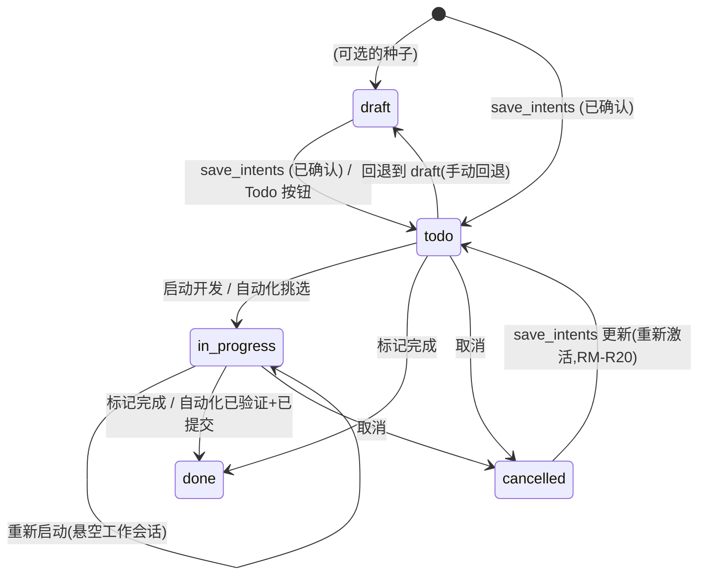

# intent-management — 领域规格

## 概览

intent-management 为 c3 提供**项目范围、跨会话的意图账本**。c3 的其余部分在会话层面运作
(prompt、gate、stream),而本领域捕获*用户想要构建什么*(针对某个项目),帮助将其细化,
并推动其进入开发。

它包含三个活动部件:

1. **账本** — 意图持久化在本地 SQLite 数据库(`~/.c3/c3.db`)中,以项目解析后的绝对
   工作区路径为键,每条记录带优先级、状态、内容,以及可选的项目内依赖关系。
2. **只读的意图沟通智能体** — 每个项目一个长生命周期的隐藏会话,读取项目材料、与用户
   对话,并提出离散、可验证的意图条目。它**永远不能**编辑、写入、运行命令、派生子智能体
   或调用斜杠命令(ADR 0007)。
3. **开始工作** — 将一条 `todo` 意图转化为一个运行可配置开发技能(系统设置中的 `devSkill`;
   默认为空 ⇒ 无前缀)的后台普通会话,并与该工作会话建立回链。
4. **自动化编排器** — 一个可选启用、按项目运行的后台循环,逐个开发被标记为 `automate`
   的意图(按优先级再按依赖顺序),依据工作会话的最后一条消息 + 工作树 diff 验证真实完成,
   提交并推送,然后继续下一条 — 任何异常结束都会以记录的原因停止(RM-A1–RM-A9)。

**范围:** 意图账本及其增删改查;只读沟通智能体及其 `save_intents` 确认;细化(在某一条目上
重启沟通);启动开发(后台、来自系统设置的可配置开发技能,默认为空);工作会话回链;
`draft→todo→in_progress→done/cancelled` 状态机;依赖记录与未满足依赖警告;将沟通会话从
普通列表中隐藏;每条意图的自动化标志与自动化编排器(完成判定、提交/推送、排序)。

**边界:** 本领域**不**定义智能体运行循环(agent-session)或权限流程(permission-gateway) —
两者均为复用。它不持有任何权限状态。**手动**启动开发从不会使意图自动完成(开发运行结束
不改变状态;由用户标记 `done`,RM-R9)。**自动化编排器**是唯一显式的、用户主动开启的例外:
只有在独立的完成判定器确认之后,且改动已提交并推送(RM-A5),它才会把某条意图标记为 `done`。

## 生命周期事件

一条意图在被创建、首次进入开发、达到 `done`、异常终止或被取消时,各发布一次进程内生命周期
事件。事件仅携带工作区、稳定的意图标识、标题、模块、阶段以及最终状态。它是尽力而为、
非持久化的,且从不重放。一次异常的自动化终止会发布 `failed`,即使账本中仍保持 `in_progress`;
这只是报告开发边界,而不改变意图状态。自动化可以消费一个事件,但绝不会修改意图,也不会
递归地再发出另一个生命周期事件。

## 核心实体

| 实体                                  | 说明                                                                                                                                             |
| ------------------------------------- | ------------------------------------------------------------------------------------------------------------------------------------------------ |
| Intent(意图)                          | 一条账本条目:`title`、`content`、`priority`(P0–P3)、`module`(模块名称)、`status`、`dependsOn[]`、`lastWorkSessionId`,以 `workspacePath` 为作用域 |
| Intent Dependency(意图依赖)           | 同一项目内一条有向的 `intent → depends-on` 边(仅用于展示 + 警告;v1 不做拓扑强制)                                                                 |
| Communication Session(沟通会话)       | 每个项目用于细化意图的隐藏智能体会话;是真实的 SDK 会话,但排除在普通列表之外(隐藏集)                                                              |
| Automation Orchestrator(自动化编排器) | 按项目运行的后台循环(每次一个),开发 `automate` 意图、判定完成、提交/推送并排序(RM-A1–RM-A9)                                                      |

见 [intent-management-models.md](intent-management-models.md)。

## 概念

- **项目键(path-key)。** 每一条 intent 和 communication-session 记录都以**解析后的绝对工作区
  路径**为键 — 与 session-registry 的工作区键、运行时 `workspacePath`、SDK 的 `cwd` 一致。
  所有入站的 `workspacePath` 在任何读写之前都会先 `resolve()`,从而保证账本、隐藏集过滤与
  `cwd` 始终一致(RM-R10)。
- **隐藏集。** 一个项目中从普通会话列表排除的会话 id 集合:所有 communication-session id
  与所有意图的 **spec-session** id。普通会话列表(`list_sessions`)会过滤掉它们,因此所有
  沟通会话 — 当前的与历史的 — 以及每条意图的 spec 会话都不会出现在侧边栏(RM-R4)。两者
  都是非用户工作会话,只能从意图视图进入(沟通会话经由意图聊天,spec 会话经由意图的 spec
  标签页),永远不会出现在侧边栏。
- **Spec 依赖上下文。** 在创建或重置 spec 会话之前,worktree 模式要求每个已知依赖在工作区
  主线上可用。一个未完成的依赖,或已完成但仍停留在无已合并 PR 的非主分支上的依赖,会阻止该
  动作;已合并的 PR、无分支的历史工作、主线分支以及缺失的历史记录均可放行。current-branch
  模式跳过此检查。检查通过后,会在会话开始前尽力刷新工作区分支;刷新失败会被记录但不阻塞
  编写。相应控件在规则未满足时保持禁用。
- **会话集合。** 每个项目持有多个沟通会话(不止一个)。每个项目有一个会话被标记为
  `isCurrent`,作为不带具体 `sessionId` 进入意图视图时的默认打开指针。可以通过扩展的
  `open_intent_chat { sessionId }` 消息显式切换会话,或通过 `list_intent_sessions` 列出。
- **意图优先级 / 需求级别。** `P0`、`P1`、`P2`、`P3` 之一(P0 最高)。
- **模块 / 模块名称。** 一个自由文本标签,命名意图所属的模块,由沟通智能体根据条目的
  标题/内容推断(例如:认证、会话、需求管理)。在提出时可选,未识别或对历史行为 `''`;
  为后续基于模块的组织/筛选/展示打下数据基础(RM-R14)。
- **自动化标志(`automate`)。** 每条意图一个、由用户切换的布尔值(默认为 `false`)。只有
  `automate` 意图才是自动化编排器的候选(RM-A1)。
- **自动化编排器。** 一个按项目运行的内存态后台循环。**资格:** 当 `automate` 且
  `status ∈ {todo, in_progress}` 且所有已知 `dependsOn` 条目均为 `done` 时,一条意图具备
  资格。它开发优先级最高(P0→P3,再按最早)的合格条目,首先在其 `lastWorkSessionId` 已在
  运行一个 turn 时**挂接**(一次 run 的生命周期长于其 turn — 不要重复运行/抢占;RM-A10),
  否则在会话仍存在于磁盘上时**恢复**它(继续半成品上下文),否则启动一个**全新**工作会话
  (可配置技能,默认为空 ⇒ 无前缀)— 一条 `todo` 条目或一个悬空会话,与手动启动相同的悬空
  规则(RM-R8)。**完成判定器:** 由于开发技能常是检查点驱动的,一个 turn 结束并不意味着
  "完成" — 一个全新的、无工具的判定器**主要根据工作会话最后一条助手消息**(它完成了什么)
  做决定,多仓库的 `git diff`/`git log` 证据作为**支持性证据,而非 `done` 的前提条件**,
  并返回 `done` / `in_progress` / `stuck`,按 **stuck → done → in_progress** 的顺序判定,
  不偏向于继续;证据为空本身从不意味着"未完成"(RM-A4)。**继续:** `in_progress` 会以
  continue 恢复同一会话,直到上限(清除检查点);该上限防止无限循环(RM-A8)。**权限对等:**
  开发 turn 期间的权限提示(包括非一致的 `AskUserQuestion`)行为**与手动会话完全一致** —
  运行**不会**被中止;它保持存活(`awaiting_permission`),提示被呈现到浏览器,由一位在场
  的人类在那里作答,之后 turn 继续;期间状态显示"等待授权"提示(RM-A9)。**人工决策守卫:**
  编排器仍保留一个独立的 `pendingQuestion` 守卫,使得一个已**结束**(被拆除)但缓冲区中带有
  未回答 `AskUserQuestion` 的 turn **永远不会**被自动继续 — 它会以记录的原因停止该意图
  (RM-A11)。**检查点共识覆盖:** 当多数表决开关开启时,一个 `stuck` 判定或悬置问题守卫
  可能改为触发一次关于是否通过检查点的多智能体投票(RM-A14) — 多数 `continue` 会覆盖停止,
  编排器自动继续,并在自动化状态上广播共识结果。

## 业务规则

| ID     | 规则                                                                                                                                                                                                                                                                                                                                                                                                                                                                                                                                                                                                                                                                                                                                                                                                                                                                                                                                                                                                                                                                                                                                                                                                                                                                                                                                                                                                                                                                                                                                                                                                                                                                                                                                                                                                                                                                                                                                                                                                                                                                                                                                                   |
| ------ | ------------------------------------------------------------------------------------------------------------------------------------------------------------------------------------------------------------------------------------------------------------------------------------------------------------------------------------------------------------------------------------------------------------------------------------------------------------------------------------------------------------------------------------------------------------------------------------------------------------------------------------------------------------------------------------------------------------------------------------------------------------------------------------------------------------------------------------------------------------------------------------------------------------------------------------------------------------------------------------------------------------------------------------------------------------------------------------------------------------------------------------------------------------------------------------------------------------------------------------------------------------------------------------------------------------------------------------------------------------------------------------------------------------------------------------------------------------------------------------------------------------------------------------------------------------------------------------------------------------------------------------------------------------------------------------------------------------------------------------------------------------------------------------------------------------------------------------------------------------------------------------------------------------------------------------------------------------------------------------------------------------------------------------------------------------------------------------------------------------------------------------------------------ |
| RM-R1  | 一条意图只属于一个项目,以解析后的绝对工作区路径为键。列表按单个项目划分;不存在跨项目的聚合视图。                                                                                                                                                                                                                                                                                                                                                                                                                                                                                                                                                                                                                                                                                                                                                                                                                                                                                                                                                                                                                                                                                                                                                                                                                                                                                                                                                                                                                                                                                                                                                                                                                                                                                                                                                                                                                                                                                                                                                                                                                                                       |
| RM-R2  | 沟通智能体是**只读**的。它可以使用只读类工具(Read/Grep/Glob/WebFetch/WebSearch,自动允许),也可以使用 `AskUserQuestion`(一个仅用于澄清的工具 — 允许,经用户答案注入路由,不涉及共识),但**永远不能**编辑、写入、运行命令、派生子智能体或运行斜杠命令。这在工具层强制执行,而非仅靠 prompt(ADR 0007)。                                                                                                                                                                                                                                                                                                                                                                                                                                                                                                                                                                                                                                                                                                                                                                                                                                                                                                                                                                                                                                                                                                                                                                                                                                                                                                                                                                                                                                                                                                                                                                                                                                                                                                                                                                                                                                                        |
| RM-R3  | 沟通会话运行在**强制 `default` 权限模式**下,无论系统默认模式为何。它不响应 `set_mode`,意图视图也不渲染模式选择器。这是一个**辅助性**约束,而非静默保存防御的全部:一条厂商侧的允许规则即使在 `default` 模式下也可能预先批准 `save_intents` 并跳过权限网关,因此保存确认是在保存处理器内部强制执行的(RM-R5),对每一种预先批准的绕过途径都免疫。                                                                                                                                                                                                                                                                                                                                                                                                                                                                                                                                                                                                                                                                                                                                                                                                                                                                                                                                                                                                                                                                                                                                                                                                                                                                                                                                                                                                                                                                                                                                                                                                                                                                                                                                                                                                             |
| RM-R4  | 每个项目至多有一个 **`isCurrent`**(默认打开)的沟通会话。**所有**沟通会话(当前的与历史的)**以及每条意图的 spec 会话**都在隐藏集中,**永远不会**出现在普通会话列表中 — 两者都是非用户工作会话,只能从意图视图进入,而非侧边栏。不带 `sessionId` 进入意图视图会重新加载该项目的`isCurrent` 会话(历史 + 实时流)。带具体 `sessionId` 进入会打开该会话,并将其设为新的`isCurrent`。可以通过 `list_intent_sessions` 列出会话,通过 `rename_intent_session` 重命名,通过 `delete_intent_session` 物理删除(行 + 运行时移除;删除 `isCurrent` 会话会把最近的剩余会话提升为 `isCurrent`)。所有会话的隐藏集成员关系不变 — 隐藏集查询仍会返回每一行。一条意图的 spec 会话仅在列表中隐藏;它仍可从该意图的 spec 标签页打开,在创建、运行、状态上不受影响。                                                                                                                                                                                                                                                                                                                                                                                                                                                                                                                                                                                                                                                                                                                                                                                                                                                                                                                                                                                                                                                                                                                                                                                                                                                                                                                                                                                                                    |
| RM-R5  | 一条意图只通过 `save_intents` 写入账本,该操作会呈现一次人工确认。这个确认是**由保存处理器自身**发起的(它为 `mcp__c3__save_intents` 发出 `permission_request` 线协议帧,阻塞等待决定,只有在允许时才持久化)— **不是**仅靠 `canUseTool` — 因此一个绕过 `canUseTool` 的厂商预批准(一条允许规则或非 `default` 模式)仍会触发提示。两个厂商(claude 进程内 MCP、codex HTTP MCP)共享这一个由处理器持有的网关;意图网关将 `save_intents` 直接放行到处理器,绝不能为其再次弹出提示(重复提示是一种回归)。允许 → 处理器写入;拒绝 / 取消 / 中止 → 什么都不写入,并告知智能体它被拒绝了。                                                                                                                                                                                                                                                                                                                                                                                                                                                                                                                                                                                                                                                                                                                                                                                                                                                                                                                                                                                                                                                                                                                                                                                                                                                                                                                                                                                                                                                                                                                                                                                 |
| RM-R6  | 新保存的意图以 `todo` 状态起步,作用域为当前项目路径。                                                                                                                                                                                                                                                                                                                                                                                                                                                                                                                                                                                                                                                                                                                                                                                                                                                                                                                                                                                                                                                                                                                                                                                                                                                                                                                                                                                                                                                                                                                                                                                                                                                                                                                                                                                                                                                                                                                                                                                                                                                                                                  |
| RM-R7  | **细化**为某一条意图重启沟通会话:启动一个全新的沟通会话,并以携带该意图 id、标题、内容的首条消息作为种子。它不改变该意图的状态。                                                                                                                                                                                                                                                                                                                                                                                                                                                                                                                                                                                                                                                                                                                                                                                                                                                                                                                                                                                                                                                                                                                                                                                                                                                                                                                                                                                                                                                                                                                                                                                                                                                                                                                                                                                                                                                                                                                                                                                                                        |
| RM-R8  | 当意图为 `todo`,或 `in_progress` 且带有悬空(已删除)的 `lastWorkSessionId` 时,允许**开始工作**。手动 `start_development` 首先同步地在一个进程内的单进程启动集中认领该意图 id;在认领期间,同一意图的另一次手动启动会返回一个开发启动进行中的错误,且不会创建 worktree 或启动运行。当工作会话成功关联(`lastWorkSessionId` + `in_progress`)时释放认领,并在每一条启动失败/发起前拒绝路径上释放,以便重试不会被永久阻塞。它会启动一个**运行可配置开发技能**(`devSkill`;默认为空 ⇒ 无)的**后台普通会话**,携带意图内容 — 开发技能按 RM-R25 交付(斜杠命令形式的 `devSkill` 搭乘不回显的用户 turn)— 设置状态为 `in_progress`,并记录`lastWorkSessionId`。**Git 分支模式(2026-06-10):** 工作区的 `gitBranchMode` 设置决定开发智能体在哪里运行 — 在 `worktree` 模式下,服务端在 c3 主目录的 worktrees 区域下创建(或幂等地复用)一个隔离的 git worktree,以项目和意图 id 为键,从 `defaultMainBranch` 设置分支出来(未设置时回退到项目当前的 HEAD),工作会话的工作目录就是该 worktree 路径;在`current-branch` 模式(默认值,也是任何缺失/未知值的回退)下,**不**创建 worktree,智能体就地在项目检出的当前分支上开发(工作目录 = 项目路径)。**启动前拉取最新代码(2026-06-20):** 工作会话必须基于最新代码构建,worktree 也不例外。在 `worktree` 模式下,服务端从仓库的远程(`origin`,否则第一个远程)`git fetch` 基础分支,并将新 worktree 的根定位在刚刚拉取到的远程尖端(`<remote>/<base>`,用 `git worktree add --no-track` 创建,这样意图分支永远不会把基础分支当作 upstream);当没有远程或 fetch 失败(离线/分支缺失)时,回退到本地基础分支 — fetch 从不合并,因此永远不会阻塞。在 `current-branch` 模式下,服务端在开发前对当前分支做快进(`git pull --ff-only`)。失败策略是**区分对待**的:无远程 / 无upstream / 网络错误 ⇒ 尽力**跳过**(仅本地或离线的工作区仍会启动);一个相对其 upstream已**分叉**(非快进)的分支 ⇒ **硬停止** — 服务端从不自动合并或自动变基用户的分支,因此拒绝启动并返回一个拉取失败错误(手动 `start_development` 同时释放进行中的认领;自动化编排器将其呈现为一次自动化失败),告知用户先自行协调。工作会话是一个普通会话,出现在侧边栏中 — 打上绑定时间戳,使其排在**最上方**,且(对于无连接的自动化编排器)在绑定/结束时向每个连接扇出,因此无需手动刷新即可实时出现(SR-R13)。 |
| RM-R9  | 开发运行结束**不会**改变意图状态(不自动完成)。用户从列表中手动将其标记为 `done` 或`cancelled`。**例外:** 在进入意图视图(`open_intent_chat`)时,服务端会协调每一条`in_progress` 意图;一个进程已死、且完成判定器根据最后 3 条助手消息确认为 `done` 的工作会话会被**自动**标记为 `done` — 即使是手动启动的运行也不例外(RM-R18)。这个协调型自动`done` 是自动化编排器之外唯一的自动 `done` 路径(RM-A5)。                                                                                                                                                                                                                                                                                                                                                                                                                                                                                                                                                                                                                                                                                                                                                                                                                                                                                                                                                                                                                                                                                                                                                                                                                                                                                                                                                                                                                                                                                                                                                                                                                                                                                                                                                     |
| RM-R10 | 每一个入站的 `workspacePath` 在任何账本读写或隐藏集过滤之前都会先 `resolve()`,与工作区键 /运行时 `workspacePath` / SDK 的 `cwd` 保持一致。                                                                                                                                                                                                                                                                                                                                                                                                                                                                                                                                                                                                                                                                                                                                                                                                                                                                                                                                                                                                                                                                                                                                                                                                                                                                                                                                                                                                                                                                                                                                                                                                                                                                                                                                                                                                                                                                                                                                                                                                             |
| RM-R11 | 带着一个或多个**未满足的依赖**(某个 `dependsOn` 条目未 `done`)启动开发会**警告**但不阻塞 —用户可以继续。                                                                                                                                                                                                                                                                                                                                                                                                                                                                                                                                                                                                                                                                                                                                                                                                                                                                                                                                                                                                                                                                                                                                                                                                                                                                                                                                                                                                                                                                                                                                                                                                                                                                                                                                                                                                                                                                                                                                                                                                                                               |
| RM-R12 | 如果账本(SQLite)不可用,意图相关功能按入口点降级(意图消息返回 `error`;普通列表**不**被过滤),c3 仍能启动并服务普通会话。                                                                                                                                                                                                                                                                                                                                                                                                                                                                                                                                                                                                                                                                                                                                                                                                                                                                                                                                                                                                                                                                                                                                                                                                                                                                                                                                                                                                                                                                                                                                                                                                                                                                                                                                                                                                                                                                                                                                                                                                                                 |
| RM-R13 | 工作会话回链会打开 `lastWorkSessionId` 会话(复用 `select_session`)。如果该会话已不存在,用户会得到一个友好的提示(带重启/取消选项),而非崩溃。                                                                                                                                                                                                                                                                                                                                                                                                                                                                                                                                                                                                                                                                                                                                                                                                                                                                                                                                                                                                                                                                                                                                                                                                                                                                                                                                                                                                                                                                                                                                                                                                                                                                                                                                                                                                                                                                                                                                                                                                            |
| RM-R14 | 每条意图都带一个 `module`(模块名称)。沟通智能体从条目的标题/内容**推断**它(方案 a;未来可扩展到项目的模块结构),并将其随每个条目一并传给 `save_intents`;缺失/空白的 `module`持久化为 `''`(智能体从不会因此被阻塞)。账本列是 `TEXT NOT NULL DEFAULT ''`;旧数据库通过幂等的 `ALTER TABLE … ADD COLUMN` 迁移(schema v1→v2),历史行默认为 `''`(不回填)。所有读路径都返回 `module`。这一数据基础被 RM-R16(列表展示)消费;基于模块的筛选仍不在范围内。                                                                                                                                                                                                                                                                                                                                                                                                                                                                                                                                                                                                                                                                                                                                                                                                                                                                                                                                                                                                                                                                                                                                                                                                                                                                                                                                                                                                                                                                                                                                                                                                                                                                                                           |
| RM-R16 | 意图列表将每个条目的 `module` 渲染为一个居于日期前缀与标题之间的中性药丸标签。空白的 `module`(`''`)不渲染任何内容 — 无占位符,不破坏布局;该标签不会收缩,并带有最大宽度 + 省略号,使得一个很长的模块名永远不会挤压标题。仅用于展示;不影响排序或过滤。                                                                                                                                                                                                                                                                                                                                                                                                                                                                                                                                                                                                                                                                                                                                                                                                                                                                                                                                                                                                                                                                                                                                                                                                                                                                                                                                                                                                                                                                                                                                                                                                                                                                                                                                                                                                                                                                                                     |
| RM-R15 | **代码 + 测试 + 配套文档是同一条意图(一个目标从不拆分)。** 当一个目标同时涉及代码及其测试和/或配套文档(spec / README / 注释)时,沟通智能体会把测试同步与文档同步工作折叠进**同一条**意图的内容 + 验收要点中 — 它**不得**另外发出一条独立的「更新测试」或「文档更新」意图。代码、其测试与其文档是同一次改动,保留在同一个工单上,这样就不会有一半被单独排期或遗漏(那样会使测试/文档偏离代码而失步)。仅由 prompt 引导强制执行(无工具层检查)。                                                                                                                                                                                                                                                                                                                                                                                                                                                                                                                                                                                                                                                                                                                                                                                                                                                                                                                                                                                                                                                                                                                                                                                                                                                                                                                                                                                                                                                                                                                                                                                                                                                                                                               |
| RM-R17 | **一个 `save_intents` 批次可以声明对同批次内其他条目的依赖。** 每个提议的条目除了 `dependsOn`(**已存在**意图的 id)之外,还可携带一个可选的 `dependsOnIndexes`(指向**同一批次**条目的0-based 索引)。同批条目的 id 在提议时尚不存在,因此批次内的先后关系只能用索引来指代。保存路径**预先**为每一行铸造 id,然后把每个索引解析为同批条目的真实 id 并写入 — 与 `dependsOn`合并去重后 — 落入依赖边,全部在一个事务内完成。**校验(原子拒绝):** 一个越界索引、一个自引用,或批次内边构成的环,都会在**任何写入之前**失败,因此整个批次被拒绝,保存返回一个错误结果(不会半途写入);既有 id 的 `dependsOn` 行为不变(跨批次的环是不可能的 — 全新的行还没有任何其他东西引用其 id)。**稳定的次级顺序:** 一个批次的行会以按索引偏移的创建时间打上时间戳,这样同优先级、无依赖的条目在编排器的最早优先并列判定(RM-A3)中保持一个确定的提交顺序排名,而非任意顺序。沟通智能体被提示,只要批次内存在先后关系就要**主动填写 `dependsOnIndexes`**(prompt 引导;校验是工具层的守卫)。                                                                                                                                                                                                                                                                                                                                                                                                                                                                                                                                                                                                                                                                                                                                                                                                                                                                                                                                                                                                                                                                                                                                                                                                  |

| RM-R19 | **沟通智能体拥有两个只读的账本查询工具。** 除 `save_intents` 之外,`c3` 进程内 MCP 服务器还暴露 `find_intents`(按 `keyword` 搜索**本项目**的意图 — 对标题/内容做模糊 `LIKE`,通配符已转义 — 和/或按 `module`/`status` 搜索;返回一个精简的 `id`/`title`/`module`/`priority`/`status`/`dependsOn` 列表)与 `view_intent`(按 `id` 查看一条意图的完整详情;未知或跨项目的 id 返回一个友好的未找到提示,而非报错)。两者均为**只读**且在工具闭包中**绑定项目**(智能体永远无法读取另一个项目的账本 — `view_intent` 按 id 取出一条意图后会守卫它属于绑定的项目)。意图网关对两者都**自动允许**(不需确认),不同于仍会弹出提示的 `save_intents`;两者都常驻在 turn-1 的 prompt 中,因此智能体无需再去搜索它们。prompt 指引智能体在拆分新条目或设置 `dependsOn` 之前**先搜索账本**,以复用相关条目、避免重复,并引用正确的既有 id。(ADR 0007。) |
| RM-R18 | **进入时的意图协调(`open_intent_chat`)。** 每当一个客户端进入意图视图,服务端都会协调该项目的 `in_progress` 意图 —— 对照进程表检查每个 `lastWorkSessionId`,当进程已死(服务端重启、崩溃、正常退出)时,加载该会话最后 3 条助手消息并运行完成判定器。**存活检查:** 一个仍在运行的工作会话产生派生的 `runStatus = 'running'`(追踪中)。**判定 `done`:** 自动完成:提交并推送(`feat: <title>`)并将该意图标记为 `done` —— 对手动启动与自动化启动的意图**都**适用。这是对 RM-R9 不自动完成规则的一个显式的、已记录的例外,专门针对进程死亡的情形。**判定`in_progress` / `stuck`:** 让意图保持 `in_progress` 并将 `runStatus` 设为 `'dangling'`。**无 `lastWorkSessionId`:** 同样为 `dangling`。协调结果反映在 `intents` 消息负载中(每条意图都携带其 `runStatus`)。当有任意意图被自动完成时,会跟随一次意图刷新推送,以便其他连接看到更新。 |
| RM-R20 | **`save_intents` 是一次 upsert — 带 `id` 的提议条目会原地更新那条既有意图,而非插入。**整个批次在**一个事务**中处理,所有校验都在**任何写入之前**完成(原子拒绝 — 不会半途写入,与 RM-R17 呼应):(a) `id` 必须能解析到**本项目**内的一条意图(不存在或跨项目的 id 会以一个错误结果拒绝整个批次);(b) 目标必须**按状态可修改** —— `draft`/`todo` 保持其状态,`cancelled` 会**被重新激活为 `todo`**(`completedAt` 保持为 null),而 `in_progress`/`done`是**不可变的**(批次会被拒绝,并带有清晰的「正在开发 / 已完成,不可修改」消息);(c) 更新时,`title`/`content`/`priority` 会被写入,`module` 只在提供时才更新(否则保留原值),依赖集合只在提供了 `dependsOn` 或 `dependsOnIndexes` 时才被替换(两者都省略则保留既有依赖)。**没有**`id` 的条目按 RM-R6 作为 `todo` 插入。单个批次可以**混合**更新与插入;`dependsOnIndexes`(RM-R17)会针对整个批次解析,因此一个被索引引用的同批条目本身也可能是一个更新目标。**细化的串通(RM-R7):** `refine_intent` 用原始意图的 id 作为种子启动沟通会话,prompt 指示智能体在保存时填上该 `id`,使被细化的意图更新其原始条目而非产生重复(如果原条目已经是`in_progress`/`done`,则告知用户无法修改)。已弃用的 `save_requirements` 别名共享同一套schema/handler,并继承 upsert 行为。 |
| RM-R24 | **重置意图 / spec 会话 —— 启动一个以内容为种子的全新会话,摆脱一个已陷入上下文腐化的旧会话。**在一条意图(或其 spec)发生变化之后,与之关联的细化 / spec 编写会话中的对话可能已经过时。意图详情将其展示为**我要修改**,而非一个标签页局部的重置:头部动作重置意图/细化会话,spec 文档标签页动作重置 spec 编写会话。两者都会打开同一个受控的输入对话框(ConfirmDialog 风格,**不是** `window.confirm`;非空前确认按钮禁用)→ 确认后启动一个**全新**会话,以用户输入的内容**拼接**相关的当前内容作为种子,并**替换**相应的关联会话 id。意图/spec 会话标签页本身**不**渲染重置按钮。**`reset_intent_session`** 镜像 `refine_intent`(RM-R7):一个全新的 `'intent'`运行时,其首条 prompt 把用户输入前置于该意图当前的标题 + 内容之前,并登记 pending→intent链接,使 `run:bound` 在首次绑定时用真实 id 替换 `intent_session_id`。**`reset_spec_session`**镜像 `write_spec`(RM-R21)但**复用既有的 spec 目录/路径**(不做脚手架):它启动一个全新的**写入受限**的 `'spec'` 会话(携带与首个 spec 会话相同的两个只读账本查询工具,RM-R27),以用户输入 + 指向当前 `spec_path` 的指针为种子(**仅路径** —— 智能体自行读取 spec 文件;prompt 不再内联 spec 正文),回复 `session_selected` 使 spec 会话标签页切换到新会话,并登记pending→intent 链接使 `run:bound` 在首次绑定时替换 `spec_session_id`。当从未写过 spec(`specPath` 为空)时,`reset_spec_session` 会被**拒绝**。Claude 使用 spec 权限网关做写入受限;Codex 使用 RM-R21 中的驱动沙箱边界,因此当该边界可以建立时,Codex spec 智能体不会被拒绝。服务端不再预读 spec,因此其可读性不是启动的前提条件 —— 一个缺失/不可读的 spec 会成为智能体读取该路径时遇到的一个普通文件错误。重置**不是**删除:先前的会话仍可在 Works(运行中心)下查询,只是不再是该意图的关联会话。没有批量重置。对话框文案走 i18n。 |
| RM-R23 | **SDD 感知的启动 —— 服务端强制的审批网关 + spec 注入 + 工作会话指令。** 当工作区的 SDD总开关(`sddEnabled`)开启时,`start_development` 会**在服务端**强制执行审批检查点,而不仅仅是隐藏客户端按钮(RM-R22):启动一条 spec **尚未获批**(`specApproved` 为 false)的意图会被**拒绝**,返回一个 spec-未批准错误,且**不会**启动任何运行(进行中的认领会被释放,以便重试不被阻塞)。当 SDD 开启且网关通过时,工作会话的第一个 turn 会被塑形,使其以 spec 驱动的方式工作,拆分到 RM-R25 的各交付通道中:(a) **可见的 turn** 携带意图的 `title` + `content` +`依赖需求` 提示,当存在 spec 路径时,还有一条**指向 spec 路径的提示**,把智能体引向该意图已批准的 `spec.md`(在集中化 spec 根目录中的**绝对**路径,因为它位于工作区之外),作为唯一的真相来源(Spec is Truth;出现分歧时反向同步)—— spec 路径提示属于业务上下文,因此保持可见;(b) 当**未配置 `devSkill`** 时,**SDD 工作会话指令** —— 一条固定(非 i18n)指令,装配spec 驱动、检查点治理的工作契约(Spec is Truth、先复述、执行前设检查点、以证据为完成依据、反向同步、通过工具提问,加上明确的暂停并交还条件)—— 会作为模型的**系统上下文**交付,**不是**可见 turn,因此永远不会渲染为一条可见的聊天消息;(c) 一个已配置的 **`devSkill`** 是一条斜杠命令,并且**优先于**该指令(两者绝不叠加)—— 它搭乘模型的**用户 turn**(斜杠命令唯一能展开的位置),但仍被排除在可见回显之外。当 SDD **关闭**时,可见的 turn 与历史形态逐字节一致(`title` + `content` + `依赖需求` 提示);一个已设置的 `devSkill` 仍会搭乘不回显的用户turn —— 没有网关、没有 spec 提示、没有指令。 |
| RM-R22 | **批准 spec —— 人工审批检查点,以及 SDD 感知的四态意图动作按钮。** 意图详情的主动作按钮会渲染四种状态之一,针对 `todo` 意图,根据工作区的 SDD 总开关(`sddEnabled`)加上该意图的`specPath` / `specApproved` 决定:(1) **SDD 关闭** ⇒ `开始工作`;(2) **SDD 开启且 `specPath`为空** ⇒ `编写 Spec`(RM-R21);(3) **`specPath` 已设置且 `specApproved` 为 false** ⇒`批准 Spec`,但该头部动作只会打开 spec 文档标签页并读取该 spec;(4) **`specPath` 已设置且`specApproved` 为 true** ⇒ `开始工作`。工作区的 `sddEnabled` 会搭乘每一次意图列表广播,使按钮无需单独一次设置拉取即可解析其状态。真正的 `approve_spec` 调用只能从 spec 文档标签页的**批准**动作触及,因此用户是从文档界面而非全局头部批准的。既有的、`编写 Spec` 之后 10 秒的反误批准网关同样适用于该 spec 标签页的批准动作,而不适用于头部快捷方式。`approve_spec` 是把关进入开发的人工审批检查点 —— SDD 存在的理由:它设置 `spec_approved=true` 并将**批准用户**(当前登录 subject)记录到 `spec_approve_user`,然后重新广播列表。批准是**单人确认** —— 本期没有多签,也没有撤销批准(撤销批准可能在之后跟进)。`approve_spec` 要求已编写好的 spec:批准一条 `specPath` 为空的意图会被**拒绝**(一个防御性的服务端守卫 —— UI 在 spec 存在之前从不提供 spec 标签页的批准操作)。批准本身**不会**启动开发;它只是清除检查点,使按钮前进到`开始工作`。所有按钮文案都走 i18n。 |
| RM-R21 | **编写 Spec —— 质量门输出步骤,把一条意图转化为一份受限的、可审阅的 spec 文档。**`write_spec` 在**固定的、集中化的 spec 根目录**下搭建一个按日期命名的 spec 目录 ——`<c3 home>/doc/<project-path-segment>`(按项目隔离,从**所属工作区路径**确定性推导,使得该项目的所有 worktree 共享同一套 spec 集;**不可**由用户配置,也**不**提交到 Git):`<spec-root>/yyyy/mm/dd/yyyy-mm-dd-<NNN>-<slug>/spec.md`,其中 `<slug>` 是该意图的`shortEnTitle` 做 slug 化处理(转小写、非字母数字字符折叠为单个连字符、去首尾;标题为空或非 ASCII 时回退到意图 id 前缀),`<NNN>` 是一个 3 位的按天序号(该天根目录下已有的最大编号加一,没有则为 `001`)。服务端只用 `intent_id`、`title`、`created` frontmatter、一个标题和该意图的引用来**播种** `spec.md` —— 没有文档级别的 `status`,也没有固定的章节骨架 —— 并会**立即回填**该意图的 spec 路径(存储的 `spec_path` 是集中化位置的**绝对**路径),因此即使编写运行失败,spec 也已经存在。spec 编写的系统指令还禁止添加一个 frontmatter 或文档头部的`status` 标签:批准是一个系统层面的网关,永远不会把文档状态写回,因此这样的标签会是过时的。spec 是以控制台显示语言,为其**第一读者(用户)**而写的;开发智能体是第二读者。它以可观察的改动、其边界、需要确信的决策以及验证方式开篇;一位评审者无需阅读代码库即可批准或拒绝它。它的结构与实际影响成正比:一个聚焦于单一表面、没有契约、持久化数据、迁移、安全或跨领域影响的改动,只有一个 2–4 句的改动摘要、行为与边界,以及具体的验证方式(通常 8–20 行);一个普通改动只额外加入相关方法、受影响的能力/契约与边界;一个契约/数据/迁移/安全/跨领域或其他高风险的改动还会记录决策/权衡、兼容性/迁移与失败处理。它从不重复该意图的 Why/What/非目标/验收,除非是把某个验收项转化为一个可观察的验证条件,也从不创建空标题。Spec 用领域语言描述能力与契约,而非源码路径、符号或逐文件的改动。实现交接是可选的,只在需要时紧随验证之后;它给出技术边界与顺序,不含代码标识符。随后它会在已配置的 spec 智能体(`specAgentId`;为空 ⇒跟随默认智能体)上启动一个**spec 编写会话**,其职责**仅限于编写 spec,不改动代码**:该会话**写入受限于 spec 目录** —— 针对任何其他路径的写入类工具都会被拒绝(即便 spec 目录本身位于项目树**之外**),项目其余部分为只读 —— 且 shell / 子智能体 / 斜杠命令工具都被阻断。spec 编写契约 —— Spec-is-Truth、五维度的 Spec 自检(完整/一致/可验证/有边界/可追溯)、写入受限,以及在有歧义时通过工具提问 —— 作为 spec 智能体的**系统上下文**交付,**不会**在可见的启动 turn 中重述(RM-R25);可见的 turn 只携带业务上下文(是哪条意图 + 其正文,以及要写的交付文件)。当会话绑定后,其 id 会被回链到该意图,作为它的 **spec 会话**。写入受限因厂商而异,但都在模型能行动之前强制执行:Claude 使用带 `rt.specDir` 的路径级permission-gateway 机制,而 Codex 使用驱动沙箱边界 —— cwd 被移动到集中化的 specs 根目录,强制 `workspace-write` + `approval_policy=never`,并通过 `--add-dir` 传入 specs 根目录,使项目树、账本数据库以及其他非 specs 根目录路径都在可写根目录之外。如果 Codex 边界无法建立,启动会 fail closed,而不是回退到一个项目可写的 cwd。权限范围复用了自动化预先配置的理念(提前声明允许/拒绝),但由厂商执行边界强制执行,而不仅仅是工具名 prompt 文本。 |
| RM-R25 | **内部系统指令 vs 可见会话内容 —— 这条边界统一适用于意图 / spec / 工作会话,并跨越每一个厂商。** 一个 turn 的文本分为两类。**内部系统指令**(约束模型如何行动 —— 其角色、能力/权限边界与工作方法):沟通智能体的只读分析师角色;spec 编写契约(Spec-is-Truth、五维度自检、写入受限、通过工具提问);工作会话的开发技能与 SDD 工作会话指令。**可见的业务上下文 / 用户输入**(用户会识别为主题数据或自己话语的内容):用户提交的每一条消息、意图正文(标题 + 内容)、依赖提示、spec 路径提示(工作会话与 `reset_spec_session` 的 prompt 都只把智能体指向 spec 的路径;两者都不内联 spec 正文),以及用户在重置会话时输入的文本。规则:内部系统指令通过模型的**系统上下文**到达,**永远不会**渲染为一条可见的聊天消息 —— 不作为 `user_text`,也不作为任何其他可见区块,无论是在实时流、历史基线,还是重连回放中 —— 覆盖启动 turn 与之后的每一个turn;可见的业务上下文 / 用户输入保持其既有的可见性与顺序,文本不变。唯一的载体例外是斜杠命令形式的开发技能:一条斜杠命令只有在引领模型的用户 turn 时才会展开,因此它不能存在于系统上下文中 —— 它搭乘用户 turn(保留其执行语义),但仍被排除在客户端回显之外,因此客户端永远看不到它。能力/权限边界**不**依赖这种可见性:只读锁(ADR 0007)与 spec 写入受限(RM-R21)在工具/路径层强制执行,无论是否展示任何指令。此变更只影响新产生的会话与 turn;既有历史不会被迁移、改写或隐藏。 |
| RM-R27 | **spec 编写会话拥有两个只读的账本查询工具 —— 且仅有这两个,只读、绑定项目、不能保存,在 Claude 与 Codex 的 spec 智能体上都是如此。** `write_spec` / `reset_spec_session` 会话(RM-R21 / RM-R24)携带与沟通智能体相同的 `find_intents` / `view_intent` 工具(RM-R19):`find_intents` 搜索**本项目**的意图(关键词 / 模块 / 状态 → 精简列表),`view_intent` 按 id读取一条意图的完整详情(未知或跨项目的 id 返回一个友好的未找到提示,而非报错)。它们让 spec作者可以**依据同一项目内的既有意图来锚定或澄清 spec**。边界:(a) **只读** —— spec 会话**永远不会**被赋予 `save_intents`,因此它无法创建或更改任何意图;(b) **在工具闭包中绑定项目** —— 它永远无法读取另一个项目的账本(`view_intent` 会守卫取出的意图属于绑定的项目);(c) **纵深防御** —— spec 会话的 `c3` MCP 服务器只注册恰好这两个工具(主线),并且 spec 权限网关的读通过集合是一个**显式的**只读并集(内置只读工具 ∪ 这两个查询工具),因此即便`save_intents` 有一天被误注册或被厂商预批准,也会落到**默认拒绝**(不同于让保存直通到自身处理器确认的意图网关);(d) **厂商传输拆分** —— Claude 收到进程内 SDK MCP 服务器,而 Codex收到回环 HTTP MCP 服务器,其 `enabled_tools` 由同一个双工具集合派生;两种传输都不注册`save_intents`。两个工具都常驻在 turn-1 的 prompt 中(无需先做一次 ToolSearch 往返)。由于`write_spec` 与 `reset_spec_session` 都通过**同一条**启动路径(一个 spec-profile 工厂)配置 spec 会话,一个**重置**的 spec 会话会得到完全相同的两个工具 —— 该能力在重置后仍然存在。(ADR 0007。) |
| RM-R26 | **手动工作会话结束后的 Git/PR 清理 —— 在手动启动的工作会话结束时关闭 Git/PR 循环,不触碰状态机。** 一条意图携带五个 Git/PR 追踪字段:`branchName`、`latestCommitHash`、`prId`、`prUrl`(可点击的 PR/MR 链接)和 `prStatus`(`reviewing`/`rejected`/`failed`/`merged`)。当一个**手动启动**(`start_development`,而非自动化编排器)的工作会话结束时 —— 无论出于**任何**原因:正常完成、出错,还是用户终止 —— 服务端都会运行一次会话结束清理。**来源区分:** 一个会话只有在项目的编排器正在主动驱动这一条意图时才被视为自动化拥有(此时它自行提交/推送,RM-A5);其他每一个结束了的、与意图关联的会话都是手动的,并在此处被清理 —— 两者互斥。清理从不在会话中途运行,只在结束之后,且从不改变意图状态(不自动 `done`;RM-R9 依然成立 —— `reviewing`是一个 PR 状态字段,与该意图自身的 `todo`/`in_progress`/`done` 相互独立)。**分支模式派发:**在 `worktree` 模式下,清理总是针对该意图的 worktree 运行;在 `current-branch` 模式下,清理**只在当前分支不同于工作区的 `defaultMainBranch` 时**运行 —— 在主分支上,清理是一次**正常的成功跳过**(不提交/推送/建 PR/MR,不写入任何 PR 字段,**没有**失败消息)。**顺利路径(存在改动):** 提交(`feat: <title>`)→ 推送该分支 → 通过感知代码托管平台的变更请求能力创建一个 PR/MR。显式的工作区 `forge` 值 `github` 和 `gitlab` 会覆盖仓库来源检测;`auto`(或未设置)保留检测。GitHub 使用 `gh`;GitLab 使用 `glab`。清理随后回写`branchName`、推送后的 `latestCommitHash`、`prId`、`prUrl` 以及 `prStatus = reviewing`。**幂等的再次清理:** 一条已经有 PR/MR 的意图不会被重新创建 —— 清理会提交/推送并刷新`latestCommitHash`,但保持 PR 字段不变。**显式失败(绝不伪造成功):** 当清理本应运行但无法完成时 —— **没有可提交的改动**(视为一次失败,而非静默跳过)、提交/推送失败(鉴权、被拒、网络、冲突)、所选的代码托管平台 CLI **不可用或未登录**,或 PR/MR 创建失败 —— 它会**显式失败**,并推送一条**工作台等待用户介入的待办**(来源 `intent`,通过一个 UI 错误码携带本地化消息)要求用户处理。失败时它**永远不会**设置 `prStatus = reviewing`,也**永远不会**写入一个错误的/占位的 `prId`/`prUrl`;真正成功的步骤会被如实记录(例如提交+推送成功但 PR/MR 创建失败 ⇒ `latestCommitHash` 被写入,PR 字段保持为空)。同一意图先前的清理待办会在再次尝试之前被清除(重跑时自愈)。清理**不会**自动合并 PR/MR、解决冲突、配置凭据,也不会重试 —— 那些留给用户。不会引入一个与 `latestCommitHash` 重复的新 `commit_hash` 字段。 |
| RM-R28 | **对处于评审中的意图做一次性的 PR/MR 状态同步。** 一条 `prId` 非空且 `prStatus='reviewing'`的 `done` 意图,会在详情头部和 Git/PR 元数据中暴露 `sync_intent_pr_status`。服务端在查询已配置的代码托管来源之前,会先校验工作区所有权及这些确切的前置条件。GitHub 使用`gh pr view <id> --json state,mergedAt,url`;GitLab 使用 `glab mr view <id> --output json`;在来源检测之前,先尊重显式的工作区 `forge` 覆盖。如果代码托管平台确认已合并,只有 `pr_status`和 `updated_at` 会被更新为 `merged`;如果确认已关闭,`pr_status` 可能变为 `closed`,但这不被视为已合并。同步从不改变 `status`、`completed_at`、`branchName`、`latestCommitHash`、`prId`或 `prUrl`,也从不从 `prUrl` 或分支名推断状态。缺失 PR、非 `done`、非 `reviewing`、CLI/鉴权/查询失败,或未知状态都会返回可理解的反馈,且不会写入 `merged`。当手动启动/spec 网关或自动化发现 worktree 依赖只是被未确认的依赖 PR/MR 状态阻塞时,c3 会为这些依赖 PR/MR 启动一次尽力而为的一次性后台同步,完成后广播意图,并让下一次用户操作或自动化重新检查应用刷新后的资格。这不是轮询、webhook 处理、自动合并,也不是一个完整的 PR 评审/检查面板。 |
| RM-R29 | **模型 `update` 事件触发的 PR 状态复位。** 模型执行自己的 push / `gh pr edit` / 重新打开等操作,来修改重提一个被打回(`rejected`/`failed`)或关闭(`closed`)的 PR,然后通过 `publish_event` 发布一个 `type='pr:operation'`、`update`/`success` 的通用事件(落在单一 `'event'` 总线 topic 上)。一个**常驻的意图领域消费者** —— 注册在 `run-domain-subscriptions.ts` 中,**独立于**自动化派发(`dispatchEventTriggers`)与自动化 store 的可用性 —— 订阅 `'event'`、先判别 `event.type==='pr:operation'` 并从 `metadata.operation`/`status`/`data.association.intentId` 投影后消费该事件:当事件携带`association.intentId`,该意图存在且属于事件所在的工作区,且其 `prStatus` ∈{`rejected`,`failed`,`closed`} 时,消费者把 `prStatus` 复位为 `reviewing`,追加一条`pr_updated` 生命周期日志(actor 为 `automation`),并广播账本。`merged` 是一个真正的终态,**永远不会**被复位;`reviewing`/`null`/其他状态、缺失的 `intentId`、未知意图、跨工作区的`intentId`,以及任何非 `update`/非 `success` 的事件都会被**静默忽略** —— 不会向模型返回错误(发布本身已经成功),不记日志,不广播。一个重复的 `update`/`success` 事件天然是幂等的:第一次复位为 `reviewing`,后续的都是空操作,因为状态已不再可复位。c3 **不会**执行 PR 操作,也**不会**检查 PR 的 diff / 提交 / 状态 / url —— 复位完全信任所发布的事件。这个消费者与自动化派发是同一个总线事件的两个独立副作用;其中任何一个失败都不会阻塞另一个。 |
| RM-R30 | **正文行内编辑 —— 一种轻量的、仅供人工直接修正意图 `content` 的方式。** 与细化(一个对话式会话,RM-R7)和 `save_intents`(账本/智能体的 upsert,RM-R20)不同,意图详情的**意图**标签页在正文动作区暴露一个**编辑**动作,**仅**对 `draft` / `todo` 意图显示。点击它会把 Markdown渲染换成一个预填了当前 `content` 的纯文本文本域(无富文本,无预览分栏);左下方是一个蓝色的**保存**和一个**取消**。**取消**丢弃本地草稿并返回渲染视图 —— 它**不会**调用服务端。**保存**发送 `update_intent_content { intentId, content }`;服务端会重新校验状态网关 ——**只有 `draft` / `todo` 可编辑,其他任何状态**(`in_progress` / `done` / `cancelled` /`blocked` / `failed`)**都会被拒绝**,并携带当前状态的 `intent.contentEditForbidden`,因此一个绕过了客户端的调用无法编辑 —— 然后**只**更新 `content`(+ `updated_at`),追加**一条**`intent_updated` 生命周期日志(actor = 登录 subject,缺省为 `system`),带一个**简单摘要**(无前后 diff,与 `save_intents` 的更新日志一致),并重新广播账本。**没有**专门的成功回执:客户端在刷新后的意图落地时(其 `updated_at` 被推高)退出编辑模式并渲染服务端内容。服务端还会额外重发该意图的 `intent_logs_list`,以便一个已打开的变更日志标签页拾取新的一行。这次编辑**不上锁** —— 后写者获胜,与 `save_intents` 的无锁语义一致 —— 且除了正文之外不触碰任何其他东西(没有标题 / 优先级 / 依赖 / 状态 / spec / 会话 / PR 字段)。它**不会**取代头部的**我要修改** / 细化入口;在 `todo` 状态下两者共存。编辑态与草稿只存在于详情组件中,永远不会写入全局意图投影;切换所选意图会丢弃未保存的草稿。 |
| RM-R32 | **手动创建 PR —— 不再以意图状态为准入,改为 worktree 模式 + 有分支 + 有可提交改动。** 意图详情头部的**创建 PR**动作调用 `create_pr`。服务端在校验工作区所有权与账本可用性后,**优先**执行 `prId` 幂等守卫:一条已有 PR 的意图**永不**被重复创建 —— 不检查 Git、不提交、不推送、不创建、不发布事件(以既有的 `intent.prCreateFailed` 拒绝)。其余请求**不读取意图状态**(`todo`/`in_progress`/`done` 遵循同一套前置条件),按**固定顺序**校验:(1) 工作区为 `worktree` 模式(`getGitBranchMode === 'worktree'`,否则 `intent.prCreateNotWorktree`);(2) 规范化后的 `branchName` 非空(否则 `intent.prCreateNoBranch`);(3) 该意图 worktree(`getWorktreePath(workspace, intentId)`,**绝不**落到项目主检出目录)存在可提交内容 —— 直接采用 `hasCommittableChanges` 的既有契约(脏工作区或本地领先 upstream 均可,**不**新增“相对 base 有 diff”的比较;否则 `intent.prCreateNoChanges`)。**顺利路径:** 先在该 worktree 中 `commitAndPush(worktreePath, 'feat: <title>')`,**只有**返回 `ok` 才在同一 worktree 目录调用现有 PR 创建逻辑(沿用意图分支为 head、既有标题/正文组装)。成功后维持既有原子业务结果:写入真实的 `prId`、`prUrl` 与 `prStatus = reviewing`,广播意图,返回 `create_pr_response`,以当前连接 subject 记录 `pr_created` 日志,并发布关联该 intent/workspace 的 `pr:operation` create/success 事件。**绝不伪造成功:** 任何前置检查、提交/推送或 PR 创建失败都**不**写入 PR 字段、成功日志或成功事件;`commitAndPush` 与代码托管 CLI 的运行时失败沿用通用 `intent.prCreateFailed` 并携带安全可读的 detail。`commitAndPush` 可能已提交但推送失败 —— 此时保留真实 Git 状态供用户处理,不建 PR、不自动重试、不回滚已推送的提交。**前端约束:** `showCreatePr` 在既有“有规范化分支、有工作会话、无 `prId`、非配置主分支”之外还要求 `workspaceGitBranchMode === 'worktree'`(缺失模式按非 worktree 处理),显隐**不**检查意图状态,也不在浏览器端判断是否有改动 —— 前端隐藏只是交互约束,服务端才是权威边界。建 PR **不改变意图状态**(不自动 `done`;`prStatus` 与意图的 `todo`/`in_progress`/`done` 相互独立),也**不**触碰自动化编排器的 done 路径(RM-A5)与手动会话结束清理(RM-R26)。 |
| RM-R31 | **spec 源码行内编辑 —— 一种直接的、仅供人工修正已编写 spec 的 Markdown 的方式,不同于`write_spec` / `reset_spec_session` 智能体会话(RM-R11)。** 意图详情的**spec**标签页在标签页顶部动作区(右侧)暴露一个**编辑**动作,**仅**在**三个网关都满足**时显示:(1) spec 存在(`specPath` 非空),(2) 开发尚未启动(`status === 'todo' && lastWorkSessionId === null`),(3) 没有正在运行的 spec 会话(`specSessionId` 不是存活的)。任一网关不满足都会隐藏该入口。点击**编辑**会把 Markdown 渲染换成一个预填了已加载 spec 源码的纯文本文本域(无富文本,无预览分栏,无 diff);左下方是一个蓝色的**保存**,旁边是一个**取消**,编辑期间批准 /**我要修改**动作都被隐藏,以免任何批准或会话重置与源码保存发生竞争。**取消**丢弃本地草稿并恢复渲染视图 —— 不调用服务端。**保存**发送`update_spec_content { workspaceId, intentId, content }`;服务端会重新检查**全部三个网关**(一个绕过客户端的调用会被拒绝:没有 spec → `intent.specNotWritten`;已启动/非 `todo` →携带该状态的 `intent.specEditForbidden`;spec 会话存活中 →`intent.specSessionRunning`),并把写入**失败即关闭地限定在集中化的 specs 根目录内** ——一个解析到该根目录之外的 `specPath`(例如一个遗留的工作区内 `.specs`)会在任何写入之前以`codes.invalidPath` 被拒绝。成功时它会**先覆盖文件**,然后再做协调:它总是通过`setSpecApproved(false, null)` 清除批准状态 —— 这既会**撤销先前的批准**(如果该 spec曾被批准,还会额外追加一条 `spec_unapproved` 日志「直接编辑 spec 后撤销审批」,使开发必须重新获批),也可靠地**推高 `updated_at`** 作为客户端的成功信号 —— 并总是追加一条`spec_updated` 生命周期日志「直接编辑 spec 内容」(无 diff;actor = 登录 subject,缺省为`system`),然后重新广播账本,并为一个已打开的变更日志标签页重发该意图的 `intent_logs_list`。**没有**专门的成功回执:详情视图在 `updated_at` 被推高时退出编辑模式,并通过 `read_spec`重新拉取被覆盖的 spec 来渲染它;一次被拒绝的保存会推高意图动作的错误序号,从而释放保存守卫,同时保持编辑器打开(未改变的 spec 仍然显示 —— 绝不会出现一个虚假的“已保存”)。这次写入**不上锁**(后写者获胜),且除了 spec 文件 + 批准状态之外不触碰任何其他东西(没有标题 /优先级 / 依赖 / 状态 / 会话 / PR 字段)。编辑态与草稿只存在于详情组件中;切换所选意图会丢弃未保存的草稿。 |

### 自动化编排器

| ID     | 规则                                                                                                                                                                                                                                                                                                                                                                                                                                                                                                                                                                                                                                                                                                                                                                                                                                                                                                                                                                                                                                                                                                                                                                                                                                              |
| ------ | ------------------------------------------------------------------------------------------------------------------------------------------------------------------------------------------------------------------------------------------------------------------------------------------------------------------------------------------------------------------------------------------------------------------------------------------------------------------------------------------------------------------------------------------------------------------------------------------------------------------------------------------------------------------------------------------------------------------------------------------------------------------------------------------------------------------------------------------------------------------------------------------------------------------------------------------------------------------------------------------------------------------------------------------------------------------------------------------------------------------------------------------------------------------------------------------------------------------------------------------------- |
| RM-A1  | 每条意图都携带一个 `automate` 标志(`INTEGER NOT NULL DEFAULT 0`;schema v3→v4 幂等的`ALTER TABLE … ADD COLUMN`,历史行默认为 `0`)。它由用户切换(每行一个复选框),把关编排器的资格 —— 没有其他任何东西读取它。                                                                                                                                                                                                                                                                                                                                                                                                                                                                                                                                                                                                                                                                                                                                                                                                                                                                                                                                                                                                                                        |
| RM-A2  | 每个项目至多运行**一个**编排器。当已有一个在 `running` 时,`start_automation` 是一个空操作(返回其存活状态)。编排器是内存态的;它**不会**在服务端重启后存活(状态重置为 `idle`)。                                                                                                                                                                                                                                                                                                                                                                                                                                                                                                                                                                                                                                                                                                                                                                                                                                                                                                                                                                                                                                                                     |
| RM-A3  | 编排器**逐个**开发合格的意图,顺序为**先优先级(P0→P3)再最早优先**。合格 = `automate`且 `status ∈ {todo, in_progress}` 且每一个已知的 `dependsOn` 条目都是 `done`;在 worktree模式下,一个已完成、但其 PR/MR 未被确认为 `merged` 的依赖仍不合格,因为其代码尚不确定已在主线上。当工作区的 SDD 开关(`sddEnabled`)开启时,合格还额外要求 `spec_approved=true`,因此没有已编写/已批准 spec 的排队意图不会被自动化挑选或启动。SDD 关闭时保持历史行为,不要求spec。一个未知的依赖 id(跨项目/已删除)不会阻塞。如果没有条目合格,且仅仅是因为依赖的PR/MR 状态已过期,自动化会启动 RM-R28 中的一次性后台同步,并在其完成后重新检查。对于被挑选的意图,启动动作按以下优先级决定:(1) 如果其 `lastWorkSessionId` 已经在后台**运行一个turn**,则**挂接**并追踪它(RM-A10)—— 绝不启动第二个 turn;否则 (2) 一个 `lastWorkSessionId`**仍存在于磁盘上**的 `in_progress` 意图会被**恢复**(通过恢复该会话来继续其半成品的开发技能上下文,首条 prompt 为 continue);否则 (3) 一个 `todo` 条目或一个**悬空**的条目(空/已删除的`lastWorkSessionId`)会启动一个**全新**的工作会话 —— 与手动 `start_development` 相同的悬空规则(RM-R8)。                                                                                                                                                  |
| RM-A4  | 一个开发 turn 正常结束后,一个独立的、**无工具**的完成判定器会读取该意图 + 工作会话的最后一条助手消息 + **代码改动证据**(未提交工作的 `git diff HEAD --stat` 以及近期提交的`git log --oneline`,两者都**具备多仓库感知**,见 §Interactions/git),并返回 `done` /`in_progress` / `stuck`,**按 stuck → done → in_progress 的顺序判定**。完成情况**主要根据智能体的报告**来判定(它完成了什么);改动证据是**支持性的佐证,而非前提条件** —— 提交/推送是 c3 自己在 `done` 判定**之后**才做的工作(RM-A5),因此没有 diff/log 本身不能一票否决完成。**空证据从不是一个 stuck 信号**(智能体可能自行提交留下一个干净的树,改动可能位于一个子仓库中,或者 c3 稍后会提交它)。判定器**首先**检查一个人工介入信号(`stuck`,见 RM-A11),**然后**检查完成情况(`done` —— 即使证据为空,一份具体且自洽的完成报告也已经足够;有证据会强化它),**只有在此之外**才回退到 `in_progress`。**不存在偏向 `done`/`in_progress` 的倾向**:`in_progress` 是排除了 `stuck` 与 `done` 之后剩下的残余,而非默认继续。turn 的结束本身**永远不会**被当作完成(开发技能常常是检查点驱动的)。                                                                                                                                                                                                         |
| RM-A5  | 在 `done` 时:编排器提交任何未提交的改动(`feat: <title>`,当树已因智能体已提交而干净时跳过)并**总是推送**(以便智能体做的本地提交能到达远程),然后通过感知代码托管平台的变更请求能力创建一个 PR/MR,再把该意图标记为 `done` 并继续下一条。显式的工作区 `forge` 值 `github`和 `gitlab` 会覆盖仓库来源检测;`auto`(或未设置)保留检测。GitHub 使用 `gh`;GitLab 使用`glab`;产生的标识符与链接会被记录到既有的 PR/MR 追踪字段中。这是编排器的自动 `done` 路径(两个自动 `done` 路径之一;进入协调 RM-R18 是另一个)。一次被**pre-commit lint 钩子**阻挡的提交会先由一次单独的开发智能体修复来**自愈**(RM-A13);任何**其他**提交/推送失败(或一次在智能体修复后仍存在的 lint 失败)都是一次硬停止(RM-A6)。                                                                                                                                                                                                                                                                                                                                                                                                                                                                                                                                                          |
| RM-A6  | 编排器在任何异常结束时都会**停止**(状态 `error`,记录原因):开发 turn 出错;判定器返回`stuck`;超过了继续上限(RM-A8);一个被拆除的 turn 携带了一个未回答的 `AskUserQuestion`(RM-A11);发生了一次**非 lint 类**的提交/推送失败;或者一次 pre-commit lint 失败在单次开发智能体自愈尝试之后仍然存在(RM-A13)。原因会显示在自动化按钮旁边。一个**存活的**权限提示**不是**一次异常结束 —— 它会像手动会话一样等待一位在场的人类(RM-A9)。                                                                                                                                                                                                                                                                                                                                                                                                                                                                                                                                                                                                                                                                                                                                                                                                                        |
| RM-A7  | 当没有合格意图剩余时,编排器以状态 `done`(成功)结束。`stop_automation` 会中止当前的开发运行,并把编排器返回到 `idle`(不记录错误)。                                                                                                                                                                                                                                                                                                                                                                                                                                                                                                                                                                                                                                                                                                                                                                                                                                                                                                                                                                                                                                                                                                                  |
| RM-A8  | 一个 `in_progress` 的判定结果会以 continue 恢复**同一个**工作会话(以清除开发技能的检查点),直到每条意图一个固定上限;超过该上限是一次异常停止(RM-A6)。continue 只会为一个**纯粹的检查点**发送 —— 绝不会用来回答一个人工决策点(RM-A11 优先,会先行停止)。                                                                                                                                                                                                                                                                                                                                                                                                                                                                                                                                                                                                                                                                                                                                                                                                                                                                                                                                                                                             |
| RM-A11 | **一个真正的人工决策点绝不能被自动继续碾过。** `stuck`(RM-A4)显式覆盖了每一种表明该 turn 需要人工的信号:智能体向用户提出了一个问题 / 呈现了选项 / 寻求一个偏好、方向、范围或权衡(**包括任何 `AskUserQuestion`**);它在等待一个没有人能授予的权限/授权;它因缺乏只有人类才能提供的上下文而被阻塞;它出错 / 放弃 / 反复失败;或者它声称完成,但报告**本身**不可信 —— 自相矛盾、含糊其辞,或明显在打转 —— **且**没有改动证据支撑它(**仅仅**证据为空**不是**一个 stuck 信号 —— 一份可信的、具体的完成报告即便没有 diff 也是 `done`,而非 stuck;RM-A4)。在判定器之上,编排器还运行一个**独立的守卫**:一个以**未回答的 `AskUserQuestion`**结束的 turn(运行时缓冲区中有一次 `AskUserQuestion` 工具调用但没有匹配的工具结果)会被标记为一个待处理问题。一个**存活的** AskUserQuestion 不再中止运行 —— 它会等待在场的人类在浏览器中作答(RM-A9),因此在正常路径下,该问题会在 `turn_end` 之前被解决,永远不会触及这个守卫。这个守卫留给**被拆除 / 挂接缓冲回放**的边界情形:一个被杀死(或其缓冲区在结束后被回放)的运行,带着一个仍未回答的问题,可能会以 `complete` 的形式出现。当待处理问题标志被设置时,编排器会**强制停止**(`error`,记录原因)**即使判定器返回了 `in_progress`** —— 这是一种纵深防御,使一个误判的结果无法驱动一次盲目的继续,凌驾于用户的选择之上(RM-A6)。 |
| RM-A12 | **全局并发网关(项目范围)。** 在挑选下一个合格意图之前,编排器会检查同一项目中是否有**任何**`in_progress` 意图拥有一个**真正在运行**的工作会话(`lastWorkSessionId` 非空**且**该运行是存活的)—— 包括手动启动(非 `automate`)的意图。如果存在这样一个,编排器会向那个正在运行的会话**挂接**一个内部观察者,并等待当前 turn **结束**,然后再循环回来重新检查该网关,在网关清空后再继续挑选下一条意图。一个**悬空**的会话(存在于磁盘上但未运行)**不会**阻塞 —— 无论其 `in_progress` 状态如何都被视为空闲(协调路径处理已死的会话)。该网关防止同一工作树上出现会在文件修改上冲突的并发工作会话。                                                                                                                                                                                                                                                                                                                                                                                                                                                                                                                                                                                                                                                               |
| RM-A9  | 开发运行使用**系统默认权限模式**(而非强制绕过),在遇到权限提示时,编排器会**镜像手动执行**:开发观察者**不会**中止运行。提示已经被呈现到浏览器(该运行处于 `awaiting_permission`),由一位**在场的人类在那里作答** —— 前提是自动化是被监督的,而非无人值守的。暂停期间,编排器会在状态上设置 `awaitingPermission = true`(自动化按钮旁的一条“等待授权”提示),并在 turn 恢复后清除它;之后 turn 根据人类的回答正常结束为 `complete`/`error`。(有意的权衡:如果无人在场,一个 turn 可能无限期等待一个未回答的提示 —— 完全无人值守的运行应通过模式/允许规则提前授权。一个非一致的 `AskUserQuestion` 就是这样一种提示;一致的则由共识自动作答,从不暂停。)                                                                                                                                                                                                                                                                                                                                                                                                                                                                                                                                                                                                           |
| RM-A13 | **自动提交 lint 自愈(单次智能体尝试)。** 当 `done` 的自动提交(RM-A5)被一个**pre-commit lint 钩子**拒绝时 —— 提交失败,且失败输出中的 `git commit` 结果被一个lint/format 签名(`eslint`/`prettier`/`lint-staged`/`husky`/`pre-commit`/`✖`)归类为一次提交钩子失败 —— 编排器会**自愈**而非停止。各项目的 lint 工具链不同(语言/框架各异),因此**没有可移植的修复*命令***:编排器把这次失败交给**开发智能体一次**。它以一个携带 lint 错误摘要的定向 prompt 恢复**同一个**工作会话,让智能体去修复,然后**恰好重试一次**提交。如果这唯一一次重试的提交**成功**,自愈就此结束(标记 `done`,继续下一条)。一次**不再是**提交钩子失败的失败(例如推送被拒)—— 无论发生在首次提交还是智能体修复之后 —— 都会立即以硬停止呈现(RM-A6);它**绝不会**被重试。如果单次智能体重试的提交仍然作为一次 lint 失败失败,这就是一次异常停止(RM-A6):该意图**不会**被标记为 `done`,记录的原因会携带 lint 错误摘要(`lint 自动修复失败(修复 agent 介入后仍未通过)…`)。每个阶段都会记录一条可见的追踪日志(检测到钩子失败、调用了智能体、重试结果),便于排查。范围:仅限**编排器**的自动提交 ——RM-R18 协调型自动 `done` 提交保持其纯粹的硬停止行为(一次性的进入路径,没有开发循环)。在权限提示上暂停的智能体修复 turn 遵循 RM-A9(等待在场的人类)。                                             |
| RM-A10 | 一次运行**比它的 turn 活得更久** —— 一个会话在其运行结束时并不算“完成” —— 因此在(重新)启动时,被挑选意图的 `lastWorkSessionId` 可能已经有一个 turn 在后台执行。编排器会**先检测**这一点(检查该会话的运行是否存活),如果确实如此,就**挂接**到那个进行中的 turn,而不是启动/推送第二个(那会造成重复运行/抢占):它只注册内部观察者,**提前**把该意图标记为`in_progress`,`currentSessionId` 指向那个会话(在 turn 结束之前,状态就反映“追踪中”),并在 `turn_end` 时进入与普通 turn 相同的完成判定器(RM-A4)。任何后续的 continue 继续(RM-A8)都走普通的恢复路径,因为被挂接的 turn 已经结束了这次运行。一次在检查与观察者注册之间的竞态中结束的运行,会从该会话缓冲的 `turn_end` 中解析出来(从不挂起)。这优先于恢复/全新分支(RM-A3)。                                                                                                                                                                                                                                                                                                                                                                                                                                                                                                                             |
| RM-A14 | **检查点共识覆盖。** 当多数表决开关开启时,编排器可以通过一次多智能体的检查点共识来覆盖一个 `stuck` 判定或一个待处理问题守卫,而不是停止(RM-A6)。流程:(a) 判定器返回 `stuck`,或待处理问题守卫触发;(b) 编排器不会立即失败,而是派生若干对等智能体(通过共享选择器跨厂商、一次性、禁用工具;继续/等待的 prompt 是厂商中立的,并跳过风险归一化)—— 每个都收到该意图上下文、智能体的最后一条消息、检查点触发原因,以及代码改动证据;(c) 每个投票者决定 `continue`(通过检查点)或 `wait`(为人工停止);(d) 已投票中的严格多数决定结果 —— `continue > wait` ⇒ 编排器把该检查点当作 `in_progress` 并自动继续(与 RM-A8 相同的继续上限与守卫);`wait > continue`或平局 ⇒ 编排器停止(既有的 RM-A6 行为);(e) 结果会随每个投票者的决定、汇总判定和一份人类可读的摘要一起广播在自动化状态上。当多数表决开关关闭时,检查点共识从不触发 —— `stuck` 与待处理问题守卫都遵循既有的停止路径。检查点共识**不会**回答底层的 AskUserQuestion;它只决定*自动化流程*(继续循环 vs. 停止)。一个继续启动上限(RM-A8)依然适用 —— 重复的检查点共识覆盖会消耗同一个计数器。                                                                                                                                                                                                                     |

## 状态与转移

- **保存 → `todo`。** 已确认的 `save_intents` 产生 `todo` 条目(RM-R6);一次 upsert 更新会保持
  `draft`/`todo` 条目的状态,把 `cancelled` 条目**重新激活**为 `todo`,并对
  `in_progress`/`done`(不可变)条目拒绝(RM-R20)。
- **`draft ⇄ todo` 手动切换。** 意图详情标题栏暴露两个仅由当前状态驱动的状态转移按钮:一条
  `draft` 意图显示 **Todo**(把 `draft` 提升为 `todo`),一条 `todo` 意图显示**回退到 draft**
  (手动回退 `todo → draft`);其他状态都不渲染这两个按钮。`todo → draft` 是唯一一条回到更早的
  非终态的反向边,走的是与其他每一次状态变更相同的 `canTransition` 守卫 + `update_intent_status`
  路径。这两个按钮**仅**涉及状态本身 —— 没有依赖、spec 或开发会话网关 —— 范围严格限定在
  `draft ↔ todo`。
- **启动 → `in_progress`。** 设置 `lastWorkSessionId`;对一条工作会话已被删除的 `in_progress`
  条目也重新允许(RM-R8)。自动化编排器在挑选一条意图时同样会设置 `in_progress`(RM-A3)。
- **完成/取消是手动的 —— 自动化与协调除外。** **手动**的开发运行从不会自行改变状态(RM-R9)。
  **自动化编排器**是一条自动 `done` 路径:只有在完成判定器确认之后,且改动已提交并推送
  (RM-A5),它才会标记 `done`。**进入时的协调**(`open_intent_chat`)是第二条自动 `done` 路径:
  当一个工作会话的进程已死,且完成判定器根据最后 3 条助手消息确认为 `done` 时,该意图会被自动
  标记为 `done` —— 手动启动的运行也不例外(RM-R18)。细化不改变状态(RM-R7);它可能通过
  `save_intents` 新增/更新条目。
- **`completedAt` 跟随 `done`。** 转移到 `done` 会用当前时间为 `completedAt` 打时间戳;任何离开
  `done` 的转移都会把它清回 null(RM-R9)。
- **取消会关闭相关联的 PR/MR。** 当一条 `prId` 非空的意图被取消时(`update_intent_status`
  目标为 `cancelled`),服务端会先通过感知代码托管平台的能力关闭远程变更请求(GitHub 用
  `gh pr close <id>`,GitLab 用 `glab mr close <id>`,不带额外参数)。**关闭把关状态翻转:**
  成功时该意图翻转为 `cancelled`,`prStatus` 变为 `closed`(既有的 `prUrl` 保留),并追加一条
  `pr_closed` 生命周期日志;任何失败 —— CLI 缺失/未鉴权,或 PR 已在外部被关闭 —— 都会
  **完全阻塞**取消操作(状态与 PR 字段不变),并浮现一个 `intent.prCloseFailed` UI 错误,让
  用户手动关闭后重试。一条**没有** PR 的意图沿原路径不受影响地取消。取消从不删除分支或
  worktree(分支清理仍由既有的 worktree/分支逻辑负责)。

## 用户场景

- **US-1 进入意图视图。** 每一行工作区在新增会话(＋)按钮左侧都有一个想法(💡)按钮。点击它会
  把主区域切换到意图视图(左侧列表、右侧沟通聊天),加载该项目的意图,并重新加载该项目当前的
  沟通会话(回放历史 + 恢复实时流)—— 包括在 WS 重连和整页刷新之后(RM-R4)。进入时服务端会
  **协调**每一条 `in_progress` 意图:检查工作会话的存活状态,对进程已死、且判定器根据最后 3 条
  消息确认为 `done` 的自动完成,并把剩余的标记为 `dangling`(RM-R18)。列表中的每条意图都携带一个
  `runStatus` 字段,UI 可能将其渲染为一个徽标(running/dangling/idle)。
- **US-2 列表与筛选。** 列表展示每条意图(标题/摘要、P0–P3 徽标、状态、依赖提示),带一个状态
  过滤器(全部 + 每个状态);它会在保存/状态变化时实时刷新(RM-R6)。
- **US-3 只读的细化聊天。** 右侧面板是一个独立的、带有自己系统 prompt 的智能体会话;它读取项目
  材料,但任何编辑/写入/命令/子智能体/斜杠尝试都会被拒绝(RM-R2)。它可以通过 `AskUserQuestion`
  向用户提出澄清问题 —— 经由标准答案面板呈现,并作为智能体的工具结果注入回去(RM-R2)。它也可以
  通过 `find_intents` / `view_intent`(自动允许,无需提示)只读地查询项目的既有账本,以发现相关
  条目、避免重复,并正确设置 `dependsOn`(RM-R19)。它为确认而提出离散的、可验证的、大小适中的
  条目,每个条目的自由文本内容覆盖五个维度 —— **为什么**(动机 / 若不做会发生什么 —— 优先级与
  取消/重排的依据)、**做什么**(目标行为 + 范围)、**权衡 / 非目标**(明确的非目标与可接受的代价;
  只有经过真正的考虑之后才写“无明显权衡”)、**何时**(仅限外部时机 / 截止日期 / 触发条件 ——
  意图之间的先后关系始终结构化在 `dependsOn` 中,永远不写进文本)以及**验收**(可验证的清单)。
  分析师在起草之前会主动引出常被跳过的“为什么”和“权衡”,并自检验收是否兑现了“为什么”
  (RM-R19)。当一个目标横跨代码、其测试与配套文档时,全部折叠进同一个条目,而非拆分为一条
  独立的「更新测试」/「文档更新」意图(RM-R15)。它不出现在普通会话列表中(RM-R4)。
- **US-4 确认并持久化(插入或更新)。** 智能体调用 `save_intents`;c3 弹出一个确认,列出每个
  提议的条目(标题/优先级/依赖,包括任何批次内的“依赖本批”引用)。每个**没有** `id` 的条目会
  插入;每个**带** `id` 的条目会原地**更新**那条既有意图(upsert,RM-R20)。允许 → 写入
  `c3.db`(插入落为当前项目的 `todo`,更新打补丁到原条目),批次内的 `dependsOnIndexes` 被解析为
  同批 id(RM-R17);拒绝 → 不写入,并告知智能体它被拒绝了(RM-R5/RM-R6)。整个批次是原子的:
  一个无效的批次内引用(越界 / 自引用 / 环,RM-R17)、一个未知/跨项目的更新 id,或一次针对
  `in_progress`/`done`(不可变)意图的更新,即使在允许之后也会以一个错误结果拒绝**整个**批次
  (RM-R17/RM-R20)。对一条 `cancelled` 意图的更新会将其重新激活为 `todo`(RM-R20)。
- **US-5 细化一个条目。** 一条 `todo`(或 `draft`/`cancelled`)条目有一个细化按钮;点击会以该条目的
  id/内容为种子重启沟通会话(RM-R7);定稿后智能体会用原始 `id` 重新保存,使该条目**原地**更新而非
  重复(upsert,RM-R20)—— 一条 `cancelled` 条目由此被重新激活为 `todo`。如果该条目已经是
  `in_progress`/`done`,它就是不可变的,智能体会告诉用户无法修改。后续对话也可以通过 US-4
  新增全新的条目(无 id)。
- **US-6 开始工作。** 一条 `todo` 条目有一个启动开发按钮;点击会创建一个运行可配置开发技能
  (系统设置中的 `devSkill`;默认为空 ⇒ 无前缀)的后台会话,携带意图内容,把它移动到
  `in_progress`,并记录 `lastWorkSessionId`。该按钮在点击后立即进入一个本地的、进行中的禁用状态,
  并在意图状态变化或收到一个意图错误时恢复;来自同一客户端的快速连点只会发出一次
  `start_development`。到达服务端的并发重复启动会被 RM-R8 的启动认领拒绝。该运行在断线后仍然
  存活(RM-R8)。
- **US-7 工作会话回链。** 一条已启动的条目有一个开发详情入口,可切换到 `lastWorkSessionId` 的
  普通会话视图(历史 + 实时流)。如果已删除,会得到一个友好的提示而非崩溃(RM-R13)。
- **US-8 依赖关系。** 一条意图记录它所依赖的项目内其他意图的 id(RM-R1)。在提议一个批次时,
  智能体可以指名对**已存在**意图的依赖(`dependsOn`,按 id)以及对同一批次中**同批**条目的依赖
  (`dependsOnIndexes`,按数组索引,保存时解析为真实 id —— RM-R17);确认卡片会同时展示两者
  ("依赖" 和 "依赖本批:#N「title」")。带有未满足依赖的条目会显示一个视觉提示;带着未满足的
  依赖启动会警告但不阻塞(RM-R11)。
- **只读(反场景)。** 一个沟通会话**永远不能**写入任何文件 —— 即便通过一个派生的子智能体或斜杠
  命令。`Task`/`SlashCommand` 被禁用,网关默认拒绝(RM-R2,ADR 0007)。
- **静默保存(反场景)。** 一次 `save_intents` 调用**永远不能**在没有用户允许的情况下持久化 ——
  即使系统默认模式是 `bypassPermissions`,或一条厂商侧的允许规则预先批准了 `mcp__c3__save_intents`
  并跳过了 `canUseTool`。确认是在保存处理器内强制执行的,因此两种绕过途径都无法绕过它
  (RM-R3/RM-R5)。
- **US-9 自动化一批待办。** 用户在想要构建的意图上勾选 `automate` 复选框(RM-A1),并点击列表
  头部的**自动化**按钮。编排器按优先级/依赖顺序逐个开发它们;对每一条都运行可配置开发技能
  (默认为空 ⇒ 无前缀),判定真实完成情况,提交并推送,然后继续下一条(RM-A3–A5)。头部实时显示
  当前条目,并在异常结束时在按钮旁显示停止原因(RM-A6)。停止会中断循环(RM-A7)。
- **自动完成(反场景)。** 一次**手动**开发运行的完成**永远不能**把一条意图翻转为 `done`
  (RM-R9)。自动化编排器是一条自动 `done` 路径,且只有在一个已验证的完成判定 + 一次成功的
  提交/推送(RM-A5)之后 —— 从不在裸的 turn 结束时。进入协调(RM-R18)是第二条自动 `done`
  路径,且只在工作会话的进程已死、判定器根据最后 3 条助手消息确认完成时 —— 从不在一个存活的
  进程上。
- **权限对等(场景)。** 自动化是**受监督的**,因此开发 turn 期间的一次权限提示必须表现得像
  一个手动会话:编排器**保持运行存活**,并把提示呈现到浏览器,由一位在场的人类作答(它**不会**
  中止),期间显示一个"等待授权"提示(RM-A9)。编排器**绝不能**用一次自动继续,静默碾过一个仍
  携带未回答问题的**被拆除**的 turn —— `pendingQuestion` 守卫会转而以一个记录的原因停止它
  (RM-A11)。权衡:如果无人在场,一个提示可能无限期等待;完全无人值守的运行应通过模式/允许
  规则提前授权。

## 领域事件(线协议)

消费(新增):`list_intents`、`open_intent_chat`、`new_intent_chat`、
`refine_intent`、`discussion_to_intent`、`list_intent_sessions`、
`rename_intent_session`、`delete_intent_session`、`start_development`、
`update_intent_content`、`update_spec_content`、`update_intent_status`、`set_intent_automate`、
`start_automation`、`stop_automation`。发出(新增):`intents`、`intent_sessions`、
`automation_status`。

`discussion_to_intent` 是一个由
[discussion 领域](../discussion/discussion-overview.md)触发器持有的 `refine_intent` 变体:
它以一次已完成讨论的 `conclusion`(而非一条既有意图的内容)为种子播种沟通会话,然后汇入同一个
`save_intents` 流程(RM-R7)。保存路径不变。

复用(既有):聊天 I/O 是 `user_prompt`(路由到沟通运行时)加上
`session_selected` / `user_text` / `assistant_text` / `tool_use` / `tool_result` / `turn_end`;
保存确认与任何 `AskUserQuestion` 澄清都搭乘 `permission_request` /
`permission_response`(保存时 `toolName = mcp__c3__save_intents`,澄清时
`toolName = AskUserQuestion` —— 后者不携带 `consensus`);工作会话回链是
`select_session`。见[共享协议](../../../shared/api-conventions/websocket-protocol.md)。

## 交互

- **agent-session** —— 将沟通智能体作为一个 `intent` 类运行时运行(强制 `default` 模式,只读
  工具集),工作会话作为一个普通后台运行时运行。
- **permission-gateway** —— 复用既有的 `permission_request`/`permission_response` 传输来做保存确认
  (由保存处理器发起,而非 `canUseTool`;网关将 `save_intents` 直接放行),并把 `AskUserQuestion`
  经由网关的答案注入路径路由(不涉及共识);同一流程默认对沟通智能体拒绝任何其他非只读工具
  (ADR 0007)。
- **session-registry** —— 其会话列表会排除本领域的隐藏集,使沟通会话不出现在侧边栏。
- **web-console** —— 渲染意图列表 + 复用聊天组件、想法按钮,以及 `save_intents` 确认的一个
  专门渲染。
- **Claude Agent SDK** —— 沟通智能体使用一个禁用工具列表、一段追加的系统 prompt 预设,以及一个
  暴露 `save_intents`(写入,需确认)加只读的 `find_intents` / `view_intent` 查询工具(RM-R19)的
  进程内 MCP 服务器(`c3`)。自动化完成判定器运行一个独立的**无工具、一次性**的 SDK 查询,纯粹
  基于给定的文本进行推理。
- **agent-session (automation)** —— 编排器复用共享启动器与运行时注册表:它通过一个内部观察者观察
  一次开发运行,以检测 `turn_end` / `permission_request` 并捕获最后一条助手消息,并且**恢复**
  (按会话 id,AS-R1/AS-R10)一个会话 —— 既用于 continue 继续,**也**用于挑选一条
  `lastWorkSessionId` 仍存在于磁盘上的 `in_progress` 意图时 —— 恢复其半成品上下文而非重新启动。
- **git(本地)** —— 在一次验证过的 `done` 上,编排器通过一个小型 git 助手直接提交并推送,以便它
  能检测并报告失败,而不是信任智能体。该助手**具备多仓库感知**:如果项目根目录本身就是一个仓库,
  它就提交那一个仓库(经典行为);否则它会发现根目录下的 git 仓库,并独立地为每一个受影响的仓库
  提交,在任何推送失败时指名出问题的仓库(RM-A5)。同一个助手的**完成证据**读取器(RM-A4)以
  同样的方式具备多仓库感知:一个根仓库报告自己的 `git diff`/`git log`;否则每个子仓库的证据都会
  被汇总并按仓库路径标注 —— 因此证据不会仅仅因为根目录不是 git 仓库、改动位于子仓库中而永久为空。

## 数据字典

- **Intent(意图)** —— 一条作用域为某项目路径的账本条目;是列表、细化、启动都作用于的单元。
- **Module / 模块名称** —— 一条意图所属模块的自由文本标签,由沟通智能体从标题/内容推断;
  未识别时为 `''`(RM-R14)。
- **Communication session(沟通会话)** —— 每个项目用于细化意图的隐藏智能体会话;是隐藏集中
  一个真实的 SDK 会话。
- **Hidden set(隐藏集)** —— 一个项目中从 `list_sessions` 排除的会话 id:所有沟通会话 id 与
  所有意图 spec 会话 id。
- **c3.db** —— 位于 `~/.c3/c3.db` 的 SQLite 账本(注意:与 registry 的 `state.json` 不同,后者
  位于 `~/.claude/c3/` 下)。
- **lastWorkSessionId** —— 一条意图最后一次工作运行产生的会话 id;回链目标。
- **intentSessionId** —— 意图细化 / 沟通会话 id;不同于 `lastWorkSessionId`。
- **specSessionId** —— spec 编写 / 细化会话 id;既不同于 `intentSessionId`,也不同于
  `lastWorkSessionId`。
- **branchName / latestCommitHash / prId / prUrl / prStatus** —— 一条意图上的 Git/PR 追踪字段
  (均可为 null;`pr_url` 在 schema v13→v14 新增):开发分支名、其上最新已知的提交哈希、PR id、
  PR 的**可点击链接**,以及 PR 生命周期状态(`reviewing`/`rejected`/`failed`/`merged`/`closed`)。
  由手动会话结束清理(RM-R26)、自动化编排器、定期 PR 协调能力,以及 **`pr:operation` update
  消费者(RM-R29)** 写入。该协调能力是绑定工作区的:它只能更新 PR 生命周期字段,并对一个已合并的
  PR 将关联意图标记为完成;它不能使用通用的意图编辑流程。成功更新后它会广播刷新后的账本。
  **模型 update 事件触发的 PR 状态复位(RM-R29):** 当模型为其拥有的一条意图(同一工作区)发布
  一个携带 `association.intentId` 的 `pr:operation` `update`/`success` 事件,且该意图的
  `prStatus` 是 `rejected`、`failed` 或 `closed` 时,PR 状态会被复位为 `reviewing`,追加一条
  `pr_updated` 生命周期日志,并广播账本 —— 建模「打回 → 修复 → 重提」循环。`merged` 是终态,
  永远不会被复位;`reviewing`/`null`/其他状态、缺失的 `intentId`、未知意图、跨工作区的
  `intentId`,或非 `update`/非 `success` 的事件都会被全部静默忽略(不记日志,不广播)。c3
  **不会**自己执行 push / PR 编辑 / 重新打开,也不检查 PR diff —— 它信任模型发布的事件。这个
  消费者独立于自动化派发(`run-domain-subscriptions.ts`)注册,因此即使没有配置任何自动化,
  该复位也能工作。展示在意图详情中(PR 链接跳转到 `prUrl`)。`prUrl`
  不同于 `latestCommitHash` —— 不存在重复的 `commit_hash` 字段。
- **specPath / specApproved / specApproveUser** —— 一条意图上的 spec 质量门字段:已编写 spec
  在集中化 spec 根目录中的**绝对**路径(RM-R21;spec 位于工作区之外,由该项目的所有 worktree
  共享)、是否已被人工批准,以及批准用户的登录 subject(RM-R22)。它们与工作区的 `sddEnabled`
  开关一起驱动那个四态意图动作按钮。

## 意图生命周期日志(变更日志)

单个意图的"谁、什么时间、做了什么"操作审计轨迹，只增不改。SoT 是 `intent_logs` 表
(`database/intents/intent_logs.sql`，schema v15→v16)，每行: `id`(uuid)、`intent_id`、
`operation_type`、`summary`、`actor`、`created_at`。

- **操作类型** (`IntentLogOperation`，协议侧字符串联合): `intent_created` / `intent_updated` /
  `status_changed` / `spec_created` / `spec_approved` / `spec_unapproved`(保留值，本期无写入方) /
  `pr_created` / `pr_merged` / `pr_closed` / `pr_updated`(PR 被打回后修改重提,`prStatus` 复位为
  `reviewing`，RM-R29)。
- **写入点**: `upsertIntents` (创建/更新分支)、`updateStatus` (状态真实变化才写，同状态不写；
  reconcile / 自动化编排 / PR 回填工具等无 conn 上下文的调用统一落 `'automation'`)、
  `write_spec` / `approve_spec` / `create_pr` handler (actor 取登录 subject，缺省 `'system'`)、
  `syncIntentPrStatus` 检测到 merged / closed (actor 固定 `'automation'`)、
  `pr:operation` update 消费者复位 `prStatus` 为 `reviewing` 时写 `pr_updated` (actor 固定
  `'automation'`，RM-R29)。所有写入经
  `safeInsertIntentLog` 隔离——日志失败仅 warn，不影响业务主路径。
- **API**: 客户端 `list_intent_logs`(intentId) → 服务端 `intent_logs_list`(倒序全量)；
  前端 IntentDetail 的「变更日志」tab 切入时懒加载，按 intent id 缓存。
- **非目标**: 不记录内容 diff (只记简单摘要)、不覆盖依赖关系变更 (`intent_deps` 自身即记录)、
  不覆盖工作会话启动/结束 (由 `intent_sessions` 审计)、无分页/编辑/删除 (一期全量展示)。
