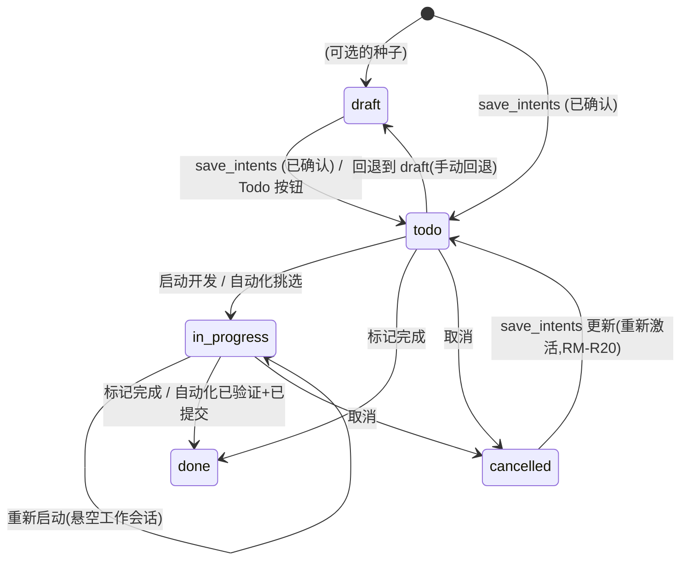

# intent-management — 领域规格

## 概览

intent-management 为 c3 提供**项目范围、跨会话的意图账本**。c3 的其余部分在会话层面运作
(prompt、gate、stream),而本领域捕获*用户想要构建什么*(针对某个项目),帮助将其细化,
并推动其进入开发。

它包含三个活动部件:

1. **账本** — 意图持久化在本地 SQLite 数据库(`~/.c3/c3.db`)中,以项目解析后的绝对
   工作区路径为键,每条记录带优先级、状态、内容,以及可选的项目内依赖关系。
2. **只读的意图沟通智能体** — 每个项目一个长生命周期的隐藏会话,读取项目材料、与用户
   对话,并提出离散、可验证的意图条目。它**永远不能**编辑、写入、运行命令、派生子智能体
   或调用斜杠命令(ADR 0007)。
3. **开始工作** — 将一条 `todo` 意图转化为一个运行可配置开发技能(系统设置中的 `devSkill`;
   默认为空 ⇒ 无前缀)的后台普通会话,并与该工作会话建立回链。
4. **自动化队列(确定性调度内核)** — 一个可选启用、按工作区运行的调度器,逐个开发被标记为
   `automate` 的意图(按优先级再按依赖顺序),依据工作会话的最后一条消息 + 工作树 diff 验证
   真实完成,提交并推送,然后继续下一条。它以固定 10s 节拍**全量对账**:从意图账本、活跃 run
   存活探测与少量持久化的单意图调度元数据**重新推导**该做什么,事件只用于提前唤醒。一次失败
   只隔离到**那一条意图**(退避 → park),队列继续处理无依赖关系的其他候选,每一步的取舍都
   可查询(RM-A1–RM-A23)。

**范围:** 意图账本及其增删改查;只读沟通智能体及其 `save_intents` 保存;细化(在某一条目上
重启沟通);启动开发(后台、来自系统设置的可配置开发技能,默认为空);工作会话回链;
`draft→todo→in_progress→done/cancelled` 状态机;依赖记录与未满足依赖警告;将沟通会话从
普通列表中隐藏;每条意图的自动化标志与自动化队列(对账调度、完成判定、提交/推送、排序、
单意图失败隔离与 park、决策日志、队列页面与人工夺回控制)。

**边界:** 本领域**不**定义智能体运行循环(agent-session)或权限流程(permission-gateway) —
两者均为复用。它不持有任何权限状态。**手动**启动开发从不会使意图自动完成(开发运行结束
不改变状态;由用户标记 `done`,RM-R9)。**自动化队列**是唯一显式的、用户主动开启的例外:
只有在独立的完成判定器确认之后,且改动已提交并推送(RM-A5),它才会把某条意图标记为 `done`。
确定性调度内核**不新增任何自动 `done` 路径**。

## 生命周期事件

一条意图在被创建、首次进入开发、达到 `done`、异常终止或被取消时,各发布一次进程内生命周期
事件。事件仅携带工作区、稳定的意图标识、标题、模块、阶段以及最终状态。它是尽力而为、
非持久化的,且从不重放。一次意图级的自动化失败(退避或 park)会发布 `failed`,即使账本中仍保持 `in_progress`;
这只是报告开发边界,而不改变意图状态,也不代表整条队列停止。自动化可以消费一个事件,但绝不会修改意图,也不会
递归地再发出另一个生命周期事件。

## 核心实体

- **Intent(意图)** —— 一条账本条目:`title`、`content`、`priority`(P0–P3)、`module`(模块名称)、`status`、`dependsOn[]`、`lastWorkSessionId`,以 `workspacePath` 为作用域
- **Intent Dependency(意图依赖)** —— 同一项目内一条有向的 `intent → depends-on` 边(仅用于展示 + 警告;v1 不做拓扑强制)
- **Communication Session(沟通会话)** —— 每个项目用于细化意图的隐藏智能体会话;是真实的 SDK 会话,但排除在普通列表之外(隐藏集)
- **Automation Queue(自动化队列)** —— 按工作区运行的确定性调度内核(每次一条意图),对账 → 选择 → 开发 `automate` 意图、判定完成、提交/推送(RM-A1–RM-A23)
- **Queue Intent State(单意图调度元数据)** —— 一条意图的失败次数、退避截止、park 标记与原因、防自激冷却 —— 唯一被持久化的调度状态,其余每轮重推导
- **Queue Decision(队列决策)** —— 一次 tick 对一条意图的取舍记录:选择的动作、被哪个闸门挡住、拒绝理由、尝试/退避计数、下次唤醒时间
- **Funnel Event(漏斗观测事件)** —— 一次已落库的 park 标记跃迁:`parked` / `unparked`(unpark 侧仅 `manual_unpark`/`auto_unpark` 两个封闭码)+ 结构化原因码 + 时间戳 —— 只在本机、90 天滚动、无自由文本,只读不参与调度(RM-A23)

见 [intent-management-models.md](intent-management-models.md)。

## 概念

- **项目键(path-key)。** 每一条 intent 和 communication-session 记录都以**解析后的绝对工作区
  路径**为键 — 与 session-registry 的工作区键、运行时 `workspacePath`、SDK 的 `cwd` 一致。
  所有入站的 `workspacePath` 在任何读写之前都会先 `resolve()`,从而保证账本、隐藏集过滤与
  `cwd` 始终一致(RM-R10)。
- **隐藏集。** 一个项目中从普通会话列表排除的会话 id 集合:所有 communication-session id
  与所有意图的 **spec-session** id。普通会话列表(`list_sessions`)会过滤掉它们,因此所有
  沟通会话 — 当前的与历史的 — 以及每条意图的 spec 会话都不会出现在侧边栏(RM-R4)。两者
  都是非用户工作会话,只能从意图视图进入(沟通会话经由意图聊天,spec 会话经由意图的 spec
  标签页),永远不会出现在侧边栏。
- **Spec 依赖上下文。** 在创建或重置 spec 会话之前,worktree 模式要求每个已知依赖在工作区
  主线上可用。一个未完成的依赖,或已完成但仍停留在无已合并 PR 的非主分支上的依赖,会阻止该
  动作;已合并的 PR、无分支的历史工作、主线分支以及缺失的历史记录均可放行。current-branch
  模式跳过此检查。检查通过后,会在会话开始前尽力刷新工作区分支;刷新失败会被记录但不阻塞
  编写。相应控件在规则未满足时保持禁用。
- **会话集合。** 每个项目持有多个沟通会话(不止一个)。每个项目有一个会话被标记为
  `isCurrent`,作为不带具体 `sessionId` 进入意图视图时的默认打开指针。可以通过扩展的
  `open_intent_chat { sessionId }` 消息显式切换会话,或通过 `list_intent_sessions` 列出。
- **意图优先级 / 需求级别。** `P0`、`P1`、`P2`、`P3` 之一(P0 最高)。
- **模块 / 模块名称。** 一个自由文本标签,命名意图所属的模块,由沟通智能体根据条目的
  标题/内容推断(例如:认证、会话、需求管理)。在提出时可选,未识别或对历史行为 `''`;
  为后续基于模块的组织/筛选/展示打下数据基础(RM-R14)。
- **自动化标志(`automate`)。** 每条意图一个、由用户切换的布尔值(默认为 `false`)。只有
  `automate` 意图才是自动化队列的候选(RM-A1)。
- **自动化队列(确定性调度内核)。** 一个按工作区运行的调度器,由**定时 tick 全量对账 +
  事件合并标脏**驱动,而不是由某一次事件推动的内存状态机。**事实源:** 意图账本快照、活跃 run
  的存活探测,以及一小撮持久化的单意图调度元数据(失败次数、退避截止、park 标记与原因、防自激
  冷却);运行阶段、当前会话与全部闸门结果每轮**重新推导**,因此不建重型 FSM 表(RM-A2)。
  **资格:** 当 `automate` 且 `status ∈ {todo, in_progress}` 且所有已知 `dependsOn` 条目均为
  `done`(worktree 模式下还须其 PR 已合并)时,一条意图具备资格;SDD 开启时还要求 `specStatus ===
'approved'`(仅 `raw`/`pending` 的一律不入选),
  未批准显式呈现为 `blocked_spec_not_approved` 而非静默跳过(RM-A3、RM-A18)。它开发优先级最高
  (P0→P3,再按最早)的合格条目,首先在其 `lastWorkSessionId` 已在运行一个 turn 时**挂接**
  (一次 run 的生命周期长于其 turn — 不要重复运行/抢占;RM-A10),否则在会话仍存在于磁盘上时
  **恢复**它(继续半成品上下文),否则启动一个**全新**工作会话(可配置技能,默认为空 ⇒ 无前缀)。
  **完成判定器:** 由于开发技能常是检查点驱动的,一个 turn 结束并不意味着"完成" — 一个全新的、
  无工具的判定器**主要根据工作会话最后一条助手消息**(它完成了什么)做决定,多仓库的
  `git diff`/`git log` 证据作为**支持性证据,而非 `done` 的前提条件**,并返回
  `done` / `in_progress` / `stuck`,按 **stuck → done → in_progress** 的顺序判定,不偏向于继续;
  证据为空本身从不意味着"未完成"(RM-A4)。**继续:** `in_progress` 会以 continue 恢复同一会话,
  直到上限(清除检查点);超过上限计为该意图的一次失败,而非停整条队列(RM-A8)。
  **失败隔离:** 所有内核发起的 run 都被 await 并捕获异常(RM-A16);一次失败只影响该意图 ——
  先指数退避,连续 3 次后 **park**;队列继续挑选**与其无依赖关系**的其他候选,而依赖被 park 意图
  的下游仍被依赖闸门挡住,既不跳过也不放行(RM-A6、RM-A17)。**失败阶梯类 park 在依赖满足后
  由对账内核自动恢复**(RM-A17):当 park 原因属于显式失败阶梯分类集且全部已知依赖已满足
  (worktree 下还须 PR `merged`),下一轮对账在 park 门禁之前产出 `unpark` 动作并清空 park 与失败
  阶梯元数据,该意图下一轮从头跑全量门禁;人工类 park 与依赖未满足的 park 一律保持不动。**权限对等:** 开发 turn 期间的权限
  提示(包括非一致的 `AskUserQuestion`)行为**与手动会话完全一致** — 运行**不会**被中止;它保持
  存活(`awaiting_permission`),提示被呈现到浏览器,由一位在场的人类在那里作答。当队列的等待超过
  其等待窗口时,队列**只 park 该意图并推一条 `wait-user-involve` 待办**,运行照旧存活 —— 超时的是
  队列的等待,不是权限决定,决定永不自动作答(RM-A9,C-SEC-3)。**人工决策守卫:** 队列仍保留一个
  独立的 `pendingQuestion` 守卫,使得一个已**结束**(被拆除)但缓冲区中带有未回答
  `AskUserQuestion` 的 turn **永远不会**被自动继续 — 它会 park 该意图并交回人工,队列继续
  (RM-A11)。**可观测与夺回:** 每轮对账按 tick/intent 记录决策(选择的动作、被哪个闸门挡住、拒绝
  理由、尝试/退避计数、下次唤醒时间);队列页面逐条展示这些信息,并提供 pause / force-skip /
  unpark / 覆盖结论等与内核动作一一对应的人工动作,且任何一个都不能绕过硬闸门
  (RM-A18、RM-A19)。**检查点共识覆盖:** 当多数表决开关开启时,一个 `stuck` 判定或悬置问题守卫
  可能改为触发一次关于是否通过检查点的多智能体投票(RM-A14) — 多数 `continue` 会覆盖停止,
  队列自动继续,并在自动化状态上广播共识结果。
- **每意图级规格模式(`specMode`)。** 一个可空的每意图开关,决定该意图 SDD 规格生命周期
  的时序:`sdd`(规格优先)或 `fast`(规格延后)。`null` 继承工作区 `sddEnabled` —— 开启
  解析为 `sdd`,关闭解析为 `fast`;显式 `sdd`/`fast` 始终覆盖派生值。共享 `Intent` 读模型
  携带已解析的 `effectiveSpecMode`,客户端、准入层与 turn 落定处理读取同一值,不再各自
  推导。`sddEnabled` 关闭时本无规格闸门与规格阶段,`fast` 只是与现状一致的自然默认,
  不引入行为差异。fast **仅**绕开手动启动/恢复时的 specApproved 准入闸门,其余闸门(依赖
  未合并、并发/续跑预算、人工决策守卫、权限与工具闭包)与自动化队列资格判定一条不放松;
  turn 落定后按阈值反向补规格。人工入口是**意图详情「概览」标签页元信息区**的「是否需要规范」
  三档开关(继承工作区 / 需要规范 / 不需要规范),选择即保存(RM-R43)。

## 业务规则

- **RM-R1** —— 一条意图只属于一个项目,以解析后的绝对工作区路径为键。列表按单个项目划分;不存在跨项目的聚合视图。
- **RM-R2** —— 沟通智能体是**只读**的。它可以使用只读类工具(Read/Grep/Glob/WebFetch/WebSearch,自动允许),也可以使用 `AskUserQuestion`(一个仅用于澄清的工具 — 允许,经用户答案注入路由,不涉及共识),但**永远不能**编辑、写入、运行命令、派生子智能体或运行斜杠命令。这在工具层强制执行,而非仅靠 prompt(ADR 0007)。
- **RM-R3** —— 沟通会话运行在**强制 `default` 权限模式**下,无论系统默认模式为何。它不响应 `set_mode`,意图视图也不渲染模式选择器。这一约束管的是非只读工具:保存本身不依赖权限模式,它的人工授权是对话中的文字确认(RM-R5)。
- **RM-R4** —— 每个项目至多有一个 **`isCurrent`**(默认打开)的沟通会话。**所有**沟通会话(当前的与历史的)**以及每条意图的 spec 会话**都在隐藏集中,**永远不会**出现在普通会话列表中 — 两者都是非用户工作会话,只能从意图视图进入,而非侧边栏。不带 `sessionId` 进入意图视图会重新加载该项目的`isCurrent` 会话(历史 + 实时流)。带具体 `sessionId` 进入会打开该会话,并将其设为新的`isCurrent`。可以通过 `list_intent_sessions` 列出会话,通过 `rename_intent_session` 重命名,通过 `delete_intent_session` 物理删除(行 + 运行时移除;删除 `isCurrent` 会话会把最近的剩余会话提升为 `isCurrent`)。所有会话的隐藏集成员关系不变 — 隐藏集查询仍会返回每一行。一条意图的 spec 会话仅在列表中隐藏;它仍可从该意图的 spec 标签页打开,在创建、运行、状态上不受影响。
- **RM-R5** —— 一条意图只通过 `save_intents` 写入账本,其人工授权是**用户在对话中的明确文字确认**:智能体每轮(首次拟定与任何修改后)都必须把本轮全部意图的完整内容重新列出并等待确认,确认后才调用工具;工具一经调用,处理器直接持久化,不发 `permission_request`、不等待决定、不登记等待人工介入事件,过程中不出现任何确认弹框。异议不是确认。三个厂商都通过**同一条回环 HTTP MCP 路由**到达同一个处理器,确认语义不因厂商而分叉;意图网关将 `save_intents` 直接放行到处理器,绝不能为其弹出提示。校验失败 / 存储不可用 / upsert 失败 → 整批不写入,并如实告知智能体。
- **RM-R6** —— 新保存的意图以 `todo` 状态起步,作用域为当前项目路径。
- **RM-R7** —— **细化**为某一条意图重启沟通会话:启动一个全新的沟通会话,并以携带该意图 id、标题、内容的首条消息作为种子。它不改变该意图的状态。
- **RM-R8** —— 当意图为 `todo`,或 `in_progress` 且带有悬空(已删除)的 `lastWorkSessionId` 时,允许**开始工作**。手动 `start_development` 首先同步地在一个进程内的单进程启动集中认领该意图 id;在认领期间,同一意图的另一次手动启动会返回一个开发启动进行中的错误,且不会创建 worktree 或启动运行。当工作会话成功关联(`lastWorkSessionId` + `in_progress`)时释放认领,并在每一条启动失败/发起前拒绝路径上释放,以便重试不会被永久阻塞。它会启动一个**运行可配置开发技能**(`devSkill`;默认为空 ⇒ 无)的**后台普通会话**,携带意图内容 — 开发技能按 RM-R25 交付(斜杠命令形式的 `devSkill` 搭乘不回显的用户 turn)— 设置状态为 `in_progress`,并记录`lastWorkSessionId`。**Git 分支模式:** 工作区的 `gitBranchMode`(缺失/未知归一为 `worktree`)决定开发智能体在哪里运行,工作目录与基线由 RM-R46 统一给出。工作会话是四类会话中唯一把该目录的分支名回写到意图 `branchName` 的一类:目录是共享事实,分支名是开发事实。**`current-branch` 模式下的启动前拉取:** 该模式没有专属目录,智能体就地在项目当前分支上开发,因此服务端先对它做快进(`git pull --ff-only`)。失败策略是**区分对待**的:无远程 / 无 upstream / 网络错误 ⇒ 尽力**跳过**(仅本地或离线的工作区仍会启动);一个相对其 upstream 已**分叉**(非快进)的分支 ⇒ **硬停止** — 服务端从不自动合并或自动变基用户的分支,因此拒绝启动并返回一个拉取失败错误(手动 `start_development` 同时释放进行中的认领;自动化队列将其计为该意图的一次失败尝试(RM-A6)),告知用户先自行协调。工作会话是一个普通会话,出现在侧边栏中 — 打上绑定时间戳,使其排在**最上方**,且(对于无连接的自动化队列)在绑定/结束时向每个连接扇出,因此无需手动刷新即可实时出现(SR-R13)。
- **RM-R9** —— 开发运行结束**不会**改变意图状态(不自动完成)。用户从列表中手动将其标记为 `done` 或`cancelled`。**例外:** 在进入意图视图(`open_intent_chat`)时,服务端会协调每一条`in_progress` 意图;一个进程已死、且完成判定器根据最后 3 条助手消息确认为 `done` 的工作会话会被**自动**标记为 `done` — 即使是手动启动的运行也不例外(RM-R18)。这个协调型自动`done` 是自动化队列之外唯一的自动 `done` 路径(RM-A5);确定性调度内核未新增任何自动 `done` 路径。
- **RM-R10** —— 每一个入站的 `workspacePath` 在任何账本读写或隐藏集过滤之前都会先 `resolve()`,与工作区键 /运行时 `workspacePath` / SDK 的 `cwd` 保持一致。
- **RM-R11** —— 带着一个或多个**未满足的依赖**(某个 `dependsOn` 条目未 `done`)启动开发会**警告**但不阻塞 —用户可以继续。
- **RM-R12** —— 如果账本(SQLite)不可用,意图相关功能按入口点降级(意图消息返回 `error`;普通列表**不**被过滤),c3 仍能启动并服务普通会话。
- **RM-R13** —— 工作会话回链会打开 `lastWorkSessionId` 会话(复用 `select_session`)。如果该会话已不存在,用户会得到一个友好的提示(带重启/取消选项),而非崩溃。
- **RM-R14** —— 每条意图都带一个 `module`(模块名称)。沟通智能体从条目的标题/内容**推断**它(方案 a;未来可扩展到项目的模块结构),并将其随每个条目一并传给 `save_intents`;缺失/空白的 `module`持久化为 `''`(智能体从不会因此被阻塞)。账本列是 `TEXT NOT NULL DEFAULT ''`;旧数据库通过幂等的 `ALTER TABLE … ADD COLUMN` 迁移(schema v1→v2),历史行默认为 `''`(不回填)。所有读路径都返回 `module`。这一数据基础被 RM-R16(列表展示)消费;基于模块的筛选仍不在范围内。
- **RM-R16** —— 意图列表将每个条目的 `module` 渲染为一个居于日期前缀与标题之间的中性药丸标签。空白的 `module`(`''`)不渲染任何内容 — 无占位符,不破坏布局;该标签不会收缩,并带有最大宽度 + 省略号,使得一个很长的模块名永远不会挤压标题。仅用于展示;不影响排序或过滤。
- **RM-R15** —— **代码 + 测试 + 配套文档是同一条意图(一个目标从不拆分)。** 当一个目标同时涉及代码及其测试和/或配套文档(spec / README / 注释)时,沟通智能体会把测试同步与文档同步工作折叠进**同一条**意图的内容 + 验收要点中 — 它**不得**另外发出一条独立的「更新测试」或「文档更新」意图。代码、其测试与其文档是同一次改动,保留在同一个工单上,这样就不会有一半被单独排期或遗漏(那样会使测试/文档偏离代码而失步)。仅由 prompt 引导强制执行(无工具层检查)。
- **RM-R17** —— **一个 `save_intents` 批次可以声明对同批次内其他条目的依赖。** 每个提议的条目除了 `dependsOn`(**已存在**意图的 id)之外,还可携带一个可选的 `dependsOnIndexes`(指向**同一批次**条目的0-based 索引)。同批条目的 id 在提议时尚不存在,因此批次内的先后关系只能用索引来指代。保存路径**预先**为每一行铸造 id,然后把每个索引解析为同批条目的真实 id 并写入 — 与 `dependsOn`合并去重后 — 落入依赖边,全部在一个事务内完成。**校验(原子拒绝):** 一个越界索引、一个自引用,或批次内边构成的环,都会在**任何写入之前**失败,因此整个批次被拒绝,保存返回一个错误结果(不会半途写入);既有 id 的 `dependsOn` 行为不变(跨批次的环是不可能的 — 全新的行还没有任何其他东西引用其 id)。**稳定的次级顺序:** 一个批次的行会以按索引偏移的创建时间打上时间戳,这样同优先级、无依赖的条目在编排器的最早优先并列判定(RM-A3)中保持一个确定的提交顺序排名,而非任意顺序。沟通智能体被提示,只要批次内存在先后关系就要**主动填写 `dependsOnIndexes`**(prompt 引导;校验是工具层的守卫)。
- **RM-R19** —— **沟通智能体拥有两个只读的账本查询工具。** 除 `save_intents` 之外,三个厂商共用的 `c3` 回环 HTTP MCP 路由还暴露 `find_intents`(按 `keyword` 搜索**本项目**的意图 — 对标题/内容做模糊 `LIKE`,通配符已转义 — 和/或按 `module`/`status` 搜索;返回一个精简的 `id`/`title`/`module`/`priority`/`status`/`dependsOn` 列表)与 `view_intent`(按 `id` 查看一条意图的完整详情;未知或跨项目的 id 返回一个友好的未找到提示,而非报错)。两者均为**只读**且在工具闭包中**绑定项目**(智能体永远无法读取另一个项目的账本 — `view_intent` 按 id 取出一条意图后会守卫它属于绑定的项目)。意图网关对三者都**自动允许**,不产生任何提示;两者都常驻在 turn-1 的 prompt 中,因此智能体无需再去搜索它们。prompt 指引智能体在拆分新条目或设置 `dependsOn` 之前**先搜索账本**,以复用相关条目、避免重复,并引用正确的既有 id。(ADR 0007。)
- **RM-R18** —— **进入时的意图协调(`open_intent_chat`)。** 每当一个客户端进入意图视图,服务端都会协调该项目的 `in_progress` 意图 —— 对照进程表检查每个 `lastWorkSessionId`,当进程已死(服务端重启、崩溃、正常退出)时,加载该会话最后 3 条助手消息并运行完成判定器。**存活检查:** 一个仍在运行的工作会话产生派生的 `runStatus = 'running'`(追踪中)。**判定 `done`:** 自动完成:提交并推送(`feat: <title>`)并将该意图标记为 `done` —— 对手动启动与自动化启动的意图**都**适用。这是对 RM-R9 不自动完成规则的一个显式的、已记录的例外,专门针对进程死亡的情形。**判定`in_progress` / `stuck`:** 让意图保持 `in_progress` 并将 `runStatus` 设为 `'dangling'`。**判定不可用**(判定器跑不通,RM-A4):同样保持 `dangling` —— 什么都没有被判定,协调不得据此改变意图。**无 `lastWorkSessionId`:** 同样为 `dangling`。协调结果反映在 `intents` 消息负载中(每条意图都携带其 `runStatus`)。当有任意意图被自动完成时,会跟随一次意图刷新推送,以便其他连接看到更新。
- **RM-R20** —— **`save_intents` 是一次 upsert — 带 `id` 的提议条目会原地更新那条既有意图,而非插入。**整个批次在**一个事务**中处理,所有校验都在**任何写入之前**完成(原子拒绝 — 不会半途写入,与 RM-R17 呼应):(a) `id` 必须能解析到**本项目**内的一条意图(不存在或跨项目的 id 会以一个错误结果拒绝整个批次);(b) 目标必须**按状态可修改** —— `draft`/`todo` 保持其状态,`cancelled` 会**被重新激活为 `todo`**(`completedAt` 保持为 null),而 `in_progress`/`done`是**不可变的**(批次会被拒绝,并带有清晰的「正在开发 / 已完成,不可修改」消息);(c) 更新时,`title`/`content`/`priority` 会被写入,`module` 只在提供时才更新(否则保留原值),依赖集合只在提供了 `dependsOn` 或 `dependsOnIndexes` 时才被替换(两者都省略则保留既有依赖)。**没有**`id` 的条目按 RM-R6 作为 `todo` 插入。单个批次可以**混合**更新与插入;`dependsOnIndexes`(RM-R17)会针对整个批次解析,因此一个被索引引用的同批条目本身也可能是一个更新目标。**细化的串通(RM-R7):** `refine_intent` 用原始意图的 id 作为种子启动沟通会话,prompt 指示智能体在保存时填上该 `id`,使被细化的意图更新其原始条目而非产生重复(如果原条目已经是`in_progress`/`done`,则告知用户无法修改)。已弃用的 `save_requirements` 别名共享同一套schema/handler,并继承 upsert 行为。**(d) 改写既有意图的需求正文即撤销其 spec 批准。** 交互式保存没有服务端确认弹框(ADR-0007),因此这条不变量由台账自身守住:当一次更新使 `title` 或 `content` 与库中旧值**实际不同**时(精确相等比较,由存储层自行判定,调用方不能声明或跳过;不判断两段文本是否"等价"),同一条 UPDATE 语句一并清除 `spec_approved` 与 `spec_approve_user`,并把当前审核结论标记为已被否决(`spec_review_machine_blocked=1`)——spec **文件**在这条路径上没有变化,旧 `pass` 结论仍与指纹相符,缺了这一步开启机器批准的工作区会在下一个 tick 把它批回来(与 RM-R33 同一道理)。`spec_status` 随兼容字段同语句联动:原本 `approved` 的退回 `pending`(文档仍已撰写,只是不再被批准),原本 `raw`/`pending` 的保持原状(改写需求正文不会让一份占位看起来已撰写)。原本已批准的才追加一条 `spec_unapproved` 生命周期日志(actor 沿用本次保存的归因),原本未批准的保持未批准且不制造撤销日志。`priority`/`module`/依赖/`shortEnTitle`/会话回链/`cancelled` 重新激活等非需求正文的变化**不**撤销批准;无 `id` 的新建条目按 RM-R6 插入,不受此规则影响。撤销与更新同属一个事务:批中任何条目校验失败时,正文、批准与撤销日志一并不落库。被改写的意图因此回到**待批准或待撰写**,SDD 开启时不再被队列选中启动开发(RM-R23/RM-A2),必须经人工重新批准(RM-R22)或重写 spec 产出新结论后才能进入开发;**已经在运行的开发会话不被终止**。
- **RM-R24** —— **重置意图 / spec 会话 —— 启动一个以内容为种子的全新会话,摆脱一个已陷入上下文腐化的旧会话。**在一条意图(或其 spec)发生变化之后,与之关联的细化 / spec 编写会话中的对话可能已经过时。意图详情将其展示为**我要修改**,而非一个标签页局部的重置:头部动作重置意图/细化会话,spec 文档标签页动作重置 spec 编写会话。两者都会打开同一个受控的输入对话框(ConfirmDialog 风格,**不是** `window.confirm`;非空前确认按钮禁用)→ 确认后启动一个**全新**会话,以用户输入的内容**拼接**相关的当前内容作为种子,并**替换**相应的关联会话 id。意图/spec 会话标签页本身**不**渲染重置按钮。**`reset_intent_session`** 镜像 `refine_intent`(RM-R7):一个全新的 `'intent'`运行时,其首条 prompt 把用户输入前置于该意图当前的标题 + 内容之前,并登记 pending→intent链接,使 `run:bound` 在首次绑定时用真实 id 替换 `intent_session_id`。**`reset_spec_session`**镜像 `write_spec`(RM-R21)但**复用既有的 spec 目录/路径**(不做脚手架):它启动一个全新的**写入受限**的 `'spec'` 会话(携带与首个 spec 会话相同的两个只读账本查询工具,RM-R27),以用户输入 + 指向当前 `spec_path` 的指针为种子(**仅路径** —— 智能体自行读取 spec 文件;prompt 不再内联 spec 正文),回复 `session_selected` 使 spec 会话标签页切换到新会话,并登记pending→intent 链接使 `run:bound` 在首次绑定时替换 `spec_session_id`。当从未写过 spec(`specPath` 为空)时,`reset_spec_session` 会被**拒绝**。Claude 使用 spec 权限网关做写入受限;Codex 使用 RM-R21 中的驱动沙箱边界,因此当该边界可以建立时,Codex spec 智能体不会被拒绝。服务端不再预读 spec,因此其可读性不是启动的前提条件 —— 一个缺失/不可读的 spec 会成为智能体读取该路径时遇到的一个普通文件错误。重置**不是**删除:先前的会话仍可在 Works(运行中心)下查询,只是不再是该意图的关联会话。没有批量重置。对话框文案走 i18n。
- **RM-R23** —— **SDD 感知的启动 —— 服务端强制的审批网关 + spec 注入 + 工作会话指令。** 当工作区的 SDD总开关(`sddEnabled`)开启时,`start_development` 会**在服务端**强制执行审批检查点,而不仅仅是隐藏客户端按钮(RM-R22):启动一条 `specStatus !== 'approved'` 的意图会被**拒绝**,返回一个 spec-未批准错误,且**不会**启动任何运行(进行中的认领会被释放,以便重试不被阻塞)。权威条件是状态本身,兼容布尔不构成第二条准入路径。当 SDD 开启且网关通过时,工作会话的第一个 turn 会被塑形,使其以 spec 驱动的方式工作,拆分到 RM-R25 的各交付通道中:(a) **可见的 turn** 携带意图的 `title` + `content` +`依赖需求` 提示,当存在 spec 路径时,还有一条**指向 spec 路径的提示**,把智能体引向该意图已批准的 `spec.md`(在集中化 spec 根目录中的**绝对**路径,因为它位于工作区之外),作为唯一的真相来源(Spec is Truth;出现分歧时反向同步)—— spec 路径提示属于业务上下文,因此保持可见;(b) 当**未配置 `devSkill`** 时,**SDD 工作会话指令** —— 一条固定(非 i18n)指令,装配spec 驱动、检查点治理的工作契约(Spec is Truth、先复述、执行前设检查点、以证据为完成依据、反向同步、通过工具提问,加上明确的暂停并交还条件)—— 会作为模型的**系统上下文**交付,**不是**可见 turn,因此永远不会渲染为一条可见的聊天消息;(c) 一个已配置的 **`devSkill`** 是一条斜杠命令,并且**优先于**该指令(两者绝不叠加)—— 它搭乘模型的**用户 turn**(斜杠命令唯一能展开的位置),但仍被排除在可见回显之外。当 SDD **关闭**时,可见的 turn 与历史形态逐字节一致(`title` + `content` + `依赖需求` 提示);一个已设置的 `devSkill` 仍会搭乘不回显的用户turn —— 没有网关、没有 spec 提示、没有指令。
- **RM-R22** —— **批准 spec —— 人工审批检查点,以及 SDD 感知的意图动作按钮(以 `specStatus` 三态投影)。** 意图详情的主动作按钮针对 `todo` 意图,根据工作区的 SDD 总开关(`sddEnabled`)加上该意图的 `specStatus`(`raw`/`pending`/`approved`)决定:(1) **SDD 关闭** ⇒ `开始工作`;(2) **SDD 开启且 `specStatus` 为 `raw`**(无 spec,或只有 `write_spec` 播种的占位;`specPath` 可能因播种已回填)**⇒ `编写 Spec`**(RM-R21)—— 此时不把占位推给人审批;(3) **`specStatus` 为 `pending`**(文档已有偏离 seed 的真实内容且未批准)**⇒ `批准 Spec`**,但该头部动作只会打开 spec 文档标签页并读取该 spec;(4) **`specStatus` 为 `approved`** ⇒ `开始工作`。工作区的 `sddEnabled` 会搭乘每一次意图列表广播,使按钮无需单独一次设置拉取即可解析其状态。`specStatus` 是唯一事实源,`specPath` / `specApproved` 不再组合推断。真正的 `approve_spec` 调用只能从 spec 文档标签页的**批准**动作触及,因此用户是从文档界面而非全局头部批准的。既有的、`编写 Spec` 之后 10 秒的反误批准网关同样适用于该 spec 标签页的批准动作,而不适用于头部快捷方式。`approve_spec` 是把关进入开发的人工审批检查点 —— SDD 存在的理由:它设置 `specStatus='approved'`(+兼容字段 `spec_approved=true`)并将**批准用户**(当前登录 subject)记录到 `spec_approve_user`,然后重新广播列表。批准是**单人确认** —— 没有多签。批准**可以撤销**(RM-R33);在显式开启机器批准的工作区,批准也可以由带机器身份的队列做出(RM-R34)。`approve_spec` 只接受 `pending`:批准一条 `specPath` 为空的意图会被**拒绝**,批准一条仍是 `raw`(播种后尚未真实撰写)的意图也会被**拒绝**(同一 `intent.specNotWritten` 防御性错误 —— 从人的角度一份只含占位的文档就是「还没写好」);服务端在事务内按状态守卫,UI 在非 `pending` 时从不提供批准操作。批准本身**不会**启动开发;它只是清除检查点,使按钮前进到`开始工作`。所有按钮文案都走 i18n。
- **RM-R21** —— **编写 Spec —— 质量门输出步骤,把一条意图转化为一份受限的、可审阅的 spec 文档。**`write_spec` 在**固定的、集中化的 spec 根目录**下搭建一个按日期命名的 spec 目录 ——`<c3 home>/doc/<project-path-segment>`(按项目隔离,从**所属工作区路径**确定性推导,使得该项目的所有 worktree 共享同一套 spec 集;**不可**由用户配置,也**不**提交到 Git):`<spec-root>/yyyy/mm/dd/yyyy-mm-dd-<NNN>-<slug>/spec.md`,其中 `<slug>` 是该意图的`shortEnTitle` 做 slug 化处理(转小写、非字母数字字符折叠为单个连字符、去首尾;标题为空或非 ASCII 时回退到意图 id 前缀),`<NNN>` 是一个 3 位的按天序号(该天根目录下已有的最大编号加一,没有则为 `001`)。服务端只用 `intent_id`、`title`、`created` frontmatter、一个标题和该意图的引用来**播种** `spec.md` —— 没有文档级别的 `status`,也没有固定的章节骨架 —— 并会**立即回填**该意图的 spec 路径(存储的 `spec_path` 是集中化位置的**绝对**路径),因此即使编写运行失败,spec 也已经存在。**播种即 `raw`:** 回填 `spec_path` 的同一条存储语句把 `spec_status` 置为 `raw` —— 一份只有占位的文档**不算待批准**,不进入审核/批准/`spec_awaiting_approval` 阻塞。播种本身、运行启动或失败都**不**单独改变状态;唯一把 `raw` 提升为 `pending` 的自动路径是**内容真实落盘**:每次编写运行(首写/重置/续写/返工)启动时,服务端记录该轮写入前文档的完整内容指纹,`run:settled` 的 spec 领域订阅集中比对落盘后的指纹,仅当内容**实际变化**时才在同一事务内把 `raw` 原子转 `pending`(或把批准后改写的文档从 `approved` 转回 `pending`),事务成功后再广播并唤醒队列;评审 agent 只能在后续对账读到 `pending` 后启动,不能与状态写入并行或抢先启动。检测只发生在受控写入边界,**任何消费端都不得**根据 seed 文案、占位字符串或实时文件内容反推状态;未改动、不可读或写入失败保持原状态,内容日后再次形似 seed 也不会自动退回 `raw`。人工行内编辑 `update_spec_content` 在文件写入成功后把状态置为 `pending`(原为 `approved` 时同时清除批准信息)。spec 编写的系统指令还禁止添加一个 frontmatter 或文档头部的`status` 标签:批准是一个系统层面的网关,永远不会把文档状态写回,因此这样的标签会是过时的。spec 是以控制台显示语言,为其**第一读者(用户)**而写的;开发智能体是第二读者。评审界面**不**把意图与 spec 并排展示,因此 spec 必须**自洽**:它把该意图的动机、可观察改动、范围边界/非目标与验收条件**提炼**进文档(用自己的话概述,不逐字照抄、不机械罗列字段),并在其上叠加经代码库验证的方案、关键决策与验证方式;一位评审者只读这一份文档,无需打开该意图、也无需阅读代码库即可批准或拒绝它。它的结构与实际影响成正比:一个聚焦于单一表面、没有契约、持久化数据、迁移、安全或跨领域影响的改动,只有一个 2–4 句的改动摘要、行为与边界,以及具体的验证方式(通常 8–20 行);一个普通改动只额外加入相关方法、受影响的能力/契约与边界;一个契约/数据/迁移/安全/跨领域或其他高风险的改动还会记录决策/权衡、兼容性/迁移与失败处理。它从不逐字照抄该意图,验收项要落成可观察的验证条件,也从不创建空标题或为填满结构而注水。Spec 用领域语言描述能力与契约,而非源码路径、符号或逐文件的改动。实现交接是可选的,只在需要时紧随验证之后;它给出技术边界与顺序,不含代码标识符。随后它会在已配置的 spec 智能体(`specAgentId`;为空 ⇒跟随默认智能体)上启动一个**spec 编写会话**,其职责**仅限于编写 spec,不改动代码**:该会话**写入受限于 spec 目录** —— 针对任何其他路径的写入类工具都会被拒绝(即便 spec 目录本身位于项目树**之外**),项目其余部分为只读 —— 且 shell / 子智能体 / 斜杠命令工具都被阻断。spec 编写契约 —— Spec-is-Truth、四维度的 Spec 自检(自洽/一致/可验证/可追溯)、写入受限,以及在有歧义时通过工具提问 —— 作为 spec 智能体的**系统上下文**交付,**不会**在可见的启动 turn 中重述(RM-R25);可见的 turn 只携带业务上下文(是哪条意图 + 其正文,以及要写的交付文件)。当会话绑定后,其 id 会被回链到该意图,作为它的 **spec 会话**。写入受限因厂商而异,但都在模型能行动之前强制执行:Claude 使用带 `rt.specDir` 的路径级permission-gateway 机制,而 Codex 使用驱动沙箱边界 —— cwd 被移动到集中化的 specs 根目录,强制 `workspace-write` + `approval_policy=never`,并通过 `--add-dir` 传入 specs 根目录,使项目树、账本数据库以及其他非 specs 根目录路径都在可写根目录之外。如果 Codex 边界无法建立,启动会 fail closed,而不是回退到一个项目可写的 cwd。权限范围复用了自动化预先配置的理念(提前声明允许/拒绝),但由厂商执行边界强制执行,而不仅仅是工具名 prompt 文本。
- **RM-R25** —— **内部系统指令 vs 可见会话内容 —— 这条边界统一适用于意图 / spec / 工作会话,并跨越每一个厂商。** 一个 turn 的文本分为两类。**内部系统指令**(约束模型如何行动 —— 其角色、能力/权限边界与工作方法):沟通智能体的只读分析师角色;spec 编写契约(Spec-is-Truth、四维度自检、写入受限、通过工具提问);工作会话的开发技能与 SDD 工作会话指令。**可见的业务上下文 / 用户输入**(用户会识别为主题数据或自己话语的内容):用户提交的每一条消息、意图正文(标题 + 内容)、依赖提示、spec 路径提示(工作会话与 `reset_spec_session` 的 prompt 都只把智能体指向 spec 的路径;两者都不内联 spec 正文),以及用户在重置会话时输入的文本。规则:内部系统指令通过模型的**系统上下文**到达,**永远不会**渲染为一条可见的聊天消息 —— 不作为 `user_text`,也不作为任何其他可见区块,无论是在实时流、历史基线,还是重连回放中 —— 覆盖启动 turn 与之后的每一个turn;可见的业务上下文 / 用户输入保持其既有的可见性与顺序,文本不变。唯一的载体例外是斜杠命令形式的开发技能:一条斜杠命令只有在引领模型的用户 turn 时才会展开,因此它不能存在于系统上下文中 —— 它搭乘用户 turn(保留其执行语义),但仍被排除在客户端回显之外,因此客户端永远看不到它。能力/权限边界**不**依赖这种可见性:只读锁(ADR 0007)与 spec 写入受限(RM-R21)在工具/路径层强制执行,无论是否展示任何指令。此变更只影响新产生的会话与 turn;既有历史不会被迁移、改写或隐藏。
- **RM-R27** —— **spec 编写会话拥有两个只读的账本查询工具 —— 且仅有这两个,只读、绑定项目、不能保存,在 Claude 与 Codex 的 spec 智能体上都是如此。** `write_spec` / `reset_spec_session` 会话(RM-R21 / RM-R24)携带与沟通智能体相同的 `find_intents` / `view_intent` 工具(RM-R19):`find_intents` 搜索**本项目**的意图(关键词 / 模块 / 状态 → 精简列表),`view_intent` 按 id读取一条意图的完整详情(未知或跨项目的 id 返回一个友好的未找到提示,而非报错)。它们让 spec作者可以**依据同一项目内的既有意图来锚定或澄清 spec**。边界:(a) **只读** —— spec 会话**永远不会**被赋予 `save_intents`,因此它无法创建或更改任何意图;(b) **在工具闭包中绑定项目** —— 它永远无法读取另一个项目的账本(`view_intent` 会守卫取出的意图属于绑定的项目);(c) **纵深防御** —— spec 会话的 `c3` MCP 服务器只注册恰好这两个工具(主线),并且 spec 权限网关的读通过集合是一个**显式的**只读并集(内置只读工具 ∪ 这两个查询工具),因此即便`save_intents` 有一天被误注册或被厂商预批准,也会落到**默认拒绝**(不同于让保存直通到自身处理器确认的意图网关);(d) **统一传输** —— Claude 与 Codex 都通过**同一条回环 HTTP MCP 路由**收到这两个工具(Claude 边界把中立描述符转译为 Claude SDK 的 HTTP MCP 配置,Codex 的 `enabled_tools` 由同一个双工具集合派生);两个厂商都不注册`save_intents`。两个工具都常驻在 turn-1 的 prompt 中(无需先做一次 ToolSearch 往返)。由于`write_spec` 与 `reset_spec_session` 都通过**同一条**启动路径(一个 spec-profile 工厂)配置 spec 会话,一个**重置**的 spec 会话会得到完全相同的两个工具 —— 该能力在重置后仍然存在。(ADR 0007。)
- **RM-R26** —— **手动工作会话结束后的 Git/PR 清理 —— 在手动启动的工作会话结束时关闭 Git/PR 循环,不触碰状态机。** 一条意图携带两个 Git 追踪字段(`branchName`、`latestCommitHash`)与一组 PR/MR 关系行(`prs`)。当一个**手动启动**(`start_development`,而非自动化队列)的工作会话结束时 —— 无论出于**任何**原因:正常完成、出错,还是用户终止 —— 服务端都会运行一次会话结束清理。**来源区分:** 一个会话只有在该工作区的队列内核当前持有这条意图的在途 run 时才被视为自动化拥有(此时它自行提交/推送,RM-A5);其他每一个结束了的、与意图关联的会话都是手动的,并在此处被清理 —— 两者互斥。清理从不在会话中途运行,只在结束之后,且从不改变意图状态(不自动 `done`;RM-R9 依然成立 —— `reviewing`是一个 PR 状态字段,与该意图自身的 `todo`/`in_progress`/`done` 相互独立)。**分支模式派发:**在 `worktree` 模式下,清理总是针对该意图的 worktree 运行;在 `current-branch` 模式下,清理**只在当前分支不同于工作区的 `defaultMainBranch` 时**运行 —— 在主分支上,清理是一次**正常的成功跳过**(不提交/推送/建 PR/MR,不写入任何 PR 字段,**没有**失败消息)。**顺利路径(存在改动):** 提交(`feat: <title>`)→ 推送该分支 → 回写 Git 字段 → **仅当意图状态为 `done` 时**才继续建 PR。**`done` 门槛:** 建 PR 前重新读取意图状态,非 `done` 时只做提交/推送与字段回写,这是一次**正常跳过**(不推失败待办、不判失败)—— 会话结束不再意味着必然产生 PR,用户先标 `done` 或改用手动「创建 PR」。**目标解析:** 状态为 `done` 时,PR 目标与手动创建 PR 共用同一份 `resolvePrTarget`(RM-R32,经依赖注入接入):关联一个分支已就绪的交付 ⇒ base 为**该交付分支**、PR 行携带该 `delivery_id`;**未关联任何交付 ⇒ 不建 PR**,记一条 `pr_skipped` 生命周期日志「未关联交付,未创建 PR」后正常结束;目标不可用(分支未就绪 / 多关联 / 交付未知 / 未关联该交付)⇒ 不建 PR,并按下述失败通道推送 `intent.gitCleanupPrTargetUnavailable` 待办。**绝不回退到工作区主线**(`defaultMainBranch` 在本条中只用于 `current-branch` 模式的主分支跳过判定)。显式的工作区 `forge` 值 `github` 和 `gitlab` 会覆盖仓库来源检测;`auto`(或未设置)保留检测。GitHub 使用 `gh`;GitLab 使用 `glab`。清理随后回写 `branchName`、推送后的 `latestCommitHash`,并经 `upsertIntentPr` 落一条 `reviewing` 的 PR 行(连同 forge、repo、head/base 分支与 URL)。**幂等的再次清理:** 一条已经有**活跃** PR/MR 的意图不会被重新创建 —— 清理会提交/推送并刷新 `latestCommitHash`,但保持 PR 行不变。**显式失败(绝不伪造成功):** 当清理本应运行但无法完成时 —— **没有可提交的改动**(视为一次失败,而非静默跳过)、提交/推送失败(鉴权、被拒、网络、冲突)、所选的代码托管平台 CLI **不可用或未登录**,PR/MR 创建失败,或(意图已 `done` 时)**PR 目标不可用** —— 它会**显式失败**,并推送一条**工作台等待用户介入的待办**(来源 `intent`,通过一个 UI 错误码携带本地化消息)要求用户处理。失败时它**永远不会**写出一条 PR 行,更不会写入错误的/占位的编号或链接;真正成功的步骤会被如实记录(例如提交+推送成功但 PR/MR 创建失败 ⇒ `latestCommitHash` 被写入,该意图仍无 PR 行)。同一意图先前的清理待办会在再次尝试之前被清除(重跑时自愈)。清理**不会**自动合并 PR/MR、解决冲突、配置凭据,也不会重试 —— 那些留给用户。不会引入一个与 `latestCommitHash` 重复的新 `commit_hash` 字段。
- **RM-R28** —— **对处于评审中的意图做一次性的 PR/MR 状态同步。** 闸门是 **PR 行本身**而非意图:只要该意图存在处于 `reviewing` 的 PR 行,详情头部与 Git/PR 元数据就暴露 `sync_intent_pr_status`,意图自身处于 `todo`/`in_progress`/`done` 均可 —— PR 有它自己的生命周期。服务端在查询已配置的代码托管来源之前,会先校验工作区所有权与这一条前置条件,随后**逐条**同步该意图全部 `reviewing` 行。GitHub 使用`gh pr view <id> --json state,mergedAt,url`;GitLab 使用 `glab mr view <id> --output json`;在来源检测之前,先尊重显式的工作区 `forge` 覆盖。如果代码托管平台确认已合并,只有该 PR 行的 `status` 与 `updated_at` 会被更新为 `merged`;如果确认已关闭,`status` 可能变为 `closed`,但这不被视为已合并。同步从不改变意图的 `status`、`completed_at`、`branchName`、`latestCommitHash`,也不改 PR 行的编号与链接,更不从链接或分支名推断状态。响应帧的 `prStatus` 是同步后的**聚合态**,`changed` 表示任一行发生了变化。缺失 PR、无 `reviewing` 行、CLI/鉴权/查询失败,或未知状态都会返回可理解的反馈,且不会写入 `merged`;单条查询失败不阻断其余行,失败详情按 PR 编号一并回报。当手动启动/spec 网关或自动化发现 worktree 依赖只是被未确认的依赖 PR/MR 状态阻塞时(判定同样看依赖意图有没有 `reviewing` PR 行,与它自身状态无关),c3 会为这些依赖 PR/MR 启动一次尽力而为的一次性后台同步,完成后广播意图,并让下一次用户操作或自动化重新检查应用刷新后的资格。这不是轮询、webhook 处理、自动合并,也不是一个完整的 PR 评审/检查面板。
- **RM-R29** —— **模型 `update` 事件触发的 PR 状态复位。** 模型执行自己的 push / `gh pr edit` / 重新打开等操作,来修改重提一个被打回(`rejected`/`failed`)或关闭(`closed`)的 PR,然后通过 `publish_event` 发布一个 `type='pr:operation'`、`update`/`success` 的通用事件(落在单一 `'event'` 总线 topic 上)。一个**常驻的意图领域消费者** —— 注册在 `run-domain-subscriptions.ts` 中,**独立于**自动化派发(`dispatchEventTriggers`)与自动化 store 的可用性 —— 订阅 `'event'`、先判别 `event.type==='pr:operation'` 并从 `metadata.operation`/`status`/`data.association` 投影后消费该事件:当事件携带 `association.intentId`,该意图存在且属于事件所在的工作区,且事件唯一定位到的 PR 行状态 ∈ {`rejected`,`failed`,`closed`} 时,消费者把该行复位为 `reviewing`,追加一条`pr_updated` 生命周期日志(actor 为 `automation`),并广播账本。**定位规则(绝不猜测)**:一个意图可持有多条 PR,故事件须携带 `association.deliveryId`(账本键 `(intent_id, delivery_id)`)或 `data.pr.number` 之一;两者同时携带时必须命中同一行,不一致即拒。两者皆无时仅在该意图**恰好一条活跃 PR**(活跃 = 非 `merged`/`closed`,与共享定义同口径)时作用于它,其余情形 —— 定位不到、两个定位不一致、无定位且活跃 PR 不止一条或一条也没有 —— 一律**拒绝**:不复位、不写日志、不广播,落一条 error 级日志。`pr:update` 是广播事件,消费端没有可回传的请求方,「报错」因此落在日志与监控,并由 `publish_event` 的工具描述要求模型必带定位字段。`merged` 是一个真正的终态,**永远不会**被复位;其他状态、缺失的 `intentId`、未知意图、跨工作区的 `intentId`,以及任何非 `update`/非 `success` 的事件都会被**静默忽略** —— 不会向模型返回错误(发布本身已经成功),不记日志,不广播。一个重复的 `update`/`success` 事件天然是幂等的:第一次复位为 `reviewing`,后续的都是空操作,因为状态已不再可复位。c3 **不会**执行 PR 操作,也**不会**检查 PR 的 diff / 提交 / 状态 / url —— 复位完全信任所发布的事件。这个消费者与自动化派发是同一个总线事件的两个独立副作用;其中任何一个失败都不会阻塞另一个。
- **RM-R30** —— **正文行内编辑 —— 一种轻量的、仅供人工直接修正意图 `content` 的方式。** 与细化(一个对话式会话,RM-R7)和 `save_intents`(账本/智能体的 upsert,RM-R20)不同,意图详情的**意图**标签页在正文动作区暴露一个**编辑**动作,**仅**对 `draft` / `todo` 意图显示。点击它会把 Markdown渲染换成一个预填了当前 `content` 的纯文本文本域(无富文本,无预览分栏);左下方是一个蓝色的**保存**和一个**取消**。**取消**丢弃本地草稿并返回渲染视图 —— 它**不会**调用服务端。**保存**发送 `update_intent_content { intentId, content }`;服务端会重新校验状态网关 ——**只有 `draft` / `todo` 可编辑,其他任何状态**(`in_progress` / `done` / `cancelled` /`blocked` / `failed`)**都会被拒绝**,并携带当前状态的 `intent.contentEditForbidden`,因此一个绕过了客户端的调用无法编辑 —— 然后**只**更新 `content`(+ `updated_at`),追加**一条**`intent_updated` 生命周期日志(actor = 登录 subject,缺省为 `system`),带一个**简单摘要**(无前后 diff,与 `save_intents` 的更新日志一致),并重新广播账本。**没有**专门的成功回执:客户端在刷新后的意图落地时(其 `updated_at` 被推高)退出编辑模式并渲染服务端内容。服务端还会额外重发该意图的 `intent_logs_list`,以便一个已打开的变更日志标签页拾取新的一行。这次编辑**不上锁** —— 后写者获胜,与 `save_intents` 的无锁语义一致 —— 且除了正文之外不触碰任何其他东西(没有标题 / 优先级 / 依赖 / 状态 / spec / 会话 / PR 字段)。它**不会**取代头部的**我要修改** / 细化入口;在 `todo` 状态下两者共存。编辑态与草稿只存在于详情组件中,永远不会写入全局意图投影;切换所选意图会丢弃未保存的草稿。
- **RM-R32** —— **手动创建 PR —— 准入是 worktree 模式 + 有分支 + 目标可用 + 目标无活跃 PR + 有可提交改动,与意图状态无关。** 意图详情头部的**创建 PR**动作调用 `create_pr`(可携带 `deliveryId`)。服务端校验工作区所有权与账本可用性后,按**固定顺序**过闸:**(1)** 工作区为 `worktree` 模式(`getGitBranchMode === 'worktree'`,否则 `intent.prCreateNotWorktree`);**(2)** 规范化后的 `branchName` 非空(否则 `intent.prCreateNoBranch`);**(3) 目标解析** —— 带 `deliveryId` 时该交付必须存在且属本工作区(否则 `delivery.prCreateDeliveryUnknown`)、意图已关联该交付(否则 `delivery.prCreateNotLinked`;缺这一条会让 PR 行落到 `intent_deliveries` 不认识的交付分组下,两条事实就此脱节)、分支已就绪(否则 `delivery.guard.branchNotReady`);不带 `deliveryId` 时由关联边解析 —— 无关联即主线(未采用交付的工作区行为不变)、恰好一条即该交付、多条则以 `delivery.prCreateAmbiguous` 拒绝,**绝不代选**。人工入口与顾问 MCP 入口共用这一条解析,顾问因此够不到人工够不到的目标;**(4) 幂等守卫** —— 目标 `(intent_id, delivery_id)` 已有**活跃** PR(状态不在 `merged`/`closed`)时**永不**重复创建:不检查 Git、不提交、不推送、不创建、不发布事件(`intent.prCreateFailed`)。幂等键是这一对而非意图,与账本唯一索引同口径 —— 同一 head 分支因此可对不同交付各持一条 PR 行,别的对的活跃 PR 不构成阻挡;**(5)** 该意图 worktree(`getWorktreePath(workspace, intentId)`,**绝不**落到项目主检出目录)相对**有效 base 分支**存在差异。有效 base 在同一次操作中解析一次:人工**显式指定**交付时为该交付的就绪分支(多交付歧义本就由人裁决,选定即 base),其余情形一律取意图持久化的 `baseBranch`(RM-R44)—— 同一值被差异闸门、`createForgePr` 参数、PR 行 `baseBranch` 与 `pr:create` 事件共用,禁止各层再次推导或默认。差异判定采用 `hasDiffAgainstBase(worktreePath, baseBranch)`:比较前先从仓库远程(`origin`,否则第一个远程)fetch 该分支,远端 ref 可用时以刚更新的 `<remote>/<base>` 为基准,仅当远端 ref 不可用而本地 base 可解析时回退本地 ref;`git diff <base> --stat` 有输出(相对 base 的已跟踪文件差异)**或** `git rev-list --count <base>..HEAD` 大于 0(HEAD 中 base 未包含的提交)即放行,**不**读取当前分支的 upstream(worktree 分支常无 tracking 配置,按 upstream 判定会误报无改动)。fetch 失败本身不等于无差异,但远端与本地 base 均无法解析时闸门**拒绝**并返回明确的「目标分支无法解析」错误(以可读 detail 承载在 `intent.prCreateFailed` 上),发生在任何提交/推送/forge 调用之前 —— 交付分支在就绪后被删除也走这条拒绝路径;两项均为空/为零才以 `intent.prCreateNoChanges` 拒绝。`git diff <base> --stat` 不报告纯未跟踪文件,故仅有未跟踪文件且无领先提交时视为无改动。该 helper 只服务本入口,`hasCommittableChanges` 的多仓库发现与 upstream-ahead 语义及其他调用方(RM-R26 会话结束清理等)保持不变。**顺利路径:** 先在该 worktree 中 `commitAndPush(worktreePath, 'feat: <title>')`,**只有**返回 `ok` 才在同一 worktree 目录经统一的 `createForgePr` 创建 PR/MR(沿用意图分支为 head、既有标题/正文组装;显式工作区 `forge` 覆盖仓库来源检测,GitHub 用 `gh`、GitLab 用 `glab`),与自动化队列(RM-A5)和手动会话结束清理(RM-R26)走同一个出口,**三者共用本条的目标解析**(实现集中在 `pr-target.ts`,`resolvePrTarget`),不存在第二套「关联 → 分支」推导。两条**自动**路径在同一解析之上再加一层自动策略,这也是它们与本入口仅有的差别:未关联交付时**不建 PR**(本入口仍可直提主线),且**仅在意图为 `done` 时**才建 PR;目标不可用时两者都只推待办、绝不回退主线。成功后维持原子业务结果:经 `upsertIntentPr` 写入真实的编号、链接、forge/repo 来源、head/base 分支、交付归属与 `reviewing` 状态,广播意图,返回 `create_pr_response`,以当前连接 subject 记录 `pr_created` 日志,并发布关联该 intent/workspace 的 `pr:create` create/success 事件(association 携带 `intentId` 与已解析的 `deliveryId`,`ref.base` 为已解析的 base)。**绝不伪造成功:** 任何前置检查、提交/推送或 PR 创建失败都**不**写入 PR 行、成功日志或成功事件;`commitAndPush` 与代码托管 CLI 的运行时失败沿用通用 `intent.prCreateFailed` 并携带安全可读的 detail。`commitAndPush` 可能已提交但推送失败 —— 此时保留真实 Git 状态供用户处理,不建 PR、不自动重试、不回滚已推送的提交。**前端约束:** `showCreatePr` 要求 `workspaceGitBranchMode === 'worktree'`(缺失模式按非 worktree 处理)、有规范化分支、有工作会话、非配置主分支、关联交付不超过一个,且**按钮将指向的那个目标**既没有活跃 PR、也没有 `merged` PR —— 两项判定都与服务端幂等键 `(intent_id, delivery_id)` 同源,别的交付下的 PR(活跃或已合并)不隐藏按钮。`merged` 这一项**只在前端**:分支已落进 base,再点必然停在差异闸门上,故收起入口而不留死路;`closed`(提过但未合并)仍渲染按钮,重提路径保留。服务端闸门序列不变 —— 幂等守卫仍只看活跃 PR,`merged`/`closed` 行从不阻挡重建,由差异闸门兜底。显隐**不**检查意图状态,也不在浏览器端判断是否有改动 —— 前端隐藏只是交互约束,服务端才是权威边界。已合并的意图仍通过标题栏的 PR 链接(取第一条活跃 PR,全终态则取最早一条)访问其 PR。建 PR **不改变意图状态**(不自动 `done`;PR 状态与意图的 `todo`/`in_progress`/`done` 相互独立),也**不**触碰自动化队列的 done 路径(RM-A5)与手动会话结束清理(RM-R26)。
- **RM-R31** —— **spec 源码行内编辑 —— 一种直接的、仅供人工修正已编写 spec 的 Markdown 的方式,不同于`write_spec` / `reset_spec_session` 智能体会话(RM-R11)。** 意图详情的**spec**标签页在标签页顶部动作区(右侧)暴露一个**编辑**动作,**仅**在**三个网关都满足**时显示:(1) spec 存在(`specPath` 非空),(2) 开发尚未启动(`status === 'todo' && lastWorkSessionId === null`),(3) 没有正在运行的 spec 会话(`specSessionId` 不是存活的)。任一网关不满足都会隐藏该入口。点击**编辑**会把 Markdown 渲染换成一个预填了已加载 spec 源码的纯文本文本域(无富文本,无预览分栏,无 diff);左下方是一个蓝色的**保存**,旁边是一个**取消**,编辑期间批准 /**我要修改**动作都被隐藏,以免任何批准或会话重置与源码保存发生竞争。**取消**丢弃本地草稿并恢复渲染视图 —— 不调用服务端。**保存**发送`update_spec_content { workspaceId, intentId, content }`;服务端会重新检查**全部三个网关**(一个绕过客户端的调用会被拒绝:没有 spec → `intent.specNotWritten`;已启动/非 `todo` →携带该状态的 `intent.specEditForbidden`;spec 会话存活中 →`intent.specSessionRunning`),并把写入**失败即关闭地限定在集中化的 specs 根目录内** ——一个解析到该根目录之外的 `specPath`(例如一个遗留的工作区内 `.specs`)会在任何写入之前以`codes.invalidPath` 被拒绝。成功时它会**先覆盖文件**,然后再做协调:它总是通过`setSpecApproved(false, null)` 清除批准状态 —— 这既会**撤销先前的批准**(如果该 spec曾被批准,还会额外追加一条 `spec_unapproved` 日志「直接编辑 spec 后撤销审批」,使开发必须重新获批),也可靠地**推高 `updated_at`** 作为客户端的成功信号 —— 并总是追加一条`spec_updated` 生命周期日志「直接编辑 spec 内容」(无 diff;actor = 登录 subject,缺省为`system`),然后重新广播账本,并为一个已打开的变更日志标签页重发该意图的 `intent_logs_list`。**没有**专门的成功回执:详情视图在 `updated_at` 被推高时退出编辑模式,并通过 `read_spec`重新拉取被覆盖的 spec 来渲染它;一次被拒绝的保存会推高意图动作的错误序号,从而释放保存守卫,同时保持编辑器打开(未改变的 spec 仍然显示 —— 绝不会出现一个虚假的“已保存”)。这次写入**不上锁**(后写者获胜),且除了 spec 文件 + 批准状态之外不触碰任何其他东西(没有标题 /优先级 / 依赖 / 状态 / 会话 / PR 字段)。编辑态与草稿只存在于详情组件中;切换所选意图会丢弃未保存的草稿。
- **RM-R33** —— **撤销 spec 批准 —— 人工批准与机器批准共用的、显式的撤销通道(取代 RM-R22 原先的「无撤销」)。** 意图详情 spec 标签页在**已批准**时展示**撤销批准**入口(人工批准与机器批准都展示 —— 撤销的是「批准」这件事本身,而不是某一种批准方式);编辑 spec 源码期间该入口与审核事实带一并隐藏,避免撤销与源码保存并发。`revoke_spec_approval` 在服务端**重新校验**:未批准的意图以 `intent.specNotApproved` **拒绝**(而非静默成功),因此重复点击不会制造第二条审计记录。撤销在**一个事务**内清除 `spec_approved` 与 `spec_approve_user`,并**同时把当前审核结论标记为已被人工否决**(`spec_review_machine_blocked=1`)—— 缺了这一步,开启机器批准的工作区会在下一个 tick 把同一条 `pass` 结论反向覆盖回已批准,撤销将沦为摆设。只有**新的有效结论**(针对新指纹的结论会清零该标记)或**人工批准**才能解除该否决。撤销后追加 `spec_unapproved` 生命周期日志(actor 为当前登录 subject,并按被撤销的是机器还是人工批准区分摘要)、发布 `intent:spec_unapprove` 通用事件、重新广播账本,并回发该意图的 `intent_logs_list`。意图回到**等待批准**且**不自动启动开发**;**已经在运行的开发会话不被强制终止** —— 撤销管的是此后的准入,不是已在途的工作。在途那一轮结束后,同一会话的**每一次 resume 都是一次新准入**,按 RM-A21 以 `intent.specNotApproved` 被拒,人工入口与自动化入口一视同仁。
- **RM-R34** —— **spec 只读审核会话(`spec_review`)—— 结论绑定内容指纹,通过窄接口结构化提交。** 审核是一个**独立的会话类型**,**不复用** `spec`(后者携带 spec 目录写权,复用等于静默授予审核者改写被审文档的能力)。审核者可读 spec、仓库源码与**本项目**意图(`find_intents`/`view_intent`),并只有一个写形状的能力:`submit_spec_review`(结构化的 `verdict` ∈ {`pass`,`changes_requested`} + `reason`)。**对任意路径的写入一律拒绝**(工具层网关 deny + SDK 层 `disallowedTools` 双重强制;审核者没有任何可写位置,故写类工具在 SDK 层也直接切掉,这与撰写方保留写类工具以便路径闸逐路径裁决不同);shell、子 agent、斜杠命令、账本写入与未知工具全部 fail-closed。审核会话**不开放提问** —— 它是无人值守的队列工作,一个能弹人工提示的审核者会把自动闸门变成静默停滞。sandbox 只是第二道进程隔离,**不改变权限语义**;审核是否进入 sandbox 仅由 `sandboxSessionKinds` 是否包含 `spec_review` 决定。**结论只认工具**:写在回复正文里的判断不算数,运行结束也不代表通过。每条结论持久化其**产出时所针对的 spec 内容指纹**,结论有效 ⟺ 指纹等于 spec 当前内容的指纹 —— 因此 spec 被改写会使旧结论自动失效并触发重新审核,无需任何失效扫描;审核发起时捕获的指纹随会话绑定注入工具闭包,**模型自始至终不经手指纹**,无法声称审核过它没看到的内容。指纹不符的提交按**陈旧**拒绝且不落库,缺字段/非法枚举/未知意图同样拒绝,**一律不得解释为通过**。合法结论在一个事务内落库并只写一条 `spec_reviewed` 日志;**重复提交同一结论**为幂等空操作,不重复计数、不重复发事件。审核 agent 由**唯一的** `specReviewAgentId` 槽位决定(语义与 `specAgentId` 完全一致:空串跟随 `specReviewAgentId → defaultAgentId → system` 且保存后仍为空;非空但指向已删/禁用 agent 时按 `order_seq` 改写为下一个启用 agent),**不存在 sandbox 专属审核 agent 槽位**。
- **RM-R35** —— **队列自治的规格阶段 —— 撰写 → 只读审核 → 返工 → 等待批准 / opt-in 机器批准。** SDD 开启且 `automate` 意图尚未通过 spec 闸门时,队列不再把它当作永久卡住的 `blocked_spec_not_approved`,而是细分为规格阶段并按**固定顺序**推进:**已有活跃规格 run**(撰写或审核会话存活、内核自持的规格 run 在途、或处于防自激冷却)→ 只等待,绝不重复发起;**pending 占用必须有投影行佐证** —— 投影行写入失败时 launcher 不登记占用(调用方报失败、队列后续 tick 重试),投影行缺失的 `pending:` 值视为已过期、可恢复,不会把意图永久锁死在规格阶段;**无 spec** → `launch_spec` 发起撰写(复用 `launchSpecSession` 的新建 / 按 `specSessionId` 恢复语义);**spec 不可读** → 本轮不审核(不可读的 spec **不等于**空 spec);**无有效结论**(无结论,或结论指纹与 spec 现内容不符)→ `launch_spec_review`;**结论为需修改** → 携审核理由原文恢复同一个撰写会话返工(撰写会话已丢失但 spec 仍在时,在**既有 spec 路径**上开新会话,绝不脚手架出第二份文档);**结论为通过** → 见下。**返工上限:** 结论为需修改会使返工轮次原子加一,前 3 轮允许返工;第 3 轮返工后的审核仍不通过时**不再拉起撰写**,park 该意图并创建**一次**人工待办,在 `queue_decision_log` 记录 `spec_rework_exhausted` 原因。规格阶段与开发阶段**互不干扰**:规格会话不进入工作会话存活集(否则会拖住工作区全局并发闸门),既有的 `launch`/`resume`/`attach` 语义不变;规格阶段自身按同样的工作区串行原则**每轮最多发起一个规格会话**(机器批准与返工上限升级只是写库,不占该名额),失败沿用与开发同一套退避 → park 阶梯。**机器批准是每工作区的显式 opt-in,默认关闭**(缺省/非布尔/遗留值一律读作关闭,只有显式 `true` 打开):关闭时,即便结论为通过,内核也**根本不产生**机器批准动作,意图停在 `spec_awaiting_approval` 等待人工;开启时产生与 `approve_spec` **业务效果相同**的机器批准动作。落库是**条件事务**,写入瞬间复核「未批准、结论为 pass、结论绑定该指纹、**在同一事务内按库中 `spec_path` 重读磁盘、spec 现内容的指纹仍等于该指纹**、未被人工否决」五项事实,任一不成立则一无所写并由下一轮从新事实重推导(这不算失败,不计入退避)。重读磁盘这一项不可省:库里结论的指纹与动作携带的快照指纹都是编辑发生**之前**捕获的同一个值,只比对这两者时,写入前被改写的 spec **仍然通过**校验,批准会落在一份从未被该结论审核过的文档上;spec 此刻不可读时**一律不批准**(不可读 ≠ 未改动)。批准人写入保留常量 `c3:machine-spec-approver`,**不冒充任何登录 subject**,UI 据此如实区分人工与机器批准。人工批准与机器批准**共用同一个批准领域能力**,只有调用身份不同 —— 协议 handler 与队列装配层不得各自复制状态更新规则。开关**读取时机为每一轮对账**,因此关掉开关在下一个 tick 即生效,无需重启队列;关闭开关**不撤销**任何已批准的 spec,也不影响人工批准。
- **RM-R36** —— **阻塞态「下一步」—— 从已有事实派生的醒目深链,不是新的业务状态。** 意图读模型上可空的 `actionDescriptor` 在每次发送时按固定优先级派生**一条**(更高者挡住更低者):**(1) vendor 阻塞** —— 运行层沿用既有 `agent:error` 采集,仅两类稳定原因入投影:`vendor_auth_invalid`(401 / 未授权 / 认证失败 / 无效 API key 或 token)与 `vendor_quota_exhausted`(明确额度耗尽措辞——`quota` / `exhausted` / `usage limit` 等——且无解析得出的重置时间);连接失败、5xx、普通限流、带重置时间的 session / usage limit 不产生。归属先非消费式读 pending→intent 链接表,再回落四个已存会话 id;同一意图一次成功结算清除该事实。**(2) 待处理 wait-user 事件** —— 该意图四个会话 id 与意图自身 id 上最新的 `todo` 且带 `requestId` 的事件;`AskUserQuestion` → `ask_user_question_pending`,其余门控工具 → `permission_pending`;目标 `{ type: 'workcenter-event', eventId }`。**(3) 规格返工触顶** —— 工作区 SDD 开启、意图 `todo`、`specStatus` 为 `pending`(raw 从未被审核,不会进入返工;approved 已过此问),当前有效结论(结论指纹等于 spec 现内容指纹)为 `changes_requested`,且返工轮次已超过硬上限(即队列按 RM-R35 已停止自动返工)→ `spec_rework_exhausted`;目标 `{ type: 'intent-spec', intentId }`。spec 现内容不可读时不展示(不可读 ≠ 未改动)。**(4) spec 待批准** —— 工作区 SDD 开启、意图 `todo`、`specStatus` 为 `pending`(文档已有真实内容且未批准;仅 `specPath` 存在但状态是 `raw` 的占位文档**不**产生该提示)→ `spec_awaiting_approval`;目标 `{ type: 'intent-spec', intentId }`。**(5) 依赖阻塞** —— 复用 RM-R40 的同一份判据(投影没有会话,按意图**隐含**的交付上下文求值:恰好一个关联时取它,0 个或多个时按无交付判据),取 `dependsOn` 声明顺序中第一个阻塞项 → `dependency_blocked`;目标 `{ type: 'intent-detail', intentId }`,只携带前序意图 id,标题与状态由客户端从同一批 `intents` 读模型解析并本地化状态文案,目标不在当前视野时提示语不声称标题、绝不显示裸 id。依赖指引只派生在 `todo` / `in_progress` 意图上(终态无「下一步」);缺失引用被忽略,当前分支模式下依赖已满足时不生成。**(6) 静默超时** —— 见 RM-R38;排在最末,因为它是最不具体的说法,任何有明确根因的原因都必须压过它。**队列不变**:action、reason、重试与 park 与引入前一致。**呈现**:列表行与详情头部共用同一展示组件与同一跳转分发器,最高危险视觉层级,但不遮断其他操作;依赖阻塞时正文呈现前序标题与状态,按钮明确为**查看前序意图**,列表行内点击不连带选中被阻塞行。触顶时提示区还展示**卡点摘要**——当前有效结论的审核理由原文(保留换行、按纯文本渲染,理由为空时给出兜底文案,绝不伪造验收项),按钮换成**人工接管**且**不提供任何重试/再试一次入口**。点击只导航:`system-settings-agent` 进系统设置 Agent 页签并定位 agent 行(行已删则按 vendor 兜底+非阻断提示,遵守脏页签确认);`intent-spec` 打开意图详情 spec 页签(在那里按既有门禁直接编辑 spec 或进入既有规格会话);`intent-detail` 打开目标意图详情默认页签,只换查看对象;`intent-work-session` 打开该意图详情的工作会话页签(尚无工作会话时静默落到默认页签);`workcenter-event` 打开工作台用户通知并选中该事件(列表首屏找不到该 id 时仍进通知页、不伪造事件)。不代为批准、不代为 Allow/Deny、不代为作答、不改凭据、不清除失败/park、不代为重试或重启会话,也不重启返工或审核、不提供「跳过依赖」或强制放行入口。派生绝不外泄凭据或供应商原始错误全文。
- **RM-R37** —— **评审会话可回放、不可续跑 —— `open_spec_review_session` 是唯一恢复入口,服务端按 `sessionKind` 兜底拒绝人工续跑。** 评审过程要能被人核验,否则机器批准与返工的依据无从复查;但可见性**不得**变成可写性。**恢复入口:** 意图详情的「评审」标签页与会话页「规范」列表的评审行都只发 `open_spec_review_session { workspaceId, intentId }` —— 目标由服务端按该意图当前保存的 `spec_review_session_id` 解析,冷会话恢复为 `spec_review` 运行时并重新注入被审意图与结论所绑定的指纹(无结论时用 spec 现内容指纹),**绝不**继承撰写侧的 spec 目录写权;回复的 `session_selected` 显式声明 `sessionKind='spec_review'` 与 intent owner,使客户端无需依赖列表行也能判定只读与溯源。意图不存在、意图没有评审会话、或所请求的行与该意图当前评审会话不一致时**一律拒绝**并保持原当前会话,不得降级为通用 `select_session`(通用冷恢复会把它建成可写的 `work` 运行时)。**续跑门禁:** `user_prompt` 在**任何**其他分支之前检查运行时 `sessionKind`:命中 `spec_review` 即返回 `session.readOnly` 错误,**不追加消息、不改运行状态、不做 team push、不调用 `launchRun`**(团队常驻态同样拒绝,且拒绝不拆除既有 run —— 无人值守的评审执行本身不受影响)。该判定收敛为**唯一**一个谓词,任何未来新增的人工续跑入口都必须复用它;查看历史、接收既有运行的实时事件与系统侧发起的评审执行不受影响。前端的只读聊天列(WC-R29)只是呈现层,这条服务端门禁才是防线。
- **RM-R38** —— **静默超时 —— 「什么都没发生」也要被说出来,但只做检测与指引,不做自动修复。** park、崩溃与闸门阻塞都会留下记录,唯独「不 park、不崩溃、无闸门记录却长期不动」的意图无迹可循,读起来永远像健康的。判定是一条**只读投影**,读的全是已有事实,**不向内核注入**任何新的 gate / reason / action。**判定对象**仅限 `automate=true`、状态为 `todo` 或 `in_progress`、且所属工作区队列处于 `running` 的意图;队列 `idle`/`paused` 与终态意图不计时。**最后进展时间**取以下事实中最新者:意图账本 `updated_at`、该意图四个会话在运行注册表中的最近活动、队列调度元数据 `updated_at`、**去重后**的队列决策变更时刻,以及队列自身的 `started_at`(启动队列本身就是一次调度变更;缺了它,一条多日未动的 todo 会在队列刚启动时被立刻误报)。**去重**是关键:决策日志按「动作 + 闸门 + 理由」相同即向前合并,取该结论**首次出现**的时刻,因此周期性 tick 重复同一结论**不续期**;任何一次真实进展立即清除,之后若再静默则从新的进展时间重新计时。**触发条件**为 `now - lastProgressAt >= 30 分钟`(阈值即超时,`29:59.999` 不触发),且当前不存在任何已知等待态。**已知等待态**(任一成立即不报):已 park、退避或冷却未到期、被强制跳过、有会话停在未作答的权限提示,以及队列当前结论**不属于**四个推进态(`selected`/`attached_running`/`resumed`/`running`)—— 其余每个 reason 都已在别处把等待原因说清楚了(依赖 / PR / SDD / 并发闸门、spec 撰写/评审/返工/待批准、人工决策、快照不可读等),再叠一条含糊的静默提示只会掩盖更可处理的那条。**队列尚未对该意图作出任何结论时同样不报** —— 那是缺少证据,不是静默的证据。**时间不可靠一律不报:** 缺失事实、零值元数据、未来时间戳与时钟回拨都按「不足 30 分钟 / 不可可靠判定」处理。「运行仍存活」**不等于**有进展:只有活动时间推进才重置窗口;反之持续产生活动的长任务永远不会被判静默。**服务重启**后以持久化的意图、队列元数据与决策时间为基线继续判定(运行注册表是进程内的,重启后读作「未知」而非「从无活动」)。**呈现与边界:** 命中时投影 `silent_timeout` + `{ type: 'intent-work-session', intentId }`,文案说明「超过 30 分钟无进展且无已知等待原因」并建议检查会话、日志与工作区状态后**手动**重试;点击只进入检查入口,**不**启动、不恢复、不重试、不改状态。30 分钟是**服务端单一常量**,客户端只展示服务端结论、不自行计时。本条**不**建待办、不发通知、不采集或展示 transcript / prompt / 凭据 / 原始错误正文,也不新增任何数据库字段或迁移。
- **RM-R39** —— **worktree / PR 创建失败的定向修复指引 —— 由当次失败自身派生的稳定原因码 + 用户显式重试,不是自动修复。** 一条笼统的失败文案无法区分本地分支占用、认证权限、网络还是远端状态,用户只能靠猜。因此 `intent.worktreeCreateFailed` 与 PR 创建链(提交 → 推送 → 平台创建,含抛出异常)的失败在错误载荷上**可选**携带 `guidance`(原因码 + 原始错误 + 受限重试目标)。**分类只读当次证据:** 失败命令的退出码、stderr/stdout 与**当前失败阶段**(worktree / commit-push / forge-create),平台 CLI 的「未安装或未登录」以其运行器自身的判定为准;分类**绝不**再执行任何 Git / forge 命令、不读仓库、不落库。同一措辞在不同阶段含义不同(`worktree add` 的 permission denied 是本地文件系统,`git push` 的是远端权限),故阶段是证据的一部分。**按具体优先、未知兜底**逐条匹配工具真实输出的标记:worktree 覆盖分支/目录占用、未解决冲突、文件系统(无权限/只读/空间不足);PR 覆盖 CLI 缺失或未登录、远程无推送/建 PR 权限、推送被拒(远端已前进)、网络/DNS/超时、未解决冲突、提交/推送钩子与 lint 校验拒绝、平台校验拒绝(含该分支已存在 PR)。**不足以定案的文本一律 `unknown`**(如 `repository not found` 同时可能是无权限与远端地址写错),绝不归入最相似类别。**呈现:** 沿用既有的全局意图动作错误对话框 —— 已识别原因展示对应本地化指引(要求用户去清理占用、完成冲突处理、检查磁盘与目录权限、安装或登录 CLI、申请远程权限、同步远端分支、恢复网络、修复钩子或平台校验),原始错误作为可滚动的诊断详情保留换行、以纯文本渲染(**绝不**插入 HTML);`unknown` 直接把原始错误作为主展示,无文本时显示稳定兜底,并**不展示任何臆测的修复步骤**。文案只描述**用户**该做什么,**不得**声称 c3 已代为清理、解冲突或改凭据。**重试:** 对话框提供「重试开始工作」/「重试创建 PR」,点击关闭当前错误并**重新走原有动作入口**,因而完整经过既有确认、进行中守卫、进度遮罩与服务端门禁 —— 这是用户显式重试,不是自动重试,也不是绕过闸门的第二条通道;`unknown` 同样可重试。**边界:** 仅这两条链使用;`prCreateNotWorktree` / `prCreateNoBranch` / `prCreateNoChanges` 等精确门禁与活跃 PR 幂等守卫(未跑任何命令)保持原文案且**不带** guidance。协议字段可选,原因码与重试动作均为闭集(重试目标只有 `intentId` + `start-development`/`create-pr`,不含命令/URL/回调);缺失、无法识别或不合法的描述符一律退回既有翻译文案展示且**不渲染按钮**。分类与展示**不改变**底层结果:worktree 失败仍不建会话、不写分支,提交/推送失败仍不调用平台 CLI,平台创建失败仍不写出 PR 行,也不新增任何持久化失败状态;`Intent.actionDescriptor` 的优先级与派生规则不受影响。
- **RM-R40** —— **依赖闸门的判据是「依赖的产出在不在我的 base 上」,不是「依赖的 PR 合了没有」,且只有一份实现(ADR-0038)。** 判据是 `@ccc/shared` 的领域纯函数,输入全为事实快照、不做任何 I/O;手动准入(RM-A21)、队列内核(RM-A3)与读模型投影(RM-R36)都调用它,任何一方重述判据即违规 —— 两份实现正是「队列阻塞而手动放行」这条裂缝的来源。**求值顺序(逐个依赖,按 `dependsOn` 声明顺序,报告第一个阻塞者):** 记录不可解析(跨工作区/已删除)⇒ 不阻塞;`status !== 'done'` ⇒ `not_done`,两种分支模式下都阻塞;`current-branch` 模式到此为止 —— 全体意图共用一个检出、交付不给它另一个 base。其余按**会话的交付上下文**分三态:**同交付**(我的上下文在依赖的关联集里)⇒ 判据是「依赖**对该交付**的 PR 行已 `merged`」,按交付看而非看聚合,因为对别的交付的 PR 不在我的 base 上;**跨交付**(我有上下文但依赖不含它)⇒ 判据是「依赖所属交付已 `delivered`」—— `merged` 只证明产出到了**它的**交付分支,`delivered` 才证明已进主线从而可能进我的 base;依赖关联多个非当前交付时**全部** `delivered` 才放行(数据层允许多关联,无法精确定位「所属」时取最严,与「绝不猜测」一致)。**无交付**(会话无上下文,或依赖无任何关联)⇒ 沿用原判据:聚合 PR `merged`、或依赖无分支、或依赖分支即工作区主线。**侧效应:** 两个 PR 形状的阻塞(同交付 `pr_unmerged`、无交付 `not_on_mainline`)各触发一次 RM-R28 的后台 PR 状态同步 —— 陈旧 `reviewing` 行是最常见的假阻塞;`delivery_not_delivered` 不触发,交付状态是本地账本。**可解释:** 阻塞结果携带依赖 id/标题与相关交付 id/标题,同交付渲染「依赖「X」在交付「Y」中的 PR 未合入」,跨交付渲染「依赖「X」在交付「Y」,该交付未合入主线」并可跳转该交付,无交付沿用原文案。**强制放行:** 依赖闸门是**建议**而非物理约束,手动启动可携带一次性放行标志 —— 需二次确认、展示风险说明(依赖产出可能不在你的 base 上,后续合并可能冲突或需返工)、**只跳过依赖闸门**(SDD/并发/交付状态/基线照常求值)、不写入任何持久放行标记(每次启动含 resume 重新求值),并以 `dependency_gate_force_release` 写入 `intent_logs` 审计(含依赖与交付信息、actor 为当前登录用户)。自动化队列**不提供**强制放行 —— 无人值守路径不替人做判断。
- **RM-R41** —— **会话的交付上下文 —— 决定 base 的是会话,不是意图。** 一个意图可关联多个交付,每个交付是一条不同的分支,因此「我的 base 是什么」在意图层面无解。`start_development` 携带可选 `deliveryId`;服务端解析:关联 0 个 ⇒ 无上下文(交付能力上线前的行为原样保留);恰好 1 个 ⇒ 自动带入(唯一事实,不算猜测);≥2 个 ⇒ 必须显式携带,否则 `intent.deliveryContextRequired`,**绝不默认**。显式携带的交付必须存在、属本工作区、且意图已关联(否则 `intent.deliveryContextUnknown` / `intent.deliveryContextNotLinked`)—— 与建 PR 的目标校验同口径,启动不能到达一个建 PR 都到不了的交付。解析结果随会话记录持久化于 `intent_sessions.delivery_id`:fresh 启动写入,resume/attach **复用同一值**而不重新猜测,即使意图的关联在此期间变了。**`NULL` 是答案而非缺失** —— 它表示「本会话在无交付上下文下开发」(未关联交付的意图、以及交付能力上线前的全部历史会话都是这一态),因此照样原样复用,不因意图事后新增关联而重新解析;只有**会话记录本身缺失**(会话从未登记、库不可读)时才没有可复用的答案,回落到本次启动的解析。spec 会话只写 spec 目录、不落 worktree,因此不新增入参,按意图**隐含**的上下文求值(唯一关联时取它,0 个或多个按无交付判据)。**交付状态是写入资格闸门:** 关联交付处于 `verifying`/`verified`/`delivered`/`cancelled` 时不再产生新的写入会话(验证期间继续合代码等于验证结论作废;终态不再有写入),多关联取最严;手动入口报 `intent.deliveryNotWritable`,队列报 `blocked_delivery_status`,同一份判据。已运行会话的 attach 不属于新准入,不受限。
- **RM-R42** —— **worktree 基线是 `origin/<意图基准分支>`,且已存在的 worktree 一律不自动重建、不暗中 merge。** 新建 worktree 时先 fetch 意图持久化的 `baseBranch`(RM-R44),再以刚拉取到的 `origin/<基准分支>` tip 为根(`git worktree add --no-track`,这样意图分支永远不会把基准分支当作 upstream);没有远程或 fetch 失败(离线/分支缺失)时回退到本地基准分支 —— fetch 从不合并,因此永远不会阻塞。交付上下文只用于文案标注 —— 基线不是它当场推导出来的,基准分支尚不是该交付分支时在文案中说明(这是回退,不是拒绝)。**已存在的 worktree 只做检测**:HEAD 不包含该 tip(`merge-base --is-ancestor` 判否)即视为基线不符,**四类会话(意图沟通 / 规范撰写 / 规范评审 / 开发,RM-R46)的启动一律被阻塞**,而不只是开发会话 —— 前三类在错误基线上得出的理解、规范与结论同样会被带进后续开发。检测**测不出来一律放行** —— worktree 尚不存在、远端引用不可解析(离线/分支从未推送)、祖先判断无结论,都不是违规;一个不存在的分支不该把用户挡在修复弹窗前。**拒绝必须可诊断:** 基线不符的报错除期望基线(基准分支 + 交付标题)外,还携带该 worktree **当前实际**所在的分支与 HEAD —— 游离 HEAD 与读不出来时各用固定的中性占位,**绝不拿主分支或任何猜测值顶替**。用户据此区分两种同码不同因的情形:目录当初就建在错误基线上(创建路径的缺陷),还是基准分支在目录创建之后推进了(设计内的过期)。诊断信息只进文案,不改变判定、不新增出口。基线不符时给两个**显式出口**:**安全重建**要求 worktree 无未提交改动(执行前再查一次,检查与动作之间可能有并发提交),有改动即拒绝并指引先提交/暂存;**合入当前分支**在用户确认后于 worktree 内显式 merge `origin/<基准分支>`(与新建 worktree 的根同一个 ref,不是交付分支现算),冲突原样浮出、系统不代解。底线:不自动重建、不暗中 merge、不静默丢工作;这类阻塞**不提供强制放行** —— 依赖闸门关乎合并成本,基线不符关乎会不会丢工作,数据安全类阻塞没有逃生口。
- **RM-R43** —— **每意图级规格模式 `specMode`(`sdd`/`fast`)—— 唯一的人工验收检查点不变,只调整人工开发与规格的先后时序。** 小改动走完整规格前置链路的等待成本与改动规模不成比例,为单条意图提供 `specMode: 'sdd' | 'fast'`:持久化一个可空字段,`null` 继承工作区 `sddEnabled`(开启 ⇒ `sdd`,关闭 ⇒ `fast`),显式值始终覆盖派生值;共享 `Intent` 读模型携带已解析的 `effectiveSpecMode`,准入层、turn 落定与客户端读取同一值。**人工入口:** 意图详情「概览」标签页元信息区的「是否需要规范」三档开关(继承工作区 / 需要规范 / 不需要规范)——选择即保存,经 `set_intent_spec_mode { intentId, mode: 'sdd' | 'fast' | null }` 写入 `spec_mode` 并重新广播账本(广播是唯一回执);`mode` 总是显式携带,`null` 即清除覆盖恢复继承,因此一次设置绝不会被误解为「保持原样」。该写入只动 `spec_mode`:切 `fast` 不撤销已批准规格,切 `sdd` 不伪造 `pending`,不放松任何闸门。开关展示的是服务端已算好的 `effectiveSpecMode`,客户端不重算;`sddEnabled` 关闭时开关仍可见可设置,并附文案说明此时无行为差异(隐藏会让人误以为能力缺失)。列表 / 合并页、新建表单与批量设置不提供该开关。**准入:** `checkWorkAdmission` 仅当 `sddEnabled` 开启且有效模式为 `fast` 时,跳过 `specStatus !== 'approved'` 对应的 `intent.specNotApproved` 拒绝;其余闸门(worktree 依赖未合并、并发/续跑预算、人工决策守卫、权限与工具闭包)顺序与语义原样保持。**自动化不变:** 队列资格判定不读取 `specMode` —— `specStatus === 'approved'` 仍是无人值守开发候选的必要条件,未批准显式投影 `blocked_spec_not_approved`。**turn 落定反向补轨:** 仅处理 `sddEnabled` 开启、有效模式仍为 `fast` 的人工工作 turn;落定时按相对本 turn 启动基线的 Git diff 统计唯一变更文件数与行数(多仓合并统计,重命名按一个目标文件计数,二进制按超限处理),工作区阈值 `fastSpecMaxFiles`/`fastSpecMaxLines`(默认 3/50,严格小于)决定分类:未超 ⇒ 反向生成规格草稿落集中式规格根目录、`specStatus → pending`,由 `approve_spec` 补齐 SDD 轨;超阈值或无 diff 可测 ⇒ 保留已产出 diff/工作产物,意图原子切回显式 `sdd`,此后 resume/continue 被原 `intent.specNotApproved` 闸门拒绝。**幂等与竞态:** 每个工作会话一条结算记录,`run:settled` 事件重放或服务重启不重复生成;resume 复用同一 session 重建 baseline 时,upsert 冲突分支一并清除上一 turn 的 `settled_at`/`outcome`/`spec_path`,为每个 turn 各自开启新的可结算周期——同一 session 的第二个及后续 resume turn 同样能 claim 并落定;落定以服务端当时重读的意图/设置/diff 为准,条件更新防止并发修改被陈旧结算覆盖。**明确不做:** 不放松任何其他闸门、不改变自动化队列资格判定、不新增免审批或机器补批路径。
- **RM-R44** —— **意图基准分支 `baseBranch` —— 一个落库的快照,回答「这个意图建在哪个分支上」。** 这个问题只有一个答案,并且是可追溯、用户可见的持久事实,而不是每个读点按当时的工作区配置与交付状态各自现算的推导 —— 后者会让两个读点在同一时刻给出不同分支。它是 `intents.base_branch` 上的**非空快照**,只在四个生命周期边沿写入,其余一律不动。**创建**:基准来源二选一且互斥(RM-R45)。**选交付**取该交付的就绪分支 —— 由服务端从本工作区的交付记录读出,请求只携带交付 id;交付不存在、不属本工作区、分支未就绪或分支名为空一律**拒绝创建**,绝不回退主分支。选交付同时建立关联边(RM-R45),因此它就是下述「首次关联」的一个实例:同一次创建里两次写入落的是同一个分支值,幂等无漂移。**选分支**取提交的分支名(新增弹窗以工作区主分支预填,因此「默认」也是一次显式选择,落库的值可被断言)。请求**不带**任何选择时(讨论转意图等)才走工作区 `defaultMainBranch` → `origin/HEAD` 探测 → `main`/`master` 约定这条解析链,不存在第二套;编辑意图正文不重新取值。**首次关联**到分支已就绪的交付:改为该交付分支;分支未就绪则保留主分支快照,**绝不写空值**。该交付分支**由未就绪变就绪**:对仍只关联它的意图追平一次 —— 没有这次追平,之后新建的 worktree 会忠实地从错误的主线快照创建,而既有基线守卫(RM-R42)恰恰发现不了(主线本就是交付分支的祖先);重复的就绪事件写同一个值,意图已解除关联或已关联第二个交付则不追平。**失去最后一条关联**:回退工作区主分支;仍有其它关联时保持已设值。**多交付关联一律保持已设值** —— 关联顺序不是用户对基准的决定。写入与关联边 `intent_deliveries` 在同一事务内落定,任一失败两者都不留痕;解除关联的任何前置守卫(已合并 PR、远端状态未知、关闭 PR 失败)拒绝时,基准与关联边都不变。快照**不追随**交付分支之后的推进、改名或重建 —— 不自动 rebase、不自动重建 worktree,已有 worktree 的不一致仍由 RM-R42 发现。**消费点只有两个,读同一个值**:`resolvePrTarget`(RM-R32 的 PR 目标)与 `resolveWorktreeBaseline`(RM-R42 的 worktree 基线),因此「PR 提向哪里」与「代码在哪里开发出来」必然一致;唯一例外是建 PR 时人工**显式选定**交付 —— 多交付歧义本就要人裁决,选定的交付分支才是该次 PR 的 base,且这次选择不改写快照。`current-branch` 模式不建 worktree,该值只决定 PR 目标与详情展示。持久值缺失或不可用时,读模型派生工作区主分支并置 `baseBranchFallback`,界面标注为回退而非既成事实,且**不回写** —— 读时推导一旦落库,事后就再也分不清它是记录下来的决定还是当场猜的。意图详情元信息区展示该分支。
- **RM-R45** —— **新增意图是一次请求:登记、基准与首轮会话一起落定。** 意图列表的「+」打开新增弹窗(宽度取设计规范的弹窗默认值),弹窗收三样东西:互斥的基准来源(**选交付**只交出交付 id,分支由服务端解析,下拉仅列分支已就绪**且仍可写入**——即未被 RM-R41 的写入闸门阻塞,`planned` / `integrating` 两态——的交付,判据取写入闸门的同一份实现,弹窗不重述状态清单;这是**展示口径**,服务端解析基准的拒绝条件(RM-R44)不因此收紧,选中一条验证中的交付并非非法数据,只是必然走不通的选项,不摆出来;**选分支**交出分支名,以工作区主分支预填)与**必填**的意图内容(此入口无图片输入,空白内容不构成有效首轮输入)。提交发出**一条** `create_intent { workspaceId, content, base }`,服务端按序:校验工作区与账本 → 解析基准(RM-R44,任何拒绝都发生在 INSERT **之前**,因此被拒的创建不留半条意图) → 在同一事务写入标题、`content` 与 `base_branch` → **选交付时**写入 `intent_deliveries` 关联边并重读意图 → 向发起连接回 `create_intent_result` → 复用与 `start_intent_session`、`discussion_to_intent` **同一对**原语(会话绑定序列 + 首轮提示词构造)以该内容启动 owner 意图会话。做成一次请求而非「先建后起」两次往返,是为了让首轮提示词用的就是刚落库那条记录的 id、内容与基准,失败也由同一条 owner 会话回收路径处理。**选交付即关联交付:**用户选的是一条交付,不只是它的分支名,所以关联边与基准快照在这一次创建里一起落定 —— 建 PR 目标(RM-R32)、依赖闸门(RM-R40)与会话交付上下文(RM-R41)从创建那一刻起就在交付语境里解析,不需要事后再走一次手动关联。**内容为空的空白登记同样建边**,否则会留下「选了交付却没有关联」的角落状态。回执与列表广播因此携带 `linkedDeliveries`,同一次写入另广播交付侧,交付详情的「关联意图」即时可见。关联边写入失败以 `intent.createFailed` 回执、不启动会话,已落库的意图按下述规则保留。解除关联仍只有 `unlink_intent_from_delivery` 一个出口,规则不变。**标题沿用占位策略**(`new intent`),创建原语不从内容派生标题。**内容为空**时只登记意图、不起会话 —— 这正是讨论转意图与旧客户端仍在走的路径,行为不变。**启动失败回收会话资源(pending 链接、运行时、会话行、`intentSessionId`)但保留意图连同内容与基准** —— 意图已是落库事实,用户刚敲的内容不因会话没起来而丢失,由用户重试或删除草稿。**前端落点认服务端返回的精确 id**:据其设置一次性的意图选中与「意图会话」子页签请求,待该 id 进入当前工作区的 `intents` 快照后才消费,绝不按排序位置或标题推断;创建结果与列表广播可乱序到达,工作区切换、目标消失或创建被拒时清除落点。创建被拒时弹窗**保持打开**并留住草稿,用户改掉基准即可重提。本规则不改变 worktree 的创建与切换行为。
- **RM-R46** —— **一条意图一个目录 —— 意图沟通、规范撰写、规范评审与开发四类会话共用同一个意图 worktree,读代码的根与写文档的根是两件事。** 前三类会话同样要读代码:沟通会话据此精化意图,规范会话据此落地方案,评审会话据此核对规范的断言。它们若跑在项目主检出里,读到的就是用户当下碰巧检出的分支加上其中未提交的改动 —— 对关联交付的意图,那甚至不是这次改动要落地的分支,而错误的理解会一路顺着意图 → 规范 → 评审带进开发。**目录:** `worktree` 模式下四类会话都绑定确定路径 `getWorktreePath(workspace, intentId)`,以意图持久化的 `baseBranch`(RM-R44)为根,先到的会话创建、后到的复用,一条意图自始至终只有一个目录;`current-branch` 模式**不**建 worktree,四类会话都留在项目路径,行为与采用 worktree 之前一致。**准入:** 每一次 fresh 启动都走同一条「解析并 fetch 基线 → 复用或创建 worktree → 基线检测 → 落 cwd」,基线守卫与修复出口由 RM-R42 给出,四类会话共用;创建失败即拒绝启动,不留下半初始化的运行时,也不登记会话绑定;新增意图(RM-R45)的首轮会话复用同一条启动原语,因此同样过这道准入,而被拒时那条意图已经落库 —— 拒绝只回收会话资源,意图连同内容与基准照常进入列表广播。**自动化队列走的是同一条路径:** 队列的 fresh launch 与手动 `start_development` 调用**同一个**准备函数,因此队列建出来的 worktree 同样以意图持久化的 `baseBranch` 为根 —— 工作区主分支只是 `baseBranch` 在无交付情形下的**取值来源**(RM-R44),不是 worktree 创建的第二个基线源;任何创建路径都不得绕过统一入口自取主分支,否则关联交付的意图会先被建在主线上,再被后续四类会话的同一条基线守卫拒之门外。队列没有对话框:准备被拒时按 RM-A6 记为**该意图的一次失败尝试**(可展示摘要含期望基线与 worktree 当前实际位置),不创建第二个目录,也不在错误基线上发起 turn;修复出口仍只有 RM-R42 的重建 / 合入两条**人工**动作,无人值守路径不替人做这个决定。**恢复只复用不创建:** 打开一个已结束的会话回看记录不是启动 —— 它把 cwd 指向已经存在的那个 worktree,不 fetch、不创建、不阻塞;真正要发起新 turn 的 resume 才重新过准入。**共用目录不等于共用写权限:** 沟通会话与评审会话不写仓库任何路径,规范会话的写入根仍是集中式 spec 根(RM-R21),与它读代码的 cwd 是两个独立概念 —— 这一点对所有 vendor 一致,Codex 的 spec 子进程也以该 worktree 为 cwd,specs 根只作为额外可写目录传入。代价是只读的前置会话可能看到开发会话留在目录里的未提交改动,由工具层的只读边界与 spec 路径级写入限制兜住,而不是靠给每类会话各开一个目录。**尚未归属任何意图的沟通会话**(全新的「New Intent」对话)没有意图 id 可据以定路径,留在项目路径;意图存在之前先建目录只会留下孤儿。

### 自动化队列(确定性调度内核)

> 队列由「定时 tick 全量对账 + 事件合并标脏」的确定性内核驱动。
> 硬闸门不因调度便利而放宽(依赖判据 RM-R40、交付状态 RM-R41、worktree 基线 RM-R42、SDD `specStatus==='approved'`、RM-A11 人工决策守卫、续跑预算、workspacePath 工具闭包绑定);依赖闸门的一次性强制放行是**人工知情决定**,不是调度便利,且只跳过依赖这一道;
> RM-A12 并发闸门的作用范围由 Git 分支模式决定,见该条。自动标 `done` 的路径只有 RM-R9 一条。

- **RM-A1** —— 每条意图都携带一个 `automate` 标志(`INTEGER NOT NULL DEFAULT 0`;schema v3→v4 幂等的 `ALTER TABLE … ADD COLUMN`,历史行默认为 `0`)。它由用户切换(每行一个复选框),把关队列的候选资格 —— 没有其他任何东西读取它。
- **RM-A2** —— 每个工作区至多运行**一个**队列。`start_workflow` 是幂等的:队列已在运行时它只返回存活状态。队列的**控制状态(`running`/`paused`/`idle` 与强制跳过集合)是持久化的**(`queue_workspace_state`),因此服务端重启后队列恢复用户真正要的状态,而不是静默变回 `idle`。进程启动时,在接受任何新的队列调度**之前**,对每个处于 `running`/`paused` 的工作区各执行一次全量对账;数据库暂不可用时**不凭空恢复、也不清空任何状态**,等恢复后由 tick 继续对账。
- **RM-A3** —— 队列**逐个**开发候选意图,顺序为**先优先级(P0→P3)再最早优先**。候选 = `automate` 且 `status ∈ {todo, in_progress}`。闸门按固定顺序求值,每一个都产出一个**结构化原因码**,绝不静默跳过:自动恢复(失败阶梯类 park 且全部依赖满足 ⇒ 产出**一个** `unpark` 动作,`action='unpark'` 决策,本轮不再求值,下一轮从头评估,RM-A17)→ park → 强制跳过 → SDD `specStatus`(`=== 'approved'` 才放行;兼容布尔不参与判定)→ **交付状态**(任一关联交付处于 `verifying`/`verified`/`delivered`/`cancelled` ⇒ `blocked_delivery_status`,取最严)→ **交付上下文**(关联 ≥2 个交付时 base 不确定 ⇒ `blocked_delivery_ambiguous`,队列**不代人选**)→ 依赖(判据见 RM-R40)→ 退避 → 冷却 → RM-A12 并发闸门(作用范围见该条)。SDD 开启而 spec 未批准会显式产出 `blocked_spec_not_approved`,**不得**表现为「跳过」或让队列显示成功完成。spec 规格阶段(RM-A19)会把该闸门的子状态进一步细化为撰写/审核/返工/待批准。未知的依赖 id(跨项目/已删除)不阻塞。当仅仅因为依赖的 PR/MR 状态已过期而无人可选时,队列发起 RM-R28 的一次性后台同步,并在其完成后重新对账;`blocked_dependency_delivery` 不触发同步 —— 交付状态是本地账本,没有 forge 调用能改变它。
- **RM-A4** —— 一个开发 turn 结束后,一个独立的、**无工具**的完成判定器会读取该意图 + 工作会话的最后一条助手消息 + **代码改动证据**(未提交工作的 `git diff HEAD --stat` 以及近期提交的 `git log --oneline`,两者都**具备多仓库感知**),并返回 `done` / `in_progress` / `stuck`,**按 stuck → done → in_progress 的顺序判定**。完成情况**主要根据智能体的报告**来判定;改动证据是**支持性的佐证,而非前提条件** —— 提交/推送是 c3 自己在 `done` 判定**之后**才做的工作(RM-A5),因此没有 diff/log 本身不能一票否决完成。**空证据从不是一个 stuck 信号**。判定器本身跑不通(工具 agent 的 provider/模型配置错误、一次性会话未启动)或给出的回答不是一个判定对象时,它**不得**被折叠成 `stuck` —— `stuck` 的含义是「这条意图需要人介入」,把一次工具侧故障伪装成它会让健康的意图被错误地送进人工决策通道。这种情形一律作为**判定不可用**(`judge_unavailable`)上报:队列按 RM-A6 记一次失败并退避(原因码指向工具 agent 配置而非这条意图的工作),进入协调(RM-R18)则保持 `dangling`。判定器的 provider 连接与其它会话同规:`custom` 模式的工具 agent 经中继下发真实上游,**绝不允许只下发模型名而不下发其 provider**。
- **RM-A5** —— 在 `done` 时:队列提交任何未提交的改动(`feat: <title>`,当树已因智能体已提交而干净时跳过)并**总是推送**,**先把该意图标记为 `done`**,**之后**才进入建 PR 步骤 —— 该步骤以**重新读取**到的意图为准,重读状态非 `done` 即整体跳过,因此任何自动路径都不会在 `in_progress` 下产生 PR。**PR 目标由关联交付解析**,与手动创建 PR 共用同一份 `resolvePrTarget`(RM-R32):恰好关联一个交付且其分支已就绪 ⇒ base 为**该交付分支**,PR 行携带该 `delivery_id`,`pr:create` 事件的 `baseTarget` 为 `delivery-branch`;**未关联任何交付 ⇒ 不创建 PR**(意图照常 `done`,代码留在意图分支上,并记一条 `pr_skipped` 生命周期日志「未关联交付,未创建 PR」,actor `automation`);目标不可用(分支未就绪 / 关联多个交付 / 交付未知 / 未关联该交付)⇒ **不创建 PR**,并以原因码 `pr_target_unavailable` 推送一条 wait-user-involve 待办说明原因。**绝不回退到工作区主线** —— `defaultMainBranch` 在本条中只作为 worktree 基线,不再充当 PR base。建 PR 的任何结果(成功 / 未关联跳过 / 目标不可用 / forge 失败)都**不改变**该意图已经达成的 `done`,也不记为一次失败。显式的工作区 `forge` 值 `github` 和 `gitlab` 会覆盖仓库来源检测;`auto`(或未设置)保留检测。GitHub 使用 `gh`;GitLab 使用 `glab`;产生的标识符与链接会被记录到既有的 PR/MR 追踪字段中。这是队列的自动 `done` 路径(两个自动 `done` 路径之一;进入协调 RM-R18 是另一个)——**调度内核不新增任何自动标 `done` 的路径**。一次被 **pre-commit lint 钩子**阻挡的提交会先由一次单独的开发智能体修复来**自愈**(RM-A13);任何**其他**提交/推送失败都是该意图的一次失败(RM-A6)。
- **RM-A6** —— **失败隔离取代整队停止。** 任何异常结束都只记在**那一条意图**头上,队列本身不停:开发 turn 出错;launch 抛异常;判定器返回 `stuck`;判定器不可用(RM-A4,原因码 `judge_unavailable`);超过续跑上限(RM-A8);一个被拆除的 turn 携带未回答的 `AskUserQuestion`(RM-A11);**非 lint 类**的提交/推送失败;或 pre-commit lint 在单次自愈后仍未通过(RM-A13)。一次失败使该意图的连续失败计数 +1 并进入**指数退避**(30s 起、逐次翻倍、上限 15 分钟),退避截止前不重试;**连续第 3 次失败进入 park**。park 的意图不再被自动启动,但它**不是 `done`** —— 依赖它的下游继续被依赖闸门挡住,任何队列控制动作都不得越过。与之无依赖关系的其他意图照常被挑选和推进。真实推进到新的有效阶段后,连续失败计数与退避被清零。**失败阶梯类 park 在依赖满足后由对账内核自动恢复**(RM-A17),使前置依赖最终 merge 后,因依赖未就绪而 park 的依赖方不再需要人工逐个解除。
- **RM-A7** —— 队列的呈现状态:`idle`(未启动/已停止)、`paused`(用户暂停,保留全部事实与单意图元数据、不启动任何 run)、`running`(已启动但当轮无人在开发 —— 退避、park 或被闸门挡住)、`awaiting_gate`、`developing`/`fixing`、`done`。**只有**快照中不存在任何待处理的自动化候选时才可呈现 `done`;仍有可恢复、退避、park 或被闸门阻塞的候选时**不得**呈现 `done`。`stop_workflow` 中止当前开发运行并把队列返回 `idle`(不记录错误);单意图的失败隔离状态被保留,以便下次启动时从事实恢复。
- **RM-A8** —— 一个 `in_progress` 的判定结果会以 continue 恢复**同一个**工作会话(以清除开发技能的检查点),直到每条意图一个固定上限;超过该上限是**该意图**的一次失败(RM-A6),不是整队停止。continue 只会为一个**纯粹的检查点**发送 —— 绝不会用来回答一个人工决策点(RM-A11 优先)。
- **RM-A9** —— 开发运行使用**系统默认权限模式**(而非强制绕过),在遇到权限提示时,队列**镜像手动执行**:观察者**不会**中止运行,提示已被呈现到浏览器(该运行处于 `awaiting_permission`),由一位在场的人类在那里作答;暂停期间状态上的 `awaitingPermission = true`,turn 恢复后清除。**队列的等待有窗口,权限决定没有。** 当一次权限等待超过队列等待窗口(30 分钟),队列只做两件事:**park 该意图** + 创建一条**去重的** `wait-user-involve` 待办。它**不中止那次运行、不代为作答、不改变任何权限结论**;超时的是「队列的等待」而不是「权限决定」,运行被中止仍按拒绝处理,符合 `C-SEC-3`。RM-A12 的并发闸门语义不变:`current-branch` 下该运行仍存活期间队列不另起新的工作会话,`worktree` 下其它意图不被它阻塞;运行真正结束后该意图所在的模式下队列均可继续。
- **RM-A10** —— 一次运行**比它的 turn 活得更久** —— 因此每一轮对账都会**探测**候选意图 `lastWorkSessionId` 的运行是否存活。存活时队列**挂接**观察那个进行中的 turn,而不是启动第二个(那会造成重复运行/抢占);**不存活**时(进程已死、服务重启、正常退出)该会话不再进入存活集合,`awaiting_gate` 由此自动释放,队列再依据账本与既有恢复规则决定 resume、重新 launch 还是阻塞 —— 一个已死的阻塞会话**不可能**再让队列永久等待。同一意图在同一时刻至多只有**一个**内核 run:内核在发起前把该意图记入在途集合并写入冷却截止(RM-A17),因此 tick 与事件竞态不会产生第二次 launch。
- **RM-A11** —— **一个真正的人工决策点绝不能被自动继续碾过。** `stuck`(RM-A4)显式覆盖了每一种表明该 turn 需要人工的信号:智能体提出问题 / 呈现选项 / 寻求偏好、方向、范围或权衡(**包括任何 `AskUserQuestion`**);等待无人能授予的权限;因缺乏只有人类才能提供的上下文而阻塞;出错 / 放弃 / 反复失败;或声称完成但报告本身不可信**且**无改动证据支撑(**仅仅**证据为空**不是** stuck 信号)。在判定器之上,队列还运行一个**独立的守卫**:一个以**未回答的 `AskUserQuestion`** 结束的 turn 永远不会被自动继续。守卫触发时(且检查点共识未裁决继续,RM-A14)队列**park 该意图并推一条去重待办**,然后继续挑选与其无依赖关系的其他意图 —— 提问本身仍等着人来回答,队列绝不代答。
- **RM-A12** —— **并发闸门 —— 作用范围由 Git 分支模式决定,`worktree` 并行总数受工作区配额约束。** 该闸门的唯一目的是阻止两个工作会话改同一份文件,因此按工作区的 Git 分支模式取范围:`current-branch` 下所有意图共用同一份检出,只要有**任何** `in_progress` 意图拥有**真正在运行**的工作会话(`lastWorkSessionId` 非空**且**该运行存活,含手动启动的非 `automate` 意图),其余意图一律被挡,有效并发上限**恒为 1**;`worktree` 下每条意图各有独立目录,别的意图的运行中会话**不**构成共享检出阻塞,但**并行开发总数**受工作区 `WorkspaceSetting.automationConcurrency`(缺省归一化 **2**;非数字/非有限回退 2,有限数先取整、小于 1 钳制为 1)约束:内核按意图 ID 去重统计本轮占用(内核 in-flight run + 队列挂接观察的活跃自动化会话 + 本轮新选中),达到上限即不再挑选,其余合格意图以 `blocked_concurrency_gate` 与「已达并发上限 N」阻塞;该上限只约束自动化队列自动派发的开发会话 —— spec 撰写/审核不计入,人工/MCP 启动不被配额拒绝,调低上限不取消在途会话只暂停新派发,调高上限后续 pass 按每轮一个动作逐步补足。两种模式下,**悬空**会话(存在于磁盘上但未运行)都不阻塞,attach 到意图**自己**正在运行的会话也不构成第二个并发 turn。闸门在两处按同一规则求值,不产生手动/MCP/队列三者不对称:共享的 `launchWorkSession` 在**发起或恢复任何新 turn 之前**求值(手动「开始开发」与 MCP `start_session_for_intent` 同此一处),被挡时返回 `intent.concurrencyGate`;队列对账内核逐条记录被挡候选的 `blocked_concurrency_gate`,`current-branch` 下若阻塞者本身是可选中的候选就挂接观察(RM-A10)、否则如实呈现 `awaiting_gate`,`worktree` 下则在观察既有运行的同时另选一个合格意图。每轮对账仍最多发起**一个**新工作动作,并行度逐轮提升,同一意图绝不被重复 launch/resume。闸门**不因 park、强制跳过或任何人工队列动作而放宽**,其余硬闸门也不随模式放宽。
- **RM-A13** —— **自动提交 lint 自愈(单次智能体尝试)。** 当 `done` 的自动提交(RM-A5)被一个 **pre-commit lint 钩子**拒绝时 —— 提交失败,且失败输出被一个 lint/format 签名(`eslint`/`prettier`/`lint-staged`/`husky`/`pre-commit`/`✖`)归类为一次提交钩子失败 —— 队列会**自愈**而非放弃。它以一个携带 lint 错误摘要的定向 prompt 恢复**同一个**工作会话(该修复 turn 同样被 await 并捕获异常),让智能体去修复,然后**恰好重试一次**提交。重试成功即完成自愈(标记 `done`);仍失败则记为**该意图**的一次失败(RM-A6)。
- **RM-A14** —— **检查点共识覆盖。** 当多数表决开关开启时,队列可以通过一次多智能体的检查点共识来覆盖一个 `stuck` 判定或一个待处理问题守卫,而不是把该意图判为失败。流程:(a) 判定器返回 `stuck`,或待处理问题守卫触发;(b) 队列不立即失败,而是派生若干对等智能体(通过共享选择器跨厂商、一次性、禁用工具;继续/等待的 prompt 是厂商中立的,并跳过风险归一化)—— 每个都收到该意图上下文、智能体的最后一条消息、检查点触发原因,以及代码改动证据;(c) 每个投票者决定 `continue`(通过检查点)或 `wait`(为人工停止);(d) 已投票中的严格多数决定结果 —— `continue > wait` ⇒ 队列把该检查点当作 `in_progress` 并自动继续(与 RM-A8 相同的续跑上限与守卫);否则按 RM-A6 记为该意图的一次失败。共识结果广播在自动化状态上。
- **RM-A15** —— **事件降级为提示。** 生命周期事件(`run:settled` 等)不再是队列前进的必要条件,也不携带决策依据:它们只把 workspace/intent 放进一个**合并式脏集**,请求「再看一眼」。同一对象的重复标脏合并为一次;内核处理期间到达的标脏**留待下一轮,不得丢弃**。因此总线**不持久、不重放**,丢一个事件最多造成一轮(10s)延迟,不再造成永久卡死。
- **RM-A16** —— **所有内核发起的 run 都必须被 await 并捕获异常** —— launch、resume、attach、continue、lint 修复概莫能外。一次 launch 异常只增加该意图的一次失败尝试并计算退避,队列继续推进,不再需要「等到 settle 才能前进」。历史缺陷正源于此:五处 fire-and-forget 的 launch 一旦抛异常就永远等不到 `run:settled`,队列静止。
- **RM-A17** —— **park 与解除。** 连续失败达上限、需要人工决策、或权限等待超窗的意图进入 **park**:不再自动 launch,并携带结构化 `park_reason` 与可展示摘要。**park 不是 `done`** —— 依赖它的下游继续被依赖闸门挡住,**既不跳过也不放行**;无依赖关系的其他意图继续参与选择。用户 **unpark** 清除 park 标记与原因并允许下一轮重新评估(同时清零连续失败,使解除后拥有完整重试预算);**成功推进到新的有效阶段**后连续失败与退避自动清零。**失败阶梯类 park 的自动恢复:** 当 park 原因属于失败阶梯的显式分类集(`launch_failed`/`budget_exhausted`/`commit_failed`/`turn_error`/`judge_stuck`/`judge_unavailable`,由内核类型化常量单一判定,不做字符串推断)且**全部已知依赖已满足**(按 RM-R40 的同一判据求值,而非另写一套)时,对账内核在普通 park 门禁**之前**产出**一个** `unpark` 动作并记录 `action='unpark'` 决策:清除 park 三字段、失败计数归零、退避清除 —— 状态转移与人工 unpark 完全一致,仅 funnel 观测用独立原因码区分;该意图**不在本轮继续求值**,下一轮从头跑全量门禁,不豁免 spec/权限/依赖/并发/退避任何一条。依赖未满足的失败阶梯类 park 仍保持 `blocked_parked`;人工类 park(`permission_wait_timeout`/`spec_rework_exhausted`/`needs_human_decision`)与未知/缺失原因**一律不自动恢复**。自动恢复不等于保证成功:恢复后再次失败仍走既有退避 → park 阶梯;失败计数清零使恢复后的首次失败看似新一轮首败,刻意与人工 unpark 对齐。
- **RM-A18** —— **决策可观测。** 每一轮对账按 tick/intent 记录调度决策到 `queue_decision_log`:tick id、工作区、意图 id、决策时间、选择的动作、被哪个闸门挡住、拒绝理由、尝试/退避计数、下次唤醒时间。**刻意不复用** `automation_execution_logs`(按自动化执行计量,粒度对不上);`WorkflowStatus` 保持精简、不塞逐 tick 日志,队列详情走独立的读契约。日志只记结构化原因码与可展示摘要,**绝不记录** prompt、凭据、权限请求正文或 transcript;写入失败**不得放宽闸门或制造重复 launch**,应显式报告并由后续 tick 继续对账。
- **RM-A19** —— **人工夺回控制。** 队列页面逐条展示阻塞原因、下次唤醒时间与最近一次决策。**并发闸门另给队列位次:**被并发闸门挡住的候选携带一个从 1 起的**队列位次**,让「还要等多久/排第几」有答案而不是被读成卡死。位次由**同一轮对账的决策**派生,顺序**复用 RM-A3 的调度比较规则**(先优先级 P0→P3 再最早创建),投影层不得另定义排序,客户端不得自行猜算;只有**过了全部闸门、本轮却没拿到工作动作**的候选参与编号,因此位次 1 恒等于下一个空出的名额将给谁,而依赖未满足、spec 未批准(含等待规格阶段串行名额)、退避、冷却、park、强制跳过与正在运行的意图一律为空。位次是**快照派生的展示值**:不落 `queue_decision_log`、不进 `WorkflowStatus`、不进数据库、不改变任何业务状态,下一轮按新事实重算,因此**不承诺等待时长,也不保证只减不增**;闸门释放或候选资格变化后它必须**清空或重排**,绝不沿用历史决策里的旧名次。展示随既有 10 秒对账、事件脏标记对账、`queue_detail` 推送与页面手动刷新更新,不新增轮询或写接口。**等待可见:** 退避与冷却是仅靠时钟解除的阻塞,页面按秒展示其剩余时长(以投影的下次唤醒时间为唯一权威截止,向上取整到秒、不显示负值),到点只**请求一次**队列详情刷新;到点之后是继续跑还是换个闸门挡住,由下一轮对账给出,客户端不预测也不改写阻塞结论。并提供与内核动作一一对应的人工动作(宪法第 3 条):`pause` / `resume`(工作区级)、`force-skip` / `unskip`、`unpark`、`覆盖结论`(单意图)。约束:`force-skip` **只改变本次队列选择结论**,不得把意图标记为 `done`,也不得暗中满足依赖闸门;`覆盖结论`是对该意图最近一次自动判定的显式人工裁决(带操作者与时间审计),**只能选择既有合法后续动作**,不能绕过权限、spec、依赖、并发、续跑预算或提交推送成功等硬闸门。服务端校验工作区、意图与允许的转换,被拒绝的动作必须给出可见原因 —— 一个静默无效的控制会被读成成功。
- **RM-A20** —— **自激环防护与失败关闭。** 内核发起的 run 带稳定 origin tag;由该 origin 产生的生命周期事件可标脏用于状态刷新,但**不得再次触发同一决策链**,另有**每意图冷却窗口**阻止 tick 与事件紧邻造成的重复 launch。服务启动时在接受新的队列调度前执行一次**全工作区对账**,从持久事实恢复(启停意愿本身也持久化,因此重启不再静默变 `idle`);数据库暂不可用时**不凭空恢复、不清空状态**,恢复可用后由 tick 再对账。一次对账的**全工作区事实快照不可读**时,本轮 **fail closed**、不 launch,并记录一条工作区级故障。
- **RM-A21** —— **工作会话启动的三态解析(attach / resume / fresh)。** `launchWorkSession` 在状态闸门与 Git 分支策略**之前**先看 `in_progress` 意图绑定的 `lastWorkSessionId`,镜像 `launchSpecSession` 对 `specSessionId` 的处理:(a) 会话存在且 turn **正在运行** ⇒ **attach**,返回原 session id 并只挂接 viewer,**不发送第二个 turn**;(b) 会话存在但**空闲** ⇒ **resume**,在原 id 上发送标准工作续跑提示,**不新建 worktree、不新建会话、不注册新的 pending 回链**;(c) 没有可用会话 ⇒ `todo` 走原 fresh 流程,悬空 `in_progress` 沿用原重启语义。因此一条 `in_progress` 且会话健康的意图**不再**被 `intent.cannotStartDev` 拒绝。**发起新 turn 就是一次新准入:** resume 与 fresh 按**同一条、同顺序、同一份实现**的闸门链求值 —— RM-A12 并发闸门(作用范围见该条)→ **会话交付上下文解析**(RM-R41)→ SDD `specStatus`(非 `approved` ⇒ `intent.specNotApproved`)→ **交付状态**(任一关联交付禁止写入 ⇒ `intent.deliveryNotWritable`,与队列同一判据)→ 依赖闸门(RM-R40;PR 形状的阻塞另触发 RM-R28 的后台 PR 状态同步)→ **worktree 基线**(RM-R42);任一条不通过都**不恢复 runtime、不新建会话/worktree、不发出续跑**。因此批准被撤销(RM-R33)、工作区事后才开启 SDD、或依赖 PR 尚未合并时,空闲会话**不能**被 resume 继续开发。resume 在并发闸门与 SDD 之间另有一条自己的守卫:底层存在**未作答**的 `AskUserQuestion` 时**不得 resume**(`intent.pendingQuestionUnanswered`)——续跑提示绝不代替用户的答案。**attach 不发新 turn,因而不是新准入**:它不过这条闸门链,也不因此新增任何拒绝。人工入口与 MCP 入口共用这一个函数,对同一组事实产生同一结果,避免两套门禁;`start_session_for_intent` 的名称与输入 schema 不变,成功返回值增加 `mode`(`fresh`/`resume`/`attach`),spec 分支行为不变。
- **RM-A22** —— **顾问 Agent 的职责边界(专属工具组 + propose-then-validate)。** 内核在决策点可**按需**唤起一个顾问 Agent;它**不常驻、不排序、不执行**,只**提出**一个封闭词表内的结构化动作,由确定性层校验后执行。**能力边界:** 只读诊断(`read_session_transcript` 先脱敏后尾部截断、`get_run_status`、`list_sessions`)、免确认写(`stop_run`、去重的 `raise_user_todo`)、需确认写(`reset_intent_session`、`reset_spec_session`、非 `done` 的 `update_intent_status`、`create_pr`、`sync_intent_pr_status`)。**明确不提供:** `approve_spec` 不注册、不接受提案、无任何别名或等价动作;顾问**不得**把意图标记为 `done`——RM-R9 的自动完成例外仍只属于队列自身的「评判 → 提交 → 推送」路径,**不写第三条例外**;该工具组**不并入** `AUTOMATION_C3_TOOL_NAMES`,普通 automation 的能力范围不变;**唯一的刻意例外**是 `sync_intent_pr_status` —— 两侧都只是**触发**服务端从 forge 派生终态(模型不写任何状态值),因此开放给普通 automation 不构成顾问能力外泄,但两处注册仍有别:automation 侧接受 `intentId` 入参,顾问侧闭包绑定其唯一意图且需人工确认。该例外以显式名单固定,新增共享项必须是一次明确修改。**双保险:** 纯函数校验器先给出接受 / **结构化拒绝**(稳定原因码 + 可展示 detail + 是否可重试 + 决定该结论的约束值,拒绝理由回喂给 Agent);每个写工具在副作用**之前**重新读取权威事实并复验归属、状态与硬闸门,**绕过校验器直接调用仍被拒**且不产生部分写入,两次检查之间事实变化时**以工具执行时的事实为准**。作用域(工作区 + 目标意图)由**闭包**绑定,任何工具都不接受 `workspacePath`/`intentId` 参数。需确认动作进入**既有**写入审批队列,**审批不放宽任何闸门**(归属、状态、RM-A12、RM-A14 及其余硬闸门),获批后仍重校验。**人机对等:** 顾问能做的每个动作都必须有等价的人工入口,成功结果与结构化拒绝对人和对 Agent 一致呈现;人工侧不存在等价能力的动作不得只在 MCP 侧开放。**自激环:** 在 origin tag 与每意图冷却窗口(RM-A20)之上增加**链深度**上限——超限时在唤起 Agent 与任何工具副作用**之前**拒绝,并向 `queue_decision_log` 落一条 `blocked_chain_depth` 记录;日志写入失败**不放宽**深度限制。RM-A14 的检查点共识只决定流程走向,**从不回答**底层 `AskUserQuestion`。**尚未交付:** 顾问的**触发面**(何时/如何唤起、会话类型、transcript 上下文注入、续跑预算定义)不在本条范围,因此不存在「park 后自动打开顾问会话」的行为。
- **RM-A23** —— **park 恢复率的本机观测 —— 只记跃迁,不记内容,不参与调度。** 队列在 park 标记**真正落库之后**追加一条结构化漏斗事件:`parked`(携带该次 park 的 `QueueReasonCode`)或 `unparked`(封闭原因码二选一:`manual_unpark` 人工解除 / `auto_unpark` 自动恢复),五个写入口(失败爬梯达上限、`applyPark`、`clearPark`、人工裁决、内核自动恢复 `executeUnpark`)共用同一套记录。**只有跃迁才算数**:重复 park、重复 unpark、没有移动 park 标记的人工裁决、以及重复执行的自动恢复都不产生事件;人工裁决 `block` 必须与其他入口一样产生 `parked`,否则其后的 unpark 会成为无配对孤儿并污染此后全部配对。**方向是单向的**:队列状态没写成不得单独记事件(否则记录了未发生的跃迁),事件没写成也不得阻断或回滚已经成功的 park/unpark(只记本机错误日志)。**存储结构上装不下自由文本**:`funnel_event` 只有 `id`/`workspace_id`/`intent_id`/`stage`/`reason_code`/`at` 六列,`stage` 与 `reason_code` 在写入边界按允许集合校验,`park_detail`、意图标题、日志摘要即便被误传也一律拒绝。**统计口径:** 一次 `parked` 是一个样本(同一意图多次 park 计多次),配对对象是同工作区同意图**其后第一条** `unparked`(按写入顺序,非墙钟);分母只取查询时刻之前**至少 24 小时**且仍在保留期内的样本,分子是其中配对时长落在 `[0, 24h]` 的样本(恰好 24 小时计入恢复,时间回拨造成的负时长**不计**为恢复);分母为 0 时返回「暂无足够样本」,**不得**显示 0%。**读写降级方向相反:** 写不成只是丢一条观测(见上),读不成必须显式失败——数据库打不开或查询出错时读路径上报「统计不可用」,**不得**返回全零样本,因为「没打开过库」与「这台机器确实没 park 过」是两个事实,混为一谈会让人依据从未采集到的证据下判断。另返回未满 24 小时的 `pending` 数,使小样本无法被读成结论。**保留:** 固定滚动 90 天,写事件与读统计两条路径都做幂等清理(删除 `at < now - 90 天`,恰好 90 天保留)。意图被删除**不删**历史事件。**边界:** 统计只读、按工作区隔离、不跨工作区聚合,**从不**作为自动调度或自动决策的输入;不发遥测、不外传、无导出/上传/改保留期/清空入口;不回填 `queue_decision_log`(限量保留,无法可靠证明历史配对),上线前历史不计入基线。

## 状态与转移

```mermaid
stateDiagram-v2
    [*] --> draft: (可选的种子)
    draft --> todo: save_intents (已确认) / Todo 按钮
    todo --> draft: 回退到 draft(手动回退)
    [*] --> todo: save_intents (已确认)
    todo --> in_progress: 启动开发 / 自动化挑选
    in_progress --> in_progress: 重新启动(悬空工作会话)
    todo --> done: 标记完成
    in_progress --> done: 标记完成 / 自动化已验证+已提交
    todo --> cancelled: 取消
    in_progress --> cancelled: 取消
    cancelled --> todo: save_intents 更新(重新激活,RM-R20)
```

- **保存 → `todo`。** 已确认的 `save_intents` 产生 `todo` 条目(RM-R6);一次 upsert 更新会保持
  `draft`/`todo` 条目的状态,把 `cancelled` 条目**重新激活**为 `todo`,并对
  `in_progress`/`done`(不可变)条目拒绝(RM-R20)。
- **`draft ⇄ todo` 手动切换。** 意图详情标题栏暴露两个仅由当前状态驱动的状态转移按钮:一条
  `draft` 意图显示 **Todo**(把 `draft` 提升为 `todo`),一条 `todo` 意图显示**回退到 draft**
  (手动回退 `todo → draft`);其他状态都不渲染这两个按钮。`todo → draft` 是唯一一条回到更早的
  非终态的反向边,走的是与其他每一次状态变更相同的 `canTransition` 守卫 + `update_intent_status`
  路径。这两个按钮**仅**涉及状态本身 —— 没有依赖、spec 或开发会话网关 —— 范围严格限定在
  `draft ↔ todo`。
- **启动 → `in_progress`。** 设置 `lastWorkSessionId`;对一条工作会话已被删除的 `in_progress`
  条目也重新允许(RM-R8)。自动化队列在挑选一条意图时同样会设置 `in_progress`(RM-A3)。
- **完成/取消是手动的 —— 自动化与协调除外。** **手动**的开发运行从不会自行改变状态(RM-R9)。
  **自动化队列**是一条自动 `done` 路径:只有在完成判定器确认之后,且改动已提交并推送
  (RM-A5),它才会标记 `done`。**进入时的协调**(`open_intent_chat`)是第二条自动 `done` 路径:
  当一个工作会话的进程已死,且完成判定器根据最后 3 条助手消息确认为 `done` 时,该意图会被自动
  标记为 `done` —— 手动启动的运行也不例外(RM-R18)。细化不改变状态(RM-R7);它可能通过
  `save_intents` 新增/更新条目。
- **`completedAt` 跟随 `done`。** 转移到 `done` 会用当前时间为 `completedAt` 打时间戳;任何离开
  `done` 的转移都会把它清回 null(RM-R9)。
- **取消会关闭全部活跃的 PR/MR。** 当一条持有活跃 PR(状态不在 `merged`/`closed`)的意图被取消时
  (`update_intent_status` 目标为 `cancelled`),服务端会**逐条**通过感知代码托管平台的能力关闭
  远程变更请求(GitHub 用 `gh pr close <number>`,GitLab 用 `glab mr close <number>`,不带额外
  参数;平台优先取该 PR 行自己记录的 `forge`)。**全部成功才放行:** 每关掉一条即落 `closed`
  并追加一条 `pr_closed` 生命周期日志;任一失败 —— CLI 缺失/未鉴权,或 PR 已在外部被关闭 ——
  都会**完全阻塞**取消操作(意图状态不变),并浮现一个 `intent.prCloseFailed` UI 错误,detail
  标明失败的 PR 编号,让用户手动关闭后重试。已成功关闭的行保留 `closed` —— 关闭是幂等的,
  重试不会因它已关而失败。一条**没有** PR 的意图沿原路径不受影响地取消。取消从不删除分支或
  worktree(分支清理仍由既有的 worktree/分支逻辑负责)。

## 用户场景

- **US-1 进入意图视图。** 每一行工作区在新增会话(＋)按钮左侧都有一个想法(💡)按钮。点击它会
  把主区域切换到意图视图(左侧列表、右侧沟通聊天),加载该项目的意图,并重新加载该项目当前的
  沟通会话(回放历史 + 恢复实时流)—— 包括在 WS 重连和整页刷新之后(RM-R4)。进入时服务端会
  **协调**每一条 `in_progress` 意图:检查工作会话的存活状态,对进程已死、且判定器根据最后 3 条
  消息确认为 `done` 的自动完成,并把剩余的标记为 `dangling`(RM-R18)。列表中的每条意图都携带一个
  `runStatus` 字段,UI 可能将其渲染为一个徽标(running/dangling/idle)。此外每条意图还携带一个
  发送时派生的 `sessionActive` 布尔:`intentSessionId`、`specSessionId`、`lastWorkSessionId` 三者任一
  非空且被运行注册表 `isRunning` 判活即为真,覆盖三类会话、不受意图 `status` 限制(draft/todo 亦可为真),
  与 `runStatus` 相互独立;UI 据此在行头渲染一个独立的闪动绿点,可与状态徽标及 running/dangling 标签共存。
- **US-2 列表与筛选。** 列表展示每条意图(标题/摘要、P0–P3 徽标、状态、依赖提示),带一个状态
  过滤器(全部 + 每个状态);它会在保存/状态变化时实时刷新(RM-R6)。
- **US-3 只读的细化聊天。** 右侧面板是一个独立的、带有自己系统 prompt 的智能体会话;它读取项目
  材料,但任何编辑/写入/命令/子智能体/斜杠尝试都会被拒绝(RM-R2)。它可以通过 `AskUserQuestion`
  向用户提出澄清问题 —— 经由标准答案面板呈现,并作为智能体的工具结果注入回去(RM-R2)。它也可以
  通过 `find_intents` / `view_intent`(自动允许,无需提示)只读地查询项目的既有账本,以发现相关
  条目、避免重复,并正确设置 `dependsOn`(RM-R19)。它为确认而提出离散的、可验证的、大小适中的
  条目,每个条目的自由文本内容覆盖五个维度 —— **为什么**(动机 / 若不做会发生什么 —— 优先级与
  取消/重排的依据)、**做什么**(目标行为 + 范围)、**权衡 / 非目标**(明确的非目标与可接受的代价;
  只有经过真正的考虑之后才写“无明显权衡”)、**何时**(仅限外部时机 / 截止日期 / 触发条件 ——
  意图之间的先后关系始终结构化在 `dependsOn` 中,永远不写进文本)以及**验收**(可验证的清单)。
  分析师在起草之前会主动引出常被跳过的“为什么”和“权衡”,并自检验收是否兑现了“为什么”
  (RM-R19)。当一个目标横跨代码、其测试与配套文档时,全部折叠进同一个条目,而非拆分为一条
  独立的「更新测试」/「文档更新」意图(RM-R15)。它不出现在普通会话列表中(RM-R4)。
- **US-4 确认并持久化(插入或更新)。** 智能体在对话里完整列出本轮每个提议条目(标题/内容/优先级/
  模块/依赖,包括任何批次内的“依赖本批”引用)并等待用户文字确认;确认后它调用 `save_intents`,
  服务端立即落库。每个**没有** `id` 的条目会插入;每个**带** `id` 的条目会原地**更新**那条既有
  意图(upsert,RM-R20)。写入
  `c3.db`(插入落为当前项目的 `todo`,更新打补丁到原条目),批次内的 `dependsOnIndexes` 被解析为
  同批 id(RM-R17);拒绝 → 不写入,并告知智能体它被拒绝了(RM-R5/RM-R6)。整个批次是原子的:
  一个无效的批次内引用(越界 / 自引用 / 环,RM-R17)、一个未知/跨项目的更新 id,或一次针对
  `in_progress`/`done`(不可变)意图的更新,即使在允许之后也会以一个错误结果拒绝**整个**批次
  (RM-R17/RM-R20)。对一条 `cancelled` 意图的更新会将其重新激活为 `todo`(RM-R20)。
- **US-5 细化一个条目。** 一条 `todo`(或 `draft`/`cancelled`)条目有一个细化按钮;点击会以该条目的
  id/内容为种子重启沟通会话(RM-R7);定稿后智能体会用原始 `id` 重新保存,使该条目**原地**更新而非
  重复(upsert,RM-R20)—— 一条 `cancelled` 条目由此被重新激活为 `todo`。如果该条目已经是
  `in_progress`/`done`,它就是不可变的,智能体会告诉用户无法修改。后续对话也可以通过 US-4
  新增全新的条目(无 id)。
- **US-6 开始工作。** 一条 `todo` 条目有一个启动开发按钮;点击会创建一个运行可配置开发技能
  (系统设置中的 `devSkill`;默认为空 ⇒ 无前缀)的后台会话,携带意图内容,把它移动到
  `in_progress`,并记录 `lastWorkSessionId`。该按钮在点击后立即进入一个本地的、进行中的禁用状态,
  并在意图状态变化或收到一个意图错误时恢复;来自同一客户端的快速连点只会发出一次
  `start_development`。到达服务端的并发重复启动会被 RM-R8 的启动认领拒绝。该运行在断线后仍然
  存活(RM-R8)。
- **US-7 工作会话回链。** 一条已启动的条目有一个开发详情入口,可切换到 `lastWorkSessionId` 的
  普通会话视图(历史 + 实时流)。如果已删除,会得到一个友好的提示而非崩溃(RM-R13)。
- **US-8 依赖关系。** 一条意图记录它所依赖的项目内其他意图的 id(RM-R1)。在提议一个批次时,
  智能体可以指名对**已存在**意图的依赖(`dependsOn`,按 id)以及对同一批次中**同批**条目的依赖
  (`dependsOnIndexes`,按数组索引,保存时解析为真实 id —— RM-R17);智能体在待确认的列举中同时
  说明两者。带有未满足依赖的条目会显示一个视觉提示;带着未满足的依赖启动会警告但不阻塞(RM-R11)。
- **US-10 供应商被挡住时一键去修。** 当某条意图的运行因供应商凭据失效或额度耗尽而失败时,
  该意图在**列表行**和**详情头部**都出现同一条高对比提示,写明是哪一类问题,并带一个按钮直达
  系统设置的 Agent 页签、定位到出错的那行 agent 配置。提示常驻可见(不靠颜色、不靠悬浮、不靠展开),
  但不遮断任何操作 —— 用户仍可查看意图、切页面、手动控制队列。跳转只导航:它不会替用户启用
  agent、改凭据或提交设置,也不清除失败/park 状态;当前页签有未保存草稿时先走既有的确认,
  确认后只切页签、草稿原样保留。原 agent 配置已被删除时,仍进 Agent 页签并落到同 vendor 的配置区,
  附一条「原配置已不存在」的非阻断提示。改好配置后,后续运行不再命中该失败,提示自行消失(RM-R36)。
- **提示即状态(反场景)。** 这条提示**永远不是**新的业务状态:它不改意图 `status`、不改队列的
  action / reason / 重试 / park,不落库、不新增表,也从不携带凭据、供应商原始错误全文或响应体
  (RM-R36)。连接失败、5xx、普通限流以及带明确重置时间的 session / usage limit(已有自动恢复安排)
  **不产生**这条提示 —— 它只留给重试永远清不掉的那两类。
- **只读(反场景)。** 一个沟通会话**永远不能**写入任何文件 —— 即便通过一个派生的子智能体或斜杠
  命令。`Task`/`SlashCommand` 被禁用,网关默认拒绝(RM-R2,ADR 0007)。
- **未确认即保存(反场景)。** 智能体**永远不得**在用户对本轮完整列举做出明确文字确认之前调用
  `save_intents` —— 异议、沉默或对片段的认可都不算确认。工具一旦被调用即落库,没有第二道拦截,
  因此这条边界由提示词约束并由测试与端到端观察验证(RM-R5)。
- **US-9 自动化一批待办。** 用户在想要构建的意图上勾选 `automate` 复选框(RM-A1),并点击列表
  头部的**自动化**按钮。编排器按优先级/依赖顺序逐个开发它们;对每一条都运行可配置开发技能
  (默认为空 ⇒ 无前缀),判定真实完成情况,提交并推送,然后继续下一条(RM-A3–A5)。头部实时显示
  当前条目,并在异常结束时在按钮旁显示停止原因(RM-A6)。停止会中断循环(RM-A7)。
- **自动完成(反场景)。** 一次**手动**开发运行的完成**永远不能**把一条意图翻转为 `done`
  (RM-R9)。自动化队列是一条自动 `done` 路径,且只有在一个已验证的完成判定 + 一次成功的
  提交/推送(RM-A5)之后 —— 从不在裸的 turn 结束时。进入协调(RM-R18)是第二条自动 `done`
  路径,且只在工作会话的进程已死、判定器根据最后 3 条助手消息确认完成时 —— 从不在一个存活的
  进程上。
- **权限对等(场景)。** 自动化是**受监督的**,因此开发 turn 期间的一次权限提示必须表现得像
  一个手动会话:编排器**保持运行存活**,并把提示呈现到浏览器,由一位在场的人类作答(它**不会**
  中止),期间显示一个"等待授权"提示(RM-A9)。编排器**绝不能**用一次自动继续,静默碾过一个仍
  携带未回答问题的**被拆除**的 turn —— `pendingQuestion` 守卫会转而以一个记录的原因停止它
  (RM-A11)。权衡:如果无人在场,一个提示可能无限期等待;完全无人值守的运行应通过模式/允许
  规则提前授权。

## 领域事件(线协议)

消费(新增):`list_intents`、`create_intent`、`open_intent_chat`、`new_intent_chat`、
`refine_intent`、`discussion_to_intent`、`list_intent_sessions`、
`rename_intent_session`、`delete_intent_session`、`delete_intent`、`start_development`、
`update_intent_content`、`update_spec_content`、`update_intent_status`、`set_intent_automate`、
`set_intent_spec_mode`、`start_automation`、`stop_automation`。发出(新增):`intents`、`intent_sessions`、
`automation_status`。

`discussion_to_intent` 由 [discussion 领域](../discussion/discussion-overview.md)的触发器持有,
但与**增加意图**(RM-R45)共用同一个创建原语和同一条会话绑定序列,差别只在载荷:它落的是
一条空白 `draft` 意图(标题 `new intent`、`P2`、空正文、基准走无显式选择的解析链),以
`create_intent_result` 回给发起连接,再以该意图为 owner 启动沟通会话(带 owner 的会话投影、
`intentSessionId` 回填、pending→intent 链接),首轮提示词携带讨论标题 + `conclusion` 并复用与
`start_intent_session` 同一处构造的原地更新护栏,然后汇入同一个 `save_intents` 流程(RM-R7)。
保存路径不变。讨论不是 `completed` 或 `conclusion` 为空时
在建意图**之前**以 `discussion.notConcludable` 拒绝(不留空意图);首轮启动失败回收会话但保留
意图,由用户手动取消/删除。

`delete_intent { workspaceId, intentId }` 永久回收意图。详情标题栏仅为非 `done` 状态
(`draft` / `todo` / `in_progress` / `cancelled`)提供 danger 二次确认入口,列表不展示入口;
该入口收在标题栏末位常驻的「…」溢出菜单内(与同为危险动作的「取消」并列),表面不直接渲染——危险动作
多一层缓冲,标题栏也只留核心动作。`done` 通常已合并 PR 并沉淀完整工作成果,收紧界面可达路径以免
误删可追溯记录;`done` 下「取消」同样不可用,两项皆无时「…」整体不渲染。这是界面约束而非
协议约束,直接调用 `delete_intent` 删除 `done` 意图仍属服务端既有能力。确认文案明确本地
worktree、本地分支与不可逆性,`in_progress` 额外提示工作产物(该状态是 worktree/本地分支残留的
主要来源)。服务端以意图快照和已注册工作区为准,停止并删除沟通、spec
及全部工作会话,精确强制清理确定性的 c3 worktree 与记录的 `intent/` 本地分支,再在一个事务中
删除双向依赖、工作会话审计、生命周期日志和主记录。缺失的意图、worktree 或本地分支视为已清理；
真实清理失败保留主记录供重试。远端引用、PR 与集中式 spec 文件不属于删除对象。

复用(既有):聊天 I/O 是 `user_prompt`(路由到沟通运行时)加上
`session_selected` / `user_text` / `assistant_text` / `tool_use` / `tool_result` / `turn_end`;
任何 `AskUserQuestion` 澄清搭乘 `permission_request` / `permission_response`
(`toolName = AskUserQuestion`,不携带 `consensus`);保存不使用这对消息;工作会话回链是
`select_session`。见[共享协议](../../../shared/api-conventions/websocket-protocol.md)。

## 交互

- **agent-session** —— 将沟通智能体作为一个 `intent` 类运行时运行(强制 `default` 模式,只读
  工具集),工作会话作为一个普通后台运行时运行。
- **permission-gateway** —— 把 `AskUserQuestion` 经由网关的答案注入路径路由(不涉及共识),
  将 `save_intents` 直接放行到其处理器(保存由对话文字确认授权,网关不为它提示),同一流程默认
  对沟通智能体拒绝任何其他非只读工具(ADR 0007)。
- **session-registry** —— 其会话列表会排除本领域的隐藏集,使沟通会话不出现在侧边栏。
- **web-console** —— 渲染意图列表 + 复用聊天组件、想法按钮。
- **Claude Agent SDK** —— 沟通智能体使用一个禁用工具列表、一段追加的系统 prompt 预设;c3 自己的
  `c3` 工具面(`save_intents` 写入,加只读的 `find_intents` / `view_intent` 查询工具,RM-R19)
  经由三个厂商共用的**回环 HTTP MCP 路由**接入(Claude 边界把中立描述符转译为 SDK 的 HTTP MCP 配置,
  不再走进程内 MCP)。自动化完成判定器运行一个独立的**无工具、一次性**的 SDK 查询,纯粹
  基于给定的文本进行推理。
- **agent-session (automation)** —— 编排器复用共享启动器与运行时注册表:它通过一个内部观察者观察
  一次开发运行,以检测 `turn_end` / `permission_request` 并捕获最后一条助手消息,并且**恢复**
  (按会话 id,AS-R1/AS-R10)一个会话 —— 既用于 continue 继续,**也**用于挑选一条
  `lastWorkSessionId` 仍存在于磁盘上的 `in_progress` 意图时 —— 恢复其半成品上下文而非重新启动。
- **git(本地)** —— 在一次验证过的 `done` 上,编排器通过一个小型 git 助手直接提交并推送,以便它
  能检测并报告失败,而不是信任智能体。该助手**具备多仓库感知**:如果项目根目录本身就是一个仓库,
  它就提交那一个仓库(经典行为);否则它会发现根目录下的 git 仓库,并独立地为每一个受影响的仓库
  提交,在任何推送失败时指名出问题的仓库(RM-A5)。同一个助手的**完成证据**读取器(RM-A4)以
  同样的方式具备多仓库感知:一个根仓库报告自己的 `git diff`/`git log`;否则每个子仓库的证据都会
  被汇总并按仓库路径标注 —— 因此证据不会仅仅因为根目录不是 git 仓库、改动位于子仓库中而永久为空。

## 数据字典

- **Intent(意图)** —— 一条作用域为某项目路径的账本条目;是列表、细化、启动都作用于的单元。
- **Module / 模块名称** —— 一条意图所属模块的自由文本标签,由沟通智能体从标题/内容推断;
  未识别时为 `''`(RM-R14)。
- **Communication session(沟通会话)** —— 每个项目用于细化意图的隐藏智能体会话;是隐藏集中
  一个真实的 SDK 会话。
- **Hidden set(隐藏集)** —— 一个项目中从 `list_sessions` 排除的会话 id:所有沟通会话 id 与
  所有意图 spec 会话 id。
- **c3.db** —— 位于 `~/.c3/c3.db` 的 SQLite 账本(注意:与 registry 的 `state.json` 不同,后者
  位于 `~/.claude/c3/` 下)。
- **lastWorkSessionId** —— 一条意图最后一次工作运行产生的会话 id;回链目标。
- **intentSessionId** —— 意图细化 / 沟通会话 id;不同于 `lastWorkSessionId`。
- **specSessionId** —— spec 编写 / 细化会话 id;既不同于 `intentSessionId`,也不同于
  `lastWorkSessionId`。
- **actionDescriptor(下一步)** —— 一条意图上可空的、**发送时派生**的下一步投影:
  `{ labelCode, target }` —— 稳定原因码 + 跳转目标(RM-R36)。它是展示投影,不是业务状态:
  不落库、不新增表、不改状态或队列判定;每次列表 / 刷新 / 广播按优先级重新派生
  (vendor → wait-user → 规格返工触顶 → spec 待批准 → 依赖阻塞 → 静默超时),无阻塞时为 `null`。
  `target` **只承载导航**(`system-settings-agent` / `intent-spec` / `intent-detail` /
  `workcenter-event` / `intent-work-session`),不含 URL、命令或自由文本 payload;依赖阻塞目标
  只携带前序意图 id,标题与状态由客户端从同一批 `intents` 读模型解析;派生也绝不携带凭据、
  供应商原始错误全文或响应体。
- **静默超时** —— 队列运行期间,一条意图既没有任何已知等待原因、又超过 30 分钟没有任何
  进展时的派生结论(RM-R38)。它**不是**意图状态,也不是队列 reason:只是 `actionDescriptor`
  最低优先级的一支,只做检测与指引,不自动重试或重启。
- **branchName / latestCommitHash** —— 一条意图上的 Git 追踪字段(均可为 null):开发分支名与
  其上最新已知的提交哈希。`latestCommitHash` 指向提交,与指向变更请求的 PR 链接语义不同 ——
  不存在重复的 `commit_hash` 字段。
- **prs** —— 该意图拥有的 PR/MR 集合(字段与聚合规则见
  [intent-management-models.md](intent-management-models.md) 的 Intent PR)。由三条创建路径
  (手动 `create_pr`、手动会话结束清理 RM-R26、自动化队列;后两条自动路径仅在意图为
  `done` 且已解析出交付目标时写入,未关联交付时不产生 PR 行)、状态同步能力,以及
  **`pr:operation` update 消费者(RM-R29)** 写入,全部收敛到仓储层唯一写入口 `upsertIntentPr`。
  **模型不直接写 PR 状态,终态由 forge 裁决**:一个意图可能同时持有多条 PR(每个交付一条),而按
  意图回填唯一的定位符是 `intentId`,指向的是一个集合而不是一行,因此自动化工具集不提供「模型直写
  状态」的工具——而是提供**触发服务端派生的** `sync_intent_pr_status`(仅接受 `intentId`,无任何
  状态参数):服务端遍历该意图全部 `reviewing` 的 PR 行逐条向 forge 查询真实状态,`merged` /
  `closed` 终态落库并写意图日志,仍 `open` 的行不变,终态唯一由 forge 裁决。外部可授权目录不授此
  工具。模型侧的路径是只读的 `find_intents` / `view_intent` 读现状,检测到终态与台账不一致时调用
  该同步工具显式触发落库,复位(`rejected`/`failed`/`closed → reviewing`)则由携带
  `association.deliveryId` 或 `pr.number` 的 `pr:update` 事件处理(RM-R29)。过渡期核心
  `runSaveIntentPrInfo` 只在无授权面的内部路径上可达,并守住两条拒绝:它只能**更新既有** PR 行的
  生命周期状态,并对一个已合并的 PR 将关联意图标记为完成;该意图没有 PR 行时拒绝(它拿不到 PR 的
  来源,不具备凭空造出一条 PR 事实的资格),存在多条活跃 PR 时**明确报错并列出各 PR 编号**、绝不猜
  一条——猜错会污染一条真实 PR 的状态,比不写严重得多。这条拒绝有单测钉死,防止后续改动把它退化
  成猜测。
  **模型 update 事件触发的 PR 状态复位(RM-R29):** 当模型为其拥有的一条意图(同一工作区)发布
  一个携带 `association.intentId` 的 `pr:operation` `update`/`success` 事件时,消费者定位事件
  所指的 PR 行(带 `data.pr.number` 即精确定位;不带则回退到该意图唯一的未合并行,有多条则忽略
  并 warn,绝不批量复位),该行状态为 `rejected`、`failed` 或 `closed` 时复位为 `reviewing`,
  追加一条 `pr_updated` 生命周期日志并广播账本 —— 建模「打回 → 修复 → 重提」循环。`merged`
  是终态,永远不会被复位;其他状态、缺失的 `intentId`、未知意图、跨工作区的 `intentId`,或非
  `update`/非 `success` 的事件都会被全部静默忽略(不记日志,不广播)。c3 **不会**自己执行
  push / PR 编辑 / 重新打开,也不检查 PR diff —— 它信任模型发布的事件。这个消费者独立于自动化
  派发(`run-domain-subscriptions.ts`)注册,因此即使没有配置任何自动化,该复位也能工作。
  展示在意图详情中(PR 链接跳转到该行的 url)。
- **specStatus / specPath / specApproved / specApproveUser** —— 一条意图上的 spec 质量门字段:`specStatus`(`raw`/`pending`/`approved`,schema v17→v18)是闸门、待批准提示与详情主按钮的**唯一事实源**;`specPath` 记录已编写 spec 在集中化 spec 根目录中的**绝对**路径(RM-R21;spec 位于工作区之外,由该项目的所有 worktree 共享);`specApproved` 与 `specApproveUser`(批准用户的登录 subject,RM-R22)保留为兼容字段并与 `specStatus` 同事务双写,读路径一律以 `specStatus` 为准。它们与工作区的 `sddEnabled` 开关一起驱动那个 SDD 感知的动作按钮。

## 意图生命周期日志(变更日志)

单个意图的"谁、什么时间、做了什么"操作审计轨迹，只增不改。SoT 是 `intent_logs` 表
(`database/intents/intent_logs.sql`，schema v15→v16)，每行: `id`(uuid)、`intent_id`、
`operation_type`、`summary`、`actor`、`created_at`。

- **操作类型** (`IntentLogOperation`，协议侧字符串联合): `intent_created` / `intent_updated` /
  `status_changed` / `spec_created` / `spec_updated` / `spec_approved` / `spec_unapproved` /
  `pr_created` / `pr_merged` / `pr_closed` / `pr_updated`(PR 被打回后修改重提,该 PR 行复位为
  `reviewing`，RM-R29)。
- **意图与 spec 写入点**: `upsertIntents` (创建/更新分支；更新使 `title`/`content` 实际变化且原本已
  批准时，同事务内额外写一条 `spec_unapproved`，RM-R20)、`updateStatus` (状态真实变化才写，同状态
  不写；reconcile / 自动化编排 / PR 回填工具等无 conn 上下文的调用统一落 `'automation'`)、
  `write_spec` / `approve_spec` handler、直接编辑 spec 正文 (`spec_updated`，若同时撤销审批则先写
  一条 `spec_unapproved`)——handler 路径的 actor 一律取登录 subject，缺省 `'system'`。
- **PR 写入点**: `pr_created` 覆盖**每一条**创建 PR 的路径，摘要统一为 `创建 PR #<number>`：
  `create_pr` handler (actor 取登录 subject，缺省 `'system'`)、自动化编排 (RM-A5) 与手动会话
  结束清理 (RM-R26，经依赖注入接入，actor 固定 `'automation'`)。这三条是仅有的 PR 创建入口——
  只有它们知道 PR 的来源 (forge / repo / URL)，一次成功创建只产生一行。
  两条自动路径在意图**未关联任何交付**因而有意不建 PR 时,改写一条 `pr_skipped`
  (摘要 `未关联交付,未创建 PR`，actor 固定 `automation`)——「创建成功」与「有意跳过」
  是两种不同的审计事实,分开记录才能各自被检索。
  `syncIntentPrStatus` 检测到 merged / closed 写 `pr_merged` / `pr_closed`，`pr:operation`
  update 消费者把某条 PR 行复位为 `reviewing` 时写 `pr_updated` (RM-R29)——两者 actor
  固定 `'automation'`。
- 所有写入经 `safeInsertIntentLog` 隔离——日志失败仅 warn，不影响业务主路径。
- **API**: 客户端 `list_intent_logs`(intentId) → 服务端 `intent_logs_list`(倒序全量)；
  前端 IntentDetail 的「变更日志」tab 切入时懒加载，按 intent id 缓存。
- **非目标**: 不记录内容 diff (只记简单摘要)、不覆盖依赖关系变更 (`intent_deps` 自身即记录)、
  不覆盖工作会话启动/结束 (由 `intent_sessions` 审计)、无分页/编辑/删除 (一期全量展示)。
