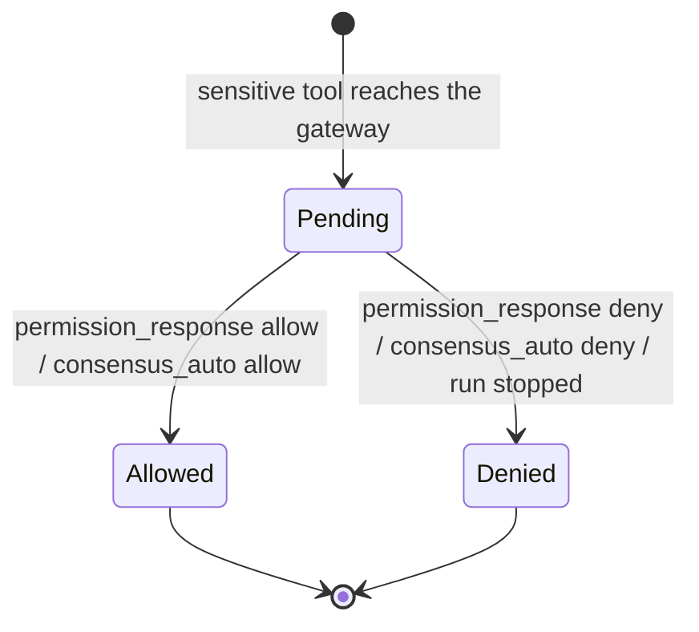

# Domain: permission-gateway

- **Group:** core
- **One-line:** 将敏感工具调用挡在决策之前，并把尚未被策略决定的请求路由到浏览器。
- **Owner:** maintainer
- **Status:** active
- **Depends on:** [agent-session](agent-session.md)（运行、推送通道、取消信号）；[workspace-setting](../settings/workspace-setting.md)（共识旋钮）。
- **Depended on by:** agent-session（按厂商能力把敏感调用交给网关）；[web-console](web-console.md)（渲染并回答）。
- **exposes-api:** false
- **notes:** 内部域。对外只经共享协议上的 `permission_request` / `permission_response` / `consensus_auto`。
- **ADRs:** [0005](../../architecture/adr/0005-inherit-user-project-settings.md)（网关而非唯一权威）、[0002](../../architecture/adr/0002-websocket-as-permission-transport.md)（WebSocket 作为权限传输）

## Overview

权限网关是 c3 的决策边界。智能体要运行一个被判定为敏感的工具时，网关把它变成一次待决：能被策略或共识合法解决的当场解决，否则路由到浏览器，阻塞该次工具，直到有人裁决或运行被拆除。

**范围:** 把一次工具调用与一次决策关联起来，并强制默认拒绝。
**边界:** 不驱动运行（[agent-session](agent-session.md)），不渲染 UI（[web-console](web-console.md)），不处理厂商凭据（[C-SEC-4](../../constitution.md)）。哪些工具算敏感、以及无逐工具审批的厂商如何在启动时门控，由 agent-session 规定。

## Business rules

- **PG-R1**: 每一次到达网关的敏感工具调用产生恰好一个带唯一 `requestId` 的 Permission Request。
- **PG-R2**: 请求阻塞该工具，直到被解决。人工路径无限期等待，无超时，与终端 CLI 的阻塞提示一致。
- **PG-R3**: 恰好两种人工侧解决途径：匹配的 `permission_response`（关联靠 `requestId`，切走视图仍可回答），或运行被停止（`stop_run` / 删除会话 / 移除工作区）。先到者获胜，另一个被丢弃。切换所查看的会话不会解决它。无法解析或未知的客户端消息忽略，不当作批准。
- **PG-R4**: 默认拒绝。没有显式 `allow` ⇒ 拒绝。运行停止会清除待决并以 `deny` 解决。
- **PG-R5**: 针对未知或已解决 `requestId` 的 `permission_response` 是空操作。人机问答的 `allow` 若答案不合法，请求保持待决，不带着半份答案恢复运行。
- **PG-R6**: `allow` 原样使用提议的工具输入；网关不是输入重写层。例外：人机问答把所选答案写入输入——这是无头环境下作答的唯一通道。
- **PG-R7**: `deny` 让厂商侧收到拒绝，该工具不得执行。
- **PG-R8**: 当前模式或厂商分类器视为不敏感的调用不到达网关。继承的宿主与项目允许规则可以自动批准浏览器从未见过的工具——这与直接使用对应 vendor CLI 一致（[ADR 0005](../../architecture/adr/0005-inherit-user-project-settings.md)、[C-SEC-1](../../constitution.md)）。
- **PG-R9**: 工作区启用多智能体共识且存在至少一名其他投票者时，常规闸门上的请求先交给那些投票者。形成生效规则下的裁决则经 `consensus_auto` 自动解决；否则回退人工并附上意见。失败、弃权、平局永不自动允许。产品边界见 [共识](#多智能体共识)。
- **PG-R12**: 厂商规则引擎在未经 c3/人类决策的情况下放行的调用，只打预批准审计标记，不发 `permission_request`，不构成第二条决策通道。
- **PG-R13**: 工具投票对投票者呈现厂商中立的操作描述，而不是原生工具名与原始输入。无法翻译则该轮全体弃权并交人，永不因此自动允许。

每次运行由调用方选定一种闸门策略。常规策略走「拦截 → 可选共识 → 人工」。只读、无人值守或写入受限的策略在网关内直接决定，不询问浏览器、不跑共识；允许面由拥有该运行的领域规定，未命中一律拒绝。挂载外部技能时，写类工具跳过共识、直达人工。

人工决策与共识自动裁决都留下可追溯记录；自动路径不计「待人处理」。审计失败不得打断已被放行的运行。

## States

一个 Permission Request 的生命周期:

没有其他状态。一旦离开 `Pending` 就不能回去。

## Domain events

网关不发出自己的业务事件。它产生 `permission_request` 与 `consensus_auto`，消费 `permission_response`。终态同步交回运行，不广播。形状见[共享协议](../../shared/api-conventions/websocket-protocol.md)。

## 数据模型

### Permission Request

一次到达网关的工具调用所对应的待决问题。关联键是 `requestId`。携带工具名与不透明输入——供人查看；网关不解释输入，人机问答作答除外。

状态：`Pending` → `Allowed` | `Denied`。一旦离开 `Pending` 不能回去。

不变量:

- 同一 `requestId` 至多一条待决。
- 由一次敏感调用产生，至多被一个 Decision 解决。
- 驻内存，不持久化。切走视图不取消它；run 拆除才取消。

### Permission Decision

一次请求的结果：`allow` | `deny`。

来源:

- 人（`permission_response`）
- 运行中止（恒为 `deny`）
- 共识自动裁决（`consensus_auto`）

人机问答的 `allow` 可附带逐题答案；答案不合法则不算一次 Decision，请求仍待决。

## 协作

**agent-session / Session Runtime.** 运行把到达网关的敏感调用交给本域，并提供推送通道与该 run 的取消信号。待决请求跟 run 走，不跟连接走（[ADR 0006](../../architecture/adr/0006-decouple-runs-from-connections.md)）：切走视图或关闭 socket 不解决、不拆除请求；回到该会话仍可按 `requestId` 作答。只有停止、删除会话或移除工作区才走中止 ⇒ `deny`。

无逐工具审批的厂商把门控落在启动策略上，调用到不了本网关。Cursor 的人机问答接到同一对 `permission_request` / `permission_response`，见 [Cursor](agent-session.md#cursor-能力边界)。

**web-console.** 消费 `permission_request` 与 `consensus_auto`，回 `permission_response`。控件如何排布由控制台拥有。

**workspace-setting.** 按工作区提供共识旋钮。网关用工作区根读取配置，不用本次运行的工作目录——worktree 与项目根不同时，按运行目录读会静默关掉共识。

## 关键取舍

**待决活在进程里，绑在 run 上。** 刷新或换连接必须还能回答同一个问题。代价是注册表占用进程内存、不持久化；进程退出即丢失待决（运行本身也在拆）。当前规模可接受。

**无限期阻塞，而不是超时自动拒绝。** 与 CLI 提示一致（[C-SEC-3](../../constitution.md)）。唯一的非用户解出路径是 run 被拆除。推送失败时请求保持待决，直到中止（仍为 deny）。

**网关不是唯一权威。** 继承规则与厂商预批准可以在浏览器看不见的情况下放行（[ADR 0005](../../architecture/adr/0005-inherit-user-project-settings.md)）。c3 保证的是：凡到达本网关且未被共识合法裁决的，默认拒绝。

## 非功能

人工等待无界。每一条解出路径都必须清掉待决，中止也不泄漏。运行与权限状态驻内存，不持久化。

## 多智能体共识

人工权限提示前的可选前置：先问其他已配置智能体该不该放行（或如何作答），只有未形成生效裁决时才问人。默认关闭。按**工作区**读取（启用、一致/多数、投票者集），不按本次运行的工作目录。无投票者则跳过，直接问人。

### 何时适用

仅常规闸门上、已经到达网关的敏感工具（含人机问答）。只读或无人值守闸门不跑共识。自动化检查点的继续/等待投票共用同一份工作区配置与投票者集，但由自动化编排拥有，不经本网关。

### 谁投票

除该会话自身外的已启用智能体，**不分厂商**。可选自定义名单按 id 收窄，不按厂商收窄。已禁用、名单为空或全部过期 ⇒ 零投票者 ⇒ 跳过。投票者集合在投票时刻冻结。

会话自身智能体是裁决者：负责一句话摘要；问答路径上还可判断字面分歧是否实质已达成共识。投票者与裁决者都是一次性、禁用工具的顾问回合，随该 run 中止而中断。

### 两类问题

- **工具允许/拒绝。** 投票者看到厂商中立的操作描述（PG-R13）。
- **人机问答。** 按题作答（选项或自定义）。已达成的题可自动填入；未达成的交给人，已一致的预填。全部达成才经 `consensus_auto` 自动作答。允许时仍遵守 PG-R6（只把答案写入输入）。

### 怎样算达成

- 缺省为**全体一致**（含无人弃权）。启用与多数决都是显式打开才生效。
- 打开多数决后：弃权不计，有效票的严格多数可通过；平局、无明确多数、全弃权 ⇒ 问人。
- 投票者出错、超时、无法解析 ⇒ 弃权。问答路径上，裁决者挽救失败则该题仍交人。
- 运行在共识窗口内被拆除 ⇒ 直接 `deny`，不发出无人可答的 `permission_request`。

形成裁决则发 `consensus_auto`，并留下一条不计待办的审计记录；否则发带意见的 `permission_request`。共识缩短一致情形下的人工步骤，不取消分歧时的人类否决权。
