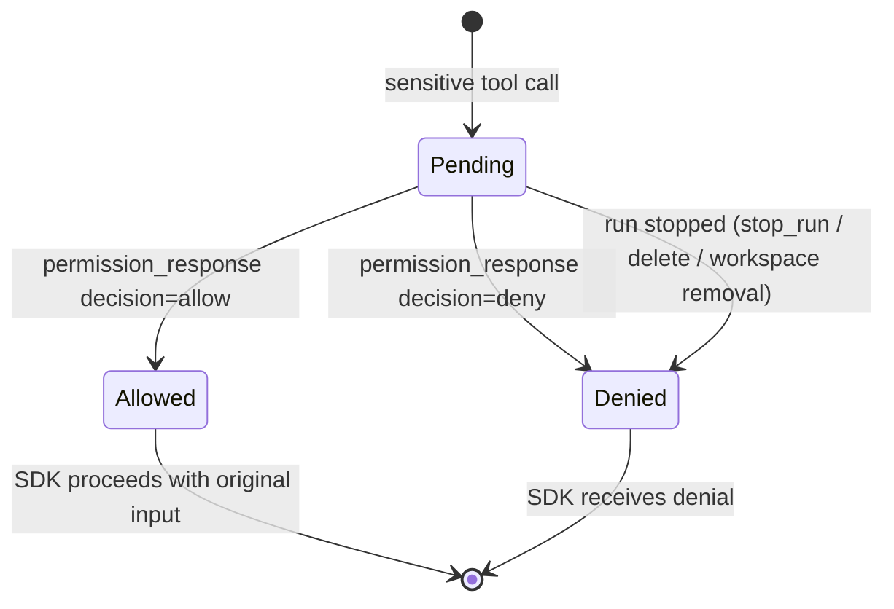

# permission-gateway — 域规格

## Overview

权限网关是 c3 的决策边界。当智能体想要运行一个被 SDK 判定为敏感的工具时，
网关会把它转化为一个提给人类的问题，等待答案，并把 `allow` 或 `deny` 报告
回 SDK。它正是那个使 c3 成为"Claude Code 工具使用被批准之处"的机制。

**Scope:** 把单次工具调用与单次人类决策关联起来，并强制执行默认拒绝的结果。
**Boundary:** 它不运行智能体(那是 agent-session 的职责)，也不渲染任何东西
(那是 web-console 的职责)。

## Core entities

| Entity              | Description                | Key attributes                                |
| ------------------- | -------------------------- | --------------------------------------------- |
| Permission Request  | 关于一次工具调用的待决问题 | `requestId`、`toolName`、`input`              |
| Permission Decision | 一次请求的解决结果         | `allow` \| `deny`，source(`user` \| `abort`） |

完整属性见 [permission-gateway-models.md](permission-gateway-models.md)。

## Business rules

| ID     | Rule                                                                                                                                                                                                                                                                                                                                                                                                                                                                                                                                                                                                                                                                                                                                                                                                                                                                                                                                                                                                                                                                                                                                                                                                                                                                                                                                                                   |
| ------ | ---------------------------------------------------------------------------------------------------------------------------------------------------------------------------------------------------------------------------------------------------------------------------------------------------------------------------------------------------------------------------------------------------------------------------------------------------------------------------------------------------------------------------------------------------------------------------------------------------------------------------------------------------------------------------------------------------------------------------------------------------------------------------------------------------------------------------------------------------------------------------------------------------------------------------------------------------------------------------------------------------------------------------------------------------------------------------------------------------------------------------------------------------------------------------------------------------------------------------------------------------------------------------------------------------------------------------------------------------------------------- |
| PG-R1  | 每一次敏感工具调用都会产生恰好一个带唯一 `requestId` 的 Permission Request。                                                                                                                                                                                                                                                                                                                                                                                                                                                                                                                                                                                                                                                                                                                                                                                                                                                                                                                                                                                                                                                                                                                                                                                                                                                                                           |
| PG-R2  | Permission Request 会阻塞智能体在该工具上的推进，直到被解决为止。它**无限期等待**人类——没有超时，与终端 CLI 的阻塞式提示一致。                                                                                                                                                                                                                                                                                                                                                                                                                                                                                                                                                                                                                                                                                                                                                                                                                                                                                                                                                                                                                                                                                                                                                                                                                                         |
| PG-R3  | 一个请求恰好以两种方式之一解决:来自浏览器的匹配 `permission_response`(只要用户回到该会话就可回答，因为关联是靠 `requestId`)，或运行被停止(`stop_run` / 删除 / 工作区移除）。先到者获胜；另一个被丢弃。切换所查看的会话**不会**解决它。                                                                                                                                                                                                                                                                                                                                                                                                                                                                                                                                                                                                                                                                                                                                                                                                                                                                                                                                                                                                                                                                                                                                 |
| PG-R4  | 默认结果是**拒绝**:没有显式 `allow` ⇒ 拒绝。运行被停止会清除待决请求并将其解决为 `deny`(结果无关紧要——运行正在被拆除）。                                                                                                                                                                                                                                                                                                                                                                                                                                                                                                                                                                                                                                                                                                                                                                                                                                                                                                                                                                                                                                                                                                                                                                                                                                               |
| PG-R5  | 针对未知或已解决的 `requestId` 的 `permission_response` 是空操作。                                                                                                                                                                                                                                                                                                                                                                                                                                                                                                                                                                                                                                                                                                                                                                                                                                                                                                                                                                                                                                                                                                                                                                                                                                                                                                     |
| PG-R6  | `allow` 让 SDK 用**原始、未修改**的工具输入继续执行。网关不会重写工具输入。**例外:**对于 `AskUserQuestion`，所选的 `answers`(来自共识自动作答或人工作答面板)会被注入到 input 中——这是回答该提示的唯一无头通道。见[共识](features/permission-gateway-consensus.md)。                                                                                                                                                                                                                                                                                                                                                                                                                                                                                                                                                                                                                                                                                                                                                                                                                                                                                                                                                                                                                                                                                                    |
| PG-R7  | `deny` 会向 SDK 返回一个拒绝理由("User denied in c3 UI")。                                                                                                                                                                                                                                                                                                                                                                                                                                                                                                                                                                                                                                                                                                                                                                                                                                                                                                                                                                                                                                                                                                                                                                                                                                                                                                             |
| PG-R8  | 只读/无关紧要的工具永远不会到达网关——SDK 会在当前生效模式下自动允许它们，且不发出请求。(哪些工具算在内取决于权限模式；见 agent-session spec）。                                                                                                                                                                                                                                                                                                                                                                                                                                                                                                                                                                                                                                                                                                                                                                                                                                                                                                                                                                                                                                                                                                                                                                                                                        |
| PG-R9  | 当**多智能体共识**被启用(系统设置)且除该会话自身之外还存在至少一个其他智能体时，一个请求会先被提交给那些其他智能体。若它们**一致同意**，则以它们的裁决自动解决(一个 `consensus_auto` 事件会记录其过程）；任何分歧或弃权都会回退到人工提示(PG-R1–R7)并附上它们的意见。共识是尽力而为的:出错的投票者会弃权，这属于非一致，因此会回退到人类(默认拒绝的方向保持不变）。对于 `AskUserQuestion`，投票者转而**回答每个问题**(选项标签或自定义回复）；若按字面统计存在分歧的问题，在**裁决者**智能体判定投票者实际已达成共识并给出经重新校验的答案(`decidedByAgent`)时，可被挽救。每个已达成一致的问题(经投票或裁决者)⇒ 自动作答，否则由人类填写预填了已达成一致问题的答案面板。见[共识](features/permission-gateway-consensus.md)。                                                                                                                                                                                                                                                                                                                                                                                                                                                                                                                                                                                                                                           |
| PG-R12 | **preApproved 审计。** 一个厂商自身规则引擎(或外部客户端)在**没有** c3/人类决策的情况下做出的决策——表现为一个 c3 从未 asked-and-wrote 的 id 的厂商"permission replied"事件——会通过规范消息上的一个顶层 pre-approved 标记记录进审计留痕(请求/响应流仍走批准桥，从不进入消息模型）。它作为一个可观测性标记出现，而非第二条决策路径。(2026-06-06-003)该标记现在会**穿过链路**(在工具使用帧上——driver 路径在首次可见时携带这个粘性的消息级标记)，因此 web-console 会用不同颜色区分"预批准的工具"与"c3/人类门控的 `allow`"：这种双色溯源明确地表明**c3 是一个网关，而非唯一的权限权威**(取代了已废弃的 ADR-0001"唯一权威"立场——一个厂商规则引擎可以在从未到达提示之前就预批准）。一个预批准的工具**不会**发出 `permission_request`，因此这两种颜色在同一个界面上永远不会冲突。(2026-06-06-004)                                                                                                                                                                                                                                                                                                                                                                                                                                                                                                                                                                              |
| PG-R13 | **共识投票通过风险归一化实现跨厂商。** PG-R9 下的投票从**每一个启用的非自身智能体、不分厂商**中抽取(一个共享的参与者选择器，同时也被 `AskUserQuestion` 投票与自动化检查点投票使用；`custom` 允许清单仅按 id 收窄，从不按厂商收窄）。为使一个工具请求可被不同厂商的投票者判断，服务器在 fan-out **之前**对其进行**归一化**:一个从 `(requesting vendor, native tool name, input)` 到一个厂商中立载荷的确定性映射——一个稳定的 `operationIntent`、一个结构化提取的 `resourceScope`(路径 / 命令目标 / 远程主机或 URL）、四个基础风险轴(`read`/`write`/`execute`/`network`)，以及一个 `normalizationVersion`。投票者只看到这个中立载荷——从不看到原生工具名或原始输入。归一化是失败即关闭且从不抛出的:未知工具、缺失关键目标、无效的输入形状，或任何内部错误都会返回一个稳定的原因码，且该轮会把每个被选中的投票者记为**弃权**(不发起顾问调用)⇒ 空裁决 ⇒ 人工提示(PG-R4 默认拒绝得以保留；归一化失败**永远不会**自动允许）。一次成功的归一化会原样进入既有的计票——`write`/`execute`/`network` 轴是描述性的，而非硬性拒绝。结果携带归一化后的载荷(或失败原因)以及每个投票者的厂商，供诚实的控制台/审计展示；旧的"共识限 \<vendor\> 内"范围标记已被移除。`AskUserQuestion` 投票与检查点 continue/wait 投票已经是厂商中立的，会跳过归一化。新增一个原生工具意味着要先添加一条归一化规则；在此之前它会安全降级为弃权 + 人工批准。(2026-07-09，取代 2026-06-06-006 的厂商同构规则) |

## States & transitions

一个 Permission Request 的生命周期:

没有其他状态。一个请求一旦被解决，就不能回到 `Pending`。

## Vendor approval mechanisms (2026-06-06-003)

网关的契约是厂商中立的；每个厂商适配器把自己原生的权限概念翻译成它
(ADR-0011，approval bridge)。存在两种参考机制:

- **Claude——环内。** SDK 阻塞式的敏感工具回调本身就是挂起点；"回写"就是解出
  那个 promise。c3 在自己的进程内部阻塞(PG-R2 逐字成立）。
- **环外厂商。** 厂商把一个待决权限作为带外事件发出；桥接会挂起一个以厂商
  权限 id 为键的 promise，发出 `permission_request`，并在人类决策后把结果
  回写到厂商的权限端点(allow / deny）。因为厂商不拥有该生命周期，桥接会
  承担厂商不承担的职责(PG-R11):超时、回写重试 + 过期 404 处理、事件重新
  订阅(没有"列出待决权限"端点可供对账)，以及回复幂等性。一个 c3 从未
  发起过的回复会被作为预批准审计记录(PG-R12）。

两者都到达**同一个**浏览器注册表(`permission_request` + 等待决策的路径），
因此人类体验与默认拒绝不变式在各厂商间是一致的。

## Domain events

网关不发出自己的业务事件。它在链路上产生一个 `permission_request`(由
`web-console` 消费)并消费 `permission_response`。终态结果是同步返回给 SDK
的，不做广播。

## Interactions

- **agent-session** 提供发送通道(用于推送请求)与传输；它从 SDK 的敏感工具
  回调中调用网关。
- **web-console** 渲染请求并发送决策。
- **Claude Agent SDK** 是阻塞在网关解决结果上的调用方。

## Invariants

- **每个请求至多一个结果**(PG-R3)。解决两次不得导致双重解决，也不得泄漏
  待决条目 / abort 监听器。
- **默认拒绝**(PG-R4)是绝对的:没有显式 allow ⇒ 拒绝。

## Data dictionary

- **Pending request** —— 一个等待解决的请求；在一个内存注册表中被跟踪。
- **Stale id** —— 一个没有待决条目的 `requestId`(已解决或从未存在过）。
