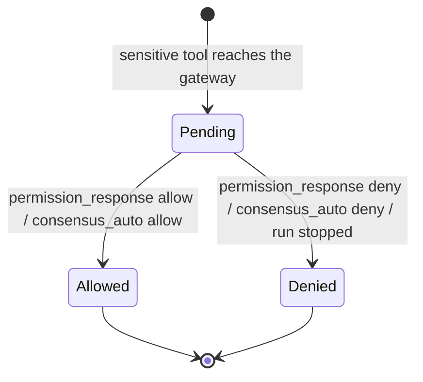

# permission-gateway — 领域规格

## Overview

权限网关是 c3 的决策边界。智能体要运行一个被判定为敏感的工具时，网关把它变成一次待决：能被策略或共识合法解决的当场解决，否则路由到浏览器，阻塞该次工具，直到有人裁决或运行被拆除。

**范围:** 把一次工具调用与一次决策关联起来，并强制默认拒绝。
**边界:** 不驱动运行（[agent-session](../agent-session/agent-session-spec.md)），不渲染 UI（[web-console](../web-console/web-console-spec.md)），不处理厂商凭据（[C-SEC-4](../../../constitution.md)）。哪些工具算敏感、以及无逐工具审批的厂商如何在启动时门控，由 agent-session 规定。

实体见 [permission-gateway-models.md](permission-gateway-models.md)。

## Business rules

- **PG-R1**: 每一次到达网关的敏感工具调用产生恰好一个带唯一 `requestId` 的 Permission Request。
- **PG-R2**: 请求阻塞该工具，直到被解决。人工路径无限期等待，无超时，与终端 CLI 的阻塞提示一致。
- **PG-R3**: 恰好两种人工侧解决途径：匹配的 `permission_response`（关联靠 `requestId`，切走视图仍可回答），或运行被停止（`stop_run` / 删除会话 / 移除工作区）。先到者获胜，另一个被丢弃。切换所查看的会话不会解决它。无法解析或未知的客户端消息忽略，不当作批准。
- **PG-R4**: 默认拒绝。没有显式 `allow` ⇒ 拒绝。运行停止会清除待决并以 `deny` 解决。
- **PG-R5**: 针对未知或已解决 `requestId` 的 `permission_response` 是空操作。人机问答的 `allow` 若答案不合法，请求保持待决，不带着半份答案恢复运行。
- **PG-R6**: `allow` 原样使用提议的工具输入；网关不是输入重写层。例外：人机问答把所选答案写入输入——这是无头环境下作答的唯一通道。
- **PG-R7**: `deny` 让厂商侧收到拒绝，该工具不得执行。
- **PG-R8**: 当前模式或厂商分类器视为不敏感的调用不到达网关。继承的宿主与项目允许规则可以自动批准浏览器从未见过的工具——这与直接使用对应 vendor CLI 一致（[ADR 0005](../../../architecture/adr/0005-inherit-user-project-settings.md)、[C-SEC-1](../../../constitution.md)）。
- **PG-R9**: 工作区启用多智能体共识且存在至少一名其他投票者时，常规闸门上的请求先交给那些投票者。形成生效规则下的裁决则经 `consensus_auto` 自动解决；否则回退人工并附上意见。失败、弃权、平局永不自动允许。产品边界见 [共识](features/permission-gateway-consensus.md)。
- **PG-R12**: 厂商规则引擎在未经 c3/人类决策的情况下放行的调用，只打预批准审计标记，不发 `permission_request`，不构成第二条决策通道。
- **PG-R13**: 工具投票对投票者呈现厂商中立的操作描述，而不是原生工具名与原始输入。无法翻译则该轮全体弃权并交人，永不因此自动允许。

每次运行由调用方选定一种闸门策略。常规策略走「拦截 → 可选共识 → 人工」。只读、无人值守或写入受限的策略在网关内直接决定，不询问浏览器、不跑共识；允许面由拥有该运行的领域规定，未命中一律拒绝。挂载外部技能时，写类工具跳过共识、直达人工。

人工决策与共识自动裁决都留下可追溯记录；自动路径不计「待人处理」。审计失败不得打断已被放行的运行。

## States

一个 Permission Request 的生命周期:

```mermaid
stateDiagram-v2
    [*] --> Pending: sensitive tool reaches the gateway
    Pending --> Allowed: permission_response allow / consensus_auto allow
    Pending --> Denied: permission_response deny / consensus_auto deny / run stopped
    Allowed --> [*]
    Denied --> [*]
```

没有其他状态。一旦离开 `Pending` 就不能回去。

## Domain events

网关不发出自己的业务事件。它产生 `permission_request` 与 `consensus_auto`，消费 `permission_response`。终态同步交回运行，不广播。形状见[共享协议](../../../shared/api-conventions/websocket-protocol.md)。

## Interactions

- **agent-session** — 调用网关，提供推送通道与该 run 的取消信号。
- **web-console** — 渲染请求并发送决策。
- **workspace-setting** — 共识是否启用、多数决、投票者集。
