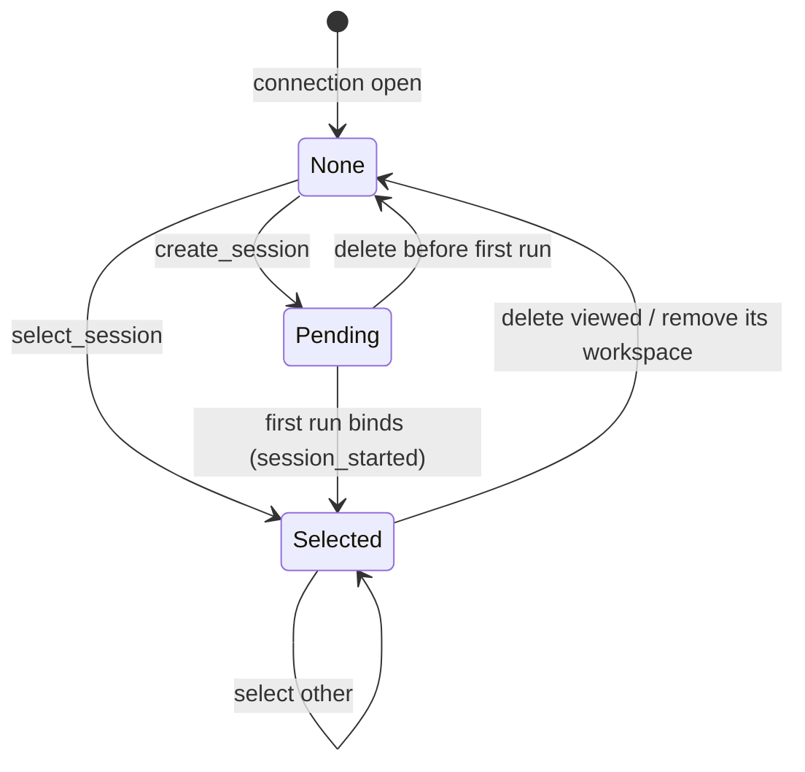

# Domain: session-registry

- **Group:** core
- **One-line:** 工作区与会话目录：不可变身份、最近访问、每会话模式，以及从厂商原生存储回放历史。
- **Owner:** maintainer
- **Status:** active
- **Depends on:** 厂商原生存储（转录事实来源）；[agent-session](agent-session.md)（runtime、回放缓冲）；[agent-config](../settings/agent-config.md)（绑定与厂商冻结）。
- **Depended on by:** [web-console](web-console.md)（侧边栏）；[files](files.md)（工作区根）；agent-session（工作目录 / 模式 / resume）；intent-management、automations、memory、delivery（工作区身份）。
- **exposes-api:** true — WebSocket `/ws`。消息形状在[共享协议](../../shared/api-conventions/websocket-protocol.md)中定义。
- **ADRs:** [0004](../../architecture/adr/0004-persist-workspace-session-registry.md) 持久化目录、[0006](../../architecture/adr/0006-decouple-runs-from-connections.md) 查看不是所有权、[0013](../../architecture/adr/0013-canonical-envelope-on-wire-c3-session-namespace.md) 原生存储为转录真源、[0015](../../architecture/adr/0015-session-agent-binding-vendor-ownership.md) 绑定冻结厂商、[0042](../../architecture/adr/0042-configuration-in-database.md) 实例库为配置真源

## Overview

session-registry 是工作台的档案柜：把项目目录登记为**工作区**，把各厂商会话列成统一**目录**，记住每会话权限模式与最近访问，并在选择时从厂商原生存储回放历史。

工作区身份是不可变的名称（[术语](../../glossary.md)）；磁盘路径只表示位置，不回传为身份。新路径在服务端本机用目录对话框选择，没有图形界面时由用户填写。会话目录按业务种类分页，最新优先；「规范」一列同时展示规格撰写与评审。转录只存在于厂商原生存储，c3 不双写。连接上的已查看会话是视图，不是运行所有权（[ADR 0006](../../architecture/adr/0006-decouple-runs-from-connections.md)）。

**范围:** 工作区登记与排序、会话增删改选、每会话模式、最后活跃提示、选择时的历史回放。
**边界:** 不驱动运行（[agent-session](agent-session.md)），不渲染 UI（[web-console](web-console.md)），不持有权限决策。

## Business rules

- **SR-R1**: 工作区必须是已存在的目录。`add_workspace` 对非目录以 `error` 拒绝，不产生变更。
- **SR-R2**: 工作区目录持久化，按最近访问降序。名称全局唯一且创建后不可变；同一目录不得登记两次。
- **SR-R3**: 在工作区内选择或创建会话，推高该工作区的最近访问。
- **SR-R4**: 会话目录是可重建的投影，按最近修改最新优先。厂商原生存储是存在性、标题与转录的事实来源；c3 不双写转录（[ADR 0013](../../architecture/adr/0013-canonical-envelope-on-wire-c3-session-namespace.md)）。只列出本目录已跟踪的行。工作列排除其他域声明隐藏的沟通会话；工具会话默认不进工作列，与角标同一规则。
- **SR-R5**: 权限模式按会话持久化。新会话取该工作区该厂商的默认，再回退到厂商目录默认。`set_mode` 只改当前会话，并按该厂商目录校验；目录外的历史值降为工作区默认并写回，保证下拉与生效策略一致。
- **SR-R6**: `create_session` 把一个尚未落盘的 pending 会话设为已查看，历史为空，模式为按厂商默认。不停止其他运行。
- **SR-R7**: 首次运行把 pending 绑到厂商原生 id，发出 `session_started`，并在该 id 下持久化模式。绑定同时冻结会话厂商（[agent-config](../settings/agent-config.md)、[ADR 0015](../../architecture/adr/0015-session-agent-binding-vendor-ownership.md)）。从未运行的 pending 只留下可变意向，不产生真实会话。
- **SR-R8**: `select_session` 把该会话设为已查看，并重放完整记录：原生存储基线加上 runtime 实时缓冲。报告存储的模式与权威 runtime `status`。不停止运行。只能选择目录里已有的行。解不出的事件跳过，选择不失败。回放读的是该会话写入时的那份原生存储（[ADR 0030](../../architecture/adr/0030-session-store-scope-vendor-neutral-data-root.md)）。
- **SR-R9**: `delete_session` 停止该会话运行，按厂商能力移除转录，并去掉其模式。若它是已查看或最后活跃，该提示清除。
- **SR-R10**: `remove_workspace` 从目录取消注册并停止其下后台运行，不删除磁盘转录。已查看会话清除。身份保留，同一目录再登记时恢复原名称与配置。
- **SR-R11**: 权限决策从不持久化。本域只持久化工作区与会话元数据（[ADR 0004](../../architecture/adr/0004-persist-workspace-session-registry.md)）。
- **SR-R12**: 跨厂商列表是一条统一时间线，不按厂商分组。行标记所属厂商；标题保持各厂商原样。
- **SR-R13**: 绑定与运行结束都会刷新该行的近期程度，刚发生的会话排到顶部。没有观察连接的创建仍向每个连接扇出最新一页，不重置客户端已加载的更旧窗口。
- **SR-R14**: 会话列表按种类分页加载，从不整表返回。首次是最新页，随后可加载更旧页，刷新只更新已展示范围。列表与角标共用同一套过滤，每个会话只计一次。删除与重命名不推整页列表。
- **SR-R15**: 显示分类可以覆盖多个真实 kind。会话页「规范」= `spec` + `spec_review`，同一条时间线。分类只是查询口径；行仍带真实 `sessionKind`。有所有者的行打开所属域；`spec_review` 经意图管理的只读入口打开，不走通用 `select_session`。`robot` 不进会话页。
- **SR-R16**: 意图接力的评审 / 修复会话以 `work` + 意图归属出现，不进「自动化」。工作区仍是原项目。自动化自己的执行行仍是 `automation`。二者由写入投影时声明的种类区分，不由谁启动区分。
- **SR-R17**: 会话分类角标、业务条目角标、工作区运行中总数是三个互不替代的数。分类角标按会话页可见分类计运行中会话：`spec` 含撰写与评审，`spec_review` 不单独成桶；`tool` 随显示开关；`consensus` 与 `robot` 不进会话页。条目角标按所有者去重——任一所属会话在跑则该意图或讨论计 1；隐藏的工具会话仍点亮其所有者；自动化条目只认可展示的在途 llm 执行，与列表绿点同一规则。工作区运行中总数跨全部真实种类（含 tool / spec_review / consensus / robot），不受工具显示开关影响，按目录中持有活跃 run 的会话计；仅有执行日志、没有活跃 run 的自动化会话不计入此数。工作台总览的运行中数是非空闲 runtime 与在途自动化执行会话的并集，与工作区总数可以不同。

## States

### 已查看会话（每连接）

切换不结束运行（[agent-session](agent-session.md)）；只改这个连接的视图。持久化的最后活跃会话是重启后打开谁的提示，不是一次实时运行。

## Domain events

消费 `add_workspace`、`select_workspace_directory`、`cancel_workspace_directory_selection`、`remove_workspace`、`list_sessions`、`create_session`、`select_session`、`rename_session`、`delete_session`、`set_mode`。发出 `ready`、`workspaces`、`workspace_directory_selection`、`sessions`、`session_selected`、`session_started`、`mode_changed`、`error`。`session_status` 属于 agent-session。形状见[共享协议](../../shared/api-conventions/websocket-protocol.md)。

## 数据模型

### Workspace

一个已登记的项目目录。身份是不可变的工作区名称；路径是该智能体的工作目录，也是会话枚举所依据的位置，不是身份。

不变量:

- 名称全局唯一、创建后不可变；路径指向已存在的目录，且同一路径只对应一个身份。
- 按最近访问排序；在其中选择或创建会话会推高自己。
- 从目录取消登记不删除身份、配置或磁盘转录；同一路径再登记时恢复原名称。
- 零个或多个 Session。

### Session

工作区内一次由厂商托管的对话。对外以不透明 c3 会话 id 寻址（[ADR 0013](../../architecture/adr/0013-canonical-envelope-on-wire-c3-session-namespace.md)）。

真实种类：`work` / `intent` / `spec` / `spec_review` / `discussion` / `automation` / `tool` / `robot`（及内部 `consensus`）。会话页按显示分类列目录，「规范」同时含 `spec` 与 `spec_review`；`robot` 不进会话页。

不变量:

- 转录、标题与存在性由所属厂商的原生存储拥有；本域拥有目录成员资格与权限模式。
- 所有者是跳回指针，不是意图 / 讨论 / 自动化等域的事实来源。
- 种类与所有者由写入投影的调用方声明；本域不因启动机制改写它们。
- 厂商在首次绑定时冻结，之后不能改。

### Pending Session

在 UI 中创建、尚未首次运行的会话。历史为空；首次运行绑到真实 Session，意向变为事实。从未运行则只留下可变意向，不产生真实会话。

## 协作

**agent-session.** 播种工作目录、每会话模式与 resume id。pending 绑定时把真实 id 交回 runtime；选择会话时从原生存储取基线，再叠 runtime 缓冲。运行是否存活、状态如何广播，由 agent-session 拥有（[ADR 0006](../../architecture/adr/0006-decouple-runs-from-connections.md)）。

**web-console.** 消费 `workspaces` / `sessions` / `session_selected`，发送登记与选择。控件如何排布由控制台拥有。目录点选发出 `select_workspace_directory`；选择发生在服务端所在机器，没有图形界面则改由用户填写路径。

**files.** 只读浏览以已登记工作区名解析根路径。本域提供名称到路径的映射，不解释相对路径。

**厂商原生存储.** 转录、标题与存在性的事实来源。目录投影可从各厂商枚举重建。重命名与删除能做多少，取决于该厂商会话存储的能力。

**其他写入方.** 意图、讨论、自动化等在绑定时声明投影行的种类与所有者。本域按声明列目录，不推断「谁启动的」。

## 关键取舍

**投影，而不是每次扫原生存储。** 目录与角标走可重建投影，避免每次打开侧边栏扫描所有厂商磁盘。代价是绑定与落定必须刷新近期程度，后台创建必须扇出，否则新会话会沉底或只被一个连接看见。转录仍只在原生存储，c3 不双写（[ADR 0013](../../architecture/adr/0013-canonical-envelope-on-wire-c3-session-namespace.md)）。

**查看不是所有权。** 连接只记住正在看谁；运行活在进程里。切换与关闭 socket 不停止运行；删除会话或移除工作区才停。工作区从目录拿掉仍保留身份与磁盘转录，避免配置变孤儿、历史被误删（[ADR 0004](../../architecture/adr/0004-persist-workspace-session-registry.md)）。

**只持久化本域元数据。** 工作区身份、最近访问、每会话模式、最后活跃提示。权限决策不落盘。实例库不可用则空目录启动，进程仍能起来（[ADR 0042](../../architecture/adr/0042-configuration-in-database.md)）。

## 非功能

跨会话无固定上限。过期的模式条目读取时忽略。列表分页，不把整个目录一次性推给客户端。
