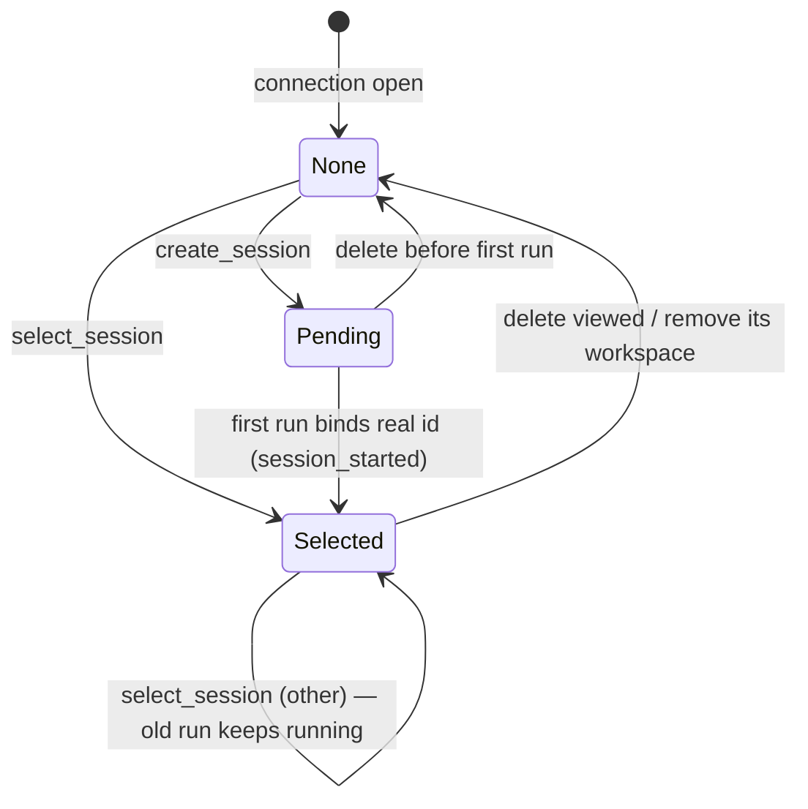

# session-registry — 域规格

## 概览

session-registry 管理侧边栏中呈现的工作区与会话。一个
**工作区(workspace)**是一个项目目录(智能体的工作目录);一个**会话(session)**是其中的一次 Claude
对话,由智能体厂商持久化。registry 拥有厂商不跟踪的 c3 专属元数据 —— 工作区列表、最近访问顺序、每会话权限模式,以及最后
活跃的会话 —— 并跨重启持久化它(ADR 0004）。

每个连接一次只查看一个会话(其**已查看会话**);这是一种查看,而不是运行
所有权。选择一个会话从不会停止一次运行 —— 运行存活于 session-runtime registry 中
(agent-session,ADR 0006）。持久化的 `activeSessionId` 只是关于重启后重新打开哪个
会话的提示。

**范围:** 工作区注册与排序、会话枚举/创建/选择/重命名/删除、
每会话模式、最后活跃跟踪,以及选择时的历史重放。
**边界:** 它不驱动智能体运行循环,也不拥有运行生命周期(agent-session 拥有),
且不持有任何权限状态。

## 核心实体

| 实体            | 说明                                                                                                                                                                         |
| --------------- | ---------------------------------------------------------------------------------------------------------------------------------------------------------------------------- |
| Workspace       | 一个已注册的项目目录:`path`、显示用的 `name`、`lastAccessed`(排序键）                                                                                                        |
| Session         | 工作区内的一次对话:原生 `sessionId`、`title`、`lastModified`、c3 的 `mode`,以及 `vendor`(拥有该会话的厂商标记 —— ADR-0013 跨厂商列表)                                        |
| Pending Session | 在 UI 中创建但尚未启动的会话;在其首次运行把它绑定到一个真实的厂商原生 id 之前,使用 `pending:<uuid>` id。运行前可以持有一个可变的智能体**意图(intent)**(agent-config AC-R16） |

见 [session-registry-models.md](session-registry-models.md)。

## 业务规则

| ID     | 规则                                                                                                                                                                                                                                                                                                                                                                                                                                                                                                                                                                                                                                                                                                                                                                                                                                                                                                                        |
| ------ | --------------------------------------------------------------------------------------------------------------------------------------------------------------------------------------------------------------------------------------------------------------------------------------------------------------------------------------------------------------------------------------------------------------------------------------------------------------------------------------------------------------------------------------------------------------------------------------------------------------------------------------------------------------------------------------------------------------------------------------------------------------------------------------------------------------------------------------------------------------------------------------------------------------------------- |
| SR-R1  | 一个工作区必须是一个已存在的目录。对非目录执行 `add_workspace` 会被以 `error` 拒绝,且不会产生任何变更。                                                                                                                                                                                                                                                                                                                                                                                                                                                                                                                                                                                                                                                                                                                                                                                                                     |
| SR-R2  | 工作区 registry 是持久化的,并按 `lastAccessed` 降序排序 —— 最近访问的排在最前。                                                                                                                                                                                                                                                                                                                                                                                                                                                                                                                                                                                                                                                                                                                                                                                                                                             |
| SR-R3  | 在一个工作区中选择或创建一个会话,会推高该工作区的 `lastAccessed`(重新排序侧边栏）。                                                                                                                                                                                                                                                                                                                                                                                                                                                                                                                                                                                                                                                                                                                                                                                                                                         |
| SR-R4  | 工作区内的会话是从 c3.db 中的一个 session-metadata 投影缓存(ADR-0013 修订)列出的,按 `last_modified` 最新优先。该投影是一个可重建的缓存 —— 原生厂商存储仍然是存在性、历史和标题的事实来源。每个被列出的会话条目携带其所属的 `vendor` 标记,以及一个新增的 `state` 字段(`born`/`alive`/`stale`/`orphaned`/`ghost`）。线上的 `sessionId` 保持为厂商**原生**id(线上的 c3 命名空间是一个推迟到后续阶段的 ADR-0013 阶段）。一个环境变量标志可以把列表逻辑回滚到旧版仅限 claude 的枚举路径。按厂商的枚举访问器是重建/惰性校验来源;Codex 行既可以在绑定时被填充,也可以通过重建本地 Codex transcript 枚举来填充,并按 SR-R13 打上 `last_modified` 戳。                                                                                                                                                                                                                                                                                 |
| SR-R5  | 权限模式是**按会话**的、被持久化的,默认值为该项目的按厂商默认模式(该默认模式本身又回退到每个厂商各自的默认模式令牌）。变更活跃会话的模式(`set_mode`)只影响该会话,并会针对该会话的厂商模式目录进行校验。                                                                                                                                                                                                                                                                                                                                                                                                                                                                                                                                                                                                                                                                                                                     |
| SR-R6  | `create_session` 会把一个 Pending Session 设为已查看会话,历史为空,模式为按厂商的**默认模式**(回退到该厂商的默认模式令牌）。它拥有一个 `pending:` id,尚未落盘。它**不会**停止任何其他会话的运行。                                                                                                                                                                                                                                                                                                                                                                                                                                                                                                                                                                                                                                                                                                                            |
| SR-R7  | 在一个 Pending(或新 fork 出的)会话首次运行时,registry 会把其客户端 id 绑定到真实的 SDK `sessionId`(`session_started`),并在该 id 下持久化模式。绑定会为 runtime 重新定键(AS-R10)**并**冻结 会话→智能体 这一事实:待处理的智能体意图变为一个真实-id 事实,其**厂商被冻结**为该会话生命周期内不变(agent-config AC-R16,ADR-0015）。一个从未运行过的 pending 会话只会留下一个可变的意图(7 天后被回收,AC-R17);意图的消亡永远不会产生一个真实-id 事实。                                                                                                                                                                                                                                                                                                                                                                                                                                                                              |
| SR-R8  | `select_session` 会把该会话设为已查看会话,并重放其完整记录:`session_selected.history`(磁盘上的基线)加上该 runtime 的实时缓冲区尾部(针对一个进行中/后台的 turn）。它上报该会话存储的模式,以及其权威的 runtime `status`(`session_selected.status`),客户端据此为该会话播种其每会话状态,使输入框能立即锁定,而不必等待一次 `session_status` 广播。它**不会**停止任何运行。(对一个投影从未见过的、外部启动的会话按 id 恢复 —— 即那个针对不可枚举厂商的 select 消息上的旧版厂商提示 —— 已被**移除**;只有 c3 已经跟踪的会话,包括通过其投影行(SR-R13)的 Codex 会话,才可被选择。)                                                                                                                                                                                                                                                                                                                                                     |
| SR-R9  | `delete_session` 会停止该会话的运行,通过 SDK 移除其 transcript,并去掉其模式条目。如果它是已查看/最后活跃会话,该状态会被清除。                                                                                                                                                                                                                                                                                                                                                                                                                                                                                                                                                                                                                                                                                                                                                                                               |
| SR-R10 | `remove_workspace` 会取消注册一个目录并停止其下所有后台运行,但从不会删除磁盘上的会话。其中一个已查看会话会被清除。                                                                                                                                                                                                                                                                                                                                                                                                                                                                                                                                                                                                                                                                                                                                                                                                          |
| SR-R11 | 权限决策/批准**从不**被持久化 —— 只有工作区/会话元数据(ADR 0004、0001）。                                                                                                                                                                                                                                                                                                                                                                                                                                                                                                                                                                                                                                                                                                                                                                                                                                                   |
| SR-R12 | 跨厂商列表是一条统一的**时间线**,从不按厂商硬性分组:一条按 `last_modified`(UTC 毫秒)服务端排序的、最新优先的单一流(缺失/空 `last_modified` 的行会被沉到底部,但**绑定与运行结束都会为其打上 `last_modified` 戳** —— 见 SR-R13 —— 因此一个刚绑定/刚活跃的会话会排到**顶部**,而不是底部),通过从(vendor, vendor-native id)这对键最小化出的一个不透明 c3 会话 id 作为主键自然去重。标题**不会**在厂商之间被规范化;每一行都会标记其标题的归属厂商(一个 ⓘ "标题由 {vendor} 提供" 的提示）。UI 通过每行一个颜色点和顶部的一个**厂商过滤器**来呈现厂商身份(默认全部显示,客户端侧,纯粹只过滤哪些厂商参与这条单一流）。Codex 没有 SDK 列表 API,但 c3 通过扫描 `~/.codex/sessions/` 来枚举已知的本地 Codex transcript;工作区 cwd 匹配的会话会出现在同一条统一时间线中。(针对从未见过的外部 Codex 会话的旧版内联"粘贴一个会话 ID 来恢复"回退方案已被移除 —— 见 SR-R8。)                                                                  |
| SR-R13 | **一个刚绑定或刚活跃的会话会排到列表顶部。** 投影的 `last_modified` 是列表的排序键,因此它必须反映近期程度:绑定会把它戳记为**绑定时刻**(所有厂商,包括 Codex),运行结束的触碰会把它戳记为**运行结束时刻** —— 永不为空。一个空排序键会把某行沉到最底部(空值排在最后),用户永远不会去看那里;对 Codex 而言它还会永久持续下去(惰性校验会跳过 Codex),使一个全新的会话永久地在顶部不可见。惰性校验之后会把 `last_modified` 精化为原生 transcript 的 mtime。**后台(无连接)生产者必须把列表扇出。** 一个由任意单个 socket 创建的会话 —— 自动化编排器的开发 turn(RM-R8)—— 没有连接来做每连接的会话列表回复,所以服务端会在绑定时(实时插入)以及在落定时(刷新标题/顺序)向**每个**连接广播刷新后的 `sessions` 列表,这是手动 `start_development` 每 socket 刷新的扇出对应版本。该扇出只携带标记为 `live` 的最新一页(SR-R14)—— 它没有按客户端的游标,因此客户端会在不打扰其已加载更多窗口的情况下就地更新插入这些行。                           |
| SR-R14 | **会话列表按 `last_modified` 做游标分页(最新优先),从不整体返回。** `list_sessions` 携带三种互斥游标之一(全部缺省 ⇒ 最新的 `first` 页):`before`(一个 `{lastModified, sessionId}` 键集 → 严格更旧的一页,用于"加载更多"),`since`(一个时间戳 → 展示范围内,每一行 `last_modified >= since`,用于周期性刷新),或者只有 `limit`(页大小）。`sessions` 回复通过 `page.kind` ∈ {`first` 替换 · `older` 追加 · `window` 刷新该范围 · `live` 有界扇出插入更新} 加上 `hasMore` 来标记如何合并它。键集里的 `sessionId` 是稳定的平局判定项,因此共享同一个 `last_modified` 的行在分页边界上永远不会被跳过或重复;分页是在隐藏集/工具会话过滤**之后**应用的,因此一页的大小是过滤后的计数。`delete_session` / `rename_session` 不推送任何列表(一个 `first` 页会破坏客户端的窗口)—— 发起动作的客户端乐观地就地更新其行,其他客户端在其下一次 `since` 刷新时对账。一次耗尽的"加载更多"(空 / `hasMore=false`)会显示"已全部加载";没有重试的操作入口。 |

## 状态与迁移

### 已查看会话(每连接）

切换离开不会结束前一个会话的运行(它会在后台继续,
agent-session AS-R8);只有连接的*查看*会变化。

## 用户场景

- **添加一个工作区:** 给定一个有效的目录路径,当 `add_workspace` 到达时,则它被
  注册,侧边栏重新排序(它现在是最近的一个),并返回其会话列表。
- **新建会话:** 给定一个工作区,当 `create_session` 到达时,则一个 Pending Session
  被激活,历史为空;首个 `user_prompt` 会启动它,`session_started`
  会绑定真实 id。
- **恢复一个会话:** 给定一个已存在的会话,当 `select_session` 到达时,则其
  历史被重放,其存储的模式被应用;下一个 `user_prompt` 会恢复它。
- **查看一个正在运行的会话:** 给定一个正在后台运行的会话,当 `select_session`
  到达时,则其基线历史加上实时缓冲区尾部会被重放,实时投递
  恢复;该运行不会被打断(SR-R8、AS-R8）。
- **选择一个已跟踪的 Codex 会话:** 给定一个 c3 已运行过的 Codex 会话(通过其
  投影行出现在列表中,SR-R13),当 `select_session` 到达时,则详情视图会从
  `~/.codex/sessions/` 重放 Codex JSONL 基线,再加上实时缓冲区。未知的 Codex 事件形状会被
  跳过,而不会导致选择失败。_对一个投影从未见过的、外部启动的 Codex 会话按 id 恢复
  (即那个旧版粘贴原生 id 的内联回退方案)已被移除
  (SR-R8、SR-R12)。_
- **每会话模式(反场景）:** 变更会话 A 的模式绝不能**改变**会话
  B 的模式(SR-R5）。
- **切换(反场景）:** `select_session`/`create_session` 绝不能**停止**另一个
  会话的运行(SR-R6/R8）。
- **删除(反场景）:** `remove_workspace` 绝不能删除磁盘上的
  transcript(SR-R10）。

## 域事件(线上)

消费 `add_workspace`、`remove_workspace`、`list_sessions`、`create_session`、
`select_session`、`rename_session`、`delete_session`、`set_mode`。发出 `ready`(携带
runtime 的 `statuses`)、`workspaces`、`sessions`、`session_selected`(携带 `status`）、
`session_started`、`mode_changed`、`error`。运行状态广播(`session_status`)属于
[agent-session](../agent-session/agent-session-spec.md)。见
[共享协议](../../../shared/api-conventions/websocket-protocol.md)。

## 交互

- **agent-session** —— 为每次运行提供会话工作目录、每会话模式和 resume id
  (通过其 runtime);在一次运行上报其会话 id 时,收回绑定的 `sessionId`。
- **Claude Agent SDK** —— 会话枚举、历史检索、重命名和删除。
- **web-console** —— 渲染工作区/会话树,并发送上述管理事件。

## 数据字典

- **Workspace** —— 一个已注册的工作目录;会话枚举所依据的键。
- **已查看会话** —— 一个连接当前正在查看的会话;来自该连接的下一个 `user_prompt`
  会针对它运行(真实或待处理）。是一种查看,而不是运行所有权。
- **最后活跃会话** —— 持久化的 `activeSessionId`;一个重启提示,而不是一次实时运行。
- **state.json** —— 位于 `${CLAUDE_CONFIG_DIR:-~/.claude}/c3/state.json` 的持久化 registry。
