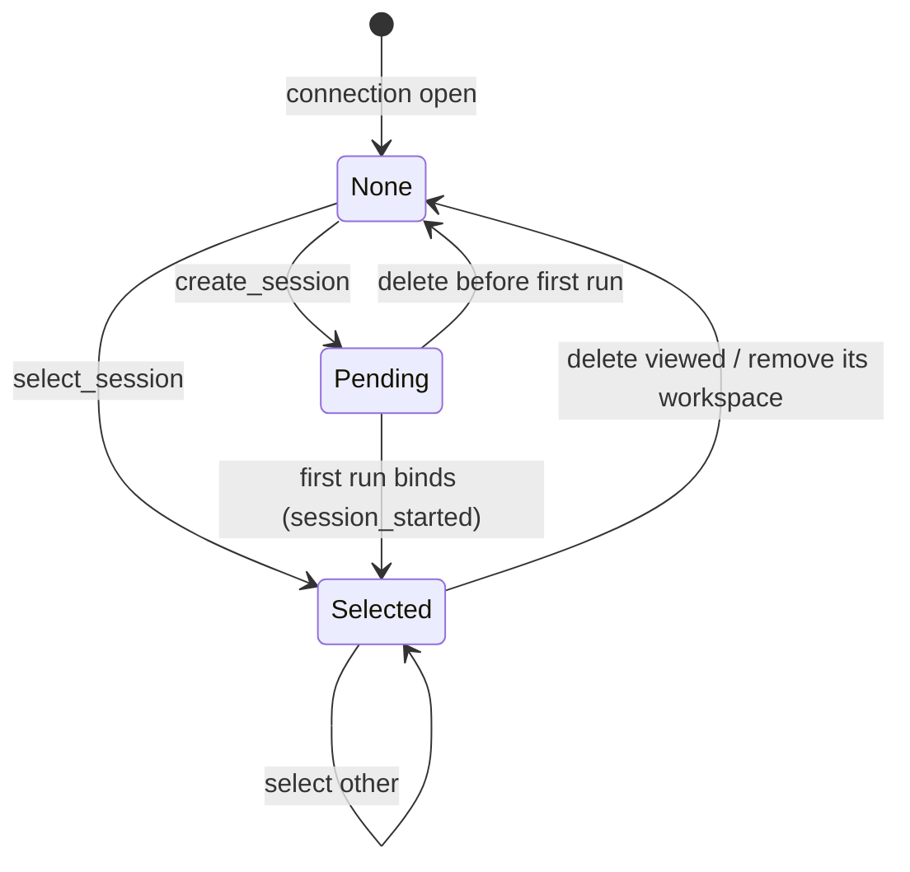

# session-registry — 领域规格

## Overview

session-registry 是工作台的档案柜：把项目目录登记为**工作区**，把各厂商会话列成统一**目录**，记住每会话权限模式与最近访问，并在选择时从厂商原生存储回放历史。

工作区身份是不可变的名称（[术语](../../../glossary.md)）；磁盘路径只表示位置，不回传为身份。新路径在服务端本机用目录对话框选择，没有图形界面时由用户填写。会话目录按业务种类分页，最新优先；「规范」一列同时展示规格撰写与评审。转录只存在于厂商原生存储，c3 不双写。连接上的已查看会话是视图，不是运行所有权（[ADR 0006](../../../architecture/adr/0006-decouple-runs-from-connections.md)）。

**范围:** 工作区登记与排序、会话增删改选、每会话模式、最后活跃提示、选择时的历史回放。
**边界:** 不驱动运行（[agent-session](../agent-session/agent-session-spec.md)），不渲染 UI（[web-console](../web-console/web-console-spec.md)），不持有权限决策。

实体见 [session-registry-models.md](session-registry-models.md)。

## Business rules

- **SR-R1**: 工作区必须是已存在的目录。`add_workspace` 对非目录以 `error` 拒绝，不产生变更。
- **SR-R2**: 工作区目录持久化，按最近访问降序。名称全局唯一且创建后不可变；同一目录不得登记两次。
- **SR-R3**: 在工作区内选择或创建会话，推高该工作区的最近访问。
- **SR-R4**: 会话目录是可重建的投影，按最近修改最新优先。厂商原生存储是存在性、标题与转录的事实来源；c3 不双写转录（[ADR 0013](../../../architecture/adr/0013-canonical-envelope-on-wire-c3-session-namespace.md)）。只列出本目录已跟踪的行。工作列排除其他域声明隐藏的沟通会话；工具会话默认不进工作列，与角标同一规则。
- **SR-R5**: 权限模式按会话持久化。新会话取该工作区该厂商的默认，再回退到厂商目录默认。`set_mode` 只改当前会话，并按该厂商目录校验；目录外的历史值降为工作区默认并写回，保证下拉与生效策略一致。
- **SR-R6**: `create_session` 把一个尚未落盘的 pending 会话设为已查看，历史为空，模式为按厂商默认。不停止其他运行。
- **SR-R7**: 首次运行把 pending 绑到厂商原生 id，发出 `session_started`，并在该 id 下持久化模式。绑定同时冻结会话厂商（[agent-config](../../settings/agent-config/agent-config-spec.md)、[ADR 0015](../../../architecture/adr/0015-session-agent-binding-vendor-ownership.md)）。从未运行的 pending 只留下可变意向，不产生真实会话。
- **SR-R8**: `select_session` 把该会话设为已查看，并重放完整记录：原生存储基线加上 runtime 实时缓冲。报告存储的模式与权威 runtime `status`。不停止运行。只能选择目录里已有的行。解不出的事件跳过，选择不失败。回放读的是该会话写入时的那份原生存储（[ADR 0030](../../../architecture/adr/0030-session-store-scope-vendor-neutral-data-root.md)）。
- **SR-R9**: `delete_session` 停止该会话运行，按厂商能力移除转录，并去掉其模式。若它是已查看或最后活跃，该提示清除。
- **SR-R10**: `remove_workspace` 从目录取消注册并停止其下后台运行，不删除磁盘转录。已查看会话清除。身份保留，同一目录再登记时恢复原名称与配置。
- **SR-R11**: 权限决策从不持久化。本域只持久化工作区与会话元数据（[ADR 0004](../../../architecture/adr/0004-persist-workspace-session-registry.md)）。
- **SR-R12**: 跨厂商列表是一条统一时间线，不按厂商分组。行标记所属厂商；标题保持各厂商原样。
- **SR-R13**: 绑定与运行结束都会刷新该行的近期程度，刚发生的会话排到顶部。没有观察连接的创建仍向每个连接扇出最新一页，不重置客户端已加载的更旧窗口。
- **SR-R14**: 会话列表按种类分页加载，从不整表返回。首次是最新页，随后可加载更旧页，刷新只更新已展示范围。列表与角标共用同一套过滤，每个会话只计一次。删除与重命名不推整页列表。
- **SR-R15**: 显示分类可以覆盖多个真实 kind。会话页「规范」= `spec` + `spec_review`，同一条时间线。分类只是查询口径；行仍带真实 `sessionKind`。有所有者的行打开所属域；`spec_review` 经意图管理的只读入口打开，不走通用 `select_session`。`robot` 不进会话页。
- **SR-R16**: 意图接力的评审 / 修复会话以 `work` + 意图归属出现，不进「自动化」。工作区仍是原项目。自动化自己的执行行仍是 `automation`。二者由写入投影时声明的种类区分，不由谁启动区分。

## States

### 已查看会话（每连接）

```mermaid
stateDiagram-v2
    [*] --> None: connection open
    None --> Pending: create_session
    None --> Selected: select_session
    Pending --> Selected: first run binds (session_started)
    Selected --> Selected: select other
    Selected --> None: delete viewed / remove its workspace
    Pending --> None: delete before first run
```

切换不结束运行（[agent-session](../agent-session/agent-session-spec.md)）；只改这个连接的视图。持久化的最后活跃会话是重启后打开谁的提示，不是一次实时运行。

## Domain events

消费 `add_workspace`、`select_workspace_directory`、`cancel_workspace_directory_selection`、`remove_workspace`、`list_sessions`、`create_session`、`select_session`、`rename_session`、`delete_session`、`set_mode`。发出 `ready`、`workspaces`、`workspace_directory_selection`、`sessions`、`session_selected`、`session_started`、`mode_changed`、`error`。`session_status` 属于 agent-session。形状见[共享协议](../../../shared/api-conventions/websocket-protocol.md)。

## Interactions

- **agent-session** — 播种工作目录、每会话模式与 resume id；收回 pending 绑定后的真实 id。
- **web-console** — 渲染目录并发送上述管理事件。
- **files** — 用已登记名称解析工作区根。
- **厂商原生存储** — 转录、标题与存在性；重命名 / 删除按该厂商能力。
