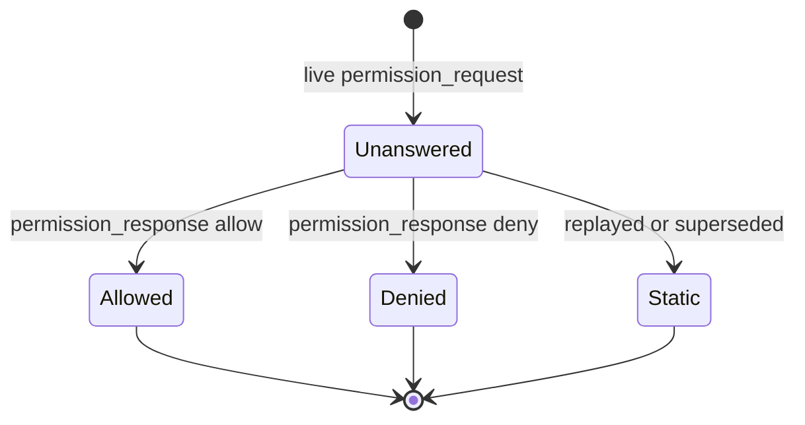

# Domain: web-console

- **Group:** core
- **One-line:** 浏览器窗口：人观察活动流、提交或排队 prompt、回答权限、切换模式与智能体。
- **Owner:** maintainer
- **Status:** active
- **Depends on:** [agent-session](agent-session.md)（运行与活动流）；[session-registry](session-registry.md)（工作区与会话目录）；[permission-gateway](permission-gateway.md)（待决权限）；settings 各域（配置面）。
- **Depended on by:** 无（位于技术栈顶层）。
- **exposes-api:** false — 客户端，消费 `/ws`，不对外提供 API。
- **notes:** 内部域。消息形状在[共享协议](../../shared/api-conventions/websocket-protocol.md)中定义一次。
- **ADRs:** [0002](../../architecture/adr/0002-websocket-as-permission-transport.md)（WebSocket 传输）、[0006](../../architecture/adr/0006-decouple-runs-from-connections.md)（连接是视图）

## Overview

Web 控制台是人对工作台的窗口：看活动流、提交或排队 prompt、回答权限、切换模式与智能体、停止或继续。它不持有运行、目录或决策；用户意图一律发给服务端执行。

**范围:** 人可见的交互契约。
**边界:** 不驱动智能体（[agent-session](agent-session.md)），不登记工作区或会话（[session-registry](session-registry.md)），不裁定权限（[permission-gateway](permission-gateway.md)），不定义配置字段（settings 各域）。消息形状只在[共享协议](../../shared/api-conventions/websocket-protocol.md)中定义一次。

## Business rules

### 活动流

- **WC-R1**: 活动流按到达顺序渲染文本、工具活动、权限提示与共识，控制台不重排。
- **WC-R9**: 选中会话用 `session_selected` 的回放替换整条流，再接实时尾部，并立即采用该会话的模式与 runtime 状态。
- **WC-R5**: `turn_end` 不解锁输入、不清空会话。空闲以 `session_status` 为准。出错的结束对人可见。

助手文本按 Markdown 渲染（含代码高亮与图表）；用户与系统文本保持纯文本。

### 提示与队列

- **WC-R2**: 仅当已连接、输入非空，且当前查看会话空闲或为 team 时发送 `user_prompt`。普通会话运行中输入仍可编辑，发送走队列（WC-R17）。
- **WC-R17**: 队列只存在于本机、按会话划分；可改可删；刷新即丢。当前查看的普通会话变为空闲时合成为一条 `user_prompt` 发出。未在查看的队列等到被查看且空闲才发。team 不排队。

无查看中的会话则不能提交。输入支持斜杠命令、语音与图片。

### 权限 UI

- **WC-R7**: 控制台绝不代替人做 Allow/Deny 或填写问答，只发送人明确选择的内容。
- **WC-R3**: 一条权限提示在本视图内至多回答一次；回答后锁定为已选决策。
- **WC-R16**: 可操作的只有「当前查看会话处于 `awaiting_permission`，且是流中最新仍未决的那一条」。真正待决的在刷新后仍可答；回放或被取代的是静态记录。
- **WC-R12**: 会话列表对每个会话展示 `running` / `awaiting_permission`，包括后台。
- **WC-R13**: 后台会话进入 `awaiting_permission` 时请求一次浏览器通知；拒绝则不再打扰。

### 控制面

- **WC-R4**: `set_mode` 乐观生效，以 `mode_changed` 为准。选项只含该会话厂商合法的模式。
- **WC-R22**: 同厂商智能体切换发 `set_session_agent`，下一轮 `user_prompt` 才用新绑定（[ADR 0015](../../architecture/adr/0015-session-agent-binding-vendor-ownership.md)）。跨厂商候选不出现。当前智能体不可用时必须切到同伴才能继续。
- **WC-R14**: 运行中或 team 活动时可发 `stop_run`。切换查看的会话或关闭连接不停止运行。
- **WC-R19**: `session_status: reconnecting` 是智能体运行在自动续跑，不是浏览器连接（WC-R6）。`turn_end` 带 `side_effect_pending` 时会话空闲，必须人确认后才用 `user_prompt` 继续。
- **WC-R30**: 运行已停且上一轮出错时，一键重试走与 Continue 同一条 `user_prompt` 路径。副作用待确认、运行中（含 reconnecting）或只读列上不出现该入口。

### 会话与工作区外壳

- **WC-R6**: 浏览器连接状态 `connecting` / `open` / `closed` 始终可见，并作为运行日志入口（WC-R31）。
- **WC-R8**: 当前工作区是本机导航状态，与正在查看的会话所属工作区解耦。切换工作区刷新目录，不自动改正在看的会话、不打断其流。新增与移除工作区仅管理员；查看与切换对已认证用户开放。
- **WC-R8a**: 新工作区路径由服务端主机选择（[session-registry](session-registry.md)）；控制台默认不手填。点选失败才露出一次性手填。取消是正常结果。
- **WC-R10**: pending 会话保持当前，直到 `session_started` 换成真实 id。
- **WC-R21**: 新建会话可指定智能体，或省略以继承默认（[agent-config](../settings/agent-config.md)）。宿主 CLI 不可用的厂商不能被选来新建。
- **WC-R29**: 查看 `spec_review` 时聊天列只读：无输入、无队列、无停止/继续、无权限作答。服务端续跑门禁见[意图管理](intent-management.md)。标签内联运行中状态点与其余会话标签同构。
- **WC-R32**: 意图详情在存在对应会话 id 时渲染评审 / 修复会话标签；内联运行中状态点与其余会话标签同构。聊天列不进入只读门。
- **WC-R33**: 顶部会话与条目角标、工作区竖条、工作台通知角标、交付入口只渲染服务端活动摘要，不扫描页面列表。客户端按 Workspace 保存 `activity_snapshot` / `activity_delta`；revision 不连续则请求完整快照。会话分类与条目角标读当前工作区摘要；竖条读每个工作区的 `runningSessions`，不依赖进入该工作区。工作台通知角标读 `attention.pendingUserTasks`；非当前工作区的待办列表帧不写入当前列表。兼容期仍接受 `session_counts` 与 `wait_user_events.todoCount`。

### 冷启动、双视图、移动端

- **WC-R20**: 两大视图：工作区与工作台。切视图不改当前工作区、不停止运行。工作区视图承载该项目的会话与账本；工作台承载通知、总览与聊天机器人。
- **WC-R23**: 一次应用会话至多弹出一层冷启动引导；条件只判定一次，整页刷新才再判定。智能体与运行时门见 [agent-config](../settings/agent-config.md)；空目录且管理员则打开新增工作区。两扇门不叠加。

窄屏用分层进入代替桌面常驻列表，输入避开软键盘与安全区。

### 分享、日志、遮罩、更新、语言

- 标题栏一键复制带深链的标题。部署基址未配置时提示去系统设置，不静默失败。
- **WC-R31**: 运行日志是独立页面，默认同步最新。读取契约见[可用性](../../non-functional/availability.md) OBS-6。
- 启动开发、写规格、建意图或建 PR 时以分步遮罩阻断交互，直到该动作结束；不提供假取消。
- 顶栏展示自更新进度；管理员确认后才重启。流水线见 [self-update](self-update.md)。
- 界面语言为英、中、日、韩、俄，日期与数字随语言本地化。品牌名不译。

## States

一条权限类流条目，在它仍是当前待决期间：

离开 `Unanswered` 不能回去。切走视图不回答它。

## Domain events

消费协议上的运行、目录与权限事件；发出人明确选择的动作（`user_prompt`、`permission_response`、`set_mode`、`stop_run`、`set_session_agent`、会话与工作区管理）。形状见[共享协议](../../shared/api-conventions/websocket-protocol.md)。

## 数据模型

### View

当前观察：哪一个应用视图（工作区 / 工作台）、哪一个工作区上下文、正在看哪条会话及其活动流。

不变量:

- 不是运行的所有者。切走或关闭不停止运行（[ADR 0006](../../architecture/adr/0006-decouple-runs-from-connections.md)）。
- 活动流只属于正在看的会话；选中会整段替换为回放再接实时尾部。
- 可操作的权限提示至多一条，关联键是 `requestId`。
- `spec_review` 的流可看不可写。

当前工作区是本机导航状态，与正在看的会话所属工作区不必相同。

### Connection

浏览器到服务端的 WebSocket。状态为 `connecting` | `open` | `closed`。与 runtime 的 `reconnecting` 不是一回事。

不变量:

- 关闭只退订视图，不拆运行。
- 重连后恢复当前视图的回放，不另起运行。

### Queue

普通会话在 turn 进行中写下、尚未发出的 prompt。仅客户端。

不变量:

- 按会话划分；切会话保留；刷新丢失。
- 只在「正在看且 idle」时刷出为一条 `user_prompt`。
- team 无队列。

## 协作

**session-registry.** 消费 `workspaces` / `sessions` / `session_selected`，发送登记、选择与增删改名。当前工作区是本机记住的导航上下文，与「正在看哪条会话」解耦；切工作区不停止运行、不擅自改正在看的流。路径点选由注册表在服务端主机完成。

**agent-session.** 消费活动流与 `session_status`，发送 `user_prompt` / `set_mode` / `stop_run` / `set_session_agent`。连接只订阅当前查看的会话；切走或刷新靠回放接回同一条流（[ADR 0006](../../architecture/adr/0006-decouple-runs-from-connections.md)）。非 team 会话单 turn；本域用客户端队列向用户隐藏这次拒绝。

**permission-gateway.** 消费 `permission_request` 与 `consensus_auto`，回 `permission_response`。待决跟 run 走；切走视图仍可按 `requestId` 作答。控件如何排布由本域拥有。

**settings.** 控制台打开系统、工作区与个人化配置面并发送读写；字段、门禁与冷启动里的智能体/运行时门由那些域规定。

意图、讨论、自动化、自更新各自拥有账本与动作；控制台提供窗口、深链、进度遮罩与更新胶囊。

## 关键取舍

**队列藏起单 turn 拒绝。** 服务端对非 team 仍拒绝进行中的 `user_prompt`。队列只活在本机、按会话、刷新即丢。只刷出「正在看且已 idle」的队列，因为 `user_prompt` 打到当前视图。

**连接是视图，不是运行所有者。** 切走、关 socket 或刷新必须能回到同一条流。代价是未发出的队列与草稿不持久化；运行与待决权限仍在进程里。

**桌面与移动是两套信息架构。** 桌面用常驻工作区列表与系统入口并列；窄屏改分层进入，把输入留在软键盘与安全区之上。同一套动作，不是同一套版面。

## 非功能

刷新丢失队列与未发出的草稿。连接断开后自动重连并恢复当前视图。错误必须对人可见，不得静默。
