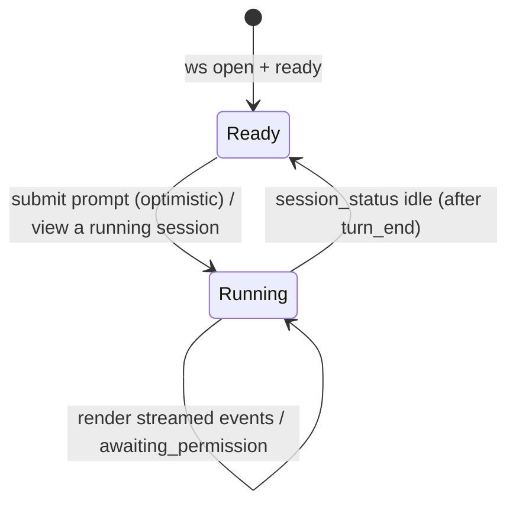

# web-console —— 领域规格

## 概览

Web 控制台是 c3 面向人类的界面。它连接到服务端的 WebSocket,呈现顶部栏的**工作区切换器**(唯一的全局当前工作区)、一个**标签导航**(在内容区的各页面间显式切换,会话 / 需求,可扩展),以及——在「会话」
标签页上——一个左侧**会话列表**,展示当前工作区的会话,与右侧的聊天控制台并列(每个标签拥有自己的左列;右侧的聊天控制台是共享的)。它让用户能向当前会话发送提示词,将智能体的
活动渲染为一条有序的类聊天流,并且是唯一能做出权限决策或修改模式的地方。

**范围:** 呈现工作区切换器 / 会话列表与 wire 事件流,并捕获用户
意图(工作区/会话管理、提示词、决策、按会话的模式)。
**边界:** 它不持有任何权限——每一个决策与管理动作都会发送给
服务端,由服务端执行并持久化。它既不运行智能体,也不拥有会话状态。

## 核心实体

| 实体         | 描述                                                                         |
| ------------ | ---------------------------------------------------------------------------- |
| Chat Message | 流中渲染的一项:用户文本、助手文本、tool-use、tool-result、权限提示或系统提示 |

见 [web-console-models.md](web-console-models.md)。

## 业务规则

| ID     | 规则                                                                                                                                                                                                                                                                                                                                                                                                                                                                                                                                                                                                                                                                                                                                                                                                                                                                                                                                                                                                                                                                                                                                                                                                                                                                                                                                                                                                                                                                                                                                                                                                                                                                                                                                                                                                                                                                                                                                                                                                                                  |
| ------ | ------------------------------------------------------------------------------------------------------------------------------------------------------------------------------------------------------------------------------------------------------------------------------------------------------------------------------------------------------------------------------------------------------------------------------------------------------------------------------------------------------------------------------------------------------------------------------------------------------------------------------------------------------------------------------------------------------------------------------------------------------------------------------------------------------------------------------------------------------------------------------------------------------------------------------------------------------------------------------------------------------------------------------------------------------------------------------------------------------------------------------------------------------------------------------------------------------------------------------------------------------------------------------------------------------------------------------------------------------------------------------------------------------------------------------------------------------------------------------------------------------------------------------------------------------------------------------------------------------------------------------------------------------------------------------------------------------------------------------------------------------------------------------------------------------------------------------------------------------------------------------------------------------------------------------------------------------------------------------------------------------------------------------------- |
| WC-R1  | 控制台按到达顺序把每个 wire 事件渲染为一条 Chat Message。                                                                                                                                                                                                                                                                                                                                                                                                                                                                                                                                                                                                                                                                                                                                                                                                                                                                                                                                                                                                                                                                                                                                                                                                                                                                                                                                                                                                                                                                                                                                                                                                                                                                                                                                                                                                                                                                                                                                                                             |
| WC-R2  | 只有当输入非空、socket 已连接、且**当前查看的会话**处于空闲(或为团队会话,以现场喂入)时,才会发送 `user_prompt`。当轮次进行中时输入框保持可编辑;对普通会话而言,Send/回车会**入队**到本地而不是发送(WC-R17)。「运行中」由 `session_status` 推导。                                                                                                                                                                                                                                                                                                                                                                                                                                                                                                                                                                                                                                                                                                                                                                                                                                                                                                                                                                                                                                                                                                                                                                                                                                                                                                                                                                                                                                                                                                                                                                                                                                                                                                                                                                                        |
| WC-R3  | 只有当权限提示是最新的、仍处于待决状态的请求时(见 WC-R16),它才可回答。本会话内一旦被回答,它就被锁定并显示已选定的决策。从历史记录中回放出的提示永远不可回答;它显示为一条静态记录(WC-R16),而非锁定的裁决结果。                                                                                                                                                                                                                                                                                                                                                                                                                                                                                                                                                                                                                                                                                                                                                                                                                                                                                                                                                                                                                                                                                                                                                                                                                                                                                                                                                                                                                                                                                                                                                                                                                                                                                                                                                                                                                         |
| WC-R4  | 模式切换会在 UI 中乐观地应用,并在 `mode_changed` 到达时得到确认。UI 也会采用服务端在 `ready` 中回报的模式。                                                                                                                                                                                                                                                                                                                                                                                                                                                                                                                                                                                                                                                                                                                                                                                                                                                                                                                                                                                                                                                                                                                                                                                                                                                                                                                                                                                                                                                                                                                                                                                                                                                                                                                                                                                                                                                                                                                           |
| WC-R5  | `turn_end` 只是信息性的——输入框的解锁依靠 `session_status`(服务端广播 idle),而不是 `turn_end` 本身。`turn_end{error}`(以及任何 `error`)会追加一条系统提示。`turn_end` 从不清空该会话。                                                                                                                                                                                                                                                                                                                                                                                                                                                                                                                                                                                                                                                                                                                                                                                                                                                                                                                                                                                                                                                                                                                                                                                                                                                                                                                                                                                                                                                                                                                                                                                                                                                                                                                                                                                                                                                |
| WC-R6  | 连接状态(`connecting` / `open` / `closed`)始终对用户可见。                                                                                                                                                                                                                                                                                                                                                                                                                                                                                                                                                                                                                                                                                                                                                                                                                                                                                                                                                                                                                                                                                                                                                                                                                                                                                                                                                                                                                                                                                                                                                                                                                                                                                                                                                                                                                                                                                                                                                                            |
| WC-R7  | 控制台绝不会代替用户执行工具或做出决策——它只发送用户明确选择的内容。                                                                                                                                                                                                                                                                                                                                                                                                                                                                                                                                                                                                                                                                                                                                                                                                                                                                                                                                                                                                                                                                                                                                                                                                                                                                                                                                                                                                                                                                                                                                                                                                                                                                                                                                                                                                                                                                                                                                                                  |
| WC-R8  | 顶部栏的**工作区切换器**(最左侧)标识唯一的全局**当前工作区**,是添加/切换/移除工作区的唯一入口:一个添加控件用于新增一个工作区(`add_workspace`),下拉列表列出所有工作区(名称 + 路径,按服务端返回的最近访问顺序排列)用于切换当前工作区,每一行都可将其移除(二次确认 → `remove_workspace`)。**新增与移除工作区仅限管理员**(AUTH-R10):服务端在 `add_workspace` / `remove_workspace` 前设有管理员校验(非管理员 → `auth.adminOnly`,未认证 → `unauthenticated`),切换器对非管理员隐藏添加控件与每行的移除控件(由 `ready` 消息上的管理员标志驱动,仅为 UX 表现);切换/列出/查看对任何已认证用户都保持开放。当前工作区是**客户端状态**,持久化在本地(刷新后恢复,若无则回退到最近访问的工作区),并与当前查看会话所属的工作区解耦。控制台标签页的**会话列表**只列出当前工作区的会话;切换当前工作区会刷新该列表——但**不会**自动选中某个会话,也不会打扰正在查看的聊天。会话列表的标题栏还带有一个手动**刷新**按钮(位于 ＋ 新建会话按钮左侧,两者仅在存在当前工作区时显示),按需重新获取当前工作区的会话列表(`list_sessions`)。移除当前工作区会把选中项回退到最近访问的那个。新建/选择/重命名/删除会话仍是 wire 消息;切换当前工作区是客户端状态变更,绝不是对服务端所拥有数据的本地修改。                                                                                                                                                                                                                                                                                                                                                                                                                                                                                                                                                                                                                                                                                                                                                                                                                                                                      |
| WC-R9  | 选中一个会话会用来自 `session_selected` 的回放历史替换整条流,随后为一个进行中的轮次渲染实时缓冲区尾部(回放的流事件),采用该会话的模式,从选择回复的状态中为当前查看会话植入实时状态(这样输入框会立刻为一个在后台运行的会话锁定,而无需等待 `session_status` 广播),并在聊天列的**会话标题栏**中展示会话标题(左:一个**厂商颜色圆点** + 标题,右:权限模式下拉框)——而不是在顶部栏,顶部栏只通过切换器标识工作区。圆点的色相是该会话在选择回复中携带的、已解析出的智能体厂商(ADR-0015;缺失 ⇒ 无圆点,例如 comm 会话)。模式下拉框的选项来自当前会话所用厂商的模式目录(取自 `settings.vendorModes`),因此只展示该厂商合法的模式;当该目录尚未加载时,使用内置的回退列表。在选中会话之前提示词输入被禁用;模式下拉框位于会话标题栏中,该标题栏仅在控制台标签页且存在当前会话时渲染。                                                                                                                                                                                                                                                                                                                                                                                                                                                                                                                                                                                                                                                                                                                                                                                                                                                                                                                                                                                                                                                                                                                                                                                                                                                                     |
| WC-R10 | 一个 pending 会话会持续显示为激活状态,直到 `session_started` 用真实会话 id 替换其 `pending:` id。会话列表的**＋**打开一个**新建会话智能体选择器**弹窗(WC-R21),而不是立即创建;确认后发送 `create_session`(可选携带所选的 `agentId`)。                                                                                                                                                                                                                                                                                                                                                                                                                                                                                                                                                                                                                                                                                                                                                                                                                                                                                                                                                                                                                                                                                                                                                                                                                                                                                                                                                                                                                                                                                                                                                                                                                                                                                                                                                                                                  |
| WC-R12 | 会话列表反映每个会话来自 `session_status` 的实时状态:`running` 徽标,以及对卡在待决策状态的会话给出 `awaiting_permission` 高亮——包括用户当前未在查看的会话。                                                                                                                                                                                                                                                                                                                                                                                                                                                                                                                                                                                                                                                                                                                                                                                                                                                                                                                                                                                                                                                                                                                                                                                                                                                                                                                                                                                                                                                                                                                                                                                                                                                                                                                                                                                                                                                                           |
| WC-R13 | 当一个**后台**会话(非当前查看的会话)进入 `awaiting_permission` 时,控制台会发出一次浏览器通知(申请一次通知权限;若被拒绝则不做任何事)。                                                                                                                                                                                                                                                                                                                                                                                                                                                                                                                                                                                                                                                                                                                                                                                                                                                                                                                                                                                                                                                                                                                                                                                                                                                                                                                                                                                                                                                                                                                                                                                                                                                                                                                                                                                                                                                                                                 |
| WC-R14 | 一个 Stop 控件位于**状态栏**中(刷新 ↻ 左侧的一个红色方形按钮),而不在输入框中。当前查看的普通会话运行中或某个团队处于活动状态时它是启用的,并发送 `stop_run`(中断一个普通轮次,或结束整个团队);空闲时它是禁用的。输入框的 Send 按钮始终保持固定文案,并在轮次进行中入队(WC-R17);切换会话绝不会停止一次运行。                                                                                                                                                                                                                                                                                                                                                                                                                                                                                                                                                                                                                                                                                                                                                                                                                                                                                                                                                                                                                                                                                                                                                                                                                                                                                                                                                                                                                                                                                                                                                                                                                                                                                                                              |
| WC-R11 | 整页式设置视图编辑系统设置的一份本地草稿(通过 `get_settings` 获取);每个智能体的字段各占一行,系统智能体的 Claude 配置只读,且不可被移除。Save 发送 `save_settings` 并采纳归一化后的 `settings` 回复。智能体区域还从设置的绑定统计中展示一条**非追溯提示**——修改默认智能体只影响新会话;已绑定的既有会话保持自己的智能体/厂商不变(ADR-0015)。**诊断区域**从设置的宿主状态(ADR-0012)中列出每个厂商的宿主 CLI 是否存在:厂商圆点 + 二进制名称 + on-PATH / not-found(缺失行以提示气泡展示安装建议)+ 每个已安装二进制解析出的**绝对路径**(便于运维者准确了解 c3 将启动哪一个可执行文件)。这是 ADR-0012 D3 延后事项——宿主二进制探测——的前端呈现。按项目的控件(默认模式、开发技能、每阶段最大轮数、最大发言字符数、共识)已从设置视图中移除,迁移到专门的项目配置页面(WC-R24)。                                                                                                                                                                                                                                                                                                                                                                                                                                                                                                                                                                                                                                                                                                                                                                                                                                                                                                                                                                                                                                                                                                                                                                                                                                                                    |
| WC-R15 | 输入框上方的状态栏展示当前查看会话的运行活动。`running`(来自 `session_status`)是权威的开/关状态;细粒度的标签(thinking / running `<tool>` / awaiting permission / error / ready)由客户端从事件流中推断——`tool_use`→运行中的工具,`assistant_text`/`tool_result`→thinking,`permission_request`→awaiting,`turn_end{error}`→error(保持到下一次提示词为止)。切换会话时它会重置(从回放的缓冲区尾部重新推导),并提供一个刷新按钮,通过重新选择该会话来重新同步视图(当 socket 未打开时禁用;它无法救活一次卡死的运行)。                                                                                                                                                                                                                                                                                                                                                                                                                                                                                                                                                                                                                                                                                                                                                                                                                                                                                                                                                                                                                                                                                                                                                                                                                                                                                                                                                                                                                                                                                                                           |
| WC-R16 | 权限决策不在服务端持久化,`session_selected` 会以 `decision: null` 回放历史中的 `permission_request` 事件。因此控制台**只有**在当前查看会话处于 `awaiting_permission`、且它是记录中最新的仍未决定的权限请求时(SDK 一次只阻塞一个),才把该权限视为可操作的。一个真正待决的权限在刷新后仍保持可回答;其余每一个被回放/被取代的权限都会退化为一行静态历史记录(没有按钮、没有决策裁决),且不会强制展开其工具批次。                                                                                                                                                                                                                                                                                                                                                                                                                                                                                                                                                                                                                                                                                                                                                                                                                                                                                                                                                                                                                                                                                                                                                                                                                                                                                                                                                                                                                                                                                                                                                                                                                            |
| WC-R17 | 一个普通会话是单轮的,因此在其轮次进行中撰写的消息会被存放在一个**仅客户端**的、按会话的发送队列中(无服务端/协议变更)。排队项渲染在状态栏与输入框之间,支持编辑/删除;编辑会把文本返还给输入框,删除则丢弃它。当当前查看的普通会话下一次变为空闲、且队列非空时,这些条目会按顺序合并(以空行连接)为一条提示词,通过普通的 `user_prompt` 路径发送,然后清空。该队列按 `sessionId` 划分,在会话切换后依然存在,只有在刷新/重启时才会丢失。团队会话从不排队(其 lead 是以现场喂入方式接收消息的)。                                                                                                                                                                                                                                                                                                                                                                                                                                                                                                                                                                                                                                                                                                                                                                                                                                                                                                                                                                                                                                                                                                                                                                                                                                                                                                                                                                                                                                                                                                                                                  |
| WC-R19 | 状态栏把智能体运行的 socket 断连路径(AVAIL-7)呈现为在 WC-R15 活动标签之外的两种可见状态。**重连中间态:** 当当前查看会话的 `session_status` 为 `reconnecting`(该次运行遇到了 socket 断连,正在退避后准备进行一次自动 `resume`)时,状态栏显示一个独立的“连接已断开,正在重连……”标签(专属圆点颜色 + 加载指示),优先于通用的运行中标签——它仍然是 `running`,因此输入框保持锁定。这与 WC-R6 的连接指示器不同,后者反映的是浏览器↔服务端的 WebSocket,而非服务端↔SDK 的运行。**危险态(需手动继续):** 当一个轮次以 `turn_end { side_effect_pending: true }` 结束(副作用门禁拒绝了自动 resume,因为在断连时有一个写类的 `tool_use` 尚未闭合,AS-R19)时,该会话会沉降为空闲,状态栏显示一个“确认无副作用并继续”的标签,外加一个手动的**Continue**控件。点击 Continue 会通过普通的 `user_prompt` 路径恢复同一个会话(没有新的协议消息)——下一个轮次会以完整上下文 `resume` 该 SDK 会话。该危险标志按 `sessionId` 划分,一旦该会话再次运行(continue 或任何新提示词)或被(重新)选中即被清除。所有文案均走 i18n(不使用未译原始文本)。                                                                                                                                                                                                                                                                                                                                                                                                                                                                                                                                                                                                                                                                                                                                                                                                                                                                                                                                                                                                                              |
| WC-R18 | 顶部栏的**标签导航**(紧随工作区切换器之后)是内容区展示哪个页面的唯一显式控件。标签是**数据驱动**的(初始为「会话」= 控制台,「需求」= 需求;这份列表的结构使得未来的「讨论」标签只需再加一项加一段内容分支即可),激活的标签会高亮,整个内容区随标签一起切换。选择「会话」返回聊天页面;选择「需求」打开**当前工作区**的需求页面(comm 会话成为当前查看的会话,共享聊天列)并且在没有工作区时禁用。所选的标签是**客户端状态**,持久化到 `localStorage`(键 `c3.viewMode`),硬刷新后恢复。顶部栏不携带任何会话标题或权限模式下拉框——它们位于聊天列的**会话标题栏**中(WC-R9),该标题栏仅在控制台标签页且存在当前会话时渲染;因此需求标签页不显示标题栏(其 comm 会话由标签本身标识,而非面包屑)。控制台标签页是一个两列页面:左侧的**会话列表** + 共享的聊天控制台;需求标签页把左列换成需求列表。会话列表中的「需求录入」项仍作为一个次要快捷方式,也会切换到需求标签页。自动化标签页把左列换成一个**自动化列表**,它遵循与需求列表 / 讨论列表相同的左侧面板范式:标题右侧的「+」打开创建表单,面板可展开/收起(960px / 480px,`<=1024px` 视口下有回退方案),每一行都是一个**手风琴**(单开——展开一行会在行内展示该自动化的完整配置摘要:id、类型、状态、cron、即将运行的时间、mode、config JSON、创建/更新时间戳,并同时选中该行使右侧面板展示其执行日志),每一行都带一个**启用/禁用开关**,映射到该自动化的暂停/恢复(`update_automation` 状态;见[自动化](../automations/automations-spec.md)的暂停与恢复)。右侧面板(自动化详情)**只**展示当前选中自动化的执行日志视图,标题为该自动化的名称 +「Logs」;所有配置展示都在左侧手风琴中,右侧面板没有 新建/编辑 工具栏。每一处自动化**时间展示**——手风琴中的即将运行时间与创建/更新时间戳,以及创建/编辑表单中的实时**下一次运行预览**——都以**系统配置的时区**(时区设置,一个 IANA 名称;见[自动化](../automations/automations-spec.md))计算并格式化,而非浏览器本地时区。因此展示的钟面时间始终与 cron 字面量一致(例如 `0 11 * * *` 在 `Asia/Shanghai` 下渲染为 11:00,绝不是 19:00),从而消除“计算时区”与“展示时区”不一致的问题。表单的下一次运行提示文案体现了这一点(“按所配置的时区展示,例如 Asia/Shanghai”),全部经由 i18n。 |

| WC-R21 | **新建会话智能体选择器(ADR-0015 / ADR-0012)。** 会话列表的**＋**打开一个弹窗,用于选择新会话运行所用的智能体。**厂商**下拉框默认为**Auto**(无厂商 → agent 被省略 → 该次运行继承默认智能体);选择一个厂商会展示一个**智能体**下拉框,列出该厂商所有已启用的智能体(默认选中第一个)。若某厂商的宿主 CLI 缺失(依据设置的宿主状态,ADR-0012),该项会被**灰化/禁用**,并附上“二进制不在 PATH 中”的原因,弹窗还会展示一个**「跳转到检测面板」**链接,打开设置诊断区(WC-R11)。确认会携带所选智能体(Auto 时不携带)发送 `create_session`;标题携带生效厂商的颜色圆点。所有文案均走 i18n;品牌名称不翻译。 |

| WC-R24 | **按项目的设置页(workspace-setting)。** 一个覆盖层页面让用户为当前工作区编辑 7 项项目级控件:默认模式、开发技能、每阶段最大轮数(最小 8)、最大发言字符数(最小 300)、共识(启用、多数)、git 分支模式(`current-branch` \| `worktree`),以及默认主分支(新建 worktree 的基准分支,仅在 `worktree` 模式下展示)。应用头部中工作区切换器之后的一个入口按钮打开该页面(未选择工作区时禁用)。打开时,控制台为当前工作区发送 `load_workspace_setting`;服务端回复 `workspace_setting`,其中探测到的主分支(服务端探测的默认分支:`origin/HEAD` → 当前 HEAD)在没有已保存值时预填默认主分支控件(已保存的值优先于探测值)。该页面持有一份从回复中初始化的可编辑草稿;Save 携带该配置发送 `save_workspace_setting`。切换当前工作区或重新连接会关闭该页面。控件值与阈值与此前设置视图中的相同(WC-R11)。所有 UI 文案均走 i18n。其交互遵循与设置视图相同的草稿编辑模式。 |

| WC-R22 | **标题栏中的同厂商智能体切换器(ADR-0015 / AS-R23)。** 当当前查看会话的选择回复携带智能体切换数据(一个真实的、非 comm 的会话,带有切换候选和/或一个不可用的当前智能体)时,聊天列标题栏会在模式下拉框旁渲染一个**智能体下拉框**(WC-R9):当前智能体(已选中)加上它的**同厂商、宿主二进制存在**的同伴——候选集合在**服务端**解析,因此跨厂商的智能体**绝不会出现**(厂商被冻结,AC-R17;提示气泡「已由 {vendor} 创建,vendor 不可变更」)。选取另一个智能体会发送 `set_session_agent`;服务端回复 `session_agent_changed`,客户端在本地重建该切换器(所选智能体成为当前智能体;被拒绝的回复展示一个提示条并保持不变)。该切换只重新指向绑定关系——该会话的**下一次**提示词会以新智能体恢复同一次运行(不会立即重启;AS-R23)。当当前智能体不可用(其宿主 CLI 缺失)时,切换器展示一条内联的「当前智能体不可用——切换到另一个 {vendor} 智能体以继续」横幅。对 pending/comm 会话,以及没有可操作项可提供时,该切换器不出现。所有文案均走 i18n;品牌名称不翻译。 |
| WC-R25 | **感知 SDD 的需求操作按钮的四种状态。** 需求详情的主操作按钮为处于 `todo` 状态的需求渲染四种状态之一,由工作区的 `sddEnabled`(携带在需求列表消息上,因此无需单独获取设置)加上该需求的 `specPath` / `specApproved` 共同决定:SDD 关闭 ⇒ `Start Dev`;SDD 开启且尚无规格 ⇒ `Write Spec`(发送 `write_spec`);规格已写但未批准 ⇒ `Approve Spec`(发送 `approve_spec`);规格已批准 ⇒ `Start Dev`。`Approve Spec` 是人工批准的检查点——点击它会在服务端批准该规格,随后按钮才推进到 `Start Dev`;它本身并不启动开发。见[需求管理](../intent-management/intent-management-spec.md) RM-R22。所有按钮文案均走 i18n。 |
| WC-R26 | **需求详情:常驻头部 + 四个标签页。** 需求详情是一个**常驻的两行头部**加上一个**标签条**。第一行是标题行:左侧是需求标题与所属模块,右侧是优先级与状态;该头部中不显示日期前缀或运行状态徽标。第二行是一个独立的单行操作行,包含完整的操作集合:四状态主按钮(WC-R25),外加 `Refine`、打开最近一次开发会话、标记完成、取消、创建 PR、复制 PR id,以及自动化开关;它不会换行为多行,也没有单独的底部操作栏。当需求所在分支与工作区配置的主分支相同时,Create PR 会被隐藏,因为此时没有可作为审查目标的功能分支。两行头部在每个标签页上都始终可见,并在窄视口下按可预期的方式堆叠。头部下方是四个标签页:**需求**(内容 markdown + Git/PR 元信息 + 依赖编辑器)、**需求会话**(该需求的 refine/沟通会话,由 `intentSessionId` 标识)、**规格**(渲染该需求集中存放在工作区之外的 `specPath` 路径下的 `spec.md`——通过 `read_spec` 按需求 id 获取,因为受限于工作区内的 `read_file` 无法到达集中存放的规格根目录)、**规格会话**(撰写规格的会话,由 `specSessionId` 标识)。这两个会话标签页复用共享的聊天列,并遵循**单一当前会话**模型:选中该标签页会请求服务端打开对应会话(对需求会话使用 `open_intent_chat` 携带该会话 id;对规格会话使用 `open_spec_session`,后者会恢复受限写入的规格运行时),只有当全局当前会话与该标签页所期望的 id 一致时聊天列才会渲染(否则展示短暂的加载态),这样一个会话的流永远不会显示在另一个的标签页下。会话/规格尚不存在的标签页会展示空态。切换所选需求会把详情重置回**需求**标签页。`Refine` 会在其会话绑定后回填该需求的 `intentSessionId`,使需求会话标签页此后可打开。所有文案均走 i18n。 |
| WC-R28 | **工作台页内导航 + Workspace Dashboard。** 工作台视图(顶层 view-mode,经应用头部的双视图切换器进入)持有一个**页内导航**,在「Dashboard」(默认)与「用户通知」(既有 `wait_user_events` 事件流,WC 其余规则不变)之间切换;导航态是页面自身的客户端状态,切到「用户通知」不改变当前工作区,切「Dashboard」也不触发工作区业务标签的加载。**Dashboard** 以一次服务端聚合快照(`get_workspace_dashboard` → `workspace_dashboard`,对已认证连接可用)列出**全部**已注册工作区,顺序沿用 `listWorkspaces()`,每行展示 workspace 标识、运行中 session 数、session 总数(**覆盖全部 `SessionKind` 的 `bound=1` 真实投影**,非仅 work)、intent 总数、讨论总数、自动化配置总数,以及工作区**自动化总闸**状态(经 `normalizeWorkspaceSetting` 归一,缺省显示为开启);“运行中 session”取非 idle runtime 与仍有 running 执行日志的 automation session 之并集,按 session id 去重,终态 / 完成 / 失败不计入。首次进入、WebSocket 重连、workspace 列表变化,以及 Dashboard 激活期间收到会影响计数的 session/intent/讨论/自动化领域广播后,均触发**合并去重**的一次刷新(已有请求在途时只记录一次待刷新,禁止逐 workspace 拉取)。**批量总闸**:管理员可勾选多行(全选 + 逐行),在**至少选中一行、当前为管理员且无批量请求在途**时统一「开启/关闭自动化」(`set_workspaces_automation_enabled`);非管理员看不到可执行控件但仍见真实总闸状态,服务端仍拒绝伪造写。批量非事务、逐项结算:回包 `workspaces_automation_result` 给出每项成功 / 结构化失败(`UiError`)与操作后最新快照,前端以回包快照整体校准、失败行保留选中并标识、汇总区分全部成功 / 全部失败 / 部分成功;总闸只改 `automationEnabled`,不动单条自动化的 `active/paused`、不取消在途运行、不影响手动立即运行(见[自动化](../automations/automations-spec.md) SCH-R28)。某领域 db 不可用或单个 workspace 聚合失败时整次快照返回结构化错误,前端保留上一份数据并提示“刷新失败”,不用半份快照删除正常行。桌面为表格,窄屏(≤720px)降级为逐行带列标签的卡片;勾选框与批量按钮均具备无障碍名称。所有文案均走 i18n。 |
| WC-R27 | **规格操作引导 + 误批准防护。** 三条纯前端交互约束叠加在四状态主按钮(WC-R25)之上,均不触及规格生成、会话创建或批准状态机。**(a) 自动切换到规格会话。** 点击 `Write Spec` 会在一秒延迟后——仅当触发时的那个需求仍是当前选中项——把详情激活到**规格会话**标签页,以便及时看到撰写会话的反馈;若用户在这段时间内已导航到另一个需求,则放弃该切换(不会把选中项抢回来)。**(b) Approve-Spec 延迟门禁。** 该门禁在当前会话中点击 `Write Spec` 时被激活(锚定在触发时间戳上,而不仅仅是 `specPath` 存在与否)。在激活期间,若按钮本应推进到 `Approve Spec`,它会保持隐藏,直到自触发起过去十秒,以降低在阅读生成的规格之前就批准的风险;剩余的等待时间在页面重新进入 / 状态刷新 / 组件重新挂载后依然保留,不会被这些操作绕过。一个已有规格但**并非**在本会话中撰写的需求不会被激活,因此其 `Approve Spec` 会立即可见。延迟是固定的(1 秒 / 10 秒),不可由用户配置,且没有额外增加确认对话框。**(c) 有区分度的语义色。** `Write Spec` 与 `Approve Spec` 两种状态携带稳定的、无障碍可区分的语义色——`Write Spec` 保持主色(生成色),`Approve Spec` 使用成功/确认色——各自带有稳定的无障碍标签,使两个操作在视觉上与辅助技术上都能区分。待处理的自动切换 / 门禁计时器会在组件卸载时以及切换所选需求时被清除。所有文案均走 i18n。 |

## 状态与转换

**当前查看**会话的 UI 运行状态(由 `session_status` 推导):

一条权限类 Chat Message,在它仍是当前待决请求期间:`Unanswered → Allowed | Denied`,
单向(WC-R3)。一旦被取代或从历史中回放出来,它就不再可回答,并显示为一条
静态记录(WC-R16)。

## 用户场景

- **发送提示词(成功):** Given socket 已打开且没有运行中的轮次,When
  用户提交非空文本,Then 出现一条用户 Chat Message,一个 `user_prompt` 被发送,
  UI 进入 Running。
- **回答权限提示:** Given 一条未回答的权限类 Chat Message,When 用户
  点击 Allow,Then 一个 `permission_response{decision:'allow'}` 被发送,该消息锁定
  并显示“allow”。
- **刷新后历史记录退化(WC-R16):** Given 一个权限已被回答且该会话
  已继续推进,When 用户刷新或切回该会话(缓冲区回放出旧的
  `permission_request`),Then 它渲染为一行静态记录——没有 Allow/Deny(或
  Save/Cancel)按钮,也没有“allowed/已保存”裁决结果。**反例场景:** 一个真正仍处于待决状态的
  权限(`awaiting_permission`,最新且未决)在刷新后必须依然可回答。
- **后台会话需要批准:** Given 一个在后台运行的会话进入
  `awaiting_permission`,When `session_status` 到达,Then 会话列表将其高亮,并发出一次
  浏览器通知;切换到该会话会回放待决提示以供回答(WC-R12/R13)。
- **停止一次运行:** Given 当前查看的会话正在运行(或某个团队处于活动状态),When 用户点击
  状态栏的 Stop 按钮(刷新 ↻ 左侧的红色方形),Then `stop_run` 被发送——
  中断一个普通轮次,或结束整个团队;其他会话的运行不受影响。当
  当前查看会话空闲且没有团队处于活动状态时,Then Stop 按钮被禁用(WC-R14)。
- **重连中间态(WC-R19):** Given 当前查看会话的 `session_status` 变为
  `reconnecting`(其运行遇到 socket 断连,正在退避以准备一次自动 resume),
  When 该状态广播到达,Then 状态栏展示一个独立的“正在重连……”标签
  (专属圆点 + 加载指示)而不是普通的“thinking”,输入框保持锁定,且不出现 Continue
  控件;它会在 `resume` 时归于正常的运行中标签,或在 `turn_end` 时归于空闲。
- **危险态,手动继续(WC-R19):** Given 一个轮次以
  `turn_end { side_effect_pending: true }` 结束(自动 resume 被副作用门禁拒绝,AS-R19),
  When 该会话沉降为空闲,Then 状态栏展示一个“确认无副作用并
  继续”标签外加一个**Continue**按钮;When 用户点击 Continue,Then 同一个会话
  通过 `user_prompt` 被恢复(危险标志被清除,按钮消失)。选择另一个
  会话或重新选择该会话同样会清除该标志。
- **运行中排队(WC-R17):** Given 当前查看的普通会话的轮次进行中,When
  用户发送文本,Then 它被追加到该会话仅客户端的队列中(不发送)并
  以可编辑/可删除的形式展示;When 该会话下一次变为空闲,Then 队列被合并成一条
  提示词,通过 `user_prompt` 发送,然后清空。切走再切回来会保持队列不变。
- **切换标签页(WC-R18):** Given 已选中一个当前工作区,When 用户点击
  「需求」标签,Then 内容区切换到该工作区的需求页面,且
  权限模式下拉框被隐藏;点击「会话」返回聊天页面。硬刷新会
  恢复上次选中的标签页。**反例场景:** 在没有当前工作区时标签被
  禁用,点击不产生任何效果。
- **反例场景:** 一条权限提示**绝不**能被回答两次,且
  控制台绝不能自动回答一条(WC-R3、WC-R7)。
- **反例场景:** 当前查看的普通会话的轮次进行中时,`user_prompt`
  **绝不**能被发送(而是被排队),socket 关闭时同样如此(WC-R2/R17)。
- **反例场景:** 选择另一个会话**绝不**能停止一次运行(WC-R14)。

## 领域事件(wire)

发送 `user_prompt`、`permission_response`、`set_mode`、`stop_run`、`add_workspace`、
`remove_workspace`、`list_sessions`、`create_session`、`select_session`、`rename_session`、
`delete_session`、`get_settings`、`save_settings`、`load_workspace_setting`、`save_workspace_setting`、
`get_workspace_dashboard`、`set_workspaces_automation_enabled`、`ping`。消费 `ready`、`workspaces`、
`sessions`、`session_selected`、`session_started`、`session_status`、`mode_changed`、
`user_text`、`assistant_text`、`tool_use`、`tool_result`、`permission_request`、`consensus_auto`、
`turn_end`、`settings`、`workspace_setting`、`workspace_dashboard`、`workspaces_automation_result`、`error`、`pong`。见
[共享协议](../../../shared/api-conventions/websocket-protocol.md)。

## 交互

- **agent-session** —— 同一 WebSocket 的服务端一侧;推送运行活动流。
- **session-registry** —— 提供工作区切换器 / 会话列表数据并持久化管理
  动作;控制台渲染其状态,但不拥有其中任何一项。
- **agent-config** —— 为设置视图提供智能体注册表/默认值并持久化
  变更;控制台编辑一份草稿并发送 `save_settings`(WC-R11)。

## 数据字典

- **Running(当前查看会话)** —— 当前查看会话的 `session_status` 不是 `idle`;
  输入框保持可编辑,Send 文案固定不变(Send 会入队而不是提交),
  状态栏的 Stop 按钮启用(WC-R2、WC-R14、WC-R17)。
- **待发送队列** —— 一个仅客户端的、按 `sessionId` 划分的列表,存放
  在普通会话轮次进行中撰写的消息;在当前查看
  会话下一次变为空闲时被合并成一条提示词并刷出(WC-R17)。
- **会话状态徽标** —— 来自 `session_status` 的会话列表指示器:`running` 圆点或
  `awaiting_permission` 高亮,对每个会话都会展示,包括处于后台的会话(WC-R12)。
- **运行活动** —— 从事件流中推断出的当前查看会话的细粒度状态
  (`idle` / `thinking` / `tool <name>` / `awaiting` / `error`),展示在
  输入框上方的状态栏中;仅用于细化 `running` 的展示,不带任何权威性(WC-R15)。状态
  栏会在活动标签前加上该会话当前所运行智能体的显示名前缀(`<agent> · <status>`),同样由客户端推断:它从默认智能体开始,
  随每次 `agent_failed` 事件沿降级链前进,并在(重新)选择时重置为默认值。当无法解析出
  智能体名称时省略该前缀,因此降级路径永远不会破坏状态栏。
- **重连中间态** —— 当前查看会话的 `session_status` 为 `reconnecting`:其运行
  遇到了 socket 断连,正在退避以准备一次自动 `resume`(AVAIL-7)。在
  状态栏中展示为一个独立的“正在重连……”标签,优先于运行活动标签;
  仍然是 `running`(输入框锁定)。与 WC-R6 的 WebSocket 连接指示器不同(WC-R19)。
- **副作用危险标志** —— 一个仅客户端的、按 `sessionId` 划分的标志,当一个轮次以
  `turn_end { side_effect_pending: true }` 结束(自动 resume 被副作用门禁拒绝,AS-R19)时被设置。
  即使该会话空闲,也会在状态栏中呈现确认标签 + 手动**Continue**控件;
  当该会话再次运行(continue / 任何新提示词)或被(重新)选中时被清除(WC-R19)。
- **未回答的提示** —— 一条尚无决策的权限类 Chat Message。
