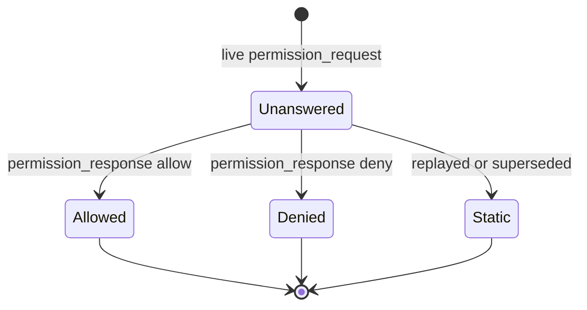

# web-console — 领域规格

## Overview

Web 控制台是人对工作台的窗口：看活动流、提交或排队 prompt、回答权限、切换模式与智能体、停止或继续。它不持有运行、目录或决策；用户意图一律发给服务端执行。

**范围:** 人可见的交互契约。
**边界:** 不驱动智能体（[agent-session](../agent-session/agent-session-spec.md)），不登记工作区或会话（[session-registry](../session-registry/session-registry-spec.md)），不裁定权限（[permission-gateway](../permission-gateway/permission-gateway-spec.md)），不定义配置字段（settings 各域）。消息形状只在[共享协议](../../../shared/api-conventions/websocket-protocol.md)中定义一次。

实体见 [web-console-models.md](web-console-models.md)。能力索引见 [features.md](../../../features.md) 的 web-console 节，此处不展开。

## Business rules

### 活动流

- **WC-R1**: 活动流按到达顺序渲染文本、工具活动、权限提示与共识，控制台不重排。
- **WC-R9**: 选中会话用 `session_selected` 的回放替换整条流，再接实时尾部，并立即采用该会话的模式与 runtime 状态。
- **WC-R5**: `turn_end` 不解锁输入、不清空会话。空闲以 `session_status` 为准。出错的结束对人可见。

助手文本按 Markdown 渲染（含代码高亮与图表）；用户与系统文本保持纯文本。

### 提示与队列

- **WC-R2**: 仅当已连接、输入非空，且当前查看会话空闲或为 team 时发送 `user_prompt`。普通会话运行中输入仍可编辑，发送走队列（WC-R17）。
- **WC-R17**: 队列只存在于本机、按会话划分；可改可删；刷新即丢。当前查看的普通会话变为空闲时合成为一条 `user_prompt` 发出。未在查看的队列等到被查看且空闲才发。team 不排队。

无查看中的会话则不能提交。输入支持斜杠命令、语音与图片。

### 权限 UI

- **WC-R7**: 控制台绝不代替人做 Allow/Deny 或填写问答，只发送人明确选择的内容。
- **WC-R3**: 一条权限提示在本视图内至多回答一次；回答后锁定为已选决策。
- **WC-R16**: 可操作的只有「当前查看会话处于 `awaiting_permission`，且是流中最新仍未决的那一条」。真正待决的在刷新后仍可答；回放或被取代的是静态记录。
- **WC-R12**: 会话列表对每个会话展示 `running` / `awaiting_permission`，包括后台。
- **WC-R13**: 后台会话进入 `awaiting_permission` 时请求一次浏览器通知；拒绝则不再打扰。

### 控制面

- **WC-R4**: `set_mode` 乐观生效，以 `mode_changed` 为准。选项只含该会话厂商合法的模式。
- **WC-R22**: 同厂商智能体切换发 `set_session_agent`，下一轮 `user_prompt` 才用新绑定（[ADR 0015](../../../architecture/adr/0015-session-agent-binding-vendor-ownership.md)）。跨厂商候选不出现。当前智能体不可用时必须切到同伴才能继续。
- **WC-R14**: 运行中或 team 活动时可发 `stop_run`。切换查看的会话或关闭连接不停止运行。
- **WC-R19**: `session_status: reconnecting` 是智能体运行在自动续跑，不是浏览器连接（WC-R6）。`turn_end` 带 `side_effect_pending` 时会话空闲，必须人确认后才用 `user_prompt` 继续。
- **WC-R30**: 运行已停且上一轮出错时，一键重试走与 Continue 同一条 `user_prompt` 路径。副作用待确认、运行中（含 reconnecting）或只读列上不出现该入口。

### 会话与工作区外壳

- **WC-R6**: 浏览器连接状态 `connecting` / `open` / `closed` 始终可见，并作为运行日志入口（WC-R31）。
- **WC-R8**: 当前工作区是本机导航状态，与正在查看的会话所属工作区解耦。切换工作区刷新目录，不自动改正在看的会话、不打断其流。新增与移除工作区仅管理员；查看与切换对已认证用户开放。
- **WC-R8a**: 新工作区路径由服务端主机选择（[session-registry](../session-registry/session-registry-spec.md)）；控制台默认不手填。点选失败才露出一次性手填。取消是正常结果。
- **WC-R10**: pending 会话保持当前，直到 `session_started` 换成真实 id。
- **WC-R21**: 新建会话可指定智能体，或省略以继承默认（[agent-config](../../settings/agent-config/agent-config-spec.md)）。宿主 CLI 不可用的厂商不能被选来新建。
- **WC-R29**: 查看 `spec_review` 时聊天列只读：无输入、无队列、无停止/继续、无权限作答。服务端续跑门禁见[意图管理](../intent-management/intent-management-spec.md)。

### 冷启动、双视图、移动端

- **WC-R20**: 两大视图：工作区与工作台。切视图不改当前工作区、不停止运行。工作区视图承载该项目的会话与账本；工作台承载通知、总览与聊天机器人。
- **WC-R23**: 一次应用会话至多弹出一层冷启动引导；条件只判定一次，整页刷新才再判定。智能体与运行时门见 [agent-config](../../settings/agent-config/agent-config-spec.md)；空目录且管理员则打开新增工作区。两扇门不叠加。

窄屏用分层进入代替桌面常驻列表，输入避开软键盘与安全区。

### 分享、日志、遮罩、更新、语言

- 标题栏一键复制带深链的标题。部署基址未配置时提示去系统设置，不静默失败。
- **WC-R31**: 运行日志是独立页面，默认同步最新。读取契约见[可用性](../../../non-functional/availability.md) OBS-6。
- 启动开发、写规格、建意图或建 PR 时以分步遮罩阻断交互，直到该动作结束；不提供假取消。
- 顶栏展示自更新进度；管理员确认后才重启。流水线见 [self-update 规格](../self-update/self-update-spec.md)。
- 界面语言为英、中、日、韩、俄，日期与数字随语言本地化。品牌名不译。

## States

一条权限类流条目，在它仍是当前待决期间：

```mermaid
stateDiagram-v2
    [*] --> Unanswered: live permission_request
    Unanswered --> Allowed: permission_response allow
    Unanswered --> Denied: permission_response deny
    Unanswered --> Static: replayed or superseded
    Allowed --> [*]
    Denied --> [*]
    Static --> [*]
```

离开 `Unanswered` 不能回去。切走视图不回答它。

## Domain events

消费协议上的运行、目录与权限事件；发出人明确选择的动作（`user_prompt`、`permission_response`、`set_mode`、`stop_run`、`set_session_agent`、会话与工作区管理）。形状见[共享协议](../../../shared/api-conventions/websocket-protocol.md)。

## Interactions

- **agent-session** — 活动流、`session_status`、停止与续跑。
- **session-registry** — 工作区与会话目录；控制台渲染，不拥有。
- **permission-gateway** — 渲染待决并回决策。
- **settings** — 打开配置面并发送读写；字段由那些域规定。
- **intent-management** — 只读评审列与长动作遮罩的窗口；账本规则在该域。
