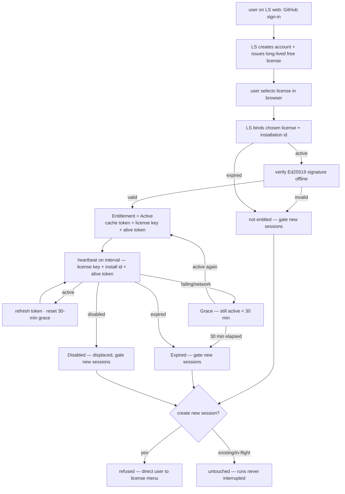

# Flow — 激活与授权生命周期

**场景。** 用户在 license-server 上登录、获取一个许可证密钥,把该密钥粘贴进 c3 完成安装绑定,
此后该安装通过周期性心跳持续保持授权——能在 30 分钟离线宽限期内挺过短暂的中断,并且授权失效时
只门控**新会话的创建**(从不影响正在运行的工作)。

**领域。** product-license · web-console · session-registry · license-server(外部)。

> **状态:绑定流程已上线(2026-06-17)。** GitHub 登录 + 默认免费许可证签发、许可证绑定与心跳
> 已在 LS 与 c3 上实现。各步骤引用 [product-license 规格](../domains/commerce/product-license/product-license-spec.md)
> 中的 `PL-R*` 规则,以及
> [license-server API 契约](../shared/api-conventions/license-server-api.md)。

## 流程图

## 登录与许可证密钥签发(license-server)

GitHub 登录**仅用于**登入/注册账号并获取许可证密钥——它本身不承载激活动作。

1. **user → license-server。** 在 LS 账号页面(`GET /activate`)用户阅读不可退款的服务协议并
   **明确同意**(`POST /activate/accept`,记录版本 + 时间戳)。
1. **user → GitHub → LS。** LS 发起 GitHub OAuth；在回调(`GET /auth/github/callback`)中 LS
   交换授权码、获取 GitHub 身份,并**创建或更新账号**。对新账号,它会签发一个带全新
   **许可证密钥**的**默认长期免费许可证**。
1. **license-server → user。** 页面列出用户的许可证,并可自动绑定唯一的长期许可证。浏览器中
   不会出现任何签名令牌或 bearer 凭据(`PL-R2`)。

## 绑定(c3)

1. **web-console → product-license。** c3 携带 `installId` + `requestId` 打开 LS；已登录用户
   在浏览器中选择一个许可证,或唯一的长期许可证自动绑定(`PL-R1`)。
2. **product-license → LS。** LS 检查许可证存在且为 `active`(状态为 `active` 且期限未过),然后
   **独占地**记录绑定:设置绑定安装、**轮换** alive token(存储其哈希,顶替任何先前的绑定),
   并盖上最近一次成功的时间戳。它返回一个**签名的授权令牌**、**alive token**(明文,仅一次)、
   `plan`、`termEnd` 以及心跳间隔。
3. **离线校验与持久化。** c3 用**内嵌的公钥**校验授权令牌的 **Ed25519** 签名,并确认其有效期
   窗口,才认可 `active`(`PL-R5`)。校验通过的令牌、许可证密钥和 alive token 会写入磁盘上的
   小型**授权缓存**(以 **0600** 权限写入)。授权进入 `Active`。

## 心跳与宽限期(c3)

1. **product-license → LS。** c3 按 LS 指定的间隔发送心跳,携带 `licenseKey`、`installationId`
   和 `aliveToken`(`PL-R3`)。
2. **Active。** 当绑定仍然匹配且许可证处于 active 且未过期时,LS 返回 `status: active` 并附带
   刷新后的签名令牌；c3 缓存它并**重置 30 分钟离线宽限期截止时间**(`PL-R3`)。
3. **Failing(瞬时故障)。** 心跳失败(或网络不可达)期间,只要最近一次成功尚**不足 30
   分钟**,c3 就停留在 **Grace(宽限)**状态,新会话仍被允许创建(`PL-R4`)。之后一次 `active`
   会返回到 `Active`。
4. **宽限耗尽。** 连续 **30 分钟**没有成功心跳后,授权失效为 **Expired**(`PL-R4`)。
5. **顶替 / 过期。** 一次成功的心跳报告 `disabled`(该许可证已被重新绑定到另一台安装)或
   `expired`(状态为 `expired`——管理员强制使其过期,或期限已到)会使授权失效并被门控
   (`PL-R8`)。这些结果以 **HTTP 200** 附带 `status` 字段返回,以此区别于网络故障;被顶替或
   过期的安装无法靠“等过”宽限期蒙混,因为后续成功的心跳会报告出该结果。

## 门控(c3)

1. **session-registry 咨询。** 授权状态只在一个点被查询——**新会话创建**。当未获授权
   (`Unactivated` / `Expired` / `Disabled`,后者指许可证被重新绑定到另一安装导致的被顶替)时,
   创建会被**拒绝**,并把用户引导至许可证菜单(`PL-R6`/`PL-R7`)。
2. **既有工作不受影响。** 既有会话(包括空闲的)保持完全可用,且**正在进行的运行绝不会被打断**
   (`PL-R6`,与 ADR-0006 一致)。
3. **状态呈现。** 全程中,**许可证徽标**反映状态(已授权 / 宽限中 / 已过期 / 未激活 / 已禁用),
   **许可证菜单**提供激活、状态查看以及购买/续费链接(`PL-R7`)。

## 续费(license-server)

一个用户可持有多个许可证；延长某个许可证的期限与状态需要一笔已支付订单。

1. **user → license-server。** 已登录用户选择一个方案与要续费的许可证,并同意服务协议
   (含不可退款条款)；license-server 创建一个 **`pending`(待处理)订单**,在**订单上**记录该次同意
   (版本 + 时间戳),并**在服务端根据方案**推算金额(客户端提交的金额会被忽略)。若未记录同意
   便进入结账,则会被拒绝(`PL-R9`)。
2. **user → license-server。** 用户通过 **微信支付** 支付该待处理订单(`PL-R9`)。
3. **license-server。** 支付确认后将该**订单**标记为已支付,并**延长关联许可证的 `termEnd`
   与状态**。该产品是虚拟/数字商品,**没有退款流程**(`PL-R10`)。(支付捕获是后续的里程碑。)

## 分支与异常(反面场景)

- **门控时不创建新会话。** 处于 `Unactivated`、`Expired` 或 `Disabled` 时**绝不能**创建新会话
  (`PL-R6`)。
- **绝不打断当前工作。** 门控**绝不能**打断正在进行的运行,或让既有会话变得不可用(`PL-R6`)。
- **信任签名,而非信任通道。** 无论 HTTP 是否成功,只要令牌的 Ed25519 签名未通过内嵌公钥校验,
  c3 都**绝不能**认可 `active`(`PL-R5`)。
- **许可证密钥只是一个句柄,而非凭据。** 仅凭许可证密钥**绝不能**被当作心跳凭据接受;只有
  每次绑定专属的 alive token 才能为心跳鉴权(`PL-R2`)。
- **秘密只留在 LS。** 任何签名密钥、OAuth 密钥或支付凭据都绝不会随 c3 二进制发布,也不会留存
  在其配置/缓存中——只有公开的校验密钥例外(`PL-R12`)。
- **未同意协议不得下单支付。** 用户**绝不能**在未记录同意服务协议(含不可退款条款)的情况下
  进入支付流程(`PL-R9`)。
- **失败要软处理(Fail-soft)。** 绑定/心跳失败**绝不能**使 c3 崩溃或打断正在运行的工作;
  它只影响宽限期耗尽后是否可以创建新会话(`PL-R13`)。
