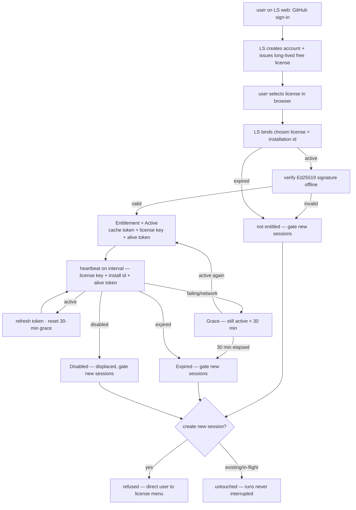

# Flow — Activation & Entitlement Lifecycle

**Scenario.** A user signs in to the license-server, obtains a license key, binds an installation by
pasting the key into c3, and that installation stays entitled through periodic heartbeats —
surviving transient outages within a 30-minute offline grace, and gating only **new-session
creation** (never running work) when entitlement lapses.

**Domains.** product-license · web-console · session-registry · license-server (external).

> **Status: binding flow live (2026-06-17).** GitHub sign-in + default free license issuance, license binding,
> and heartbeat are implemented on LS and c3. Steps reference `PL-R*` rules in
> [product-license spec](../domains/commerce/product-license/product-license-spec.md) and the
> [license-server API contract](../shared/api-conventions/license-server-api.md).

## Flow graph

## Sign-in & license-key issuance (license-server)

GitHub sign-in is used **only** to log in / register an account and obtain a license key — it does
not carry the activation action.

1. **user → license-server.** On the LS account page (`GET /activate`) the user reads the no-refund
   service agreement and **explicitly accepts** it (`POST /activate/accept`, version + timestamp
1. **user → GitHub → LS.** LS initiates GitHub OAuth; on the callback (`GET /auth/github/callback`)
   LS exchanges the code, fetches the GitHub identity, and **creates or updates the account**. For a
   new account it issues a **default long-lived free license** with a fresh **license key**.
1. **license-server → user.** The page lists the user's licenses and can auto-bind the sole long-lived
   license. No signed token or bearer credential appears in the browser (`PL-R2`).

## Binding (c3)

1. **web-console → product-license.** c3 opens LS with `installId` + `requestId`; the signed-in user
   selects a license in the browser or the sole long-lived license auto-binds (`PL-R1`).
2. **product-license → LS.** LS checks the license exists and is `active` (status `active` and the
   term not lapsed), then records the binding **exclusively**: it sets the bound installation, **rotates** the alive token
   (storing its hash, displacing any prior binding), and stamps the last-success time. It returns a
   **signed entitlement token**, the **alive token** (plaintext, once), `plan`, `termEnd`, and the
   heartbeat interval.
3. **Offline verification & persistence.** c3 verifies the entitlement token's **Ed25519** signature
   against the **embedded public key** and confirms its validity window before honoring `active`
   (`PL-R5`). The verified token, the license key, and the alive token are written to the small
   on-disk **entitlement cache** (written with **0600** permissions). Entitlement enters `Active`.

## Heartbeat & grace (c3)

1. **product-license → LS.** c3 heartbeats on the LS-dictated interval, sending `licenseKey`,
   `installationId`, and `aliveToken` (`PL-R3`).
2. **Active.** When the binding still matches and the license is active and within term, LS returns
   `status: active` with a refreshed signed token; c3 caches it and **resets the 30-minute
   offline-grace deadline** (`PL-R3`).
3. **Failing (transient).** While heartbeats fail (or the network is unreachable) but the last
   success is **under 30 minutes** old, c3 stays in **Grace** and new sessions remain allowed
   (`PL-R4`). A later `active` returns to `Active`.
4. **Grace exhausted.** After **30 minutes** with no successful heartbeat, entitlement lapses to
   **Expired** (`PL-R4`).
5. **Displacement / expiry.** A successful heartbeat reporting `disabled` (the license was rebound
   to another installation) or `expired` (status `expired` — an admin force-expired it — or the term
   ended) lapses entitlement to gated (`PL-R8`). These verdicts arrive as **HTTP 200** with a
   `status` field, distinguishing them from a network failure; a displaced or expired installation
   cannot out-wait the grace window because succeeding heartbeats report the verdict.

## Gating (c3)

1. **session-registry consult.** Entitlement is consulted at exactly one point — **new-session
   creation**. When not entitled (`Unactivated` / `Expired` / `Disabled`, the last being a license
   rebound to another installation — a displaced binding), creation is **refused** and the user is
   directed to the license menu (`PL-R6`/`PL-R7`).
2. **Existing work preserved.** Existing sessions (incl. idle) stay fully usable and **in-flight
   runs are never interrupted** (`PL-R6`, consistent with ADR-0006).
3. **Surfacing.** Throughout, the **license badge** reflects state
   (entitled / grace / expired / unactivated / disabled) and the **license menu** offers activation,
   status, and the purchase/renew link (`PL-R7`).

## Renewal (license-server)

A user may hold multiple licenses; extending one's term and status requires a paid order.

1. **user → license-server.** A signed-in user chooses a plan and the license to renew, and accepts
   the service agreement (incl. no-refund terms); license-server creates a **`pending` order** that
   records the acceptance (version + timestamp) **on the order** and derives the amount **server-side
   from the plan** (the client-supplied amount is ignored). Reaching checkout without a recorded
   acceptance is refused (`PL-R9`).
2. **user → license-server.** The user pays the pending order via **WeChat Pay** (`PL-R9`).
3. **license-server.** A confirmed payment marks the **order** paid and **extends the linked license's
   `termEnd` and status**. The product is a virtual/digital good with **no refund workflow**
   (`PL-R10`). (Payment capture is a later milestone.)

## Branches & exceptions (anti-scenarios)

- **No new session when gated.** A new session must **never** be created while `Unactivated`,
  `Expired`, or `Disabled` (`PL-R6`).
- **Never interrupt current work.** Gating must **never** interrupt an in-flight run or make an
  existing session unusable (`PL-R6`).
- **Trust the signature, not the channel.** c3 must **never** honor `active` from a token whose
  Ed25519 signature does not verify against the embedded public key, regardless of HTTP success
  (`PL-R5`).
- **License key is a handle, not a credential.** The license key alone must **never** be accepted as
  a heartbeat credential; only the per-binding alive token authenticates a heartbeat (`PL-R2`).
- **Secrets stay in LS.** No signing key, OAuth secret, or payment credential ever ships in the c3
  binary or rests in its config/cache — only the public verification key (`PL-R12`).
- **No paid order without agreement.** A user must **never** proceed to payment without recording
  acceptance of the service agreement (incl. no-refund terms) (`PL-R9`).
- **Fail-soft.** A failed bind/heartbeat must **never** crash c3 or interrupt running work; it
  affects only whether new sessions may be created once the grace window is exhausted (`PL-R13`).
