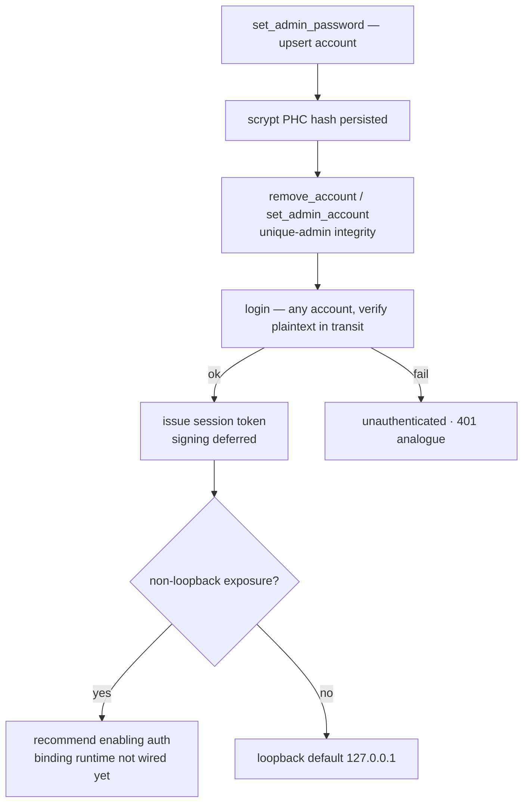

# Flow — Auth 登录门

**场景。** 当启用认证时,一个连接在驱动智能体之前必须先完成身份认证。认证是一项可选能力——
是否启用、以及是否把 c3 暴露到网络,由使用者决定(ADR-0023)。

**领域。** auth · web-console · settings。

> **状态:部分运行时已上线(2026-06-16)。** 边界与契约以及一个 **`basic` 提供方**已上线
> (真实的 scrypt-PHC 哈希、真实的 `login` 校验、多账号 + 唯一管理员管理)。
> **仍延后:** 令牌签名/校验、请求级别的 auth 中间件,以及把 `exposure.bindAddress`
> 接入服务端实际绑定的运行时应用。参见 [auth-overview](../domains/core/auth/auth-overview.md)
> 的 _Roadmap(路线图)_ 一节。本流程记录已上线的部分,并在行内标注延后的步骤。

## 流程图

## 配置账号 + 唯一管理员(引导阶段)

1. **web-console → auth。** 在系统设置的 auth 面板中,操作者选择 `basic` 提供方,并通过
   `set_admin_password { username, password, currentPassword? }` 添加一个或多个账号
   (它执行的是 **upsert**:新用户名添加一个账号,第一个添加的成为管理员;已存在的用户名则
   修改其密码)。明文在**服务端**进行哈希(scrypt PHC),只有哈希值被持久化
   (`AUTH-R3`/`AUTH-R7`)。任何账号都可以登录;管理员是配置层面的权威,而非登录特权
   (没有 RBAC)。
2. **改密码门。** 修改一个既有账号的密码需要先证明该账号的当前密码正确
   (`currentPassword` 会与其存储的哈希做校验)⇒ 不匹配则返回 `not_authenticated`
   (`AUTH-R8`)。新增账号则豁免此要求——引导阶段信任本地操作者
   (请求级别的鉴权尚在延后)。
3. **唯一管理员的完整性。** `set_admin_account { username }` 指定唯一的管理员；
   `remove_account { username }` 删除一个账号,但拒绝让管理员引用变成孤儿——若还有其他账号
   存在时删除管理员,会返回 `admin_must_reassign`(需先指定新的管理员)；删除唯一剩下的账号
   会让存储清空,回到未配置状态(`AUTH-R9`)。`basic.enabled` 是派生值:当账号集合非空且
   `adminUsername` 指向其中一个账号时为 true。
4. **账号存储的归属。** 整个 `basic` 账号集合**只**由这些专用消息修改;通用的
   `save_settings` 从不触碰它——服务器会强制把整个 basic 提供方还原为磁盘上的值,因此一份
   陈旧/空白的客户端草稿不能清空、重新指派或覆盖账号(`AUTH-R7`)。

## 登录

1. **web-console → auth。** 登录页发送 `login`(`AuthLoginRequest`)。服务器在 `accounts` 中
   按用户名查找账号,并把明文与该账号存储的哈希做校验;明文只在传输过程中存在,从不持久化
   (`AUTH-R3`)。
2. **结果。** `login_result`(`AuthLoginResult`)——成功时签发一个与提供方无关的
   `AuthSessionToken`(`{ tokenId, subject, issuedAt, expiresAt }`);令牌签名密钥通过
   `signingKeyRef` 引用,从不持久化在系统设置中(`AUTH-R4`)。**令牌的签名/校验尚在延后。**
3. **未认证。** `unauthenticated` 是 WS 层面对 HTTP 401 的对应；`logout` 结束一个会话。
   **请求级别的强制执行尚在延后**——目前这道门只在 UI 层面生效。

## 网络暴露

`exposure.bindAddress` 记录服务端绑定地址;是否把 c3 暴露到网络由使用者决定。当配置为非本地回环
地址(例如 `0.0.0.0`)时,面板建议先启用 auth,并把暴露开关放在「已配置管理员」之后(必须先配置好
管理员才能在面板里开启暴露,`AUTH-R6`)。**绑定地址的运行时应用尚未接入设置面板。**

## 分支与异常(反面场景)

- **默认 = 禁用,失败要软处理。** `SystemSettings.auth` 缺失 / `enabled: false` / 某个提供方
  校验失败 ⇒ “无 auth”,即默认设定。配置归一化会把一个畸形的 `auth` 块
  丢弃为缺失状态,且从不抛出异常——一份无效配置绝不能把用户锁在外面,也绝不能导致启动失败
  (`AUTH-R1`)。
- **向后兼容。** 一份没有 `auth` 字段的既有设置存储会以相同的(无 auth)行为原样往返
  (`AUTH-R2`)。
- **绝不明文。** 任何类型、示例或测试都不携带真实明文密码作为存储值;只有 PHC 哈希被持久化
  (`AUTH-R3`)。
- **与提供方无关。** 未来加入 SSO/多用户提供方只需新增一个 `AuthProvider` 分支 + 一个
  服务端 zod 分支;会话模型与线路消息保持不变(`AUTH-R5`)。
