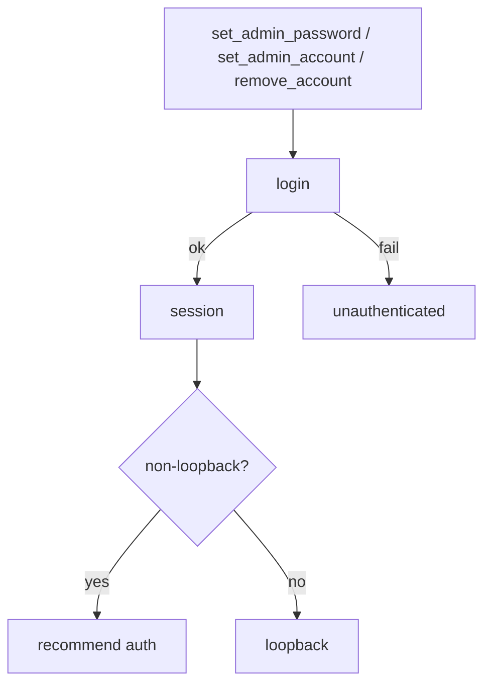

# Flow — Auth 登录门

**场景。** 连接在驱动智能体之前先过身份门。认证可选，默认关闭；是否启用、是否暴露到网络，由使用者决定（[ADR-0023](../architecture/adr/0023-auth-abstraction-network-exposure.md)）。

**领域。** auth · web-console · settings。

不变量见 [auth-spec](../domains/core/auth/auth-spec.md)；域边界见 [auth-overview](../domains/core/auth/auth-overview.md)。

## 流程图

```mermaid
flowchart TD
    CFG[set_admin_password / set_admin_account / remove_account] --> LOGIN[login]
    LOGIN -- ok --> SES[session]
    LOGIN -- fail --> UA[unauthenticated]
    SES --> EXP{non-loopback?}
    EXP -- yes --> NEED[recommend auth]
    EXP -- no --> LOOP[loopback]
```

## 步骤

1. **web-console → auth — 配置账号。** `set_admin_password` 增改账号，首位为唯一管理员；`set_admin_account` 改指派；`remove_account` 删账号且不得留下孤儿管理员。账号只经这些消息改写。改既有口令须证明当前口令；尚无管理员时允许创建首位账号。明文不落盘。无角色分层：任何账号可登录，管理员只过配置门。首位管理员落成后，当前连接须重新登录（`AUTH-R3`、`AUTH-R7`、`AUTH-R8`、`AUTH-R9`、`AUTH-R10`）。
2. **web-console → auth — 登录。** `login` 校验后签发与提供方无关的会话；失败则 `unauthenticated`。`logout` 结束会话（`AUTH-R4`、`AUTH-R5`）。
3. **settings → auth — 暴露。** 绑定非本机时建议先启用认证，且须先有管理员才能打开暴露（`AUTH-R6`）。

## 分支与异常

- **默认关闭，失败要软。** 缺省、关闭或无法解释的配置一律无认证；非法块丢弃，不阻止启动。无认证字段的既有存储仍为无认证（`AUTH-R1`、`AUTH-R2`）。
- **绝不明文。** 口令只以哈希持久化（`AUTH-R3`）。
- **无角色分层。** 管理员不是登录特权。
