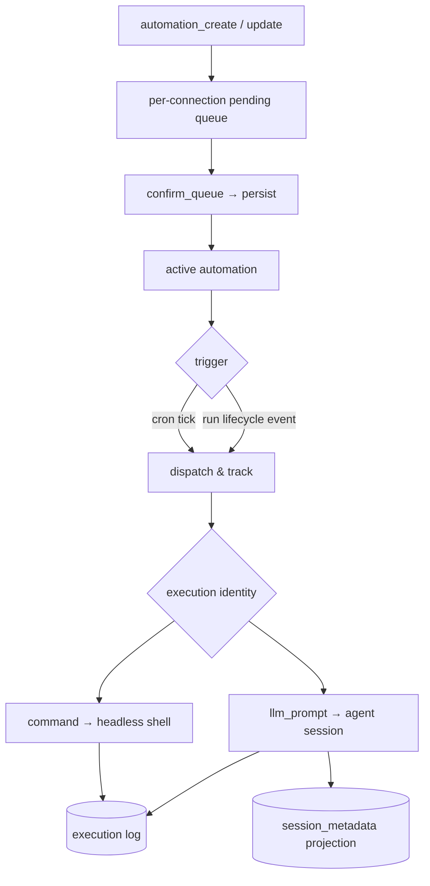

# Flow — 自动化执行

**场景。** 一个自动化的触发器被触发——一次 cron 挂钟匹配,或一个已订阅的运行生命周期事件——
c3 便在其绑定工作区的上下文中,以该自动化的执行身份,执行其任务(一条 shell 命令或一条 LLM
prompt),并把结果记录到执行日志中。

**领域。** automations · session-registry · agent-session(+ kernel 事件总线,ADR-0018)。

自动化是**工作区范围内**的:一个自动化以其工作区的 `cwd`、设置、会话和智能体配置运行——就像
从该工作区发起的一次用户运行一样。执行以**该自动化自身**的执行身份运行,而非创建者的身份
(`SCH-R*` 边界)。写操作会先经过一个确认队列,*之后*才会生效。

## 流程图

## 写路径 —— 提议 → 确认

1. **web-console → automations。** 任何变更(`automation_create` / `automation_update` /
   `automation_pause` / `automation_resume`)都会被捕获为按连接维护的写队列中的一条**待处理
   变更**,且**尚未**被持久化或纳入调度(`SCH-R6`、`SCH-R15`)。
2. **确认。** `automation_confirm_queue` 会原子性地提交所有待处理变更(`SCH-R6`)。该队列是
   临时的——刷新/重连会丢失它(`SCH-R15`)。
3. **例外。** `automation_archive` / `automation_delete` 绕过该队列——单次 prompt 确认后立即
   生效(`SCH-R6`、`SCH-R14`);删除会级联删除日志(硬删除)。
4. **校验。** 一个自动化在创建时必须引用一个已存在的工作区(`SCH-R1`);任务类型
   `command | llm_prompt` 一经创建不可变(`SCH-R2`);没有 `eventTopic` 的 `event` 触发器
   会被拒绝(`SCH-R17`)。

## 触发路径

一个自动化的触发器是以下两种之一(`SCH-R17`):

- **`cron`。** 10 秒的 tick 循环按**系统 IANA 时区**(`SystemSettings.timezone`,感知夏令时,
  `SCH-R3a`)匹配 `cronExpression`,然后重新计算 `nextRunAt`。只有 `active` 的自动化会被评估
  (`SCH-R5`)。
- **`event`。** 一次 `run:started` / `run:settled`、`pr:operation` 或 `intent:lifecycle` 的
  kernel-bus 事件(由相关领域在每次运行时发布,ADR-0018)会触发该自动化,当**所有**条件都
  成立时:事件的 `sessionKind` 为 `work`(内部的意图/讨论运行绝不会触发用户自动化)、工作区
  匹配,以及——对 `run:settled` 而言——终态 `reason` 通过可选的 `eventReasonFilter`
  (`SCH-R18`)。事件型自动化不携带 `cronExpression`/`nextRunAt`,也从不参与 tick 评估
  (`SCH-R17`)。

两者都复用**同一套**“调度并跟踪 → 执行”路径、三层执行身份体系,以及写队列(`SCH-R17`)。

意图生命周期订阅只匹配相同的工作区,以及在配置了的情况下匹配所选阶段。负载中包含一个稳定的
意图身份、标题、模块、阶段和最终状态。这些事件是进程本地的、尽力而为的、非持久化的,且从不
重放。一次自动化运行不会修改意图,也不能发布另一个意图生命周期事件。

## 执行路径

1. **工作区检查。** 若工作区在创建与触发之间被移除,执行会立即以 `workspace_removed` 失败
   (`SCH-R8`);其 `pending` 日志会被置为 `failed`(`SCH-R10`)。
2. **每个自动化串行执行。** 每个自动化最多同时有一个执行在运行;上一次运行还在进行时触发器
   再次触发会被**跳过,而非排队**——这也起到了对事件风暴的节流作用(`SCH-R7`、`SCH-R18`)。
3. **`command` ⇒ 无头 shell。** 一个 shell 进程在工作区 `cwd` 中启动；stdout+stderr 被捕获；
   退出码 0 ⇒ `success`,非零 ⇒ `failed`(`SCH-R12`)。没有权限弹窗。
4. **`llm_prompt` ⇒ 智能体会话。** 一个全新的智能体会话通过 agent-session 以该工作区上下文
   启动;该 prompt 作为第一条用户轮次。智能体的 `sessionId` 从第一个 SDK 事件中被捕获,并
   立即持久化到日志上(这样即便该次运行之后失败,transcript 仍可访问)。与此同时 c3 以
   失败软处理的方式 upsert `session_metadata`,设置 `session_kind='automation'`、
   `owner_kind='automation'`、`owner_id=<automation.id>`,使会话页的自动化标签页能展示仍在
   运行中的执行。运行过程流式写入日志;终态的 `complete`/`error` 映射为 `success`/`failed`
   (`SCH-R13`)。厂商路由解析到该工作区中第一个启用的智能体
5. **执行身份决定权限(`SCH-R9`)。** `read-only` ⇒ 等价于 `plan`,任何写工具都会被拒绝；
   `sandboxed` ⇒ 一份经过筛选的白名单,不在名单上的工具会被静默拒绝；`full-access` ⇒
   使用该工作区会话的模式,所有工具自动允许。**自动化运行绝不会向浏览器发送
   `permission_request`**——所有 prompt 都在服务端完全解决。

## 实时查看流式传输(works 页面,仅 `llm`)

一次 `llm` 执行不只是被记录——它在运行时还可以在 works 页面上被**实时查看**。该调度器运行在
kernel 运行总线之上,拥有自己独立的三层 MCP 安全模型(它**不会**经过交互式的
`kernel/permission` 网关),但一旦智能体的 `sessionId` 解析出来,它就会注册一个真正的
`SessionRuntime`(`sessionKind='automation'`、`runKind='background'`——这是第一处出现这种组合
的地方),并把 SDK / 规范化流转换为 c3 的线路事件:

- **SDK → wire。** Claude `query()` 消息通过一个纯函数转换(`assistant` 文本 →
  `assistant_text`,`tool_use` → `tool_use`,`user` 的 `tool_result` → `tool_result`,
  `result` → `turn_end`);Codex 的 `run.messages()` 规范化帧则通过共享的驱动路径
  `WireEmitter` 差分转换。每个事件都经过 `emit()`——在该运行时上缓冲,并向每个正在查看该
  会话的连接扇出。
- **状态。** 起始时 `setStatus('running')`,结束时 `idle`,驱动 works 页面状态栏上的细粒度
  文案(思考中 / 正在执行&lt;工具&gt; / 就绪),由 `sessionStatus` + 线路事件流共同推导得出。
  `listStatuses()` 的“kernel 运行时优先”规则让该运行时可以取代旧有的 `automationRunning`
  标志(`llm` 运行不再设置该标志;`command` 运行仍保留它——仅有 running/idle 两态)。
- **sessionId 绑定前的缓冲。** 在 `sessionId` 绑定之前产生的事件会被暂存,并在运行时注册的
  瞬间被冲刷出去,因此查看者绝不会错过最初的帧。
- **停止。** 调度器的挂钟 `abortController` 被注册为该运行时的 `run`,因此 works 页面的
  `stop_run` 处理器会通过 `stopRun(id)` → `rt.run.abort.abort()` 中止该次运行。
- **运行结束之后。** 该运行时会被**保留**(如同普通会话一样),因此之后再选中该自动化会话时
  可以从缓冲中回放完整的 transcript。终态清理**不会**调用 `finalizeRun`(它的 `onRunEnd`
  会把该投影的标题从自动化名重写为原生智能体标题)——取而代之,它把 `run` 置空,发出一条
  终态的 `turn_end`,并落定为 `idle`。

**`command`** 路径保持不变:没有 SDK 流、没有运行时、没有细粒度事件——只有一个 running/idle
标志。自动化页面上的 `ExecutionDetail` 轮询路径(经 `get_execution_transcript` 获取
transcript)与此正交,不受影响。

## 日志与读取路径

- 执行日志一旦设置了 `startedAt` 便**只追加**,依次推进 `pending → running →
success | failed | cancelled`(`SCH-R10`)。完成时的一次 `automations` 广播会重新拉取
  当前所选自动化的历史记录,使已完成的运行无需手动刷新即可出现。
- 三栏视图(自动化列表 → 执行历史列表 → 执行详情)展示配置、日志行和一个带标签页的详情面板。
  **Session** 标签页(仅 llm)通过共享的聊天消息渲染器,以只读方式经 `get_execution_transcript`
  回放该次执行的 transcript(`SCH-R16`);没有会话/命令类型的执行不会显示 Session 标签页,
  会返回一个空回放,而不是报错。
- 会话页面的 `automation` 标签页从 `session_metadata` 中读取这些 LLM 执行会话,而不是从
  `automation_execution_logs` 拼装出行。正在运行的自动化会话计数使用带非空 `session_id` 的
  运行中执行日志;命令类执行以及在获得真实智能体会话 id 之前就失败的 LLM 执行不会创建会话
  页的行。

## 分支与异常(反面场景)

- **先确认后生效。** 触发时间或命令的变更绝不能在用户确认队列之前生效——一次误操作的保存
  绝不能导致凌晨 3 点跑一次(`SCH-R6`)。
- **删除工作区是归档而非静默删除。** 移除工作区会归档其自动化(日志保留),并取消正在进行的
  执行(`SCH-R1`、`SCH-R8`)。
- **每个自动化不并发执行。** 一次正在进行的运行期间的第二次触发绝不会启动第二个并发执行
  (`SCH-R7`)。
- **归档/删除是终态。** 一个已归档的自动化只能被删除,绝不能被重新激活(`SCH-R14`);
  event/cron 字段互斥(`SCH-R17`)。
