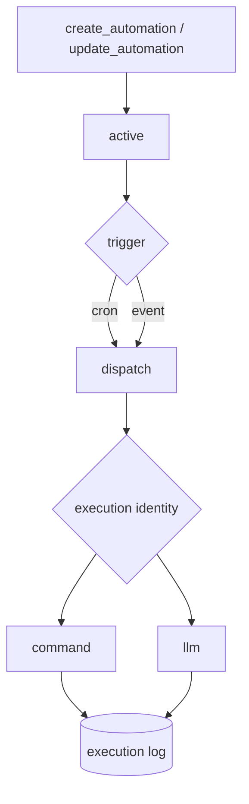

# Flow — 自动化执行

**场景。** 工作区范围内,cron 或事件触发一条命令或 LLM 任务;c3 以该自动化自身的执行身份运行,并把结果记入执行记录。

**领域。** automations · session-registry · agent-session。

本流程与意图 `automate` 队列([自动化队列](flow-automation-orchestrator.md))无关。规则见 [automations](../domains/core/automations.md)。敏感工具按冻结白名单在服务端裁定,不经浏览器权限网关(`SCH-R9`)。

## 流程图

```mermaid
flowchart TD
    W[create_automation / update_automation] --> A[active]
    A --> TRIG{trigger}
    TRIG -- cron --> DISP[dispatch]
    TRIG -- event --> DISP
    DISP --> ID{execution identity}
    ID --> CMD[command]
    ID --> LLM[llm]
    CMD --> LOG[(execution log)]
    LLM --> LOG
```

## 步骤

1. **web-console → automations。** `create_automation` / `update_automation` / `delete_automation` 即时落库并广播(`SCH-R6`)。创建须引用已登记工作区(`SCH-R1`);任务为 `command` 或 `llm`(`SCH-R2`);归档与删除经二次确认,归档不可回退(`SCH-R14`)。触发器为 `cron` 或 `event`,互斥;事件须声明合法类型(`SCH-R17`)。
2. **触发。** 仅 `active` 被自动评估(`SCH-R5`)。cron 按系统 IANA 时区解释(`SCH-R3a`)。事件订阅与过滤见 [事件机制](../architecture/event-mechanism.md)(`SCH-R18`)。两条路径汇入同一分发。工作区总闸挡住此后自动派发,不取消在途(`SCH-R28`)。
3. **automations → 分发。** 以该条绑定的厂商、智能体与权限模式执行(`SCH-R4`)。同一自动化同时至多一次在途,再触发则跳过(`SCH-R7`)。工作区已不在目录中则该次失败(`SCH-R8`);未开始的 pending 记失败(`SCH-R10`)。
4. **执行。** `command` 在工作区目录跑无头进程,非零退出为失败(`SCH-R12`)。`llm` 开专用会话,提示为第一回合,绑定真实会话后写入记录(`SCH-R13`、`SCH-R30`);在途可看实况,结束后可回放(`SCH-R27`、`SCH-R16`)。全程不发 `permission_request`(`SCH-R9`)。
5. **记录。** 执行记录只向前:`pending` → `running` → `success` | `failed` | `cancelled`(`SCH-R10`)。`command` 无会话;无会话或不可读则空回放,不报错(`SCH-R16`)。

## 分支与异常

- **工作区取消登记。** 其自动化归档(日志保留),不再评估;在途取消(`SCH-R1`、`SCH-R8`)。
- **不并发、不补跑。** 在途时第二次触发不启动第二个执行(`SCH-R7`)。cron 逾期过久不补跑(`SCH-R7a`)。
- **归档是终态。** 只能删除,不能重新激活;cron 与 event 互斥(`SCH-R14`、`SCH-R17`)。
- **无人值守。** 敏感工具不经浏览器 HITL(`SCH-R9`)。
