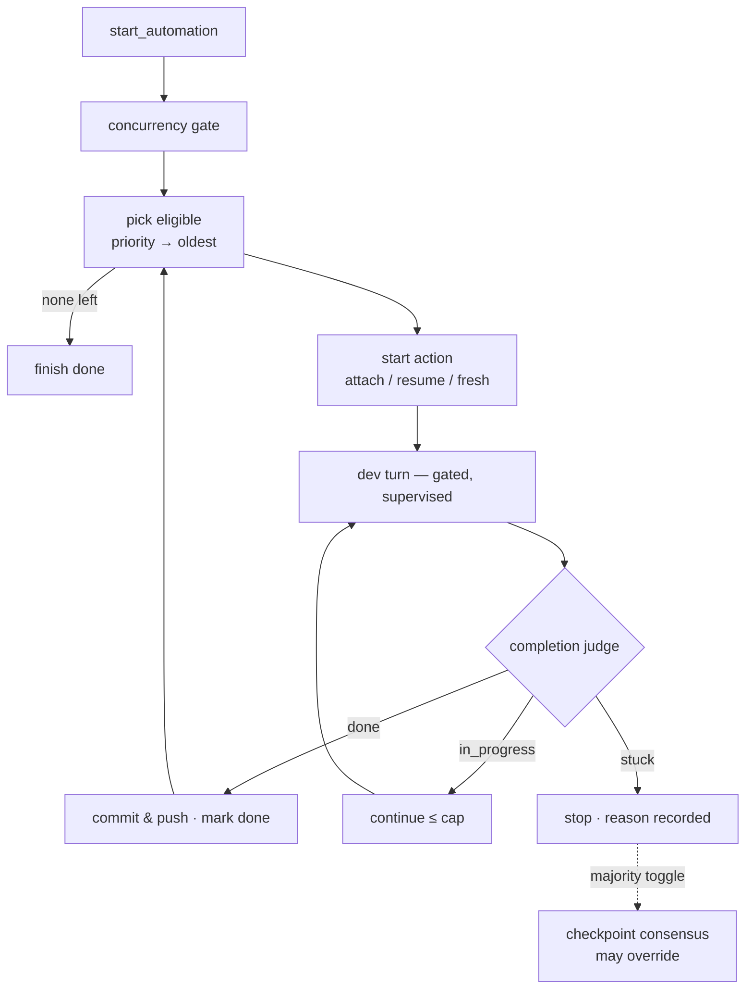

# Flow — Automation Orchestrator

**Scenario.** The user checks `automate` on the intents they want built and clicks the automation
button. A per-project background loop develops them one at a time in priority/dependency order,
judges true completion, commits & pushes, then advances — stopping with a recorded reason on any
abnormal end.

**Domains.** intent-management · agent-session · permission-gateway · git.

This is the **unattended** sibling of [intent → development](flow-intent-to-development.md). It is
the single, explicit, user-opt-in exception to the no-auto-complete rule (`RM-R9`): it marks an
intent `done` only after an independent judge confirms it **and** the change is committed & pushed
(`RM-A5`). Automation is **supervised**, not headless — a live permission prompt waits for a
watching human (`RM-A9`).

## Flow graph

## Start & sequencing

1. **web-console → intent-management.** `start_automation`. At most **one** orchestrator runs per
   project; a second start is a no-op returning the live status (`RM-A2`). The orchestrator is
   in-memory and does not survive a server restart (`RM-A2`).
2. **Global concurrency gate.** Before picking the next intent, if **any** `in_progress` intent in the project
   (including manually-launched) has a **truly running** dev session, the orchestrator attaches an
   internal viewer and waits for that turn to settle before re-checking — preventing concurrent dev
   sessions that would conflict on file writes (`RM-A12`). A **dangling** session does not block.
3. **Pick.** Eligible = `automate` AND `status ∈ {todo, in_progress}` AND every known `dependsOn` is
   `done`; in worktree mode, a `done` dependency whose PR/MR is not confirmed `merged` still blocks
   because its code is not known to be on mainline. When the workspace enables SDD (`sddEnabled`),
   the intent must also have passed the spec approval checkpoint (`spec_approved=true`). SDD off
   keeps the historic behavior and does not require a spec. If no intent is eligible only because a
   dependency PR/MR has stale unconfirmed state, the server starts a one-shot background PR/MR status
   sync and re-checks after completion; it does not poll or bypass the gate. Eligible intents are
   ordered **priority (P0→P3) then oldest-first** (`RM-A3`). `dependsOnIndexes`' submission-order
   stamp (`RM-R17`) breaks same-priority ties deterministically.

## Develop one intent

The starting action follows a strict precedence (`RM-A3`, `RM-A10`):

1. **Attach** — if the picked intent's `lastDevSessionId` is **already running a turn**, attach and
   track it (never launch a second turn — a run outlives its turn, `RM-A10`).
2. **Resume** — else an `in_progress` intent whose `lastDevSessionId` **still exists on disk** is
   resumed (`resume` id, `AS-R1`/`AS-R10`), continuing its half-built dev-skill context.
3. **Fresh** — else a `todo` or **dangling** intent starts a fresh dev session (configurable skill),
   the same dangling rule as manual launch (`RM-R8`).

The dev turn runs the standard gated loop. **Permission parity** (`RM-A9`): a prompt during the turn
behaves exactly like a manual session — the run is **not** aborted; it sits `awaiting_permission`,
the prompt surfaces to the browser, a watching human answers, the turn continues. The status shows
an "awaiting authorization" hint meanwhile.

## Judge → commit → advance

1. **Completion judge (`RM-A4`).** After the turn ends, a **tool-less** one-shot judge reads the
   intent + the dev session's last assistant message + code-change evidence (multi-repo
   `git diff`/`git log` as _supporting_ corroboration, **not** a `done` precondition) and returns
   `done` / `in_progress` / `stuck`, deciding **stuck → done → in_progress**. The turn ending alone
   is never "done"; empty evidence is never alone a `stuck` signal.
2. **`done` ⇒ commit & push (`RM-A5`).** The orchestrator commits any uncommitted work
   (`feat: <title>`, skipped if the tree is clean) and **always** pushes (multi-repo aware), then
   marks the intent `done` and advances. A commit blocked by a **pre-commit lint hook** is
   self-healed by a single dev-agent fix turn then retried once (`RM-A13`); any other commit/push
   failure (or a surviving lint failure) is a hard stop (`RM-A6`).
3. **`in_progress` ⇒ continue (`RM-A8`).** Resume the same session with a continue (clearing
   checkpoints) up to a fixed per-intent cap; exceeding the cap is an abnormal stop. The continue is
   only ever for a **pure checkpoint**, never to answer a human-decision point.
4. **`stuck` ⇒ stop (`RM-A6`)**, reason recorded next to the automation button.
5. **Exhausted.** When no eligible intent remains, the loop finishes `done` (success);
   `stop_automation` aborts the current run and returns to `idle` with no error (`RM-A7`).

## Branch — checkpoint consensus override (`RM-A14`)

When the majority toggle is ON (`ConsensusConfig.majority`), a `stuck` verdict or a
`pendingQuestion` guard may instead trigger a multi-agent vote (same-vendor peers, one-shot,
tool-denied) on whether to pass the checkpoint. A majority `continue` overrides the stop and
auto-continues (same cap as `RM-A8`); a tie / `wait` majority stops (`RM-A6`). The outcome
broadcasts via `AutomationStatus.checkpointConsensus`. It decides only _automation flow_, never the
underlying `AskUserQuestion` answer. See
[consensus](../domains/core/permission-gateway/features/permission-gateway-consensus.md).

## Branches & exceptions (anti-scenarios)

- **A human-decision point is never steamrolled.** `stuck` covers every "needs a human" signal
  (`RM-A11`). On top, an independent `pendingQuestion` guard forces a stop for a **torn-down** turn
  carrying an unanswered `AskUserQuestion` — **even if** the judge said `in_progress` (`RM-A11`,
  defence in depth).
- **Turn-end ≠ completion.** The dev skill is checkpoint-driven; a bare turn end is never taken as
  `done` (`RM-A4`).
- **Absent evidence never vetoes a credible report.** Committing is c3's job _after_ `done`, so an
  empty diff/log must not, by itself, deny completion (`RM-A4`/`RM-A5`).
- **Supervised, not unattended.** With nobody watching, a prompt can wait indefinitely; fully
  unattended runs must pre-authorize via mode/allow rules (`RM-A9`).
