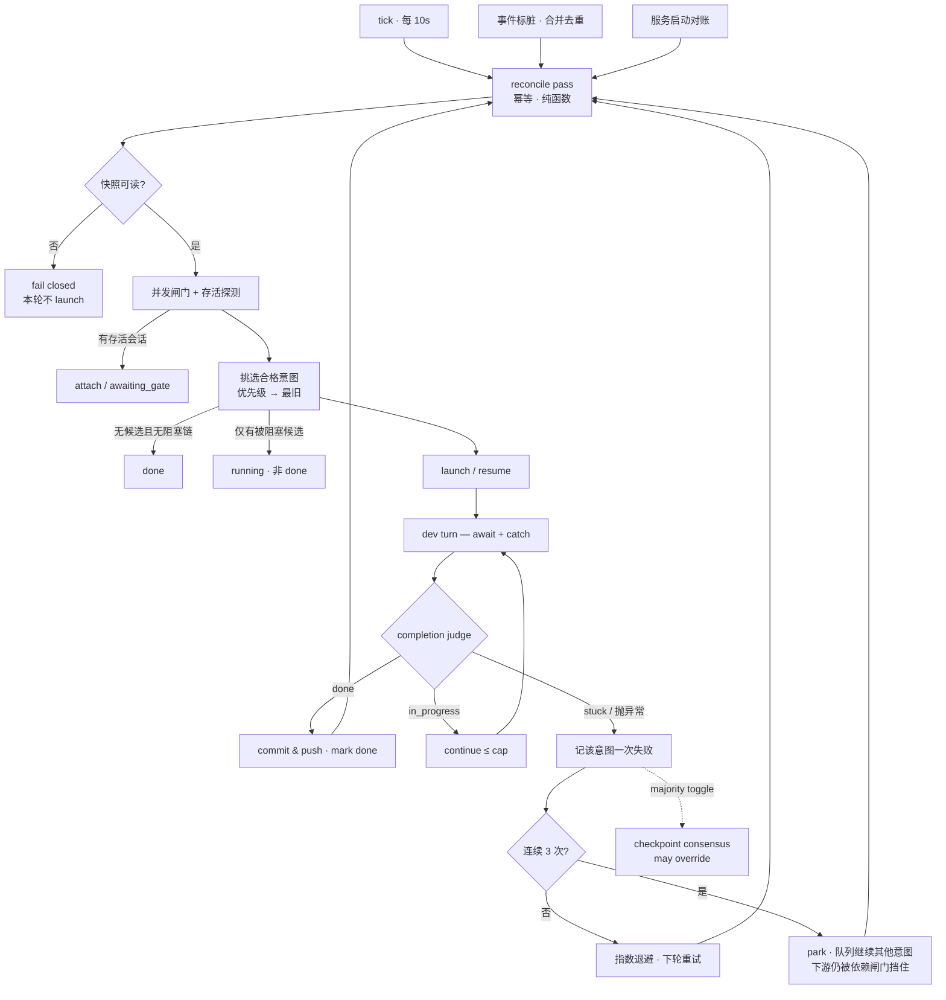

# Flow — 自动化队列(确定性调度内核)

**场景。** 用户在想要构建的意图上勾选 `automate`,然后点击自动化按钮。一个按工作区划分的
**确定性调度内核**按优先级/依赖顺序逐一开发它们,评判是否真正完成,提交并推送,然后推进。

**领域。** intent-management · agent-session · permission-gateway · git。

这是 [意图 → 开发](flow-intent-to-development.md) 的**无人值守**版本兄弟流程。它是“不自动
完成”规则(`RM-R9`)唯一一个显式的、用户主动选择加入的例外:只有在一个独立的评判者确认**且**
变更已被提交并推送(`RM-A5`)之后,它才会把一个意图标记为 `done`。自动化是**受监督的**,而非
无人值守:一次实时的权限 prompt 会等待一位正在盯着的人类(`RM-A9`)。

**队列如何前进(2026-07-31,ADR-0031)。** 队列**不由事件推动**。它以固定 10s 节拍唤醒并
**全量对账**:从意图账本快照 + 活跃 run 存活探测 + 少量持久化的单意图调度元数据**重新推导**
该做什么。生命周期事件只把工作区放进一个**合并式脏集**(“再看一眼”),因此丢一个事件最多造成
一轮延迟,不再造成永久卡死。一次失败只隔离到**那一条意图**(指数退避 → 连续 3 次 park),
队列继续处理与其**无依赖关系**的其他候选;而依赖被 park 意图的下游**仍被依赖闸门挡住**。

## 流程图

```mermaid
flowchart TD
    T1[tick · 每 10s] --> P
    T2[事件标脏 · 合并去重] --> P
    T3[服务启动对账] --> P
    P[reconcile pass<br/>幂等 · 纯函数] --> SNAP{快照可读?}
    SNAP -- 否 --> FC[fail closed<br/>本轮不 launch]
    SNAP -- 是 --> GATE[并发闸门 + 存活探测]
    GATE -- 有存活会话 --> ATT[attach / awaiting_gate]
    GATE --> PICK[挑选合格意图<br/>优先级 → 最旧]
    PICK -- 无候选且无阻塞链 --> DONE[done]
    PICK -- 仅有被阻塞候选 --> RUN[running · 非 done]
    PICK --> ACT[launch / resume]
    ACT --> DEVT[dev turn — await + catch]
    DEVT --> J{completion judge}
    J -- done --> CP[commit & push · mark done]
    J -- in_progress --> CONT[continue ≤ cap]
    J -- stuck / 抛异常 --> FAIL[记该意图一次失败]
    CONT --> DEVT
    FAIL --> BO{连续 3 次?}
    BO -- 否 --> BACK[指数退避 · 下轮重试]
    BO -- 是 --> PARK[park · 队列继续其他意图<br/>下游仍被依赖闸门挡住]
    CP --> P
    BACK --> P
    PARK --> P
    FAIL -. majority toggle .-> CC[checkpoint consensus<br/>may override]
```

## 启动与排序

1. **web-console → intent-management。** `start_workflow`。每个工作区最多一个队列;第二次启动
   是空操作,只会返回当前状态(`RM-A2`)。**启停意愿被持久化**:服务重启后,启动时的全工作区
   对账会从持久事实恢复队列,而不是静默变回 `idle`(`RM-A20`)。
2. **全局并发闸门(语义不变)。** 在挑选下一个意图之前,若该工作区中**任何**一个 `in_progress`
   的意图(包括手动启动的)有一个**真正在运行**的工作会话,队列不 launch 新意图,状态为
   `awaiting_gate`(`RM-A12`)。一个**悬空(dangling)**的会话不会阻塞 —— 而现在这一点是由每轮
   的**存活探测**保证的:一个已死的阻塞会话不再出现在存活集合中,闸门随即释放,不必等一个
   永远不会到来的 settle(`RM-A10`)。
3. **挑选。** 符合资格的条件是:`automate` 为真,且 `status ∈ {todo, in_progress}`,且所有已知的
   `dependsOn` 都是 `done`;在 worktree 模式下,若某个 `done` 依赖的 PR/MR 尚未确认为
   `merged`,则依然会阻塞,因为其代码是否已进入主干尚不确定。当工作区启用了 SDD
   (`sddEnabled`)时,该意图还必须通过规格审批检查点(`spec_approved=true`)。SDD 关闭时保持
   历史行为,不要求有规格。若唯一使某个意图不符合资格的原因是某个依赖的 PR/MR 状态陈旧且未
   确认,服务器会启动一次一次性的后台 PR/MR 状态同步,完成后重新对账;它不会轮询,也不会绕过
   该闸门。**SDD 未批准不再被静默跳过**,而是产出显式的 `blocked_spec_not_approved` 阻塞原因,
   并且这样的队列**不得显示 `done`**(`RM-A18`、`RM-A7`)。符合资格的意图按**优先级(P0→P3)再
   按最旧优先**排序(`RM-A3`)。`dependsOnIndexes` 的提交顺序戳记(`RM-R17`)会确定性地打破同
   优先级的平局。另外三类条目本轮不参与选择,并各自带可展示的原因码:**退避中**、**已 park**、
   **被用户强制跳过**。

## 开发一个意图

启动动作遵循严格的优先级次序(`RM-A3`、`RM-A10`):

1. **Attach(附加)**——若被选中意图的 `lastWorkSessionId` **已经在运行某一轮**,附加并跟踪它
   (绝不启动第二轮——一次运行会比一轮更长命,`RM-A10`)。
2. **Resume(恢复)**——否则,若一个 `in_progress` 意图的 `lastWorkSessionId` **仍存在于磁盘上**,
   则恢复它(`resume` id,`AS-R1`/`AS-R10`),延续其半成品的 dev-skill 上下文。
3. **Fresh(全新)**——否则,一个 `todo` 或**悬空**的意图会启动一个全新的工作会话(可配置技能),
   与手动启动相同的悬空规则(`RM-R8`)。

开发轮次运行标准的受门控循环。**权限一致性**(`RM-A9`):该轮次中出现的一次 prompt 行为与手动
会话完全一致——该次运行**不会**被中止;它停在 `awaiting_permission`,该 prompt 呈现给浏览器,
一位正在盯着的人类回答后,该轮次继续。与此同时状态会显示一个“等待授权”的提示。

## 评判 → 提交 → 推进

1. **完成度评判(`RM-A4`)。** 该轮次结束后,一个**不带工具**的一次性评判者读取该意图 +
   工作会话最后一条助手消息 + 代码变更证据(跨多仓库的 `git diff`/`git log` 仅作为*佐证性*
   旁证,**不是** `done` 的先决条件),返回 `done` / `in_progress` / `stuck`,判定优先级依次
   为 **stuck → done → in_progress**。轮次结束本身绝不等同于“done”;空的证据本身也绝不单独
   构成 `stuck` 信号。
2. **`done` ⇒ 提交并推送(`RM-A5`)。** 队列提交任何未提交的工作(`feat: <title>`,若工作树
   干净则跳过),并**总是**推送(感知多仓库),然后把该意图标记为 `done` 并推进。若提交被
   **pre-commit lint 钩子**拦截,会通过单次开发智能体修复轮次自愈,再重试一次(`RM-A13`);
   任何其他提交/推送失败(或修复后仍然存在的 lint 失败)都计为**该意图**的一次失败(`RM-A6`),
   队列本身继续。
3. **`in_progress` ⇒ 继续(`RM-A8`)。** 用一次 continue 恢复同一会话(清除各检查点),直到达到
   一个固定的单意图上限;超出该上限计为该意图的一次失败,而**不是**停整条队列。continue 仅用于
   **纯粹的检查点**,绝不用于回答一个人工决策点。
4. **`stuck` / launch 抛异常 ⇒ 该意图失败一次(`RM-A6`)。** 指数退避(30s 起,逐次翻倍,上限
   15 分钟);**连续第 3 次进入 park**。park 的意图不再自动启动,但**不是 `done`** ——
   依赖它的下游继续被依赖闸门挡住,**既不跳过也不放行**(`RM-A17`)。
5. **每一轮的取舍都被记录(`RM-A18`)。** `queue_decision_log` 按 tick/intent 记录选择的动作、
   被哪个闸门挡住、拒绝理由、尝试/退避计数与下次唤醒时间;队列页面逐条展示,并提供 pause /
   force-skip / unpark / 覆盖结论等与内核动作一一对应的人工动作(`RM-A19`)。
6. **耗尽。** 只有当快照中**不存在任何待处理的自动化候选及阻塞链**时,队列才呈现 `done`;
   仍有退避 / park / 被闸门阻塞的候选时呈现 `running`。`stop_workflow` 会中止当前运行并无错误地
   返回 `idle`(`RM-A7`)。

## 分支 —— 检查点共识override(`RM-A14`)

当多数票开关(`ConsensusConfig.majority`)为 ON 时,一次 `stuck` 判定或一个
`pendingQuestion` 守卫可能改为触发一次多智能体投票(通过共享的跨厂商
`selectConsensusVoters` 选出的对等方,一次性、禁用工具;continue/wait 的 prompt 与厂商无关,
且跳过工具风险归一化器),来决定是否通过该检查点。多数票 `continue` 会覆盖该次失败并
自动继续(与 `RM-A8` 相同的上限);平票 / 多数为 `wait` 则按 `RM-A6` / `RM-A11` 处理该意图。结果通过
`WorkflowStatus.checkpointConsensus` 广播。它只决定*自动化流程*本身,绝不决定底层
`AskUserQuestion` 的答案。参见
[consensus(共识)](../domains/core/permission-gateway/features/permission-gateway-consensus.md)。

## 自动化 c3 MCP 工具集

自动化执行环境(每个 `llm_prompt` 类型的自动化运行)绑定一个受限的 c3 MCP 服务,暴露以下
工具(与手动 WebSocket 路径相同的行为,但以 MCP 返回值表达结果):

| 工具名                     | 类型 | 说明                                                                                                                                                                                                                                                                                 |
| -------------------------- | ---- | ------------------------------------------------------------------------------------------------------------------------------------------------------------------------------------------------------------------------------------------------------------------------------------ |
| `find_intents`             | 只读 | 按 status/module/keyword 检索项目意图列表                                                                                                                                                                                                                                            |
| `view_intent`              | 只读 | 按 id 查看单条意图完整详情                                                                                                                                                                                                                                                           |
| `save_intent_pr_info`      | 写   | 回填意图的 PR 状态(由 PR 对账自动化使用)                                                                                                                                                                                                                                             |
| `save_intent_directly`     | 写   | 直接落库新建草稿意图(绕过人工确认,仅限自动化)                                                                                                                                                                                                                                        |
| `publish_pr_event`         | 写   | 发布 PR 操作事件(触发其他自动化)                                                                                                                                                                                                                                                     |
| `find_discussions`         | 只读 | 检索项目讨论列表                                                                                                                                                                                                                                                                     |
| `view_discussion`          | 只读 | 查看单条讨论详情及消息                                                                                                                                                                                                                                                               |
| `start_discussion`         | 写   | 启动一个 draft 讨论                                                                                                                                                                                                                                                                  |
| `continue_discussion`      | 写   | 继续或恢复一个讨论                                                                                                                                                                                                                                                                   |
| `start_session_for_intent` | 写   | **按意图启动 spec 或 work 会话**。接受 `intentId` + `sessionType`(`'spec'` / `'work'`),复用与手动操作一致的校验门禁(状态、SDD 审批、依赖阻塞、Git 分支策略)。成功返回 JSON `{sessionId, sessionType}`,失败返回 JSON `{code, params}` 且 `isError: true`。不发送 WebSocket 进度事件。 |

工具列表源是 `AUTOMATION_C3_TOOL_NAMES`——所有表面(Claude SDK、Codex HTTP)自动同步,
无需维护第二份名单。

## 分支与异常(反面场景)

- **人工决策点绝不会被碾过。** `stuck` 涵盖每一种“需要人类介入”的信号(`RM-A11`)。在此之上,
  一个独立的 `pendingQuestion` 守卫会强制停止一个**已拆除**且带有未回答的 `AskUserQuestion`
  的轮次——**即便**评判者判定为 `in_progress`(`RM-A11`,纵深防御)。
- **轮次结束 ≠ 完成。** dev skill 是由检查点驱动的;一次单纯的轮次结束绝不会被当作 `done`
  (`RM-A4`)。
- **缺乏证据绝不否决一份可信的报告。** 提交是 c3 在 `done` *之后*的工作,因此一个空的
  diff/log 本身绝不能否定完成(`RM-A4`/`RM-A5`)。
- **受监督而非无人值守 —— 但不再连坐。** 权限提示仍然会等待一位在场的人类,**运行永不被中止、
  决定永不被自动作答**(`C-SEC-3`)。有窗口的是**队列的等待**:超过 30 分钟无人应答时,队列
  **park 该意图并推一条去重的 `wait-user-involve` 待办**,然后继续处理其他候选(`RM-A9`、
  `RM-A17`)。要完全无人值守运行,仍须通过 mode/allow 规则预先授权。
- **launch 异常不再吞掉。** 所有内核发起的 run 都被 await 并捕获;一次异常记为该意图的一次
  失败尝试并进入退避,队列在下一轮继续推进 —— 而不是等一个永远不会到来的 settle(`RM-A16`)。
- **丢事件只是延迟。** 事件只标脏、不携带决策依据、不重放;丢一个最多延后一轮对账(`RM-A15`)。
- **快照不可读时 fail closed。** 本轮不 launch 任何意图,只记录一条工作区级故障,由下一轮
  重新对账(`RM-A20`)。
- **人工动作不能绕过硬闸门。** `force-skip` 只改变本轮选择,**不**标记 `done`、**不**满足依赖;
  `覆盖结论`只能在既有合法后续动作中选择,不能绕过权限、spec、依赖、并发、续跑预算或提交推送
  成功等闸门(`RM-A19`)。
