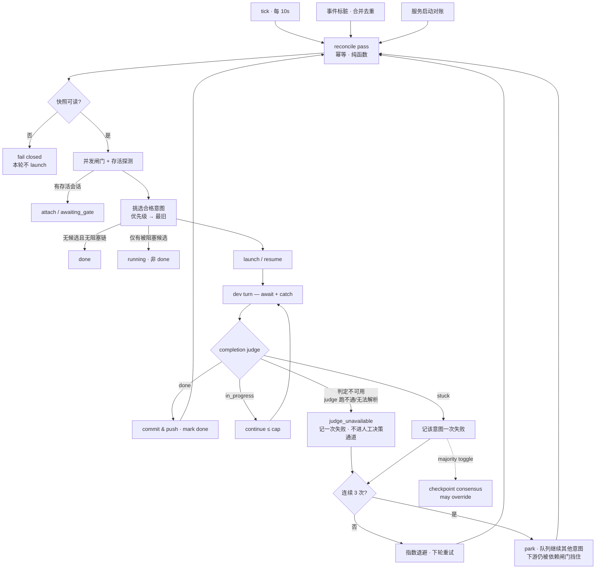

# Flow — 自动化队列(确定性调度内核)

**场景。** 用户在想要构建的意图上勾选 `automate`,然后点击自动化按钮。一个按工作区划分的
**确定性调度内核**按优先级/依赖顺序逐一开发它们,评判是否真正完成,提交并推送,然后推进。

**领域。** intent-management · agent-session · permission-gateway · git。

这是 [意图 → 开发](flow-intent-to-development.md) 的**无人值守**版本兄弟流程。它是“不自动
完成”规则(`RM-R9`)唯一一个显式的、用户主动选择加入的例外:只有在一个独立的评判者确认**且**
变更已被提交并推送(`RM-A5`)之后,它才会把一个意图标记为 `done`。自动化是**受监督的**,而非
无人值守:一次实时的权限 prompt 会等待一位正在盯着的人类(`RM-A9`)。

**队列如何前进(2026-07-31,ADR-0031)。** 队列**不由事件推动**。它以固定 10s 节拍唤醒并
**全量对账**:从意图账本快照 + 活跃 run 存活探测 + 少量持久化的单意图调度元数据**重新推导**
该做什么。生命周期事件只把工作区放进一个**合并式脏集**(“再看一眼”),因此丢一个事件最多造成
一轮延迟,不再造成永久卡死。一次失败只隔离到**那一条意图**(指数退避 → 连续 3 次 park),
队列继续处理与其**无依赖关系**的其他候选;而依赖被 park 意图的下游**仍被依赖闸门挡住**。

## 流程图

```mermaid
flowchart TD
    T1[tick · 每 10s] --> P
    T2[事件标脏 · 合并去重] --> P
    T3[服务启动对账] --> P
    P[reconcile pass<br/>幂等 · 纯函数] --> SNAP{快照可读?}
    SNAP -- 否 --> FC[fail closed<br/>本轮不 launch]
    SNAP -- 是 --> GATE[并发闸门 + 存活探测]
    GATE -- 有存活会话 --> ATT[attach / awaiting_gate]
    GATE --> PICK[挑选合格意图<br/>优先级 → 最旧]
    PICK -- 无候选且无阻塞链 --> DONE[done]
    PICK -- 仅有被阻塞候选 --> RUN[running · 非 done]
    PICK --> ACT[launch / resume]
    ACT --> DEVT[dev turn — await + catch]
    DEVT --> J{completion judge}
    J -- done --> CP[commit & push · mark done]
    J -- in_progress --> CONT[continue ≤ cap]
    J -- stuck --> FAIL[记该意图一次失败]
    J -- 判定不可用<br/>judge 跑不通/无法解析 --> FAILU[judge_unavailable<br/>记一次失败 · 不进人工决策通道]
    CONT --> DEVT
    FAILU --> BO
    FAIL --> BO{连续 3 次?}
    BO -- 否 --> BACK[指数退避 · 下轮重试]
    BO -- 是 --> PARK[park · 队列继续其他意图<br/>下游仍被依赖闸门挡住]
    CP --> P
    BACK --> P
    PARK --> P
    FAIL -. majority toggle .-> CC[checkpoint consensus<br/>may override]
```

## 启动与排序

1. **web-console → intent-management。** `start_workflow`。每个工作区最多一个队列;第二次启动
   是空操作,只会返回当前状态(`RM-A2`)。**启停意愿被持久化**:服务重启后,启动时的全工作区
   对账会从持久事实恢复队列,而不是静默变回 `idle`(`RM-A20`)。
2. **并发闸门(`RM-A12`)。** 闸门要挡的是两个工作会话改同一份文件,作用范围随 Git 分支模式:
   `current-branch` 下所有意图共用一份检出,该工作区中**任何**一个 `in_progress` 意图(包括手动
   启动的)有**真正在运行**的工作会话时,队列不 launch 新意图,状态为 `awaiting_gate`;
   `worktree` 下每条意图各有独立目录,运行中的会话只代表它自己,队列在观察它的同时可另选一个
   合格意图,多条意图并行开发,但并行开发总数受工作区 `automationConcurrency` 配额(默认 2)约束:
   内核按意图 ID 去重统计占用(in-flight run + 队列挂接的活跃自动化会话 + 本轮新选中),达到上限
   即不再挑选,其余合格意图以 `blocked_concurrency_gate`「已达并发上限 N」阻塞(每轮仍最多发起
   一个新的工作动作)。一个**悬空(dangling)**的会话两种模式下都不阻塞 —— 这由每轮的**存活探测**
   保证:已死的阻塞会话不再出现在存活集合中,闸门随即释放,不必等一个永远不会到来的 settle
   (`RM-A10`)。
3. **挑选。** 符合资格的条件是:`automate` 为真,且 `status ∈ {todo, in_progress}`,且所有已知的
   `dependsOn` 都是 `done`;在 worktree 模式下,若某个 `done` 依赖的 PR/MR 尚未确认为
   `merged`,则依然会阻塞,因为其代码是否已进入主干尚不确定。当工作区启用了 SDD
   (`sddEnabled`)时,该意图还必须通过规格审批检查点(`spec_status='approved'`——`specStatus`
   是唯一事实源,`raw`/`pending` 一律视为未通过)。**唯一例外是有效规格模式为 `fast` 的意图**:
   它本就不先写规格,规格由工作回合落定后反向补轨,因此队列不因未批准的规格挡住它 ——
   与手动准入同一条例外,两条路径对同一批事实不会给出相反结论;fast 意图也因此不进入
   规格阶段,队列不会替它撰写或审核规格。SDD 关闭时保持
   历史行为,不要求有规格。若唯一使某个意图不符合资格的原因是某个依赖的 PR/MR 状态陈旧且未
   确认,服务器会启动一次一次性的后台 PR/MR 状态同步,完成后重新对账;它不会轮询,也不会绕过
   该闸门。**SDD 未批准不再被静默跳过**,而是产出显式的 `blocked_spec_not_approved` 阻塞原因,
   并且这样的队列**不得显示 `done`**(`RM-A18`、`RM-A7`)。符合资格的意图按**优先级(P0→P3)再
   按最旧优先**排序(`RM-A3`)。`dependsOnIndexes` 的提交顺序戳记(`RM-R17`)会确定性地打破同
   优先级的平局。另外三类条目本轮不参与选择,并各自带可展示的原因码:**退避中**、**已 park**、
   **被用户强制跳过**。

## 开发一个意图

启动动作遵循严格的优先级次序(`RM-A3`、`RM-A10`):

1. **Attach(附加)**——若被选中意图的 `lastWorkSessionId` **已经在运行某一轮**,附加并跟踪它
   (绝不启动第二轮——一次运行会比一轮更长命,`RM-A10`)。
2. **Resume(恢复)**——否则,若一个 `in_progress` 意图的 `lastWorkSessionId` **仍存在于磁盘上**,
   则恢复它(`resume` id,`AS-R1`/`AS-R10`),延续其半成品的 dev-skill 上下文。
3. **Fresh(全新)**——否则,一个 `todo` 或**悬空**的意图会启动一个全新的工作会话(可配置技能),
   与手动启动相同的悬空规则(`RM-R8`)。

这三态属于共享的 `launchWorkSession`,而非队列内核独有:手动「开始开发」按钮与 MCP
`start_session_for_intent` 走同一条路径,对同一组事实产生同一结果。**发起新 turn 就是一次新准入**,
因此 fresh 与 resume 在该函数内过同一条闸门链:`RM-A12` 并发闸门 → SDD 规格批准 → `worktree` 下的
依赖闸门(`RM-A21`)。`current-branch` 下同工作区若有**其它**意图的工作会话正在运行,fresh 与 resume
都被拒(`intent.concurrencyGate`),`worktree` 下则放行;规格批准被撤销或依赖 PR 未合并时,空闲会话
同样不能被恢复。attach 只挂 viewer、不发 turn,不构成新准入,也不受这条闸门链约束;悬空会话从不阻塞。
底层存在**未作答**的 `AskUserQuestion` 时不得 resume——续跑提示绝不代替用户的答案
(`intent.pendingQuestionUnanswered`,`RM-A11`/`C-SEC-3`)。

开发轮次运行标准的受门控循环。**权限一致性**(`RM-A9`):该轮次中出现的一次 prompt 行为与手动
会话完全一致——该次运行**不会**被中止;它停在 `awaiting_permission`,该 prompt 呈现给浏览器,
一位正在盯着的人类回答后,该轮次继续。与此同时状态会显示一个“等待授权”的提示。

## 评判 → 提交 → 推进

1. **完成度评判(`RM-A4`)。** 该轮次结束后,一个**不带工具**的一次性评判者读取该意图 +
   工作会话最后一条助手消息 + 代码变更证据(跨多仓库的 `git diff`/`git log` 仅作为*佐证性*
   旁证,**不是** `done` 的先决条件),返回 `done` / `in_progress` / `stuck`,判定优先级依次
   为 **stuck → done → in_progress**。轮次结束本身绝不等同于“done”;空的证据本身也绝不单独
   构成 `stuck` 信号。评判者的 provider 连接与其它会话同规:`custom` 模式的工具 agent 经中继
   下发真实上游,只下发模型名而不下发其 provider 会让 CLI 拿着三方模型名去打一方端点。
2. **`done` ⇒ 提交并推送(`RM-A5`)。** 队列提交任何未提交的工作(`feat: <title>`,若工作树
   干净则跳过),并**总是**推送(感知多仓库),然后把该意图标记为 `done`,**之后**才建 PR:
   建 PR 以重读到的意图状态为准(非 `done` 则整体跳过),base 由 `resolvePrTarget` 解析
   (与手动建 PR 同一份解析):关联就绪交付 ⇒ 该交付分支;未关联 ⇒ 意图 `baseBranch`
   (`delivery_id` 为空);目标不可用(分支未就绪 / 多关联 / 交付未知)时不建 PR 并推一条待办
   说明原因,**绝不另选主线顶替**。建 PR 的结果不改变已达成的 `done`。若提交被
   **pre-commit lint 钩子**拦截,会通过单次开发智能体修复轮次自愈,再重试一次(`RM-A13`);
   任何其他提交/推送失败(或修复后仍然存在的 lint 失败)都计为**该意图**的一次失败(`RM-A6`),
   队列本身继续。
3. **`in_progress` ⇒ 继续(`RM-A8`)。** 用一次 continue 恢复同一会话(清除各检查点),直到达到
   一个固定的单意图上限;超出该上限计为该意图的一次失败,而**不是**停整条队列。continue 仅用于
   **纯粹的检查点**,绝不用于回答一个人工决策点。
4. **`stuck` / launch 抛异常 ⇒ 该意图失败一次(`RM-A6`)。** 指数退避(30s 起,逐次翻倍,上限
   15 分钟);**连续第 3 次进入 park**。park 的意图不再自动启动,但**不是 `done`** ——
   依赖它的下游继续被依赖闸门挡住,**既不跳过也不放行**(`RM-A17`)。
5. **判定不可用 ⇒ 同样失败一次,但原因码不同(`judge_unavailable`)。** 评判者跑不通(工具
   agent 的 provider/模型配置错误、一次性会话未启动)或回答不是一个判定对象时,这是**工具侧
   故障,不是关于这条意图的判定**:不折叠成 `stuck`、不触发检查点共识、不进人工决策通道,
   只按 `RM-A6` 记一次失败并退避,原因码指向工具 agent 配置。
6. **每一轮的取舍都被记录(`RM-A18`)。** `queue_decision_log` 按 tick/intent 记录选择的动作、
   被哪个闸门挡住、拒绝理由、尝试/退避计数与下次唤醒时间;队列页面逐条展示,并提供 pause /
   force-skip / unpark / 覆盖结论等与内核动作一一对应的人工动作(`RM-A19`)。同一轮还派生出
   被并发闸门挡住者的**队列位次**(`RM-A19`),只展示不落库。
7. **耗尽。** 只有当快照中**不存在任何待处理的自动化候选及阻塞链**时,队列才呈现 `done`;
   仍有退避 / park / 被闸门阻塞的候选时呈现 `running`。`stop_workflow` 会中止当前运行并无错误地
   返回 `idle`(`RM-A7`)。

## 分支 —— 检查点共识override(`RM-A14`)

当多数票开关(`ConsensusConfig.majority`)为 ON 时,一次 `stuck` 判定或一个
`pendingQuestion` 守卫可能改为触发一次多智能体投票(通过共享的跨厂商
`selectConsensusVoters` 选出的对等方,一次性、禁用工具;continue/wait 的 prompt 与厂商无关,
且跳过工具风险归一化器),来决定是否通过该检查点。多数票 `continue` 会覆盖该次失败并
自动继续(与 `RM-A8` 相同的上限);平票 / 多数为 `wait` 则按 `RM-A6` / `RM-A11` 处理该意图。结果通过
`WorkflowStatus.checkpointConsensus` 广播。它只决定*自动化流程*本身,绝不决定底层
`AskUserQuestion` 的答案。参见
[consensus(共识)](../domains/core/permission-gateway/features/permission-gateway-consensus.md)。

## 自动化 c3 MCP 工具集

自动化执行环境(每个 `llm_prompt` 类型的自动化运行)绑定一个受限的 c3 MCP 服务,暴露以下
工具(与手动 WebSocket 路径相同的行为,但以 MCP 返回值表达结果):

- **`find_intents`**(只读): 按 status/module/keyword 检索项目意图列表
- **`view_intent`**(只读): 按 id 查看单条意图完整详情
- **`find_deliveries`**(只读): 按 status/keyword 检索项目交付列表(状态、基线/交付分支、就绪标志、集成就绪 N/M)。交付**没有写工具**:状态写必须过交付状态机与守卫;默认不勾选
- **`view_delivery`**(只读): 按 id 查看单条交付完整详情(含关联意图与最新交付 PR 行);默认不勾选
- **`save_intent_directly`**(写): 直接落库新建草稿意图(绕过人工确认,仅限自动化)
- **`sync_intent_pr_status`**(写): **触发服务端从 forge 派生 PR 终态并落库**。只接受 `intentId`,不接受任何状态值:服务端遍历该意图全部 `reviewing` 的 PR 行逐条向 forge 查询,`merged`/`closed` 终态落库并写意图日志,仍 `open` 的行不变。模型只触发,状态唯一由 forge 裁决
- **`publish_pr_event`**(写): 发布 PR 操作事件(触发其他自动化)
- **`find_discussions`**(只读): 检索项目讨论列表
- **`view_discussion`**(只读): 查看单条讨论详情及消息
- **`start_discussion`**(写): 启动一个 draft 讨论
- **`continue_discussion`**(写): 继续或恢复一个讨论
- **`start_session_for_intent`**(写): **按意图启动 spec 或 work 会话**。接受 `intentId` + `sessionType`(`'spec'` / `'work'`),复用与手动操作一致的校验门禁(状态、SDD 审批、依赖阻塞、Git 分支策略)。`work` 分支按 `lastWorkSessionId` 三态解析:运行中 **attach**(返回原 id,不发新 turn)、空闲 **resume**(原 id 上续跑)、无会话才 **fresh**;fresh 与 resume 发起新 turn 前都要过下沉到 `launchWorkSession` 内的同一条闸门链(RM-A12 并发 → SDD 批准 → 依赖)。成功返回 JSON `{sessionId, sessionType, mode}`,失败返回 JSON `{code, params}` 且 `isError: true`。不发送 WebSocket 进度事件。

工具列表源是 `AUTOMATION_C3_TOOL_NAMES`——所有表面(Claude SDK、Codex HTTP)自动同步,
无需维护第二份名单。

**PR 终态回填经 `sync_intent_pr_status` 显式触发**:工具只接受 `intentId`,不携带任何状态值——服务端
遍历该意图全部处于 `reviewing` 的 PR 行逐条向 forge 查询真实状态,`merged` / `closed` 终态落库并写
意图日志,forge 仍 `open` 的行保持不变。模型不直接写状态,终态唯一由 forge 裁决;`rejected` /
`failed` / `closed → reviewing` 的复位仍由携带 `association.deliveryId` 或 `pr.number` 的
`pr:update` 事件处理。

## 顾问 Agent 的专属工具组(propose-then-validate)

确定性内核只处理「知道怎么办」的情形。遇到需要判断的节点(从 transcript 根因分析一个死掉的
run、该 retry 还是 reset/skip/escalate),内核可**按需唤起**一个顾问 Agent:它**不常驻、不握
方向盘**,只**提出**一个结构化动作,由内核校验后执行。

> **本条只交付工具面 + 双保险校验。** 内核**何时/如何**唤起顾问(park 触发时机、会话类型、
> transcript 上下文注入、续跑预算定义)尚未立项。没有触发面,顾问不会自动被唤起——不应期待
> 「park 后自动打开顾问会话」这类端到端行为。

**这不是普通 automation 的能力。** 该组有自己的注册表(`ADVISOR_C3_TOOL_NAMES`)和自己的
loopback 路由(`transport/advisor-mcp`),**不并入** `AUTOMATION_C3_TOOL_NAMES`;上面那张自动化
工具表因此一条未增。作用域(工作区 + 目标意图)由**闭包**绑定,任何工具都不接受
`workspacePath` / `intentId` 参数——提案携带 `workspacePath` 本身就是一次越权尝试,直接被拒。

| 工具                                          | 读/写 | 服务端重校验                       | 确认队列   |
| --------------------------------------------- | ----- | ---------------------------------- | ---------- |
| `read_session_transcript`                     | 读    | 会话归属;先脱敏后尾部截断          | 免         |
| `get_run_status` / `list_sessions`            | 读    | 会话/意图归属                      | 免         |
| `stop_run`                                    | 写    | 会话归属                           | 免         |
| `reset_intent_session` / `reset_spec_session` | 写    | 会话归属(破坏性上下文替换)         | **需确认** |
| `update_intent_status`                        | 写    | **仅允许非 `done` 的合法流转**     | **需确认** |
| `create_pr` / `sync_intent_pr_status`         | 写    | 复用人工 Git/PR 路径的全部前置校验 | **需确认** |
| `raise_user_todo`                             | 写    | 去重的 `wait-user-involve` 待办    | 免         |

**`approve_spec` 不注册、不接受提案、不提供任何别名或等价动作**;顾问也**不能**把意图标记为
`done`——`RM-R9` 的自动完成例外仍然只属于队列自身的「评判 → 提交 → 推送」路径,不写第三条例外。

**双保险。** 两层之间是 gate-in-the-tool + propose-then-validate:

1. **纯函数校验器**先对提案给出接受 / **结构化拒绝**——稳定原因码、可展示 detail、
   **是否可重试**、以及决定该结论的约束值。拒绝理由**回喂给 Agent**,它因此能学会「为什么不
   行」,而不是盲目重试。
2. **每个写工具在服务端重新校验**:副作用发生前重新读取权威事实,再查一遍归属、状态与硬闸门。
   **绕过校验器直接调用工具仍会被拒**,拒绝不产生任何部分写入;两次检查之间事实发生变化时,
   **以工具执行时的事实为准**。

需确认的动作进入**既有**写入审批队列(与 `save_intents` 同一套 `permission_request` +
`waitForDecision` 闸门,落同一个 WorkCenter 待办面板)。**审批不放宽任何闸门**:批准后仍然重校验。

**人机对等。** 顾问能做的每个动作,人都能通过既有入口做到(`stop_run`、`reset_intent_session`、
`reset_spec_session`、`update_intent_status`、`create_pr`、`sync_intent_pr_status`、
wait-user-involve 待办),且成功结果与结构化拒绝对人和对 Agent 一致呈现。既有人工能力中不存在
等价动作的,不得只在 MCP 侧开放。

**自激环防护。** origin tag 与 per-intent 冷却窗口限制的是「多频繁」,**链深度**限制的是「多深」:
超过上限时,在唤起 Agent 与任何工具副作用**之前**拒绝,并向 `queue_decision_log` 落一条
`blocked_chain_depth` 记录。日志写入失败**不放宽**深度限制。

**环境坑(已回归覆盖)。** ① 宿主 `HTTP_PROXY` 未配 `NO_PROXY` 会让回环 MCP 502,且工具**静默
全缺席**——由 `withLoopbackNoProxy` 同时补齐 `NO_PROXY` 与 `no_proxy`;② codex 遇未知/别名 model
会回退到默认能力元数据、把 MCP 调用拉进代码执行沙箱,导致所有 c3 工具报 unsupported call——
该组与意图组一样被识别为「必须走直接工具调用路径」,对应关闭 `js_repl`。

## 分支与异常(反面场景)

- **人工决策点绝不会被碾过。** `stuck` 涵盖每一种“需要人类介入”的信号(`RM-A11`)。在此之上,
  一个独立的 `pendingQuestion` 守卫会强制停止一个**已拆除**且带有未回答的 `AskUserQuestion`
  的轮次——**即便**评判者判定为 `in_progress`(`RM-A11`,纵深防御)。
- **轮次结束 ≠ 完成。** dev skill 是由检查点驱动的;一次单纯的轮次结束绝不会被当作 `done`
  (`RM-A4`)。
- **缺乏证据绝不否决一份可信的报告。** 提交是 c3 在 `done` *之后*的工作,因此一个空的
  diff/log 本身绝不能否定完成(`RM-A4`/`RM-A5`)。
- **受监督而非无人值守 —— 但不再连坐。** 权限提示仍然会等待一位在场的人类,**运行永不被中止、
  决定永不被自动作答**(`C-SEC-3`)。有窗口的是**队列的等待**:超过 30 分钟无人应答时,队列
  **park 该意图并推一条去重的 `wait-user-involve` 待办**,然后继续处理其他候选(`RM-A9`、
  `RM-A17`)。要完全无人值守运行,仍须通过 mode/allow 规则预先授权。
- **launch 异常不再吞掉。** 所有内核发起的 run 都被 await 并捕获;一次异常记为该意图的一次
  失败尝试并进入退避,队列在下一轮继续推进 —— 而不是等一个永远不会到来的 settle(`RM-A16`)。
- **丢事件只是延迟。** 事件只标脏、不携带决策依据、不重放;丢一个最多延后一轮对账(`RM-A15`)。
- **快照不可读时 fail closed。** 本轮不 launch 任何意图,只记录一条工作区级故障,由下一轮
  重新对账(`RM-A20`)。
- **人工动作不能绕过硬闸门。** `force-skip` 只改变本轮选择,**不**标记 `done`、**不**满足依赖;
  `覆盖结论`只能在既有合法后续动作中选择,不能绕过权限、spec、依赖、并发、续跑预算或提交推送
  成功等闸门(`RM-A19`)。
