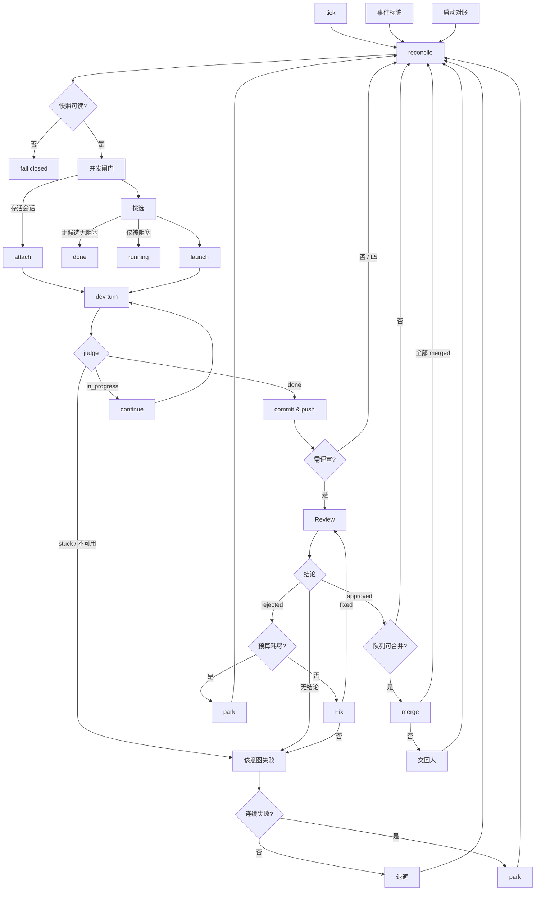

# Flow — 自动化队列(确定性调度内核)

**场景。** 用户对要构建的意图勾选 `automate` 并启动队列。按工作区划分的调度内核逐条开发、评判、提交推送,再按影响范围驱动评审 → 修复 → 复审;单意图失败隔离(`park`),队列不停。

**领域。** intent-management · agent-session · permission-gateway · git。

本流程是 [意图 → 开发](flow-intent-to-development.md) 的队列路径,复用同一套运行循环与闸门;规则见 [intent-management](../domains/core/intent-management/intent-management-spec.md)。它是 `RM-R9` 的显式 opt-in 例外,且仍受监督(`RM-A9`、`C-SEC-3`)。与 [自动化执行](flow-automation-execution.md) 无关。队列靠节拍全量对账前进,事件只标脏([ADR-0031](../architecture/adr/0031-deterministic-queue-reconcile-kernel.md))。

## 流程图

```mermaid
flowchart TD
    T1[tick] --> P
    T2[事件标脏] --> P
    T3[启动对账] --> P
    P[reconcile] --> SNAP{快照可读?}
    SNAP -- 否 --> FC[fail closed]
    SNAP -- 是 --> GATE[并发闸门]
    GATE -- 存活会话 --> ATT[attach]
    GATE --> PICK[挑选]
    PICK -- 无候选无阻塞 --> DONE[done]
    PICK -- 仅被阻塞 --> RUN[running]
    PICK --> ACT[launch]
    ATT --> DEVT
    ACT --> DEVT[dev turn]
    DEVT --> J{judge}
    J -- done --> CP[commit & push]
    J -- in_progress --> CONT[continue]
    J -- stuck / 不可用 --> FAIL[该意图失败]
    CONT --> DEVT
    FAIL --> BO{连续失败?}
    BO -- 否 --> BACK[退避]
    BO -- 是 --> PARK[park]
    CP --> RL{需评审?}
    RL -- 否 / L5 --> P
    RL -- 是 --> REV[Review]
    REV --> RS{结论}
    RS -- 无结论 --> FAIL
    RS -- approved --> MG{队列可合并?}
    MG -- 否 --> P
    MG -- 是 --> MRG[merge]
    MRG -- 全部 merged --> P
    MRG -- 否 --> HB[交回人]
    HB --> P
    RS -- rejected --> RB{预算耗尽?}
    RB -- 是 --> PARKX[park]
    RB -- 否 --> FIX[Fix]
    FIX -- fixed --> REV
    FIX -- 否 --> FAIL
    BACK --> P
    PARK --> P
    PARKX --> P
```

## 步骤

1. **web-console → intent-management。** `start_workflow` 启动该工作区队列;每工作区至多一个,启停持久化,重启按意愿恢复(`RM-A2`)。节拍、标脏与启动对账进入同一轮;快照不可读则本轮不派发(`RM-A15`、`RM-A20`)。
2. **挑选。** 仅 `automate` 为候选(`RM-A1`)。并发闸门约束共享检出与工作区上限,存活探测释放悬空占用(`RM-A12`、`RM-A10`)。合格者按优先级再按最早创建挑选,闸门给出原因、不静默跳过(`RM-A3`)。SDD 下未过闸者先走规格撰写→审核(`RM-R34`、`RM-R35`、`RM-R51`)。仍有退避、`park` 或被挡住的候选时队列不得呈现完成(`RM-A7`)。
3. **intent-management → agent-session。** 有存活回合则挂接;否则续跑或新开。新回合是新准入,挂接不是(`RM-A21`)。开发走标准门控循环;权限提示等人作答,运行不停、队列不代答(`RM-A9`、`C-SEC-3`)。
4. **评判 → 提交。** 回合结束由判定器给出 `done` / `in_progress` / `stuck`;判定不可用按该意图失败记,不伪装成人介入(`RM-A4`)。`done` 则提交推送:无 PR 阶段标 `done`,worktree 进入 `reviewing` 再等 `RM-R48`(`RM-A5`);预提交钩子拒绝允许一次自愈(`RM-A13`)。`in_progress` 续跑至上限(`RM-A8`)。失败只隔离到该意图:退避,连续失败则 `park`,下游仍被挡住(`RM-A6`、`RM-A17`)。
5. **评审接力。** `reviewing` 且仍有活跃 PR 时,同一套闸门驱动评审/修复;仅 `L5` 可跳过首次评审;共享检出不接力(`RM-A24`)。结论只由工具调用产生(`RM-A26`)。修复预算触顶则 `park` 交人(`RM-A25`)。仅队列自己评审并通过的 PR 可由工作台落地;失败交回人、不重试(`RM-A27`)。

## 分支与异常

- **检查点共识。** 多数表决开启时,投票可覆盖 `stuck` 并自动继续;从不代答澄清问题(`RM-A14`)。
- **人工评审/修复。** 队列之外人可发起同一阶段(`RM-R53`)。
- **顾问。** 决策点可唤起顾问;不得批准规格,不得把意图标 `done`(`RM-A22`)。
- **不得碾过人工决策。** 不代答权限,不续跑未回答的澄清;运行保持存活(`RM-A9`、`RM-A11`、`C-SEC-3`)。
- **回合结束 ≠ 完成;空证据不否决可信报告**(`RM-A4`、`RM-A5`)。
- **丢事件只延迟;快照不可读则 fail closed**(`RM-A15`、`RM-A20`)。
- **跳过/覆盖不能绕过硬闸门;`park` 与跳过都不是 `done`**(`RM-A17`、`RM-A19`)。
- **每轮取舍可查询;写入失败不放宽闸门**(`RM-A18`)。
