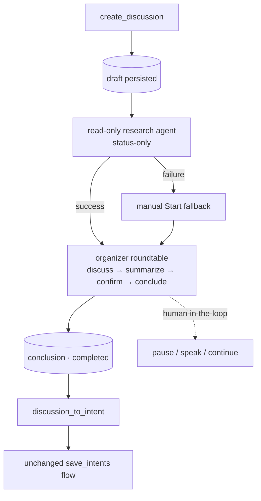

# Flow — Discussion → Intent

**场景。** 用户发起一场目标导向的讨论。一个只读研究智能体收集现状,
一个由 organizer 主持的多智能体圆桌把讨论辩论出结论(带人在回路控制),
结论再被转换为可验证的意图。

**领域。** discussion · agent-config · intent-management。

discussion 领域是**活跃的**(持久化 + 创建流程 + organizer 引擎 + 人在回路,
见 [discussion-overview](../domains/core/discussion/discussion-overview.md))。它复用了
共识一次性 agent-ask 范式,但**不**运行共识,也**不**运行智能体
团队(Phase 1)。它的产出衔接到 [intent → development](flow-intent-to-development.md)。

## 流程图

## 创建 → 研究

1. **web-console → discussion。** "+" 表单提交 `create_discussion { type, goal, context }`。
   服务端持久化一条 `draft`(标题由 `goal` 派生),**立即回复
   `discussion_detail`** 给发起连接(右侧面板自动打开),并推送
   `discussions` 列表。
2. **只读研究智能体。** 一个 `discussion-research` gate(意图读取集 + WebSearch/WebFetch,
   无保存工具,write/exec/子智能体硬禁用)产出一个 `researchResult`。输出**仅限现状** —
   事实 / 当前状态 / 约束 / 待解决问题;它被硬性禁止输出选项、建议或结论,
   以避免头脑风暴被提前锚定。用户原始的
   `context` 永不被覆盖;两者共存。
3. **可观测且仅存在于运行时。** 研究运行以 `research_message`(文本 +
   `tool_use`/`tool_result`,渲染为带可折叠工具块的标准转录)流式推送每一项,
   并以 `research_run_status` 广播存活状态;两者都不持久化到数据库。每次
   `discussions` 发送都携带一份 `researchStates` 快照,以便研究过程中刷新/重连时能重建阶段,
   而有边界的运行时转录会在 `discussion_detail` 快照上重放,恢复已展示的条目。

## 组织 → 结论

1. **自动启动。** 研究成功后,服务端**自动启动**编排
   (等价于一次自动的 `start_discussion`),通过一个自动启动守卫,
   基于最新记录重新校验(若人类在研究期间已 Start/取消则跳过)。
   研究失败会留下一条 `draft`,交由手动 **Start** 兜底。
2. **Organizer 引擎。** 一个后台循环沿该类型的
   `discuss → summarize → confirm → conclude` 工作流走过 `draft → in_progress → completed`
   (按讨论类型的定义)。organizer 在讨论的**已选参与者**
   (讨论的 `participantAgentIds`,在创建弹窗中选定,针对已启用智能体集合解析,
   ∪ 始终包含的 organizer;为空 ⇒ 回退到旧的整池方案)中提名发言者 — 一个**异构、
   多厂商圆桌**(每个 `agent` 气泡携带一个由其配置派生的厂商标签;
   `AC-R10` 把关智能体池,`AC-R12` 把关厂商)。每一轮都是一次一次性 agent ask,
   被追加并以 `discussion_message` 流式推送。终止是有保证的(阶段单向前进、每阶段 +
   总轮数上限 `maxRoundsPerStage`,`AC-R9`)。引擎读取 `researchResult || context`
   作为提示词背景。
3. **调度状态。** 每一轮开始前,引擎把被提名的智能体标为 `pending`
   (`discussion_dispatch_status`),解析后置为 `cleared`,抛出异常时置为 `failed`(带错误) —
   失败的回复会被展示出来,该轮仍会继续进行。

## 人在回路控制

引擎在每个轮次边界等待一个**暂停闸门**:`pause_discussion` / `resume_discussion`
只暂停不中止;`discussion_speak` 插入一条 `human` 消息(暂停 → 追加 → 恢复);
`continue_discussion` 在一个 `completed` 的讨论上重新驱动**新一轮**(把
`completed → in_progress` 翻转,重新运行出一份新的 `conclusion`)。实时运行状态
(`running` / `paused` / `ended`)以 `discussion_run_status` 广播,与持久化的
`DiscussionStatus` **解耦**(暂停仅存在于运行时);每次列表发送的 `runStates`
快照用于在重连时对齐。

## 转换为意图

1. **discussion → intent-management。** 一个 `completed` 且 `conclusion` 非空的讨论会展示
   一个 **Convert to Intent** 按钮(`discussion_to_intent`)。服务端解析项目,
   把意图沟通会话作为一个全新会话重启(一个 `refine_intent` 变体),
   以讨论标题 + `conclusion` 作为种子,并回复 `session_selected` + `intents`。
2. **不变的保存路径。** 沟通智能体通过**不变的** `save_intents` 流程(`RM-R7`)
   把结论拆分为可验证条目 — 见
   [intent → development](flow-intent-to-development.md)。除非讨论是
   `completed` 且 `conclusion` 非空,否则拒绝。

## 分支与例外(反场景)

- **研究不得提前锚定。** 研究者不输出任何选项/建议/结论 —
  仅限现状 — 以使发散式头脑风暴以无偏见状态开始。
- **暂停是轮次边界效应。** 一个已在途的 agent ask 会完成,因此暂停请求发出后
  可能还会再落地一条消息(讨论**范围之外**的说明)。
- **成本永不跨厂商合并。** 不同厂商的计量方式不同;任何未来的按轮成本
  都会按厂商标注,不做跨厂商求和(Phase 1 没有成本计量)。
- **无重启后恢复。** 一个没有存活运行的孤立 `in_progress` 讨论,在服务器重启后
  不会被恢复 — 暂停状态仅存在于运行时(讨论**范围之外**的说明)。
