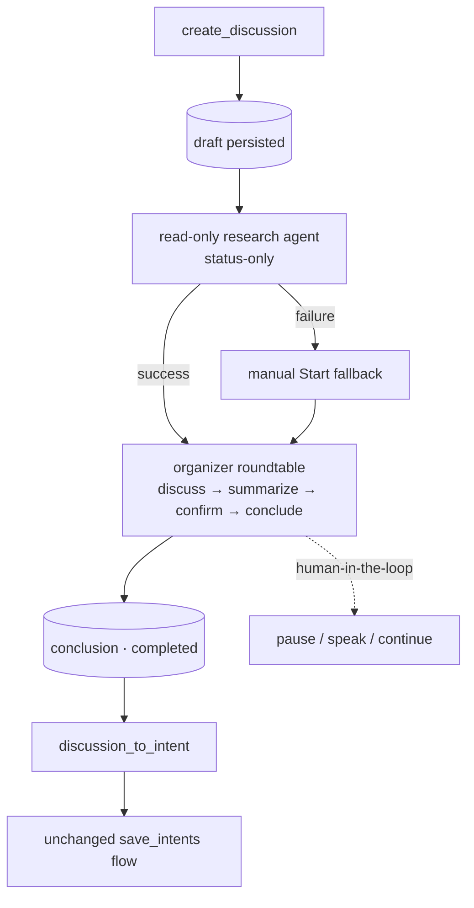

# Flow — Discussion → Intent

**Scenario.** The user opens a goal-directed discussion. A read-only research agent gathers status,
an organizer-led multi-agent roundtable debates it to a conclusion (with human-in-the-loop control),
and the conclusion is converted into verifiable intents.

**Domains.** discussion · agent-config · intent-management.

The discussion domain is **live** (persistence + create flow + organizer engine + human-in-the-loop,
see [discussion-overview](../domains/core/discussion/discussion-overview.md)). It reuses the
consensus one-shot agent-ask paradigm but runs **no** consensus and **no** agent
teams (Phase 1). Its output bridges into [intent → development](flow-intent-to-development.md).

## Flow graph

## Create → research

1. **web-console → discussion.** The "+" form submits `create_discussion { type, goal, context }`.
   The server persists a `draft` (title derived from `goal`), **immediately replies
   `discussion_detail`** to the creating connection (the right pane auto-opens), and pushes the
   `discussions` list.
2. **Read-only research agent.** A `discussion-research` gate (intent read set + WebSearch/WebFetch,
   no save tool, write/exec/sub-agent hard-disabled) produces a `researchResult`. The output is
   **status-only** — facts / current state / constraints / open questions; it is hard-forbidden from
   emitting options, recommendations, or conclusions, so the brainstorm is not pre-anchored. The
   user's original `context` is never overwritten; both coexist.
3. **Observable & runtime-only.** The research run streams each item as `research_message` (text +
   `tool_use`/`tool_result`, rendered as a standard transcript with collapsible tool blocks) and
   broadcasts liveness as `research_run_status`; neither is persisted to the DB. Every `discussions`
   send carries a `researchStates` snapshot so a refresh/reconnect mid-research rebuilds the phase, and
   the bounded runtime transcript is replayed on the `discussion_detail` snapshot to restore shown items.

## Organize → conclude

1. **Auto-start.** On research success the server **auto-starts** orchestration
   (equivalent to an automatic `start_discussion`), re-validating on the
   freshest record via an auto-start guard (skips if the human Started/cancelled mid-research).
   A research failure leaves a `draft` for a manual **Start** fallback.
2. **Organizer engine.** A background loop walks `draft → in_progress → completed` over the type's
   `discuss → summarize → confirm → conclude` workflow (per the discussion type's definition). The
   organizer nominates speakers among the discussion's **selected participants**
   (the discussion's `participantAgentIds`, chosen in the create modal, resolved against the
   enabled-agents set, ∪ the always-included organizer; empty ⇒ legacy fallback to the whole pool) — a **heterogeneous,
   multi-vendor roundtable** (each `agent` bubble carries a vendor tag derived from its config;
   `AC-R10` gates the pool, `AC-R12` the vendor). Each turn is a one-shot agent ask, appended
   and streamed as `discussion_message`. Termination is guaranteed (forward-only stages, per-stage +
   total round caps `maxRoundsPerStage`, `AC-R9`). The engine reads `researchResult || context` as
   prompt background.
3. **Dispatch status.** Before each turn the engine emits the nominated agent(s) as `pending`
   (`discussion_dispatch_status`), `cleared` on resolve, `failed` (with error) on throw — a failed
   reply is surfaced, the round still proceeds.

## Human-in-the-loop control

The engine awaits a **pause gate** at each round boundary: `pause_discussion` / `resume_discussion`
pause without aborting; `discussion_speak` interjects a `human` message (pause → append → resume);
`continue_discussion` re-drives a **new round** on a `completed` discussion (flips
`completed → in_progress`, re-runs to a fresh `conclusion`). Live run-state (`running` / `paused` /
`ended`) broadcasts as `discussion_run_status`, **decoupled** from the persisted `DiscussionStatus`
(pause is runtime-only); a `runStates` snapshot on every list send reconciles a reconnect.

## Convert to intent

1. **discussion → intent-management.** A `completed` discussion with a non-empty `conclusion` shows
   a **Convert to Intent** button (`discussion_to_intent`). The server resolves the project, restarts
   the intent communication session as a fresh one (a `refine_intent` variant) seeded with the
   discussion title + `conclusion`, and replies `session_selected` + `intents`.
2. **Unchanged save path.** The communication agent splits the conclusion into verifiable items via
   the **unchanged** `save_intents` flow (`RM-R7`) — see
   [intent → development](flow-intent-to-development.md). Rejected unless the discussion is
   `completed` with a non-empty `conclusion`.

## Branches & exceptions (anti-scenarios)

- **Research must not pre-anchor.** The researcher emits no options/recommendations/conclusions —
  status only — so the divergent brainstorm starts unbiased.
- **Pause is a round-boundary effect.** An already in-flight agent ask finishes, so one more
  message may land after a pause request (discussion _out of scope_ note).
- **Cost is never merged across vendors.** Different vendors meter differently; any future per-turn
  cost is labelled per vendor with no cross-vendor sum (Phase 1 has no cost meter).
- **No restart resume.** An orphaned `in_progress` discussion with no live run is not resumed after
  a server restart — pause state is runtime-only (discussion _out of scope_ note).
