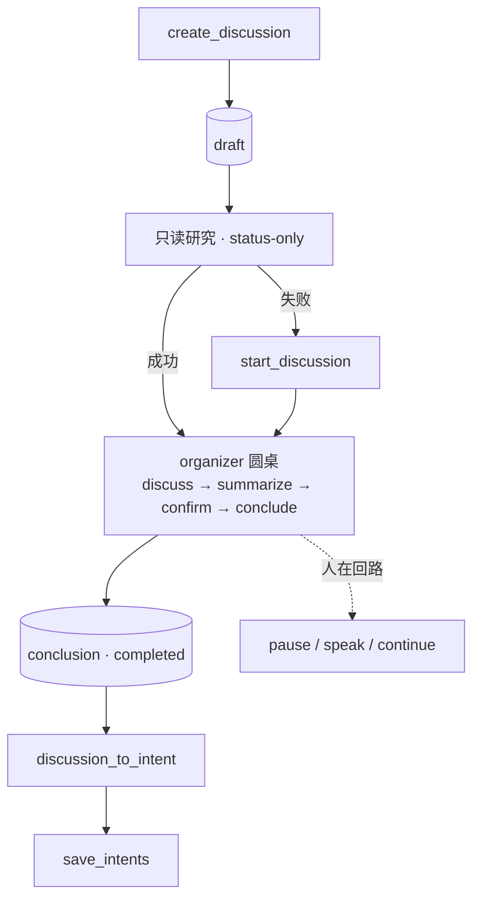

# Flow — Discussion → Intent

**场景。** 用户对一个目标发起讨论。只读研究收集现状;组织者主持圆桌得出结论(人在回路);结论再转为可验证意图。

**领域。** discussion · agent-config · intent-management。

本流程不跑共识、不跑智能体团队。规则见 [discussion](../domains/core/discussion.md)。产出汇入 [intent → development](flow-intent-to-development.md) 的 `save_intents`。

## 流程图

```mermaid
flowchart TD
    CD[create_discussion] --> DRAFT[(draft)]
    DRAFT --> RES[只读研究 · status-only]
    RES -- 成功 --> ORG[organizer 圆桌<br/>discuss → summarize → confirm → conclude]
    RES -- 失败 --> MAN[start_discussion]
    MAN --> ORG
    ORG --> CONC[(conclusion · completed)]
    CONC --> CONV[discussion_to_intent]
    CONV --> SAVE[save_intents]
    ORG -. 人在回路 .-> HIL[pause / speak / continue]
```

## 步骤

1. **web-console → discussion。** `create_discussion` 落一条 `draft`。
2. **只读研究。** 只陈述现状,不给选项、建议或结论;只广播运行态。成功且仍为无运行的 `draft` 则自动开编排;失败停在 `draft`,手动 `start_discussion`。
3. **组织者圆桌。** 沿 `discuss → summarize → confirm → conclude` 走到 `completed`。组织者从已选参与者提名发言;阶段只前进。
4. **人在回路。** 轮次边界 `pause_discussion` 只暂停不中止;可发言后继续;`continue_discussion` 在已有结论的 `completed` 上开新一轮。
5. **discussion → intent-management。** `completed` 且结论非空才接受 `discussion_to_intent`。创建原语与增加意图相同(`RM-R45`);沟通智能体走 `save_intents`(`RM-R7`)。见 [intent → development](flow-intent-to-development.md)。

## 分支与异常

- **研究不得提前锚定。** 只陈述现状。
- **暂停不中止。** 在途一轮仍可能落下一条消息。
- **单轮失败不中止圆桌。**
- **无重启恢复。** 悬挂的 `in_progress` 在进程重启后不会自动拉起。
- **取消是终态。** `draft` / `in_progress` 可取消;先拆存活运行再落 `cancelled`。
- **被拒绝的转换不留痕。** 条件不满足则不创建意图(`RM-R45`)。
- **启动失败保留意图。** 回收会话,保留意图(`RM-R45`)。
- **放弃不自动清理。** 未 `save_intents` 的空白 `draft` 由人处理。
