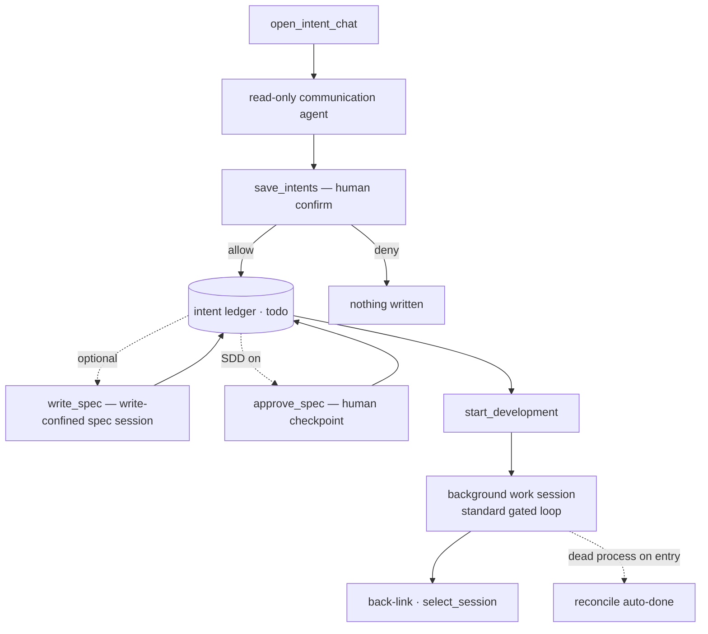

# Flow — Intent → Development

**场景。** 用户针对一个项目有了一个想法。一个只读沟通智能体把它
细化为离散的、可验证的意图;用户把它们确认进账本;然后启动其中一个进入一个
后台工作会话,并通过回链跟踪其进度。

**领域。** intent-management · agent-session · permission-gateway · session-registry · agent-config。

这个流程运行在会话层**之上**:它捕获*要构建什么*,然后将其送入
[prompt → gated run](flow-prompt-to-gated-run.md) 循环。其无人值守的姊妹流程是
[automation orchestrator](flow-automation-orchestrator.md)。它复用运行循环与闸门;它
不持有任何权限状态(`RM-R*` 边界)。

## 流程图

## 细化 — 只读沟通智能体

1. **web-console → intent-management。** 用户点击想法(💡)按钮;`open_intent_chat`
   切换到意图视图,并(重新)加载该项目 `isCurrent` 的沟通会话
   (历史 + 实时流),以解析出的绝对项目路径为键(`RM-R4`、`RM-R10`)。进入时
   服务端会**协调**每一条 `in_progress` 的意图(见下文的*协调*,`RM-R18`)。
2. **沟通智能体(只读)。** 以 `intent` 类型运行时运行,处于**强制 `default`
   模式**(`RM-R3`)。它可以使用读类工具与 `AskUserQuestion`(通过网关的
   答案注入路径路由,无共识),以及只读账本查询 `find_intents` /
   `view_intent`(自动允许,`RM-R19`),但**永远不能**编辑、写入、运行命令、生成
   子智能体,或运行斜杠命令 — 在工具层而非提示层强制(`RM-R2`、
   ADR-0007)。它会提出规模适当的条目,覆盖 Why / What / Trade-offs / When / Acceptance,
   把代码 + 测试 + 配套文档折叠进**一条**意图(`RM-R15`)。

## 确认 — 保存到账本

1. **intent-management → permission-gateway。** 智能体调用 `save_intents`
   (`mcp__c3__save_intents`);c3 复用网关(`RM-R5`)呈现一次人工确认。
   确认列出每个拟保存条目,包括批内的"依赖本批"引用。
2. **允许 ⇒ 写入。** 新条目以 `todo` 落入当前项目(`RM-R6`);携带
   `id` 的条目**原地更新**(upsert — 保留 `draft`/`todo`,重新激活 `cancelled`,
   拒绝 `in_progress`/`done`,`RM-R20`)。批内 `dependsOnIndexes` 在一次原子事务中
   解析为兄弟条目的 id;越界/自引用/循环的索引,或错误的更新 id 会拒绝
   **整个**批次(`RM-R17`、`RM-R20`)。**拒绝 ⇒** 什么都不写,智能体被告知已被拒绝(`RM-R5`)。

## 撰写规格(可选质量闸门)

1. **依赖上下文准备。** 在首次撰写或重置一个规格会话之前,
   worktree 模式要求每一个已知依赖都在主线上可用。一个非 `done` 的依赖,
   或者 `done` 但仍停留在未合并 PR 的非主分支上的依赖,会拒绝该请求,
   且不创建文档、不替换已选会话。当前分支模式跳过这项检查。当被阻塞的依赖
   有一个存储状态未确认已合并的 PR/MR 时,服务端会启动一次一次性的后台
   PR/MR 状态同步,并在其完成后重新广播意图;当前请求在后续检查看到
   `prStatus = merged` 之前仍会失败。依赖检查通过后,当前工作区分支会在会话
   开始前尽力拉取;远程缺失、拉取失败或分支分叉会给出警告但不阻止撰写规格。
   撰写与重置控件在该规则满足之前都保持禁用,并附带一条依赖未合并的说明。
2. **web-console → intent-management。** 对于一条已保存的意图,`write_spec` 在开发之前
   产出一份受约束、可评审的规格文档 — 质量闸门输出步骤(`RM-R21`)。服务端
   在**固定的、集中式的规格根目录** `<c3 home>/doc/<project-path-segment>`
   (按项目划分,由该项目的所有 worktree 共享;不可由用户配置,不进 Git)下
   脚手架出一个带日期的目录 `<spec-root>/yyyy/mm/dd/yyyy-mm-dd-<NNN>-<slug>/spec.md`,
   其中 `<slug>` 由意图的 `shortEnTitle` 派生(缺省回退到意图 id 前缀),
   `<NNN>` 是当日内的序号。它会种下一份**最小化**的 `spec.md`(frontmatter 仅包含
   `intent_id`、`title` 和 `created`,加上标题和一个回链到意图的链接,
   没有章节骨架,没有文档级 `status`),并立即回填意图的规格路径
   (即那个**绝对**的集中式位置),这样即便运行失败,规格也已存在。
   内容定位:**用户是第一读者**,开发智能体是第二读者。意图已经承载了
   需求(Why / What / Acceptance / Non-goals),因此规格**不**重述它们 —
   它是一份简洁的、以评审为导向的文档,先陈述可观察的变更、其边界、
   需要确认的决策以及验证方式。评审者必须能在不阅读代码库的情况下
   批准或拒绝它。它的结构取决于实际影响的大小,而不是请求的长度:
   没有契约、数据、迁移、安全或跨领域影响的单一表层聚焦变更,
   只限于变更摘要、行为与边界、具体验证(通常 8–20 行);普通变更
   只额外加相关方案、能力/契约与边界;契约/数据/迁移/安全/跨领域变更
   还要记录权衡、兼容性和失败处理。禁止空章节和泛泛而谈。
   规格用领域语言描述能力和契约 — 它不列出源码路径、符号或逐文件的编辑。
   仅在验证之后,可以附加一段简短的实现交接,描述技术边界与顺序,
   但不含代码标识符。
3. **intent-management → agent-session。** 一个**写入受限的规格会话**在
   已配置的规格智能体(`specAgentId`)上启动。它唯一的职责是**撰写规格,而非
   修改代码**:写入被限制在规格目录内(对任何其他项目路径的写入都会被拒绝;
   其余路径只读),shell / 子智能体 / 斜杠命令工具被阻断 — 在工具层与
   **路径**层强制,而非靠提示词(`RM-R21`)。绑定时,会话 id 被回链到该意图。
   路径级写入锁是一种 Claude-path 的 permission-gateway 机制,因此非 Claude 的
   规格智能体在启动前会被**拒绝**(`RM-R21`)。

## 批准规格(人工检查点)

1. **四态动作按钮。** 当工作区的 SDD 开关(`sddEnabled`)开启时,意图的
   主动作按钮具备 SDD 感知:无规格 ⇒ `Write Spec`;规格已写但未批准 ⇒
   `Approve Spec`;规格已批准 ⇒ `Start Work`(SDD 关闭 ⇒ 始终为 `Start Work`)。`sddEnabled`
   随每次意图列表广播下发,因此按钮无需单独获取设置(`RM-R22`、`WC-R25`)。
2. **web-console → intent-management。** `Approve Spec` 发送 `approve_spec`。服务端
   设置 `spec_approved=true`,并记录批准用户(当前登录主体)到
   `spec_approve_user`,然后重新广播列表 — 单人确认,本阶段无多签也无
   撤销批准;在规格存在之前批准会被拒绝(`RM-R22`)。批准是**门控开发的
   人工检查点**:它清除该闸门,使按钮前进到 `Start Work`,但**不**
   自行启动开发。automation orchestrator 使用同一检查点作为一个准入闸门:
   SDD 开启时,排队中的 `automate` 意图在 `spec_approved=true` 之前被跳过;
   SDD 关闭时,自动化不要求规格。

## 启动工作

1. **web-console → intent-management。** 一条 `todo` 条目的 Launch 按钮发送
   `start_development`,在 `todo` 或带悬挂工作会话的 `in_progress` 时被允许(`RM-R8`)。
   服务端在单进程启动集合中同步**认领** `intentId`;并发的重复启动
   返回 `intent.devStartInFlight` 且不创建任何东西(`RM-R8`)。
2. **Git 分支模式(`WorkspaceSetting.gitBranchMode`)。** `worktree` ⇒ 在 c3 home 目录下
   创建/复用一个隔离的按意图划分的 worktree,从最新拉取的远程
   `defaultMainBranch` 尖端分支出去(若可用),在没有远程、远程分支不可用
   或拉取失败时尽力回退到本地 `defaultMainBranch`;
   `current-branch` ⇒ 原地开发。缺省或非法模式归一为 `worktree`;worktree 启动永不自动合并/变基
   用户本地的 main 检出,本地 main 分支的陈旧/分叉/非当前状态
   不会影响新 worktree 基点的选择。工作会话的有效工作目录
   会相应设置(`RM-R8`)。
3. **intent-management → agent-session。** 一个**后台普通会话**通过手动启动与
   自动化共用的开发提示词构建器启动。可见轮次携带意图标题/内容
   加上依赖说明;当 `sddEnabled` 开启且已批准的规格路径存在时,
   还会携带已批准规格路径的说明。内部启动通道不出现在可见回显中:
   `devSkill` 搭载在模型用户轮前缀上,而当没有配置 `devSkill` 时,SDD 的
   工作会话提示词搭载在系统指令通道上(`RM-R23`)。该意图移动到
   `in_progress` 并记录 `lastWorkSessionId`(`RM-R8`)。工作会话是一个普通
   会话 — 它出现在侧边栏,被打上时间戳排到最上面,在绑定/落定时
   扇出给每一个连接(`SR-R13`)。对于 Codex 支撑的手动启动,投影标题
   起初以来源意图标题开始,运行结束持久化时不得在原生 Codex 标题尚不可读时
   将其替换为默认占位符;之后一个非占位符的原生标题仍可刷新它。
   Claude 的启动保持既有的会话标题路径。它运行标准的门控循环([prompt → gated
   run](flow-prompt-to-gated-run.md))。该运行在断连后仍存活(`AS-R8`)。
4. **启动反馈(仅限手动启动)。** 因为上述步骤可能耗时数秒
   (远程 main 拉取、worktree 创建/分支拉取,再到智能体生成 — 带 sandbox 时最慢),
   服务端在同步校验通过后发出粗粒度的、面向连接的 `dev_launch_progress` 阶段:
   `fetching-remote-main`(worktree 远程基点拉取之前)、`preparing-worktree`
   (git 分支阶段之前)、`launching`(生成之前);此前静默的异步启动失败
   现在也会发出 `failed`。web console 在点击时布防一个阻塞式启动遮罩,
   **立即显示,并在最短时长内保持可见以防闪烁**,按顺序步进一个
   对齐这些阶段的有序列表:拉取远程主分支、准备 worktree、开始工作会话、进入会话。
   该遮罩在成功终态(目标意图在常规 `intents` 广播中翻转为
   `in_progress`)、`failed` / 一个 `intent.*` 动作错误,以及一个安全超时时关闭,
   这样一次丢失的信号就不会困住用户。同步校验失败会留在 `error` 通道上,
   不发出任何进度。范围:仅限手动启动 — 自动化驱动的开发(无客户端连接、
   无人值守)不在此列。

## 回链与状态

- **工作会话回链。** 一条已启动条目的开发详情项打开 `lastWorkSessionId`
  通过 `select_session`(历史 + 实时流,`RM-R13`)。已删除的会话会给出一个
  友好的重启/取消提示,而非崩溃(`RM-R13`)。
- **启动后右栏跳转。** 在 `start_development` 完成且启动遮罩关闭(`ready` 终态)后,
  前端会自动桥接到控制台:它把活动会话类型切换为
  `work`,进入控制台标签页,并选中新创建的工作会话
  (`lastWorkSessionId`)。在这个待跳转窗口期间,常规的类型切换自动绑定
  (原本会选择列表中第一个历史工作会话)被抑制 — 右栏保持
  空白,直到目标会话的行出现在侧边栏中。一旦该行到达,
  `consumePendingWorkSessionSelect` 只选中那一个会话,绝不选历史会话。
  如果目标行始终没有到达(例如广播丢失),右栏将保持空白。
- **进入时协调(`RM-R18`)。** 在 `open_intent_chat` 时,每一条 `in_progress` 意图的
  `lastWorkSessionId` 会与进程表比对:一个**已死**的进程,若其最后 3 条助手
  消息被完成度判定确认为 `done`,则被**自动完成**(提交 + 推送 +
  状态置为 `done`) — 手动**与**自动化运行都适用;一个存活的进程派生出
  `runStatus = 'running'`;否则为 `dangling`。这是两条自动 `done` 路径之一。
- **会话结束时的 Git/PR 清理(手动,`RM-R26`)。** 当一个**手动启动**的工作会话落定
  (完成 / 出错 / 终止)时,服务端会在**不**改变状态的情况下闭合 Git/PR 环节。在
  `worktree` 模式(或 `current-branch` 且偏离 `defaultMainBranch`)且存在变更时,
  它会通过工作区的 forge-aware 分发器提交、推送并创建 PR/MR:显式的
  工作区 `forge` 设置为 `github` 或 `gitlab` 会覆盖仓库来源检测,而
  `auto`(或缺省值)使用检测。对 GitHub 调用 `gh`,对 GitLab 调用 `glab`,然后回写
  `branchName`、`latestCommitHash`、`prId`、
  `prUrl` 和 `prStatus = reviewing`;已经有 PR 的意图会被刷新(提交/推送 +
  `latestCommitHash`)但**不**重新建 PR。`current-branch` 且**在** main 分支上是一次
  普通的成功跳过。项目的 orchestrator 正在主动驱动的会话属于自动化所有(`RM-A5`),
  **不**在此清理 — 手动与自动化互斥。在其自身成功提交与推送之后,
  orchestrator 创建同样的 forge-aware PR/MR:显式的工作区 `forge`
  覆盖会选择 GitHub/`gh` 或 GitLab/`glab`;`auto` 或缺省设置使用仓库来源
  检测。
- **PR/MR 状态同步(`RM-R28`)。** 一条 `prStatus = reviewing` 且关联了
  PR/MR 的 `done` 意图,可以从详情头部或 Git/PR 元数据处刷新一次。该同步
  查询 forge CLI,只有在 forge 确认 PR/MR 已合并时才写入 `prStatus = merged`。
  一个已关闭的 PR/MR 可能被记录为 `closed`,失败或 CLI/认证不可用则保持
  既有状态不变;只有确认的 `merged` 才能解除 worktree 依赖闸门。

## 讨论桥接

`discussion_to_intent`(discussion 领域拥有的一个 `refine_intent` 变体)以一个
已完成讨论的 `conclusion` 而非既有意图作为种子,为沟通会话下种,
然后汇入**不变的** `save_intents` 路径(`RM-R7`)。见
[discussion → intent](flow-discussion-to-intent.md)。

## 分支与例外(反场景)

- **只读是绝对的。** 一个沟通会话绝不能写文件 — 即便通过生成的
  子智能体或斜杠命令也不行;`Task`/`SlashCommand` 被禁用,网关默认拒绝
  (`RM-R2`、ADR-0007)。
- **无静默保存。** `save_intents` 绝不能在没有用户允许的情况下持久化 — 即便处于
  `bypassPermissions` 系统默认值下也是如此(`RM-R3`/`RM-R5`)。
- **规格会话只写规格。** 一个 `write_spec` 会话绝不能写到其规格
  目录之外 — 对项目源码的写入在路径层被拒绝,而一个非 Claude 的规格智能体
  (它无法对写入做路径限定)在启动前就会被拒绝,而不是在没有该锁的情况下
  撰写(`RM-R21`)。
- **手动启动绝不自动完成。** 开发运行结束不会改变状态;用户
  标记 `done`/`cancelled`(`RM-R9`)。唯一的例外是入口协调(`RM-R18`)与
  automation orchestrator(`RM-A5`)。会话结束时的 Git/PR 清理(`RM-R26`)同样
  只触及 Git/PR 字段,绝不触及状态机。
- **清理失败是显式的,绝不伪装。** 当会话结束清理理应运行却无法运行时 —
  没有可提交的变更、提交/推送失败、所选 forge CLI(`gh` 或 `glab`)不可用/
  未登录,或 PR/MR 创建失败 — 它会显式失败,并推送一条工作台等待用户介入的
  待办事项,要求用户处理;它绝不会把 `prStatus` 设为 `reviewing`,也不会写入
  占位的 `prId`/`prUrl`,只有真正完成的步骤才会被记录(`RM-R26`)。它不会
  自动合并、解决冲突、修复认证,也不会重试。
- **未满足的依赖只警告,不阻塞。** 在 `dependsOn` 非 `done` 时启动会警告但仍会继续
  (`RM-R11`)。
- **账本不可用时优雅降级。** 如果 SQLite 宕机,意图消息返回 `error`,而
  常规列表**不**被过滤;c3 仍能启动并服务常规会话(`RM-R12`)。
