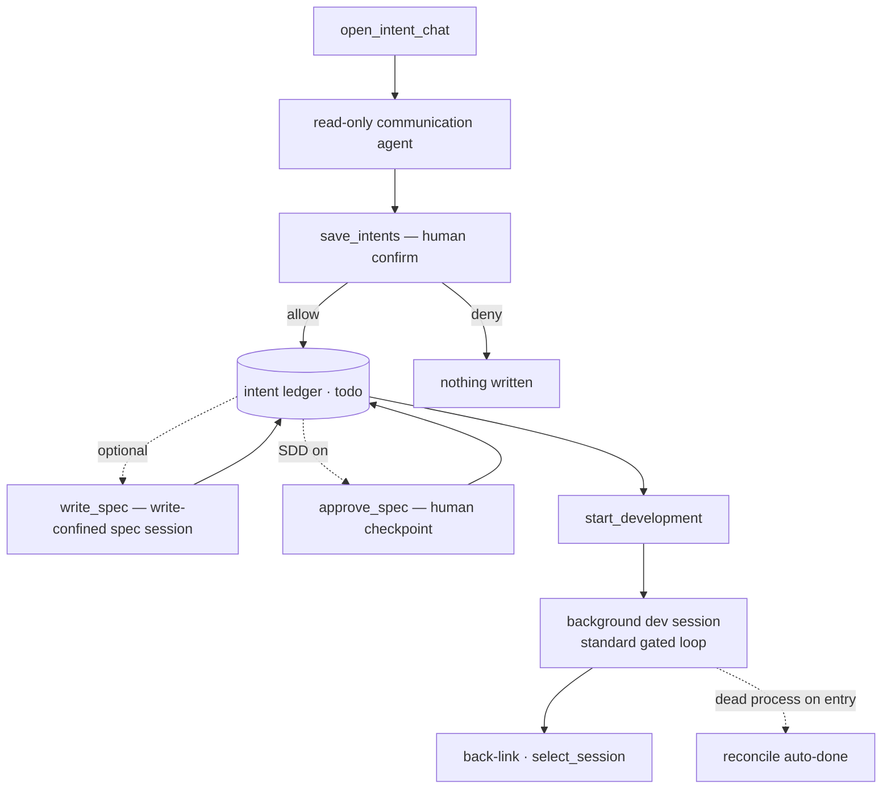

# Flow — Intent → Development

**Scenario.** The user has an idea against a project. A read-only communication agent refines it
into discrete, verifiable intents; the user confirms them into the ledger; then launches one into a
background development session and follows its progress via a back-link.

**Domains.** intent-management · agent-session · permission-gateway · session-registry · agent-config.

This flow operates **above** the session level: it captures _what to build_, then feeds the
[prompt → gated run](flow-prompt-to-gated-run.md) loop. The unattended sibling is the
[automation orchestrator](flow-automation-orchestrator.md). It reuses the run loop and the gate; it
owns no permission state (`RM-R*` boundary).

## Flow graph

## Refine — read-only communication agent

1. **web-console → intent-management.** The user clicks the idea (💡) button; `open_intent_chat`
   switches to the intent view and (re)loads the project's `isCurrent` communication session
   (history + live stream), keyed by the resolved absolute project path (`RM-R4`, `RM-R10`). On
   entry the server **reconciles** every `in_progress` intent (see _Reconcile_ below, `RM-R18`).
2. **Communication agent (read-only).** Runs as an `intent`-kind runtime in **forced `default`
   mode** (`RM-R3`). It may use read-class tools and `AskUserQuestion` (routed via the gateway's
   answer-injection path, no consensus) and the read-only ledger queries `find_intents` /
   `view_intent` (auto-allowed, `RM-R19`), but **never** edits, writes, runs commands, spawns
   sub-agents, or runs slash commands — enforced at the tool layer, not by prompt (`RM-R2`,
   ADR-0007). It proposes right-sized items covering Why / What / Trade-offs / When / Acceptance,
   folding code + tests + companion docs into **one** intent (`RM-R15`).

## Confirm — save to the ledger

1. **intent-management → permission-gateway.** The agent calls `save_intents`
   (`mcp__c3__save_intents`); c3 surfaces a human confirmation reusing the gateway (`RM-R5`). The
   confirmation lists each proposed item incl. intra-batch "依赖本批" references.
2. **Allow ⇒ write.** New items land as `todo` for the current project (`RM-R6`); items carrying an
   `id` **update** in place (upsert — keeps `draft`/`todo`, reactivates `cancelled`, rejects
   `in_progress`/`done`, `RM-R20`). Intra-batch `dependsOnIndexes` resolve to sibling ids in one
   atomic transaction; an out-of-range/self/cycle index or a bad update id rejects the **whole**
   batch (`RM-R17`, `RM-R20`). **Deny ⇒** nothing written, agent told it was rejected (`RM-R5`).

## Write spec (optional quality gate)

1. **Dependency context preparation.** Before first authoring or resetting a spec session,
   worktree mode requires every known dependency to be available on the mainline. A dependency that
   is not `done`, or is `done` but remains on a non-main branch without a merged PR, rejects the
   request without creating a document or replacing the selected session. Current-branch mode skips
   this check. Once it passes, the current workspace branch is pulled best-effort before the session
   starts; a missing remote, failed pull, or divergence is warned but does not prevent spec writing.
   Both authoring and reset controls remain disabled with a dependency-not-merged explanation until
   the rule is satisfied.
2. **web-console → intent-management.** For a saved intent, `write_spec` produces a constrained,
   reviewable spec document before development — the quality-gate output step (`RM-R21`). The server
   scaffolds a dated directory under the **fixed, centralized spec root**
   `<c3 home>/doc/<project-path-segment>` (per project, shared by all the project's worktrees;
   not user-configurable, not in Git), `<spec-root>/yyyy/mm/dd/yyyy-mm-dd-<NNN>-<slug>/spec.md`,
   where `<slug>` derives from the intent's `shortEnTitle` (falling back to the intent id prefix)
   and `<NNN>` is a per-day sequence. It seeds a **minimal** `spec.md` (frontmatter containing
   only `intent_id`, `title`, and `created`, plus title + a link back to the intent, no section
   skeleton and no document-level `status`) and backfills the intent's spec path
   (the **absolute** centralized location) immediately, so the spec exists even if the run fails.
   Content positioning: the **user is the first reader** and the development agent the second. The
   intent already carries the requirements (Why / What / Acceptance / Non-goals), so the spec does
   **not** restate them — it is a concise, review-oriented document that first states the observable
   change, its boundaries, the decisions requiring confidence, and verification. A reviewer must be
   able to approve or reject it without reading the codebase. Its structure follows the real impact,
   not the request length: a focused single-surface change without contract, data, migration,
   security, or cross-domain impact is limited to change summary, behavior and boundaries, and
   concrete verification (normally 8–20 lines); normal changes add only relevant approach,
   capabilities/contracts, and boundaries; contract/data/migration/security/cross-domain changes
   also record trade-offs, compatibility, and failure handling. Empty headings and generic prose are
   forbidden. The spec describes capabilities and contracts in domain language — it does not list
   source paths, symbols, or per-file edits. A short implementation handoff may follow verification
   only when necessary, describing technical boundaries and sequencing without code identifiers.
3. **intent-management → agent-session.** A **write-confined spec session** is launched on the
   configured spec agent (`specAgentId`). Its sole job is to **write the spec, not change code**:
   writes are limited to the spec directory (any other project path is denied; the rest is
   read-only), and shell / sub-agent / slash-command tools are blocked — enforced at the tool +
   **path** layer, not by prompt (`RM-R21`). On bind, the session id is linked back onto the intent.
   The path-level write lock is a Claude-path permission-gateway mechanism, so a non-Claude spec
   agent is **rejected** before launch (`RM-R21`).

## Approve spec (human checkpoint)

1. **Four-state action button.** When the workspace's SDD switch (`sddEnabled`) is on, the intent's
   primary action button is SDD-aware: no spec ⇒ `Write Spec`; spec written but unapproved ⇒
   `Approve Spec`; spec approved ⇒ `Start Dev` (SDD off ⇒ always `Start Dev`). `sddEnabled` rides
   every intent-list broadcast so the button needs no separate settings fetch (`RM-R22`, `WC-R25`).
2. **web-console → intent-management.** `Approve Spec` sends `approve_spec`. The server sets
   `spec_approved=true` and records the approving user (the current login subject) in
   `spec_approve_user`, then re-broadcasts the list — single-person confirmation, no multi-sign or
   un-approve in this phase; approving before a spec exists is rejected (`RM-R22`). Approval is the
   **human checkpoint that gates development**: it clears the gate so the button advances to
   `Start Dev` but does **not** itself launch development. The automation orchestrator uses the
   same checkpoint as an eligibility gate: with SDD on, queued `automate` intents are skipped until
   `spec_approved=true`; with SDD off, automation does not require a spec.

## Launch development

1. **web-console → intent-management.** A `todo` item's Launch button sends `start_development`,
   allowed when `todo` or `in_progress` with a dangling dev session (`RM-R8`). The server
   synchronously **claims** the `intentId` in a single-process launch set; a concurrent duplicate
   start returns `intent.devStartInFlight` and creates nothing (`RM-R8`).
2. **Git branch mode (`WorkspaceSetting.gitBranchMode`).** `worktree` ⇒ create/reuse an isolated
   per-intent worktree under the c3 home directory, branched from `defaultMainBranch`;
   `current-branch` (default) ⇒ develop in place. The dev session's effective working directory is set
   accordingly (`RM-R8`).
3. **intent-management → agent-session.** A **background normal session** is started with the
   shared dev prompt builder used by both manual launch and automation. The visible turn carries
   the intent title/content plus dependency note; when `sddEnabled` is on and the approved spec
   path exists, it also carries the approved spec-path note. Internal launch channels stay out of
   the visible echo: `devSkill` rides the model user-turn prefix, and when no `devSkill` is
   configured SDD's work-session prompt rides the system-instruction channel (`RM-R23`). The intent
   moves to `in_progress` and records `lastDevSessionId` (`RM-R8`). The dev session is a normal
   session — it appears in the sidebar, stamped to sort to the top, fanned out to every connection
   on bind/settle (`SR-R13`). For Codex-backed manual launches, the projection title starts as the
   source intent title and run-end persistence must not replace it with a default placeholder while
   the native Codex title is not yet readable; a later non-placeholder native title can still refresh
   it. Claude launches keep the existing session-title path. It runs the standard gated loop ([prompt → gated
   run](flow-prompt-to-gated-run.md)). The run survives disconnect (`AS-R8`).
4. **Startup feedback (manual launch only).** Because the steps above can take several seconds
   (worktree create / branch pull, then the agent spawn — slowest with sandbox), the server emits
   coarse, connection-directed `dev_launch_progress` stages after synchronous validation passes:
   `preparing-workspace` (before the git branch phase) and `launching` (before the spawn); the
   previously-silent async launch failure now emits `failed`. The web console arms a blocking
   startup overlay on the click, **shows it immediately, and keeps it visible for a minimum
   duration to prevent flashing**, stepping through an ordered list aligned to those stages. The overlay closes on the success
   terminal (the target intent flipping to `in_progress` in the regular `intents` broadcast),
   on `failed` / an `intent.*` action error, and on a safety timeout so a lost signal never traps
   the user. Synchronous validation failures stay on the `error` channel and emit no progress.
   Scope: manual launch only — automation-driven dev (no client connection, unattended) is not covered.

## Back-link & status

- **Development back-link.** A launched item's Development-details entry opens `lastDevSessionId`
  via `select_session` (history + live stream, `RM-R13`). A deleted session yields a friendly
  restart/cancel prompt, not a crash (`RM-R13`).
- **Reconcile on entry (`RM-R18`).** On `open_intent_chat`, each `in_progress` intent's
  `lastDevSessionId` is checked against the process table: a **dead** process whose last 3 assistant
  messages the completion judge confirms `done` is **auto-completed** (commit + push +
  status set to `done`) — for manual **and** automation runs alike; a live process derives
  `runStatus = 'running'`; otherwise `dangling`. This is one of the two auto-`done` paths.
- **Session-end Git/PR cleanup (manual, `RM-R26`).** When a **manually-started** dev session settles
  (complete / error / terminated), the server closes the Git/PR loop **without** changing status. In
  `worktree` mode (or `current-branch` off the `defaultMainBranch`) with changes present it commits,
  pushes, and creates a PR/MR through the workspace's forge-aware dispatcher: an explicit
  workspace `forge` setting of `github` or `gitlab` overrides repository-origin detection, while
  `auto` (or an absent value) uses detection. It invokes `gh` for GitHub or `glab` for GitLab, then writes back `branchName`, `latestCommitHash`, `prId`,
  `prUrl`, and `prStatus = reviewing`; an intent that already has a PR is refreshed (commit/push +
  `latestCommitHash`) but **not** re-PR'd. `current-branch` **on** the main branch is a normal success
  skip. A session the project's orchestrator is actively driving is automation-owned (`RM-A5`) and is
  **not** cleaned up here — manual and automation are mutually exclusive. After its own successful
  commit and push, the orchestrator creates the same forge-aware PR/MR: an explicit workspace `forge`
  override selects GitHub/`gh` or GitLab/`glab`; `auto` or an absent setting uses repository-origin
  detection.

## Discussion bridge

`discussion_to_intent` (a `refine_intent` variant owned by the discussion domain) seeds the
communication session with a completed discussion's `conclusion` instead of an existing intent,
then funnels into the **unchanged** `save_intents` path (`RM-R7`). See
[discussion → intent](flow-discussion-to-intent.md).

## Branches & exceptions (anti-scenarios)

- **Read-only is absolute.** A communication session must never write a file — even via a spawned
  sub-agent or slash command; `Task`/`SlashCommand` are disallowed and the gate denies by default
  (`RM-R2`, ADR-0007).
- **No silent save.** `save_intents` must never persist without the user's allow — even under a
  `bypassPermissions` system default (`RM-R3`/`RM-R5`).
- **Spec session writes only the spec.** A `write_spec` session must never write outside its spec
  directory — a write to project source is denied at the path level, and a non-Claude spec agent
  (which cannot path-confine writes) is rejected before launch rather than authoring without the
  lock (`RM-R21`).
- **Manual launch never auto-completes.** The dev run finishing does not change status; the user
  marks `done`/`cancelled` (`RM-R9`). The only exceptions are the entry reconcile (`RM-R18`) and the
  automation orchestrator (`RM-A5`). The session-end Git/PR cleanup (`RM-R26`) likewise touches only
  the Git/PR fields, never the status machine.
- **Cleanup failure is explicit, never faked.** When the session-end cleanup should run but cannot —
  no committable changes, commit/push failure, the selected forge CLI (`gh` or `glab`) unavailable /
  not logged in, or PR/MR creation failing — it fails explicitly and pushes a workbench wait-user-involve todo asking the
  user to act; it never sets `prStatus = reviewing` or writes a placeholder `prId`/`prUrl`, and only
  genuinely-completed steps are recorded (`RM-R26`). It does not auto-merge, resolve conflicts, fix
  auth, or retry.
- **Unmet dependencies warn, not block.** Launching with a non-`done` `dependsOn` warns but proceeds
  (`RM-R11`).
- **Ledger unavailable degrades softly.** If SQLite is down, intent messages return `error` and the
  normal list is **not** filtered; c3 still boots and serves normal sessions (`RM-R12`).
