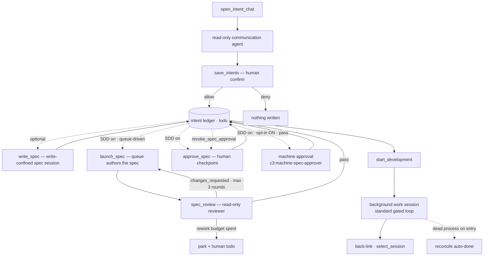

# Flow — Intent → Development

**场景。** 用户针对一个项目有了一个想法。一个只读沟通智能体把它
细化为离散的、可验证的意图;用户把它们确认进账本;然后启动其中一个进入一个
后台工作会话,并通过回链跟踪其进度。

**领域。** intent-management · agent-session · permission-gateway · session-registry · agent-config。

这个流程运行在会话层**之上**:它捕获*要构建什么*,然后将其送入
[prompt → gated run](flow-prompt-to-gated-run.md) 循环。其无人值守的姊妹流程是
[automation orchestrator](flow-automation-orchestrator.md)。它复用运行循环与闸门;它
不持有任何权限状态(`RM-R*` 边界)。

## 流程图

```mermaid
flowchart TD
    IDEA[open_intent_chat] --> COMM[read-only communication agent]
    COMM --> SAVE[save_intents — human confirm]
    SAVE -- allow --> LEDGER[(intent ledger · todo)]
    SAVE -- deny --> X[nothing written]
    LEDGER -. optional .-> SPEC[write_spec — write-confined spec session]
    SPEC --> LEDGER
    LEDGER -. SDD on · queue-driven .-> QSPEC[launch_spec — queue authors the spec]
    QSPEC --> REVIEW[spec_review — read-only reviewer]
    REVIEW -- changes_requested · max 3 rounds --> QSPEC
    REVIEW -- rework budget spent --> TODO[park + human todo]
    REVIEW -- pass --> LEDGER
    LEDGER -. SDD on .-> APPROVE[approve_spec — human checkpoint]
    LEDGER -. SDD on · opt-in ON · pass .-> MAPPROVE[machine approval<br/>c3:machine-spec-approver]
    APPROVE --> LEDGER
    MAPPROVE --> LEDGER
    LEDGER -. revoke_spec_approval .-> APPROVE
    LEDGER --> LAUNCH[start_development]
    LAUNCH --> DEV[background work session<br/>standard gated loop]
    DEV --> LINK[back-link · select_session]
    DEV -. dead process on entry .-> REC[reconcile auto-done]
```

## 细化 — 只读沟通智能体

1. **web-console → intent-management。** 用户点击想法(💡)按钮;`open_intent_chat`
   切换到意图视图,并(重新)加载该项目 `isCurrent` 的沟通会话
   (历史 + 实时流),以解析出的绝对项目路径为键(`RM-R4`、`RM-R10`)。进入时
   服务端会**协调**每一条 `in_progress` 的意图(见下文的*协调*,`RM-R18`)。
2. **沟通智能体(只读)。** 以 `intent` 类型运行时运行,处于**强制 `default`
   模式**(`RM-R3`)。它可以使用读类工具与 `AskUserQuestion`(通过网关的
   答案注入路径路由,无共识),以及只读账本查询 `find_intents` /
   `view_intent`(自动允许,`RM-R19`),但**永远不能**编辑、写入、运行命令、生成
   子智能体,或运行斜杠命令 — 在工具层而非提示层强制(`RM-R2`、
   ADR-0007)。它会提出规模适当的条目,覆盖 Why / What / Trade-offs / When / Acceptance,
   把代码 + 测试 + 配套文档折叠进**一条**意图(`RM-R15`)。

## 确认 — 保存到账本

1. **intent-management → permission-gateway。** 智能体调用 `save_intents`
   (`mcp__c3__save_intents`);c3 复用网关(`RM-R5`)呈现一次人工确认。
   确认列出每个拟保存条目,包括批内的"依赖本批"引用。
2. **允许 ⇒ 写入。** 新条目以 `todo` 落入当前项目(`RM-R6`);携带
   `id` 的条目**原地更新**(upsert — 保留 `draft`/`todo`,重新激活 `cancelled`,
   拒绝 `in_progress`/`done`,`RM-R20`)。批内 `dependsOnIndexes` 在一次原子事务中
   解析为兄弟条目的 id;越界/自引用/循环的索引,或错误的更新 id 会拒绝
   **整个**批次(`RM-R17`、`RM-R20`)。**拒绝 ⇒** 什么都不写,智能体被告知已被拒绝(`RM-R5`)。

## 撰写规格(可选质量闸门)

1. **依赖上下文准备。** 在首次撰写或重置一个规格会话之前,worktree 模式按
   `RM-R40` 的依赖判据求值 —— 问的是「依赖的产出在不在我的 base 上」。规格会话
   只写规格目录、不落 worktree,因此不带显式交付上下文,按意图**隐含**的上下文
   求值(唯一关联时取它,0 个或多个按无交付判据)。被拒时不创建文档、不替换
   已选会话。当前分支模式跳过这项检查。PR 形状的阻塞会启动一次一次性的后台
   PR/MR 状态同步并重新广播意图,当前请求在后续检查看到该 PR 已 `merged`
   之前仍会失败;交付未合入主线类的阻塞不触发同步 —— 交付状态是本地账本。
   依赖检查通过后,当前工作区分支会在会话开始前尽力拉取;远程缺失、拉取失败
   或分支分叉会给出警告但不阻止撰写规格。撰写与重置控件在该规则满足之前都
   保持禁用,并附带对应的阻塞说明。
2. **web-console → intent-management。** 对于一条已保存的意图,`write_spec` 在开发之前
   产出一份受约束、可评审的规格文档 — 质量闸门输出步骤(`RM-R21`)。服务端
   在**固定的、集中式的规格根目录** `<c3 home>/doc/<project-path-segment>`
   (按项目划分,由该项目的所有 worktree 共享;不可由用户配置,不进 Git)下
   脚手架出一个带日期的目录 `<spec-root>/yyyy/mm/dd/yyyy-mm-dd-<NNN>-<slug>/spec.md`,
   其中 `<slug>` 由意图的 `shortEnTitle` 派生(缺省回退到意图 id 前缀),
   `<NNN>` 是当日内的序号。它会种下一份**最小化**的 `spec.md`(frontmatter 仅包含
   `intent_id`、`title` 和 `created`,加上标题和一个回链到意图的链接,
   没有章节骨架,没有文档级 `status`),并立即回填意图的规格路径
   (即那个**绝对**的集中式位置),这样即便运行失败,规格也已存在。
   内容定位:**用户是第一读者**,开发智能体是第二读者。评审界面**不**把意图
   与规格并排展示,因此规格必须**自洽**:它把该意图的动机、可观察变更、
   范围边界 / Non-goals 与验收条件**提炼**进文档(用自己的话按决策所需的
   粒度概述,而非逐字照抄意图、机械罗列其字段或与之矛盾),并在其上叠加
   意图触达不到的一层 — 经真实代码库验证的方案、流程、核心逻辑、状态及其
   迁移与治理规则。评审者必须能只读这一份文档,在不打开意图、不阅读代码库
   的情况下批准或拒绝它。它的结构取决于实际影响的大小,而不是请求的长度:
   没有契约、数据、迁移、安全或跨领域影响的单一表层聚焦变更,
   只限于变更摘要、行为与边界、具体验证(通常 8–20 行);普通变更
   只额外加相关方案、能力/契约与边界;契约/数据/迁移/安全/跨领域变更
   还要记录权衡、兼容性和失败处理。禁止空章节、泛泛而谈和为填满结构而注水。
   规格用领域语言描述能力和契约 — 它不逐项转录源码:不写逐文件实现清单、
   源码路径 / 符号清单或逐行编辑,只在能澄清决策时点名某个能力、契约、
   组件或数据字段。实现方案就近写在所属章节内;仅当额外的代码级顺序确实
   有助于交接时,可以在验证之后附加一段简短的实现交接,描述关键技术触点、
   顺序与集成点。
3. **intent-management → agent-session。** 一个**写入受限的规格会话**在
   已配置的规格智能体(`specAgentId`)上启动。它唯一的职责是**撰写规格,而非
   修改代码**:写入被限制在规格目录内(对任何其他项目路径的写入都会被拒绝;
   其余路径只读),shell / 子智能体 / 斜杠命令工具被阻断 — 在工具层与
   **路径**层强制,而非靠提示词(`RM-R21`)。绑定时,会话 id 被回链到该意图。
   路径级写入锁是一种 Claude-path 的 permission-gateway 机制,因此非 Claude 的
   规格智能体在启动前会被**拒绝**(`RM-R21`)。

## 批准规格(人工检查点)

1. **四态动作按钮。** 当工作区的 SDD 开关(`sddEnabled`)开启时,意图的
   主动作按钮具备 SDD 感知,以 `specStatus`(`raw`/`pending`/`approved`)为唯一事实源:
   `raw`(无规格,或仅有 `write_spec` 播种的占位)⇒ `Write Spec`;`pending`(已有
   偏离 seed 的真实内容且未批准)⇒ `Approve Spec`;`approved` ⇒ `Start Work`
   (SDD 关闭 ⇒ 始终为 `Start Work`)。`raw` 即使已有 `spec_path` 也不显示批准入口。
   `sddEnabled` 随每次意图列表广播下发,因此按钮无需单独获取设置(`RM-R22`、`WC-R25`)。
2. **web-console → intent-management。** `Approve Spec` 发送 `approve_spec`。服务端
   设置 `spec_status='approved'`(兼容字段 `spec_approved=true` 同事务双写),并记录
   批准用户(当前登录主体)到 `spec_approve_user`,然后重新广播列表 — 单人确认,
   无多签;在规格存在之前批准会被拒绝,`raw`(仅播种占位)同样会被拒绝
   (`RM-R22`)。批准是**门控开发的人工检查点**:它清除该闸门,使按钮前进到
   `Start Work`,但**不**自行启动开发。
3. **撤销批准。** 规格标签页在已批准时提供**撤销批准**,人工批准与机器批准
   共用同一入口。`revoke_spec_approval` 在一个事务内清除 `spec_status`(回 `pending`)
   与批准身份,**并同时否决当前那条审核结论** — 否则开启机器批准的工作区会在
   下一个 tick 把同一条结论反向覆盖回已批准。意图回到等待批准且不自动启动
   开发;**已在运行的开发会话不被强制终止**,但该会话空闲后的**每一次恢复都是
   一次新准入**,同样因未批准被拒(`RM-R33`、`RM-A21`)。

## 队列自治的规格阶段(SDD 开启时)

自动化队列不再把「未批准的规格」当作永久卡点。SDD 开启且 `automate` 意图尚未
通过规格闸门时,同一个对账内核把它细分为规格阶段并逐轮推进(`RM-R35`)。状态
判定**只读 `specStatus`**:`raw`(无规格或仅播种占位)一律视为仍在撰写,继续
发起/恢复撰写会话,**不审核、不阻塞为待批准**,即使文件可读、残留旧指纹或旧
审核结论;只有持久化状态已是 `pending` 才读取指纹并启动只读审核——从 `raw`
到 `pending` 的成功迁移(内容真实落盘)是评审 agent 启动的必要前置。

1. **撰写。** 没有规格,或 `specStatus` 为 `raw` ⇒ 产生 `launch_spec`,复用
   `launchSpecSession` 的新建 / 按 `specSessionId` 恢复语义。已有活跃规格会话时
   只等待,绝不重复发起——这里的「活跃」包括**尚未 bind 的启动**:launcher 在发起
   那一刻就把 `pending:` 占位 id 条件写入 `spec_session_id`(占用判据不依赖
   `run:bound` 写回),因此 vendor 冷启动、relay 排队或凭证握手超过一个 tick(冷却
   5s 短于 tick 10s)也不会在冷却过后重复创建撰写会话。占用永远有界:claim 先写
   pending 投影行、成功后才写 ledger 字段,投影行写入失败则不登记占用(队列后续
   tick 重试);投影行缺失的 `pending:` 值视为已过期、可恢复,不会把意图永久锁死在
   规格阶段。每次撰写运行启动时记录该轮前
   的文档指纹,`run:settled` 比对落盘后内容,仅当**实际变化**才在同一事务内
   `raw → pending`(或批准后改写 `approved → pending`),事务成功后才广播并唤醒队列。
2. **只读审核。** 规格状态为 `pending`、可读且没有针对当前内容的有效结论 ⇒
   启动一个独立的 `spec_review` 会话(`RM-R34`)。它读规格、仓库源码与本项目意图,
   **对任意路径的写入一律被拒**,结论只经 `submit_spec_review` 结构化提交 — 写在
   回复正文里的判断不算数,运行结束也不代表通过。与撰写相同,审核会话也在发起时把
   `pending:` 占位 id 写入 `spec_review_session_id`,同一意图的重复审核请求 attach
   到在途会话而非再开一份。每条结论绑定其产出时所针对的**规格内容指纹**,因此规格
   一旦被改写,旧结论自动失效并触发重新审核。
3. **返工。** 结论为「需修改」⇒ 返工轮次原子加一,并携审核理由原文恢复同一个
   撰写会话。前 3 轮允许返工;第 3 轮返工后仍不通过时不再拉起撰写,park 该
   意图并创建一次人工待办,在 `queue_decision_log` 记录原因。
4. **通过之后。** 工作区的**机器批准开关默认关闭** — 关闭时内核**根本不产生**
   机器批准动作,意图停在「等待人工批准」。显式开启后,通过的结论由队列写入
   `spec_status='approved'`(兼容字段 `spec_approved=true` 同事务双写),批准人记为
   保留常量 `c3:machine-spec-approver` (**不冒充任何登录主体**),开发无需人工点击
   即可继续。落库是条件事务:写入瞬间复核「状态为 `pending`、结论为 pass、结论
   绑定当前指纹、未被人工否决」,任一不成立则一无所写,由下一轮从新事实重推导。

automation orchestrator 使用同一检查点作为准入闸门:SDD 开启时,排队中的
`automate` 意图在 `spec_status='approved'` 之前不会进入开发;SDD 关闭时,自动化
不要求规格,规格阶段也完全不启动。

## fast 模式:规格延后的小改动路径

`specMode: 'sdd' | 'fast'` 是每意图级的规格时序开关,默认派生自工作区
`specMode` 的实际效果仅在 `sddEnabled` 开启时成立:

- `sdd`(SDD 开启时的默认)= 现行规格优先流程,闸门原样:未批准规格拒绝手动
  启动(`intent.specNotApproved`)。
- `fast` = **仅**绕过手动启动/恢复时的 specApproved 准入闸门;其余闸门全部
  原样保留 —— 依赖判据(`RM-R40`)、交付写入窗口(`RM-R41`)、worktree 基线
  (`RM-R42`)、并发/续跑预算、人工决策守卫、权限与工具闭包闸门一条不放松。`approve_spec` 仍是唯一人工验收检查点,只是时序从
  「开发前」移到「diff 产出后」。

1. **模式派生。** 意图持久化一个可空 `specMode`。`null` 继承工作区:
   `sddEnabled` 开启 ⇒ `sdd`、关闭 ⇒ `fast`;显式 `sdd`/`fast` 始终覆盖派生值。
   `sddEnabled` 关闭时本无规格闸门与规格阶段,`fast` 只是与现状一致的自然默认。
   共享 `Intent` 读模型携带已解析的 `effectiveSpecMode`,客户端、准入层与落定
   处理读取同一值,不再各自推导(`RM-R22`、`WC-R25` 的按钮事实源不变)。
2. **手动准入。** `checkWorkAdmission` 是 fresh 与 resume 的共同准入点。仅当
   `sddEnabled` 开启且有效模式为 `fast` 时,跳过 `specStatus !== 'approved'`
   对应的 `intent.specNotApproved` 拒绝;其余闸门顺序与语义原样保持。自动化队列
   的规格闸门适用**同一条例外**(见下),因此自动与手动对同一批事实不会给出相反
   结论。fast 不是通用绕过标志:它只打开规格闸门这一项,交付可写性、交付上下文、
   依赖、并发、退避与 park 全部照旧。
3. **turn 落定后的反向补轨。** 仅处理 `sddEnabled` 开启、有效模式仍为 `fast`
   的人工工作 turn(自动化 run、attach、SDD 关闭态不触发)。落定时按相对本 turn
   启动基线的 Git diff 统计唯一变更文件数与行数(多仓合并统计,重命名按一个目标
   文件计数,二进制按超限处理):
   - **未超阈值**(`fileCount < 3` 且 `lines < 50`,工作区可配,严格小于)→ 从
     意图内容与 diff 反向生成规格草稿,落既有集中式规格根目录,`spec_status →
pending`,由用户 `approve_spec` 补齐 SDD 轨。
   - **超阈值或无 diff 可测**(基线丢失、diff 不可读)→ 保留已产出 diff/工作产物,
     意图原子切回显式 `sdd`;此后 resume/continue 被原 `intent.specNotApproved`
     闸门拒绝,须补规格并获批准后才能继续。不伪造规格、不自动批准。
4. **幂等与竞态。** 每个工作会话一条结算记录,`run:settled` 事件重放或服务重启
   不会重复生成规格;resume 复用同一会话 id 时,重建 baseline 会一并清除上一 turn
   的 `settled_at`/`outcome`/`spec_path`,为每个 turn 各自开启新的可结算周期——
   同一 session 的第二个及后续 resume turn 同样能 claim 并落定;落定以服务端当时
   重读的意图/设置/diff 为准,条件更新防止用户同时切换模式、编辑规格或撤销批准时
   被陈旧结算覆盖。

## 启动工作

1. **web-console → intent-management。** 一条 `todo` 条目的 Launch 按钮发送
   `start_development`,在 `todo` 或带悬挂工作会话的 `in_progress` 时被允许(`RM-R8`)。
   服务端在单进程启动集合中同步**认领** `intentId`;并发的重复启动
   返回 `intent.devStartInFlight` 且不创建任何东西(`RM-R8`)。
2. **会话的交付上下文。** 决定 base 的是会话而非意图:`start_development` 可携带
   `deliveryId`,服务端按 `RM-R41` 解析(0 个关联 ⇒ 无上下文、恰好 1 个 ⇒ 自动
   带入、≥2 个 ⇒ 必须显式携带否则拒绝)。解析结果随会话记录持久化,resume/attach
   复用同一值。上下文定下后,准入闸门依次为交付写入窗口(`RM-R41`)、依赖判据
   (`RM-R40`)、worktree 基线(`RM-R42`);依赖闸门可被一次性强制放行,基线不符
   不可以。
3. **Git 分支模式(`WorkspaceSetting.gitBranchMode`)。** `worktree` ⇒ 在 c3 home 目录下
   创建/复用一个隔离的按意图划分的 worktree,基线是本次会话交付上下文的
   `origin/<交付分支>`(无上下文或交付分支未就绪时为 `origin/<defaultMainBranch>`),
   在没有远程、远程分支不可用或拉取失败时尽力回退到对应本地分支;
   `current-branch` ⇒ 原地开发。缺省或非法模式归一为 `worktree`;worktree 启动永不自动合并/变基
   用户本地的 main 检出,本地 main 分支的陈旧/分叉/非当前状态
   不会影响新 worktree 基点的选择。**已存在的 worktree 只做基线检测,从不自动
   重建、从不暗中 merge**(`RM-R42`)。工作会话的有效工作目录会相应设置(`RM-R8`)。
4. **intent-management → agent-session。** 一个**后台普通会话**通过手动启动与
   自动化共用的开发提示词构建器启动。可见轮次携带意图标题/内容
   加上依赖说明;当 `sddEnabled` 开启且已批准的规格路径存在时,
   还会携带已批准规格路径的说明。内部启动通道不出现在可见回显中:
   `devSkill` 搭载在模型用户轮前缀上,而当没有配置 `devSkill` 时,SDD 的
   工作会话提示词搭载在系统指令通道上(`RM-R23`)。该意图移动到
   `in_progress` 并记录 `lastWorkSessionId`(`RM-R8`)。工作会话是一个普通
   会话 — 它出现在侧边栏,被打上时间戳排到最上面,在绑定/落定时
   扇出给每一个连接(`SR-R13`)。对于 Codex 支撑的手动启动,投影标题
   起初以来源意图标题开始,运行结束持久化时不得在原生 Codex 标题尚不可读时
   将其替换为默认占位符;之后一个非占位符的原生标题仍可刷新它。
   Claude 的启动保持既有的会话标题路径。它运行标准的门控循环([prompt → gated
   run](flow-prompt-to-gated-run.md))。该运行在断连后仍存活(`AS-R8`)。
5. **启动反馈(仅限手动启动)。** 因为上述步骤可能耗时数秒
   (远程 main 拉取、worktree 创建/分支拉取,再到智能体生成 — 带 sandbox 时最慢),
   服务端在同步校验通过后发出粗粒度的、面向连接的 `dev_launch_progress` 阶段:
   `fetching-remote-main`(worktree 远程基点拉取之前)、`preparing-worktree`
   (git 分支阶段之前)、`launching`(生成之前);此前静默的异步启动失败
   现在也会发出 `failed`。web console 在点击时布防一个阻塞式启动遮罩,
   **立即显示,并在最短时长内保持可见以防闪烁**,按顺序步进一个
   对齐这些阶段的有序列表:拉取远程主分支、准备 worktree、开始工作会话、进入会话。
   该遮罩在成功终态(目标意图在常规 `intents` 广播中翻转为
   `in_progress`)、`failed` / 一个 `intent.*` 动作错误,以及一个安全超时时关闭,
   这样一次丢失的信号就不会困住用户。同步校验失败会留在 `error` 通道上,
   不发出任何进度。**留有出口的拒绝另走一条通道**:依赖闸门、worktree 基线不符
   与「必须选定交付」这三类拒绝不只展示文案,而是弹出对应的出口弹窗 —— 依赖闸门
   给带风险说明的强制放行,基线不符给「重建 worktree」/「合入该分支」两个显式
   动作(有未提交改动时不给重建),多交付关联给交付选择器。每次拒绝只弹一个
   弹窗,出口全部是用户的显式选择,系统不代做。范围:仅限手动启动 —
   自动化驱动的开发(无客户端连接、无人值守)不在此列。

## 回链与状态

- **工作会话回链。** 一条已启动条目的开发详情项打开 `lastWorkSessionId`
  通过 `select_session`(历史 + 实时流,`RM-R13`)。已删除的会话会给出一个
  友好的重启/取消提示,而非崩溃(`RM-R13`)。
- **启动后右栏跳转。** 在 `start_development` 完成且启动遮罩关闭(`ready` 终态)后,
  前端会自动桥接到控制台:它把活动会话类型切换为
  `work`,进入控制台标签页,并选中新创建的工作会话
  (`lastWorkSessionId`)。在这个待跳转窗口期间,常规的类型切换自动绑定
  (原本会选择列表中第一个历史工作会话)被抑制 — 右栏保持
  空白,直到目标会话的行出现在侧边栏中。一旦该行到达,
  `consumePendingWorkSessionSelect` 只选中那一个会话,绝不选历史会话。
  如果目标行始终没有到达(例如广播丢失),右栏将保持空白。
- **进入时协调(`RM-R18`)。** 在 `open_intent_chat` 时,每一条 `in_progress` 意图的
  `lastWorkSessionId` 会与进程表比对:一个**已死**的进程,若其最后 3 条助手
  消息被完成度判定确认为 `done`,则被**自动完成**(提交 + 推送 +
  状态置为 `done`) — 手动**与**自动化运行都适用;一个存活的进程派生出
  `runStatus = 'running'`;否则为 `dangling`。这是两条自动 `done` 路径之一。
- **会话结束时的 Git/PR 清理(手动,`RM-R26`)。** 当一个**手动启动**的工作会话落定
  (完成 / 出错 / 终止)时,服务端会在**不**改变状态的情况下闭合 Git/PR 环节。在
  `worktree` 模式(或 `current-branch` 且偏离 `defaultMainBranch`)且存在变更时,
  它会提交并推送;**只有当意图状态为 `done` 时**才继续建 PR —— 意图仍在开发中时,
  会话结束只做提交/推送与字段回写,这是一次正常跳过而非失败。建 PR 时目标与手动入口
  同一份解析:关联交付 ⇒ base 为该交付分支;未关联交付 ⇒ 不建 PR,只记一条 `pr_skipped`
  日志;目标不可用 ⇒ 不建 PR 并推一条待办,**绝不回退主线**。创建走工作区的 forge-aware
  分发器:显式的
  工作区 `forge` 设置为 `github` 或 `gitlab` 会覆盖仓库来源检测,而
  `auto`(或缺省值)使用检测。对 GitHub 调用 `gh`,对 GitLab 调用 `glab`,然后回写
  `branchName`、`latestCommitHash`,以及一条 `reviewing` 的 PR 行(连同来源与 head/base
  分支);已经有活跃 PR 的意图会被刷新(提交/推送 +
  `latestCommitHash`)但**不**重新建 PR。`current-branch` 且**在** main 分支上是一次
  普通的成功跳过。项目的 orchestrator 正在主动驱动的会话属于自动化所有(`RM-A5`),
  **不**在此清理 — 手动与自动化互斥。在其自身成功提交、推送并置 `done` 之后,
  orchestrator 按同一套目标解析与自动策略创建同样的 forge-aware PR/MR:显式的工作区
  `forge` 覆盖会选择 GitHub/`gh` 或 GitLab/`glab`;`auto` 或缺省设置使用仓库来源
  检测。
- **手动创建 PR 的分阶段反馈。** 详情头部的「创建 PR」按钮走与上述清理相同的
  一条创建链路,闸门顺序为:`worktree` 模式、非空分支、目标交付可用、目标
  `(意图, 交付)` 无活跃 PR,随后在意图 worktree 中检查相对**有效 base 分支**的
  差异 —— base 取自目标交付的分支,未关联交付时取工作区 `defaultMainBranch`
  (未配置时显式 `main`);比较前先 fetch、优先远端 ref,解析不到时拒绝而非放行
  —— 提交、推送,成功后才经统一的 forge 分发器
  (尊重工作区 `forge` 覆盖)创建 PR/MR,并以同一 base 发布成功事件。因为提交、
  推送与 forge 调用可能耗时数秒,服务端在这条链路上发出
  粗粒度的、面向连接的 `create_pr_progress` 阶段:`analyzing-changes`(差异检查
  之前)、`committing`(暂存与提交之前)、`pushing`(推送之前)、`creating-pr`
  (forge 调用之前)。阶段严格单向推进且不重复 —— 多仓库工作区中每个子仓库
  各触发一次提交/推送边界,服务端将其归并为一次单向流程。web console 在点击时
  布防一个阻塞遮罩,**立即显示,并在最短时长内保持可见以防闪烁**,按顺序点亮
  分析代码变更、提交变更、推送分支、创建 PR 四步;遮罩期间页面不可交互,因此
  按钮不会被重复点击。每次点击生成一个关联 token 随请求上行,服务端在该次运行的
  进度帧、成功响应与失败 `error` 上原样回显;遮罩只接受与自身 token 匹配的服务端
  终态 —— 同一连接上其他请求的错误不带该 token,被安全超时释放过的旧运行迟到的
  响应/错误带的是上一次的 token,二者都不会关闭当前遮罩。遮罩在 `create_pr_response`
  (成功)、本次运行的动作 `error`(失败,原因仍由既有全局错误弹框展示)以及安全
  超时时关闭。差异检查之前的闸门拒绝只走 `error` 通道、不发任何阶段;
  「无变更」只停留在分析阶段;
  各失败点都不会推进到尚未开始的阶段。安全超时只释放前端界面,既不取消服务端
  任务也不宣告失败 —— 以随后到达的意图/PR 状态为准,系统不自动重试。范围:仅限
  手动创建 —— 自动化 orchestrator 创建 PR 没有发起请求的客户端连接,不发送本事件。
- **失败的定向修复指引(`RM-R39`)。** worktree 创建失败与上述 PR 创建链的失败
  (提交、推送、forge 创建,含抛出异常)不再只回显一条笼统错误:服务端把**当次
  失败命令自身**的证据 —— 退出码、stderr/stdout,以及失败发生在哪个阶段
  (worktree / 提交推送 / forge 创建;forge CLI 的「未安装或未登录」以其运行器
  自身的判定为准)—— 匹配成闭集稳定原因码,随错误载荷附上可选的指引描述符。
  分类**不执行**任何额外 Git/forge 命令、不读仓库、不落库,同一措辞在不同阶段
  含义不同(`worktree add` 的 permission denied 是本地文件系统,`git push` 的
  是远端权限),因此阶段本身也是证据。按「具体优先、未知兜底」匹配工具真实输出的
  标记,证据不足一律 `unknown` —— 例如 `repository not found` 同时可能是无权限
  与远端地址写错,不足以据此让用户去申请权限。前端在既有全局错误弹框中按原因码
  展示对应的本地化指引(清理占用、完成冲突处理、检查磁盘与目录权限、安装或登录
  CLI、申请远程权限、同步远端分支、恢复网络、修复钩子或平台校验),原始错误作为
  可滚动的诊断详情以纯文本保留换行呈现;`unknown` 则直接把原始错误作为主展示,
  无文本时用稳定兜底文案,并且不展示任何臆测的修复步骤。弹框另提供「重试开始工作」/
  「重试创建 PR」,点击关闭当前错误并**重新走原有动作入口**,因而完整经过既有的
  进行中守卫、进度遮罩与服务端门禁 —— 这是用户显式重试,不是自动重试。c3 自己
  **不**清理 worktree、不解决冲突、不修改凭据或远端分支;`prCreateNotWorktree`
  等精确门禁与已有 PR 的幂等守卫保持原文案且不带指引。
- **PR/MR 状态同步(`RM-R28`)。** 一条持有 `reviewing` PR 行的意图(自身处于
  `todo`/`in_progress`/`done` 均可),可以从详情头部或 Git/PR 元数据处刷新一次。该同步
  查询 forge CLI,只有在 forge 确认 PR/MR 已合并时才把该行写为 `merged`。
  一个已关闭的 PR/MR 可能被记录为 `closed`,失败或 CLI/认证不可用则保持
  既有状态不变;`merged` 只解除**同交付**与**无交付**两态的依赖闸门 —— 跨交付
  依赖要等它所属的交付 `delivered`(`RM-R40`)。合并确认触发
  `requestPass` 后,对账内核在下一轮对**因失败阶梯而 park 的依赖方**执行自动恢复
  (RM-A17):park 原因属于失败阶梯显式分类集且全部已知依赖已满足时,产出 `unpark`
  动作清除 park 与失败阶梯元数据,该意图再从下一轮起参与全量门禁 —— 依赖链畅通后
  不再需要人工逐个解除 park。

## 讨论桥接

`discussion_to_intent`(discussion 领域持有的触发器)走与「增加意图」相同的两步:
先落一条空白 `draft` 意图,再以该意图为 owner 启动沟通会话,首轮提示词以一个
已完成讨论的 `conclusion` 下种,然后汇入**不变的** `save_intents` 路径(`RM-R7`)。见
[discussion → intent](flow-discussion-to-intent.md)。

## 分支与例外(反场景)

- **只读是绝对的。** 一个沟通会话绝不能写文件 — 即便通过生成的
  子智能体或斜杠命令也不行;`Task`/`SlashCommand` 被禁用,网关默认拒绝
  (`RM-R2`、ADR-0007)。
- **无静默保存。** `save_intents` 绝不能在没有用户允许的情况下持久化 — 即便处于
  `bypassPermissions` 系统默认值下也是如此(`RM-R3`/`RM-R5`)。
- **规格会话只写规格。** 一个 `write_spec` 会话绝不能写到其规格
  目录之外 — 对项目源码的写入在路径层被拒绝,而一个非 Claude 的规格智能体
  (它无法对写入做路径限定)在启动前就会被拒绝,而不是在没有该锁的情况下
  撰写(`RM-R21`)。
- **审核者永远没有笔。** 一个 `spec_review` 会话绝不能写**任何**路径 — 包括它正在
  审核的那份规格。它**不复用** `spec` 会话类型(后者携带规格目录写权,复用等于
  静默授予审核者改写被审文档的能力);写类工具在 SDK 层直接切掉,工具层网关再
  独立拒绝一次。sandbox 只是第二道进程隔离,**不改变权限语义**(`RM-R34`)。
- **陈旧的结论绝不被解释为通过。** 缺字段、非法枚举、未知意图,或指纹与规格现
  内容不符的审核提交一律被拒绝且不落库;重复提交同一结论是幂等空操作,不重复
  计数、不重复发事件(`RM-R34`)。
- **机器批准是显式 opt-in,且可撤销。** 工作区开关默认关闭,缺省/非布尔/遗留值
  一律读作关闭;关闭时即使结论为通过,`spec_approved` 也绝不会被自动置真 ——
  内核根本不产生该动作。开启后批准记的是机器身份常量而非登录主体,并且始终
  可由人撤销;撤销会否决当前结论,使下一个 tick 不能把它反向覆盖回来
  (`RM-R33`、`RM-R35`、ADR-0032)。
- **手动启动绝不自动完成。** 开发运行结束不会改变状态;用户
  标记 `done`/`cancelled`(`RM-R9`)。唯一的例外是入口协调(`RM-R18`)与
  automation orchestrator(`RM-A5`)。会话结束时的 Git/PR 清理(`RM-R26`)同样
  只触及 Git/PR 字段,绝不触及状态机。
- **清理失败是显式的,绝不伪装。** 当会话结束清理理应运行却无法运行时 —
  没有可提交的变更、提交/推送失败、所选 forge CLI(`gh` 或 `glab`)不可用/
  未登录,或 PR/MR 创建失败 — 它会显式失败,并推送一条工作台等待用户介入的
  待办事项,要求用户处理;它绝不会写出一条 `reviewing` 的 PR 行,也不会写入
  占位的编号或链接,只有真正完成的步骤才会被记录(`RM-R26`)。它不会
  自动合并、解决冲突、修复认证,也不会重试。
- **未满足的依赖只警告,不阻塞。** 在 `dependsOn` 非 `done` 时启动会警告但仍会继续
  (`RM-R11`)。
- **账本不可用时优雅降级。** 如果 SQLite 宕机,意图消息返回 `error`,而
  常规列表**不**被过滤;c3 仍能启动并服务常规会话(`RM-R12`)。
