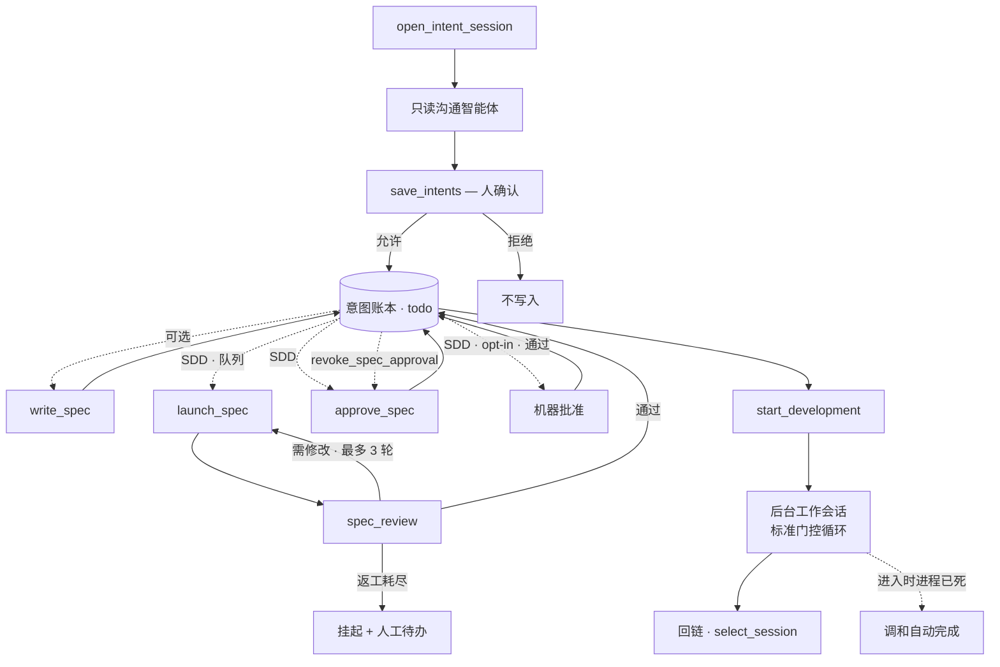

# Flow — Intent → Development

**场景。** 用户针对一个项目有了一个想法。只读沟通智能体把它细化为可验证的意图;人确认进账本;再挑一条启动为后台工作会话,经回链跟踪进度。

**领域。** intent-management · agent-session · permission-gateway · session-registry · agent-config。

本流程在会话层之上:先记下要构建什么,再送入 [prompt → gated run](flow-prompt-to-gated-run.md)。无人值守姊妹流程是 [自动化队列](flow-automation-orchestrator.md)。它复用运行循环与闸门,不持有权限状态。规则见 [intent-management](../domains/core/intent-management.md)。

## 流程图

```mermaid
flowchart TD
    IDEA[open_intent_session] --> COMM[只读沟通智能体]
    COMM --> SAVE[save_intents — 人确认]
    SAVE -- 允许 --> LEDGER[(意图账本 · todo)]
    SAVE -- 拒绝 --> X[不写入]
    LEDGER -. 可选 .-> SPEC[write_spec]
    SPEC --> LEDGER
    LEDGER -. SDD · 队列 .-> QSPEC[launch_spec]
    QSPEC --> REVIEW[spec_review]
    REVIEW -- 需修改 · 最多 3 轮 --> QSPEC
    REVIEW -- 返工耗尽 --> TODO[挂起 + 人工待办]
    REVIEW -- 通过 --> LEDGER
    LEDGER -. SDD .-> APPROVE[approve_spec]
    LEDGER -. SDD · opt-in · 通过 .-> MAPPROVE[机器批准]
    APPROVE --> LEDGER
    MAPPROVE --> LEDGER
    LEDGER -. revoke_spec_approval .-> APPROVE
    LEDGER --> LAUNCH[start_development]
    LAUNCH --> DEV[后台工作会话<br/>标准门控循环]
    DEV --> LINK[回链 · select_session]
    DEV -. 进入时进程已死 .-> REC[调和自动完成]
```

## 步骤

1. **web-console → intent-management。** `open_intent_session` 打开该工作区的沟通会话,并调和每条 `in_progress` 意图(`RM-R4`、`RM-R10`、`RM-R18`)。
2. **沟通智能体(只读)。** 强制 `default` 模式;可读项目与本项目账本,不可写入、执行、派生子智能体或跑斜杠命令(`RM-R2`、`RM-R3`、`RM-R19`)。
3. **intent-management。** 人确认后 `save_intents` 落库,新条以 `todo` 起步;人拒绝或校验失败则整批不写(`RM-R5`、`RM-R6`、`RM-R17`、`RM-R20`)。
4. **可选规格。** `write_spec` 开写入受限的规格会话(`RM-R21`)。SDD 或高影响时,未批准不得开发;从未写过规格且已有工作会话时,人工续跑或重启不拦。人发 `approve_spec` 清闸门、不自行启动;可 `revoke_spec_approval`(`RM-R22`、`RM-R23`、`RM-R33`、`RM-R51`)。
5. **web-console → intent-management。** `start_development` 认领意图,解析交付上下文与依赖后启动后台普通会话(`RM-R8`、`RM-R40`、`RM-R41`、`RM-R42`)。该会话走标准门控循环,断连后仍存活(`AS-R8`)。
6. **回链。** `select_session` 打开最近工作会话;会话已不存在则提示可重启,不崩溃(`RM-R13`)。

## 分支与异常

- **讨论转入。** `discussion_to_intent` 汇入同一条 `save_intents` 路径(`RM-R7`、`RM-R45`)。见 [discussion → intent](flow-discussion-to-intent.md)。
- **队列规格阶段。** SDD 下,队列对尚未过闸的 `automate` 意图自治撰写 → 审核 → 有限返工;机器批准为工作区显式 opt-in,且仍受 `RM-R51` 约束(`RM-R34`、`RM-R35`)。调度见 [自动化队列](flow-automation-orchestrator.md)。
- **规格延后。** 有效模式为 `fast` 时只绕开「必须先批准规格」;其余闸门不放宽(`RM-R43`、`RM-R51`)。
- **进入时调和。** 工作会话进程已死且判定完成,则自动标 `done`(`RM-R18`、`RM-R9`)。
- **会话收尾。** 手动工作会话结束时提交并推送,不改意图状态(`RM-R26`)。运行结束本身不把意图标 `done`(`RM-R9`)。
- **沟通会话绝不能写文件**(`RM-R2`)。
- **`save_intents` 绝不能在无人确认时持久化**(`RM-R3`、`RM-R5`)。
- **规格会话只写规格目录;审核会话对任意路径无写权;陈旧结论不算通过**(`RM-R21`、`RM-R34`)。
- **机器批准可撤销;高影响禁止机器批准**(`RM-R33`、`RM-R35`、`RM-R51`)。
- **账本不可用时意图入口返回 `error`,普通会话不受牵连**(`RM-R12`)。
