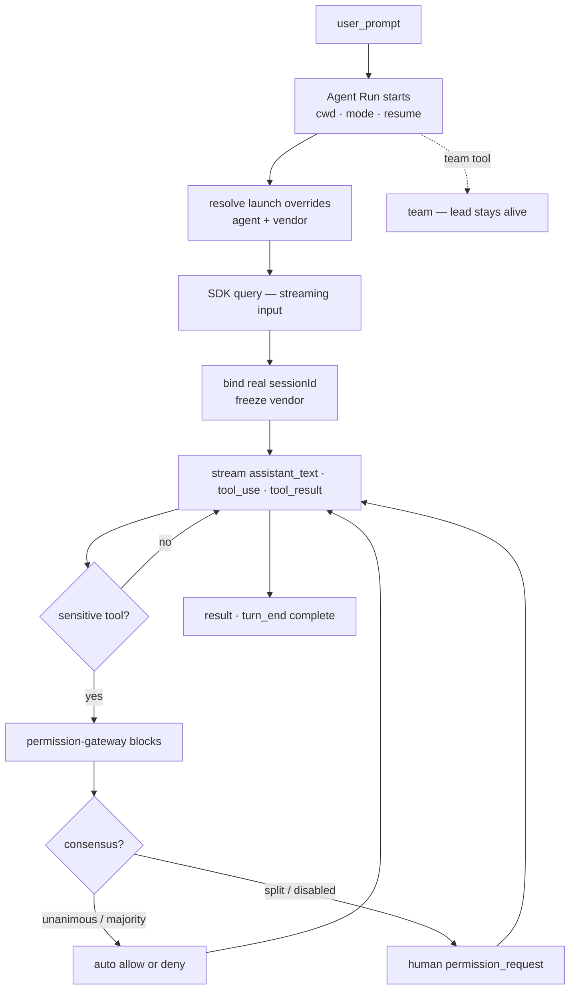

# Flow — Prompt → Gated Run

**场景。** 用户在浏览器中输入一段提示词,针对当前查看的会话提交。
智能体运行直至完成;每一个敏感工具都通过浏览器被门控;助手文本
与工具活动实时流式回传。

**领域。** web-console · session-registry · agent-config · agent-session · permission-gateway。

这是 c3 的核心循环 — 产品存在的理由([project.md](../project.md))。其他每一个
流程要么为它输送(intent、automation、discussion),要么为它加固(run resilience)。

## 流程图

## 前置条件

- 一个会话是该连接的**当前查看会话**(真实 id 或 `pending:`),
  由 [workspace & session lifecycle](flow-workspace-session-lifecycle.md) 播种。
- 会话的 `cwd`、权限模式和 `resume` id 由 Session Runtime 拥有
  (`AS-R1`);其智能体(以及冻结的厂商)由 agent-config 拥有(`AC-R4`、`AC-R6`)。

## 主路径

1. **web-console → agent-session。** 浏览器发送 `user_prompt`。运行时为当前查看的会话
   以该会话的 `cwd`、模式,以及(对真实 id 而言)`resume` 启动一个新的 Agent Run
   (`AS-R1`)。提示词以 `user_text` 回显,使所有查看者及切回重放都能看到它。
2. **agent-config → agent-session。** 会话启动解析为该次运行提供启动覆盖 —
   绑定智能体的厂商 + `model`/`baseUrl`/`apiKey`/`envOverrides`,否则是默认智能体的
   驱动(`AS-R*` 厂商说明,ADR-0011)。
3. **agent-session → SDK。** 该次运行以**流式输入模式**驱动 `query()`(`AS-R13`),
   保持控制通道存活,使 `set_mode`/stop 能够送达。
4. **agent-session → session-registry。** 第一条 `init` 消息报告 SDK 会话 id;一个
   待定会话**绑定**到该真实 id(`AS-R10`、`SR-R7`)并**冻结**其厂商
   (`AC-R16`)。`session_started` 被发出;运行时重新加键。
5. **SDK → agent-session → web-console。** 模型文本、工具使用与工具结果块映射为
   `assistant_text` / `tool_use` / `tool_result`(`AS-R9`);其他 SDK 种类被忽略。每个事件
   都被缓冲以供重放,并扇出给所有查看者(`AS-R11`)。
6. **敏感工具 → permission-gateway。** 当活动模式(`AS-R5`)把某个工具归类为
   敏感时,SDK 的 `canUseTool` 调用网关,网关产生恰好一个权限请求,并**阻塞
   该运行**(`PG-R1`/`PG-R2`)。运行时状态 → `awaiting_permission`
   (`AS-R12`)。
   - **6a. 共识预处理(若已启用)。** 当 `consensus.enabled` 且有 ≥1 个已启用的非本体
     对等体(**跨厂商**)时,该请求先被**归一化**为一个厂商中立的风险载荷,
     再提交给这些对等体;一致(或在多数票开关下,严格多数)的表决自动通过
     `consensus_auto` 解决(`PG-R9`、`PG-R13`,
     [consensus](../domains/core/permission-gateway/features/permission-gateway-consensus.md))。该自动决议同时
     落一条 `status: 'auto'` 的非阻塞 WaitUserInvolveEvent(携带 `outcome`)入 WorkCenter,使决策可追溯但不计徽章。
     一次分裂/弃权 — 包括一次导致所有投票者弃权的归一化失败 — 会
     回退到带有各方意见的人工提示(归一化失败绝不会自动允许)。
   - **6b. 人工提示。** 否则 `permission_request` 到达浏览器;人类回答
     `permission_response`(允许 → 原始输入不变,`PG-R6`;拒绝 → `PG-R7`)。默认是
     **拒绝**(`PG-R4`)。
7. **工具运行,循环继续。** 在 `allow` 时 SDK 继续;第 5–6 步重复,直到 SDK
   产出一个 `result`。
8. **agent-session → web-console。** `result` 结束该轮:`turn_end { reason: 'complete' }`
   (`AS-R7`)。一个非团队运行会关闭其输入流(下一次提示词会恢复一个全新进程,
   `AS-R15`);运行时落定为 `idle`。

## 分支 — 智能体团队

一次使用了**团队工具**(`TeamCreate` / `SendMessage` / 后台 `Agent`)的运行会在
轮次中被识别为一个持久化团队:标记为 `team` 一次,广播 `team_upgraded`(`AS-R14`)。
在 `result` 时,lead 进程**保持存活**(`AS-R15`);后续的 `user_prompt` 被**推送**进
存活的 lead 会话(不创建新进程,不用 `resume`),而不是启动第二次运行(`AS-R17`)。
该团队**仅**在显式停止时结束(`AS-R16`)。团队是**锁定 Claude 的** — 只有
具备 `streamingPush` 的厂商才能承载一个 lead(`AS-R21`)。

## 分支 — 后台执行与重放

该运行**不**绑定到发起它的连接(ADR-0006)。关闭套接字或
切换视图只会取消订阅;该运行在其运行时中继续(`AS-R8`)。一个返回的视图会
重放 `baseline + buffer`,不会重复(`AS-R11`),并恢复实时投送。一个待定的
权限请求在切换后仍然存活 — 它以 `requestId` 为键,回来后仍可回答(`PG-R3`)。

## 分支与例外(反场景)

- **同一会话内串行。** 在一轮进行中时发送第二个 `user_prompt` 会被
  `error` 拒绝,不启动任何东西(`AS-R2`) — 除了 `team` 会话,那种情况下
  它会被推送(`AS-R17`)。
- **切换/关闭绝不会停止一次运行。** 只有 `stop_run` / `delete_session` / `remove_workspace`
  可以(`AS-R6`/`AS-R8`)。
- **默认拒绝是绝对的。** 没有显式的允许 ⇒ 拒绝;一次已停止的运行把待定
  请求解析为拒绝(`PG-R4`)。in-loop(Claude)路径上没有超时(`PG-R2`)。
- **绝无静默的敏感执行。** 除非一个显式模式对其授权,否则 SDK 认为敏感的
  工具绝不会在没有浏览器决策的情况下运行(`AS-R5`;`bypassPermissions` 需要
  用户显式选择,constitution C-SEC-2/SEC-7)。
- **预批准 ≠ c3 已决策。** 一次 c3 从未决策过的厂商规则引擎自动允许,通过
  `preApproved` 被审计,在控制台中被清晰地展示出来 — 绝不作为第二条决策通道
  (`PG-R12`)。
