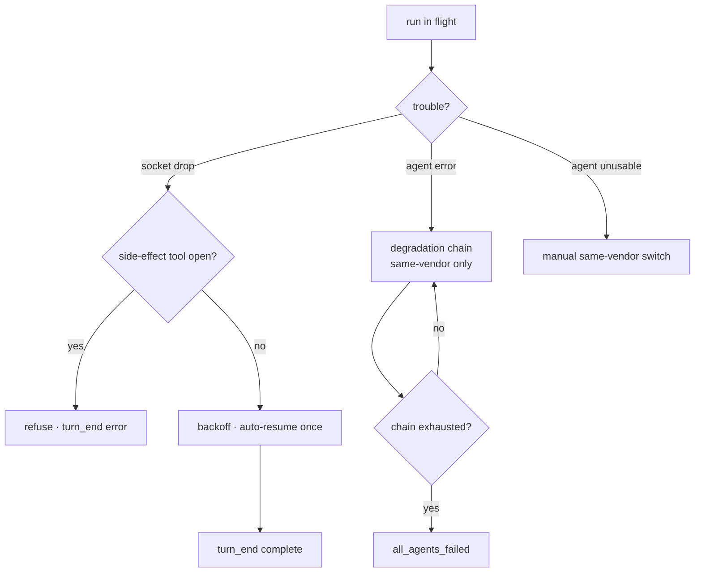

# Flow — Run Resilience

**场景。** 一次运行遇到了非用户之过的麻烦 — 智能体的传输套接字断开,
当前智能体无法工作(token 耗尽 / 限流 / 宿主二进制抖动),或某个厂商的
服务器不可达。c3 在不丢失上下文的情况下恢复,或者诚实地失败而绝不挂起。

**领域。** agent-session · agent-config · permission-gateway。

这个流程加固了 [prompt → gated run](flow-prompt-to-gated-run.md)。其压倒一切的不变式:
一次运行**绝不静默挂起** — 它总会到达一个终态 `turn_end`,或者自愈
(AVAIL-1/AVAIL-7)。

## 流程图

## 分支 A — 套接字断连(先预防,再恢复)

1. **预防(环境变量注入)。** 一次运行生成的每一个 Claude 子进程都会以**最低优先级**
   收到 keepalive 传输环境变量(`CLAUDE_CODE_REMOTE_SEND_KEEPALIVES`、Bun HTTP
   空闲/重试) — 用户/智能体的值会胜出(`AS-R20`)。这会降低源头处
   `socket connection was closed unexpectedly` 的发生率;它与恢复机制是解耦的。
2. **检测副作用安全性(闸门)。** 断连时,c3 会把 `tool_use`↔`tool_result` 配对,
   以推断轮次中途的状态。如果一个**具有副作用**的工具仍处于打开状态(尚无结果),
   自动恢复会被**拒绝** — 因为一次写入可能已经半途生效(`AS-R19`)。分类是保守的:
   只有一个固定的只读集合被视为无副作用;其余一切(包括未知/MCP)都算作
   有副作用。
3. **恢复(有边界的自动恢复)。** 对于一个闸门判定清晰的**普通**会话,该运行
   会退避 3–5 秒(状态 `reconnecting`,`AS-R12`),并以 `resume: runId` 自动
   `resume` **同一个**运行**一次**,保留完整上下文(`AS-R18`)。成功后 ⇒ `turn_end`
   携带 `reconnect_attempted: true`。
4. **诚实地失败。** 如果自动恢复被拒绝(`AS-R19`)、被禁用、没有真实 id、
   该会话是一个 `team`/`intent`,或者唯一一次重试已用尽,该轮以
   `turn_end { reason: 'error' }`(携带 `original_error` + 闸门判定)结束,并落定为
   `idle`。用户手动继续 — 一次普通的 `user_prompt` 会恢复同一个会话(`AS-R18`)。

## 分支 B — 智能体故障 → 降级链

1. **收集。** 一个可降级的智能体错误在可降级错误钩子处被收集;启动器
   在内核事件总线上发布 `agent:error`,**附加于**既有的连线帧之上(`AS-R25`,
   ADR-0018)。
2. **回退 — 仅限同厂商。** 链构建器只保留**同厂商**的链上智能体;
   一个不同厂商的条目会被**跳过,绝不启动**(`AS-R22`) — 一个 Claude 会话
   不能 `resume` 进 Codex。每一次回退前进都会发出 `agent_failed`,并发布
   `agent:fallback`。一次回退会打开一个**全新的**同厂商会话(降级绝不 resume)。
3. **耗尽。** 链耗尽时,启动器发出 `all_agents_failed`(携带失败列表以及任何
   `crossVendorSkipped`)并发布 `agent:all_failed`,使控制台能够诚实地陈述
   跨厂商候选未被尝试(`AS-R22`、`AS-R25`)。

## 分支 C — 手动同厂商智能体切换

当当前智能体不可用时,用户通过标题栏切换器(`set_session_agent`)重新
定向会话。候选来自与降级链**同样**的厂商同质规则
(`sameVendorEnabledAgents`,`AC-R19`):只有同厂商、宿主二进制存在、已启用的
对等体;跨厂商变更会被拒绝(`AS-R23`、`AC-R17`)。(共识投票不再共享这条规则 —
它通过 `selectConsensusVoters` 跨厂商挑选投票者;只有链和手动切换保持
厂商同质,因为不同厂商无法承载一个会话的上下文。)该切换只重写事实
本身 — 它**不**重新启动;下一次 `user_prompt` 会通过不变的启动路径,
用新智能体恢复同一个运行(`AS-R23`)。候选集合搭载在 `session_selected.agentSwitch` 上。

(`AS-R24`)。`select_session` 会在一个 2–10 秒的宽限窗口内惰性地(重新)启动它。
一个宕机的服务器会**诚实地降级并自愈**,通过后台退避,可达性从
同一来源翻转为遮罩层。它**绝不致命**(`AS-R24`)。

## 分支与例外(反场景)

- **可能发生写入之后绝不自动恢复。** 断连时一个打开的
  `Edit`/`Write`/`Bash`/未知工具 ⇒ `side_effect_pending`,拒绝,以 `error` 结束
  该轮(`AS-R19`)。倾向:宁可错过一次自动恢复,也不错误地重放一次写入。
- **有边界的重连。** 每轮最多**一次**自动恢复;一次被拒绝/耗尽的断连绝不能
  挂起 — 总是一个终态的 `turn_end`(`AS-R18`,AVAIL-1/AVAIL-7)。
- **无跨厂商降级/切换。** 厂商是冻结的(`AC-R17`);一个不同厂商的链条目
  或手动切换会被跳过/拒绝,绝不启动(`AS-R22`、`AS-R23`)。
- **订阅者隔离。** 一个内核总线订阅者的抛出会按 handler 逐一捕获,绝不会
  到达运行循环(`AS-R25`,ADR-0018);降级链的行为不受事件化影响。
